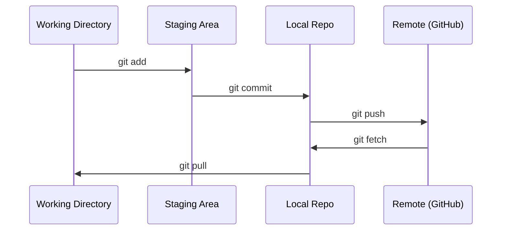

# Git & Collaboration

> Việc kiểm soát phiên bản không phải là một lựa chọn. Mỗi thí nghiệm bạn xây dựng trong đó, mỗi mô hình, mỗi bài học đều phải được theo dõi.

**Type:** Learn
**Languages:** --
**Prerequisites:** Phase 0, Lesson 01
**Time:** ~30 分钟

## Học mục tiêu
- 配置 git identity,并使用 thêm, cam kết và đẩy của dòng công việc hàng ngày
- Để tách biệt các thí nghiệm tạo ra và hợp nhất các chi nhánh, tránh phá hủy chính
- 编写一个 `.gitignore`, loại bỏ các điểm kiểm soát mô hình và các tệp nhị phân lớn
- Sử dụng `git log`浏览 commit lịch sử, hiểu sự phát triển của dự án

## 问题
Bạn sẽ trải qua 20 giai đoạn  biên tập hàng trăm tập tin mã ⋅ không kiểm soát phiên bản, bạn sẽ mất công việc ⋅ phá hủy những gì không thể hủy bỏ, hoặc không thể hợp tác với người khác ⋅

Git là một công cụ. GitHub là một mã ở nơi nào.

## 概念


记住三件事:
1. 经常保存(`git commit`(văn)
2. Đẩy đến từ xa`git push`(văn)
3. Để thử nghiệm  tạo ra chi nhánh`git checkout -b experiment`(văn)


```figure
s0-commit-dag
```

##  xây dựng nó
### 步骤 1: Cài đặt git

```bash
git config --global user.name "Your Name"
git config --global user.email "you@example.com"
```

### 步骤 2: 流工作日常

```bash
git status
git add file.py
git commit -m "Add perceptron implementation"
git push origin main
```

### 步骤 3:为实验创建分支

```bash
git checkout -b experiment/new-optimizer

# ... make changes, commit ...

git checkout main
git merge experiment/new-optimizer
```

### 步骤 4: Sử dụng khóa học này repo

```bash
git clone https://github.com/rohitg00/ai-engineering-from-scratch.git
cd ai-engineering-from-scratch

git checkout -b my-progress
# work through lessons, commit your code
git push origin my-progress
```

## Sử dụng nó
Đối với bài học này, bạn chỉ cần những lệnh này:

| Command | When |
|---------|------|
| `git clone` | 获取 course repo |
| `git add` + `git commit` | 保存你的工作 |
| `git push` | 备份到 GitHub |
| `git checkout -b` | 在不破坏 main 的情况下尝试东西 |
| `git log --oneline` | 查看你做过什么 |

就这些──本课程不需要重点,桃选或子模块──

## 练习
1. Trần hóa repo này, tạo ra một cái tên `my-progress`của chi nhánh, tạo ra một tập tin, tham gia nó, đẩy nó
2.  tạo ra một `.gitignore`, loại bỏ các tập tin kiểm soát mô hình`.pt``.pth``.safetensors`(văn)
3. 用 `git log --oneline`Xem lịch sử tham gia của repo này, và đọc bài học là làm thế nào được thêm vào

## 关键术语
| Term | What people say | What it actually means |
|------|----------------|----------------------|
| Commit | “保存” | 你的整个 project 在某个时间点的 snapshot |
| Branch | “一个副本” | 指向某个 commit 的 pointer，会随着你的工作向前移动 |
| Merge | “合并 code” | 把一个 branch 的 changes 应用到另一个 branch |
| Remote | “云端” | 托管在其他地方的 repo 副本（GitHub、GitLab） |
