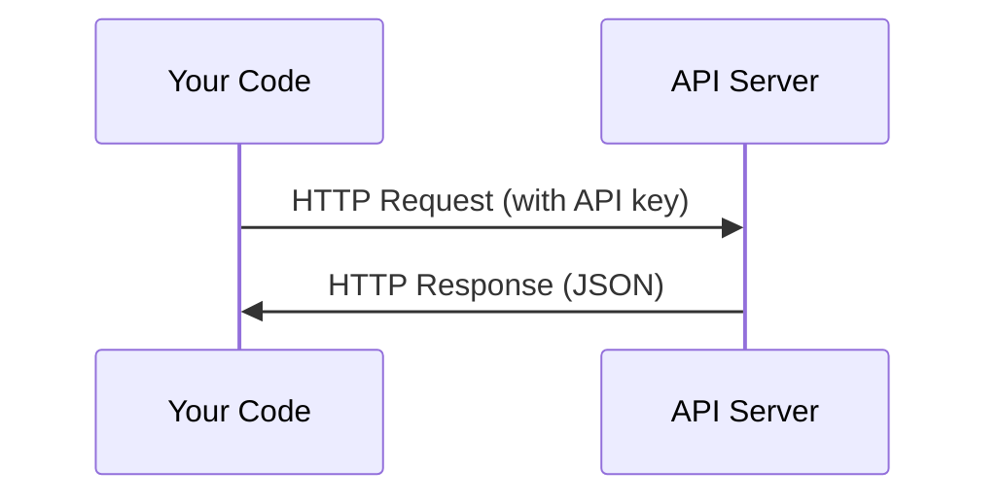

# API & Key

> Mỗi API AI làm việc theo cách tương tự: gửi yêu cầu, nhận được phản hồi.

**Type:** Build
**Languages:** Python, TypeScript
**Prerequisites:** Phase 0, Lesson 01
**Time:** ~30 分钟

## Học mục tiêu
- Sử dụng các biến môi trường và `.env`các tập tin Safe Storage API Key
- Đồng thời sử dụng Anthropic Python SDK và HTTP nguyên liệu  khởi động một lần LLM API gọi
- So sánh các định dạng yêu cầu / phản hồi dựa trên SDK và HTTP nguyên liệu, để gỡ lỗi
- 识别并处理 các lỗi API thường gặp, bao gồm xác thực và giới hạn tốc độ

## 问题
Từ giai đoạn 11  bắt đầu, bạn sẽ sử dụng các API LLM ((Anthropic、OpenAI、Google)  Trong giai đoạn 13-16 bạn sẽ xây dựng trong vòng lặp sử dụng các đại lý của các API này── bạn cần biết các khóa API làm thế nào để làm việc, lưu trữ chúng một cách an toàn, cũng như cách phát động cuộc gọi API đầu tiên của bạn──

## 概念


Mỗi cuộc gọi của API đều có:
1. Một điểm cuối (URL)
2. Một khóa API (định dạng)
3. Một đơn xin thân (từ cái gì mà anh muốn)
4. Một cơ thể phản ứng (được trả lời)


```figure
s0-secret-inject
```

##  xây dựng nó
### 步骤 1: khóa API lưu trữ an toàn

绝不要把 API key 放进代码――使用环境变量――

```bash
export ANTHROPIC_API_KEY="sk-ant-..."
export OPENAI_API_KEY="sk-..."
```

Hoặc sử dụng `.env`file(把它加入 `.gitignore`):

```
ANTHROPIC_API_KEY=sk-ant-...
OPENAI_API_KEY=sk-...
```

### 步骤 2: lần đầu tiên API 调用 (Python)

```python
import anthropic

client = anthropic.Anthropic()

response = client.messages.create(
    model="claude-sonnet-4-20250514",
    max_tokens=256,
    messages=[{"role": "user", "content": "What is a neural network in one sentence?"}]
)

print(response.content[0].text)
```

### 步骤 3: lần đầu tiên API 调用 (TypeScript)

```typescript
import Anthropic from "@anthropic-ai/sdk";

const client = new Anthropic();

const response = await client.messages.create({
  model: "claude-sonnet-4-20250514",
  max_tokens: 256,
  messages: [{ role: "user", content: "What is a neural network in one sentence?" }],
});

console.log(response.content[0].text);
```

### 步骤 4: HTTP Raw (không SDK)

```python
import os
import urllib.request
import json

url = "https://api.anthropic.com/v1/messages"
headers = {
    "Content-Type": "application/json",
    "x-api-key": os.environ["ANTHROPIC_API_KEY"],
    "anthropic-version": "2023-06-01",
}
body = json.dumps({
    "model": "claude-sonnet-4-20250514",
    "max_tokens": 256,
    "messages": [{"role": "user", "content": "What is a neural network in one sentence?"}],
}).encode()

req = urllib.request.Request(url, data=body, headers=headers, method="POST")
with urllib.request.urlopen(req) as resp:
    result = json.loads(resp.read())
    print(result["content"][0]["text"])
```

Đó là những gì SDK làm đằng sau.

## Sử dụng nó
Đối với本课程:

| API | When you need it | Free tier |
|-----|-----------------|-----------|
| Anthropic (Claude) | Phases 11-16（agents, tools） | 注册赠送 $5 credit |
| OpenAI | Phase 11（comparison） | 注册赠送 $5 credit |
| Hugging Face | Phases 4-10（models, datasets） | Free |

Bạn bây giờ không cần thiết lập tất cả các bài học.

## 交付 nó
Bài học 会产出:
- `outputs/prompt-api-troubleshooter.md`- 诊断常见 API lỗi

## 练习
1. Nhận một khóa API Anthropic, và khởi động cuộc gọi API đầu tiên của bạn
2. 尝试 raw HTTP 版本,并将 phản hồi định dạng so với SDK 版本
3. 故意使用错误的API key,并读错误消息

## 关键术语
| Term | What people say | What it actually means |
|------|----------------|----------------------|
| API key | "Password for the API" | 一个唯一字符串，用于标识你的 account 并授权 requests |
| Rate limit | "They're throttling me" | 每分钟/每小时最大 requests 数量，用于防止滥用并确保公平使用 |
| Token | "A word"（在 API 语境中） | 一个 billing unit：input 和 output Tokens 会被分别计数并收费 |
| Streaming | "Real-time responses" | 逐词获取 response，而不是等待完整 response |
