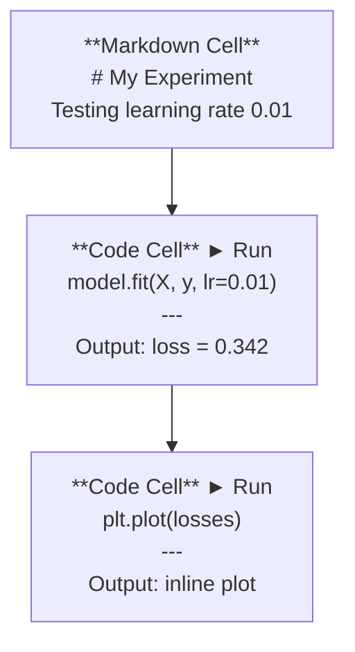
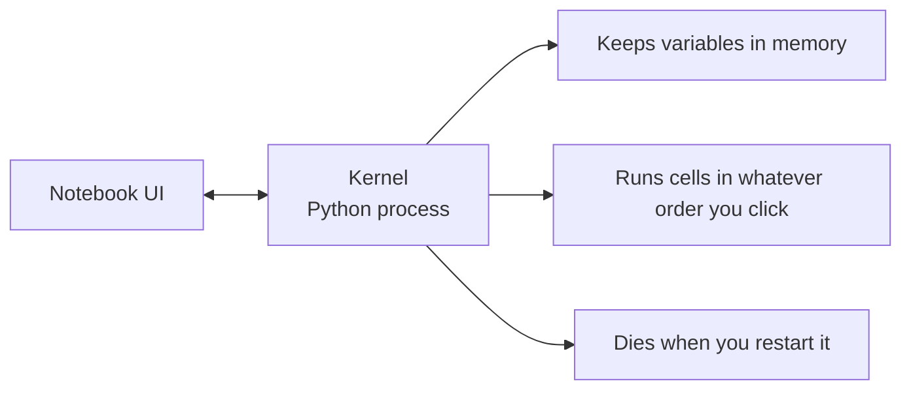

# Các sổ ghi chép Jupyter

> Cuốn sổ cái là một thử nghiệm của kỹ thuật AI. Bạn làm nguyên mẫu ở đây, sau đó chuyển phần hiệu quả vào sản xuất.

**类型：**Xây dựng
**语言：**Python
**前置要求：**Giai đoạn 0, Bài học 01
**时间：**Khoảng 30 phút

## Học mục tiêu

- Lắp đặt và khởi động JupyterLab、Jupyter Notebook, hoặc mang theo Khóa VS của Jupyter mở rộng
- Sử dụng lệnh phép thuật`%timeit``%%time``%matplotlib inline`) để đánh giá và trực tuyến 可视化
- 区分何时使用笔记本、何时使用脚本,并应用 在笔记本中探索, 在脚本中交交付的工作流
- 识别并避免常见笔记本 陷:乱序执行、隐藏状态和内存泄漏

## 问题

Mỗi bài báo AI、 hướng dẫn 和 Kaggle cạnh tranh đều sử dụng sổ cái Jupyter── chúng cho bạn phân đoạn vận hành mã 、 trực tuyến 查看输出、混合代码与说明,并快速代── nếu bạn cố gắng không sử dụng sổ cái học AI,就像做数学作业却没有草稿纸──

Nhưng sổ ghi chép thực sự có những rào cản. Người ta sử dụng chúng cho mọi thứ, bao gồm cả những thứ mà chúng rất không giỏi.

## 概念

Notebook là một danh sách gồm một nhóm các đơn vị. Mỗi đơn vị đều có mã hoặc văn bản.



Kernel là một quá trình Python chạy sau đó. Khi bạn chạy một tế bào, nó sẽ gửi mã đến hạt nhân, hạt nhân thực hiện mã và đưa kết quả trở lại. Tất cả các tế bào chia sẻ cùng một hạt nhân, vì vậy biến số sẽ được giữ lại giữa các tế bào.



 Bạn theo thứ tự nào đó, bạn sẽ chạy theo thứ tự nào đó.


```figure
s0-cell-order
```

## 构建

### 步骤 1:  chọn giao diện của bạn

三种选择,同一种格式:

| Interface | Install | Best for |
|-----------|---------|----------|
| JupyterLab | `pip install jupyterlab` then `jupyter lab` | 完整 IDE 体验、多标签、文件浏览器、terminal |
| Jupyter Notebook | `pip install notebook` then `jupyter notebook` | 简单、轻量、一次一个 notebook |
| VS Code | Install "Jupyter" extension | 已在你的 editor 中、git 集成、debugging |

三者都读写同一个 `.ipynb`文件──选你喜欢的即可──JupyterLab là lựa chọn phổ biến nhất trong công việc AI──

```bash
pip install jupyterlab
jupyter lab
```

### 步骤 2: 重要键盘快捷键

Bạn sẽ hoạt động trong hai mô hình.`Escape`进入 lệnh mode(左侧蓝色),按 `Enter`进入 edit mode(绿色)。

**Command mode（最常用）：**

| Key | Action |
|-----|--------|
| `Shift+Enter` | 运行 cell，移动到下一个 |
| `A` | 在上方插入 cell |
| `B` | 在下方插入 cell |
| `DD` | 删除 cell |
| `M` | 转换为 markdown |
| `Y` | 转换为 code |
| `Z` | 撤销 cell 操作 |
| `Ctrl+Shift+H` | 显示所有快捷键 |

**Edit mode：**

| Key | Action |
|-----|--------|
| `Tab` | Autocomplete |
| `Shift+Tab` | 显示函数签名 |
| `Ctrl+/` | 切换 comment |

`Shift+Enter`Bạn sẽ dùng các khóa nhanh hàng ngàn lần mỗi ngày.

### 步骤 3: Cây 类型

**Code cells**运行 Python 并显示输出:

```python
import numpy as np
data = np.random.randn(1000)
data.mean(), data.std()
```

输出:`(0.0032, 0.9987)`

**Markdown cells**染格式化文本── dùng chúng ghi lại những gì bạn đang làm và tại sao bạn làm như vậy── hỗ trợ tiêu đề、bold、italic、LaTeX math(`$E = mc^2$`) 、 bảng và hình ảnh

### 步骤 4: Các lệnh phép thuật

Đây không phải là Python. Chúng là lệnh đặc biệt của Jupiter.`%`(đạo thuật đường dây) hoặc `%%`(bức thần tế bào)

**为你的代码计时：**

```python
%timeit np.random.randn(10000)
```

输出:`45.2 us +/- 1.3 us per loop`

```python
%%time
model.fit(X_train, y_train, epochs=10)
```

输出:`Wall time: 2.34 s`

`%timeit`会多次运行代码并取平均.`%%time`Chỉ chạy một lần thôi.`%timeit`Làm dấu hiệu microbenchmarks, dùng `%%time`Làm các cuộc tập luyện.

**启用 inline plots：**

```python
%matplotlib inline
```

现在每个 `plt.plot()`Hoặc`plt.show()`Thành phố sẽ trực tiếp trong sổ ghi chép.

**不离开 notebook 安装 packages：**

```python
!pip install scikit-learn
```

`!`前会运行 bất kỳ lệnh shell nào.

**检查环境变量：**

```python
%env CUDA_VISIBLE_DEVICES
```

### 步骤 5: Inline 显示 output giàu

Cuốn sổ ghi chép sẽ tự động hiển thị biểu hiện cuối cùng trong tế bào... nhưng bạn cũng có thể kiểm soát nó:

```python
import pandas as pd

df = pd.DataFrame({
    "model": ["Linear", "Random Forest", "Neural Net"],
    "accuracy": [0.72, 0.89, 0.94],
    "training_time": [0.1, 2.3, 45.6]
})
df
```

Đây sẽ là một bảng HTML định dạng, thay vì thư mục.

```python
import matplotlib.pyplot as plt

plt.figure(figsize=(8, 4))
plt.plot([1, 2, 3, 4], [1, 4, 2, 3])
plt.title("Inline Plot")
plt.show()
```

Plot 会出现在细胞 正下方──这是笔记本 主导 AI 工作的原因──你可以同时看到数据、plot 和代码──

 Đối với hình ảnh:

```python
from IPython.display import Image, display
display(Image(filename="architecture.png"))
```

### 步骤 6: Google Colab

Colab là máy tính xách tay miễn phí của云端 Jupyter. Nó cung cấp các thư viện GPU, cài đặt sẵn và Google Drive.

1. 前往 [colab.research.google.com](https://colab.research.google.com)
2. 上传本课程中的任意 `.ipynb`文件
3. Thời gian chạy > Thay đổi loại thời gian chạy > T4 GPU(免费)

Sự khác biệt giữa Colab và Jupyter địa phương:
- Các tập tin không được lưu trong các phiên  lưu trữ ( lưu đến Drive hoặc tải xuống)
- 预装:numpy、pandas、matplotlib、torch、tensorflow、sklearn
- Sử dụng `from google.colab import files`上传/ download file
- Sử dụng `from google.colab import drive; drive.mount('/content/drive')`Làm lưu trữ lâu dài
- 免费层会议在90分不活动后会超时

## 使用

### Notebook vs Script:何时使用哪一个

| Use notebooks for | Use scripts for |
|-------------------|-----------------|
| 探索 dataset | Training pipelines |
| Prototype model | Reusable utilities |
| 可视化结果 | 任何包含 `if __name__` 的东西 |
| 解释你的工作 | 按计划运行的 code |
| 快速 experiments | Production code |
| Course exercises | Packages and libraries |

Quy tắc:**在 notebooks 中探索，在 scripts 中交付**

AI trong thường thấy dòng làm việc:
1. Trong sổ ghi chép tìm kiếm dữ liệu
2. Trong sổ ghi chép nguyên mẫu của bạn mô hình
3. Một khi có thể, chúng ta chuyển mã đến`.py`tập tin
4. Đặt những thứ này`.py`File tái nhập vào sổ ghi chép, để sử dụng các thí nghiệm tiếp theo

### 常见陷

**乱序执行。**Bạn chạy trước tế bào 5, tái chạy trước tế bào 2, tái chạy trước tế bào 7。 sổ ghi chép trên máy của bạn có thể sử dụng, nhưng người khác sẽ bị hỏng từ trên xuống xuống khi chạy。

**隐藏状态。**Bạn đã xóa một tế bào, nhưng các biến thể nó tạo ra vẫn còn trong bộ nhớ.

**内存泄漏。**Lên bộ dữ liệu 4GB │ mô hình đào tạo │ Lên lại một bộ dữ liệu khác │ │ │ │ │ │ │ │ │ │ │ │ │ │ │ │ │ │ │ │ │ │ │ │ │ │ │ │ │ │ │ │ │ │ │ │ │ │ │ │ │ │ │ │ │ │ │ │ │ │ │ │ │ │ │ │ │ │ │ │ │ │ │ │ │ │ │ │ │ │ │ │ │ │ │ │ │ │ │ │ │ │ │ │ │ │ │ │ │ │ │ │ │ │ │ │ │ │ │ │ │ │ │ │ │ │ │ │ │ │ │ │ │ │ │ │ │ │ │ │ │ │ │ │ │ │ │ │ │ │ │ │ │ │ │ │ │ │ │ │ │ │ │ │ │ │ │ │ │ │ │`del variable_name`和 `gc.collect()`, hoặc khởi động lại hạt nhân

## 交付

本课会产出:
- `outputs/prompt-notebook-helper.md`, để điều tra sổ ghi chép 问题

## 练习

1. 打开 JupyterLab, tạo một sổ ghi chép,并使用 `%timeit`So sánh sự hiểu biết danh sách với numpy trong việc tạo ra 100.000 个随机数组 时差
2.  tạo một notebook đồng thời chứa dấu chỉ và các tế bào mã, tải CSV, hiển thị khung dữ liệu, và vẽ biểu đồ.
3. - Đưa đi.`code/notebook_tips.py`Mã trong  dán vào máy tính xách tay Colab Trong,并 sử dụng GPU miễn phí 运行

## 关键术语

| Term | What people say | What it actually means |
|------|----------------|----------------------|
| Kernel | “运行我代码的东西” | 一个独立的 Python process，用来执行 cells 并在内存中保存变量 |
| Cell | “一个 code block” | Notebook 中可独立运行的单元，可以是 code 或 markdown |
| Magic command | “Jupyter 技巧” | 以 `%` 或 `%%` 为前缀、用于控制 notebook 环境的特殊命令 |
| `.ipynb` | “Notebook file” | 一个包含 cells、outputs 和 metadata 的 JSON 文件。代表 IPython Notebook |

## 延伸阅读

- [JupyterLab Docs](https://jupyterlab.readthedocs.io/)查看完整功能集
- [Google Colab FAQ](https://research.google.com/colaboratory/faq.html)查看 Colab 特定限制与功能
- [28 Jupyter Notebook Tips](https://www.dataquest.io/blog/jupyter-notebook-tips-tricks-shortcuts/)查看进阶快捷键
