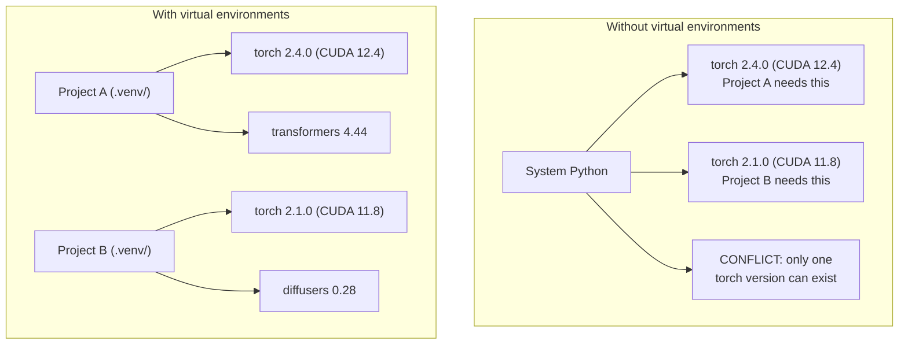

# Python môi trường

> Sự phụ thuộc thật sự tồn tại.

**Type:** Build
**Languages:** Shell
**Prerequisites:** Phase 0, Lesson 01
**Time:** ~30 分钟

## Mục tiêu học tập

- Sử dụng `uv``venv`Hoặc`conda`Tạo môi trường ảo tách biệt
- 编写带有 tùy chọn nhóm phụ thuộc của `pyproject.toml`, tạo ra các tệp khóa để đảm bảo khả năng tái tạo
- 诊断并修复常见陷: cài đặt toàn cầu pip/conda 混用、CUDA phiên bản không phù hợp
- Các dự án có sự phụ thuộc vào xung đột thực hiện chiến lược môi trường phân chia theo giai đoạn

## 问题

Bạn đã cài đặt PyTorch 2.4... ...đối với một dự án chỉnh sửa tốt, một dự án khác cần PyTorch 2.1, vì xây dựng CUDA của nó đã được cố định.

Đó là một cái chết của sự phụ thuộc. Nó thường xảy ra trong AI / ML, bởi vì:

- PyTorch、JAX 和 TensorFlow mỗi người mang theo các liên kết CUDA của riêng mình
- Các thư viện mô hình sẽ cố định các phiên bản khung cụ thể
- toàn cảnh`pip install`会覆盖 nội dung đã có trước đây
- CUDA 11.8 xây dựng không thể với CUDA 12.x trình điều khiển 配合使用,反之亦然

Giải pháp: Mỗi dự án đều có môi trường riêng biệt, cũng như các gói riêng của mình.

## 概念




```figure
s0-env-isolation
```

## Hãy xây dựng nó

### 选项 1:uv venv(推)

`uv`là trình quản lý gói Python nhanh nhất ((比 pip 快 10-100 倍) ⋅ nó trong một công cụ xử lý môi trường ảo、 phiên bản Python và độ phân giải phụ thuộc。

```bash
curl -LsSf https://astral.sh/uv/install.sh | sh

uv python install 3.12

cd your-project
uv venv
source .venv/bin/activate
```

Bộ gói:

```bash
uv pip install torch numpy
```

Một bước tạo `pyproject.toml`Dự án:

```bash
uv init my-ai-project
cd my-ai-project
uv add torch numpy matplotlib
```

### 选项 2:venv(内置)

Nếu không thể cài đặt `uv`,Python tự带 `venv`- Có thể là:

```bash
python3 -m venv .venv
source .venv/bin/activate  # Linux/macOS
.venv\Scripts\activate     # Windows

pip install torch numpy
```

比 `uv`慢, nhưng trong cài đặt Python ở nơi nào cũng có thể làm việc.

### 选项 3:conda(需要时使用)

Conda  quản lý các bộ công cụ CUDA, các thư viện cuDNN và C và các phụ thuộc khác ngoài Python.

- Bạn cần phải xác định phiên bản CUDA Toolkit, nhưng không muốn trong hệ thống lắp đặt toàn bộ
- Bạn đang chia sẻ cluster trên, không thể cài đặt các gói hệ thống
- 某图书馆的安装说明写着 使用公寓

```bash
# Install miniconda (not the full Anaconda)
curl -LsSf https://repo.anaconda.com/miniconda/Miniconda3-latest-Linux-x86_64.sh -o miniconda.sh
bash miniconda.sh -b

conda create -n myproject python=3.12
conda activate myproject

conda install pytorch torchvision torchaudio pytorch-cuda=12.4 -c pytorch -c nvidia
```

Một条规则: Nếu bạn sử dụng conda trong một môi trường nào đó, hãy sử dụng conda để quản lý các gói trong môi trường đó.`pip install`混进 conda env sẽ gây ra xung đột phụ thuộc, và调试起来 rất đau khổ.

### 本课程: theo giai đoạn của chiến lược

Bạn có thể tạo ra một môi trường cho toàn lớp học. Đừng làm như vậy.

策略:

```
ai-engineering-from-scratch/
├── .venv/                    <-- phases 0-3 共用的轻量 env
├── phases/
│   ├── 04-neural-networks/
│   │   └── .venv/            <-- PyTorch env
│   ├── 05-cnns/
│   │   └── .venv/            <-- 同一个 PyTorch env（symlink 或 shared）
│   ├── 08-transformers/
│   │   └── .venv/            <-- 可能需要不同的 transformer versions
│   └── 11-llm-apis/
│       └── .venv/            <-- API SDKs，不需要 torch
```

`code/env_setup.sh`Trung học văn bản sẽ được thực hiện trong chương trình tạo ra môi trường cơ bản.

## pyproject.toml 基础

Mỗi dự án Python đều có một dự án`pyproject.toml` Nó dùng một tài liệu thay thế `setup.py``setup.cfg`和 `requirements.txt`

```toml
[project]
name = "ai-engineering-from-scratch"
version = "0.1.0"
requires-python = ">=3.11"
dependencies = [
    "numpy>=1.26",
    "matplotlib>=3.8",
    "jupyter>=1.0",
    "scikit-learn>=1.4",
]

[project.optional-dependencies]
torch = ["torch>=2.3", "torchvision>=0.18"]
llm = ["anthropic>=0.39", "openai>=1.50"]
```

Sau đó cài đặt:

```bash
uv pip install -e ".[torch]"    # base + PyTorch
uv pip install -e ".[llm]"     # base + LLM SDKs
uv pip install -e ".[torch,llm]" # everything
```

## Các file khóa

Lockfile sẽ đưa mọi phụ thuộc (bao gồm cả các phụ thuộc chuyển tiếp) được cố định cho phiên bản chính xác. Điều này đảm bảo khả năng tái hiện: bất cứ ai từ khóafile cài đặt, đều sẽ nhận được các gói hoàn toàn giống nhau.

```bash
# uv generates uv.lock automatically when using uv add
uv add numpy

# pip-tools approach
uv pip compile pyproject.toml -o requirements.lock
uv pip install -r requirements.lock
```

Đặt tập tin khóa của bạn để giao tiếp. Sau khi người khác nhân bản repo, cài đặt tập tin khóa, bạn sẽ nhận được các phiên bản hoàn toàn phù hợp.

## 常见错误

### 1. toàn bộ bộ bộ

```bash
pip install torch  # BAD: installs to system Python

source .venv/bin/activate
pip install torch  # GOOD: installs to virtual environment
```

检查你的包会安装到哪里:

```bash
which python       # should show .venv/bin/python, not /usr/bin/python
which pip           # should show .venv/bin/pip
```

### 2. 混用 pip 和 conda

```bash
conda create -n myenv python=3.12
conda activate myenv
conda install pytorch -c pytorch
pip install some-other-package   # BAD: can break conda's dependency tracking
conda install some-other-package # GOOD: let conda manage everything
```

Nếu bạn phải sử dụng pipe trong con số đó, hãy cài đặt tất cả các gói con số trước, và cài đặt lại các gói pipe sau đó.

### 3. 忘记 kích hoạt

```bash
python train.py           # uses system Python, missing packages
source .venv/bin/activate
python train.py           # uses project Python, packages found
```

Bạn của Shell prompt 应显示 tên môi trường:

```
(.venv) $ python train.py
```

### 4. Đưa .venv cam kết đến git

```bash
echo ".venv/" >> .gitignore
```

Môi trường ảo thường có 200MB-2GB. Chúng là địa phương, không thể được chuyển giữa máy tính.`pyproject.toml`Và khóa file.

### 5. CUDA phiên bản không phù hợp

```bash
nvidia-smi                # shows driver CUDA version (e.g., 12.4)
python -c "import torch; print(torch.version.cuda)"  # shows PyTorch CUDA version

# These must be compatible.
# PyTorch CUDA version must be <= driver CUDA version.
```

## Sử dụng nó

运行 kịch bản thiết lập  tạo môi trường khóa học của bạn:

```bash
bash phases/00-setup-and-tooling/06-python-environments/code/env_setup.sh
```

Nó sẽ ở repo root tạo ra một .`.venv`,并安装和验证 các phụ thuộc cốt lõi.

## 练习

1. 运行 `env_setup.sh`Và xác nhận tất cả các kiểm tra đều qua
2. Tạo một môi trường ảo thứ hai, trong đó cài đặt các phiên bản khác nhau của numpy, và xác nhận hai môi trường  cách ly lẫn nhau
3. Để một dự án đồng thời cần PyTorch và SDK nhân đạo 编写 `pyproject.toml`
4. Vì vậy, toàn bộ bộ bộ cài đặt một gói, không kích hoạt venv, quan sát nó đi đâu, sau đó gỡ bỏ nó.

## 关键术语

| Term | What people say | What it actually means |
|------|----------------|----------------------|
| Virtual environment | “A venv” | 一个隔离目录，包含 Python interpreter 和 packages，并与 system Python 分离 |
| Lockfile | “Pinned dependencies” | 一个列出每个 package 及其精确 version 的文件，保证跨机器安装一致 |
| pyproject.toml | “The new setup.py” | 标准 Python project 配置文件，替代 setup.py/setup.cfg/requirements.txt |
| Transitive dependency | “A dependency of a dependency” | Package B 依赖 C；如果你安装依赖 B 的 A，那么 C 就是 A 的 transitive dependency |
| CUDA mismatch | “My GPU isn't working” | PyTorch 编译所用的 CUDA version 与你的 GPU driver 支持的版本不同 |
