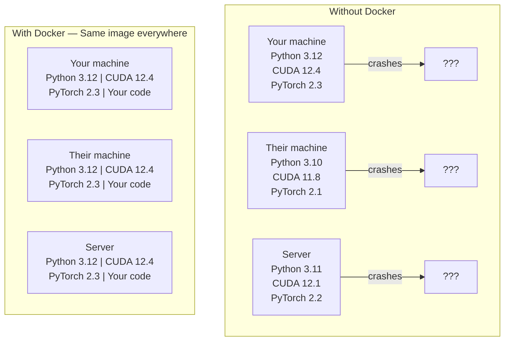

# Docker cho AI

> Các container 让 trên máy của tôi có thể chạy  trở thành quá khứ.

**Type:** Build
**Languages:** Docker
**Prerequisites:** Phase 0, Lessons 01 and 03
**Time:** ~60 分钟

## Mục tiêu học tập

- Từ Dockerfile  xây dựng hình ảnh Docker của GPU, bao gồm CUDA、PyTorch và thư viện AI
- Để cài đặt các thư mục chủ nhà như khối lượng, để xây dựng lại các container  giữa các mô hình, bộ dữ liệu và mã
-  cấu hình NVIDIA Container Toolkit, để container  bên trong có thể truy cập GPU
- Sử dụng Docker Compose 编排多服务 AI ứng dụng(Inference server + vector database)

## 问题

Bạn trên máy tính xách tay trên sử dụng PyTorch 2.3、CUDA 12.4 và Python 3.12  đào tạo một mô hình. Bạn cùng làm việc sử dụng PyTorch 2.1、CUDA 11.8 và Python 3.10── mô hình của bạn trên máy tính của họ sụp đổ.

Các dự án AI là những cơn ác mộng phụ thuộc. Một tập hợp điển hình bao gồm Python, Python, Python, Python, Python, Python, Python, Python, Python, Python, Python, Python, Python, Python, Python, Python, Python, Python, Python, Python, Python, Python, Python, Python, Python, Python, Python, Python, Python, Python, Python, Python, Python, Python, Python, Python, Python, Python, Python, Python, Python, Python, Python, Python, Python, Python, Python, Python, Python, Python, Python, Python, Python, Python, Python, Python, Python, Python, Python, Python, Python, Python, Python, Python, Python, Python, Python, Python, Python, Python, Python, Python, Python, Python, Python, Python, Python, Python, Python, Python, Python, Python, Python, Python, Python, Python, Python, Python, Python, Python, Python, Python, Python, Python, Python, Python, Python, Python, Python, Python, Python, Python, Python, Python, Python, Python, Python, Python, Python, Python, Python, Python, Python, Python, Python, Python, Python, Python, Python, Python, Python, Python, Python, Python, Python, Python, Python, Python, Python, Python, Python, Python, Python, Python, Python, Python, Python, Python, Python, Python, Python, Python, Python, Python, Python, Python, Python, Python, Python, Python, Python, Python, Python, Python, Python, Python, Python, Python, Python, Python, Python, Python, Python, Python, Python, Python, Python, Python, Python, Python, Python, Python, Python, Python, Python, Python, Python, Python, Python, Python, Python, Python, Python, Python, Python, Python, Python, Python, Python, Python, Python, Python, Python, Python, Python, Python, Python, Python, Python, Python, Python, Python, Python, Python, Python, Python, Python, Python, Python, Python, Python, Python, Python, Python, Python, Python, Python, Python, Python, Python, Python, Python, Python, Python, Python, Python, Python, Python, Python, Python, Python, Python, Python, Python, Python, Python, Python, Python, Python, Python, Python, Python, Python, Python, Python,

## 概念

Docker sẽ đưa mã của bạn, thời gian chạy, thư viện và các công cụ hệ thống được đóng gói vào một đơn vị tách biệt được gọi là container. Bạn có thể xem nó như một máy ảo hạng nhẹ, chỉ đơn giản là nó chia sẻ lõi máy chủ OS, thay vì chạy lõi của riêng mình, do đó khởi động chỉ mất vài giây, thay vì vài phút.



### Tại sao các dự án AI cần Docker hơn hầu hết các dự án

1. **GPU drivers 很脆弱。**CUDA 12.4 mã 不能在 CUDA 11.8 上运行──Docker 会隔离容器内的 CUDA toolkit, đồng thời thông qua NVIDIA Container Toolkit 共享主机 GPU trình điều khiển──

2. **Model weights 很大。**Một mô hình tham số 7B trong fp16 dưới có 14 GB. Bạn sẽ không muốn trong mỗi lần xây dựng lại ải tải lại nó.

3. **Multi-service architectures 很常见。**Một ứng dụng AI thực sự không chỉ là một kịch bản Python. Nó là máy chủ suy luận. Nó được sử dụng cho cơ sở dữ liệu vector RAG. Có thể còn là đầu cuối web. Docker Compose sử dụng một lệnh sắp xếp tất cả các dịch vụ này.

### 关键词汇

| Term | What it means |
|------|---------------|
| Image | 只读 template。你的 recipe。由 Dockerfile 构建。 |
| Container | image 的运行实例。你的 kitchen。 |
| Dockerfile | 构建 image 的 instructions。逐层构建。 |
| Volume | 可在 container restarts 后保留的持久化 storage。 |
| docker-compose | 用 YAML 定义 multi-container applications 的工具。 |

### AI 中常见的容器模式

```
Dev Container
  完整 toolkit。Editor support。Jupyter。Debugging tools。
  用于 development 和 experimentation。

Training Container
  最小化。只有 training script 和 dependencies。
  在 GPU clusters 上运行。没有 editor，没有 Jupyter。

Inference Container
  为 serving 优化。Small image。Fast cold start。
  在 production 中运行于 load balancer 后方。
```


```figure
s0-image-layers
```

## Hãy xây dựng nó

### Bước 1: Lắp đặt Docker

```bash
# macOS
brew install --cask docker
open /Applications/Docker.app

# Ubuntu
curl -fsSL https://get.docker.com | sh
sudo usermod -aG docker $USER
# Log out and back in for group change to take effect
```

验证:

```bash
docker --version
docker run hello-world
```

### Bước 2: Lắp đặt NVIDIA Container Toolkit (đồng NVIDIA GPU của Linux)

Điều này cho phép các container Docker  thể truy cập vào GPU của bạn. MacOS và Windows (WSL2) người dùng có thể nhảy qua; Docker Desktop trên các nền tảng này xử lý GPU theo cách khác nhau qua.

```bash
distribution=$(. /etc/os-release;echo $ID$VERSION_ID)
curl -fsSL https://nvidia.github.io/libnvidia-container/gpgkey | sudo gpg --dearmor -o /usr/share/keyrings/nvidia-container-toolkit-keyring.gpg
curl -s -L https://nvidia.github.io/libnvidia-container/$distribution/libnvidia-container.list | \
    sed 's#deb https://#deb [signed-by=/usr/share/keyrings/nvidia-container-toolkit-keyring.gpg] https://#g' | \
    sudo tee /etc/apt/sources.list.d/nvidia-container-toolkit.list

sudo apt-get update
sudo apt-get install -y nvidia-container-toolkit
sudo nvidia-ctk runtime configure --runtime=docker
sudo systemctl restart docker
```

Trong container 内测试 truy cập GPU:

```bash
docker run --rm --gpus all nvidia/cuda:12.4.1-base-ubuntu22.04 nvidia-smi
```

Nếu bạn thấy thông tin về GPU, hãy chỉ ra công cụ của bạn.

### Bước 3: Nghĩ hình ảnh cơ bản

选择正确的基image可以节省几个小时调试时间──

```
nvidia/cuda:12.4.1-devel-ubuntu22.04
  完整 CUDA toolkit。包含 compilers。
  Use for: 构建需要 nvcc 的 packages（flash-attn、bitsandbytes）
  Size: ~4 GB

nvidia/cuda:12.4.1-runtime-ubuntu22.04
  仅 CUDA runtime。没有 compilers。
  Use for: 运行 pre-built code
  Size: ~1.5 GB

pytorch/pytorch:2.3.1-cuda12.4-cudnn9-runtime
  基于 CUDA 预装 PyTorch。
  Use for: 跳过 PyTorch install step
  Size: ~6 GB

python:3.12-slim
  没有 CUDA。仅 CPU。
  Use for: CPU inference、lightweight tools
  Size: ~150 MB
```

### Bước 4: Để phát triển AI 编写 Dockerfile

Đó là `code/Dockerfile`Trung ương Dockerfile── từng đoạn xem:

```dockerfile
FROM nvidia/cuda:12.4.1-devel-ubuntu22.04

ENV DEBIAN_FRONTEND=noninteractive
ENV PYTHONUNBUFFERED=1

RUN apt-get update && apt-get install -y --no-install-recommends \
    python3.12 \
    python3.12-venv \
    python3.12-dev \
    python3-pip \
    git \
    curl \
    build-essential \
    && rm -rf /var/lib/apt/lists/*

RUN update-alternatives --install /usr/bin/python python /usr/bin/python3.12 1

RUN python -m pip install --no-cache-dir --upgrade pip setuptools wheel

RUN python -m pip install --no-cache-dir \
    torch==2.3.1 \
    torchvision==0.18.1 \
    torchaudio==2.3.1 \
    --index-url https://download.pytorch.org/whl/cu124

RUN python -m pip install --no-cache-dir \
    numpy \
    pandas \
    scikit-learn \
    matplotlib \
    jupyter \
    transformers \
    datasets \
    accelerate \
    safetensors

WORKDIR /workspace

VOLUME ["/workspace", "/models"]

EXPOSE 8888

CMD ["python"]
```

 xây dựng nó:

```bash
docker build -t ai-dev -f phases/00-setup-and-tooling/07-docker-for-ai/code/Dockerfile .
```

第一次会花一些时间(下载 CUDA base image + PyTorch) ――后续构建 会使用缓存层――

运行 nó:

```bash
docker run --rm -it --gpus all \
    -v $(pwd):/workspace \
    -v ~/models:/models \
    ai-dev python -c "import torch; print(f'PyTorch {torch.__version__}, CUDA: {torch.cuda.is_available()}')"
```

Trong thùng chứa trong vận hành Jupyter:

```bash
docker run --rm -it --gpus all \
    -v $(pwd):/workspace \
    -v ~/models:/models \
    -p 8888:8888 \
    ai-dev jupyter notebook --ip=0.0.0.0 --port=8888 --no-browser --allow-root
```

### Bước 5: sử dụng dữ liệu và mô hình của khối lượng gắn

Tăng lượng cho AI 工作至关重要──没有它们,你的14GB模型下载会在容器 停止后消失──

```bash
# Mount your code
-v $(pwd):/workspace

# Mount a shared models directory
-v ~/models:/models

# Mount datasets
-v ~/datasets:/data
```

Trong kịch bản huấn luyện của bạn, từ đường mòn được gắn tải:

```python
from transformers import AutoModel

model = AutoModel.from_pretrained("/models/llama-7b")
```

mô hình  nằm trong hệ thống tập tin chủ của bạn 上── bạn có thể tự nhiên xây dựng lại container,而无需重新下载──

### Bước 6: Docker Compose cho các ứng dụng AI đa dịch vụ

Một ứng dụng RAG thực tế  cần máy chủ suy luận và cơ sở dữ liệu vector。 Docker Compose 用一条命令运行两者──

见 `code/docker-compose.yml`- Có thể là:

```yaml
services:
  ai-dev:
    build:
      context: .
      dockerfile: Dockerfile
    deploy:
      resources:
        reservations:
          devices:
            - driver: nvidia
              count: all
              capabilities: [gpu]
    volumes:
      - ../../../:/workspace
      - ~/models:/models
      - ~/datasets:/data
    ports:
      - "8888:8888"
    stdin_open: true
    tty: true
    command: jupyter notebook --ip=0.0.0.0 --port=8888 --no-browser --allow-root

  qdrant:
    image: qdrant/qdrant:v1.12.5
    ports:
      - "6333:6333"
      - "6334:6334"
    volumes:
      - qdrant_data:/qdrant/storage

volumes:
  qdrant_data:
```

启动所有服务:

```bash
cd phases/00-setup-and-tooling/07-docker-for-ai/code
docker compose up -d
```

Bây giờ AI của bạn Dev container có thể thông qua tên dịch vụ trong `http://qdrant:6333`访问 vector database──Docker Compose 会 tự động tạo ra mạng chia sẻ──

Từ container AI 内测试连接:

```python
from qdrant_client import QdrantClient

client = QdrantClient(host="qdrant", port=6333)
print(client.get_collections())
```

停止所有服务:

```bash
docker compose down
```

     `-v`cũng sẽ xóa khối lượng:

```bash
docker compose down -v
```

### Bước 7: AI 工作中实用 Docker lệnh

```bash
# List running containers
docker ps

# List all images and their sizes
docker images

# Remove unused images (reclaim disk space)
docker system prune -a

# Check GPU usage inside a running container
docker exec -it <container_id> nvidia-smi

# Copy a file from container to host
docker cp <container_id>:/workspace/results.csv ./results.csv

# View container logs
docker logs -f <container_id>
```

## Sử dụng nó

Bạn đã có một môi trường phát triển AI có thể tái tạo.

- Sử dụng `docker compose up`Cùng lúc khởi động môi trường phát triển của bạn và cơ sở dữ liệu vector
- Để mã, mô hình và dữ liệu như khối lượng gắn, đảm bảo xây dựng lại giữa không bị mất bất kỳ nội dung
- Khi một bài học cần gói Python mới, hãy thêm nó vào Dockerfile và xây dựng lại
- Với đồng đội chia sẻ hồ sơ Docker của bạn. Họ sẽ có được hoàn toàn cùng một môi trường.

### Không có GPU?

移除 `--gpus all`Flag 和 NVIDIA deploy block──container  vẫn áp dụng cho các bài học dựa trên CPU──PyTorch 会自动检测没有CUDA,并倒向CPU──

## 练习

1. Construct Dockerfile, và trong container 内运行 `python -c "import torch; print(torch.__version__)"`
2.  khởi động tập hợp docker,并验证可从AI container 访问 `http://qdrant:6333/collections`Cao cấp
3. sẽ`flask`添加到Dockerfile,重建, và cổng 5000 上运行一个简单API server──使用 `-p 5000:5000`bản đồ 端口
4. Sử dụng `docker images`测量 hình ảnh kích thước. 尝试把基image từ `devel`切换到 `runtime`,并比较大小

## 关键术语

| Term | What people say | What it actually means |
|------|----------------|----------------------|
| Container | “Lightweight VM” | 使用 host kernel 的隔离进程，拥有自己的 filesystem 和 network |
| Image layer | “Cached step” | 每条 Dockerfile instruction 都会创建一个 layer。未变化的 layers 会被 cached，因此 rebuilds 很快。 |
| NVIDIA Container Toolkit | “GPU in Docker” | 一个 runtime hook，通过 `--gpus` flag 将 host GPUs 暴露给 containers |
| Volume mount | “Shared folder” | host 上映射进 container 的目录。container 停止后 changes 仍会保留。 |
| Base image | “Starting point” | 你的 Dockerfile 基于其构建的 `FROM` image。它决定了预装内容。 |
