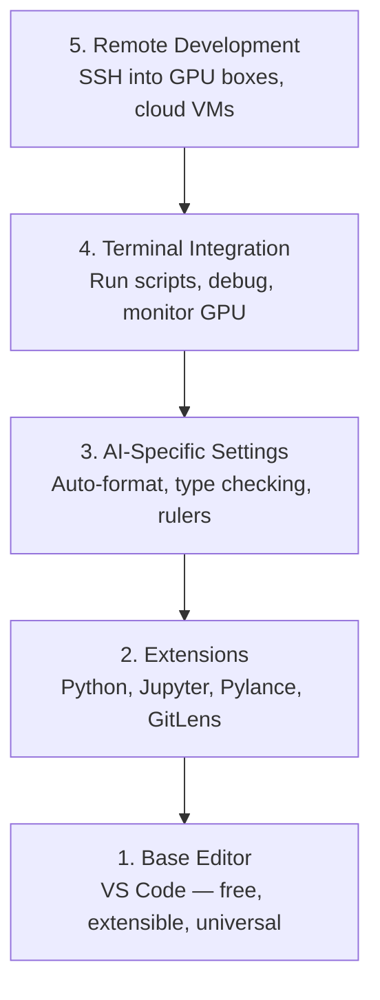

# Thiết lập trình biên tập

> Thư biên tập của bạn là đối tác cộng tác của bạn. Hãy sắp xếp nó một lần, để nó không còn làm phiền, và bắt đầu thực sự hoạt động.

**Type:** Build
**Languages:** --
**Prerequisites:** Phase 0, Lesson 01
**Time:** ~20 分钟

## Học mục tiêu
- Lắp đặt VS Code,并配置 Python、Jupyter、linting 和 remote SSH cần thiết mở rộng lõi
- Để AI workflows  configure format-on-save、type checking và notebook output scrolling
-  cấu hình SSH từ xa, như edit bản địa code như trên máy GPU từ xa  sửa đổi và gỡ lỗi 代码
- 评估其他编辑器选择(Cursor、Windsurf、Neovim) và các hoạt động của chúng trong công việc AI

## 问题
Bạn sẽ dành hàng ngàn giờ trong trình chỉnh sửa: viết Python, chạy sổ ghi chép, gỡ lỗi vòng đào tạo, cũng như SSH đến GPU 机器.

Đúng là chỉ mất 20 phút. Nhảy qua nó, mỗi ngày sẽ mất 20 phút.

## 概念
Các thiết bị chỉnh sửa của kỹ thuật AI cần 5 thứ:




```figure
s0-lsp-roundtrip
```

##  xây dựng nó
### 步骤 1: cài đặt VS Code

 Sử dụng VS Code. Nó miễn phí, có thể chạy trên tất cả các hệ điều hành.

Từ [code.visualstudio.com](https://code.visualstudio.com/)- Thả xuống.

Trong terminal Trung验证:

```bash
code --version
```

Nếu macOS 上 tìm không đến`code`,打开 VS Code,按 `Cmd+Shift+P`,输入 "Shell Command", sau đó chọn "Install 'code' command in PATH"。

### 步骤 2: 安装 cần mở rộng

Trong VS Code 中打开集成终端(`Ctrl+`` `hoặc `` Cmd+```),安装 AI work 需要的扩展:

```bash
code --install-extension ms-python.python
code --install-extension ms-python.vscode-pylance
code --install-extension ms-toolsai.jupyter
code --install-extension eamodio.gitlens
code --install-extension ms-vscode-remote.remote-ssh
code --install-extension ms-python.debugpy
code --install-extension ms-python.black-formatter
code --install-extension charliermarsh.ruff
```

Mỗi sự mở rộng tác dụng:

| Extension | Why |
|-----------|-----|
| Python | Language 支持、virtual env 检测、run/debug |
| Pylance | 快速 type checking、autocomplete、import resolution |
| Jupyter | 在 VS Code 内运行 notebooks、variable explorer |
| GitLens | 查看谁改了什么、inline git blame |
| Remote SSH | 像本地一样打开远程 GPU 机器上的文件夹 |
| Debugpy | Python 的 step-through debugging |
| Black Formatter | 保存时自动格式化，保持风格一致 |
| Ruff | 快速 linting，捕获常见错误 |

本课中 `code/.vscode/extensions.json`文件包含完整推列表──当你打开项目文件时,VS Code 会提示你安装它们──

### 步骤 3: Configuration

复制本课 `code/.vscode/settings.json`Trong cài đặt, hoặc qua `Settings > Open Settings (JSON)`Làm việc bằng tay.

Công việc AI của thiết lập chính:

```jsonc
{
    "python.analysis.typeCheckingMode": "basic",
    "editor.formatOnSave": true,
    "editor.rulers": [88, 120],
    "notebook.output.scrolling": true,
    "files.autoSave": "afterDelay"
}
```

Tại sao điều này quan trọng:

- **Type checking on basic**Trong quá trình sử dụng, bạn có thể tìm thấy các loại lập luận sai lầm.
- **Format on save**: không cần phải xem xét hình thức hóa.
- **Rulers at 88 and 120**: Đen 在 88 处换行──120 标记显示 docstrings 和 comments 什么时候过长──
- **Notebook output scrolling**: Trình tập trung sẽ in hàng ngàn dòng. Không có trình xoay.
- **Auto-save**Bạn sẽ quên lưu lại. Bản thảo tập luyện của bạn sẽ chạy theo mã cũ.

### 步骤 4: Terminal 集成

VS Code có kết nối kết nối là nơi bạn chạy các kịch bản đào tạo, giám sát GPU, quản lý môi trường.

Chính xác cấu hình nó:

```jsonc
{
    "terminal.integrated.defaultProfile.osx": "zsh",
    "terminal.integrated.defaultProfile.linux": "bash",
    "terminal.integrated.fontSize": 13,
    "terminal.integrated.scrollback": 10000
}
```

Có một khóa nhanh:

| Action | macOS | Linux/Windows |
|--------|-------|---------------|
| Toggle terminal | `` Ctrl+` `` | `` Ctrl+` `` |
| New terminal | `Ctrl+Shift+`` ` | `Ctrl+Shift+`` ` |
| Split terminal | `Cmd+\` | `Ctrl+\` |

Split terminals  rất hữu ích: một dùng để chạy script của bạn, một khác dùng để sử dụng `nvidia-smi -l 1`Hoặc`watch -n 1 nvidia-smi`监控 GPU.

### 步骤 5: phát triển từ xa (SSH đến GPU)

Đây là công việc AI, mở rộng quan trọng nhất. Bạn sẽ chạy trên máy tính từ xa.

Thiết lập:

1.  安装 Remote SSH extension ((已在 Step 2 完成)
2. 按 `Ctrl+Shift+P`(hoặc `Cmd+Shift+P`),输入 "Remote-SSH: Kết nối với Host"。
3. 输入 `user@your-gpu-box-ip`
4. VS Code sẽ tự động cài đặt thành phần máy chủ trên máy tính từ xa.

Nếu cần truy cập không mật khẩu, configure SSH keys:

```bash
ssh-keygen -t ed25519 -C "your-email@example.com"
ssh-copy-id user@your-gpu-box-ip
```

Để thuận tiện, hãy thêm người chủ.`~/.ssh/config`- Có thể là:

```
Host gpu-box
    HostName 203.0.113.50
    User ubuntu
    IdentityFile ~/.ssh/id_ed25519
    ForwardAgent yes
```

现在 `Remote-SSH: Connect to Host > gpu-box`会立即连接.

## Các lựa chọn thay thế

### Cursor

[cursor.com](https://cursor.com)là một trong các bản tạo mã AI của VS Code fork. Nó sử dụng cùng một phần mở rộng, các thiết lập và thiết lập.`settings.json`和 `extensions.json`

### Windsurf

[windsurf.com](https://windsurf.com)là một AI khác- đầu tiên VS Code fork. Tình huống giống nhau: cùng các phần mở rộng.

### Vim/Neovim

Nếu bạn đã sử dụng Vim hoặc Neovim và hiệu quả rất cao, thì hãy tiếp tục sử dụng.

- **pyright**Hoặc**pylsp**Sử dụng để kiểm tra loại (via Mason hoặc thủ công)
- **nvim-lspconfig**dùng để tích hợp máy chủ ngôn ngữ
- **jupyter-vim**Hoặc**molten-nvim**Sử dụng để thực hiện như sổ ghi chép
- **telescope.nvim**用于 tìm kiếm tệp / biểu tượng
- **none-ls.nvim**搭配 đen 和 ruff dùng để định dạng/linting

Nếu bạn chưa sử dụng Vim, đừng bắt đầu ngay bây giờ.

## Sử dụng nó
Với thiết lập này, dòng công việc hàng ngày của bạn trông như thế này:

1. Trong VS Code 中打开项目文件 (hoặc qua Remote SSH 连接到 GPU 机器)
2. Trong các trình biên tập, bạn sử dụng tự động hoàn thành, gợi ý kiểu và lỗi trong dòng.
3. Sử dụng gia hạn Jupyter 内联运行 sổ ghi chép Jupyter。
4. Sử dụng kết nối kết nối kết nối 运行 trình diễn đào tạo`uv pip install`Và giám sát GPU.
5. 提交前用 GitLens review thay đổi.

## 练习
1. Ưu điểm và bước 2 Trong danh sách tất cả các tiện ích mở rộng
2. 将本课的 `settings.json`复制到你的 VS Code config 中
3. 打开一个Python文件,验证Pylance 显示 kiểu gợi ý, và Black 会在保存时格式化
4. Nếu bạn có thể truy cập máy tính từ xa, configure Remote SSH và mở một tập tin trên nó

## 关键术语
| Term | What people say | What it actually means |
|------|----------------|----------------------|
| LSP | "Autocomplete engine" | Language Server Protocol：一种标准，让 editors 可以从特定 language 的 server 获取 type info、completions 和 diagnostics |
| Pylance | "The Python plugin" | Microsoft 的 Python language server，使用 Pyright 进行 type checking 和 IntelliSense |
| Remote SSH | "Working on the server" | VS Code extension，在远程机器上运行轻量 server，并将 UI stream 到本地 editor |
| Format on save | "Auto-prettier" | 每次保存时 editor 都会运行 formatter（Black、Ruff），因此 code style 始终一致 |
