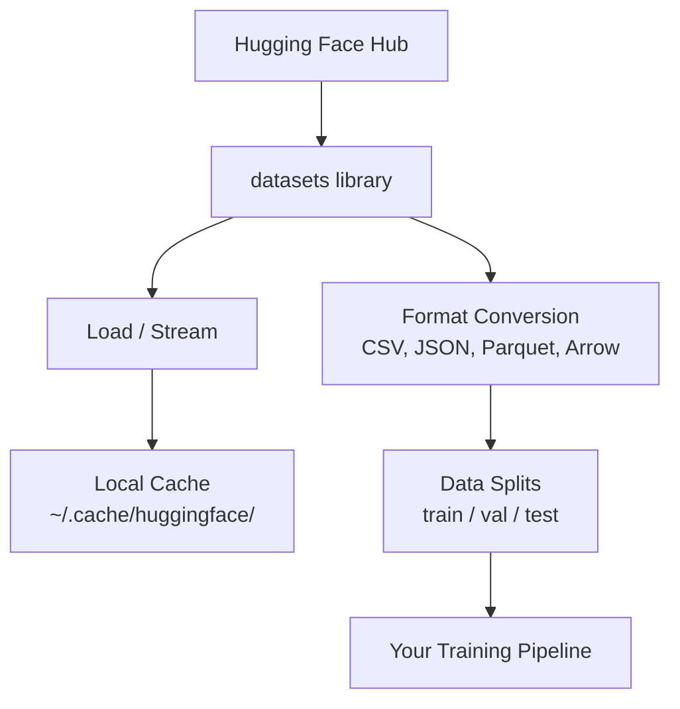

# Quản lý dữ liệu

> Dữ liệu là nhiên liệu. Làm thế nào bạn quản lý nó, quyết định bạn có thể đi nhanh hơn.

**Type:** Build
**Language:**Python
**Prerequisites:** Phase 0, Lesson 01
**Time:** ~45 分钟

## Học mục tiêu
- Sử dụng khuôn mặt ôm `datasets`thư viện tải, dòng và bộ dữ liệu cache
- Trong chuyển đổi giữa các định dạng CSV、JSON、Parquet và Arrow, và giải thích cách thức lấy chúng
- Sử dụng hạt giống ngẫu nhiên cố định 创建可复现的火车/验证/测试分区
- Sử dụng `.gitignore`GIT LFS hoặc DVC  quản lý mô hình lớn và tập tin tập tin dữ liệu

## 问题
Mỗi dự án AI đều bắt đầu từ dữ liệu. Bạn cần tìm tập hợp dữ liệu, tải xuống chúng, chuyển đổi giữa các định dạng, phân chia cho đào tạo và đánh giá, và làm phiên bản cho chúng, để các thí nghiệm có thể thực hiện.

## 概念


Nhìn khuôn mặt `datasets`thư viện là một cách chuẩn để AI làm việc, tải dữ liệu. Nó được sử dụng ngay lập tức để xử lý tải xuống, lưu trữ, chuyển đổi định dạng và phát trực tuyến.


```figure
s0-data-pipeline
```

##  xây dựng nó
### 步骤 1: cài đặt thư viện tập dữ liệu

```bash
pip install datasets huggingface_hub
```

### 步骤 2: Lắp đặt một bộ dữ liệu

```python
from datasets import load_dataset

dataset = load_dataset("imdb")
print(dataset)
print(dataset["train"][0])
```

Đây sẽ là bộ dữ liệu của IMDB. Sau khi tải xuống lần đầu tiên, nó sẽ là từ.`~/.cache/huggingface/datasets/`n n n n n n n n n n n n n n n n n n n n n n n n n n n n n n n n n n n n n n n n n n n n n n n n n n n n n n n n n n n n n n n n n n n n n n n n n n n n n n n n n n n n n n n n n n

### Bước 3: xử lý quy mô dữ liệu lớn

Một số bộ dữ liệu quá lớn, không thể hoàn toàn đưa vào đĩa.

```python
dataset = load_dataset("wikimedia/wikipedia", "20220301.en", split="train", streaming=True)

for i, example in enumerate(dataset):
    print(example["title"])
    if i >= 4:
        break
```

Streaming sẽ cho anh một `IterableDataset` Bạn sẽ ở hàng đến khi xử lý chúng.  Bất kể bộ dữ liệu lớn, sử dụng bộ nhớ vẫn luôn ổn định.

### 步骤 4: Các định dạng tập dữ liệu

`datasets`library 底层 sử dụng Apache Arrow. Bạn có thể chuyển đổi cho các định dạng khác theo nhu cầu của đường ống.

```python
dataset = load_dataset("imdb", split="train")

dataset.to_csv("imdb_train.csv")
dataset.to_json("imdb_train.json")
dataset.to_parquet("imdb_train.parquet")
```

Phụ thể đối với:

| Format | Size | Read Speed | Best For |
|--------|------|-----------|----------|
| CSV | 大 | 慢 | Human readability、spreadsheets |
| JSON | 大 | 慢 | APIs、nested data |
| Parquet | 小 | 快 | Analytics、columnar queries |
| Arrow | 小 | 最快 | In-memory processing（`datasets` 内部使用的格式） |

Đối với công việc AI, Parquet là định dạng lưu trữ tốt nhất. Arrow là định dạng bạn sử dụng trong bộ nhớ.

### 步骤 5: dữ liệu chia

Mỗi dự án ML  đều cần ba phần:

- **Train**:model 从这里学习( thường là 80%)
- **Validation**: bạn đang trong quá trình đào tạo kiểm tra tiến bộ (thường là 10%)
- **Test**: đào tạo  hoàn thành sau khi đánh giá cuối cùng (thường là 10%)

Một số bộ dữ liệu đã được chia trước. Không có thời gian, bản thân chia:

```python
dataset = load_dataset("imdb", split="train")

split = dataset.train_test_split(test_size=0.2, seed=42)
train_val = split["train"].train_test_split(test_size=0.125, seed=42)

train_ds = train_val["train"]
val_ds = train_val["test"]
test_ds = split["test"]

print(f"Train: {len(train_ds)}, Val: {len(val_ds)}, Test: {len(test_ds)}")
```

始终设置 hạt giống để đảm bảo khả năng tái sinh.

### 步骤 6: Download并缓存模型

Các mô hình là những tài liệu lớn.`huggingface_hub`thư viện 会 xử lý tải xuống và lưu trữ bộ nhớ cache.

```python
from huggingface_hub import hf_hub_download, snapshot_download

model_path = hf_hub_download(
    repo_id="sentence-transformers/all-MiniLM-L6-v2",
    filename="config.json"
)
print(f"Cached at: {model_path}")

model_dir = snapshot_download("sentence-transformers/all-MiniLM-L6-v2")
print(f"Full model at: {model_dir}")
```

Các mô hình sẽ được lưu trữ đến`~/.cache/huggingface/hub/`                                                                                                                                                                                                                                                              

### Bước 7: xử lý các tài liệu lớn

Các trọng lượng mô hình và các tập dữ liệu lớn không nên vào git.

**Option A: .gitignore（最简单）**

```
*.bin
*.safetensors
*.pt
*.onnx
data/*.parquet
data/*.csv
models/
```

**Option B: Git LFS（在 git 中跟踪大型文件）**

```bash
git lfs install
git lfs track "*.bin"
git lfs track "*.safetensors"
git add .gitattributes
```

Git LFS trong repo của bạn chỉ số lưu trữ,并将 thực tế tài liệu lưu trữ trên một máy chủ riêng biệt trên. GitHub cung cấp 1 GB  miễn phí.

**Option C: DVC（data version control）**

```bash
pip install dvc
dvc init
dvc add data/training_set.parquet
git add data/training_set.parquet.dvc data/.gitignore
git commit -m "Track training data with DVC"
```

DVC 会创建小型 `.dvc`文件,指向你的数据──Data được lưu trữ trong S3、GCS hoặc các nền lưu trữ từ xa khác trong──

| Approach | Complexity | Best For |
|----------|-----------|----------|
| .gitignore | 低 | 个人项目、可重新获取的 downloaded data |
| Git LFS | 中 | 通过 git 共享 model weights 的团队 |
| DVC | 高 | 可复现 experiments、大型 datasets、团队 |

Đối với chương trình,`.gitignore`已足够── khi bạn cần trải nghiệm xác định trên máy tính, hãy sử dụng lại DVC──

### 步骤 8: Các mô hình lưu trữ

**Local storage**适用于小于 ~ 10 GB các bộ dữ liệu. HF cache 会自动处理.

**Cloud storage** phù hợp với nội dung lớn hơn, hoặc cần được chia sẻ trên máy tính:

```python
import os

local_path = os.path.expanduser("~/.cache/huggingface/datasets/")

# s3_path = "s3://my-bucket/datasets/"
# gcs_path = "gs://my-bucket/datasets/"
```

DVC có thể trực tiếp với S3 và GCS 集成:

```bash
dvc remote add -d myremote s3://my-bucket/dvc-store
dvc push
```

Đối với chương trình này, lưu trữ địa phương 足够── lưu trữ đám mây sẽ được thực hiện trong các phiên bản GPU xa

## 本课程使用的数据集

| Dataset | Lessons | Size | What It Teaches |
|---------|---------|------|----------------|
| IMDB | Tokenization、classification | 84 MB | Text classification 基础 |
| WikiText | Language modeling | 181 MB | Next-token prediction |
| SQuAD | QA systems | 35 MB | Question answering、spans |
| Common Crawl (subset) | Embeddings | 不定 | Large-scale text processing |
| MNIST | Vision basics | 21 MB | Image classification fundamentals |
| COCO (subset) | Multimodal | 不定 | Image-text pairs |

Bạn không cần tải tất cả những thứ này. Mỗi bài học sẽ giải thích những gì nó cần.

## Sử dụng nó
运行 script tiện ích 验证一切正常:

```bash
python code/data_utils.py
```

Nó sẽ tải xuống một tập dữ liệu nhỏ, chuyển nó, chia nó, và in bản tóm tắt.

## 交付 nó
本课产 出:
- `code/data_utils.py`- tiện ích tải dữ liệu và lưu trữ cache có thể sử dụng lại
- `outputs/prompt-data-helper.md`- dùng để tìm kiếm các tập hợp dữ liệu phù hợp

## 练习
1. Sử dụng `mrpc`config 加载 `glue`tập dữ liệu,并检查前 5 个例子
2. Chuyển `c4`tập dữ liệu,并统计 10 秒内 có thể xử lý bao nhiêu ví dụ
3. Chuyển một tập dữ liệu thành Parquet, và sẽ có kích thước tập tin so với CSV
4. Sử dụng hạt giống cố định 创建 70/15/15 train/val/test split,并验证 size

## 关键术语
| Term | What people say | What it actually means |
|------|----------------|----------------------|
| Dataset split | "Training data" | 一个命名 subset（train/val/test），用于 ML lifecycle 的不同阶段 |
| Streaming | "Load it lazily" | 从远程 source 逐行处理 data，而不下载完整 dataset |
| Parquet | "Compressed CSV" | 一种 columnar file format，针对 analytical queries 和 storage efficiency 优化 |
| Arrow | "Fast dataframe" | `datasets` library 内部使用的 in-memory columnar format，用于 zero-copy reads |
| Git LFS | "Git for big files" | 一个 extension，将大型文件存储在 git repo 外，同时在 version control 中保留 pointers |
| DVC | "Git for data" | 一个用于 datasets 和 models 的 version control system，可与 cloud storage 集成 |
| Cache | "Already downloaded" | 之前获取过的 data 的本地副本，默认存储在 ~/.cache/huggingface/ |
