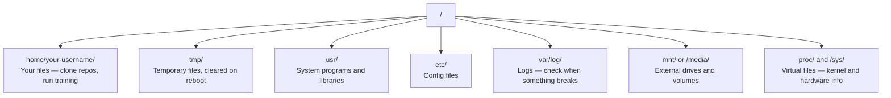

# 面向 AI của Linux

> Hầu hết AI đều chạy trên Linux. Bạn cần phải nắm bắt được mức độ không được gắn liền.

**类型：**Học tập
**语言：**- Tôi...
**先修要求：**Giai đoạn 0, Bài học 01
**时间：**~ 30 phút

## Học mục tiêu

- 浏览 Linux file system,并从命令行执行基本文件操作
- Sử dụng `chmod`和 `chown` quản lý quyền tập tin, để giải quyết lỗi "Phán phép bị từ chối"
- Sử dụng `apt`Lắp đặt các gói hệ thống,并为AI 工作设置一台新 GPU box
- 识别 khi chuyển từ macOS sang Linux, nhà phát triển thường xuyên bước chân trên máy tính từ xa

## 问题

Bạn đang trong macOS hoặc Windows trên phát triển. Nhưng một khi bạn SSH đến hộp GPU đám mây, thuê Lambda, hoặc khởi động một máy EC2, bạn sẽ vào Ubuntu.

Đây là một hướng dẫn sống. Nó chỉ bao gồm những gì bạn cần để làm việc AI trên máy Linux xa.

## Hệ thống tệp 布局

Linux tổ chức mọi thứ trong một gốc.`/`Không có gì.`C:\`Hoặc`/Volumes` 你实际会接触的目录:



Thư mục nhà của bạn là `~`Hoặc`/home/your-username`Hầu như mọi hoạt động đều xảy ra ở đây.

## - Đơn lệnh

Dưới đây là 15 lệnh  bao gồm 95% hoạt động của bạn trên hộp GPU từ xa:

### 移动位置

```bash
pwd                         # Where am I?
ls                          # What's here?
ls -la                      # What's here, including hidden files with details?
cd /path/to/dir             # Go there
cd ~                        # Go home
cd ..                       # Go up one level
```

### 文件和目录

```bash
mkdir my-project            # Create a directory
mkdir -p a/b/c              # Create nested directories in one shot

cp file.txt backup.txt      # Copy a file
cp -r src/ src-backup/      # Copy a directory (recursive)

mv old.txt new.txt          # Rename a file
mv file.txt /tmp/           # Move a file

rm file.txt                 # Delete a file (no trash, it's gone)
rm -rf my-dir/              # Delete a directory and everything inside
```

`rm -rf`Là vĩnh viễn. Không có gì phải làm.

### 读取文件

```bash
cat file.txt                # Print entire file
head -20 file.txt           # First 20 lines
tail -20 file.txt           # Last 20 lines
tail -f log.txt             # Follow a log file in real time (Ctrl+C to stop)
less file.txt               # Scroll through a file (q to quit)
```

### 搜索

```bash
grep "error" training.log           # Find lines containing "error"
grep -r "learning_rate" .           # Search all files in current directory
grep -i "cuda" config.yaml          # Case-insensitive search

find . -name "*.py"                 # Find all Python files under current dir
find . -name "*.ckpt" -size +1G     # Find checkpoint files larger than 1GB
```

## Giấy phép

Mỗi file trong Linux đều có chủ sở hữu và các phần quyền. Khi các kịch bản không thể thực hiện, hoặc bạn không thể viết vào một danh mục nào đó, bạn sẽ gặp vấn đề này.

```bash
ls -l train.py
# -rwxr-xr-- 1 user group 2048 Mar 19 10:00 train.py
#  ^^^             owner permissions: read, write, execute
#     ^^^          group permissions: read, execute
#        ^^        everyone else: read only
```

常见修复方式:

```bash
chmod +x train.sh           # Make a script executable
chmod 755 deploy.sh         # Owner: full, others: read+execute
chmod 644 config.yaml       # Owner: read+write, others: read only

chown user:group file.txt   # Change who owns a file (needs sudo)
```

Khi một số gợi ý "Giấy phép bị từ chối" 时, hầu như luôn là các quyền 问题.`chmod +x`Hoặc`sudo`Có thể sửa chữa hầu hết các tình huống.

## Quản lý gói (apt)

Ubuntu 使用 `apt`Đây là cách để cài đặt phần mềm cấp hệ thống.

```bash
sudo apt update             # Refresh the package list (always do this first)
sudo apt install -y htop    # Install a package (-y skips confirmation)
sudo apt install -y build-essential  # C compiler, make, etc. Needed by many Python packages
sudo apt install -y tmux    # Terminal multiplexer (keep sessions alive after disconnect)

apt list --installed        # What's installed?
sudo apt remove htop        # Uninstall
```

Bạn sẽ được cài đặt trong hộp GPU mới:

```bash
sudo apt update && sudo apt install -y \
    build-essential \
    git \
    curl \
    wget \
    tmux \
    htop \
    unzip \
    python3-venv
```

## Người dùng và sudo

Bạn thường như người dùng bình thường 登录. Có một số hoạt động cần root.

```bash
whoami                      # What user am I?
sudo command                # Run a single command as root
sudo su                     # Become root (exit to go back, use sparingly)
```

Trong các trường hợp GPU đám mây, bạn thường là người dùng duy nhất, và đã có quyền truy cập sudo. Đừng để tất cả mọi thứ chạy trên root. Chỉ sử dụng sudo khi cần.

## Quá trình và hệ thống

Khi tập luyện, hoặc bạn cần kiểm tra nội dung đang chạy:

```bash
htop                        # Interactive process viewer (q to quit)
ps aux | grep python        # Find running Python processes
kill 12345                  # Gracefully stop process with PID 12345
kill -9 12345               # Force kill (use when graceful doesn't work)
nvidia-smi                  # GPU processes and memory usage
```

systemd 管理 services(background daemons) ―― Nếu bạn chạy máy chủ suy luận, sẽ sử dụng nó:

```bash
sudo systemctl start nginx          # Start a service
sudo systemctl stop nginx           # Stop it
sudo systemctl restart nginx        # Restart it
sudo systemctl status nginx         # Check if it's running
sudo systemctl enable nginx         # Start automatically on boot
```

## 磁盘空间

Không gian đĩa của các hộp GPU thường hạn chế.

```bash
df -h                       # Disk usage for all mounted drives
df -h /home                 # Disk usage for /home specifically

du -sh *                    # Size of each item in current directory
du -sh ~/.cache             # Size of your cache (pip, huggingface models land here)
du -sh /data/checkpoints/   # Check how big your checkpoints are

# Find the biggest space hogs
du -h --max-depth=1 / 2>/dev/null | sort -hr | head -20
```

常见省空间方式:

```bash
# Clear pip cache
pip cache purge

# Clear apt cache
sudo apt clean

# Remove old checkpoints you don't need
rm -rf checkpoints/epoch_01/ checkpoints/epoch_02/
```

## Mạng lưới

Bạn sẽ tải về các mô hình từ lệnh, truyền tải các tập tin, và sử dụng API.

```bash
# Download files
wget https://example.com/model.bin                   # Download a file
curl -O https://example.com/data.tar.gz              # Same thing with curl
curl -s https://api.example.com/health | python3 -m json.tool  # Hit an API, pretty-print JSON

# Transfer files between machines
scp model.bin user@remote:/data/                     # Copy file to remote machine
scp user@remote:/data/results.csv .                  # Copy file from remote to local
scp -r user@remote:/data/checkpoints/ ./local-dir/   # Copy directory

# Sync directories (faster than scp for large transfers, resumes on failure)
rsync -avz --progress ./data/ user@remote:/data/
rsync -avz --progress user@remote:/results/ ./results/
```

 Đối với bất kỳ giao thông lớn nào, sử dụng ưu tiên `rsync`Không phải`scp`Nó chỉ truyền tải các thay đổi của các byte, và có thể xử lý kết nối.

## tmux: giữ Sessions 存活

Khi bạn SSH đến hộp xa, cắm máy tính xách tay sẽ giết chết các hoạt động tập luyện của bạn.

```bash
tmux new -s train           # Start a new session named "train"
# ... start your training, then:
# Ctrl+B, then D            # Detach (training keeps running)

tmux ls                     # List sessions
tmux attach -t train        # Reattach to session

# Inside tmux:
# Ctrl+B, then %            # Split pane vertically
# Ctrl+B, then "            # Split pane horizontally
# Ctrl+B, then arrow keys   # Switch between panes
```

长时间训练任务总是放在tmux 里运行――总是如此――

## Face towards Windows User's WSL2

Nếu bạn đang sử dụng Windows, WSL2 có thể cung cấp môi trường Linux thực sự trong tình huống không cần thiết boot kép.

```bash
# In PowerShell (admin)
wsl --install -d Ubuntu-24.04

# After restart, open Ubuntu from Start menu
sudo apt update && sudo apt upgrade -y
```

WSL2 运行真实Linux kernel──本课中的所有内容都能在其中工作──从WSL 内部看, các tệp Windows của bạn 位于`/mnt/c/Users/YourName/`

GPU thông qua 需要 Windows 侧安装 NVIDIA trình điều khiển.

## Gotchas: macOS đến Linux

Nếu bạn đến từ macOS, những điều này sẽ làm cho bạn:

| macOS | Linux | 说明 |
|-------|-------|-------|
| `brew install` | `sudo apt install` | package names 有时不同。`brew install htop` 和 `sudo apt install htop` 效果相同，但 `brew install readline` 和 `sudo apt install libreadline-dev` 不同。 |
| `open file.txt` | `xdg-open file.txt` | 但远程 box 上通常没有 GUI。使用 `cat` 或 `less`。 |
| `pbcopy` / `pbpaste` | 不可用 | SSH 上不存在 pipe 到/来自 clipboard 的能力。 |
| `~/.zshrc` | `~/.bashrc` | macOS 默认使用 zsh。大多数 Linux servers 使用 bash。 |
| `/opt/homebrew/` | `/usr/bin/`, `/usr/local/bin/` | Binaries 位于不同位置。 |
| `sed -i '' 's/a/b/' file` | `sed -i 's/a/b/' file` | macOS sed 需要在 `-i` 后加一个空字符串。Linux 不需要。 |
| Case-insensitive filesystem | Case-sensitive filesystem | 在 Linux 上，`Model.py` 和 `model.py` 是两个不同文件。 |
| Line endings `\n` | Line endings `\n` | 相同。但 Windows 使用 `\r\n`，会破坏 bash scripts。运行 `dos2unix` 修复。 |

## 快速参考卡

```
Navigation:     pwd, ls, cd, find
Files:          cp, mv, rm, mkdir, cat, head, tail, less
Search:         grep, find
Permissions:    chmod, chown, sudo
Packages:       apt update, apt install
Processes:      htop, ps, kill, nvidia-smi
Services:       systemctl start/stop/restart/status
Disk:           df -h, du -sh
Network:        curl, wget, scp, rsync
Sessions:       tmux new/attach/detach
```


```figure
s0-process-fork
```

## 练习

1. SSH đến bất kỳ máy Linux nào ((( hoặc mở WSL2),并导航 đến thư mục nhà của bạn。 tạo một thư mục dự án, trong đó sử dụng `touch`创建三个空文件, rồi sử dụng `ls -la`Đưa chúng ra.
2. 用                                                                                                                                                                                                                                                                                                                                                                                                                                                                                                                             `htop`, chạy nó, và tìm ra quá trình sử dụng nhiều bộ nhớ hơn.
3.  khởi động một phiên tmux, trong đó hoạt động `sleep 300`, rời khỏi, ra khỏi các phiên, rồi nối lại.
4. Sử dụng `df -h`检查可用磁盘空间, sau đó sử dụng `du -sh ~/.cache/*`Tìm ra nội dung cache trong không gian chiếm đóng.
5. Sử dụng `scp`Chuyển một tập tin từ máy địa phương sang máy xa, sau đó sử dụng `rsync`Làm tương tự truyền tải,并比较体验.
