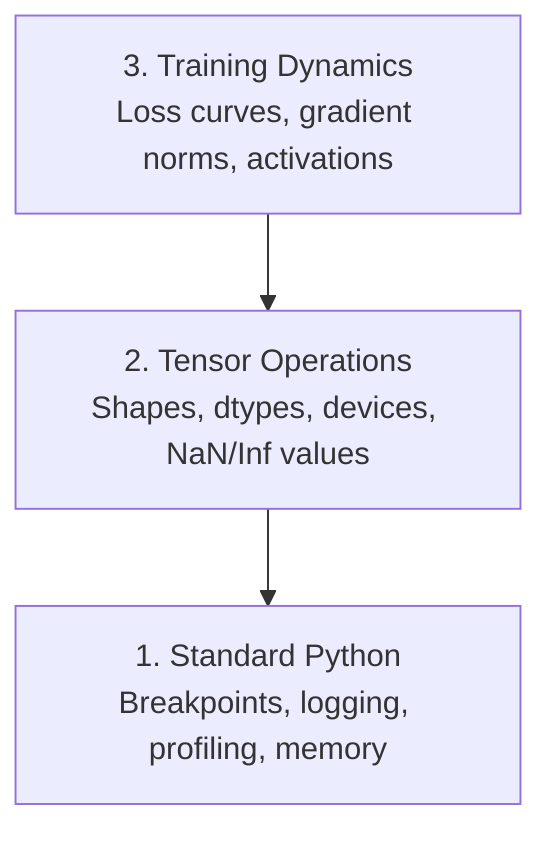

# Thiết lập lỗi và Profiling

> Những lỗi AI tồi tệ nhất sẽ không sụp đổ. Chúng sẽ tập luyện lặng lẽ trên dữ liệu rác, và báo cáo một đường cong mất mát đẹp.

**类型：**构建
**语言：**Python
**先修要求：**Bài học 1 ((Dev Environment), cơ bản PyTorch 熟悉度
**时间：**~ 60 phút

## Học mục tiêu

- 使用条件式 `breakpoint()`和 `debug_print`Trong quá trình tập luyện kiểm tra hình dạng tensor, kiểu và giá trị NaN
- Sử dụng `cProfile``line_profiler`和 `tracemalloc`hồ sơ  tập trung vòng lặp, tìm ra những nút thắt chai
- 检测常见 AI bugs: không phù hợp hình dạng, mất NaN, rò rỉ dữ liệu và các tensor thiết bị sai
-  cài đặt TensorBoard 来可视化损失曲线, trọng lượng histogram và phân phối gradient

## 问题

Cách thất bại của mã AI khác với mã thông thường. Ứng dụng web sẽ mang theo dấu vết đống 崩. 配置错误的训练循环 会运行8小时,烧掉200美元 GPU 时间, sau đó tạo ra một mô hình dự đoán trung bình cho mỗi đầu vào. 代码从未报错. bug có thể là một tensor trong thiết bị sai trên 忘记.`.detach()`, hoặc nhãn 漏出 vào các tính năng.

Bạn cần các công cụ gỡ lỗi, trong những thất bại này lãng phí thời gian và tính toán của bạn  trước khi nắm bắt chúng.

## 概念

AI debugging chia thành ba cấp độ:



Hầu hết mọi người sẽ nhảy thẳng lên tầng 3 (着TensorBoard看) ⋅ nhưng 80% lỗi AI đều ở tầng 1 và tầng 2.


```figure
s0-flame-hot
```

##  xây dựng nó

### Phần 1: Bác bản gỡ lỗi (có hiệu quả)

Chế độ khắc phục lỗi in  thường được xem nhẹ. Nhưng không nên như vậy. Đối với mã tensor, một tuyên bố in có mục tiêu 往往胜过逐步调试器, vì bạn cần một lần nhìn thấy hình dạng, kiểu và phạm vi giá trị.

```python
def debug_print(name, tensor):
    print(f"{name}: shape={tensor.shape}, dtype={tensor.dtype}, "
          f"device={tensor.device}, "
          f"min={tensor.min().item():.4f}, max={tensor.max().item():.4f}, "
          f"mean={tensor.mean().item():.4f}, "
          f"has_nan={tensor.isnan().any().item()}")
```

Trong mỗi hoạt động đáng ngờ 后调用它. Tìm lỗi 后, di chuyển các bản in này.

### Phần 2: Python Debugger ((pdb 和 breakpoint)

Trong AI 工作中被低估了.`breakpoint()`放 vào vòng đào tạo,并交互式检查 Tensor──

```python
def training_step(model, batch, criterion, optimizer):
    inputs, labels = batch
    outputs = model(inputs)
    loss = criterion(outputs, labels)

    if loss.item() > 100 or torch.isnan(loss):
        breakpoint()

    loss.backward()
    optimizer.step()
```

Khi debugger  dừng lại, lệnh hữu ích:

- `p outputs.shape`检查 hình dạng
- `p loss.item()`查看 giá trị mất mát
- `p torch.isnan(outputs).sum()`统计 NAN
- `p model.fc1.weight.grad`检查 gradients
- `c`继续,`q`退出

Đó là điều kiện để làm lỗi. Chỉ có vẻ như không thể dừng lại. Đối với việc chạy 10,000 bước, điều này rất quan trọng.

### Phần 3: Lập nhật Python

Khi bạn cố định 超出快速检查范围时, sử dụng ghi chép  thay thế các tuyên bố in ấn。

```python
import logging

logging.basicConfig(
    level=logging.INFO,
    format="%(asctime)s [%(levelname)s] %(message)s",
    handlers=[
        logging.FileHandler("training.log"),
        logging.StreamHandler()
    ]
)
logger = logging.getLogger(__name__)

logger.info("Starting training: lr=%.4f, batch_size=%d", lr, batch_size)
logger.warning("Loss spike detected: %.4f at step %d", loss.item(), step)
logger.error("NaN loss at step %d, stopping", step)
```

Logging  cung cấp dấu thời gian  mức độ nghiêm trọng và sản xuất file── khi tập luyện chạy vào lúc 3 giờ sáng, bạn muốn là file log, chứ không phải là kết quả kết thúc đã xuất hiện trên màn hình──

### Phần 4: Đối với code

知道时间花在哪里, là bước đầu tiên để cải thiện.

```python
import time

class Timer:
    def __init__(self, name=""):
        self.name = name

    def __enter__(self):
        self.start = time.perf_counter()
        return self

    def __exit__(self, *args):
        elapsed = time.perf_counter() - self.start
        print(f"[{self.name}] {elapsed:.4f}s")

with Timer("data loading"):
    batch = next(dataloader_iter)

with Timer("forward pass"):
    outputs = model(batch)

with Timer("backward pass"):
    loss.backward()
```

常见发现: tải dữ liệu chiếm 60% thời gian tập luyện.`num_workers > 0`, thay vì thay đổi GPU nhanh hơn.

### Phần 5: cProfile 和 line_profiiler

Khi bạn cần thông tin hơn là bộ hẹn giờ thủ công:

```bash
python -m cProfile -s cumtime train.py
```

Đây sẽ hiển thị mỗi cuộc gọi chức năng, và theo thời gian tích lũy 排序── Nếu cần từng dòng hồ sơ:

```bash
pip install line_profiler
```

```python
@profile
def train_step(model, data, target):
    output = model(data)
    loss = F.cross_entropy(output, target)
    loss.backward()
    return loss

# Run with: kernprof -l -v train.py
```

### Phần 6: Xét nghiệm trí nhớ

#### 使用 tracemalloc 查看 CPU Memory

```python
import tracemalloc

tracemalloc.start()

# your code here
model = build_model()
data = load_dataset()

snapshot = tracemalloc.take_snapshot()
top_stats = snapshot.statistics("lineno")
for stat in top_stats[:10]:
    print(stat)
```

#### 使用 memory_profile 查看 CPU Memory

```bash
pip install memory_profiler
```

```python
from memory_profiler import profile

@profile
def load_data():
    raw = read_csv("data.csv")       # watch memory jump here
    processed = preprocess(raw)       # and here
    return processed
```

用 `python -m memory_profiler your_script.py`运行,以查看逐行 bộ nhớ sử dụng

#### 使用 PyTorch 查看 GPU Memory

```python
import torch

if torch.cuda.is_available():
    print(torch.cuda.memory_summary())

    print(f"Allocated: {torch.cuda.memory_allocated() / 1e9:.2f} GB")
    print(f"Cached: {torch.cuda.memory_reserved() / 1e9:.2f} GB")
```

Khi gặp OOM (từ trí nhớ)

1. 减小批量 (永远是第一个要尝试的)
2. Sử dụng `torch.cuda.empty_cache()`释放 bộ nhớ được lưu trữ
3. Đối với các trung gian lớn `del tensor`, sau đó调用`torch.cuda.empty_cache()`
4. Sử dụng độ chính xác hỗn hợp`torch.cuda.amp`) sẽ sử dụng bộ nhớ giảm một nửa
5. Đối với các mô hình rất sâu sử dụng điểm kiểm tra gradient

### Phần 7: 常见AI Bugs và cách bắt chúng

#### Sự không phù hợp hình dạng

Loại lỗi phổ biến nhất. Một dạng của một tensor là`[batch, features]`, nhưng mô hình 期望 `[batch, channels, height, width]`

```python
def check_shapes(model, sample_input):
    print(f"Input: {sample_input.shape}")
    hooks = []

    def make_hook(name):
        def hook(module, inp, out):
            in_shape = inp[0].shape if isinstance(inp, tuple) else inp.shape
            out_shape = out.shape if hasattr(out, "shape") else type(out)
            print(f"  {name}: {in_shape} -> {out_shape}")
        return hook

    for name, module in model.named_modules():
        hooks.append(module.register_forward_hook(make_hook(name)))

    with torch.no_grad():
        model(sample_input)

    for h in hooks:
        h.remove()
```

Sử dụng một lô mẫu 运行 một lần. Nó sẽ chiếu mô hình trong mỗi lần chuyển đổi hình dạng.

#### Nên mất

Nên mất một số thứ đã xảy ra.

- Tốc độ học tập quá cao
- lỗ tùy chỉnh 中除以零
- Đối với số 0 hoặc số âm
- RNN 中 gradients 爆炸

```python
def detect_nan(model, loss, step):
    if torch.isnan(loss):
        print(f"NaN loss at step {step}")
        for name, param in model.named_parameters():
            if param.grad is not None:
                if torch.isnan(param.grad).any():
                    print(f"  NaN gradient in {name}")
                if torch.isinf(param.grad).any():
                    print(f"  Inf gradient in {name}")
        return True
    return False
```

#### Tiết xuất dữ liệu

Mô hình của bạn trong bộ thử nghiệm đạt độ chính xác 99%... nghe rất tuyệt...

```python
def check_data_leakage(train_set, test_set, id_column="id"):
    train_ids = set(train_set[id_column].tolist())
    test_ids = set(test_set[id_column].tolist())
    overlap = train_ids & test_ids
    if overlap:
        print(f"DATA LEAKAGE: {len(overlap)} samples in both train and test")
        return True
    return False
```

Ngoài ra cần kiểm tra rò rỉ thời gian: Using futur data预测过去── chia trước trước theo dấu thời gian 排序──

#### Thiết bị sai

Các tensor trên các thiết bị khác nhau (CPU vs GPU) sẽ dẫn đến lỗi thời gian chạy. Nhưng đôi khi một tensor sẽ tĩnh lặng ở lại trên CPU, trong khi tất cả mọi thứ khác đều trên GPU, tập luyện chỉ chạy chậm.

```python
def check_devices(model, *tensors):
    model_device = next(model.parameters()).device
    print(f"Model device: {model_device}")
    for i, t in enumerate(tensors):
        if t.device != model_device:
            print(f"  WARNING: tensor {i} on {t.device}, model on {model_device}")
```

### Phần 8: TensorBoard 基础

TensorBoard sẽ trình bày những gì đã xảy ra trong quá trình đào tạo.

```bash
pip install tensorboard
```

```python
from torch.utils.tensorboard import SummaryWriter

writer = SummaryWriter("runs/experiment_1")

for step in range(num_steps):
    loss = train_step(model, batch)

    writer.add_scalar("loss/train", loss.item(), step)
    writer.add_scalar("lr", optimizer.param_groups[0]["lr"], step)

    if step % 100 == 0:
        for name, param in model.named_parameters():
            writer.add_histogram(f"weights/{name}", param, step)
            if param.grad is not None:
                writer.add_histogram(f"grads/{name}", param.grad, step)

writer.close()
```

 khởi động nó:

```bash
tensorboard --logdir=runs
```

Để quan tâm gì:

- **Loss 不下降**:Tỷ lệ học tập quá thấp, hoặc kiến trúc mô hình  vấn đề
- **Loss 剧烈震荡**Tỷ lệ học tập quá cao
- **Loss 变成 NaN**: Sự bất ổn số (see trên NaN 部分)
- **Train loss 下降，val loss 上升**Tải quá:
- **Weight histograms 坍缩到零**Các gradient biến mất:
- **Gradient histograms 爆炸**: cần cắt gradient

### Phần 9: VS Code Debugger

Đối với giao tiếp debugging, sử dụng`launch.json`配置 VS Code:

```json
{
    "version": "0.2.0",
    "configurations": [
        {
            "name": "Debug Training",
            "type": "debugpy",
            "request": "launch",
            "program": "${file}",
            "console": "integratedTerminal",
            "justMyCode": false
        }
    ]
}
```

点击 gutter 设置 breakpoints。 sử dụng bảng điều khiển biến  kiểm tra các tính chất tensor。Debug Console 让你在执行中途运行任意Python biểu hiện。

Điều này rất hữu ích cho việc xem từng bước các đường ống xử lý dữ liệu trước, đặc biệt là khi bạn muốn xem mỗi lần chuyển đổi.

## Sử dụng nó

Dòng lưu thông làm việc gỡ lỗi dưới đây có thể bắt được hầu hết các lỗi AI:

1. **训练前**:用 mẫu lô 运行 `check_shapes` kiểm tra các kích thước đầu vào và đầu ra 符合预期──
2. **前 10 步**: đối với lỗ, sản lượng và gradient sử dụng`debug_print` xác nhận không có NaN, và giá trị trong phạm vi hợp lý
3. **训练期间**: ghi nhớ mất, tỷ lệ học và các chuẩn gradient.
4. **出问题时**: ở điểm thất bại  đặt `breakpoint()`◊交互式检查门子――
5. **针对性能**:计时 dữ liệu tải ∞ tiến ∞ trở lại ∞ nếu gần OOM,则 hồ sơ bộ nhớ ∞

## 交付 nó

运行 trình lệnh bộ công cụ gỡ lỗi:

```bash
python phases/00-setup-and-tooling/12-debugging-and-profiling/code/debug_tools.py
```

查看 `outputs/prompt-debug-ai-code.md`, trong đó có một giúp chẩn đoán lỗi cụ thể AI .

## 练习

1. 运行 `debug_tools.py`, đọc mỗi phần của xuất khẩu,, sửa đổi mô hình giả  giới thiệu một NaN(提示:在前传中除以零),观察探测器 捕获它。
2. Sử dụng `cProfile`Profile Một vòng đào tạo,并识别最慢的功能──
3. Sử dụng `tracemalloc`Tìm ra đường ống tải dữ liệu trong đó phân phối bộ nhớ nhiều nhất.
4. Để một cuộc tập luyện đơn giản  thiết lập TensorBoard,并识别 mô hình
5. Trong vòng đào tạo trong sử dụng`breakpoint()`◊ tập từ debugger prompt  kiểm tra hình dạng tensor、 thiết bị và giá trị gradient。
