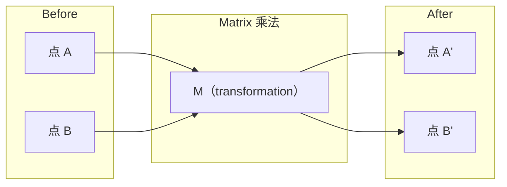
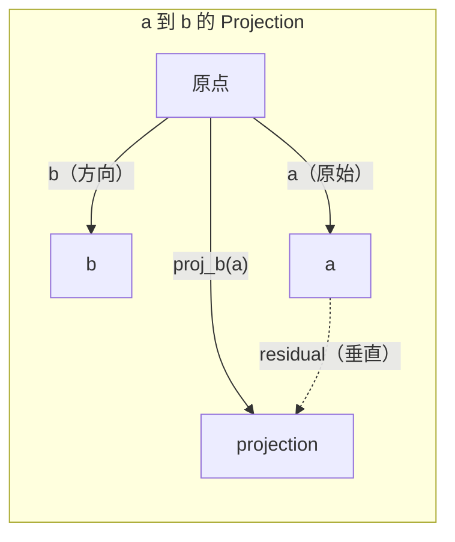

# Hình số tuyến tính 直觉

> Mỗi mô hình AI chỉ đeo một chiếc mũ đẹp đẽ của Matrix Mathematics.

**类型：**Học tập
**语言：**Python, Julia
**先修要求：**Giai đoạn 0
**时间：**~ 60 phút

## Học mục tiêu

- Trong Python từ zero thực hiện Vector và Matrix 运算 (加法点、产品、Matrix nhân)
- Từ quan điểm giải thích điểm sản phẩm, dự án và Gram-Schmidt quy trình trong làm gì
- Sử dụng giảm hàng 判断一组 độc lập tuyến tính của vector 
- Để kết nối khái niệm đại số tuyến tính với các ứng dụng trong AI: embedments, attention scores và LoRA

## 问题

打开任意一篇 ML论文──在第一页之内, bạn sẽ thấy Vector、Matrix、dot product 和 transformation──没有线性代数直觉时,这些只是符号──有它,你就能看到神经网络 实际上在做什么-- 在空间中移动点──

Bạn không cần phải là một nhà toán học. Bạn cần phải xem những phép tính này có nghĩa là gì trong hình học, và sau đó tự viết chúng thành mã.

## 概念

### Các vector là点 (từ hướng)

Vector chỉ là một danh sách số. Nhưng những số này có ý nghĩa.

**2D Vector [3, 2]：**

| x | y | 点 |
|---|---|-------|
| 3 | 2 | 这个 Vector 从原点 (0,0) 指向平面上的 (3, 2) |

Độ lớn của vector này là 3^2 + 2^2) = 13), hướng lên và hướng phải.

Trong AI, Vector biểu hiện mọi thứ:
- Một từ → một chứa 768 个数字的向量(它 đang được tích hợp trong không gian 含义)
- Một bức ảnh → Một vector gồm hàng triệu hình ảnh giá trị
- Một người dùng → một biểu thị ưu tiên Vector

### Matrix là biến đổi

Matrix sẽ chuyển một vector thành một vector khác. Nó có thể xoay quanh, thu nhỏ, kéo dài hoặc chiếu.



Trong AI, Matrix là mô hình:
- Nền mạng thần kinh trọng lượng → 将 input  chuyển thành output của Matrix
- Điểm chú ý → quyết định quan tâm gì Matrix của
- Các nhúng → 将词映射到 Dấu tử của Dấu tử

### Dấu hiệu sản phẩm 衡量相似性

Kết quả điểm của hai vector sẽ cho bạn biết chúng có nhiều điểm tương tự.

```
a · b = a₁×b₁ + a₂×b₂ + ... + aₙ×bₙ

方向相同：      a · b > 0  （相似）
相互垂直：      a · b = 0  （无关）
方向相反：      a · b < 0  （不相似）
```

Đây chính là cách thức của công cụ tìm kiếm, hệ thống đề xuất và RAG - tìm ra các vector sản phẩm điểm cao hơn.

### Tự do tuyến tính

Nếu trong tập hợp không có bất kỳ một vector nào có thể được viết thành một tập hợp của các vector khác, thì các vector này là một cách tuyến tính độc lập. Nếu v1、v2、v3 độc lập, chúng sẽ trải dài một không gian 3D. Nếu một trong số đó là một tập hợp của các vector khác, chúng chỉ trải dài một bình diện.

Nó quan trọng đối với AI: các tính năng của bạn nên có các cột độc lập tuyến tính. Nếu hai tính năng hoàn toàn liên quan, mô hình sẽ không thể phân biệt được tác động của chúng. Điều này sẽ gây ra tính đa tuyến tính trong sự trôi qua.

**具体示例：**

```
v1 = [1, 0, 0]
v2 = [0, 1, 0]
v3 = [2, 1, 0]   # v3 = 2*v1 + v2
```

v1 và v2 là độc lập của - 二者都不是另一个标量倍数或组合――但 v3 = 2*v1 + v2,所以 {v1, v2, v3} là một tập hợp phụ thuộc――这三个向量都位于xy-plane──无论你如何组合它们,都无法达到 [0, 0, 1]──你有三个向量,但只有两个自由维度──

Trong bộ dữ liệu: Nếu feature_3 = 2*feature_1 + feature_2, hãy tham gia feature_3 sẽ không mang lại bất kỳ thông tin mới nào cho mô hình.

### Cơ sở và cấp độ

Cơ sở là một nhóm các vector độc lập tuyến tính nhỏ nhất, chúng trải dài trên toàn bộ không gian.

Cơ sở tiêu chuẩn của 3D 空间 là {1,0,0], [0,1,0], [0,0,1]}── nhưng bất kỳ ba Dấu sao độc lập nào trong 3D đều có thể tạo thành cơ sở hợp lệ── chọn dựa trên cơ sở chính là chọn坐标──

Matrix của hàng = số lượng hàng tự do tuyến tính = số lượng hàng tự do tuyến tính. Nếu hàng < m ((( hàng, hàng), Matrix này là thiếu hàng.
- Hệ thống có vô tận nhiều giải pháp (hoặc không giải pháp)
- chuyển đổi 中丢失信息
- Matrix không thể được đảo ngược

| 情况 | Rank | 对 ML 的含义 |
|-----------|------|---------------------|
| Full rank (rank = min(m, n)) | 最大可能值 | 存在唯一 least-squares solution。Model well-conditioned。 |
| Rank deficient (rank < min(m, n)) | 低于最大值 | Features 冗余。有无穷多个 weight solutions。需要 regularization。 |
| Rank 1 | 1 | 每一列都是某个 Vector 的缩放副本。所有数据都位于一条线上。 |
| Near rank-deficient（较小的 singular values） | 数值上较低 | Matrix ill-conditioned。极小的 input noise 会造成很大的 output changes。使用 SVD truncation 或 ridge regression。 |

### Dự án

将 Vector**a**投影到 Vector **b**Nào, sẽ được **a**Trong **b**方向上的分量:

```
proj_b(a) = (a dot b / b dot b) * b
```

Hết thọ (a - proj_b(a)) 与 b 垂直── loại phân hủy trực giác này là nền tảng của các hình vuông nhỏ nhất.

Dự án trong ML không còn:
- Lịch chiếu trôi ngược tối thiểu quan sát đến khoảng cách của không gian cột -- 解本身就是一个投影
- PCA sẽ đưa dữ liệu vào hướng có sự khác biệt lớn nhất
- Các biến thể trung tâm của sự chú ý 会 tính toán các truy vấn đến các dự đoán của các khóa



**示例：**a = [3, 4], b = [1, 0]

Proj_b(a) = (3*1 + 4*0) / (1*1 + 0*0) * [1, 0] = 3 * [1, 0] = [3, 0]

Dự án này đã bỏ y phân tích. Đây là hình thức đơn giản nhất của việc giảm chiều kích.

### Quá trình Gram-Schmidt

将任意一组独立向量 转换为ortho-normal basis──Orthonormal nghĩa là mỗi向量 长度为 1,并且任意一对向量都互相垂直──

算法:
1. lấy thứ nhất vector, sẽ bình thường hóa nó
2. lấy vector thứ hai, giảm nó trong đầu tiên vector trên chiếu, bình thường hóa lại
3. lấy vector thứ ba, giảm nó trong tất cả các vector trước tiên trên các dự đoán, bình thường hóa lại
4. Đối với các vector còn lại 重复该过程

```
Input:  v1, v2, v3, ...（linearly independent）

u1 = v1 / |v1|

w2 = v2 - (v2 dot u1) * u1
u2 = w2 / |w2|

w3 = v3 - (v3 dot u1) * u1 - (v3 dot u2) * u2
u3 = w3 / |w3|

Output: u1, u2, u3, ...（orthonormal basis）
```

Đây là cách làm việc trong phân hủy QR. Q là cơ sở thông thường, R  nắm bắt các hệ số chiếu.
- 求解 tuyến tính hệ thống ((比 Gaussian loại bỏ 更稳定)
- 计算 eigenvalues(QR algorithm)
- Khung trở số lượng bình thường nhất (standard number value method)


```figure
eigen-directions
```

##  xây dựng nó

### 步骤 1: Từ zero thực hiện Vectors(Python)

```python
class Vector:
    def __init__(self, components):
        self.components = list(components)
        self.dim = len(self.components)

    def __add__(self, other):
        return Vector([a + b for a, b in zip(self.components, other.components)])

    def __sub__(self, other):
        return Vector([a - b for a, b in zip(self.components, other.components)])

    def dot(self, other):
        return sum(a * b for a, b in zip(self.components, other.components))

    def magnitude(self):
        return sum(x**2 for x in self.components) ** 0.5

    def normalize(self):
        mag = self.magnitude()
        return Vector([x / mag for x in self.components])

    def cosine_similarity(self, other):
        return self.dot(other) / (self.magnitude() * other.magnitude())

    def __repr__(self):
        return f"Vector({self.components})"


a = Vector([1, 2, 3])
b = Vector([4, 5, 6])

print(f"a + b = {a + b}")
print(f"a · b = {a.dot(b)}")
print(f"|a| = {a.magnitude():.4f}")
print(f"cosine similarity = {a.cosine_similarity(b):.4f}")
```

### 步骤 2: Từ zero thực hiện Matrices(Python)

```python
class Matrix:
    def __init__(self, rows):
        self.rows = [list(row) for row in rows]
        self.shape = (len(self.rows), len(self.rows[0]))

    def __matmul__(self, other):
        if isinstance(other, Vector):
            return Vector([
                sum(self.rows[i][j] * other.components[j] for j in range(self.shape[1]))
                for i in range(self.shape[0])
            ])
        rows = []
        for i in range(self.shape[0]):
            row = []
            for j in range(other.shape[1]):
                row.append(sum(
                    self.rows[i][k] * other.rows[k][j]
                    for k in range(self.shape[1])
                ))
            rows.append(row)
        return Matrix(rows)

    def transpose(self):
        return Matrix([
            [self.rows[j][i] for j in range(self.shape[0])]
            for i in range(self.shape[1])
        ])

    def __repr__(self):
        return f"Matrix({self.rows})"


rotation_90 = Matrix([[0, -1], [1, 0]])
point = Vector([3, 1])

rotated = rotation_90 @ point
print(f"Original: {point}")
print(f"Rotated 90°: {rotated}")
```

### Bước 3: Tại sao điều này rất quan trọng đối với AI

```python
import random

random.seed(42)
weights = Matrix([[random.gauss(0, 0.1) for _ in range(3)] for _ in range(2)])
input_vector = Vector([1.0, 0.5, -0.3])

output = weights @ input_vector
print(f"Input (3D): {input_vector}")
print(f"Output (2D): {output}")
print("This is what a neural network layer does -- matrix multiplication.")
```

### 步骤 4: Julia 版本

```julia
a = [1.0, 2.0, 3.0]
b = [4.0, 5.0, 6.0]

println("a + b = ", a + b)
println("a · b = ", a ⋅ b)       # Julia supports unicode operators
println("|a| = ", √(a ⋅ a))
println("cosine = ", (a ⋅ b) / (√(a ⋅ a) * √(b ⋅ b)))

# Matrix-vector multiplication
W = [0.1 -0.2 0.3; 0.4 0.5 -0.1]
x = [1.0, 0.5, -0.3]
println("Wx = ", W * x)
println("This is a neural network layer.")
```

### Bước 5: Từ zero thực hiện độc lập tuyến tính và dự đoán (Python)

```python
def is_linearly_independent(vectors):
    n = len(vectors)
    dim = len(vectors[0].components)
    mat = Matrix([v.components[:] for v in vectors])
    rows = [row[:] for row in mat.rows]
    rank = 0
    for col in range(dim):
        pivot = None
        for row in range(rank, len(rows)):
            if abs(rows[row][col]) > 1e-10:
                pivot = row
                break
        if pivot is None:
            continue
        rows[rank], rows[pivot] = rows[pivot], rows[rank]
        scale = rows[rank][col]
        rows[rank] = [x / scale for x in rows[rank]]
        for row in range(len(rows)):
            if row != rank and abs(rows[row][col]) > 1e-10:
                factor = rows[row][col]
                rows[row] = [rows[row][j] - factor * rows[rank][j] for j in range(dim)]
        rank += 1
    return rank == n


def project(a, b):
    scalar = a.dot(b) / b.dot(b)
    return Vector([scalar * x for x in b.components])


def gram_schmidt(vectors):
    orthonormal = []
    for v in vectors:
        w = v
        for u in orthonormal:
            proj = project(w, u)
            w = w - proj
        if w.magnitude() < 1e-10:
            continue
        orthonormal.append(w.normalize())
    return orthonormal


v1 = Vector([1, 0, 0])
v2 = Vector([1, 1, 0])
v3 = Vector([1, 1, 1])
basis = gram_schmidt([v1, v2, v3])
for i, u in enumerate(basis):
    print(f"u{i+1} = {u}")
    print(f"  |u{i+1}| = {u.magnitude():.6f}")

print(f"u1 · u2 = {basis[0].dot(basis[1]):.6f}")
print(f"u1 · u3 = {basis[0].dot(basis[2]):.6f}")
print(f"u2 · u3 = {basis[1].dot(basis[2]):.6f}")
```

## Sử dụng nó

Bây giờ hãy làm điều tương tự với NumPy - đây là cách bạn thực sự sử dụng trong thực hành:

```python
import numpy as np

a = np.array([1, 2, 3], dtype=float)
b = np.array([4, 5, 6], dtype=float)

print(f"a + b = {a + b}")
print(f"a · b = {np.dot(a, b)}")
print(f"|a| = {np.linalg.norm(a):.4f}")
print(f"cosine = {np.dot(a, b) / (np.linalg.norm(a) * np.linalg.norm(b)):.4f}")

W = np.random.randn(2, 3) * 0.1
x = np.array([1.0, 0.5, -0.3])
print(f"Wx = {W @ x}")
```

### Sử dụng NumPy  xử lý Rank、Projection 和 QR

```python
import numpy as np

A = np.array([[1, 2], [2, 4]])
print(f"Rank: {np.linalg.matrix_rank(A)}")

a = np.array([3, 4])
b = np.array([1, 0])
proj = (np.dot(a, b) / np.dot(b, b)) * b
print(f"Projection of {a} onto {b}: {proj}")

Q, R = np.linalg.qr(np.random.randn(3, 3))
print(f"Q is orthogonal: {np.allclose(Q @ Q.T, np.eye(3))}")
print(f"R is upper triangular: {np.allclose(R, np.triu(R))}")
```

### PyTorch -- Tensor là có thể tự động hóa các vector

```python
import torch

x = torch.randn(3, requires_grad=True)
y = torch.tensor([1.0, 0.0, 0.0])

similarity = torch.dot(x, y)
similarity.backward()

print(f"x = {x.data}")
print(f"y = {y.data}")
print(f"dot product = {similarity.item():.4f}")
print(f"d(dot)/dx = {x.grad}")
```

Các mô hình này được tính toán tự động bởi PyTorch. Mỗi hoạt động trong mạng Neural đều được cấu thành bởi các mô hình này.

Bạn chỉ mới xây dựng được một số code mà nó có thể hoàn thành. Bây giờ bạn biết những gì đã xảy ra ở tầng dưới.

## 交付 nó

本课会产出:
- `outputs/prompt-linear-algebra-tutor.md`-- một để để làm cho trợ lý AI qua几何直觉教授 của toán tuyến tính

##  liên kết

Mỗi nội dung trong bài học này đều liên kết đến các phần cụ thể của AI hiện đại:

| 概念 | 出现位置 |
|---------|------------------|
| Dot product | Transformers 中的 Attention scores，RAG 中的 cosine similarity |
| Matrix multiply | 每个 Neural Network layer，每个 linear transformation |
| Linear independence | Feature selection，避免 multicollinearity |
| Rank | 判断一个系统是否可解，LoRA（low-rank adaptation） |
| Projection | Linear Regression（投影到 column space）、PCA |
| Gram-Schmidt / QR | Numerical solvers，eigenvalue computation |
| Orthonormal basis | 稳定的 numerical computation，whitening transforms |

LoRA 值得特别说明──它通过将重量更新 分解为低级矩阵 来细调 LLMs──与其更新一个4096x4096的重量矩阵(16M参数),LoRA 更新两个尺寸为4096x16和16x4096的矩阵(131K参数)──rank-16 约束意味着LoRA 假设重量更新 位于完整的4096维空间内──这是线性代数在真正发挥作用的内──

## 练习

1. 实现 `Vector.angle_between(other)`, quay lại hai vector  giữa góc (单位为度)
2. Tạo một matrix quy mô 2D, làm cho x-đối hợp 翻倍、y-đối hợp 变为三倍, sau đó sẽ áp dụng nó cho Vector [1, 1]
3. 给定 5 个随机类词 矢量 ((dimension 50), sử dụng sự tương đồng cosine  tìm ra hai tương tự nhất
4. 验证 Gram-Schmidt đầu ra thực sự là orthonormal của: kiểm tra mỗi một đối số của sản phẩm chấm là 0, và mỗi vector của kích thước là 1
5.  tạo ra một thứ hạng 为 2 của 3x3 Matrix。 sử dụng `rank()`Phương pháp xác minh. Sau đó giải thích các cột này trải dài của các đối tượng hình học là gì.
6. 将 vector [1, 2, 3] 投投到 [1, 1, 1] 上──结果在几何上表示什么?

## 关键术语

| 术语 | 人们常说 | 实际含义 |
|------|----------------|----------------------|
| Vector | “一个箭头” | 一个数字列表，表示 n-dimensional space 中的点或方向 |
| Matrix | “一个数字表” | 一种 transformation，将 Vectors 从一个空间映射到另一个空间 |
| Dot product | “相乘再求和” | 衡量两个 Vectors 对齐程度的指标 -- similarity search 的核心 |
| Embedding | “某种 AI 魔法” | 一个表示某物含义（词、图像、用户）的 Vector |
| Linear independence | “它们不重叠” | 集合中没有任何 Vector 可以写成其他 Vector 的组合 |
| Rank | “有多少维” | Matrix 中 linearly independent columns（或 rows）的数量 |
| Projection | “影子” | 一个 Vector 在另一个 Vector 方向上的分量 |
| Basis | “坐标轴” | 一组最小的 independent Vectors，它们 span 该空间 |
| Orthonormal | “垂直的单位 Vectors” | 彼此互相垂直且各自长度为 1 的 Vectors |
