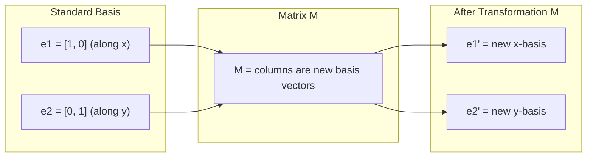
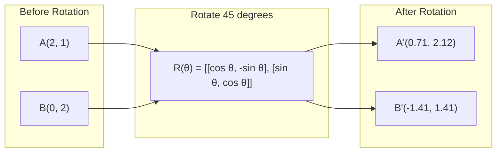
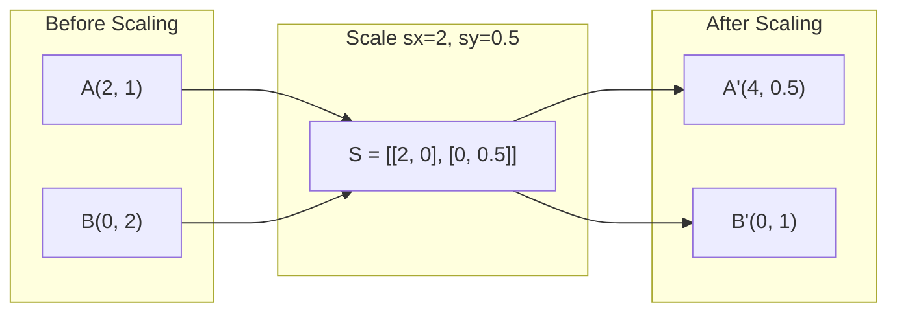
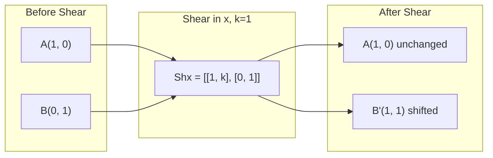
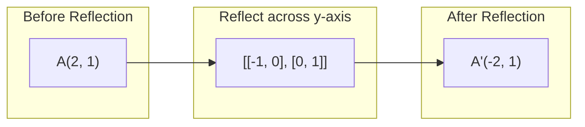
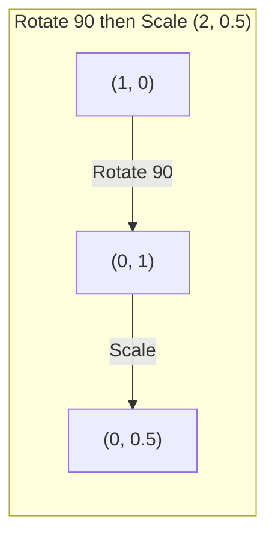
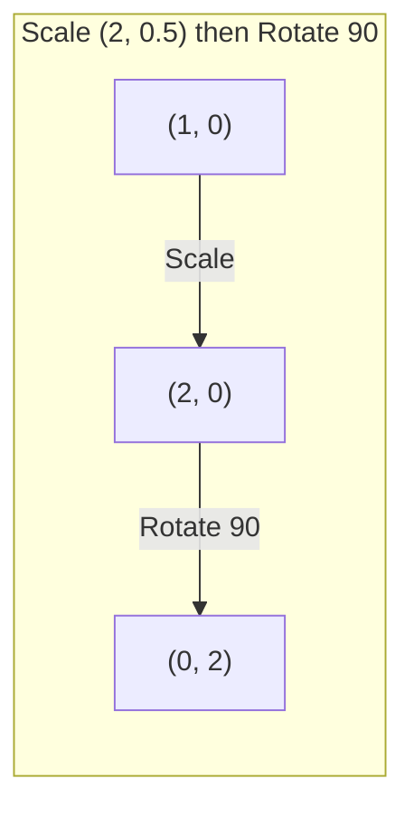

# Matrix 变换

> Matrix là một thiết bị tái tạo không gian. Nhận thức nó làm gì cho mỗi điểm, bạn đã hiểu toàn bộ sự thay đổi.

**类型：**构建
**语言：**Python, Julia
**先修要求：**Giai đoạn 1, Bài học 01-02 (Linear Algebra Intuition, Vectors & Matrix Operations)
**时间：**~ 75 phút

## Học mục tiêu

- 构建 quay, quy mô, cắt và các trền phản xạ,并将它们应用到2D和3D点
- Thông qua nhân số tử liệu 组合多个变换,并验证顺序 rất quan trọng
- Từ phương trình đặc trưng  tính toán các giá trị riêng của các matrix 2x2 và các vector riêng
- 解释 tại sao giá trị riêng quyết định PCA  hướng  RNN  ổn định và phân nhóm phổ  hành vi

## 问题

Bạn đọc đến PCA, bạn thấy tìm ra các vector chính của các matrix tính biến đồng. Bạn đọc đến mô hình ổn định, bạn thấy kiểm tra xem tất cả các giá trị chính có độ lớn dưới 1 . Bạn đọc đến tăng dữ liệu, bạn thấy áp dụng một xoay ngẫu nhiên. Bạn hiểu các matrix từ các hình học về không gian trước khi bạn làm gì, những điều này sẽ không có ý nghĩa thực sự.

Các matrix không chỉ là một mạng lưới số. Chúng là một thiết bị không gian. Các matrix quay sẽ quay và quay. Các matrix mở rộng sẽ mở rộng. Các matrix cắt sẽ nghiêng.

## 核心概念

### 作为矩阵的变化

Mỗi biến đổi tuyến tính trong 2D đều có thể được viết thành một matrix 2x2―― Matrix này sẽ chính xác cho bạn biết các vector cơ bản [1, 0] và [0, 1] cuối cùng đến đó―― tất cả mọi thứ còn lại đều được đưa ra bởi nó――



### Chuyển đổi

角度为 theta 2D quay sẽ giữ khoảng cách và góc không thay đổi. Nó làm cho mỗi điểm di chuyển dọc theo vòng vòng.



Trong 3D, bạn sẽ xoay quanh một trục xoay. Mỗi trục có trục xoay riêng của mình:

```
Rz(theta) = | cos  -sin  0 |     Rotate around z-axis
            | sin   cos  0 |     (x-y plane spins, z stays)
            |  0     0   1 |

Rx(theta) = | 1   0     0    |   Rotate around x-axis
            | 0  cos  -sin   |   (y-z plane spins, x stays)
            | 0  sin   cos   |

Ry(theta) = |  cos  0  sin |     Rotate around y-axis
            |   0   1   0  |     (x-z plane spins, y stays)
            | -sin  0  cos |
```

### Tăng quy mô

Scaling 会沿每个轴独立地拉伸或压缩──



### Trẻ

Việc cắt sẽ giữ một trục cố định đồng thời nghiêng trục khác. Nó sẽ biến hình dọc thành hình dọc bằng.



Các matrices cắt:
- `Shx = [[1, k], [0, 1]]`sẽ x 平移 k * y
- `Shy = [[1, 0], [k, 1]]`将 y 平移 k * x

### Nhận xét

Nhận xét sẽ đưa điểm dọc theo một trục hoặc trực tuyến như gương quá khứ.



Các matrix phản xạ:
- Dọc theo trục y phản xạ:`[[-1, 0], [0, 1]]`
- Dọc theo phản xạ trục x:`[[1, 0], [0, -1]]`

### Thành phần:串联变换

Trước tiên ứng dụng thay đổi A, tái ứng dụng thay đổi B, bằng giá để đưa các matrices của chúng`result = B @ A @ point`△顺序 rất quan trọng―先旋转 再次,与先次 再次,会得到不同结果―



组合后:`S @ R = [[0, -2], [0.5, 0]]`



组合后:`R @ S = [[0, -0.5], [2, 0]]`

Kết quả khác nhau: Matrix nhân không đáp ứng được luật giao dịch.

### Giá trị riêng và các vector riêng

Hầu hết các vector trong các matrix 作用后都会改变方向──Eigenvectors 非常特殊: matrix chỉ làm chúng nhỏ hơn, sẽ không bao giờ xoay chúng──这个缩小因子就是自值──

```
A @ v = lambda * v

v is the eigenvector (direction that survives)
lambda is the eigenvalue (how much it stretches)

Example: A = | 2  1 |
             | 1  2 |

Eigenvector [1, 1] with eigenvalue 3:
  A @ [1,1] = [3, 3] = 3 * [1, 1]     (same direction, scaled by 3)

Eigenvector [1, -1] with eigenvalue 1:
  A @ [1,-1] = [1, -1] = 1 * [1, -1]  (same direction, unchanged)
```

Cái tràng này 会沿 [1, 1] 方向把空间拉伸 3x,并保持 [1, -1] 不变──其他每方向都是这两方向的混合──

### Thành phần của nó

Nếu một matrix có n 个线性 không liên quan của các vector riêng, nó có thể được phân giải:

```
A = V @ D @ V^(-1)

V = matrix whose columns are eigenvectors
D = diagonal matrix of eigenvalues
V^(-1) = inverse of V

This says: rotate into eigenvector coordinates, scale along each axis, rotate back.
```

### Tại sao giá trị riêng  quan trọng

**PCA。**Các vector chính của matrix tính biến động là các thành phần chính. Các giá trị riêng sẽ cho bạn biết mỗi thành phần đã bắt được bao nhiêu sự biến động.

**稳定性。**Trong các mạng tái phát và các hệ thống động lực, các giá trị riêng của độ lớn > 1 sẽ dẫn đến phát nổ.

**Spectral methods。**Graph Neural Networks sử dụng các giá trị riêng của các matrix lân cận.

### Định nghĩa 作为体积缩放因子

Các định tính của trật tự biến đổi sẽ cho bạn biết nó đã làm giảm nhiều hơn.

```
det = 1:   area preserved (rotation)
det = 2:   area doubled
det = 0:   space crushed to lower dimension (singular)
det = -1:  area preserved but orientation flipped (reflection)

| det(Rotation) | = 1        (always)
| det(Scale sx, sy) | = sx * sy
| det(Shear) | = 1           (area preserved)
| det(Reflection) | = -1     (orientation flipped)
```


```figure
matrix-transform
```

##  xây dựng nó

### 步骤 1: từ zero thực hiện các matrices chuyển đổi (Python)

```python
import math

def rotation_2d(theta):
    c, s = math.cos(theta), math.sin(theta)
    return [[c, -s], [s, c]]

def scaling_2d(sx, sy):
    return [[sx, 0], [0, sy]]

def shearing_2d(kx, ky):
    return [[1, kx], [ky, 1]]

def reflection_x():
    return [[1, 0], [0, -1]]

def reflection_y():
    return [[-1, 0], [0, 1]]

def mat_vec_mul(matrix, vector):
    return [
        sum(matrix[i][j] * vector[j] for j in range(len(vector)))
        for i in range(len(matrix))
    ]

def mat_mul(a, b):
    rows_a, cols_b = len(a), len(b[0])
    cols_a = len(a[0])
    return [
        [sum(a[i][k] * b[k][j] for k in range(cols_a)) for j in range(cols_b)]
        for i in range(rows_a)
    ]

point = [1.0, 0.0]
angle = math.pi / 4

rotated = mat_vec_mul(rotation_2d(angle), point)
print(f"Rotate (1,0) by 45 deg: ({rotated[0]:.4f}, {rotated[1]:.4f})")

scaled = mat_vec_mul(scaling_2d(2, 3), [1.0, 1.0])
print(f"Scale (1,1) by (2,3): ({scaled[0]:.1f}, {scaled[1]:.1f})")

sheared = mat_vec_mul(shearing_2d(1, 0), [1.0, 1.0])
print(f"Shear (1,1) kx=1: ({sheared[0]:.1f}, {sheared[1]:.1f})")

reflected = mat_vec_mul(reflection_y(), [2.0, 1.0])
print(f"Reflect (2,1) across y: ({reflected[0]:.1f}, {reflected[1]:.1f})")
```

### 步骤 2: biến đổi thành phần

```python
R = rotation_2d(math.pi / 2)
S = scaling_2d(2, 0.5)

rotate_then_scale = mat_mul(S, R)
scale_then_rotate = mat_mul(R, S)

point = [1.0, 0.0]
result1 = mat_vec_mul(rotate_then_scale, point)
result2 = mat_vec_mul(scale_then_rotate, point)

print(f"Rotate 90 then scale: ({result1[0]:.2f}, {result1[1]:.2f})")
print(f"Scale then rotate 90: ({result2[0]:.2f}, {result2[1]:.2f})")
print(f"Same? {result1 == result2}")
```

### 步骤 3: từ zero tính toán giá trị riêng của mình(2x2)

Đối với một matrix 2x2`[[a, b], [c, d]]`,eigenvalues bởi phương trình đặc trưng 求解:`lambda^2 - (a+d)*lambda + (ad - bc) = 0`

```python
def eigenvalues_2x2(matrix):
    a, b = matrix[0]
    c, d = matrix[1]
    trace = a + d
    det = a * d - b * c
    discriminant = trace ** 2 - 4 * det
    if discriminant < 0:
        real = trace / 2
        imag = (-discriminant) ** 0.5 / 2
        return (complex(real, imag), complex(real, -imag))
    sqrt_disc = discriminant ** 0.5
    return ((trace + sqrt_disc) / 2, (trace - sqrt_disc) / 2)

def eigenvector_2x2(matrix, eigenvalue):
    a, b = matrix[0]
    c, d = matrix[1]
    if abs(b) > 1e-10:
        v = [b, eigenvalue - a]
    elif abs(c) > 1e-10:
        v = [eigenvalue - d, c]
    else:
        if abs(a - eigenvalue) < 1e-10:
            v = [1, 0]
        else:
            v = [0, 1]
    mag = (v[0] ** 2 + v[1] ** 2) ** 0.5
    return [v[0] / mag, v[1] / mag]

A = [[2, 1], [1, 2]]
vals = eigenvalues_2x2(A)
print(f"Matrix: {A}")
print(f"Eigenvalues: {vals[0]:.4f}, {vals[1]:.4f}")

for val in vals:
    vec = eigenvector_2x2(A, val)
    result = mat_vec_mul(A, vec)
    scaled = [val * vec[0], val * vec[1]]
    print(f"  lambda={val:.1f}, v={[round(x,4) for x in vec]}")
    print(f"    A@v = {[round(x,4) for x in result]}")
    print(f"    l*v = {[round(x,4) for x in scaled]}")
```

### 步骤 4:Determinant 作为体积缩缩因子

```python
def det_2x2(matrix):
    return matrix[0][0] * matrix[1][1] - matrix[0][1] * matrix[1][0]

print(f"det(rotation 45) = {det_2x2(rotation_2d(math.pi/4)):.4f}")
print(f"det(scale 2,3)   = {det_2x2(scaling_2d(2, 3)):.1f}")
print(f"det(shear kx=1)  = {det_2x2(shearing_2d(1, 0)):.1f}")
print(f"det(reflect y)   = {det_2x2(reflection_y()):.1f}")

singular = [[1, 2], [2, 4]]
print(f"det(singular)     = {det_2x2(singular):.1f}")
print("Singular: columns are proportional, space collapses to a line.")
```

## Sử dụng nó

NumPy sẽ sử dụng các quy trình tối ưu hóa để xử lý tất cả những điều này.

```python
import numpy as np

theta = np.pi / 4
R = np.array([[np.cos(theta), -np.sin(theta)],
              [np.sin(theta),  np.cos(theta)]])

point = np.array([1.0, 0.0])
print(f"Rotate (1,0) by 45 deg: {R @ point}")

S = np.diag([2.0, 3.0])
composed = S @ R
print(f"Scale(2,3) after Rotate(45): {composed @ point}")

A = np.array([[2, 1], [1, 2]], dtype=float)
eigenvalues, eigenvectors = np.linalg.eig(A)
print(f"\nEigenvalues: {eigenvalues}")
print(f"Eigenvectors (columns):\n{eigenvectors}")

for i in range(len(eigenvalues)):
    v = eigenvectors[:, i]
    lam = eigenvalues[i]
    print(f"  A @ v{i} = {A @ v}, lambda * v{i} = {lam * v}")

print(f"\ndet(R) = {np.linalg.det(R):.4f}")
print(f"det(S) = {np.linalg.det(S):.1f}")

B = np.array([[3, 1], [0, 2]], dtype=float)
vals, vecs = np.linalg.eig(B)
D = np.diag(vals)
V = vecs
reconstructed = V @ D @ np.linalg.inv(V)
print(f"\nEigendecomposition A = V @ D @ V^-1:")
print(f"Original:\n{B}")
print(f"Reconstructed:\n{reconstructed}")
```

### Sử dụng NumPy  thực hiện quay 3D

```python
def rotation_3d_z(theta):
    c, s = np.cos(theta), np.sin(theta)
    return np.array([[c, -s, 0], [s, c, 0], [0, 0, 1]])

def rotation_3d_x(theta):
    c, s = np.cos(theta), np.sin(theta)
    return np.array([[1, 0, 0], [0, c, -s], [0, s, c]])

point_3d = np.array([1.0, 0.0, 0.0])
rotated_z = rotation_3d_z(np.pi / 2) @ point_3d
rotated_x = rotation_3d_x(np.pi / 2) @ point_3d

print(f"\n3D point: {point_3d}")
print(f"Rotate 90 around z: {np.round(rotated_z, 4)}")
print(f"Rotate 90 around x: {np.round(rotated_x, 4)}")
```

## 交付 nó

本课为 PCA(Phase 2) 和 Neural Network 权重分析建立几何基础──这里构建的自值/eigenvector 代码,与生产级 ML 系统中支维度减少、光谱集群和稳定分析的算法相同──

## 练习

1. 将旋转、scaling 和 shearing 应用于一个单位平方(角点为 [0,0], [1,0], [1,1], [0,1]) ――分别打印每种变换后的角点──验证旋转 会保持角点之间的距离不变──

2. Sử dụng phương trình đặc trưng 手 tính các giá trị riêng của các ma trận [[4, 2], [1, 3]]。 sau đó sử dụng bạn từ zero thực hiện của hàm và NumPy  để thực hiện xác minh。

3. 创建三个变换的组合(旋转30 độ,按 [1.5, 0.8] thang, sử dụng kx=0.3 shear),并将其应用到按圆形排列的8个点上――印变换前后的坐标――计算组成矩阵的决定因素,并验证它等于各决定因素的乘积――

## 关键术语

| Term | 人们通常怎么说 | 它实际意味着什么 |
|------|----------------|----------------------|
| Rotation matrix | “旋转东西” | 一个 orthogonal matrix，会让点沿圆弧移动，同时保持距离和角度不变。Determinant 始终为 1。 |
| Scaling matrix | “让东西变大” | 一个 diagonal matrix，会沿每个轴独立地拉伸或压缩。Determinant 是 scale factors 的乘积。 |
| Shearing matrix | “让东西倾斜” | 一个 matrix，会让一个坐标按另一个坐标成比例平移，把矩形变成平行四边形。Determinant 为 1。 |
| Reflection | “镜像东西” | 一个 matrix，会把空间沿某个轴或平面翻转。Determinant 为 -1。 |
| Composition | “做两件事” | 通过相乘 transformation matrices 来串联操作。顺序很重要：B @ A 表示先应用 A，再应用 B。 |
| Eigenvector | “特殊方向” | 一个只会被 matrix 缩放、绝不会被旋转的方向。它是该变换的指纹。 |
| Eigenvalue | “拉伸了多少” | Matrix 缩放其 eigenvector 的标量因子。可以是负数（翻转），也可以是复数（rotation）。 |
| Eigendecomposition | “把 matrix 拆开” | 将一个 matrix 写成 V @ D @ V^(-1)，把它分离为基本缩放方向和幅度。 |
| Determinant | “来自 matrix 的一个数字” | 该变换缩放面积（2D）或体积（3D）的因子。零表示该变换不可逆。 |
| Characteristic equation | “eigenvalues 从哪里来” | det(A - lambda * I) = 0。它的根就是 eigenvalues。 |

## 延伸阅读

- [3Blue1Brown: Linear Transformations](https://www.3blue1brown.com/lessons/linear-transformations)-- 关于矩阵 如何重塑空间的视觉直觉
- [3Blue1Brown: Eigenvectors and Eigenvalues](https://www.3blue1brown.com/lessons/eigenvalues)-- cho các vector tự 几何含义的最佳视觉解释
- [MIT 18.06 Lecture 21: Eigenvalues and Eigenvectors](https://ocw.mit.edu/courses/18-06-linear-algebra-spring-2010/)- Bài thơ cổ điển của Gilbert Strang
