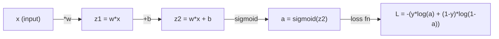
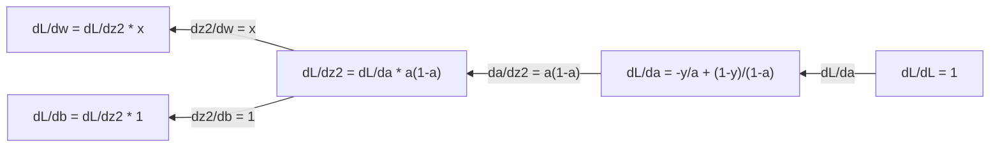
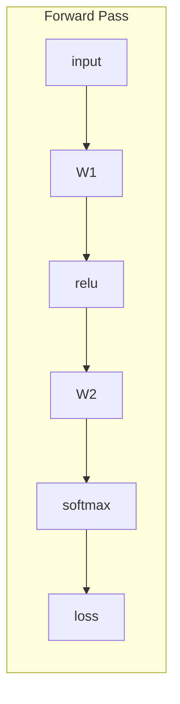
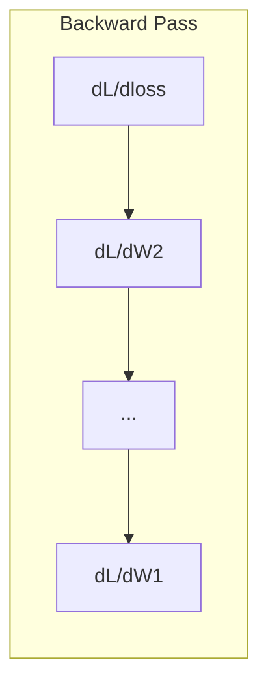

# Máy học 微积分

> 导数会告诉你哪边是下坡──这是神经网络学习所需的一切──

**Type:** Learn
**Language:**Python
**Prerequisites:** Phase 1, Lessons 01-03
**Time:** ~60 minutes

## Học mục tiêu

- 计算常见 ML 函数(x^2、sigmoid、cross-entropy) của số lượng định giá và số lượng phân tích
- Từ zero thực hiện giảm độ, trong 1D và 2D tối thiểu hóa Loss Function
- 推导 tuyến tính hồi quy 模型的渐变,并通过手动更新权重来训练它
- Giải thích Hessian Matrix、Taylor series gần giống, cũng như mối liên hệ của chúng với phương pháp tối ưu hóa

## 问题

Bạn có một mạng Neural có hàng triệu trọng lượng. Mỗi trọng lượng là một vòng quay. Bạn cần phải tìm ra hướng mà mỗi vòng quay nên chuyển hướng, để làm cho lỗi của mô hình nhỏ hơn một chút.

Không có điểm nhỏ, đào tạo mạng thần kinh là cố gắng thay đổi bất cứ lúc nào, sau đó hy vọng vào may mắn. Với số lượng dẫn, bạn có thể biết chính xác mỗi trọng lượng ảnh hưởng đến sai lầm.

## 概念

### - Quý vị là gì?

导数衡变率── đối với hàm y = f(x),导数 f'(x) sẽ nói với bạn: Nếu bạn đẩy x 微小地 một điểm, y sẽ thay đổi bao nhiêu?

Từ quan điểm, số dẫn là độ nghiêng của một đường cắt ở một điểm nào đó.

**f(x) = x^2：**

| x | f(x) | f'(x)（斜率） |
|---|------|---------------|
| 0 | 0    | 0（平坦，在底部） |
| 1 | 1    | 2 |
| 2 | 4    | 4（该点处切线的斜率） |
| 3 | 9    | 6 |

Khi x=2, tỷ lệ trượt là 4... nếu bạn đặt x về phía phải di chuyển rất nhỏ, y sẽ tăng số lượng di chuyển này 4 lần...

形式化定义:

```
f'(x) = lim   f(x + h) - f(x)
        h->0  -----------------
                     h
```

Trong mã, bạn sẽ nhảy qua giới hạn, trực tiếp sử dụng một h rất nhỏ.

### 偏导数: một lần chỉ nhìn một biến số

Thực hàm có rất nhiều đầu vào. Khung mất mạng thần kinh phụ thuộc vào hàng ngàn trọng lượng.

```
f(x, y) = x^2 + 3xy + y^2

df/dx = 2x + 3y     (treat y as a constant)
df/dy = 3x + 2y     (treat x as a constant)
```

Mỗi số hướng dẫn trả lời là: Nếu tôi chỉ giảm trọng lượng này, mất sẽ thay đổi như thế nào?

### Gradient: tất cả các đường dẫn cấu thành của vector

Gradient 会把每个偏导数集合成一个向量. Đối với hàm f ((x, y, z), Gradient là:

```
grad f = [ df/dx, df/dy, df/dz ]
```

Gradient chỉ hướng lên nhất. Để tối thiểu hóa một hàm, hãy hướng ngược hướng đi.

**f(x,y) = x^2 + y^2 的等高线图：**

Hàm này hình thành một hình dạng cong,等高线是同心圆.

| 点 | grad f | -grad f（下降方向） |
|-------|--------|----------------------------|
| (1, 1) | [2, 2]（指向上坡，远离最小值） | [-2, -2]（指向下坡，朝向最小值） |
| (0, 0) | [0, 0]（平坦，在最小值处） | [0, 0] |

Đây là một bức tranh về sự giảm dần.

### Liên hệ với Optimization

训练 Neural Network 就是优化──你有一个 Loss Function L(w1, w2, ..., wn), nó đo mô hình có nhiều lỗi──你想最小化它──

```
Gradient descent update rule:

  w_new = w_old - learning_rate * dL/dw

For every weight:
  1. Compute the partial derivative of loss with respect to that weight
  2. Subtract a small multiple of it from the weight
  3. Repeat
```

Tốc độ học tập  kiểm soát bước dài.  quá lớn sẽ vượt quá mục tiêu.  quá nhỏ sẽ trèo chậm.

**Loss landscape（1D 切片）：**

Loss Function L(w)  Với sự thay đổi của trọng lượng w hình thành một đường cong có đỉnh có谷.

| 特征 | 描述 |
|---------|-------------|
| Global minimum | 整条曲线上的最低点，即最佳解 |
| Local minimum | 比邻近位置更低、但不是整体最低点的谷 |
| Slope | Gradient Descent 会从任意起点沿斜率向下走 |

Sự giảm dần sẽ theo chiều dốc giảm. Nó có thể rơi vào mức tối thiểu địa phương, nhưng trong không gian cao (năm triệu trọng), đây là một vấn đề thực tế.

### 数值导数 vs 解析导数

计算导数 có hai cách:

解析方式:手动应用微积分规则── đối với f(x) = x^2,导数是 f'(x) = 2x──精确,快速──

Cách số giá trị: sử dụng định nghĩa để tiến hành gần似── đối với một h rất nhỏ 计算 f(x+h) 和 f(x-h), sau đó lấy差分──

```
Numerical (central difference):

f'(x) ~= f(x + h) - f(x - h)
          -----------------------
                  2h

h = 0.0001 works well in practice
```

Số giá trị dẫn đường chậm hơn, nhưng áp dụng cho bất kỳ hàm nào.

### 手动推导简单函数的导数

Đây là số lượng dẫn bạn sẽ thấy nhiều lần trong ML.

```
Function        Derivative       Used in
--------        ----------       -------
f(x) = x^2     f'(x) = 2x      Loss functions (MSE)
f(x) = wx + b  f'(w) = x        Linear layer (gradient w.r.t. weight)
                f'(b) = 1        Linear layer (gradient w.r.t. bias)
                f'(x) = w        Linear layer (gradient w.r.t. input)
f(x) = e^x     f'(x) = e^x     Softmax, attention
f(x) = ln(x)   f'(x) = 1/x     Cross-entropy loss
f(x) = 1/(1+e^-x)  f'(x) = f(x)(1-f(x))   Sigmoid activation
```

对于 f(x) = x^2:

```
f(x) = x^2    f'(x) = 2x

  x    f(x)   f'(x)   meaning
  -2    4      -4      slope tilts left (decreasing)
  -1    1      -2      slope tilts left (decreasing)
   0    0       0      flat (minimum!)
   1    1       2      slope tilts right (increasing)
   2    4       4      slope tilts right (increasing)
```

对于 f(w) = wx + b,且 x=3、b=1:

```
f(w) = 3w + 1    f'(w) = 3

The derivative with respect to w is just x.
If x is big, a small change in w causes a big change in output.
```

### 链式法则

Khi hàm xảy ra, các quy tắc chuỗi sẽ cho bạn biết làm thế nào để tìm kiếm hướng dẫn.

```
If y = f(g(x)), then dy/dx = f'(g(x)) * g'(x)

Example: y = (3x + 1)^2
  outer: f(u) = u^2       f'(u) = 2u
  inner: g(x) = 3x + 1    g'(x) = 3
  dy/dx = 2(3x + 1) * 3 = 6(3x + 1)
```

Mạng thần kinh là một chuỗi hàm: input -> linear -> activation -> linear -> activation -> loss。Backpropagation chính là từ输出 đến输入反复应用链式法则。 đây là toàn bộ thuật toán。

### Matrix Hessian

Gradient 告诉你斜率──Hessian 告诉你曲率──

Hessian là thứ hai của các số định hướng cấu thành Matrix。 đối với hàm f ((x1, x2, ..., xn), Hessian của (i, j) 项 là:

```
H[i][j] = d^2f / (dx_i * dx_j)
```

对于二变量函数 f ((x, y):

```
H = | d^2f/dx^2    d^2f/dxdy |
    | d^2f/dydx    d^2f/dy^2 |
```

**Hessian 在临界点（Gradient = 0 的地方）告诉你什么：**

| Hessian 性质 | 含义 | 示例曲面 |
|-----------------|---------|-----------------|
| 正定（所有 eigenvalues > 0） | Local minimum | 向上开口的碗 |
| 负定（所有 eigenvalues < 0） | Local maximum | 向下开口的碗 |
| 不定（eigenvalues 正负混合） | Saddle point | 马鞍形 |

**示例：**f(x, y) = x^2 - y^2(một cái ghế 函数)

```
df/dx = 2x       df/dy = -2y
d^2f/dx^2 = 2    d^2f/dy^2 = -2    d^2f/dxdy = 0

H = | 2   0 |
    | 0  -2 |

Eigenvalues: 2 and -2 (one positive, one negative)
--> Saddle point at (0, 0)
```

与 f(x, y) = x^2 + y^2(一个碗形函数)

```
H = | 2  0 |
    | 0  2 |

Eigenvalues: 2 and 2 (both positive)
--> Local minimum at (0, 0)
```

**为什么 Hessian 在 ML 中重要：**

Phương pháp Newton sử dụng Hessian để áp dụng hơn là giảm độ tốt hơn. Nó không chỉ theo đường cong, cũng sẽ xem xét tỷ lệ cong:

```
Newton's update:    w_new = w_old - H^(-1) * gradient
Gradient descent:   w_new = w_old - lr * gradient
```

Phương pháp của Newton 收更快, vì Hessian 会 tái缩缩 Gradient:方向的步子更小,平坦方向的步子更大──

 Vấn đề nằm ở: Đối với mạng thần kinh có N 参数, Hessian là N x N. Một mô hình có 100 triệu参数 cần một matrix có chứa 1 tỷ nguyên tố. Đó là lý do chúng tôi sử dụng phương pháp gần gũi.

| 方法 | 使用什么 | 成本 | 收敛 |
|--------|-------------|------|-------------|
| Gradient Descent | 只使用一阶导数 | 每步 O(N) | 慢（线性） |
| Newton's method | 完整 Hessian | 每步 O(N^3) | 快（二次） |
| L-BFGS | 从 Gradient 历史近似 Hessian | 每步 O(N) | 中等（超线性） |
| Adam | 每参数自适应 rate（对角 Hessian 近似） | 每步 O(N) | 中等 |
| Natural gradient | Fisher information matrix（统计 Hessian） | 每步 O(N^2) | 快 |

Trong thực tế, Adam là Optimizer mặc định của Deep Learning. Nó theo dõi mỗi yếu tố của Gradient, để giảm chi phí gần như 2 giai đoạn thông tin.

### Taylor Series gần似

Bất kỳ hàm phẳng nào có thể được sử dụng nhiều phương pháp gần như:

```
f(x + h) = f(x) + f'(x)*h + (1/2)*f''(x)*h^2 + (1/6)*f'''(x)*h^3 + ...
```

包含的项越多,近似越好, nhưng chỉ ở điểm x 附近成立──

**为什么 Taylor series 对 ML 重要：**

- **一阶 Taylor = Gradient Descent。**Khi bạn sử dụng f(x + h) ~ f(x) + f'(x) *h 时, bạn đang làm đường tính gần giống。 Gradient Descent 会最小化这个线性模型,从而选择 h = -lr * f'(x)。

- **二阶 Taylor = Newton's method。**Sử dụng f(x + h) ~ f(x) + f'(x) *h + (1/2) *f'(x) *h^2 时, bạn nhận được một mô hình thứ hai.

- **Loss Function 设计。**MSE và cross-entropy là trơn tru, có nghĩa là sự mở rộng Taylor của chúng biểu hiện tốt.

```
Approximation order    What it captures    Optimization method
-------------------    -----------------   -------------------
0th order (constant)   Just the value      Random search
1st order (linear)     Slope               Gradient descent
2nd order (quadratic)  Curvature           Newton's method
Higher orders          Finer structure     Rarely used in ML
```

关键洞见是: tất cả các tối ưu hóa dựa trên Gradient, bản chất đều là hàm mất gần như tại chỗ, và hướng tới giá trị tối thiểu của hàm gần như.

### ML Trung tâm积分

导数 nói với bạn tỷ lệ biến đổi.

Trong ML, bạn rất ít tính toán bằng tay, nhưng khái niệm này không có ở đâu cả:

**概率。**Đối với sự biến đổi liên tục có mật độ p (x):
```
P(a < X < b) = integral from a to b of p(x) dx
```
概率 độ mật độ đường cong trong a và b                                                                                                                                                                                                                                                                                                                                                                                                                                                                                                                  

**期望值。**按概率加权的平均结果:
```
E[f(X)] = integral of f(x) * p(x) dx
```
Sự mất mát dự kiến trên phân bố dữ liệu là một积分―― tập luyện tối thiểu hóa là kinh nghiệm của nó gần như――

**KL divergence。**- đo hai phân bố khác nhau:
```
KL(p || q) = integral of p(x) * log(p(x) / q(x)) dx
```
Sử dụng VAEs, phân giải tri thức và suy luận Bayesian.

**归一化常数。**Trong suy luận Bayesian 中:
```
p(w | data) = p(data | w) * p(w) / integral of p(data | w) * p(w) dw
```
分母 là số lượng của tất cả các giá trị tham số có thể. Nó thường là không thể xử lý, đó là lý do chúng tôi sử dụng MCMC và suy luận biến đổi, ví dụ.

| 积分概念 | 在 ML 中出现的位置 |
|-----------------|----------------------|
| 曲线下面积 | 由 density functions 得到概率 |
| 期望值 | Loss Functions、risk minimization |
| KL divergence | VAEs、policy optimization、distillation |
| 归一化 | Bayesian posteriors、softmax denominator |
| Marginal likelihood | Model comparison、evidence lower bound (ELBO) |

### Xếp tính toán Trung 中的多变量链式法则

链式法则不仅适用于一条线上的标量函数――在神经网络中,变量会分叉并合并――下面展示导数如何流过一个简单的前进传:



Hướng ngược 会从右到左计算 Gradient:



Mỗi mũi tên đều được nhân trên số dẫn địa phương. Tỷ lệ của bất kỳ tham số nào, là số nhân của tất cả các số dẫn địa phương trên đường dẫn từ Loss đến các tham số này. Khi đường dẫn phân chia và hợp nhất, bạn sẽ đưa phần đóng góp của các đường dẫn vào nhau.

Tất cả nội dung của backpropagation là: từ đầu ra đến nhập, hệ thống trong biểu đồ tính toán.

### Matrix Jacobian

Khi một hàm把 Vector 映射到 Vector 时(ví dụ như lớp mạng thần kinh), số dẫn của nó là một Matrix。 Jacobian 包含每个输出对每个输入的所有偏导数。

Đối với f: R^n -> R^m, Jacobian J là một m x n Matrix:

| | x1 | x2 | ... | xn |
|---|---|---|---|---|
| f1 | df1/dx1 | df1/dx2 | ... | df1/dxn |
| f2 | df2/dx1 | df2/dx2 | ... | df2/dxn |
| ... | ... | ... | ... | ... |
| fm | dfm/dx1 | dfm/dx2 | ... | dfm/dxn |

Bạn sẽ không làm việc với mạng Neural Handlet tính toán Jacobian。PyTorch sẽ xử lý nó。 nhưng biết nó tồn tại, giúp bạn hiểu được hình dạng trong Backpropagation: Nếu một lớp đặt R^n 映射 đến R^m, Jacobian của nó là m x n。Gradient sẽ qua chuyển đổi của Matrix này sang dòng chảy sau。

### Tại sao điều này rất quan trọng đối với mạng thần kinh?

Mỗi trọng lượng trong mạng thần kinh sẽ được một Gradient.





Mỗi lần quyền tải:
- `W1 = W1 - lr * dL/dW1`
- `W2 = W2 - lr * dL/dW2`

Chuyển về phía trước 计算预测和 Loss── lùi qua 计算 Loss 相对于每权重的梯度──然后每权重都向下坡方向迈一小步──重复数百万步──这就是深度学习──


```figure
derivative-tangent
```

##  xây dựng nó

### 步骤 1: Từ 0 thực hiện số giá trị

```python
def numerical_derivative(f, x, h=1e-7):
    return (f(x + h) - f(x - h)) / (2 * h)

def f(x):
    return x ** 2

for x in [-2, -1, 0, 1, 2]:
    numerical = numerical_derivative(f, x)
    analytical = 2 * x
    print(f"x={x:2d}  f'(x) numerical={numerical:.6f}  analytical={analytical:.1f}")
```

Các định vị số và định vị phân tích đều phù hợp trên nhiều số nhỏ.

### 步骤 2: định hướng số với Gradient

```python
def numerical_gradient(f, point, h=1e-7):
    gradient = []
    for i in range(len(point)):
        point_plus = list(point)
        point_minus = list(point)
        point_plus[i] += h
        point_minus[i] -= h
        partial = (f(point_plus) - f(point_minus)) / (2 * h)
        gradient.append(partial)
    return gradient

def f_multi(point):
    x, y = point
    return x**2 + 3*x*y + y**2

grad = numerical_gradient(f_multi, [1.0, 2.0])
print(f"Numerical gradient at (1,2): {[f'{g:.4f}' for g in grad]}")
print(f"Analytical gradient at (1,2): [2*1+3*2, 3*1+2*2] = [{2*1+3*2}, {3*1+2*2}]")
```

### 步骤 3: dùng Gradient Descent  tìm f(x) = x ^ 2 của giá trị tối thiểu

```python
x = 5.0
lr = 0.1
for step in range(20):
    grad = 2 * x
    x = x - lr * grad
    print(f"step {step:2d}  x={x:8.4f}  f(x)={x**2:10.6f}")
```

Từ x=5  bắt đầu, mỗi bước sẽ gần x=0 ((mức tối thiểu) ⋅

### 步骤 4: thực hiện Gradient Descent trên hàm 2D

```python
def f_2d(point):
    x, y = point
    return x**2 + y**2

point = [4.0, 3.0]
lr = 0.1
for step in range(30):
    grad = numerical_gradient(f_2d, point)
    point = [p - lr * g for p, g in zip(point, grad)]
    loss = f_2d(point)
    if step % 5 == 0 or step == 29:
        print(f"step {step:2d}  point=({point[0]:7.4f}, {point[1]:7.4f})  f={loss:.6f}")
```

### Bước 5: So sánh số lượng và phân tích số lượng

```python
import math

test_functions = [
    ("x^2",      lambda x: x**2,          lambda x: 2*x),
    ("x^3",      lambda x: x**3,          lambda x: 3*x**2),
    ("sin(x)",   lambda x: math.sin(x),   lambda x: math.cos(x)),
    ("e^x",      lambda x: math.exp(x),   lambda x: math.exp(x)),
    ("1/x",      lambda x: 1/x,           lambda x: -1/x**2),
]

x = 2.0
print(f"{'Function':<12} {'Numerical':>12} {'Analytical':>12} {'Error':>12}")
print("-" * 50)
for name, f, df in test_functions:
    num = numerical_derivative(f, x)
    ana = df(x)
    err = abs(num - ana)
    print(f"{name:<12} {num:12.6f} {ana:12.6f} {err:12.2e}")
```

### 步骤 6: số giá trị tính toán Hessian

```python
def hessian_2d(f, x, y, h=1e-5):
    fxx = (f(x + h, y) - 2 * f(x, y) + f(x - h, y)) / (h ** 2)
    fyy = (f(x, y + h) - 2 * f(x, y) + f(x, y - h)) / (h ** 2)
    fxy = (f(x + h, y + h) - f(x + h, y - h) - f(x - h, y + h) + f(x - h, y - h)) / (4 * h ** 2)
    return [[fxx, fxy], [fxy, fyy]]

def saddle(x, y):
    return x ** 2 - y ** 2

def bowl(x, y):
    return x ** 2 + y ** 2

H_saddle = hessian_2d(saddle, 0.0, 0.0)
H_bowl = hessian_2d(bowl, 0.0, 0.0)
print(f"Saddle Hessian: {H_saddle}")  # [[2, 0], [0, -2]] -- mixed signs
print(f"Bowl Hessian:   {H_bowl}")    # [[2, 0], [0, 2]]  -- both positive
```

saddle  hàm của Hessian có eigenvalues 2 和 -2(符号混合, xác nhận là điểm saddle)。 bowl  hàm có eigenvalues 2 和 2(均为正, xác nhận là tối thiểu)。

### 步骤 7:Taylor gần似的实际效果

```python
import math

def taylor_approx(f, f_prime, f_double_prime, x0, h, order=2):
    result = f(x0)
    if order >= 1:
        result += f_prime(x0) * h
    if order >= 2:
        result += 0.5 * f_double_prime(x0) * h ** 2
    return result

x0 = 0.0
for h in [0.1, 0.5, 1.0, 2.0]:
    true_val = math.sin(h)
    t1 = taylor_approx(math.sin, math.cos, lambda x: -math.sin(x), x0, h, order=1)
    t2 = taylor_approx(math.sin, math.cos, lambda x: -math.sin(x), x0, h, order=2)
    print(f"h={h:.1f}  sin(h)={true_val:.4f}  order1={t1:.4f}  order2={t2:.4f}")
```

Ở x0=0 附近,sin(x) ~ x(一阶泰勒) ―― Đối với h rất nhỏ, phương pháp này giống như rất tốt; nhưng đối với h lớn hơn, nó sẽ thất bại── đó là lý do tại sao sự giảm cấp trong tỷ lệ học tập nhỏ 下效率 tốt nhất: mỗi bước đều giả định phương pháp này giống như chính xác──

### Bước 8: Tại sao điều này rất quan trọng đối với mạng thần kinh

```python
import random

random.seed(42)

w = random.gauss(0, 1)
b = random.gauss(0, 1)
lr = 0.01

xs = [1.0, 2.0, 3.0, 4.0, 5.0]
ys = [3.0, 5.0, 7.0, 9.0, 11.0]

for epoch in range(200):
    total_loss = 0
    dw = 0
    db = 0
    for x, y in zip(xs, ys):
        pred = w * x + b
        error = pred - y
        total_loss += error ** 2
        dw += 2 * error * x
        db += 2 * error
    dw /= len(xs)
    db /= len(xs)
    total_loss /= len(xs)
    w -= lr * dw
    b -= lr * db
    if epoch % 40 == 0 or epoch == 199:
        print(f"epoch {epoch:3d}  w={w:.4f}  b={b:.4f}  loss={total_loss:.6f}")

print(f"\nLearned: y = {w:.2f}x + {b:.2f}")
print(f"Actual:  y = 2x + 1")
```

Mỗi vòng tập dựa trên Gradient đều theo mô hình này: dự đoán, tính Loss, tính Gradient, tính quyền tải mới.

## Sử dụng nó

Sử dụng NumPy 时, tương tự hoạt động sẽ nhanh hơn, đơn giản hơn:

```python
import numpy as np

x = np.array([1, 2, 3, 4, 5], dtype=float)
y = np.array([3, 5, 7, 9, 11], dtype=float)

w, b = np.random.randn(), np.random.randn()
lr = 0.01

for epoch in range(200):
    pred = w * x + b
    error = pred - y
    loss = np.mean(error ** 2)
    dw = np.mean(2 * error * x)
    db = np.mean(2 * error)
    w -= lr * dw
    b -= lr * db

print(f"Learned: y = {w:.2f}x + {b:.2f}")
```

Bạn刚刚从零构建 Gradient Descent──PyTorch 会 tự động hoàn thành Gradient 计算, nhưng vòng lặp mới là hoàn toàn giống như vậy──

## 练习

1. Sử dụng调用两次 `numerical_derivative`Cách thực hiện`numerical_second_derivative(f, x)` Thử nghiệm x^3 trong x=2 处的二阶导数是12──
2. 使用 Gradient Descent 找到 f(x, y) = (x - 3) ^ 2 + (y + 1) ^ 2 的最小值──从 (0, 0) 开始──答案应收到 (3, -1)──
3. Trong vòng tròn giảm cấp độ, bạn có thể thêm động lực:维护一个会累积过去

## 关键术语

| 术语 | 人们常说 | 实际含义 |
|------|----------------|----------------------|
| Derivative | “斜率” | 函数在某一点的变化率。告诉你输入每变化一个单位，输出会变化多少。 |
| Partial derivative | “一个变量的导数” | 在保持其他所有变量不变时，对某一个变量求导。 |
| Gradient | “最陡上升方向” | 由所有偏导数组成的 Vector。指向让函数增长最快的方向。 |
| Gradient Descent | “往下坡走” | 从参数中减去 Gradient（乘以 learning rate），从而降低 Loss。Neural Network 训练的核心。 |
| Learning rate | “步长” | 控制每一步 Gradient Descent 有多大的标量。太大：发散。太小：收敛缓慢。 |
| Chain rule | “把导数相乘” | 对复合函数求导的规则：df/dx = df/dg * dg/dx。Backpropagation 的数学基础。 |
| Jacobian | “导数 Matrix” | 当一个函数把 Vector 映射到 Vector 时，Jacobian 是所有输出相对于输入的偏导数组成的 Matrix。 |
| Numerical derivative | “有限差分” | 通过在两个相邻点上评估函数并计算它们之间的斜率来近似导数。 |
| Backpropagation | “Reverse-mode autodiff” | 使用链式法则，从输出到输入逐层计算 Gradient。Neural Network 就是这样学习的。 |
| Hessian | “二阶导数 Matrix” | 所有二阶偏导数组成的 Matrix。描述函数的曲率。在临界点处 Hessian 正定意味着 local minimum。 |
| Taylor series | “多项式近似” | 使用函数的导数在某一点附近近似函数：f(x+h) ~ f(x) + f'(x)h + (1/2)f''(x)h^2 + ... 它是理解 Gradient Descent 和 Newton's method 为什么有效的基础。 |
| Integral | “曲线下面积” | 某个量在一个范围内的累积。在 ML 中，积分定义概率、期望值和 KL divergence。 |

## 延伸阅读

- [3Blue1Brown: Essence of Calculus](https://www.3blue1brown.com/topics/calculus)- Về định lượng,积分 và quy tắc chuỗi trực quan
- [Stanford CS231n: Backpropagation](https://cs231n.github.io/optimization-2/)- Gradient 如何流过神经网络层
