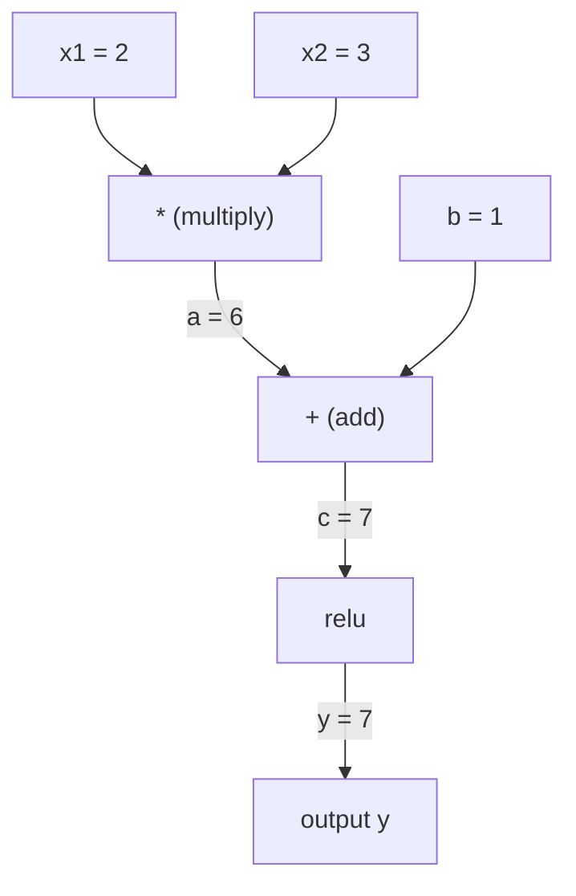
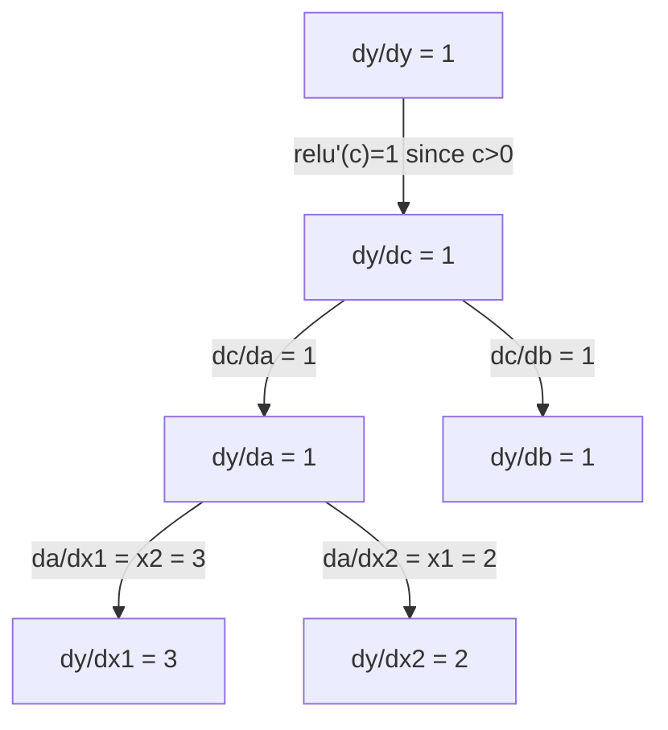

# Quy tắc chuỗi và phân biệt tự động

> Quy tắc chuỗi là động cơ đằng sau mạng thần kinh của mọi người có thể học.

**类型：**Xây dựng
**语言：**Python
**前置要求：**Giai đoạn 1, Bài học 04 (Thế xuất & Gradients)
**时间：**约90分钟

## Học mục tiêu

- 构建一个极简 autograd 引擎(Value class),记录操作并通过逆模式 autodiff 计算 Gradient
- Sử dụng loại topological trong biểu đồ tính toán 中实现前和后传
- Chỉ sử dụng động cơ tự động từ zero thực hiện, xây dựng và đào tạo một perceptron đa tầng trên XOR
- Sử dụng kiểm tra gradient, sẽ tự xác định với giá trị số khác biệt hữu hạn đối với tỷ lệ, xác minh sự chính xác

## 问题

Bạn có thể tính toán số dẫn của hàm đơn giản. Nhưng mạng Neural không phải là hàm đơn giản. Nó được tạo thành từ một tập hợp của hàng trăm hàm: matrix nhân, thêm thiên vị, ứng dụng kích hoạt, một lần nữa nhân, mềmmax, mất đi entropy.

Để tập mạng, bạn cần phải giảm so với mỗi trọng lượng Gradient. Đối với hàng triệu các số liệu thủ công, điều này là không thể hoàn thành.

Quy tắc chuỗi  đưa ra cơ sở toán học. Định dạng tự động. Định dạng toán học.

Đó là cách PyTorch, TensorFlow và JAX làm việc. Bạn sẽ xây dựng một phiên bản nhỏ từ không.

## 核心概念

### Quy tắc chuỗi

Nếu `y = f(g(x))`Vậy thì`y`So với `x`导数 là:

```
dy/dx = dy/dg * dg/dx = f'(g(x)) * g'(x)
```

沿着链条将导数相乘―― mỗi环节 đóng góp bản địa của mình导数――

Ví dụ:`y = sin(x^2)`

```
g(x) = x^2       g'(x) = 2x
f(g) = sin(g)     f'(g) = cos(g)

dy/dx = cos(x^2) * 2x
```

Đối với các cấu trúc sâu hơn, chuỗi sẽ tiếp tục kéo dài:

```
y = f(g(h(x)))

dy/dx = f'(g(h(x))) * g'(h(x)) * h'(x)
```

Mỗi tầng trong mạng thần kinh, đều là một phần trong chuỗi này.

### Hình đồ tính toán

Hình đồ tính 让链规则可视化──每个操作都将成为一个节点──数据沿图向前流动──Gradient向后流动──

**Forward pass（计算值）：**



**Backward pass（计算 Gradient）：**



Hướng ngược sẽ được áp dụng tại mỗi nút của quy tắc chuỗi, sẽ được chuyển từ phát triển truyền đến nhập.

### Mô hình hướng trước vs mô hình hướng ngược

Có hai cách bạn có thể áp dụng trong biểu đồ Quy tắc chuỗi.

**Forward mode**Từ nhập bắt đầu, sẽ dẫn số hướng trước推──它计算 `dx/dx = 1`,并通过每操作传播――适合输入少、输出多场景――

```
Forward mode: seed dx/dx = 1, propagate forward

  x = 2       (dx/dx = 1)
  a = x^2     (da/dx = 2x = 4)
  y = sin(a)  (dy/dx = cos(a) * da/dx = cos(4) * 4 = -2.615)
```

**Reverse mode**Từ đầu ra, sẽ Gradient hướng về phía sau.`dy/dy = 1`, và theo thứ tự ngược chiều thông qua mỗi hoạt động truyền đi.

```
Reverse mode: seed dy/dy = 1, propagate backward

  y = sin(a)  (dy/dy = 1)
  a = x^2     (dy/da = cos(a) = cos(4) = -0.654)
  x = 2       (dy/dx = dy/da * da/dx = -0.654 * 4 = -2.615)
```

Mạng thần kinh có hàng triệu lượt vào (trọng lượng) và một lượt ra (output) và một lượt mất (loss) ―― chế độ ngược có thể được tính trong một lần trượt ngược trong một hệ thống tính toán tất cả các gradient── đây là nguyên nhân của Backpropagation sử dụng chế độ ngược──

| Mode | Seed | Direction | Best when |
|------|------|-----------|-----------|
| Forward | `dx_i/dx_i = 1` | 输入到输出 | 输入少、输出多 |
| Reverse | `dy/dy = 1` | 输出到输入 | 输入多、输出少（neural nets） |

### Sử dụng theo chế độ Forward của số đôi

Phương thức tiến có thể sử dụng số hai 优雅地实现──双数的形式是`a + b*epsilon`, trong số đó `epsilon^2 = 0`

```
Dual number: (value, derivative)

(2, 1) means: value is 2, derivative w.r.t. x is 1

Arithmetic rules:
  (a, a') + (b, b') = (a+b, a'+b')
  (a, a') * (b, b') = (a*b, a'*b + a*b')
  sin(a, a')         = (sin(a), cos(a)*a')
```

sẽ định số chuyển đổi nhập được đặt là 1― định số sẽ tự động thông qua mỗi hoạt động truyền―

### 构建 Autograd 引擎

Một động cơ tự động cần ba điều:

1. **Value wrapping。**Để mỗi số được gói trong một đối tượng, để lưu trữ giá trị và Gradient của nó.
2. **Graph recording。**Mỗi hoạt động ghi lại các hàm Gradient của nó vào và địa phương.
3. **Backward pass。**Để biểu đồ làm loại topological, sau đó ngược hướng xuyên suốt, trong mỗi node áp dụng Chain Rule.

Đó là của PyTorch.`autograd`Những việc cần làm.`torch.Tensor`class 包裹值, trong `requires_grad=True`时记录操作, và bạn调用 `.backward()`时计算 Gradient。

### PyTorch Autograd 底层 làm việc thế nào

Khi bạn viết PyTorch 代码时:

```python
x = torch.tensor(2.0, requires_grad=True)
y = x ** 2 + 3 * x + 1
y.backward()
print(x.grad)  # 7.0 = 2*x + 3 = 2*2 + 3
```

PyTorch trong nội dung:

1. Vì vậy`x` tạo ra một `Tensor`节点,并设置 `requires_grad=True`
2. Mỗi hành động`**``*``+`) sẽ tạo ra một nút mới,并 ghi lại ngược lại
3. `y.backward()`触发对已记录图的反向模式自动调动
4. Mỗi điểm của nó`grad_fn`计算局部 Gradient,并将它们传给父节点
5. Gradient 通过加法(不是替换)累积到 `.grad`属性中

Đây là biểu đồ của động thái (được xác định theo chạy) ⋅ mỗi lần đi trước thành phố sẽ xây dựng một biểu đồ mới ⋅ đây là lý do tại sao PyTorch 支持在模型中使用控制流 (nếu/nếu khác ⋅ vòng lặp) ⋅


```figure
chain-rule
```

##  xây dựng nó

### 步骤 1:Value class

```python
class Value:
    def __init__(self, data, children=(), op=''):
        self.data = data
        self.grad = 0.0
        self._backward = lambda: None
        self._prev = set(children)
        self._op = op

    def __repr__(self):
        return f"Value(data={self.data:.4f}, grad={self.grad:.4f})"
```

Mỗi người`Value` lưu trữ số lượng dữ liệu của riêng mình  Gradient初始为零)  một hàm ngược, cũng như chỉ số của các nút con của nó để tạo ra

### 步骤 2:带 Gradient theo dõi của toán thuật操作

```python
    def __add__(self, other):
        other = other if isinstance(other, Value) else Value(other)
        out = Value(self.data + other.data, (self, other), '+')
        def _backward():
            self.grad += out.grad
            other.grad += out.grad
        out._backward = _backward
        return out

    def __mul__(self, other):
        other = other if isinstance(other, Value) else Value(other)
        out = Value(self.data * other.data, (self, other), '*')
        def _backward():
            self.grad += other.data * out.grad
            other.grad += self.data * out.grad
        out._backward = _backward
        return out

    def relu(self):
        out = Value(max(0, self.data), (self,), 'relu')
        def _backward():
            self.grad += (1.0 if out.data > 0 else 0.0) * out.grad
        out._backward = _backward
        return out
```

Mỗi hoạt động sẽ tạo ra một kết thúc, nó biết làm thế nào để tính toán phần Gradient,并乘以上游 Gradient(`out.grad`(■)`+=`处理 là trường hợp sử dụng một giá trị được nhiều lần xử lý.

### 步骤 3: Quay ngược

```python
    def backward(self):
        topo = []
        visited = set()
        def build_topo(v):
            if v not in visited:
                visited.add(v)
                for child in v._prev:
                    build_topo(child)
                topo.append(v)
        build_topo(self)

        self.grad = 1.0
        for v in reversed(topo):
            v._backward()
```

Loại topological  đảm bảo từng node của Gradient 在传播到其子节点 之前已完整计算──种子 Gradient là 1.0 ((dy/dy = 1)。

### Bước 4: Máy động hoàn chỉnh cần nhiều hơn

基础 Giá trị lớp  hỗ trợ gia tăng,乘法 và relu.., thực sự tự động hóa  động cơ cần nhiều năng lực hơn.

```python
    def __neg__(self):
        return self * -1

    def __sub__(self, other):
        return self + (-other)

    def __radd__(self, other):
        return self + other

    def __rmul__(self, other):
        return self * other

    def __rsub__(self, other):
        return other + (-self)

    def __pow__(self, n):
        out = Value(self.data ** n, (self,), f'**{n}')
        def _backward():
            self.grad += n * (self.data ** (n - 1)) * out.grad
        out._backward = _backward
        return out

    def __truediv__(self, other):
        return self * (other ** -1) if isinstance(other, Value) else self * (Value(other) ** -1)

    def exp(self):
        import math
        e = math.exp(self.data)
        out = Value(e, (self,), 'exp')
        def _backward():
            self.grad += e * out.grad
        out._backward = _backward
        return out

    def log(self):
        import math
        out = Value(math.log(self.data), (self,), 'log')
        def _backward():
            self.grad += (1.0 / self.data) * out.grad
        out._backward = _backward
        return out

    def tanh(self):
        import math
        t = math.tanh(self.data)
        out = Value(t, (self,), 'tanh')
        def _backward():
            self.grad += (1 - t ** 2) * out.grad
        out._backward = _backward
        return out
```

**每个操作为什么重要：**

| Operation | Backward rule | Used in |
|-----------|--------------|---------|
| `__sub__` | 复用 add + neg | Loss 计算（pred - target） |
| `__pow__` | n * x^(n-1) | Polynomial activations、MSE（error^2） |
| `__truediv__` | 复用 mul + pow(-1) | Normalization、learning rate scaling |
| `exp` | exp(x) * upstream | Softmax、log-likelihood |
| `log` | (1/x) * upstream | Cross-entropy loss、log probabilities |
| `tanh` | (1 - tanh^2) * upstream | 经典 activation function |

巧妙之处 nằm ở:`__sub__`和 `__truediv__`Nó được xác định bởi các hoạt động đã có. Chúng sẽ tự động nhận được Gradient chính xác, vì Chain Rule sẽ đi qua các add/mul/pow 操作组组合.

### Bước 5: Từ không thực hiện Mini MLP

Với lớp giá trị hoàn chỉnh, bạn có thể xây dựng mạng thần kinh không cần PyTorch không cần NumPy chỉ có giá trị và quy tắc chuỗi

```python
import random

class Neuron:
    def __init__(self, n_inputs):
        self.w = [Value(random.uniform(-1, 1)) for _ in range(n_inputs)]
        self.b = Value(0.0)

    def __call__(self, x):
        act = sum((wi * xi for wi, xi in zip(self.w, x)), self.b)
        return act.tanh()

    def parameters(self):
        return self.w + [self.b]

class Layer:
    def __init__(self, n_inputs, n_outputs):
        self.neurons = [Neuron(n_inputs) for _ in range(n_outputs)]

    def __call__(self, x):
        return [n(x) for n in self.neurons]

    def parameters(self):
        return [p for n in self.neurons for p in n.parameters()]

class MLP:
    def __init__(self, sizes):
        self.layers = [Layer(sizes[i], sizes[i+1]) for i in range(len(sizes)-1)]

    def __call__(self, x):
        for layer in self.layers:
            x = layer(x)
        return x[0] if len(x) == 1 else x

    def parameters(self):
        return [p for layer in self.layers for p in layer.parameters()]
```

Một `Neuron`计算 `tanh(w1*x1 + w2*x2 + ... + b)` Một `Layer`Là một neuron 列表.`MLP`n đống nhiều lớp. Mỗi lớp đều có trọng lượng.`Value`, để调用 `loss.backward()`会把 Gradient 传播到每个参数.

**在 XOR 上训练：**

```python
random.seed(42)
model = MLP([2, 4, 1])  # 2 inputs, 4 hidden neurons, 1 output

xs = [[0, 0], [0, 1], [1, 0], [1, 1]]
ys = [-1, 1, 1, -1]  # XOR pattern (using -1/1 for tanh)

for step in range(100):
    preds = [model(x) for x in xs]
    loss = sum((p - y) ** 2 for p, y in zip(preds, ys))

    for p in model.parameters():
        p.grad = 0.0
    loss.backward()

    lr = 0.05
    for p in model.parameters():
        p.data -= lr * p.grad

    if step % 20 == 0:
        print(f"step {step:3d}  loss = {loss.data:.4f}")

print("\nPredictions after training:")
for x, y in zip(xs, ys):
    print(f"  input={x}  target={y:2d}  pred={model(x).data:6.3f}")
```

Đó là micrograd. Một vòng tròn đào tạo mạng thần kinh hoàn chỉnh được thực hiện bằng Python tự động và phân biệt.

### 步骤 6: Kiểm tra độ

Bạn biết sao tự động của bạn là đúng? So sánh nó với số giá trị dẫn.

```python
def gradient_check(build_expr, x_val, h=1e-7):
    x = Value(x_val)
    y = build_expr(x)
    y.backward()
    autodiff_grad = x.grad

    y_plus = build_expr(Value(x_val + h)).data
    y_minus = build_expr(Value(x_val - h)).data
    numerical_grad = (y_plus - y_minus) / (2 * h)

    diff = abs(autodiff_grad - numerical_grad)
    return autodiff_grad, numerical_grad, diff
```

Trong một biểu hiện phức tạp trên test nó:

```python
def expr(x):
    return (x ** 3 + x * 2 + 1).tanh()

ad, num, diff = gradient_check(expr, 0.5)
print(f"Autodiff:  {ad:.8f}")
print(f"Numerical: {num:.8f}")
print(f"Difference: {diff:.2e}")
# Difference should be < 1e-5
```

实现新操作时,gradient checking 至关重要―― Nếu quá trình ngược của bạn có lỗi, kiểm tra số lượng sẽ phát hiện ra nó―― mỗi nghiêm túc Deep Learning 实现都会在开发期间运行梯度检查――

**什么时候使用 gradient checking：**

| Situation | Do gradient check? |
|-----------|-------------------|
| 向 autograd 添加新操作 | 是，始终要做 |
| 调试无法收敛的训练循环 | 是，先检查 Gradient |
| 生产训练 | 否，太慢（每个参数需要 2 次 forward pass） |
| autograd 代码的 unit tests | 是，将它自动化 |

### Bước 7: Kiểm tra kết quả

```python
x1 = Value(2.0)
x2 = Value(3.0)
a = x1 * x2          # a = 6.0
b = a + Value(1.0)    # b = 7.0
y = b.relu()          # y = 7.0

y.backward()

print(f"y = {y.data}")          # 7.0
print(f"dy/dx1 = {x1.grad}")   # 3.0 (= x2)
print(f"dy/dx2 = {x2.grad}")   # 2.0 (= x1)
```

Hướng dẫn:`y = relu(x1*x2 + 1)`Vì vậy`x1*x2 + 1 = 7 > 0`, Relu là danh tính.
`dy/dx1 = x2 = 3``dy/dx2 = x1 = 2`◊ kết quả của động cơ phù hợp.

## Sử dụng nó

### 与 PyTorch 验证

```python
import torch

x1 = torch.tensor(2.0, requires_grad=True)
x2 = torch.tensor(3.0, requires_grad=True)
a = x1 * x2
b = a + 1.0
y = torch.relu(b)
y.backward()

print(f"PyTorch dy/dx1 = {x1.grad.item()}")  # 3.0
print(f"PyTorch dy/dx2 = {x2.grad.item()}")  # 2.0
```

Kết quả tính toán của động cơ của bạn tương tự như PyTorch, bởi vì cơ sở toán học là giống nhau: thông qua Quy tắc chuỗi 实现逆模式自动化.

### Một biểu hiện phức tạp hơn

```python
a = Value(2.0)
b = Value(-3.0)
c = Value(10.0)
f = (a * b + c).relu()  # relu(2*(-3) + 10) = relu(4) = 4

f.backward()
print(f"df/da = {a.grad}")  # -3.0 (= b)
print(f"df/db = {b.grad}")  #  2.0 (= a)
print(f"df/dc = {c.grad}")  #  1.0
```

## 交付内容

本课会产出:
- `outputs/skill-autodiff.md`-- một kỹ năng để xây dựng và điều chỉnh hệ thống tự cấp
- `code/autodiff.py`-- Một động cơ tự động có thể tiếp tục mở rộng

Các lớp giá trị được xây dựng trong đó là cơ sở của vòng tròn đào tạo của mạng lưới thần kinh giai đoạn 3.

## 练习

1. 向 giá trị lớp 添加 `__pow__`, để bạn có thể tính toán `x ** n`❖ 验证在 `x=2`时,`d/dx(x^3)`Đúng vậy.`12.0`

2. 添加 `tanh`作为激活函数──验证 `tanh'(0) = 1`且 `tanh'(2) = 0.0707`(đáng gần)

3. Để tạo ra một biểu đồ tính toán của một tế bào thần kinh:`y = relu(w1*x1 + w2*x2 + b)`△计算全部五个 Gradient,并与 PyTorch 验证──

4. Sử dụng số hai 实现 forward-mode autodiff── tạo một `Dual`lớp,并验证 nó cung cấp số dẫn cùng với chế độ ngược 引擎.

## 关键术语

| Term | What people say | What it actually means |
|------|----------------|----------------------|
| Chain rule | “把导数相乘” | 组合函数的导数等于每个函数在正确位置处的局部导数之积 |
| Computational graph | “网络图” | 一个有向无环图，其中节点是操作，边承载值（forward）或 Gradient（backward） |
| Forward mode | “向前推导数” | 将导数从输入传播到输出的 autodiff。每个输入变量需要一次 pass。 |
| Reverse mode | “Backpropagation” | 将 Gradient 从输出传播到输入的 autodiff。每个输出变量需要一次 pass。 |
| Autograd | “自动 Gradient” | 一个系统：记录对值执行的操作、构建 graph，并通过 Chain Rule 计算精确 Gradient |
| Dual numbers | “值加导数” | 形式为 a + b*epsilon（epsilon^2 = 0）的数字，可以在算术运算中携带导数信息 |
| Topological sort | “依赖顺序” | 对 graph 节点排序，使每个节点都位于其所有依赖之后。正确传播 Gradient 所必需。 |
| Gradient accumulation | “相加，不要替换” | 当一个值流入多个操作时，它的 Gradient 是所有传入 Gradient 贡献的总和 |
| Dynamic graph | “Define by run” | 每次 forward pass 都重新构建的 computation graph，允许模型内部使用 Python 控制流（PyTorch 风格） |
| Gradient checking | “数值验证” | 将 autodiff Gradient 与数值 finite-difference Gradient 对比，以验证正确性。调试时必不可少。 |
| MLP | “Multi-layer perceptron” | 一个包含一层或多层隐藏 neuron 的 Neural Network。每个 neuron 计算加权和加 bias，然后应用 activation function。 |
| Neuron | “加权和 + activation” | 基本单元：output = activation(w1*x1 + w2*x2 + ... + b)。weights 和 bias 是可学习参数。 |

## 延伸阅读

- [3Blue1Brown: Backpropagation calculus](https://www.youtube.com/watch?v=tIeHLnjs5U8)-- Khả năng nhìn thấy của quy tắc chuỗi trong mạng thần kinh
- [PyTorch Autograd mechanics](https://pytorch.org/docs/stable/notes/autograd.html)-- 真实系统的工作方式
- [Baydin et al., Automatic Differentiation in Machine Learning: a Survey](https://arxiv.org/abs/1502.05767)-- 综合参考
