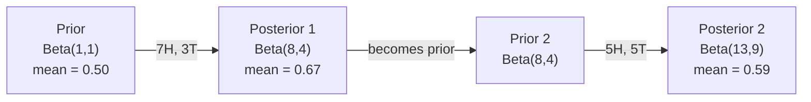

# Lý thuyết Bayes

> Khả năng  quan tâm đến những gì bạn mong đợi sẽ xảy ra.

**类型：**Xây dựng
**语言：**Python
**前置要求：**Giai đoạn 1, Bài học 06 (Thông ngữ cơ bản về xác suất)
**时间：**~ 75 phút

## Học mục tiêu

-  áp dụng định lý Bayes, dựa trên xác suất trước và bằng chứng  tính toán xác suất sau
- Từ zero xây dựng một có Laplace làm trơn và tính toán log-space của Naive Bayes 文本分类器
- So sánh ước tính MLE và MAP,并 giải thích MAP 如何 đối phó với L2
- Sử dụng Beta-Binomial conjugate prior để thử nghiệm A / B  thực hiện cập nhật Bayesian theo trình tự

## 问题

Một xét nghiệm y tế có tỷ lệ chính xác 99%... kết quả xét nghiệm của bạn dương tính... xác suất mắc bệnh thực sự của bạn là bao nhiêu?

Hầu hết mọi người sẽ nói 99%──trả lời thực sự phụ thuộc vào sự hiếm gặp của căn bệnh này──Nếu chỉ có 1 người trong số 10.000 người bị bệnh, thì kết quả dương tính một lần chỉ có nghĩa là bạn có tỷ lệ mắc bệnh khoảng 1%──trả lời dương tính 99% khác là những thông báo sai lầm do người khỏe mạnh gây ra──.

Đây không phải là lý thuyết Bayes. Mỗi bộ lọc spam, mỗi chẩn đoán y tế, mỗi mô hình ML không chắc chắn đều sử dụng cùng một lý thuyết. Trước tiên bạn có một niềm tin.

Nếu bạn không hiểu được điều này trong khi xây dựng hệ thống ML, bạn sẽ hiểu sai các sản phẩm mô hình, đặt ngưỡng tồi tệ và đưa ra dự đoán tự tin quá mức.

## 概念

### Từ xác suất chung đến Bayes

Bạn đã biết trong bài học 06 khả năng có điều kiện là:

```
P(A|B) = P(A and B) / P(B)
```

Đối với:

```
P(B|A) = P(A and B) / P(A)
```

Hai biểu hiện chia sẻ cùng một phân tử: P(A và B) ――令它们相等并重新整理:

```
P(A and B) = P(A|B) * P(B) = P(B|A) * P(A)

Therefore:

P(A|B) = P(B|A) * P(A) / P(B)
```

Đó là định lý Bayes.

### 4 phần

| Part | Name | What it means |
|------|------|---------------|
| P(A\|B) | Posterior | 看到 evidence B 之后，你对 A 的更新后 belief |
| P(B\|A) | Likelihood | 如果 A 为真，evidence B 出现的概率有多大 |
| P(A) | Prior | 在看到任何 evidence 之前，你对 A 的 belief |
| P(B) | Evidence | 在所有可能性下看到 B 的总概率 |

Bằng chứng 项 P(B) 起归一化因子的作用──你可以用总概率法 展开它:

```
P(B) = P(B|A) * P(A) + P(B|not A) * P(not A)
```

### 医学检测 ví dụ

Một căn bệnh ảnh hưởng đến 1 người trong 10.000 người. Tỷ lệ kiểm tra chính xác là 99%.

```
P(sick)          = 0.0001     (prior: disease is rare)
P(positive|sick) = 0.99       (likelihood: test catches it)
P(positive|healthy) = 0.01    (false positive rate)

P(positive) = P(positive|sick) * P(sick) + P(positive|healthy) * P(healthy)
            = 0.99 * 0.0001 + 0.01 * 0.9999
            = 0.000099 + 0.009999
            = 0.010098

P(sick|positive) = P(positive|sick) * P(sick) / P(positive)
                 = 0.99 * 0.0001 / 0.010098
                 = 0.0098
                 = 0.98%
```

Không đến 1%──Trang số chủ yếu──Khi một tình huống rất hiếm, ngay cả khi kiểm tra chính xác cũng có thể tạo ra kết quả sai.

### Ví dụ về bộ lọc spam

Bạn nhận được một email có chứa một từ "những cuộc đấu" . Nó là spam ư?

```
P(spam)                = 0.3      (30% of email is spam)
P("lottery"|spam)      = 0.05     (5% of spam emails contain "lottery")
P("lottery"|not spam)  = 0.001    (0.1% of legitimate emails contain "lottery")

P("lottery") = 0.05 * 0.3 + 0.001 * 0.7
             = 0.015 + 0.0007
             = 0.0157

P(spam|"lottery") = 0.05 * 0.3 / 0.0157
                  = 0.955
                  = 95.5%
```

Một từ sẽ đưa tỷ lệ từ 30%  tăng lên 95,5% ⋅ thực tế lọc spam sẽ được áp dụng trên hàng trăm từ ⋅

### Bayes ngây thơ: giả định độc lập

Bayes ngây thơ 通过假设 tất cả các tính năng trong các điều kiện của một lớp nhất định, mở rộng suy nghĩ này thành nhiều tính năng:

```
P(class | feature_1, feature_2, ..., feature_n)
  = P(class) * P(feature_1|class) * P(feature_2|class) * ... * P(feature_n|class)
    / P(feature_1, feature_2, ..., feature_n)
```

Một phần của "tâm" là giả định độc lập. Trong văn bản, sự xuất hiện của từ không phải là độc lập. "New" và "York" là liên quan.

Vì phân tử đối với tất cả các lớp đều giống nhau, bạn có thể nhảy qua nó, chỉ so sánh phân tử:

```
score(class) = P(class) * product of P(feature_i | class)
```

选择 điểm số cao nhất lớp:

### Đánh giá xác suất tối đa (MLE)

如何从训练数据得到P                                                                                                                                                                                                                                                           

```
P("free"|spam) = (number of spam emails containing "free") / (total spam emails)
```

Đây là MLE: chọn để cho các tham số dữ liệu quan sát có thể xuất hiện nhất. Bạn đang tối đa hóa hàm xác suất; đối với số phân tán, nó sẽ được đơn giản hóa thành tần số tương đối.

问题: Nếu một từ trong quá trình tập luyện chưa bao giờ xuất hiện trong spam, MLE sẽ phân phối cho nó tỷ lệ xác suất 0.

```
P(word|class) = (count(word, class) + 1) / (total_words_in_class + vocabulary_size)
```

Đưa cho mỗi con số thêm 1, đảm bảo bất kỳ xác suất nào sẽ không bị đánh giá 0.

### Tối đa a posteriori (MAP)

MLE 问的是: Which parameters maximize P((((((((((((((((((((((((((((((((((((((((((((((((((((((((((((((((((((((((((((((((((((((((((((((((((((((((((((((((((((((((((((((((((((((((((((((((((((((((((((((((((((((((((((((((((((((((((((((((((((((((((((((((((((((((((((((((((((((((((((((((((((((((((((((((((((((((((((((((((((((((((((((((((((((((((((((((((((((((((((((((((((((((((((((((((((((((((((((((((((((((((((((((((((((((((((((((((((((((((((((((((((((((((((((((((((((((((((((((((((((((((((((((((((((((((((((((((((((((((((((((((((((((((((((((((

MAP 问: những tham số nào tối đa hóa các tham số trong dữ liệu)?

Theo định lý Bayes:

```
P(parameters|data) proportional to P(data|parameters) * P(parameters)
```

MAP sẽ được đặt trên các tham số tự nhiên để gia nhập một hình phạt trước đây. Nếu bạn nghĩ các tham số  nên nhỏ hơn, hãy mã hóa nó để trừng phạt giá trị lớn trước đây.

| Estimation | Optimizes | ML equivalent |
|------------|-----------|---------------|
| MLE | P(data\|params) | 未 regularize 的训练 |
| MAP | P(data\|params) * P(params) | L2 / L1 regularization |

### Bayesian vs frequentist: thực tế差异

Các nhà tần số đặt các tham số như là một lượng cố định nhưng không thể biết được. Họ hỏi:

Bayesian đặt các tham số 视为分布──他们问:  dựa trên những gì tôi đã quan sát thấy, tôi có niềm tin gì về các tham số này?

Đối với cấu trúc ML 系统, thực tế khác biệt như sau:

| Aspect | Frequentist | Bayesian |
|--------|-------------|----------|
| Output | 点估计 | 值上的 distribution |
| Uncertainty | Confidence intervals（关于过程） | Credible intervals（关于 parameter） |
| Small data | 可能 overfit | Prior 起到 regularization 的作用 |
| Computation | 通常更快 | 通常需要 sampling（MCMC） |

Đại đa số sản xuất lớp ML là thường xuyên của SGD  điểm ước tính) ⋅ khi bạn cần chuẩn bị cho sự không chắc chắn tốt (đánh giá của các phương pháp này là rất ít) ⋅ khi bạn cần chuẩn bị cho các phương pháp này sẽ rất hữu ích.

### Tại sao tư duy Bayesian đối với ML  rất quan trọng

Sự liên quan này là:

**Priors 就是 regularization。**trọng lượng trên của Gaussian trước là L2 thường xuyên hóa. Lỗ trước là L1. Mỗi lần thêm thường xuyên hóa. Khi bạn đang đối với các giá trị tham số mong đợi, bạn đang thực hiện một câu lệnh Bayesian.

**Posteriors 就是不确定性。**单个预测概率 không thể nói cho bạn mô hình có nhiều sự tự tin đối với ước tính này.

**Bayes updates 就是 online learning。**Những gì sau ngày hôm nay sẽ trở thành những gì trước ngày mai. Khi mô hình của bạn nhìn thấy dữ liệu mới, nó sẽ tăng cường cải tiến niềm tin của mình, thay vì luyện tập từ không.

**Model comparison 是 Bayesian 的。**Biểu tượng thông tin Bayesian (BIC)  xác suất biên và các yếu tố Bayes đều sử dụng lý luận Bayesian trong trường hợp không phù hợp để chọn mô hình.


```figure
bayes-update
```

##  xây dựng nó
### 步骤 1: Bayes hàm định lý

```python
def bayes(prior, likelihood, false_positive_rate):
    evidence = likelihood * prior + false_positive_rate * (1 - prior)
    posterior = likelihood * prior / evidence
    return posterior

result = bayes(prior=0.0001, likelihood=0.99, false_positive_rate=0.01)
print(f"P(sick|positive) = {result:.4f}")
```

### 步骤 2:Naive Bayes phân loại

```python
import math
from collections import defaultdict

class NaiveBayes:
    def __init__(self, smoothing=1.0):
        self.smoothing = smoothing
        self.class_counts = defaultdict(int)
        self.word_counts = defaultdict(lambda: defaultdict(int))
        self.class_word_totals = defaultdict(int)
        self.vocab = set()

    def train(self, documents, labels):
        for doc, label in zip(documents, labels):
            self.class_counts[label] += 1
            words = doc.lower().split()
            for word in words:
                self.word_counts[label][word] += 1
                self.class_word_totals[label] += 1
                self.vocab.add(word)

    def predict(self, document):
        words = document.lower().split()
        total_docs = sum(self.class_counts.values())
        vocab_size = len(self.vocab)
        best_class = None
        best_score = float("-inf")
        for cls in self.class_counts:
            score = math.log(self.class_counts[cls] / total_docs)
            for word in words:
                count = self.word_counts[cls].get(word, 0)
                total = self.class_word_totals[cls]
                score += math.log((count + self.smoothing) / (total + self.smoothing * vocab_size))
            if score > best_score:
                best_score = score
                best_class = cls
        return best_class
```

Các xác suất log có thể ngăn chặn sự chảy thấp. Nhiều tỷ lệ xác suất nhỏ sẽ được tạo ra đối với điểm nổi để nói là số nhỏ hơn.

### 步骤 3: tập luyện trên dữ liệu spam

```python
train_docs = [
    "win free money now",
    "free lottery ticket winner",
    "claim your prize today free",
    "urgent offer free cash",
    "congratulations you won free",
    "meeting tomorrow at noon",
    "project update attached",
    "can we schedule a call",
    "quarterly report review",
    "lunch on thursday sounds good",
    "team standup notes attached",
    "please review the pull request",
]

train_labels = [
    "spam", "spam", "spam", "spam", "spam",
    "ham", "ham", "ham", "ham", "ham", "ham", "ham",
]

classifier = NaiveBayes()
classifier.train(train_docs, train_labels)

test_messages = [
    "free money waiting for you",
    "meeting rescheduled to friday",
    "you won a free prize",
    "please review the attached report",
]

for msg in test_messages:
    print(f"  '{msg}' -> {classifier.predict(msg)}")
```

### Bước 4: kiểm tra khả năng học tập

```python
def show_top_words(classifier, cls, n=5):
    vocab_size = len(classifier.vocab)
    total = classifier.class_word_totals[cls]
    probs = {}
    for word in classifier.vocab:
        count = classifier.word_counts[cls].get(word, 0)
        probs[word] = (count + classifier.smoothing) / (total + classifier.smoothing * vocab_size)
    sorted_words = sorted(probs.items(), key=lambda x: x[1], reverse=True)
    for word, prob in sorted_words[:n]:
        print(f"    {word}: {prob:.4f}")

print("\nTop spam words:")
show_top_words(classifier, "spam")
print("\nTop ham words:")
show_top_words(classifier, "ham")
```

## Sử dụng nó
Scikit-learn đã cung cấp các Bayes ngây thơ có thể được sản xuất để thực hiện:

```python
from sklearn.feature_extraction.text import CountVectorizer
from sklearn.naive_bayes import MultinomialNB
from sklearn.metrics import classification_report

vectorizer = CountVectorizer()
X_train = vectorizer.fit_transform(train_docs)
clf = MultinomialNB()
clf.fit(X_train, train_labels)

X_test = vectorizer.transform(test_messages)
predictions = clf.predict(X_test)
for msg, pred in zip(test_messages, predictions):
    print(f"  '{msg}' -> {pred}")
```

Đồng một thuật toán.CountVectorizer  xử lý token hóa và xây dựng từ vựng.MultinomialNB trong xử lý trong nội bộ làm trơn và log-chỉ có thể.

## 交付 nó
Trong đó, lớp NaiveBayes được xây dựng  đã hiển thị một đường ống hoàn chỉnh: tokenization  sử dụng tính toán xác suất của Laplace smoothing  dự đoán log-space `code/bayes.py`Mã trong đó có thể chạy từ đầu đến cuối, ngoài thư viện tiêu chuẩn Python không cần bất kỳ sự phụ thuộc nào.

### Những người trước tiên kết hợp

Khi trước và sau thuộc cùng một gia đình phân phối, trước này được gọi là "cùng"── điều này cho phép Bayesian cập nhật trong代数 rất sạch bạn không cần tích hợp số để có được hình thức đóng sau──

| Likelihood | Conjugate Prior | Posterior | Example |
|-----------|----------------|-----------|---------|
| Bernoulli | Beta(a, b) | Beta(a + successes, b + failures) | Coin flip bias estimation |
| Normal (known variance) | Normal(mu_0, sigma_0) | Normal(weighted mean, smaller variance) | Sensor calibration |
| Poisson | Gamma(a, b) | Gamma(a + sum of counts, b + n) | Modeling arrival rates |
| Multinomial | Dirichlet(alpha) | Dirichlet(alpha + counts) | Topic modeling, language models |

Đây là lý do tại sao quan trọng: khi không có tiền lệ kết hợp, bạn cần mẫu Monte Carlo hoặc suy luận biến đổi từ gần như sau.

Phân bố beta là sự kết hợp phổ biến nhất trong thực tế.

Đặc biệt của beta trước:
- Beta(1, 1) = đồng nhất.
- Beta(10, 10) = Ở gần 0,5  đạt đỉnh.
- Beta(1, 10) = 向 0 偏斜──你相信参数 很小──

更新规则极其简单:

```
Prior:     Beta(a, b)
Data:      s successes, f failures
Posterior: Beta(a + s, b + f)
```

Không có mô hình, chỉ có thêm.

### Việc cập nhật theo trình Bayesian

Kết luận Bayesian 天然是序列的──今天的后后将成为明天的前后──这是现实系统如何在不重新处理所有历史数据的情况下增量学习──

Ví dụ cụ thể: ước tính một đồng tiền có công bằng không.

**Day 1：还没有数据。**
Từ Beta ((1, 1) 开始一个制服前你没有意见──
- Tỷ lệ trung bình trước: 0,5
- Prior trong [0, 1] 上是平坦的

**Day 2：观察到 7 次正面，3 次反面。**
Sau = Beta(1 + 7, 1 + 3) = Beta(8, 4)
- Tỷ lệ trung bình sau:8/12 = 0,667
- Bằng chứng cho thấy đồng tiền có xu hướng hướng thẳng

**Day 3：又观察到 5 次正面，5 次反面。**
Sử dụng ngày hôm qua sau như ngày hôm nay trước.
Sau = Beta(8 + 5, 4 + 5) = Beta(13, 9)
- Tỷ lệ trung bình sau: 13/22 = 0,591
- Số liệu cân bằng mới đã đưa giá trị ước tính trở lại gần 0,5 



观测顺序不重要――Beta(1,1) 一次性用全部12次正面和8次反面更新,也会得到Beta(13, 9) 结果相同── 序列更新和批次更新 在数学上等价──但序列更新 允许你在每一步做决策,而不必存储原始数据──

Đây là nền tảng của việc học trực tuyến trong hệ thống ML cấp sản xuất.

### Liên hệ với A/B Testing

A/B testing trên thực chất là giả thuyết Bayesian xuất hiện.

设定: 你正在测试两种按颜色──A:蓝色:A:蓝色:A:蓝色:A:蓝色:A:蓝色:A:蓝色:A:蓝色:A:蓝色:A:蓝色:A:蓝色:B:绿色:B:绿色:B:蓝色:B:蓝色:B:蓝色:B:蓝色:蓝色:B:蓝色:B:蓝色:B:蓝色:B:蓝色:B:蓝色:B:蓝色:B:蓝色:B:蓝色:B:蓝色:B:蓝色:B:蓝色:B:蓝色:B:蓝色:B:蓝色:蓝色:B:蓝色:蓝色:B:蓝色:蓝色:蓝色:蓝色:蓝色:蓝色:蓝色:蓝色:蓝色:蓝色:蓝色:蓝色:蓝色:蓝色:蓝色:蓝色:蓝色:蓝色:蓝色:蓝色:蓝色:蓝色:蓝色:蓝色:蓝色:蓝色:蓝色:蓝色:蓝色:蓝色:蓝色:蓝色:蓝色:蓝色:蓝色:蓝色:蓝色:蓝色:蓝色:蓝色:蓝色:

Kiểm tra A/B Bayesian:

1. **Prior。**2 biến thể đều từ Beta ((1, 1) 开始── không có ưu tiên trước đây──
2. **Data。**Phân biến A:1000 lần trình bày中 50 lần点击──B:1000 lần trình bày中 65 lần点击──
3. **Posteriors。**
   - A:Beta(1 + 50, 1 + 950) = Beta(51, 951)。Tỷ lệ trung bình = 0,051
   - B:Beta(1 + 65, 1 + 935) = Beta(66, 936)。Tỷ lệ trung bình = 0,066
4. **Decision。**计算 P(B > A)B của tỷ lệ chuyển đổi thực sự 高于 A 的概率──

解析地计算 P(B > A) 很困难――但蒙特卡罗 让它变得非常简单:

```
1. Draw 100,000 samples from Beta(51, 951)  -> samples_A
2. Draw 100,000 samples from Beta(66, 936)  -> samples_B
3. P(B > A) = fraction of samples where B > A
```

Nếu P(B > A) > 0,95, hãy phát hành biến thể B. Nếu nó nằm giữa 0,05 và 0,95, hãy tiếp tục thu thập dữ liệu. Nếu P(B > A) < 0,05, hãy phát hành biến thể A。

相比 A/B thử nghiệm thường xuyên:
- Bạn sẽ nhận được một xác suất trực tiếp:
- Không có giá trị p 混── không có fail to reject the null hypothesis 这种回避表述──
- Bạn có thể xem kết quả bất cứ lúc nào, mà không tăng tỷ lệ dương tính sai không có "vấn đề nhìn")
- Bạn có thể đưa vào kiến thức trước đó (ví dụ, các bài kiểm tra trước đây cho thấy tỷ lệ chuyển đổi thường là 3-8%)

| Aspect | Frequentist A/B | Bayesian A/B |
|--------|----------------|--------------|
| Output | p-value | P(B > A) |
| Interpretation | “如果 A=B，这些数据有多令人意外？” | “B 比 A 更好的可能性有多大？” |
| Early stopping | 会抬高 false positives | 任意时点都是安全的（前提是 prior 选择合理且 model specification 正确） |
| Prior knowledge | 不使用 | 编码为 Beta prior |
| Decision rule | p < 0.05 | P(B > A) > threshold |

## 练习
1. **Multiple tests。**Một bệnh nhân trong hai lần kiểm tra độc lập đều dương tính với bệnh 99%  Định, tỷ lệ lây lan bệnh là 1 trong 10.000 người.

2. **Smoothing impact。**Sử dụng 0.01、0.1、1.0 和 10.0 của các giá trị làm trơn 运行 spam classifier。Thiều khả năng từ cao nhất 会如何变化?

3. **Add features。**扩展 NaiveBayes lớp, làm cho nó ngoài số từ 之外, cũng sử dụng message length(short/long) như một tính năng。 từ training data中估计 P(shortfallspam) 和 P(shortfallham),并把它合并到预测分中。

4. **MAP by hand。**给定观测数据 ((10 lần ném đồng xu trong có 7 lần đầu), sử dụng Beta(2,2) trước đó 计算 bias của ước tính MAP。把它 với ước tính MLE(7/10) để so sánh。

## 关键术语
| Term | What people say | What it actually means |
|------|----------------|----------------------|
| Prior | “我的初始猜测” | 观测 evidence 之前的 P(hypothesis)。在 ML 中：regularization 项。 |
| Likelihood | “数据拟合得有多好” | P(evidence\|hypothesis)。在特定 hypothesis 下，观测数据出现的概率有多大。 |
| Posterior | “我更新后的 belief” | P(hypothesis\|evidence)。Prior 乘以 likelihood，然后归一化。 |
| Evidence | “归一化常数” | 所有 hypotheses 下的 P(data)。确保 posterior 求和为 1。 |
| Naive Bayes | “那个简单的文本分类器” | 一个假设 features 在给定 class 时相互独立的分类器。尽管该假设不成立，效果仍然很好。 |
| Laplace smoothing | “Add-one smoothing” | 给每个 feature 增加一个小计数，以防止未见数据产生零概率。 |
| MLE | “直接用频率” | 选择最大化 P(data\|parameters) 的 parameters。没有 prior。在小数据上可能 overfit。 |
| MAP | “带 prior 的 MLE” | 选择最大化 P(data\|parameters) * P(parameters) 的 parameters。等价于 regularized MLE。 |
| Log-probability | “在 log space 中工作” | 使用 log(P) 而不是 P，避免许多小数相乘时发生 floating-point underflow。 |
| False positive | “错误警报” | 检测结果为阳性，但真实状态为阴性。它会推动 base rate fallacy。 |

## 延伸阅读
- [3Blue1Brown: Bayes' theorem](https://www.youtube.com/watch?v=HZGCoVF3YvM)- Sử dụng các ví dụ về kiểm tra y tế
- [Stanford CS229: Generative Learning Algorithms](https://cs229.stanford.edu/notes2022fall/cs229-notes2.pdf)- sự liên hệ của Bayes  và các mô hình phân biệt đối xử
- [Think Bayes](https://greenteapress.com/wp/think-bayes/)- 免费书籍, chứa Python 代码 của thống kê Bayesian
- [scikit-learn Naive Bayes](https://scikit-learn.org/stable/modules/naive_bayes.html)- Kiểu sản xuất và khi nào sử dụng các biến thể
