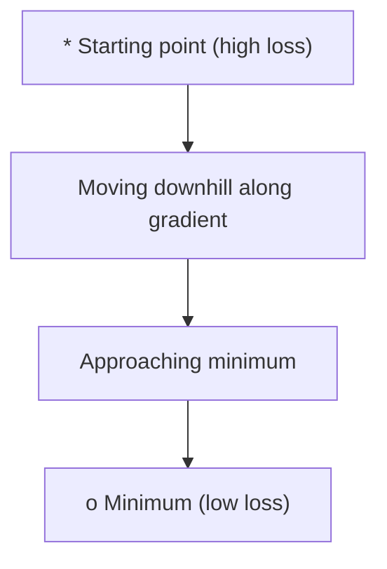
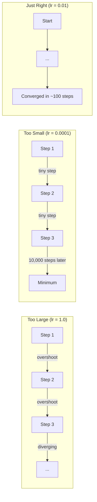
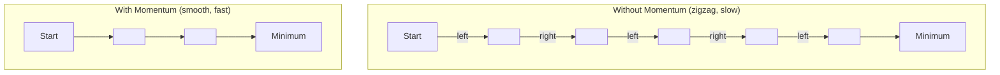
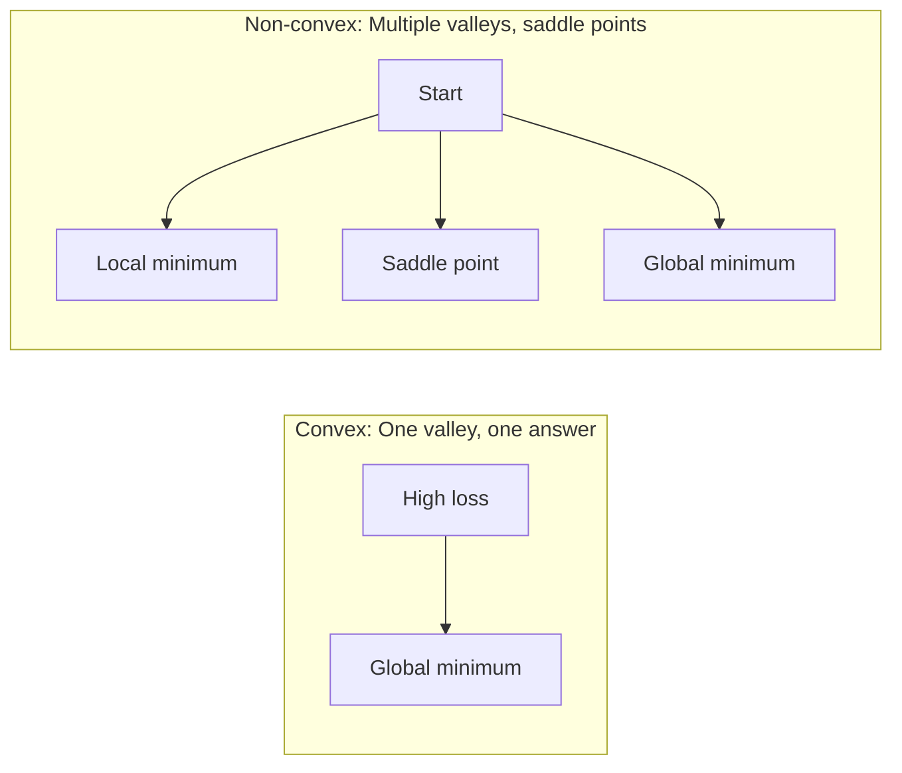
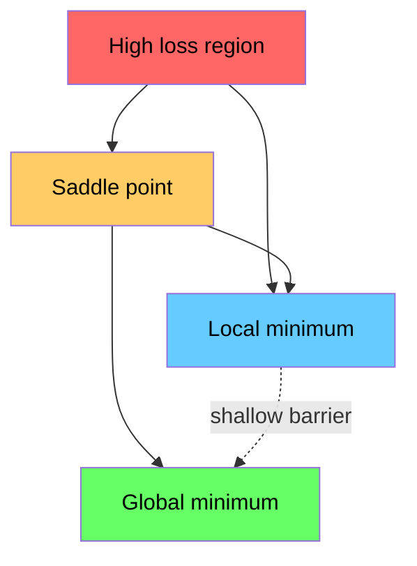

# Tối ưu hóa

> Trình luyện một mạng thần kinh, bản chất là tìm kiếm điểm thấp nhất của thung lũng.

**Type:** Build
**Language:**Python
**Prerequisites:** Phase 1, Lessons 04-05 (Derivatives, Gradients)
**Time:** ~75 minutes

## Học mục tiêu
- Từ zero thực hiện giảm gradient vanilla 带 động lực của SGD, cũng như Adam
- So sánh hàm Rosenbrock trên Optimizer 收表现,并解释 tại sao Adam sẽ cho mỗi trọng lượng tự thích nghi điều chỉnh tốc độ học tập
- 区分 convex với không convex Loss landscape,并解释 saddle point 在高维空间中的作用
- 配置 học tập tốc độ lịch trình(phases decay cosine annealing warmup) để nâng cao tập luyện ổn định

## 问题
Bạn có một hàm Loss. Nó cho bạn biết mô hình sai có nhiều phân bố. Bạn có các điểm. Chúng cho bạn biết hướng nào sẽ làm cho Loss trở nên tồi tệ hơn. Bây giờ bạn cần một chiến lược hướng xuống.

Cách đơn giản nhất là: di chuyển ngược hướng của gradient朝. Với một số gọi là tốc độ học tập để tăng bước dài. Cần lặp lại thực hiện. Đây là tốc độ giảm gradient, và nó thực sự hiệu quả. Nhưng nó thực sự hiệu quả.

Mỗi người tối ưu hóa trong Deep Learning đều trả lời cùng một câu hỏi: làm thế nào để nhanh hơn, đáng tin cậy hơn đến đáy núi?

## 概念
### Điều gì là tối ưu hóa

Optimization là tìm kiếm giá trị nhập của một hàm để làm cho nó giảm thiểu hoặc tối đa hóa. Trong Machine Learning, hàm này là Loss.

```
minimize L(w) where:
  L = loss function
  w = model weights (could be millions of parameters)
```

### Tăng dần (vanilla)

Ưu điểm tối ưu hóa đơn giản nhất. Ưu điểm giảm cân đối với mỗi trọng lượng của Gradient. Ưu điểm giảm cân đối với mỗi trọng lượng của Gradient.

```
w = w - lr * gradient
```

Đó là một thuật toán hoàn chỉnh.



### Tốc độ học tập: siêu tham số quan trọng nhất

Tốc độ học tập  kiểm soát bước dài. Nó quyết định về tất cả những gì nhận được.



Không có một công thức có thể trực tiếp đưa ra tốc độ học tập chính xác. Bạn cần phải trải nghiệm để tìm thấy nó.

### SGD vs lô hàng vs lô nhỏ

Sự giảm gradient vanilla trong bước tiến trước, sẽ diễn ra trên toàn bộ bộ bộ dữ liệu 上计算 Gradient.

Thâm điểm giảm stochastic (SGD) được tính trên một mẫu đơn tự động.

Lập độ giảm gradient mini-batch 折中处理──先在一个小批量 (32、64、128、256 个样本) 计算上 Gradient,然后更新──这是实际上大家真正使用的方法──

| Variant | Batch size | Gradient quality | Speed per step | Noise |
|---------|-----------|-----------------|---------------|-------|
| Batch GD | 整个 dataset | 精确 | 慢 | 无 |
| SGD | 1 个样本 | 噪声很大 | 快 | 高 |
| Mini-batch | 32-256 | 良好估计 | 均衡 | 中等 |

SGD và tiếng ồn trong mini-batch không phải là lỗi. Nó giúp thoát khỏi các mức tối thiểu địa phương và các điểm lăn.

### Tốc độ: Bóng nhỏ xoay xuống núi

Giảm độ vanilla chỉ nhìn vào hiện tại gradient. Nếu gradient quay lại hình dạng của nó có thể thay đổi trong thung lũng hẹp, tiến bộ sẽ chậm.

```
v = beta * v + gradient
w = w - lr * v
```

类比是: một quả bóng xoay xuống núi. Nó sẽ không dừng lại ở mỗi con đường cao và bắt đầu lại. Nó sẽ tích lũy tốc độ theo hướng phù hợp, và ức chế rung động.



`beta`(thường là 0,9) kiểm soát giữ lại nhiều thông tin lịch sử.

### Adam:nhanh học thích nghi

Các trọng lượng khác nhau cần có tốc độ học tập khác nhau. Một số ít đạt được trọng lượng lớn, trong khi cuối cùng đạt được trọng lượng lớn nên bước đi bước lớn hơn. Một số tiếp tục đạt được trọng lượng lớn của các trọng lượng lớn, thì nên bước đi bước nhỏ hơn.

Adam (Điều ước tính thời điểm thích ứng) sẽ có trọng lượng cho mỗi người.

1. Thời gian đầu tiên ((m):Tỷ lệ trung bình chạy của các gradient ((( tương tự như thời gian)
2. Khoảnh khắc thứ hai ((v): độ tần vuông của trung bình chạy (( độ lớn)

```
m = beta1 * m + (1 - beta1) * gradient
v = beta2 * v + (1 - beta2) * gradient^2

m_hat = m / (1 - beta1^t)    bias correction
v_hat = v / (1 - beta2^t)    bias correction

w = w - lr * m_hat / (sqrt(v_hat) + epsilon)
```

Ngoài ra`sqrt(v_hat)`Đó là một quan trọng. Với những điểm số lớn, trọng lượng của các điểm số nhỏ sẽ được phân loại bằng một số lớn.

默认 siêu tham số:`lr=0.001, beta1=0.9, beta2=0.999, epsilon=1e-8` Những giá trị ẩn trên hầu hết các vấn đề đều có hiệu quả không sai.

### Các lịch trình học tập

Tốc độ học tập cố định là một cách giảm đi. Trong quá trình đào tạo đầu tiên, bạn muốn có một số bước lớn hơn, để đạt được tiến bộ nhanh hơn.

常见 lịch trình:

| Schedule | Formula | Use case |
|----------|---------|----------|
| Step decay | lr = lr * factor every N epochs | 简单，手动控制 |
| Exponential decay | lr = lr_0 * decay^t | 平滑降低 |
| Cosine annealing | lr = lr_min + 0.5 * (lr_max - lr_min) * (1 + cos(pi * t / T)) | Transformers，现代训练 |
| Warmup + decay | 线性上升，然后 decay | 大模型，防止早期不稳定 |

### Phép trục trặc đối với không trục trặc

Hàm hình ngọc chỉ có một tối thiểu.`f(x) = x^2`Như vậy hình vuông là ngọc.

Các chức năng mất mạng thần kinh là không ngón. Chúng có nhiều điểm tối thiểu địa phương.



Trong thực tế, các mức tối thiểu địa phương trong các mạng thần kinh cao cấp  rất ít là vấn đề thực sự. Hầu hết các mức tối thiểu địa phương Ưu điểm mất mát đều gần như là mức tối thiểu toàn cầu.

### Hình ảnh mất cảnh quan

Loss là hàm của tất cả các trọng lượng. Đối với một mô hình có 100 triệu trọng lượng, Loss landscape tồn tại trong 1.000.000.000 维空间. Chúng ta chọn hai hướng tùy ý trong không gian trọng lượng, và theo những hướng này vẽ Loss, nhận được một bề mặt 2D để thực hiện hình ảnh.



Hàm độ tối thiểu 泛化较差──Flat minima 泛化较好──Đây cũng là một trong những lý do SGD mang động lực trong độ chính xác thử nghiệm cuối cùng 上经常优于Adam: tiếng ồn của nó sẽ ngăn chặn mô hình dừng lại ở mức tối thiểu sắc bén.


```figure
gradient-descent
```

##  xây dựng nó
### 步骤 1: Định nghĩa một chức năng thử nghiệm

Hàm Rosenbrock là điểm chuẩn tối ưu hóa cổ điển. Hàm độ tối thiểu của nó nằm ở (1, 1), nằm trong một thung lũng hẹp, dễ tìm thấy nhưng rất khó để đi theo nó.

```
f(x, y) = (1 - x)^2 + 100 * (y - x^2)^2
```

```python
def rosenbrock(params):
    x, y = params
    return (1 - x) ** 2 + 100 * (y - x ** 2) ** 2

def rosenbrock_gradient(params):
    x, y = params
    df_dx = -2 * (1 - x) + 200 * (y - x ** 2) * (-2 * x)
    df_dy = 200 * (y - x ** 2)
    return [df_dx, df_dy]
```

### 步骤 2: Giảm độ vanilla

```python
class GradientDescent:
    def __init__(self, lr=0.001):
        self.lr = lr

    def step(self, params, grads):
        return [p - self.lr * g for p, g in zip(params, grads)]
```

### 步骤 3: SGD với động lực

```python
class SGDMomentum:
    def __init__(self, lr=0.001, momentum=0.9):
        self.lr = lr
        self.momentum = momentum
        self.velocity = None

    def step(self, params, grads):
        if self.velocity is None:
            self.velocity = [0.0] * len(params)
        self.velocity = [
            self.momentum * v + g
            for v, g in zip(self.velocity, grads)
        ]
        return [p - self.lr * v for p, v in zip(params, self.velocity)]
```

### Bước 4: Adam

```python
class Adam:
    def __init__(self, lr=0.001, beta1=0.9, beta2=0.999, epsilon=1e-8):
        self.lr = lr
        self.beta1 = beta1
        self.beta2 = beta2
        self.epsilon = epsilon
        self.m = None
        self.v = None
        self.t = 0

    def step(self, params, grads):
        if self.m is None:
            self.m = [0.0] * len(params)
            self.v = [0.0] * len(params)

        self.t += 1

        self.m = [
            self.beta1 * m + (1 - self.beta1) * g
            for m, g in zip(self.m, grads)
        ]
        self.v = [
            self.beta2 * v + (1 - self.beta2) * g ** 2
            for v, g in zip(self.v, grads)
        ]

        m_hat = [m / (1 - self.beta1 ** self.t) for m in self.m]
        v_hat = [v / (1 - self.beta2 ** self.t) for v in self.v]

        return [
            p - self.lr * mh / (vh ** 0.5 + self.epsilon)
            for p, mh, vh in zip(params, m_hat, v_hat)
        ]
```

### 步骤 5: Đi và so sánh

```python
def optimize(optimizer, func, grad_func, start, steps=5000):
    params = list(start)
    history = [params[:]]
    for _ in range(steps):
        grads = grad_func(params)
        params = optimizer.step(params, grads)
        history.append(params[:])
    return history

start = [-1.0, 1.0]

gd_history = optimize(GradientDescent(lr=0.0005), rosenbrock, rosenbrock_gradient, start)
sgd_history = optimize(SGDMomentum(lr=0.0001, momentum=0.9), rosenbrock, rosenbrock_gradient, start)
adam_history = optimize(Adam(lr=0.01), rosenbrock, rosenbrock_gradient, start)

for name, history in [("GD", gd_history), ("SGD+M", sgd_history), ("Adam", adam_history)]:
    final = history[-1]
    loss = rosenbrock(final)
    print(f"{name:6s} -> x={final[0]:.6f}, y={final[1]:.6f}, loss={loss:.8f}")
```

预期输出:Adam 收最快──带动力 的 SGD 路径更平滑──Vanilla GD 在狭窄山谷中进展缓慢──

## Sử dụng nó
Trong thực tế, sử dụng PyTorch hoặc JAX Optimizers. Chúng sẽ xử lý các nhóm tham số.

```python
import torch

model = torch.nn.Linear(784, 10)

sgd = torch.optim.SGD(model.parameters(), lr=0.01, momentum=0.9)
adam = torch.optim.Adam(model.parameters(), lr=0.001)
adamw = torch.optim.AdamW(model.parameters(), lr=0.001, weight_decay=0.01)

scheduler = torch.optim.lr_scheduler.CosineAnnealingLR(adam, T_max=100)
```

经验法则:

- Từ Adam (r) bắt đầu. Nó trên hầu hết các vấn đề không cần phải điều chỉnh.
- Khi bạn cần độ chính xác cuối cùng tốt nhất, và có thể chịu thêm chi phí điều chỉnh, chuyển sang SGD của động lực lr=0.01, động lực=0.9)。
- Đối với các biến đổi sử dụng AdamW(带 tách rời suy giảm trọng lượng của Adam)
- Đối với các thời đại đào tạo, luôn sử dụng lịch trình học tập tốc độ.
- Nếu tập không ổn định, giảm tốc độ học... Nếu tập quá chậm, tăng nó...

## 交付 nó
本课会产出一个用于选择合适优化器的提示──见 `outputs/prompt-optimizer-guide.md`

Các lớp Optimizer được xây dựng trong đó sẽ xuất hiện lại trong giai đoạn 3, khi đó chúng ta sẽ tập luyện một mạng Neural từ không.

## 练习
1. **Learning rate sweep.**Trong hàm Rosenbrock 上 sử dụng tỷ lệ học tập [0.0001, 0.0005, 0.001, 0.005, 0.01] 运行 vanilla gradient descending── đối với mỗi tỷ lệ học tập, trong 5000 bước sau vẽ hoặc in ấn Loss cuối cùng── tìm ra tỷ lệ học tập tối đa vẫn có thể nhận được──

2. **Momentum comparison.**Trong hàm Rosenbrock 上 sử dụng giá trị động lực [0.0, 0.5, 0.9, 0.99] 运行带 động lực của SGD── theo dõi mỗi bước của Loss── 收最快? 收最快? 哪会超越?

3. **Saddle point escape.**定义函数 `f(x, y) = x^2 - y^2`(原点处有一个车点) 〜从 (0.01, 0.01) 开始──比较车 GD、带动力的 SGD 和亚当的行为──哪个能逃离车点?

4. **Implement learning rate decay.**为 GradientDescent lớp 添加 biểu diễn phân rã lịch trình:`lr = lr_0 * 0.999^step`                                                                                                                                                                                                                                                              

## 关键术语
| Term | What people say | What it actually means |
|------|----------------|----------------------|
| Gradient descent | “Go downhill” | 通过减去按 learning rate 缩放后的 Gradient 来更新 weights。最基础的 Optimizer。 |
| Learning rate | “Step size” | 控制每次更新让 weights 移动多远的标量。太大会导致发散。太小会浪费计算。 |
| Momentum | “Keep rolling” | 将过去的 Gradients 累积到一个 velocity Vector 中。抑制震荡，并加速沿一致方向的移动。 |
| SGD | “Random sampling” | Stochastic gradient descent。用随机子集而不是完整 dataset 计算 Gradient。实践中几乎总是指 mini-batch SGD。 |
| Mini-batch | “A chunk of data” | 用于估计 Gradient 的一小部分训练数据（32-256 个样本）。平衡速度与 Gradient 准确性。 |
| Adam | “The default optimizer” | Adaptive Moment Estimation。跟踪每个 weight 的 Gradients 和 squared gradients 的 running averages，从而为每个 weight 提供自己的 learning rate。 |
| Bias correction | “Fix the cold start” | Adam 的 first 和 second moments 初始化为零。Bias correction 在早期步骤中通过除以 (1 - beta^t) 进行补偿。 |
| Learning rate schedule | “Change lr over time” | 在训练过程中调整 learning rate 的函数。早期大步，后期小步。 |
| Convex function | “One valley” | 任意 local minimum 都是 global minimum 的函数。Gradient descent 总能找到它。Neural Network losses 不是 convex。 |
| Saddle point | “Flat but not a minimum” | Gradient 为零，但在某些方向上是 minimum、在另一些方向上是 maximum 的点。高维空间中很常见。 |
| Loss landscape | “The terrain” | 在 weight space 上绘制出的 Loss function。通过沿两个随机方向切片来可视化。 |
| Convergence | “Getting there” | Optimizer 已到达一个继续更新也无法显著降低 Loss 的点。 |

## 延伸阅读
- [Sebastian Ruder: An overview of gradient descent optimization algorithms](https://ruder.io/optimizing-gradient-descent/)- Một tổng quan toàn diện của tất cả các Optimizers chính
- [Why Momentum Really Works (Distill)](https://distill.pub/2017/momentum/)- khả năng tương tác của động lực
- [Adam: A Method for Stochastic Optimization (Kingma & Ba, 2014)](https://arxiv.org/abs/1412.6980)- giấy Adam nguyên thủy, dễ đọc và ngắn gọn
- [Visualizing the Loss Landscape of Neural Nets (Li et al., 2018)](https://arxiv.org/abs/1712.09913)-  hiển thị giấy sắc nét vs tối thiểu phẳng
