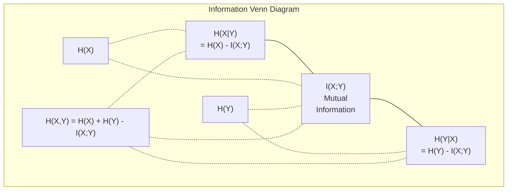

# Lý thuyết thông tin

> Lý thuyết thông tin  đo lường sự ngạc nhiên.

**Type:** Learn
**Language:**Python
**Prerequisites:** Phase 1, Lesson 06 (Probability)
**Time:** ~60 分钟

## Học mục tiêu

- Từ zero tính toán entropy, cross-entropy và KL divergence,并 giải thích mối quan hệ giữa chúng
- 推导为什么最小化交叉entropy mất 等价 maximize log-chỉ có thể
- 计算 tính năng và thông tin chung giữa mục tiêu, được sử dụng để sắp xếp tính năng quan trọng
- 将 bối rối  giải thích cho mô hình ngôn ngữ Từ Trung chọn của kích thước từ vựng hiệu quả

## 问题

Bạn đang tập luyện mỗi mô hình phân loại trong tất cả các cuộc tập luyện`CrossEntropyLoss()` Bạn sẽ thấy sự phức tạp trong mỗi bài luận về mô hình ngôn ngữ  Bạn sẽ thấy sự khác biệt trong các VAE, khử trùng và RLHF  Những khái niệm này không phải là những sự chia rẽ lẫn nhau.

Lý thuyết thông tin vì bạn cung cấp lý thuyết về sự không chắc chắn, nén và ngôn ngữ dự đoán. Claude Shannon phát minh ra nó vào năm 1948, để giải quyết vấn đề giao thông. Kết quả chứng minh, đào tạo mạng thần kinh cũng là một vấn đề giao thông. mô hình đang cố gắng thông qua các trọng lượng học tập.

Bài học này sẽ xây dựng từng công thức từ không, để bạn thấy chúng đến từ đâu, và tại sao nó hiệu quả.

## 概念

### 信息量(Sự ngạc nhiên)

Khi những gì không thể xảy ra xảy ra, nó mang lại nhiều thông tin hơn.

概率 cho các sự kiện số lượng thông tin là:

```
I(x) = -log(p(x))
```

Sử dụng 2 vì đáy log  nhận được bit ⋅ sử dụng log tự nhiên  nhận được nats⋅ cùng một ý tưởng, đơn vị khác nhau⋅

```
Event              Probability    Surprise (bits)
Fair coin heads    0.5            1.0
Rolling a 6        0.167          2.58
1-in-1000 event    0.001          9.97
Certain event      1.0            0.0
```

Sự kiện xác định mang theo không thông tin.

### Entropy (đồng độ bình thường)

Entropy là một sự phân phối trong tất cả những kết quả có thể được mong đợi bất ngờ.

```
H(P) = -sum( p(x) * log(p(x)) )  for all x
```

公平硬币 đối với biến số nhị phân 具有最大的透:1 bit──偏置硬币(99% 正面)具有低透:0.08 bits──你已经知道会发生什么,因此每次抛几乎不会告诉你任何信息──

```
Fair coin:    H = -(0.5 * log2(0.5) + 0.5 * log2(0.5)) = 1.0 bit
Biased coin:  H = -(0.99 * log2(0.99) + 0.01 * log2(0.01)) = 0.08 bits
```

Entropy đo lường một phân phối trong sự không chắc chắn không thể kiểm soát được. Bạn không thể nén xuống dưới nó.

### Cross-Entropy (你每日使用的损失函数)

Cross-entropy  đo lường khi bạn sử dụng phân phối Q 来编码 thực sự từ phân phối P 的事件时, surprise trung bình là bao nhiêu。

```
H(P, Q) = -sum( p(x) * log(q(x)) )  for all x
```

P là phân phối đúng đắn (tiêu đề) ・Q là dự đoán của mô hình của bạn ・ Nếu Q và P hoàn toàn phù hợp, sự chéo-tròp như entropy ・ bất cứ sự không phù hợp nào sẽ làm cho nó trở nên lớn hơn ・

Trong phân loại, P là một vector nóng (true class) có tỷ lệ 1, còn lại là 0).

```
H(P, Q) = -log(q(true_class))
```

Đây là công thức của phân loại ∞ ∞ ∞ ∞ ∞ ∞ ∞ ∞ ∞ ∞ ∞ ∞ ∞ ∞ ∞ ∞ ∞ ∞ ∞ ∞ ∞ ∞ ∞ ∞ ∞ ∞ ∞ ∞ ∞ ∞ ∞ ∞ ∞ ∞ ∞ ∞ ∞ ∞ ∞ ∞ ∞ ∞ ∞ ∞ ∞ ∞ ∞ ∞ ∞ ∞ ∞ ∞ ∞ ∞ ∞ ∞ ∞ ∞ ∞ ∞ ∞ ∞ ∞ ∞ ∞ ∞ ∞ ∞ ∞ ∞ ∞ ∞ ∞ ∞ ∞ ∞ ∞ ∞ ∞ ∞ ∞ ∞ ∞ ∞ ∞ ∞ ∞ ∞ ∞ ∞ ∞ ∞ ∞ ∞ ∞ ∞ ∞ ∞ ∞ ∞ ∞ ∞ ∞ ∞ ∞ ∞ ∞ ∞ ∞ ∞ ∞ ∞ ∞ ∞ ∞ ∞ ∞ ∞ ∞ ∞ ∞ ∞ ∞ ∞ ∞ ∞ ∞ ∞ ∞ ∞ ∞ ∞ ∞ ∞ ∞ ∞ ∞ ∞ ∞ ∞ ∞ ∞

### KL Sự khác biệt (Tân phân  giữa khoảng cách)

KL khác biệt  đo lường sử dụng Q thay vì P sẽ mang lại nhiều bất ngờ bổ sung.

```
D_KL(P || Q) = sum( p(x) * log(p(x) / q(x)) )  for all x
             = H(P, Q) - H(P)
```

Cross-entropy là entropy 加 KL divergence。由于 thực phân phối của entropy trong quá trình tập luyện là thường, tối thiểu hóa cross-entropy 等等同于最小化 KL divergence。你是在把模型的分布推向真分布──

KL divergence 不是对称的:D_KL(P  Q) != D_KL(Q  P)── nó không phải là một phép đo khoảng cách thực sự──

### Thông tin lẫn nhau

Thông tin lẫn nhau  đo biết một biến 能 nói cho bạn một biến khác 多少信息──

```
I(X; Y) = H(X) - H(X|Y)
        = H(X) + H(Y) - H(X, Y)
```

Nếu X và Y  độc lập, thông tin lẫn nhau là không. Biết rằng một trong số đó sẽ không nói cho bạn bất kỳ thông tin nào của khác. Nếu chúng hoàn toàn liên quan, thông tin lẫn nhau giống như sự xâm nhập của một biến.

Trong sự lựa chọn tính năng, thông tin chung giữa tính năng và mục tiêu  高, có nghĩa là tính năng này có sử dụng ⋅ thông tin chung ⋅ thấp, có nghĩa là nó là tiếng ⋅

### Entropy có điều kiện

H(Y khi X) 衡观察到X 后, về Y còn còn còn còn còn nhiều sự không chắc chắn.

```
H(Y|X) = H(X,Y) - H(X)
```

两个极端:
- Nếu X hoàn toàn quyết định Y, thì H(YX không) = 0── biết X sẽ loại bỏ tất cả sự không chắc chắn về Y── ví dụ: X = 摄氏温度, Y = 华氏温度──
- Nếu X đối với Y  không có bất kỳ thông tin nào, thì H  Y trong X) = H )                                                                                                                                                                                                                                                  

Entropy điều kiện 始终非负,并且永远不超过 H(Y):

```
0 <= H(Y|X) <= H(Y)
```

Trong Machine Learning, entropy điều kiện xuất hiện trên cây quyết định. Trong mỗi lần phân chia, thuật toán sẽ chọn để làm cho H(Y khiếtX) tính năng nhỏ nhất X, cũng là loại bỏ tính năng không chắc chắn nhất về nhãn Y.

### Nhóm nhôm

H(X,Y) là sự phân phối chung của X và Y ︎.

```
H(X,Y) = -sum sum p(x,y) * log(p(x,y))   for all x, y
```

关键性质:

```
H(X,Y) <= H(X) + H(Y)
```

Khi X và Y 独立时等号成立──如果它们共享信息, entropy chung就小于各自的 entropy 之和──这个缺失的 entropy 正是相互信息──



Những mối quan hệ này:
- H(X,Y) = H(X) + H(Y
- (X;Y) = H(X) - H(IX
- H(X,Y) = H(X) + H(Y) - I(X;Y)

### Thông tin lẫn nhau (Dep Dive)

Thông tin lẫn nhau I(X;Y) 量化知道一个变量会减少关于另一个变量的多少不确定性──

```
I(X;Y) = H(X) - H(X|Y)
       = H(Y) - H(Y|X)
       = H(X) + H(Y) - H(X,Y)
       = sum sum p(x,y) * log(p(x,y) / (p(x) * p(y)))
```

性质:
- I(X;Y) >= 0 始终成立──观察某事永远不会让你失去信息──
- Khi và chỉ khi X và Y 独立时,I(X;Y) = 0。
- I(X;Y) = I(Y;X)。 nó là đối称的, khác với sự khác biệt KL。
- I(X;X) = H(X)。 một biến với bản thân chia sẻ toàn bộ thông tin。

**用于 feature selection 的 mutual information。**Trong ML, các tính năng bạn muốn đối với mục tiêu có số lượng thông tin. Thông tin lẫn nhau cung cấp cho bạn một cách có nguyên tắc để sắp xếp các tính năng:

1. Đối với mỗi tính năng X_i,计算 I(X_i; Y), trong đó Y là biến mục tiêu.
2. 按MI điểm 排序 tính năng。
3. Bảo trì các tính năng.

Đây là một ứng dụng cho bất kỳ mối quan hệ nào giữa tính năng và mục tiêu: tuyến tính, không tuyến tính, đơn giản hoặc các mối quan hệ khác.

| Method | Detects | Computational cost | Handles categorical? |
|--------|---------|-------------------|---------------------|
| Pearson correlation | Linear relationships | O(n) | No |
| Spearman correlation | Monotonic relationships | O(n log n) | No |
| Mutual information | 任意 statistical dependency | O(n log n) with binning | Yes |

### Đơn vị làm mềm nhãn và Cross-Entropy

标准分类 使用 khó mục tiêu:[0, 0, 1, 0]──true class 的概率为 1,其他全部为 0──Légal smoothing 会用软目标 替换它们:

```
soft_target = (1 - epsilon) * hard_target + epsilon / num_classes
```

当 epsilon = 0.1 且有4 个类 时:
- Mục tiêu cứng: [0, 0, 1, 0]
- Mục tiêu mềm: [0,025, 0,025, 0,925, 0,025]

Từ lý thuyết thông tin 视角看, nhãn làm mượt mà 增加了目标分布的 entropi──Hard one-hot targets 的 entropi 为 0,也就是没有不确定──软目标 具有正正 entropi──

Tại sao nó giúp ích:
- 防止模型 将 logits 推向极端值 ((在交叉值下,要完美匹配一个热目标 需要无限大的 logits)
- 作为规范化:模型 不能100% tự tin
-  cải thiện hiệu chuẩn:预测概率更好地 phản ánh sự không chắc chắn thực tế
- 缩小 training behavior và inference  sự khác biệt giữa hành vi

Sử dụng nhãn làm mượt 变为:

```
L = (1 - epsilon) * CE(hard_target, prediction) + epsilon * H_uniform(prediction)
```

Thứ hai sẽ trừng phạt những dự đoán xa lánh đồng nhất, đó là trực tiếp đối với sự tin tưởng  thực hiện quy định.

### Tại sao Cross-Entropy là trung tâm của sự mất phân loại

三个视角,同一个结论.

**Information Theory 视角。**Cross-entropy  đo phân phối sử dụng mô hình của bạn thay vì phân phối thực sự 浪费了多少位──最小化它, sẽ làm cho mô hình của bạn  trở thành mã hóa hiệu quả cao nhất của thực tế──

**Maximum likelihood 视角。**Đối với các lớp thực n 个 为 y_i của các mẫu đào tạo:

```
Likelihood     = product( q(y_i) )
Log-likelihood = sum( log(q(y_i)) )
Negative log-likelihood = -sum( log(q(y_i)) )
```

Cuối cùng là mất đi nhiệt độ chéo-entropy, giảm thiểu nhiệt độ chéo = tối đa hóa dữ liệu đào tạo trên mô hình của bạn, giảm khả năng.

**Gradient 视角。**Cross-entropy 关于logits 的 Gradient 简单地是(được dự đoán - đúng) ⋅干净、稳定、计算快速──这是它与软max 完美配合的原因──

### Bits vs Nats

Sự khác biệt duy nhất là số lượng dưới của log.

```
log base 2   -> bits      (information theory tradition)
log base e   -> nats      (machine learning convention)
log base 10  -> hartleys  (rarely used)
```

1 nat = 1/ln(2) bit = 1.4427 bit。PyTorch 和 TensorFlow 默认使用自然 log(nats)。

### Sự bối rối

Sự bối rối là chỉ số của sự phân cực. Nó cho bạn biết mô hình không chắc chắn.

```
Perplexity = 2^H(P,Q)   (if using bits)
Perplexity = e^H(P,Q)   (if using nats)
```

Sự bối rối vì mô hình ngôn ngữ 50 , trung bình nhìn, như phải từ 50 个可能的下一个代币中均选择一样困惑──越低越好──

GPT-2 trên các tiêu chuẩn thường thấy đạt khoảng 30 độ phức tạp.


```figure
entropy-kl
```

##  xây dựng nó

### 第 1 步:Tăng lượng thông tin và entropy

```python
import math

def information_content(p, base=2):
    if p <= 0 or p > 1:
        return float('inf') if p <= 0 else 0.0
    return -math.log(p) / math.log(base)

def entropy(probs, base=2):
    return sum(
        p * information_content(p, base)
        for p in probs if p > 0
    )

fair_coin = [0.5, 0.5]
biased_coin = [0.99, 0.01]
fair_die = [1/6] * 6

print(f"Fair coin entropy:   {entropy(fair_coin):.4f} bits")
print(f"Biased coin entropy: {entropy(biased_coin):.4f} bits")
print(f"Fair die entropy:    {entropy(fair_die):.4f} bits")
```

### 步骤 2: Cross-entropy và KL divergence

```python
def cross_entropy(p, q, base=2):
    total = 0.0
    for pi, qi in zip(p, q):
        if pi > 0:
            if qi <= 0:
                return float('inf')
            total += pi * (-math.log(qi) / math.log(base))
    return total

def kl_divergence(p, q, base=2):
    return cross_entropy(p, q, base) - entropy(p, base)

true_dist = [0.7, 0.2, 0.1]
good_model = [0.6, 0.25, 0.15]
bad_model = [0.1, 0.1, 0.8]

print(f"Entropy of true dist:     {entropy(true_dist):.4f} bits")
print(f"CE (good model):          {cross_entropy(true_dist, good_model):.4f} bits")
print(f"CE (bad model):           {cross_entropy(true_dist, bad_model):.4f} bits")
print(f"KL divergence (good):     {kl_divergence(true_dist, good_model):.4f} bits")
print(f"KL divergence (bad):      {kl_divergence(true_dist, bad_model):.4f} bits")
```

### 步骤 3: Cross-entropy như mất phân loại

```python
def softmax(logits):
    max_logit = max(logits)
    exps = [math.exp(z - max_logit) for z in logits]
    total = sum(exps)
    return [e / total for e in exps]

def cross_entropy_loss(true_class, logits):
    probs = softmax(logits)
    return -math.log(probs[true_class])

logits = [2.0, 1.0, 0.1]
true_class = 0

probs = softmax(logits)
loss = cross_entropy_loss(true_class, logits)

print(f"Logits:      {logits}")
print(f"Softmax:     {[f'{p:.4f}' for p in probs]}")
print(f"True class:  {true_class}")
print(f"Loss:        {loss:.4f} nats")
print(f"Perplexity:  {math.exp(loss):.2f}")
```

### 步骤 4: Cross-entropy bằng với âm log-chỉ có thể

```python
import random

random.seed(42)

n_samples = 1000
n_classes = 3
true_labels = [random.randint(0, n_classes - 1) for _ in range(n_samples)]
model_logits = [[random.gauss(0, 1) for _ in range(n_classes)] for _ in range(n_samples)]

ce_loss = sum(
    cross_entropy_loss(label, logits)
    for label, logits in zip(true_labels, model_logits)
) / n_samples

nll = -sum(
    math.log(softmax(logits)[label])
    for label, logits in zip(true_labels, model_logits)
) / n_samples

print(f"Cross-entropy loss:      {ce_loss:.6f}")
print(f"Negative log-likelihood: {nll:.6f}")
print(f"Difference:              {abs(ce_loss - nll):.2e}")
```

### 步骤 5: Thông tin lẫn nhau

```python
def mutual_information(joint_probs, base=2):
    rows = len(joint_probs)
    cols = len(joint_probs[0])

    margin_x = [sum(joint_probs[i][j] for j in range(cols)) for i in range(rows)]
    margin_y = [sum(joint_probs[i][j] for i in range(rows)) for j in range(cols)]

    mi = 0.0
    for i in range(rows):
        for j in range(cols):
            pxy = joint_probs[i][j]
            if pxy > 0:
                mi += pxy * math.log(pxy / (margin_x[i] * margin_y[j])) / math.log(base)
    return mi

independent = [[0.25, 0.25], [0.25, 0.25]]
dependent = [[0.45, 0.05], [0.05, 0.45]]

print(f"MI (independent): {mutual_information(independent):.4f} bits")
print(f"MI (dependent):   {mutual_information(dependent):.4f} bits")
```

## Sử dụng nó

Sử dụng NumPy để thể hiện khái niệm tương tự, đó là cách bạn sử dụng trong thực tế:

```python
import numpy as np

def np_entropy(p):
    p = np.asarray(p, dtype=float)
    mask = p > 0
    result = np.zeros_like(p)
    result[mask] = p[mask] * np.log(p[mask])
    return -result.sum()

def np_cross_entropy(p, q):
    p, q = np.asarray(p, dtype=float), np.asarray(q, dtype=float)
    mask = p > 0
    return -(p[mask] * np.log(q[mask])).sum()

def np_kl_divergence(p, q):
    return np_cross_entropy(p, q) - np_entropy(p)

true = np.array([0.7, 0.2, 0.1])
pred = np.array([0.6, 0.25, 0.15])
print(f"Entropy:    {np_entropy(true):.4f} nats")
print(f"Cross-ent:  {np_cross_entropy(true, pred):.4f} nats")
print(f"KL div:     {np_kl_divergence(true, pred):.4f} nats")
```

Anh đã xây dựng từ không`torch.nn.CrossEntropyLoss()` internal done things──now you know why loss will drop during training process: phân bố dự đoán của mô hình của bạn đang tiến gần phân phối thực sự, sử dụng các nốt của sự lãng phí thông tin để đo──

## 练习

1. 假设英文字母表服从统一分布 ((26 个字母), tính toán sự nhập khẩu của nó.

2. Một mô hình đối với mẫu thực lớp 为 1 输出 logits [5.0, 2.0, 0.5]──手算 chéo entropy mất, sau đó sử dụng của bạn `cross_entropy_loss`- Phụ kiện nào sẽ tạo ra mất mát không?

3. 证明 KL divergence 不是对称的── chọn hai phân bố P 和 Q, D_KL(P 計算 Q) 和 D_K 計算 Q) 和 D_L(Q  P)──解释它们为什么不同──

4. 构建一个函数,为一段代码预测 序列计算困惑──给定一个由 (true_token_index, predicted_logits) cặp 组成的列表,返回该序列的困惑──

## 关键术语

| Term | What people say | What it actually means |
|------|----------------|----------------------|
| Information content | “Surprise” | 编码一个事件所需的 bits（或 nats）数量：-log(p) |
| Entropy | “Randomness” | 一个 distribution 中所有 outcomes 的平均 surprise。衡量不可约 uncertainty。 |
| Cross-entropy | “The loss function” | 使用 model distribution Q 编码来自 true distribution P 的事件时的平均 surprise。 |
| KL divergence | “Distance between distributions” | 使用 Q 而不是 P 所浪费的额外 bits。等于 cross-entropy 减 entropy。不是对称的。 |
| Mutual information | “How related are X and Y” | 知道 Y 后，关于 X 的 uncertainty 减少量。为零表示独立。 |
| Softmax | “Turn logits into probabilities” | 取指数并归一化。将任意 real-valued vector 映射为有效 probability distribution。 |
| Perplexity | “How confused the model is” | Cross-entropy 的指数。model 在每一步从中选择的有效 vocabulary size。 |
| Bits | “Shannon's unit” | 使用以 2 为底的 log 衡量的信息。一个 bit 解决一次公平抛硬币。 |
| Nats | “ML's unit” | 使用 natural log 衡量的信息。PyTorch 和 TensorFlow 默认使用。 |
| Negative log-likelihood | “NLL loss” | 对 one-hot labels 来说，与 cross-entropy loss 完全相同。最小化它会最大化正确 predictions 的概率。 |

## 延伸阅读

- [Shannon 1948: A Mathematical Theory of Communication](https://people.math.harvard.edu/~ctm/home/text/others/shannon/entropy/entropy.pdf)- 原始论文, cho đến nay vẫn dễ đọc
- [Visual Information Theory (Chris Olah)](https://colah.github.io/posts/2015-09-Visual-Information/)- Giải thích rõ ràng nhất cho sự phân biệt entropy và KL
- [PyTorch CrossEntropyLoss docs](https://pytorch.org/docs/stable/generated/torch.nn.CrossEntropyLoss.html)- framework  làm thế nào để thực hiện nội dung bạn vừa xây dựng
