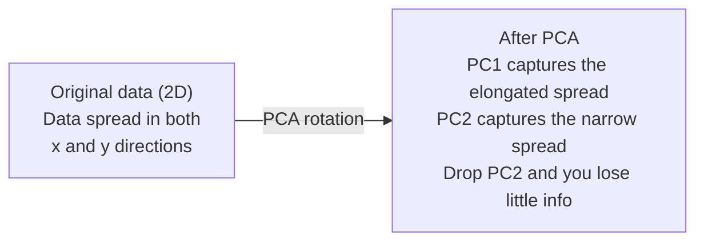

# Giảm kích thước

> High-level dữ liệu có cấu trúc. Bạn cần phải nhìn nó từ góc độ đúng.

**Type:** Build
**Language:**Python
**Prerequisites:** Phase 1, Lessons 01（Linear Algebra Intuition）、02（Vectors, Matrices & Operations）、03（Eigenvalues & Eigenvectors）、06（Probability & Distributions）
**Time:** ~90 分钟

## Mục tiêu học tập

- Từ zero thực hiện PCA: datacenter 計算 矩阵 tính biến 自身组建,并开展项目
- Sử dụng giải thích tỷ lệ biến số và phương pháp tay  chọn các thành phần chính
- So sánh hiệu quả của các con số MNIST được hình dung trong 2D của PCA, t-SNE và UMAP, và giải thích cân nặng của chúng
- Sử dụng带 RBF kernel của kernel PCA phân chia tiêu chuẩn PCA không thể xử lý các cấu trúc dữ liệu không tuyến tính

## Vấn đề

Bạn có một mẫu có chứa 784 tính năng của bộ dữ liệu. Có lẽ nó là giá trị pixel số viết tay. Có lẽ nó là mức độ biểu hiện gen. Có lẽ nó là tín hiệu hành vi người dùng. Bạn không thể hình dung được 784 tính năng. Bạn không thể vẽ chúng. Bạn thậm chí không thể nghĩ về chúng.

Nhưng phần lớn các tính năng của 784 này là quá nhiều. Thông tin thực sự tồn tại trên bề mặt của một số nhỏ hơn. Một chữ "7" được viết bằng tay không cần 784 số độc lập để mô tả.

Giảm chiều kích sẽ tìm thấy bề mặt nhỏ hơn đó. Nó sẽ thu nhỏ dữ liệu 784 chiều của bạn xuống 2 ̊10 hoặc 50 ̊ chiều, đồng thời giữ lại cấu trúc quan trọng.

## Khái niệm

### Lời nguyền của chiều kích

Không gian không phù hợp với trực giác. Khi kích thước tăng lên, có ba điều sẽ không hiệu quả.

**距离变得没有意义。**Trong độ cao, khoảng cách giữa hai điểm tự nhiên bất kỳ sẽ đạt đến cùng một giá trị. Nếu mỗi điểm đến mỗi điểm khác nhau, tìm kiếm hàng xóm gần nhất sẽ không hiệu quả.

```
Dimension    Avg distance ratio (max/min between random points)
2            ~5.0
10           ~1.8
100          ~1.2
1000         ~1.02
```

**体积集中在角落。**d 维 đơn vị siêu khối có 2 个角. Trong 100 维, hầu hết các khối lượng đều ở góc, xa trung tâm.

**你需要指数级更多的数据。**Để giữ cùng mật độ mẫu trong một không gian, từ 2D đến 20D có nghĩa là bạn cần 10^18 lần dữ liệu. Bạn sẽ không bao giờ có đủ dữ liệu.

### PCA: tìm các hướng dẫn quan trọng

Phân tích thành phần chính (PCA) sẽ tìm thấy các biến đổi dữ liệu lớn nhất. Nó xoay tròn hệ thống định vị của bạn, làm cho đầu tiên nắm bắt nhiều biến thể nhất, thứ hai nắm bắt nhiều biến thể thứ hai, theo loại đề xuất.

算法:

```
1. Center the data        (subtract the mean from each feature)
2. Compute covariance     (how features move together)
3. Eigendecomposition     (find the principal directions)
4. Sort by eigenvalue     (biggest variance first)
5. Project               (keep top k eigenvectors, drop the rest)
```

Tại sao sử dụng cấu trúc riêng?Matrix tính tương tự là đối xứng và tích cực bán xác định của nó. Các phương tiện riêng của nó là các hướng thẳng thắn trong không gian đặc trưng.



- **Before PCA:**Mây dữ liệu  dọc theo x và y 两个轴呈对角线扩散
- **After PCA:**坐标系 được xoay, làm cho PC1 đối với chiều hướng của sự biến động tối đa của ︎ spread kéo dài), PC2 đối với chiều hướng của sự biến động tối thiểu của ︎ spread hẹp)
- **Dimensionality reduction:**Thả PC2 sẽ đưa dữ liệu chiếu lên PC1, chỉ mất rất ít thông tin

### Tỷ lệ biến động giải thích

Mỗi thành phần chính đều nắm bắt một phần của sự biến động tổng thể.

```
Component    Eigenvalue    Explained ratio    Cumulative
PC1          4.73          0.473              0.473
PC2          2.51          0.251              0.724
PC3          1.12          0.112              0.836
PC4          0.89          0.089              0.925
...
```

Khi sự biến thể giải thích tích lũy đạt 0,95 , bạn đã biết các thành phần này đã thu được 95% thông tin.

### Chọn số lượng thành phần

三种策略:

1. **Threshold.**Giữ đủ nhiều thành phần, để giải thích sự khác biệt 90-95%
2. **Elbow method.**绘制 từng thành phần có sự khác biệt giải thích  tìm kiếm điểm giảm tốc rõ ràng 
3. **Downstream performance.**Để sử dụng PCA để xử lý trước, hãy xem xét độ chính xác của mô hình và đo lường.

### T-SNE: bảo vệ các khu phố

t-Distributed Stochastic Neighbor Embedding (t-SNE) là một thiết kế có thể nhìn thấy được. Nó đưa dữ liệu lớn đến 2D hoặc 3D, trong khi vẫn giữ những điểm gần nhau.

直觉是: Trong không gian nguyên thủy, dựa trên khoảng cách giữa các điểm tính toán một phân bố xác suất. Điểm gần có khả năng cao. Điểm xa có khả năng thấp. Sau đó tìm ra một phân bố xác suất 2D, tạo ra sự phân bố xác suất tương tự.

T-SNE's Key Nature:
- Không tuyến tính. Nó có thể mở ra các đa dạng phức tạp không thể xử lý PCA.
- Stochastic. khác nhau.
- Sự bối rối 参数控制考虑多少邻居 (Tình hình: 5-50)
- 输出中 cluster  khoảng cách giữa các cluster không có ý nghĩa. Chỉ có cluster có ý nghĩa.
- Trong các tập dữ liệu lớn 上很慢──默认是 O(n^2)──

### UMAP: cấu trúc toàn cầu nhanh hơn, tốt hơn

Phương pháp làm việc của Uniform Manifold Approximation and Projection (UMAP) tương tự như t-SNE, nhưng có hai ưu điểm:
- 更快── nó sử dụng đồ thị gần nhất gần nhất, thay vì tính toán tất cả các khoảng cách đôi──
- Tương tự cấu trúc toàn cầu tốt hơn.

UMAP trong高维空间中 xây dựng một biểu đồ cân nặng (tức là "tình hình top học mờ"), sau đó tìm kiếm một bố cục ở độ thấp, càng tốt để giữ lại biểu đồ này.

关键参数:
- `n_neighbors`: how many neighbour define local structure (tương tự như sự bối rối)──更高的价值会保留更多的全球结构──
- `min_dist`: Output trung điểm tập hợp nhiều hơn cục. Giá trị thấp hơn sẽ tạo ra các cụm cluster dày đặc hơn.

### Khi nào sử dụng

| Method | Use case | Preserves | Speed |
|--------|----------|-----------|-------|
| PCA | Preprocessing before training | Global variance | Fast (exact), works on millions of samples |
| PCA | Quick exploratory visualization | Linear structure | Fast |
| t-SNE | Publication-quality 2D plots | Local neighborhoods | Slow (< 10k samples ideal) |
| UMAP | 2D visualization at scale | Local + some global structure | Medium (handles millions) |
| PCA | Feature reduction for models | Variance-ranked features | Fast |
| t-SNE / UMAP | Understanding cluster structure | Cluster separation | Medium to slow |

经验法则: Sử dụng PCA để làm quá trình xử lý trước và nén dữ liệu.

### PCA lõi

标准PCA sẽ tìm thấy các phân không gian tuyến tính. Nó xoay vòng các tập hợp của bạn và không bỏ rơi轴. Nhưng nếu dữ liệu nằm trong đa dạng không tuyến tính 上怎么办?

Kernel PCA trong không gian tính năng cao được kích thích bởi chức năng kernel  áp dụng PCA, không rõ ràng tính toán các điểm ngồi trong không gian này. Đây là thủ thuật của kernel, đó là cùng một ý tưởng đằng sau SVMs.

算法:
1. 计算 hạt nhân matrix K, trong đó K_ij = k(x_i, x_j)
2. Trong không gian tính năng Trung tâm lõi matrix
3. Đối với các mô-trix hạt nhân tập trung làm riêng
4. 顶部 eigenvectors(按1/sqrt(eigenvalue) 缩放) là các dự đoán

常见 hàm hạt nhân:

| Kernel | Formula | Good for |
|--------|---------|----------|
| RBF (Gaussian) | exp(-gamma * \|\|x - y\|\|^2) | 大多数 nonlinear data、smooth manifolds |
| Polynomial | (x . y + c)^d | Polynomial relationships |
| Sigmoid | tanh(alpha * x . y + c) | Neural network-like mappings |

何時使用内核 PCA thay vì PCA tiêu chuẩn:

| Criterion | Standard PCA | Kernel PCA |
|-----------|-------------|------------|
| Data structure | Linear subspace | Nonlinear manifold |
| Speed | O(min(n^2 d, d^2 n)) | O(n^2 d + n^3) |
| Interpretability | Components are linear combinations of features | Components lack direct feature interpretation |
| Scalability | Works on millions of samples | Kernel matrix is n x n, memory-limited |
| Reconstruction | Direct inverse transform | Requires pre-image approximation |

Ví dụ điển hình: 2D trong vòng tròn tập trung. 2 vòng tròn bên trong vòng tròn khác.

### Hầm lầm tái thiết

Sự giảm chiều kích của bạn có gì tốt? Bạn đã nén 784 dimension thành 50 dimension. Bạn đã mất gì?

测量 lỗi tái tạo:
1. 将数据投影到 k 维:X_reduced = X @ W_k
2. 重建: X_hat = X_reduced @ W_k^T
3. 计算 MSE: trung bình((X - X_hat) ^2)

Đối với PCA, lỗi tái thiết với sự khác biệt giải thích có mối quan hệ rõ ràng:

```
Reconstruction error = sum of eigenvalues NOT included
Total variance = sum of ALL eigenvalues
Fraction lost = (sum of dropped eigenvalues) / (sum of all eigenvalues)
```

Tỷ lệ biến số giải thích của mỗi thành phần là:

```
explained_ratio_k = eigenvalue_k / sum(all eigenvalues)
```

Để kết hợp các biến thể được giải thích tích lũy đối với các thành phần số lượng, sẽ có được đường cong "công tay" ⋅ phù hợp các thành phần số lượng nằm ở:
- 曲线变平的位置(收益递减)
- Sự biến đổi tích lũy  vượt qua ngưỡng của bạn vị trí của bạn thường là 0,90 hoặc 0,95)
- Hoạt động nhiệm vụ dòng chảy 进入平台期的位置

Trận lỗi tái thiết không chỉ được sử dụng để chọn k. Bạn có thể sử dụng nó để phát hiện bất thường: lỗi tái thiết cao của mẫu là ngoại lệ, chúng không phù hợp với không gian phụ được học. Đây là cơ sở phát hiện bất thường trong các hệ thống sản xuất dựa trên PCA.


```figure
pca-axes
```

## Hãy xây dựng nó

### Bước 1: PCA từ đầu

```python
import numpy as np

class PCA:
    def __init__(self, n_components):
        self.n_components = n_components
        self.components = None
        self.mean = None
        self.eigenvalues = None
        self.explained_variance_ratio_ = None

    def fit(self, X):
        self.mean = np.mean(X, axis=0)
        X_centered = X - self.mean

        cov_matrix = np.cov(X_centered, rowvar=False)

        eigenvalues, eigenvectors = np.linalg.eigh(cov_matrix)

        sorted_idx = np.argsort(eigenvalues)[::-1]
        eigenvalues = eigenvalues[sorted_idx]
        eigenvectors = eigenvectors[:, sorted_idx]

        self.components = eigenvectors[:, :self.n_components].T
        self.eigenvalues = eigenvalues[:self.n_components]
        total_var = np.sum(eigenvalues)
        self.explained_variance_ratio_ = self.eigenvalues / total_var

        return self

    def transform(self, X):
        X_centered = X - self.mean
        return X_centered @ self.components.T

    def fit_transform(self, X):
        self.fit(X)
        return self.transform(X)
```

### Bước 2: Kiểm tra trên dữ liệu tổng hợp

```python
np.random.seed(42)
n_samples = 500

t = np.random.uniform(0, 2 * np.pi, n_samples)
x1 = 3 * np.cos(t) + np.random.normal(0, 0.2, n_samples)
x2 = 3 * np.sin(t) + np.random.normal(0, 0.2, n_samples)
x3 = 0.5 * x1 + 0.3 * x2 + np.random.normal(0, 0.1, n_samples)

X_synthetic = np.column_stack([x1, x2, x3])

pca = PCA(n_components=2)
X_reduced = pca.fit_transform(X_synthetic)

print(f"Original shape: {X_synthetic.shape}")
print(f"Reduced shape:  {X_reduced.shape}")
print(f"Explained variance ratios: {pca.explained_variance_ratio_}")
print(f"Total variance captured: {sum(pca.explained_variance_ratio_):.4f}")
```

### Bước 3: Các chữ số MNIST trong 2D

```python
from sklearn.datasets import fetch_openml

mnist = fetch_openml("mnist_784", version=1, as_frame=False, parser="auto")
X_mnist = mnist.data[:5000].astype(float)
y_mnist = mnist.target[:5000].astype(int)

pca_mnist = PCA(n_components=50)
X_pca50 = pca_mnist.fit_transform(X_mnist)
print(f"50 components capture {sum(pca_mnist.explained_variance_ratio_):.2%} of variance")

pca_2d = PCA(n_components=2)
X_pca2d = pca_2d.fit_transform(X_mnist)
print(f"2 components capture {sum(pca_2d.explained_variance_ratio_):.2%} of variance")
```

### Bước 4: So sánh với sklearn

```python
from sklearn.decomposition import PCA as SklearnPCA
from sklearn.manifold import TSNE

sklearn_pca = SklearnPCA(n_components=2)
X_sklearn_pca = sklearn_pca.fit_transform(X_mnist)

print(f"\nOur PCA explained variance:     {pca_2d.explained_variance_ratio_}")
print(f"Sklearn PCA explained variance: {sklearn_pca.explained_variance_ratio_}")

diff = np.abs(np.abs(X_pca2d) - np.abs(X_sklearn_pca))
print(f"Max absolute difference: {diff.max():.10f}")

tsne = TSNE(n_components=2, perplexity=30, random_state=42)
X_tsne = tsne.fit_transform(X_mnist)
print(f"\nt-SNE output shape: {X_tsne.shape}")
```

### Bước 5: So sánh UMAP

```python
try:
    from umap import UMAP

    reducer = UMAP(n_components=2, n_neighbors=15, min_dist=0.1, random_state=42)
    X_umap = reducer.fit_transform(X_mnist)
    print(f"UMAP output shape: {X_umap.shape}")
except ImportError:
    print("Install umap-learn: pip install umap-learn")
```

## Sử dụng nó

Để PCA sử dụng như một phân loại  trước đây:

```python
from sklearn.decomposition import PCA as SklearnPCA
from sklearn.linear_model import LogisticRegression
from sklearn.model_selection import train_test_split
from sklearn.metrics import accuracy_score

X_train, X_test, y_train, y_test = train_test_split(
    X_mnist, y_mnist, test_size=0.2, random_state=42
)

results = {}
for k in [10, 30, 50, 100, 200]:
    pca_k = SklearnPCA(n_components=k)
    X_tr = pca_k.fit_transform(X_train)
    X_te = pca_k.transform(X_test)

    clf = LogisticRegression(max_iter=1000, random_state=42)
    clf.fit(X_tr, y_train)
    acc = accuracy_score(y_test, clf.predict(X_te))
    var_captured = sum(pca_k.explained_variance_ratio_)
    results[k] = (acc, var_captured)
    print(f"k={k:>3d}  accuracy={acc:.4f}  variance={var_captured:.4f}")
```

Hiệu suất sẽ ở xa hơn 784 维时进入平台期.

## Chuyển nó

本课会产出:
- `outputs/skill-dimensionality-reduction.md`- Một kỹ năng được sử dụng cho một nhiệm vụ nhất định chọn phù hợp giảm chiều kích  kỹ thuật

## Các bài tập

1. 修改 PCA lớp 以支持 `inverse_transform`△ Sử dụng 10、50 和 200 thành phần 重建 MNIST số.

2. Trong cùng một bộ phận MNIST 上运行 t-SNE, độ phức tạp giá trị phân biệt là 5、30 和 100─ mô tả xuất phát thay đổi như thế nào― Tại sao độ phức tạp sẽ ảnh hưởng đến độ chặt chẽ cluster?

3.  lấy một bộ dữ liệu có 50 tính năng, nhưng chỉ có 5 tính năng thông tin `sklearn.datasets.make_classification`生成) ・ ứng dụng PCA,并检查 giải thích đường cong biến số liệu liệu thực sự là 5 chiều.

## Các điều khoản chính

| Term | What people say | What it actually means |
|------|----------------|----------------------|
| Curse of dimensionality | "Too many features" | 随着维度增长，距离、体积和数据密度都会表现得反直觉。Models 需要指数级更多的数据来补偿。 |
| PCA | "Reduce dimensions" | 旋转你的坐标系，使各轴与 maximum variance 的方向对齐，然后丢弃 low-variance axes。 |
| Principal component | "An important direction" | Covariance matrix 的一个 eigenvector。Feature space 中数据变化最大的方向。 |
| Explained variance ratio | "How much info this component has" | 一个 principal component 捕获的 total variance 比例。对前 k 个 ratios 求和，就能看到 k 个 components 保留了多少信息。 |
| Covariance matrix | "How features correlate" | 一个 symmetric matrix，其中 entry (i,j) 衡量 feature i 和 feature j 如何共同变化。Diagonal entries 是各自的 variances。 |
| t-SNE | "That cluster plot" | 一种 nonlinear 方法，通过保留 pairwise neighborhood probabilities 将高维数据映射到 2D。适合可视化，不适合 preprocessing。 |
| UMAP | "Faster t-SNE" | 一种基于 topological data analysis 的 nonlinear 方法。既保留 local structure，也保留部分 global structure。比 t-SNE 更容易扩展。 |
| Perplexity | "A t-SNE knob" | 控制每个点考虑的有效邻居数量。低 perplexity 聚焦非常 local 的结构。高 perplexity 捕获更宽泛的模式。 |
| Manifold | "The surface the data lives on" | Embedding在更高维空间中的低维表面。一张在 3D 中揉皱的纸是一个 2D manifold。 |

## Đọc thêm

- [A Tutorial on Principal Component Analysis](https://arxiv.org/abs/1404.1100)(Shlens) - Từ零开始清晰推导 PCA
- [How to Use t-SNE Effectively](https://distill.pub/2016/misread-tsne/)(Wattenberg et al.) - 关于 t-SNE 陷和参数选择的交互式指南
- [UMAP documentation](https://umap-learn.readthedocs.io/)- Từ UMAP tác giả lý thuyết và thực hành hướng dẫn
