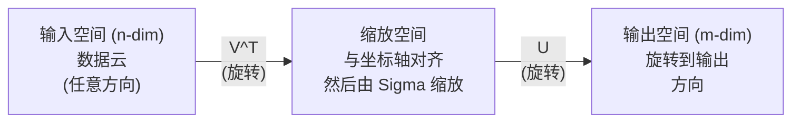
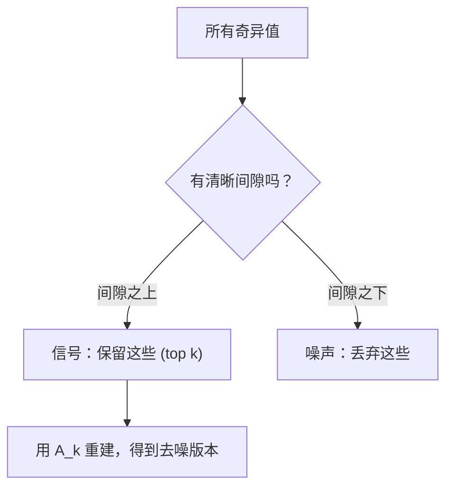

# Sự phân hủy giá trị độc đáo

> SVD là một trong những con số trên đường. Mỗi matrix đều có SVD.

**Type:** Build
**Languages:** Python, Julia
**Prerequisites:** Phase 1，Lessons 01 (Linear Algebra Intuition)、02 (Vectors & Matrices Operations)、03 (Matrix Transformations)
**Time:** ~120 minutes

## Học mục tiêu
- Thông qua lặp lại năng lượng 实现 SVD,并解释 U、Sigma 和 V^T 的几何含义
-  áp dụng SVD cắt giảm  thực hiện nén hình ảnh,并 đo quan hệ giữa tỷ lệ nén và sự khác biệt xây dựng lại
- Thông qua SVD  tính toán Moore-Penrose pseudoinverse, để tìm giải pháp siêu xác định các hình vuông tối thiểu  hệ thống
- Để kết nối SVD với PCA、推系统(lần số trễ) và phân tích ngữ nghĩa trễ trong NLP  liên kết

## 问题
Bạn có một Matrix 1000x2000. Nó có thể là người dùng- phim đánh giá. Nó có thể là một biểu tượng của một hình ảnh. Bạn cần phải nén nó, tìm ra cấu trúc ẩn trong đó, hoặc sử dụng nó để giải quyết một hệ thống không có hình vuông.

SVD  áp dụng cho bất kỳ Matrix nào  hình dạng tùy chọn  cấp độ tùy chọn  không giới hạn điều kiện  nó phân chia Matrix thành ba yếu tố, tiết lộ rằng Matrix này đối với cấu trúc hình học thay đổi không gian  nó là phổ biến nhất  yếu tố hữu ích nhất trong toàn bộ số tính toán 

## 概念
### SVD trong几何上做什么

Mỗi Matrix, bất kể hình dạng của nó là gì, đều sẽ theo thứ tự thực hiện ba hoạt động: xoay xoay, rút gọn, xoay.

```
A = U * Sigma * V^T

      m x n     m x m    m x n    n x n
     (任意)    (旋转)   (缩放)   (旋转)
```

给定任意 Matrix A,SVD sẽ phân giải thành:
- V^T 旋转输入空间 ((n 维) trong vector
- Sigma 沿每个轴进行缩放 (拉伸或压缩)
- U sẽ kết quả quay sang không gian xuất khẩu



Bạn sẽ biết:  Matrix sẽ đầu tiên sử dụng V^T  quay vào bóng, sau đó sử dụng Sigma để kéo dài nó thành bóng, cuối cùng sử dụng U  quay vào bóng này .

### Sự phân hủy đầy đủ

Đối với hình dạng m x n của Matrix A:

```
A = U * Sigma * V^T

其中：
  U     是 m x m，正交 (U^T U = I)
  Sigma 是 m x n，对角（奇异值位于对角线上）
  V     是 n x n，正交 (V^T V = I)

奇异值 sigma_1 >= sigma_2 >= ... >= sigma_r > 0
其中 r = rank(A)
```

Các chuỗi U được gọi là Vêctơ khác biệt trái. Các chuỗi V được gọi là Vêctơ khác biệt phải. Các phần tử đối diện của Sigma được gọi là Vêctơ khác biệt.

### Các vector đơn bên trái ≠ giá trị đơn bên phải ≠ vector đơn bên phải

Mỗi thành phần của SVD có ý nghĩa khác nhau.

**Right singular vectors（V 的列）：**Chúng tạo thành một nhóm các định dạng chính xác. Chúng là các định hướng trong không gian nhập, và các định dạng này sẽ được chuyển sang các định hướng chính xác trong không gian nhập.

**Singular values（Sigma 的对角线）：**Chúng là các yếu tố nhỏ hơn. Thứ nhất, các giá trị khác nhau cho bạn biết, Matrix 沿第 nhất 右 奇异向量 方向将向量 拉伸多少──奇异值为零 nghĩa là Matrix sẽ áp lực hoàn toàn hướng đó.

**Left singular vectors（U 的列）：**它们为输出空间(R^m) cấu thành một nhóm cơ sở thông thường.

Sự liên hệ giữa chúng:

```
A * v_i = sigma_i * u_i

Matrix A 接收第 i 个右奇异Vector v_i，
用 sigma_i 对其缩放，并将其映射到第 i 个左奇异Vector u_i。
```

Nó cho phép bất kỳ Matrix làm gì mỗi hình ảnh.

### Phương thức sản phẩm bên ngoài

SVD có thể được viết thành thứ hạng-1 Matrix của và:

```
A = sigma_1 * u_1 * v_1^T + sigma_2 * u_2 * v_2^T + ... + sigma_r * u_r * v_r^T

每一项 sigma_i * u_i * v_i^T 都是一个 rank-1 Matrix（一个 outer product）。
完整 Matrix 是 r 个这类 Matrix 的和，其中 r 是 rank。
```

Đây là hình thức cơ sở của sự tiếp cận cấp thấp. Mỗi thứ đều thêm một tầng cấu trúc. Thứ nhất là nắm bắt một mô hình đơn quan trọng nhất. thứ hai là nắm bắt một mô hình quan trọng thứ hai.

```
Rank-1 approx:    A_1 = sigma_1 * u_1 * v_1^T
                  (捕获主导模式)

Rank-2 approx:    A_2 = sigma_1 * u_1 * v_1^T + sigma_2 * u_2 * v_2^T
                  (捕获两个最重要的模式)

Rank-k approx:    A_k = top k 项之和
                  (根据 Eckart-Young theorem，这是最优的)
```

### Mối quan hệ với sự kết hợp của riêng mình

SVD và cấu trúc riêng có mối liên hệ sâu sắc. A của các giá trị riêng và các vector riêng trực tiếp từ A^T A và A^T của các giá trị riêng với các vector riêng.

```
A^T A = V * Sigma^T * U^T * U * Sigma * V^T
      = V * Sigma^T * Sigma * V^T
      = V * D * V^T

其中 D = Sigma^T * Sigma 是一个对角 Matrix，其对角线上为 sigma_i^2。

因此：
- 右奇异Vector (V) 是 A^T A 的 eigenvectors
- 奇异值的平方 (sigma_i^2) 是 A^T A 的 eigenvalues

类似地：
A A^T = U * Sigma * V^T * V * Sigma^T * U^T
      = U * Sigma * Sigma^T * U^T

因此：
- 左奇异Vector (U) 是 A A^T 的 eigenvectors
- A A^T 的 eigenvalues 也都是 sigma_i^2
```

Cái liên lạc này nói với anh 3 điều:
1. 奇异值总是实数且非负 (nói là các giá trị riêng của một số lượng tử hình bán xác định tích cực) ⋅
2. Bạn có thể tính toán SVD bằng cách làm cho A^T A cấu trúc riêng của mình, nhưng nó sẽ làm cho số điều kiện vuông và mất giá trị số chính xác.
3. Khi A là một hình dạng và có tính đối xứng tích cực bán xác định, SVD và sự kết hợp của nó là cùng một điều.

### SVD cắt giảm:Tương gần cấp thấp

Tiến lý Eckart-Young-Mirsky  chỉ ra,A của tốt nhất xếp hạng gần giống như k ((( trong chuẩn Frobenius và chuẩn phổ 下) có thể chỉ qua duy trì giá trị trên k 个奇异及其对应向量 得到:

```
A_k = U_k * Sigma_k * V_k^T

其中：
  U_k     是 m x k  (U 的前 k 列)
  Sigma_k 是 k x k  (Sigma 的左上 k x k 块)
  V_k     是 n x k  (V 的前 k 列)

近似误差 = sigma_{k+1}  (在 spectral norm 下)
         = sqrt(sigma_{k+1}^2 + ... + sigma_r^2)  (在 Frobenius norm 下)
```

Đây không chỉ là một cách gần gũi tốt hơn. Nó là thứ hạng tốt nhất gần gũi hơn. Không có thứ hạng khác của Matrix có thể gần gũi hơn với A.

| Component | Relative magnitude | Kept in rank-3 approx? |
|-----------|-------------------|------------------------|
| sigma_1 | 最大 | 是 |
| sigma_2 | 大 | 是 |
| sigma_3 | 中等偏大 | 是 |
| sigma_4 | 中等 | 否（误差） |
| sigma_5 | 中等偏小 | 否（误差） |
| sigma_6 | 小 | 否（误差） |
| sigma_7 | 很小 | 否（误差） |
| sigma_8 | 极小 | 否（误差） |

保留 top 3:A_3 捕获三个最大的奇异值──误差 = 剩余值(sigma_4 到 sigma_8)。

Nếu sự suy giảm bất thường nhanh chóng, một k rất nhỏ sẽ có thể nắm bắt được phần lớn thông tin của Matrix. Nếu suy giảm chậm, Matrix sẽ không có cấu trúc thấp.

### Sử dụng SVD  để làm ảnh nén

灰度图像是像素强度组成的矩阵――一张800x600 图像有480,000 个值――SVD 让你用更少的值来接近它――

```
原始图像：800 x 600 = 480,000 个值

rank k 的 SVD：
  U_k:      800 x k 个值
  Sigma_k:  k 个值
  V_k:      600 x k 个值
  总计:     k * (800 + 600 + 1) = k * 1401 个值

  k=10:   14,010 个值   (原始的 2.9%)
  k=50:   70,050 个值  (原始的 14.6%)
  k=100: 140,100 个值  (原始的 29.2%)

  k 越小，压缩率越好，
  但视觉质量会下降。
```

关键洞察: các hình ảnh tự nhiên có giá trị kỳ lạ sẽ suy giảm nhanh chóng. Trước đây, một vài hình ảnh kỳ lạ sẽ thu được cấu trúc quy mô lớn, hình dạng, biến đổi.

### SVD dùng cho hệ thống

Giải thưởng Netflix 让这一点广为人知──你有一个用户电影评分 Matrix, hầu hết các条目 đều bị thiếu hụt──

```
             Movie1  Movie2  Movie3  Movie4  Movie5
  User1      [  5      ?       3       ?       1  ]
  User2      [  ?      4       ?       2       ?  ]
  User3      [  3      ?       5       ?       ?  ]
  User4      [  ?      ?       ?       4       3  ]

  ? = 未知评分
```

核心思想:这个评分 矩阵 具有低级别──用户的品味不是完全独立──有几个隐藏因素──动作对剧情、旧对新、理性对感官) có thể giải thích hầu hết các sở thích──

Đối với các phân tích Matrix làm SVD, sẽ được phân tích thành:
- U:trung factor không gian 中的用户配置
- Sigma: tầm quan trọng của mỗi yếu tố tiềm ẩn
- V^T: không gian yếu tố trần gian 中的电影资料

Người dùng cho một bộ phim, là người dùng hồ sơ và điểm sản phẩm của hồ sơ phim.

Trong thực tế, bạn sẽ sử dụng SVD tăng trưởng của Simon Funk hoặc ALS (đổi thay các vuông tối thiểu) loại này có thể trực tiếp xử lý biến thể của thiếu dữ liệu.

### SVD của NLP 中: Phân tích ngữ nghĩa tiềm ẩn

Phân tích ngữ nghĩa trần gian (LSA), còn được gọi là Chỉ số ngữ nghĩa trần gian (LSI), sẽ sẽ SVD 应用于 thuật ngữ tài liệu Matrix。

```
             Doc1   Doc2   Doc3   Doc4
  "cat"      [  3      0      1      0  ]
  "dog"      [  2      0      0      1  ]
  "fish"     [  0      4      1      0  ]
  "pet"      [  1      1      1      1  ]
  "ocean"    [  0      3      0      0  ]

rank k=2 的 SVD 之后：

  每个文档变成 2D “概念空间”中的一个点。
  每个词项变成同一个 2D 空间中的一个点。
  主题相似的文档会聚在一起。
  含义相似的词项会聚在一起。

  "cat" 和 "dog" 最终会靠近彼此（陆地宠物）。
  "fish" 和 "ocean" 最终会靠近彼此（水相关概念）。
  如果 Doc1 和 Doc3 共享相似主题，它们会聚在一起。
```

LSA là một trong những phương pháp thành công sớm nhất trong việc nắm bắt ngữ nghĩa tương tự trong văn bản nguyên thủy. Nó có hiệu quả vì các ngữ nghĩa thường xuất hiện trong các văn bản tương tự, do đó SVD sẽ đưa chúng vào cùng một chiều dài ẩn.

### SVD để giảm tiếng ồn

Thông tin về tiếng ồn thường tập trung tín hiệu vào các giá trị khác nhau trên cùng, trong khi tiếng ồn phân tán trên tất cả các giá trị khác nhau.

**干净信号的奇异值：**

| Component | Magnitude | Type |
|-----------|-----------|------|
| sigma_1 | 非常大 | 信号 |
| sigma_2 | 大 | 信号 |
| sigma_3 | 中等 | 信号 |
| sigma_4 | 接近零 | 可忽略 |
| sigma_5 | 接近零 | 可忽略 |

**有噪声信号的奇异值（噪声会加到所有分量上）：**

| Component | Magnitude | Type |
|-----------|-----------|------|
| sigma_1 | 非常大 | 信号 |
| sigma_2 | 大 | 信号 |
| sigma_3 | 中等 | 信号 |
| sigma_4 | 小 | 噪声 |
| sigma_5 | 小 | 噪声 |
| sigma_6 | 小 | 噪声 |
| sigma_7 | 小 | 噪声 |



Nó được sử dụng để xử lý tín hiệu, đo lường khoa học và làm sạch dữ liệu. Bất cứ lúc nào, miễn là Matrix của bạn bị nhiễm tiếng ồn, SVD bị cắt giảm là một phương pháp phân chia tiếng ồn có nguyên tắc.

### Phép đảo ngược qua SVD

Moore-Penrose pseudoinverse A + sẽ đưa sự đảo ngược của Matrix 推广到非方阵和奇异Matrix──SVD 让它的计算变得非常简单──

```
如果 A = U * Sigma * V^T，那么：

A+ = V * Sigma+ * U^T

其中 Sigma+ 的构造方式为：
  1. 转置 Sigma（交换行和列）
  2. 将每个非零对角元素 sigma_i 替换为 1/sigma_i
  3. 零保持为零

对于 A (m x n)：      A+ 是 (n x m)
对于 Sigma (m x n)：  Sigma+ 是 (n x m)
```

Phép đảo có thể tìm kiếm các hình vuông nhỏ nhất 问题──如果 Ax = b 没有精确解(超定系统),那么 x = A+ b 就是最小的平方 解(最小化的Ax - b 时时时) ‖

```
超定系统（方程数多于未知数）：

  [1  1]         [3]
  [2  1] x   =   [5]       不存在精确解。
  [3  1]         [6]

  x_ls = A+ b = V * Sigma+ * U^T * b

  这给出了使残差平方和最小的 x。
  结果与 normal equations (A^T A)^(-1) A^T b 相同，
  但数值上更稳定。
```

### Thường độ ổn định số 优势

计算 A^T A của riêng kết hợp 会平方奇异值(A^T A của eigenvalues là sigma_i^2)。

```
示例：
  A 的奇异值为 [1000, 1, 0.001]
  A 的 condition number：1000 / 0.001 = 10^6

  A^T A 的 eigenvalues 为 [10^6, 1, 10^{-6}]
  A^T A 的 condition number：10^6 / 10^{-6} = 10^{12}

  直接计算 SVD：使用 condition number 10^6
  通过 A^T A 计算：使用 condition number 10^{12}
                   （额外损失 6 位精度）
```

现代 SVD 算法(Golub-Kahan bi-diagonalization) trực tiếp ở A 上工作,从不构建 A^T A──这就是为什么你应该始终优先使用`np.linalg.svd(A)`, thay vì `np.linalg.eig(A.T @ A)`

### Kết nối với PCA

PCA là đối với tập trung dữ liệu làm SVD. Đây không phải là một loại.

```
给定数据 Matrix X (n_samples x n_features)，已中心化（减去均值）：

Covariance Matrix: C = (1/(n-1)) * X^T X

PCA 寻找 C 的 eigenvectors。但：

  X = U * Sigma * V^T    (X 的 SVD)

  X^T X = V * Sigma^2 * V^T

  C = (1/(n-1)) * V * Sigma^2 * V^T

所以 principal components 恰好就是右奇异Vector V。
每个 component 的 explained variance 是 sigma_i^2 / (n-1)。

在 sklearn 中，PCA 使用 SVD 实现，而不是 eigendecomposition。
它更快，数值上也更稳定。
```

Điều này có nghĩa là tất cả những gì bạn học trong Bài học 10 về việc giảm chiều kích, tầng dưới là SVD;. PCA là ứng dụng phổ biến nhất của SVD trong ML;.


```figure
svd-rank-reconstruction
```

##  xây dựng nó
### 步骤 1: SVD từ đầu sử dụng lặp lại năng lượng

思路: Để tìm được giá trị kỳ lạ nhất và các vector của nó, bạn có thể sử dụng A^T A((hoặc A^T) sử dụng lặp lại năng lượng.

```python
import numpy as np

def power_iteration(M, num_iters=100):
    n = M.shape[1]
    v = np.random.randn(n)
    v = v / np.linalg.norm(v)

    for _ in range(num_iters):
        Mv = M @ v
        v = Mv / np.linalg.norm(Mv)

    eigenvalue = v @ M @ v
    return eigenvalue, v

def svd_from_scratch(A, k=None):
    m, n = A.shape
    if k is None:
        k = min(m, n)

    sigmas = []
    us = []
    vs = []

    A_residual = A.copy().astype(float)

    for _ in range(k):
        AtA = A_residual.T @ A_residual
        eigenvalue, v = power_iteration(AtA, num_iters=200)

        if eigenvalue < 1e-10:
            break

        sigma = np.sqrt(eigenvalue)
        u = A_residual @ v / sigma

        sigmas.append(sigma)
        us.append(u)
        vs.append(v)

        A_residual = A_residual - sigma * np.outer(u, v)

    U = np.column_stack(us) if us else np.empty((m, 0))
    S = np.array(sigmas)
    V = np.column_stack(vs) if vs else np.empty((n, 0))

    return U, S, V
```

### 步骤 2: Kiểm tra và so sánh với NumPy

```python
np.random.seed(42)
A = np.random.randn(5, 4)

U_ours, S_ours, V_ours = svd_from_scratch(A)
U_np, S_np, Vt_np = np.linalg.svd(A, full_matrices=False)

print("Our singular values:", np.round(S_ours, 4))
print("NumPy singular values:", np.round(S_np, 4))

A_reconstructed = U_ours @ np.diag(S_ours) @ V_ours.T
print(f"Reconstruction error: {np.linalg.norm(A - A_reconstructed):.8f}")
```

### 步骤 3: Demo nén hình ảnh

```python
def compress_image_svd(image_matrix, k):
    U, S, Vt = np.linalg.svd(image_matrix, full_matrices=False)
    compressed = U[:, :k] @ np.diag(S[:k]) @ Vt[:k, :]
    return compressed

image = np.random.seed(42)
rows, cols = 200, 300
image = np.random.randn(rows, cols)

for k in [1, 5, 10, 20, 50]:
    compressed = compress_image_svd(image, k)
    error = np.linalg.norm(image - compressed) / np.linalg.norm(image)
    original_size = rows * cols
    compressed_size = k * (rows + cols + 1)
    ratio = compressed_size / original_size
    print(f"k={k:>3d}  error={error:.4f}  storage={ratio:.1%}")
```

### 步骤 4: Giảm tiếng ồn

```python
np.random.seed(42)
clean = np.outer(np.sin(np.linspace(0, 4*np.pi, 100)),
                 np.cos(np.linspace(0, 2*np.pi, 80)))
noise = 0.3 * np.random.randn(100, 80)
noisy = clean + noise

U, S, Vt = np.linalg.svd(noisy, full_matrices=False)
denoised = U[:, :5] @ np.diag(S[:5]) @ Vt[:5, :]

print(f"Noisy error:    {np.linalg.norm(noisy - clean):.4f}")
print(f"Denoised error: {np.linalg.norm(denoised - clean):.4f}")
print(f"Improvement:    {(1 - np.linalg.norm(denoised - clean) / np.linalg.norm(noisy - clean)):.1%}")
```

### 步骤 5: Phép đảo ngược

```python
A = np.array([[1, 1], [2, 1], [3, 1]], dtype=float)
b = np.array([3, 5, 6], dtype=float)

U, S, Vt = np.linalg.svd(A, full_matrices=False)
S_inv = np.diag(1.0 / S)
A_pinv = Vt.T @ S_inv @ U.T

x_svd = A_pinv @ b
x_lstsq = np.linalg.lstsq(A, b, rcond=None)[0]
x_pinv = np.linalg.pinv(A) @ b

print(f"SVD pseudoinverse solution:  {x_svd}")
print(f"np.linalg.lstsq solution:   {x_lstsq}")
print(f"np.linalg.pinv solution:    {x_pinv}")
```

## Sử dụng nó
完整可运行 demo 位于 `code/svd.py`◊运行 Nó có thể thấy SVD 应用于 hình ảnh nén, 推系统, phân tích ngữ nghĩa tiềm ẩn và giảm tiếng ồn.

```bash
python svd.py
```

`code/svd.jl`中的 Julia 版本 sử dụng Julia gốc `svd()`函数和 `LinearAlgebra`gói 演示相同概念──

```bash
julia svd.jl
```

## 交付 nó
本课会产出:
- `outputs/skill-svd.md`- Một kỹ năng được sử dụng để hiểu khi nào và làm thế nào để áp dụng SVD trong các dự án thực tế

## 练习
1. Từ zero để thực hiện SVD hoàn chỉnh, không sử dụng lặp lại năng lượng。改为计算 A^T A's eigencomposition 来得到 V 和奇异值,然后计算 U = A V Sigma^{-1}──将数值精度与你的功率 lặp lại 版本以及NumPy 进行比较。

2. Lên một bức ảnh màu đen thực tế (hoặc sẽ chuyển đổi một bức ảnh thành màu đen) ⋅ ở các bậc 1、5、10、25、50、100 ⋅ sưng nó xuống ⋅ đối với mỗi bậc, tính toán tỷ lệ sưng và sự sai lầm tương đối ⋅ tìm ra một hình ảnh trên hình ảnh trở nên chấp nhận được ⋅

3. 构建一个微型推系统――创建一个10x8的用户电影评分矩阵,其中包含一些已知条目――使用行平均值填补缺失条目――计算 SVD 并重建级-3 近似――使用重建矩阵 预测缺失评分――验证预测结果是合理的――

4. Tạo một Matrix tài liệu dài hạn 100x50, bao gồm 3 chủ đề tổng hợp. Mỗi chủ đề có 5 từ liên quan.

5. 生成一个干净的低级矩阵(排名 3,大小 50x40),并不同水平下添加高斯噪音(sigma = 0.1、0.5、1.0、2.0)。 đối với mỗi mức độ tiếng ồn, thông qua từ k=1 đến 40 扫描并测量 so với các lỗi tái tạo của干净矩阵, tìm ra mức độ cắt giảm tốt nhất。 vẽ tốt nhất k 如何随着噪音水平变化──

## 关键术语
| Term | What people say | What it actually means |
|------|----------------|----------------------|
| SVD | “Factor 任意 Matrix” | 将 A 分解为 U Sigma V^T，其中 U 和 V 是正交的，Sigma 是具有非负元素的对角 Matrix。适用于任意形状的任意 Matrix。 |
| Singular value | “这个 component 有多重要” | Sigma 的第 i 个对角元素。衡量 Matrix 沿第 i 个 principal direction 拉伸的程度。总是非负，并按降序排列。 |
| Left singular vector | “输出方向” | U 的一列。第 i 个右奇异Vector 经过 sigma_i 缩放后映射到的输出空间方向。 |
| Right singular vector | “输入方向” | V 的一列。输入空间中的一个方向，Matrix 会将其映射到第 i 个左奇异Vector（经过 sigma_i 缩放后）。 |
| Truncated SVD | “Low-rank approximation” | 只保留 top k 个奇异值及其 Vector。生成原始 Matrix 的可证明最佳 rank-k 近似（Eckart-Young theorem）。 |
| Rank | “真实维度” | 非零奇异值的数量。告诉你 Matrix 实际使用了多少个独立方向。 |
| Pseudoinverse | “广义逆” | V Sigma+ U^T。对非零奇异值取倒数，零保持为零。为非方阵或奇异 Matrix 求解 least-squares 问题。 |
| Condition number | “对误差有多敏感” | sigma_max / sigma_min。大的 condition number 意味着很小的输入变化会造成很大的输出变化。SVD 直接揭示这一点。 |
| Latent factor | “隐藏变量” | SVD 发现的 low-rank space 中的一个维度。在推荐中，latent factor 可能对应类型偏好。在 NLP 中，它可能对应一个主题。 |
| Frobenius norm | “Matrix 的总大小” | 所有元素平方和的平方根。等于所有奇异值平方和的平方根。用于衡量近似误差。 |
| Eckart-Young theorem | “SVD 给出最佳压缩” | 对任意目标 rank k，truncated SVD 会在所有可能的 rank-k Matrix 中最小化近似误差。 |
| Power iteration | “找到最大的 eigenvector” | 反复用 Matrix 乘以一个随机 Vector 并归一化。会收敛到具有最大 eigenvalue 的 eigenvector。它是许多 SVD 算法的构建模块。 |

## 延伸阅读
- [Gilbert Strang: Linear Algebra and Its Applications, Chapter 7](https://math.mit.edu/~gs/linearalgebra/)- Giải thích sâu sắc về SVD và ứng dụng của nó
- [3Blue1Brown: But what is the SVD?](https://www.youtube.com/watch?v=vSczTbgc8Rc)- SVD của hình thức trực tiếp
- [We Recommend a Singular Value Decomposition](https://www.ams.org/publicoutreach/feature-column/fcarc-svd)- Hiệp hội toán học Mỹ  cung cấp dễ hiểu概览
- [Netflix Prize and Matrix Factorization](https://sifter.org/~simon/journal/20061211.html)- Simon Funk  về việc sẽ SVD sử dụng cho đề xuất
- [Latent Semantic Analysis](https://en.wikipedia.org/wiki/Latent_semantic_analysis)- SVD trong các ứng dụng sớm trong NLP
- [Numerical Linear Algebra by Trefethen and Bau](https://people.maths.ox.ac.uk/trefethen/text.html)- hiểu được các thuật toán SVD và các tính chất số lượng của nó
