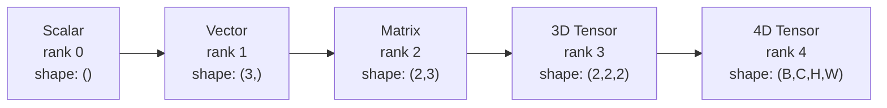
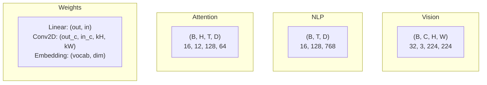
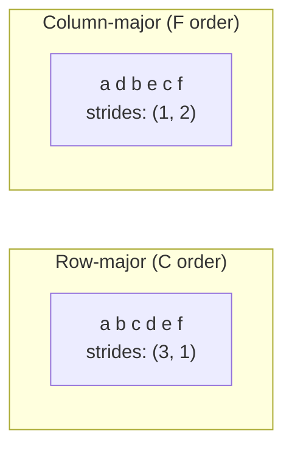
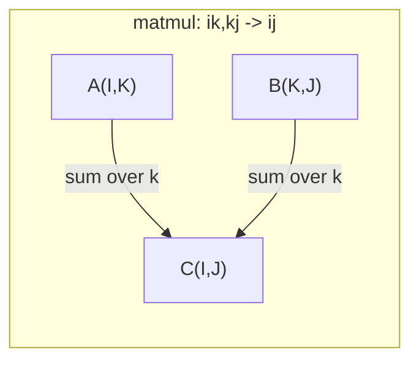

# Các hoạt động căng thẳng

> Các tensor là ngôn ngữ chung giữa dữ liệu và Deep Learning. Mỗi hình ảnh, mỗi câu, mỗi cấp độ đều di chuyển qua chúng.

**Type:** Build
**Language:**Python
**前置要求：**Giai đoạn 1, Bài học 01 (Linear Algebra Intuition),02 (Vectors, Matrices & Operations)
**Time:** ~90 分钟

## Học mục tiêu
- Từ zero thực hiện một lớp Tensor, hỗ trợ hình dạng, bước, hình dạng lại, chuyển và các hoạt động thông minh về các yếu tố
-  ứng dụng truyền hình  quy tắc, trong trường hợp không sao chép dữ liệu đối với các Tensor hình dạng khác nhau  thực hiện vận hành
- Đối với các sản phẩm điểm, số nhân tử liệu, các sản phẩm bên ngoài và các hoạt động đợt 编写 tổng thể biểu hiện
-  Theo dõi Multi-Head Attention từng bước của hình dạng Tensor chính xác

## 问题
Bạn xây dựng một bộ biến đổi. Nhìn lại, nó trông rất sạch.`RuntimeError: mat1 and mat2 shapes cannot be multiplied (32x768 and 512x768)`✿ 你着这些形状✿ 你试图转换✿ ✿ ✿ ✿ ✿ ✿ ✿ ✿ ✿ ✿ ✿ ✿ ✿ ✿ ✿ ✿ ✿ ✿ ✿ ✿ ✿ ✿ ✿ ✿ ✿ ✿ ✿ ✿ ✿ ✿ ✿ ✿ ✿ ✿ ✿ ✿ ✿ ✿ ✿ ✿ ✿ ✿ ✿ ✿ ✿ ✿ ✿ ✿ ✿ ✿ ✿ ✿ ✿ ✿ ✿ ✿ ✿ ✿ ✿ ✿ ✿ ✿ ✿ ✿ ✿ ✿ ✿ ✿ ✿ ✿ ✿ ✿ ✿ ✿ ✿ ✿ ✿ ✿ ✿ ✿ ✿ ✿ ✿ ✿ ✿ ✿ ✿ ✿ ✿ ✿ ✿ ✿ ✿ ✿ ✿ ✿ ✿ ✿ ✿ ✿ ✿ ✿ ✿ ✿ ✿ ✿ ✿ ✿ ✿ ✿ ✿ ✿ ✿ ✿ ✿ ✿`Expected 4D input (got 3D input)` Cậu đã thêm một cái không được nén  Một cái khác đã bị hỏng 

Sai lầm hình dạng là lỗi phổ biến nhất trong mã học sâu. Chúng không khó trong khái niệm - mỗi hoạt động đều có một hợp đồng hình dạng - nhưng sẽ nhanh chóng chồng lên. Một bộ biến đổi sẽ đưa ra vài chục hình dạng lại, chuyển đổi và phát sóng liên kết. Một trục 错误, lỗi trên cấp độ liên kết.

Matrix  xử lý sự kết nối giữa hai nhóm vật liệu. Thực tế dữ liệu không thể đưa vào hai chiều.`(32, 3, 224, 224)`❖ Với 12 đầu của sự chú ý tự nhiên cũng là 4D:`(batch, heads, seq_len, head_dim)`◊ Bạn cần một kiểu có thể mở rộng đến bất kỳ chiều kích số lượng cấu trúc dữ liệu, và hoạt động của nó có thể ở tất cả các chiều kích 上干净组合―― cấu trúc này là Tensor―― nắm bắt các hoạt động của nó, sai lầm hình dạng sẽ trở nên rất dễ dàng để gỡ lỗi――

## 概念
### Tensor là gì

Tensor là một số lượng có kích thước có một kiểu dữ liệu thống nhất của nhiều dạng số.**rank**(hoặc **order**() Mỗi chiều kích là một**axis****shape**là một tuple,列出 mỗi trục 上大小──



总元素数 = 所有尺寸的乘积――形`(2, 3, 4)`包含 `2 * 3 * 4 = 24`个元素.

### Các hình dạng Tensor trong Deep Learning

Theo quy tắc, các loại dữ liệu khác nhau sẽ được hiển thị cho các hình dạng Tensor cụ thể.



PyTorch sử dụng NCHW(channels-first) ――TensorFlow 默认使用 NHWC(channels-last)。 không phù hợp bố trí sẽ dẫn đến sự tĩnh lặng thay đổi chậm hoặc báo lỗi。

### Cách bố cục bộ nhớ hoạt động

Trong bộ nhớ 2D array là một đoạn 1D byte 序列.**Strides**Nói cho anh biết bao nhiêu yếu tố cần phải nhảy qua mỗi trục.



Chuyển chuyển không di động dữ liệu. Nó trao đổi bước, làm cho Tensor biến thành.**non-contiguous**-- một dòng trong các yếu tố trong trong trong trong trong không còn lân cận.

### Quy tắc phát thanh

Truyền hình 允许 bạn trong trường hợp không sao chép dữ liệu, đối với các Tensor có hình dạng khác nhau 进行运算── từ bên phải đối với các hình dạng giống nhau── hai chiều trong một pha như vậy hoặc một trong số đó là 1 时兼容── kích thước ít hơn một bên sẽ ở bên trái sử dụng 1 填充──

```
Tensor A:     (8, 1, 6, 1)
Tensor B:        (7, 1, 5)
Padded B:     (1, 7, 1, 5)
Result:       (8, 7, 6, 5)
```

### Einsum: hoạt động tensor chung

Einstein kết hợp sử dụng chữ ký đánh dấu mỗi trục. xuất hiện trong đầu vào nhưng không xuất hiện trong đầu ra. trục trong giữa sẽ được tìm kiếm và.



关键模式:`i,i->`(sản phẩm điểm)`i,j->ij`(tác phẩm bên ngoài)`ii->`(các dấu vết)`ij->ji`(đưa ra)`bij,bjk->bik`(các bộ)`bhtd,bhsd->bhts`(Công điểm chú ý)


```figure
tensor-broadcast
```

##  xây dựng nó
代码 nằm ở `code/tensors.py` Mỗi bước đều trích dẫn những thành tựu trong đó

### 步骤 1: Tensor  lưu trữ và bước

Tensor  lưu trữ một danh sách số 平 và metadata hình dạng。Step  nói với logic lập chỉ số  làm thế nào để đưa nhiều chỉ số 映射 đến 平 vị trí。

```python
class Tensor:
    def __init__(self, data, shape=None):
        if isinstance(data, (list, tuple)):
            self._data, self._shape = self._flatten_nested(data)
        elif isinstance(data, np.ndarray):
            self._data = data.flatten().tolist()
            self._shape = tuple(data.shape)
        else:
            self._data = [data]
            self._shape = ()

        if shape is not None:
            total = reduce(lambda a, b: a * b, shape, 1)
            if total != len(self._data):
                raise ValueError(
                    f"Cannot reshape {len(self._data)} elements into shape {shape}"
                )
            self._shape = tuple(shape)

        self._strides = self._compute_strides(self._shape)

    @staticmethod
    def _compute_strides(shape):
        if len(shape) == 0:
            return ()
        strides = [1] * len(shape)
        for i in range(len(shape) - 2, -1, -1):
            strides[i] = strides[i + 1] * shape[i + 1]
        return tuple(strides)
```

Đối với hình dạng`(3, 4)`, bước là `(4, 1)`-- n 1 dòng nhảy qua 4 nguyên tố, n 1 dòng nhảy qua 1 nguyên tố.

### 步骤 2: Tạo lại, nén, nén

Tạo lại hình dạng, nhưng không thay đổi trình tự các nguyên tố.`-1`让某一个维度自动推断其大小──

```python
t = Tensor(list(range(12)), shape=(2, 6))
r = t.reshape((3, 4))
r = t.reshape((-1, 3))
```

Squeeze 会移除大小为 1 的轴──Unsqueeze 会插入一个──Unsqueezing đối với phát sóng 至关重要 -- 一个偏向向向 `(D,)`Thêm đến lô`(B, T, D)`n, cần phải không ép đến `(1, 1, D)`

```python
t = Tensor(list(range(6)), shape=(1, 3, 1, 2))
s = t.squeeze()
v = Tensor([1, 2, 3])
u = v.unsqueeze(0)
```

### 第3 步:Transpose và chuyển đổi

Chuyển chuyển  trao đổi hai trục。 Chuyển chuyển 重新排序 tất cả trục。 đây là cách chuyển đổi giữa NCHW và NHWC。

```python
mat = Tensor(list(range(6)), shape=(2, 3))
tr = mat.transpose(0, 1)

t4d = Tensor(list(range(24)), shape=(1, 2, 3, 4))
perm = t4d.permute((0, 2, 3, 1))
```

Transpose hoặc permute 之后, Tensor trong内存 là không liên kết của ∙∙∙ trong PyTorch,`view`会在非连接子 上失败 -- 使用 `reshape`, hoặc trước调用 `.contiguous()`

### 步骤 4: Các hoạt động và giảm tính theo các yếu tố

Các hoạt động thông minh về các yếu tố (xác định) sẽ được áp dụng độc lập cho từng yếu tố,并保持形状 不变――Reductions (đối đa) sẽ gấp một hoặc nhiều trục――

```python
a = Tensor([[1, 2], [3, 4]])
b = Tensor([[10, 20], [30, 40]])
c = a + b
d = a * 2
s = a.sum(axis=0)
```

Trung bình toàn cầu của CNN:`(B, C, H, W).mean(axis=[2, 3])` tạo ra `(B, C)` NLP 中的序列 nghĩa là tập hợp:`(B, T, D).mean(axis=1)` tạo ra `(B, D)`

### 步骤 5: Truyền thông với NumPy

`tensors.py`Trung `demo_broadcasting_numpy()`chức năng  đã thể hiện mô hình cốt lõi:

```python
activations = np.random.randn(4, 3)
bias = np.array([0.1, 0.2, 0.3])
result = activations + bias

images = np.random.randn(2, 3, 4, 4)
scale = np.array([0.5, 1.0, 1.5]).reshape(1, 3, 1, 1)
result = images * scale

a = np.array([1, 2, 3]).reshape(-1, 1)
b = np.array([10, 20, 30, 40]).reshape(1, -1)
outer = a * b
```

通过广播 计算对距:将 `(M, 2)`tái hình thành 为 `(M, 1, 2)`,将 `(N, 2)`tái hình thành 为 `(1, N, 2)`,相减、平方、沿最后一个轴 求和、取平方根──结果为:`(M, N)`

### Bước 6: Các hoạt động Einsum

`demo_einsum()`和 `demo_einsum_gallery()`Các chức năng sẽ dần dần hiển thị mỗi kiểu hình thức thường xuyên.

```python
a = np.array([1.0, 2.0, 3.0])
b = np.array([4.0, 5.0, 6.0])
dot = np.einsum("i,i->", a, b)

A = np.array([[1, 2], [3, 4], [5, 6]], dtype=float)
B = np.array([[7, 8, 9], [10, 11, 12]], dtype=float)
matmul = np.einsum("ik,kj->ij", A, B)

batch_A = np.random.randn(4, 3, 5)
batch_B = np.random.randn(4, 5, 2)
batch_mm = np.einsum("bij,bjk->bik", batch_A, batch_B)
```

Chi phí tính toán của một sự suy giảm là số lượng của tất cả các kích thước chỉ số (trong và tìm kiếm) đối với B = 32 I = 128 J = 64 K = 128`bij,bjk->bik`- Có thể là:`32 * 128 * 64 * 128 = 33,554,432`次 nhân-lưu-đã-đã-đã-đã-đã-đã-đã-đã-đã-đã-đã-đã-đã-đã-đã-đã-đã-đã-đã-đã-đã-đã-đã-đã-đã-đã-đã-đã-đã-đã-đã-đã-đã-đã-đã-đã-đã-đã-đã-đã-đã-đã-đã-đã-đã-đã-đã-đã-đã-đã-đã-đã-đã-đã-đã-đã-đã-đã-đã-đã-đã-đã-đã-đã-đã-đã-đã-đã-đã-đã-đã-đã-đã-đã-đã-đã-đã-đã-đã-đã-đã-đã-đã-đã-đã-đã-đã-đã-đã-đã-đã-đã-đã-đã-đã-đã-đã-đã-đã-đã-đã-đã-đã-đã-đã-đã-đã-đã-đã-đã

### 步骤 7: Cơ chế chú ý qua einsum

`demo_attention_einsum()`chức năng 端到端实现 Multi-Head Attention。

```python
B, H, T, D = 2, 4, 8, 16
E = H * D

X = np.random.randn(B, T, E)
W_q = np.random.randn(E, E) * 0.02

Q = np.einsum("bte,ek->btk", X, W_q)
Q = Q.reshape(B, T, H, D).transpose(0, 2, 1, 3)

scores = np.einsum("bhtd,bhsd->bhts", Q, K) / np.sqrt(D)
weights = softmax(scores, axis=-1)
attn_output = np.einsum("bhts,bhsd->bhtd", weights, V)

concat = attn_output.transpose(0, 2, 1, 3).reshape(B, T, E)
output = np.einsum("bte,ek->btk", concat, W_o)
```

Mỗi bước là một hoạt động Tensor: chiếu( thông qua einsum 执行 matmul) 、 đầu chia(reform + transpose) 、 điểm chú ý( thông qua einsum 执行 batch matmul) 、 cân bằng tổng hợp( thông qua einsum 执行 batch matmul) 、 đầu hợp nhất(transpose + reshape) 、 đầu ra chiếu( thông qua einsum 执行 matmul) ⋅

## Sử dụng nó
### Scratch vs NumPy

| Operation | Scratch (Tensor class) | NumPy |
|---|---|---|
| Create | `Tensor([[1,2],[3,4]])` | `np.array([[1,2],[3,4]])` |
| Reshape | `t.reshape((3,4))` | `a.reshape(3,4)` |
| Transpose | `t.transpose(0,1)` | `a.T` or `a.transpose(0,1)` |
| Squeeze | `t.squeeze(0)` | `np.squeeze(a, 0)` |
| Sum | `t.sum(axis=0)` | `a.sum(axis=0)` |
| Einsum | N/A | `np.einsum("ij,jk->ik", a, b)` |

### Scratch vs PyTorch

```python
import torch

t = torch.tensor([[1, 2, 3], [4, 5, 6]], dtype=torch.float32)
t.shape
t.stride()
t.is_contiguous()

t.reshape(3, 2)
t.unsqueeze(0)
t.transpose(0, 1)
t.transpose(0, 1).contiguous()

torch.einsum("ik,kj->ij", A, B)
```

PyTorch  tăng autograd、GPU hỗ trợ và tối ưu hóa các hạt nhân BLAS。Shape semantics là giống nhau。 Nếu bạn hiểu phiên bản xước, lỗi hình dạng PyTorch sẽ trở nên dễ đọc。

### Mỗi lớp mạng thần kinh đều là một hoạt động Tensor

| Operation | Tensor Form | Einsum |
|---|---|---|
| Linear layer | `Y = X @ W.T + b` | `"bd,od->bo"` + bias |
| Attention QKV | `Q = X @ W_q` | `"btd,dh->bth"` |
| Attention scores | `Q @ K.T / sqrt(d)` | `"bhtd,bhsd->bhts"` |
| Attention output | `softmax(scores) @ V` | `"bhts,bhsd->bhtd"` |
| Batch norm | `(X - mu) / sigma * gamma` | element-wise + broadcast |
| Softmax | `exp(x) / sum(exp(x))` | element-wise + reduction |

## 交付 nó
本课会产出两个可复用提示:

1. **`outputs/prompt-tensor-shapes.md`**-- Một lời nhắc hệ thống hóa được sử dụng để gỡ bỏ sự không phù hợp hình dạng Tensor. Nó chứa mỗi loại hoạt động thường thấy:

2. **`outputs/prompt-tensor-debugger.md`**-- Một bước phác thảo, khi hình dạng lỗi 阻塞你时, có thể dán vào bất kỳ trợ lý AI nào trong.

## 练习
1. **Easy -- Reshape round-trip.**取一个形状 为 `(2, 3, 4)`Tăng thẳng sẽ thay đổi hình dạng cho nó.`(6, 4)`, tái tạo cho `(24,)`, rồi lại biến đổi trở lại`(2, 3, 4)`❖ Thông qua in dữ liệu phẳng 验证 từng bước của các yếu tố thứ tự đều được giữ lại.

2. **Medium -- Implement broadcasting.**Vì vậy`Tensor`class 扩展一个 `broadcast_to(shape)`Phương pháp, sẽ lớn lên 1 kích thước  mở rộng đến hình dạng mục tiêu  sau đó sửa đổi `_elementwise_op`, để nó được phát sóng tự động trước khi hoạt động.`(3, 1)`和 `(1, 4)` tiến hành thử nghiệm, kết quả nên xảy ra `(3, 4)`

3. **Hard -- Build einsum from scratch.**实现一个基础的 `einsum(subscripts, *tensors)`chức năng, ít nhất ủng hộ:dot sản phẩm`i,i->`(■) số tử số`ij,jk->ik`(■ sản phẩm bên ngoài`i,j->ij`) và chuyển giao`ij->ji`)。 phân tích chuỗi chữ cái, nhận ra các chỉ số hợp đồng,并遍历 tất cả các kết hợp chỉ số──将你的结果与 `np.einsum`Đối với...

4. **Hard -- Attention shape tracker.**编写一个函数,输入 `batch_size``seq_len``embed_dim`和 `num_heads`,并打印 Multi-Head Attention Mỗi bước hình dạng chính xác: input, Q/K/V projection,head split, attention scores,softmax weights, weighted sum,head merge, output projection, và`demo_attention_einsum()`sản xuất  tiến hành kiểm tra.

## 关键术语
| Term | What people say | What it actually means |
|---|---|---|
| Tensor | “一个 Matrix，但有更多 dimensions” | 一个具有统一 type 以及已定义 shape、strides 和 operations 的多维数组 |
| Rank | “dimensions 的数量” | axes 的数量。一个 Matrix 的 rank 是 2，而不是等于它的 matrix rank |
| Shape | “Tensor 的大小” | 一个 tuple，列出每个 axis 上的大小。`(2, 3)` 表示 2 行、3 列 |
| Stride | “内存如何排列” | 沿每个 axis 前进一个位置需要跳过的元素数量 |
| Broadcasting | “shapes 不同时它也能直接工作” | 一组严格规则：从右对齐，dimensions 必须相等，或其中一个必须是 1 |
| Contiguous | “Tensor 是正常的” | 元素在内存中按逻辑 layout 顺序连续存储，没有间隙或重排 |
| Einsum | “一种花哨的 matmul 写法” | 一种通用记法，可以用一行表达任意 Tensor contraction、outer product、trace 或 transpose |
| View | “和 reshape 一样” | 一个共享相同 memory buffer，但具有不同 shape/stride metadata 的 Tensor。会在 non-contiguous data 上失败 |
| Contraction | “对某个 index 求和” | Tensor 之间共享的 index 被相乘并求和，从而产生更低 rank 结果的一般 operation |
| NCHW / NHWC | “PyTorch vs TensorFlow format” | image tensors 的 memory layout conventions。NCHW 把 channels 放在 spatial dims 之前，NHWC 把它们放在之后 |

## 延伸阅读
- [NumPy Broadcasting](https://numpy.org/doc/stable/user/basics.broadcasting.html)-- 带有可见化示例的规范规则
- [PyTorch Tensor Views](https://pytorch.org/docs/stable/tensor_view.html)- quan điểm, thời gian sử dụng, thời gian sao chép
- [einops](https://github.com/arogozhnikov/einops)-- một để Tensor định dạng lại hơn có thể đọc hơn an toàn hơn thư viện
- [The Illustrated Transformer](https://jalammar.github.io/illustrated-transformer/)-- 可视化 chú ý trong dòng chảy hình dạng căng thẳng
- [Einstein Summation in NumPy](https://numpy.org/doc/stable/reference/generated/numpy.einsum.html)-- 带有例的完整的 einsum文档
