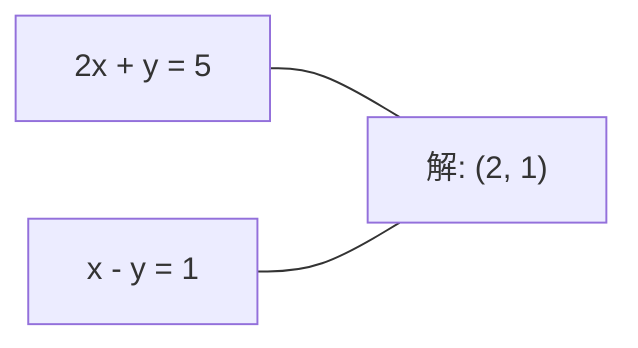
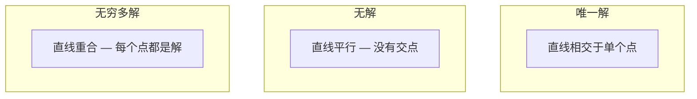

# Hệ thống tuyến tính

> X = b là một trong những vấn đề cổ xưa nhất trong toán học, và nó vẫn đang hoạt động trong mạng thần kinh của bạn.

**Type:** Build
**Language:**Python
**前置要求：**Giai đoạn 1,Dạy 01 (Linear Algebra Intuition),02 (Vectors & Matrices),03 (Matrix Transformations)
**Time:** ~120 minutes

## Học mục tiêu
- 使用带 phân quay và thay thế trở lại của loại bỏ Gaussian 求解 Ax = b
- Sử dụng LU、QR 和 Cholesky phân hủy phân giải Matrix,并 giải thích từng phương pháp thích hợp
- 推导 các phương trình bình thường của các hình vuông nhỏ nhất,并将其与线性回归和脊回归联系起来
- Sử dụng số điều kiện 诊断 hệ thống không điều kiện tốt,并 áp dụng quy định để ổn định

## 问题
Mỗi lần tập về sự lùi ngược tuyến tính, bạn đang tìm cách giải quyết một hệ thống tuyến tính. Mỗi lần tính toán các khối lượng vuông tối thiểu phù hợp, bạn đang tìm cách giải quyết một hệ thống tuyến tính.`y = Wx + b`Khi bạn tham gia vào việc điều chỉnh hệ thống này, bạn đang sửa đổi hệ thống này. Khi bạn sử dụng các quy trình Gaussian, bạn đang phân tích một Matrix. Khi bạn đang tìm kiếm sự ngược lại của matrix tính biến đối với khoảng cách của Mahalanobis, bạn đang tìm kiếm giải pháp cho một hệ thống tuyến tính.

方程 Ax = b 无处不在──A là một số lượng chưa biết được cấu thành một Matrix──b là một số lượng chưa biết được cấu thành một Vector──x là một số lượng chưa biết được bạn muốn tìm thấy trong một vòng quay, A là một số lượng dữ liệu của bạn, b là một số lượng dữ liệu mục tiêu của bạn, x là một số lượng trọng lượng của bạn── toàn bộ mô hình có thể kết luận: tìm thấy x, làm cho Ax 尽可能接近 b──

Bài học này sẽ giải quyết tất cả các phương pháp chính của phương trình này từ không. Bạn sẽ hiểu tại sao một số phương pháp nhanh hơn và một số khác ổn định hơn, tại sao một số phương pháp chỉ áp dụng cho các hệ thống vuông và một số khác có thể xử lý các hệ thống xác định quá cao, cũng như tại sao số điều kiện của Matrix quyết định câu trả lời của bạn có ý nghĩa hay không.

## 概念
### Ax = b trong quan điểm nghĩa là gì

Một hệ thống phương trình tuyến tính 具有几何解释──每个方程式 定义一个超平面──解就是所有超平面 相交的点(或点集)──

```
2x + y = 5          2D 中的两条直线。
x - y  = 1          它们相交于 x=2, y=1。
```



Có thể xảy ra ba tình huống:



Trong hình thức matrix, "một giải pháp" có nghĩa là A là đảo ngược──"Không giải pháp" có nghĩa là hệ thống là không nhất quán──"Các giải pháp vô hạn" có nghĩa là A có không gian không có gì── hầu hết các vấn đề của ML đều thuộc về  không có giải pháp chính xác.

### hình cột vs hình hàng

Có hai cách để hiểu Ax = b:

**Row picture.**Mỗi đường của A xác định một phương trình. Mỗi phương trình là một siêu phẳng.

**Column picture.**Mỗi hàng của A là một vector. Vấn đề biến thành: Sự kết hợp tuyến tính nào của cột của A có thể tạo ra b?

```
A = | 2  1 |    b = | 5 |
    | 1 -1 |        | 1 |

Row picture: 同时求解 2x + y = 5 和 x - y = 1。

Column picture: 找到 x1, x2，使得：
  x1 * [2, 1] + x2 * [1, -1] = [5, 1]
  2 * [2, 1] + 1 * [1, -1] = [4+1, 2-1] = [5, 1]   check.
```

Hình cột 更根本── Nếu b  nằm trong không gian cột của A, hệ thống sẽ có giải pháp── Nếu b không nằm trong đó, bạn sẽ tìm thấy không gian cột giữa các điểm gần nhất của nó── điểm gần nhất này là giải pháp các vuông nhỏ nhất──

### Phục tiêu Gaussian

Phục tháo Gaussian 将 Ax = b 转换为上三角系统 Ux = c, sau đó sử dụng thay thế trở lại 求解──这是最直接的方法──

算法:

```
1. 对每一列 k（pivot column）：
   a. 在第 k 行及其下方，找到 column k 中最大的 entry（partial pivoting）。
   b. 将该行与第 k 行交换。
   c. 对 k 下方的每一行 i：
      - 计算 multiplier m = A[i][k] / A[k][k]
      - 从第 i 行中减去 m 倍的第 k 行。
2. Back substitute：从最后一个 equation 向上求解。
```

Ví dụ:

```
Original:
| 2  1  1 | 8 |       R2 = R2 - (2)R1     | 2  1   1 |  8 |
| 4  3  3 |20 |  -->  R3 = R3 - (1)R1 --> | 0  1   1 |  4 |
| 2  3  1 |12 |                            | 0  2   0 |  4 |

                       R3 = R3 - (2)R2     | 2  1   1 |  8 |
                                       --> | 0  1   1 |  4 |
                                           | 0  0  -2 | -4 |

Back substitute:
  -2 * x3 = -4    -->  x3 = 2
  x2 + 2  = 4     -->  x2 = 2
  2*x1 + 2 + 2 = 8 --> x1 = 2
```

Chi phí tính toán của việc loại bỏ Gaussian là O(n^3)。 Đối với hệ thống 1000x1000, đó là khoảng hàng tỷ lần hoạt động điểm nổi── nó rất nhanh, nhưng nếu bạn cần sử dụng cùng một hệ thống, bạn cũng có thể làm tốt hơn──

### Phòng xoay một phần: vì sao quan trọng

Không xoay, loại bỏ Gaussian có thể thất bại hoặc tạo ra kết quả rác. Nếu yếu tố xoay là 0, bạn sẽ được tách ra thành 0.

```
Bad pivot:                       With partial pivoting:
| 0.001  1 | 1.001 |            先交换行：
| 1      1 | 2     |            | 1      1 | 2     |
                                 | 0.001  1 | 1.001 |
m = 1/0.001 = 1000              m = 0.001/1 = 0.001
R2 = R2 - 1000*R1               R2 = R2 - 0.001*R1
| 0.001  1     | 1.001   |      | 1      1     | 2     |
| 0     -999   | -999.0  |      | 0      0.999 | 0.999 |

x2 = 1.000（正确）              x2 = 1.000（正确）
x1 = (1.001 - 1)/0.001          x1 = (2 - 1)/1 = 1.000（正确）
   = 0.001/0.001 = 1.000        稳定，因为 multiplier 很小。
```

Trong toán học điểm nổi hạn chế trong độ chính xác, phiên bản chưa xoay có thể mất đi các con số đáng kể.

### LU phân hủy

LU phân hủy sẽ phân giải A thành các số nhân trong số các số nhân trong số các số nhân trong số các số nhân trong số các số nhân trong số các số nhân trong số các số số nhân trong số các số số số nhân trong số các số số số số số 3 là các số nhân trong số các số số số số số 3 là các số nhân trong số các số số số số số số 3 là các số nhân trong số các số số số số số số số số 3 là các số nhân trong số các số số số số số số số số số 3 và số số số số số số số số số số 3 là các số số số số số số số số số số số số 3 là các số số số số số số số số số số số số số 3 và số số số số số số số số số số số số số số số số số số số số số số số số số số số số số số số số số số số số số số số số số số số số số số số số số số số số số số số số số số số số số số số số số số số số số số số số số số số số số số số số số số số số số số số số số số số số số số số số số số số số số số số số số số số số số số số số số số số số số số trong số số số số số số số số số số các số số số số số số số số số số số số số số số số số số này là các số số số số số số số số số số số số số số số số số số số số số số số số số số số số số số số số số số trong số số các trong số số số số các số số số số số các số số số số số các trong số các số số này.

```
A = L @ U

| 2  1  1 |   | 1  0  0 |   | 2  1   1 |
| 4  3  3 | = | 2  1  0 | @ | 0  1   1 |
| 2  3  1 |   | 1  2  1 |   | 0  0  -2 |
```

Tại sao phải là yếu tố thay vì loại bỏ trực tiếp? Vì một khi có L và U, đối với bất kỳ b mới 求 giải Ax = b chỉ cần O(n^2):

```
Ax = b
LUx = b
令 y = Ux:
  Ly = b    (forward substitution, O(n^2))
  Ux = y    (back substitution, O(n^2))
```

O(n^3) của chi phí chỉ trong việc tính toán 时支付一次──之后每次解决 都是 O(n^2)── nếu bạn cần sử dụng cùng một A、 khác nhau b vector 求解 1000 系统,LU让总工作量节省 会会约1000/3 倍──

Sử dụng xoay một phần, bạn nhận được PA = LU, trong đó P là ghi lại các matrix chuyển đổi của các dòng swap.

### Sự phân hủy QR

QR phân hủy sẽ chia A thành matrix chữ nhật Q và matrix tam giác trên R:A = QR。

Matrix trực giác 具有 Q^T Q = I 的性质──它的列是异常向量──乘以 Q 会保持长和角──

```
A = Q @ R

Q has orthonormal columns: Q^T Q = I
R is upper triangular

To solve Ax = b:
  QRx = b
  Rx = Q^T b    (只需乘以 Q^T，不需要 inversion)
  Back substitute to get x.
```

Trong tìm kiếm giải quyết các vấn đề bình phương nhỏ nhất, QR so với LU trong sự ổn định số trên tốt hơn.

```
Given columns a1, a2, ... of A:

q1 = a1 / ||a1||

q2 = a2 - (a2 . q1) * q1        (减去到 q1 上的 projection)
q2 = q2 / ||q2||                (normalize)

q3 = a3 - (a3 . q1) * q1 - (a3 . q2) * q2
q3 = q3 / ||q3||

R[i][j] = qi . aj    for i <= j
```

Mỗi bước sẽ di chuyển dọc theo tất cả các thành phần của các vector q trước đây, chỉ để lại hướng thẳng đứng mới.

### Sự phân hủy của Cholesky

Khi A là đối xứng (A = A^T) và tích cực xác định (All eigenvalues are for correct) thì bạn có thể phân giải nó thành A = L^T, trong đó L là hình ba thấp hơn.

```
A = L @ L^T

| 4  2 |   | 2  0 |   | 2  1 |
| 2  5 | = | 1  2 | @ | 0  2 |

L[i][i] = sqrt(A[i][i] - sum(L[i][k]^2 for k < i))
L[i][j] = (A[i][j] - sum(L[i][k]*L[j][k] for k < j)) / L[j][j]    for i > j
```

Cholesky gấp đôi LU, và chỉ cần một nửa không gian lưu trữ. Nó chỉ áp dụng cho các matrix tích cực đối xứng, nhưng loại Matrix này thường xuất hiện:

- Các matrices có tính tính biến đổi là một định nghĩa tích cực đối xứng (via regularization 可变为 một định nghĩa tích cực)
- Các quy trình Gaussian trung tâm của các khối lõi là đối xứng tích cực xác định.
- Hessian là hàm hình dạng đối xứng tích cực xác định.
- A^T A 总是 đối xứng tích cực bán xác định.

Trong các quá trình Gaussian, bạn sử dụng Cholesky phân giải các khối lượng hạt nhân K, sau đó tìm giải pháp K alpha = y để có được một ý nghĩa dự đoán. Cholesky factor cũng sẽ cung cấp log-determinant của xác suất biên: log det(K) = 2 * tổng hợp

### Các vuông thấp nhất:当 Ax = b 没有精确解时

Nếu A là m x n 且 m > n(tương đương 多于未知), hệ thống là quá xác định.

```
minimize ||Ax - b||^2

这是 squared residuals 的总和：
  sum((A[i,:] @ x - b[i])^2 for i in range(m))
```

Tối thiểu 满足 các phương trình bình thường:

```
A^T A x = A^T b
```

推导:展开A 求 Gradient,并令其为零:2 A  A x - 2 A  T b = 0

```
Original system (overdetermined, 4 equations, 2 unknowns):
| 1  1 |         | 3 |
| 1  2 | x     = | 5 |       没有精确的 x 能满足全部 4 个 equations。
| 1  3 |         | 6 |
| 1  4 |         | 8 |

Normal equations:
A^T A = | 4  10 |    A^T b = | 22 |
        | 10 30 |            | 63 |

Solve: x = [1.5, 1.7]

这就是 linear regression。x[0] 是 intercept，x[1] 是 slope。
```

### Các phương trình bình thường = sự lùi lại tuyến tính

Trong sự lùi lại tuyến tính, các dữ liệu tử liệu X Mỗi dòng đối ứng với một mẫu, mỗi hàng đối ứng với một tính năng y Mỗi mục nhập đối ứng với một mẫu y đối ứng với một vektor trọng lượng w 满足:

```
X^T X w = X^T y
w = (X^T X)^(-1) X^T y
```

Đây là giải pháp hình thức đóng của sự lùi đường thẳng.`sklearn.linear_model.LinearRegression.fit()`Thành phố tính toán kết quả này (hoặc qua QR hoặc SVD tính toán kết quả tương đương giá)

Kế hoạch định định nghĩa lambda * I, bạn đã nhận được sự lùi lại của dãy:

```
(X^T X + lambda * I) w = X^T y
w = (X^T X + lambda * I)^(-1) X^T y
```

Việc điều chỉnh sẽ làm cho điều kiện của matrix trở nên tốt hơn (đơn giản hơn để xác định ngược), và thông qua các trọng lượng hướng đến zero để ngăn chặn quá phù hợp.

### Phép đảo ngược (Moore-Penrose)

Pseudoinverse A+ sẽ đảo ngược matrix 推广到非平方 和单数矩阵── đối với bất kỳ Matrix A nào:

```
x = A+ b

where A+ = V Sigma+ U^T    (computed via SVD)
```

Sigma+ 通过对每个非零单数值 取相互并转置结果构成──如果A = U Sigma V^T,则A+ = V Sigma+ U^T──

```
A = U Sigma V^T        (SVD)

Sigma = | 5  0 |       Sigma+ = | 1/5  0  0 |
        | 0  2 |                | 0  1/2  0 |
        | 0  0 |

A+ = V Sigma+ U^T
```

Phép đảo  đưa ra giải pháp bình thường tối thiểu của các bình thường nhỏ nhất. Nếu hệ thống có:
- 唯一解:A+ b 给出该解――
- 无解:A+ b 给出最小平方的解决方案──
- Không có gì hết: A+ b 给出 解 解 解 解 解 解 解 解 解 解 解 解 解 解 解 解 解 解 解 解 解 解 解 解 解 解 解 解 解 解 解 解 解 解 解 解 解 解 解 解 解 解 解 解 解 解 解 解 解 解 解 解 解 解 解 解 解 解 解 解 解 解 解 解 解 解 解 解 解 解 解 解 解 解 解 解 解 解 解 解 解 解 解 解 解 解 解 解 解 解 解 解 解 解 解 解 解 解 解 解 解 解 解 解 解 解 解 解 解 解 解 解 解 解 解 解 解 解 解 解 解 解 解 解 解 解 解 解 解 解 解 解 解 解 解 解 解 解 解 解 解 解 解 解 解 解 解 解 解 解                                                                                                                                                                                                       

NumPy của `np.linalg.lstsq`和 `np.linalg.pinv`内部都使用 SVD。

### Số điều kiện

Số điều kiện  đo giải pháp đối với những thay đổi nhỏ của đầu vào có nhiều nhạy cảm. Đối với Matrix A, số điều kiện là:

```
kappa(A) = ||A|| * ||A^(-1)|| = sigma_max / sigma_min
```

Trong đó, sigma_max 和 sigma_min 分别是最大和最小单数值──

```
Well-conditioned (kappa ~ 1):        Ill-conditioned (kappa ~ 10^15):
b 中的小变化 -->                    b 中的小变化 -->
x 中的小变化                         x 中的巨大变化

| 2  0 |   kappa = 2/1 = 2          | 1   1          |   kappa ~ 10^15
| 0  1 |   safe to solve            | 1   1+10^(-15) |   solution is garbage
```

经验法则:
- Kappa < 100: 安全, giải pháp 准确。
- - KAPPA ~ 10K: Bạn大约会 từ toán học điểm nổi 中损失 k 位精度
- kappa ~ 10^16( đối với float64):solution 没有意义──矩阵 实际上是单一──

Trong ML, điều kiện xấu xảy ra trong các tính năng 几乎 đối tuyến 时――Regularization(添加 lambda * I) sẽ có số điều kiện từ sigma_max / sigma_min 改善为 (sigma_max + lambda) / (sigma_min + lambda)。

### Phương pháp lặp lại:tốc độ kết hợp

Đối với các hệ thống rất lớn và hiếm, có hàng triệu người không biết, LU hoặc Cholesky như phương pháp trực tiếp, thành phần quá cao.

Tốc độ kết hợp (CG) ở A là tích cực đối xứng xác định 时求解 Ax = b。 nó trong toán học chính xác trong số nhiều nhất n lần tìm thấy giải thích chính xác, nhưng nếu các giá trị riêng của A 聚集, thường sẽ nhanh hơn收──

```
Algorithm sketch:
  x0 = initial guess (often zero)
  r0 = b - A x0           (residual)
  p0 = r0                 (search direction)

  For k = 0, 1, 2, ...:
    alpha = (rk . rk) / (pk . A pk)
    x_{k+1} = xk + alpha * pk
    r_{k+1} = rk - alpha * A pk
    beta = (r_{k+1} . r_{k+1}) / (rk . rk)
    p_{k+1} = r_{k+1} + beta * pk
    if ||r_{k+1}|| < tolerance: stop
```

CG dùng:
- Phương pháp tối ưu hóa quy mô lớn (Newton-CG)
- 求解 PDE phân biệt
- Các phương pháp hạt nhân, trong đó các matrix hạt nhân quá lớn không thể nhân tố
- 作为其他反复解决器的预定

Tỷ lệ hội tụ phụ thuộc vào số điều kiện. Điều kiện tốt hơn hệ thống nhanh hơn, đó cũng là một lý do khác của sự điều chỉnh có ích.

### Hình ảnh đầy đủ:何时使用哪种方法

| Method | Requirements | Cost | Use case |
|--------|-------------|------|----------|
| Gaussian elimination | Square, nonsingular A | O(n^3) | 对 square system 的一次性求解 |
| LU decomposition | Square, nonsingular A | O(n^3) factor + O(n^2) solve | 使用相同 A 的多次求解 |
| QR decomposition | Any A (m >= n) | O(mn^2) | Least squares，numerically stable |
| Cholesky | Symmetric positive definite A | O(n^3/3) | Covariance matrices，Gaussian processes，ridge regression |
| Normal equations | Overdetermined (m > n) | O(mn^2 + n^3) | Linear regression（小 n） |
| SVD / pseudoinverse | Any A | O(mn^2) | Rank-deficient systems，minimum-norm solutions |
| Conjugate gradient | Symmetric positive definite, sparse A | O(n * k * nnz) | Large sparse systems，k = iterations |

### Kết nối với ML

Mỗi phương pháp trong bài học này sẽ xuất hiện trong lớp ML sản xuất:

**Linear regression.**Giải pháp hình thức đóng 求解 bình thường phương trình X^T X w = X^T y。This có thể qua Cholesky(nếu n 很小)、QR(nếu ổn định số  rất quan trọng) hoặc SVD(nếu Matrix có thể không có cấp độ) hoàn thành。

**Ridge regression.**向 X^T X 添加 lambda * I。 Hệ thống được điều chỉnh (X^T X + lambda * I) w = X^T y 总是可以通过Cholesky 求解,因为当 lambda > 0 时,X^T X + lambda * I 是对称正确的──

**Gaussian processes.**Tỷ lệ dự đoán 需要求解 K alpha = y, trong đó K là khối lượng tử liệu hạt nhân。对 K做 Cholesky factorization 是标准方法。Log marginal probability 使用 log det(K) = 2 sum(log(diag(L)))。

**Neural network initialization.**Quá trình khởi tạo trực giác Sử dụng phân hủy QR tạo cột để tạo các trền trọng lượng hoặc thông thường. Điều này có thể ngăn chặn sự sụp đổ tín hiệu trong mạng sâu.

**Preconditioning.**Các chất tối ưu hóa quy mô lớn sử dụng không đầy đủ Cholesky hoặc không đầy đủ LU 作为结合梯度溶剂的预先条件──

**Feature engineering.**X^T X của số điều kiện  nói cho bạn các tính năng có phải là hàng tuyến tính không. Nếu kappa  rất lớn, xóa các tính năng hoặc thêm quy định.


```figure
linear-system-conditioning
```

##  xây dựng nó
### 步骤 1: loại bỏ Gaussian với xoay một phần

```python
import numpy as np

def gaussian_elimination(A, b):
    n = len(b)
    Ab = np.hstack([A.astype(float), b.reshape(-1, 1).astype(float)])

    for k in range(n):
        max_row = k + np.argmax(np.abs(Ab[k:, k]))
        Ab[[k, max_row]] = Ab[[max_row, k]]

        if abs(Ab[k, k]) < 1e-12:
            raise ValueError(f"Matrix is singular or nearly singular at pivot {k}")

        for i in range(k + 1, n):
            m = Ab[i, k] / Ab[k, k]
            Ab[i, k:] -= m * Ab[k, k:]

    x = np.zeros(n)
    for i in range(n - 1, -1, -1):
        x[i] = (Ab[i, -1] - Ab[i, i+1:n] @ x[i+1:n]) / Ab[i, i]

    return x
```

### 步骤 2: LU phân hủy

```python
def lu_decompose(A):
    n = A.shape[0]
    L = np.eye(n)
    U = A.astype(float).copy()
    P = np.eye(n)

    for k in range(n):
        max_row = k + np.argmax(np.abs(U[k:, k]))
        if max_row != k:
            U[[k, max_row]] = U[[max_row, k]]
            P[[k, max_row]] = P[[max_row, k]]
            if k > 0:
                L[[k, max_row], :k] = L[[max_row, k], :k]

        for i in range(k + 1, n):
            L[i, k] = U[i, k] / U[k, k]
            U[i, k:] -= L[i, k] * U[k, k:]

    return P, L, U

def lu_solve(P, L, U, b):
    n = len(b)
    Pb = P @ b.astype(float)

    y = np.zeros(n)
    for i in range(n):
        y[i] = Pb[i] - L[i, :i] @ y[:i]

    x = np.zeros(n)
    for i in range(n - 1, -1, -1):
        x[i] = (y[i] - U[i, i+1:] @ x[i+1:]) / U[i, i]

    return x
```

### 步骤 3: Sự phân hủy của Cholesky

```python
def cholesky(A):
    n = A.shape[0]
    L = np.zeros_like(A, dtype=float)

    for i in range(n):
        for j in range(i + 1):
            s = A[i, j] - L[i, :j] @ L[j, :j]
            if i == j:
                if s <= 0:
                    raise ValueError("Matrix is not positive definite")
                L[i, j] = np.sqrt(s)
            else:
                L[i, j] = s / L[j, j]

    return L
```

### 步骤 4: Các hình vuông tối thiểu thông qua các phương trình bình thường

```python
def least_squares_normal(A, b):
    AtA = A.T @ A
    Atb = A.T @ b
    return gaussian_elimination(AtA, Atb)

def ridge_regression(A, b, lam):
    n = A.shape[1]
    AtA = A.T @ A + lam * np.eye(n)
    Atb = A.T @ b
    L = cholesky(AtA)
    y = np.zeros(n)
    for i in range(n):
        y[i] = (Atb[i] - L[i, :i] @ y[:i]) / L[i, i]
    x = np.zeros(n)
    for i in range(n - 1, -1, -1):
        x[i] = (y[i] - L.T[i, i+1:] @ x[i+1:]) / L.T[i, i]
    return x
```

### 步骤 5: Số điều kiện

```python
def condition_number(A):
    U, S, Vt = np.linalg.svd(A)
    return S[0] / S[-1]
```

## Sử dụng nó
Để kết hợp các phần này, thực hiện sự quay lại tuyến tính và quay lại sườn trên dữ liệu thực:

```python
np.random.seed(42)
X_raw = np.random.randn(100, 3)
w_true = np.array([2.0, -1.0, 0.5])
y = X_raw @ w_true + np.random.randn(100) * 0.1

X = np.column_stack([np.ones(100), X_raw])

w_ols = least_squares_normal(X, y)
print(f"OLS weights (ours):    {w_ols}")

w_np = np.linalg.lstsq(X, y, rcond=None)[0]
print(f"OLS weights (numpy):   {w_np}")
print(f"Max difference: {np.max(np.abs(w_ols - w_np)):.2e}")

w_ridge = ridge_regression(X, y, lam=1.0)
print(f"Ridge weights (ours):  {w_ridge}")

from sklearn.linear_model import Ridge
ridge_sk = Ridge(alpha=1.0, fit_intercept=False)
ridge_sk.fit(X, y)
print(f"Ridge weights (sklearn): {ridge_sk.coef_}")
```

## 交付 nó
本课产 出:
- `code/linear_systems.py`, bao gồm từ zero thực hiện loại bỏ Gaussian, LU phân hủy, cholesky phân hủy, các vuông thấp nhất và quay lại sườn
- Một biểu diễn có thể vận hành, hiển thị các phương trình bình thường và Kỷ lệ Lịch Regression của sklearn  tạo ra cùng trọng lượng

## 练习
1. Sử dụng loại bỏ Gaussian của bạn, LU giải pháp của bạn và`np.linalg.solve`求解 hệ thống `[[1,2,3],[4,5,6],[7,8,10]] x = [6, 15, 27]`❖ ❖ ❖ ❖ ❖ ❖ ❖ ❖ ❖ ❖ ❖ ❖ ❖ ❖ ❖ ❖ ❖ ❖ ❖ ❖ ❖ ❖ ❖ ❖ ❖ ❖ ❖ ❖ ❖ ❖ ❖ ❖ ❖ ❖ ❖ ❖ ❖ ❖ ❖ ❖ ❖ ❖ ❖ ❖ ❖ ❖ ❖ ❖ ❖ ❖ ❖ ❖ ❖ ❖ ❖ ❖ ❖ ❖ ❖ ❖ ❖ ❖ ❖ ❖ ❖ ❖ ❖ ❖ ❖ ❖ ❖ ❖ ❖ ❖ ❖ ❖ ❖ ❖ ❖ ❖ ❖ ❖ ❖ ❖ ❖ ❖ ❖ ❖ ❖ ❖ ❖ ❖ ❖ ❖ ❖ ❖ ❖ ❖ ❖ ❖ ❖ ❖ ❖ ❖ ❖ ❖ ❖ ❖ ❖ ❖ ❖ ❖ ❖ ❖ ❖ ❖ ❖ ❖ ❖ ❖ ❖ ❖ ❖ ❖ ❖ ❖ ❖ ❖ ❖ ❖ ❖ ❖ ❖ ❖ ❖ ❖ ❖ ❖ ❖ ❖ ❖ ❖ ❖ ❖ ❖ ❖ ❖ ❖ ❖ ❖ ❖ ❖ ❖ ❖ ❖ ❖ ❖ ❖ ❖ ❖ ❖ ❖ ❖ ❖ ❖ ❖ ❖ ❖ ❖ ❖ ❖ ❖ ❖ ❖ ❖ ❖ ❖ ❖ ❖ ❖ ❖ ❖ ❖ ❖ ❖ ❖ ❖ ❖ ❖ ❖ ❖ ❖ ❖ ❖ ❖ ❖ ❖ ❖ ❖ ❖ ❖ ❖ ❖ ❖ ❖ ❖ ❖ ❖ ❖ ❖ ❖ ❖ ❖ ❖ ❖

2. 生成一个50x5 随机矩阵 X 和 mục tiêu y = X @ w_true + noise──分别使用正常方程、QR(通过 `np.linalg.qr`(SVD)`np.linalg.svd`) và `np.linalg.lstsq`求解 w―比较四个解决方案──测量 X^T X 的条件数,并解释它如何影响你信任哪种方法──

3. 通过让两列几乎相同来创建一个几乎单一矩阵 (例如,列 2 =列 1 + 1e-10 *噪音) ⋅计算它的条件数――分别在有规范化和无规范化的情况下求解 Ax = b(添加 0.01 * I) ⋅ So sánh giải pháp 和残留物──解释为什么规范化有帮助──

4. Để một 100x100 ngẫu nhiên đối xứng tích cực xác định trật tự 实现 conjugate gradient algorithm。统计它收到宽容 1e-8 需要多少次反复──与n反复的理论最大值进行比较──

5. Trong một số lớn là 10, 50, 200, 500 của các matrices tích cực xác định đối xứng trên, đối với các giải pháp Cholesky của bạn, LU của bạn và`np.linalg.solve`计时――绘制结果――验证 Cholesky 大约比 LU 快 2倍――

## 关键术语
| Term | What people say | What it actually means |
|------|----------------|----------------------|
| Linear system | "Solve for x" | 一组 linear equations Ax = b。找到 x 意味着找到在 transformation A 下产生 output b 的 input。 |
| Gaussian elimination | "Row reduce" | 使用 row operations 系统性地将 diagonal 下方的 entries 置零，产生可通过 back substitution 求解的 upper triangular system。O(n^3)。 |
| Partial pivoting | "Swap rows for stability" | 在 column k 中进行 elimination 前，将该 column 中 absolute value 最大的行交换到 pivot 位置。防止除以很小的数。 |
| LU decomposition | "Factor into triangles" | 写成 A = LU，其中 L 是 lower triangular（存储 multipliers），U 是 upper triangular（eliminated matrix）。将 O(n^3) 成本摊销到多次求解中。 |
| QR decomposition | "Orthogonal factorization" | 写成 A = QR，其中 Q 的 columns 是 orthonormal，R 是 upper triangular。对于 least squares，比 LU 更稳定。 |
| Cholesky decomposition | "Square root of a matrix" | 对 symmetric positive definite A，写成 A = LL^T。成本是 LU 的一半。用于 covariance matrices、kernel matrices 和 ridge regression。 |
| Least squares | "Best fit when exact is impossible" | 当 system overdetermined（equations 多于 unknowns）时，最小化 squared residuals 的总和 ||Ax - b||^2。 |
| Normal equations | "The calculus shortcut" | A^T A x = A^T b。将 ||Ax - b||^2 的 Gradient 设为零。这就是 linear regression 的 closed-form solution。 |
| Pseudoinverse | "Inversion for non-square matrices" | A+ = V Sigma+ U^T via SVD。对于任意 Matrix，无论 square 或 rectangular、singular 与否，给出 minimum-norm least-squares solution。 |
| Condition number | "How trustworthy is this answer" | kappa = sigma_max / sigma_min。衡量对 input perturbations 的敏感性。大约损失 log10(kappa) 位精度。 |
| Ridge regression | "Regularized least squares" | 求解 (X^T X + lambda I) w = X^T y。添加 lambda I 改善 conditioning，并将 weights 向零收缩。防止 overfitting。 |
| Conjugate gradient | "Iterative Ax=b for big matrices" | 用于 symmetric positive definite systems 的 iterative solver。最多 n 步收敛。适合 factorization 成本过高的大型 sparse systems。 |
| Overdetermined system | "More data than parameters" | 在 m-by-n system 中 m > n。不存在精确解。Least squares 找到最佳近似。这就是每个 regression problem。 |
| Back substitution | "Solve from the bottom up" | 给定 upper triangular system，先求解最后一个 equation，然后向后 substitute。O(n^2)。 |
| Forward substitution | "Solve from the top down" | 给定 lower triangular system，先求解第一个 equation，然后向前 substitute。O(n^2)。用于 LU solves 中的 L step。 |

## 延伸阅读
- [MIT 18.06: Linear Algebra](https://ocw.mit.edu/courses/18-06-linear-algebra-spring-2010/)(Gilbert Strang) --   Về hệ thống tuyến tính và các hệ số tử liệu
- [Numerical Linear Algebra](https://people.maths.ox.ac.uk/trefethen/text.html)(Trefethen & Bau) -- hiểu sự ổn định số, điều kiện và thuật toán vì sao thất bại tiêu chuẩn tham khảo
- [Matrix Computations](https://www.cs.cornell.edu/cv/GolubVanLoan4/golubandvanloan.htm)(Golub & Van Loan) -- 涵盖 các loại thuật toán tử liệu
- [3Blue1Brown: Inverse Matrices](https://www.3blue1brown.com/lessons/inverse-matrices)-- đối với việc giải quyết Ax = b 几何意义的可视化直觉
