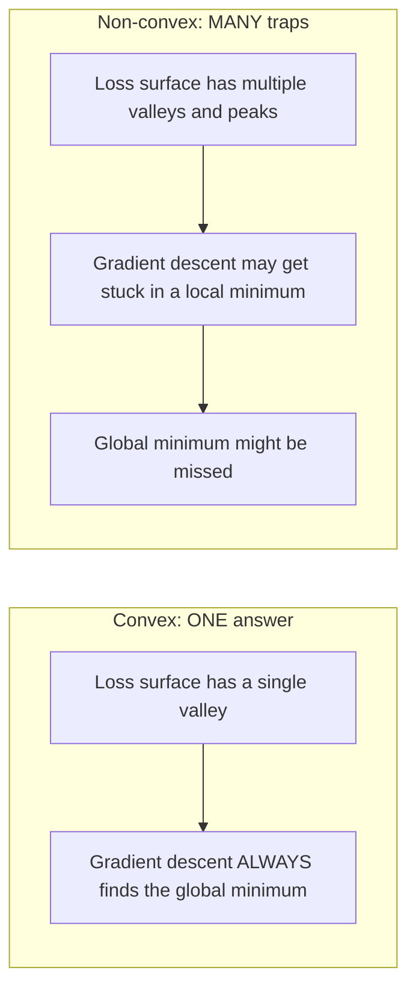
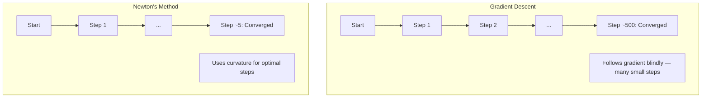
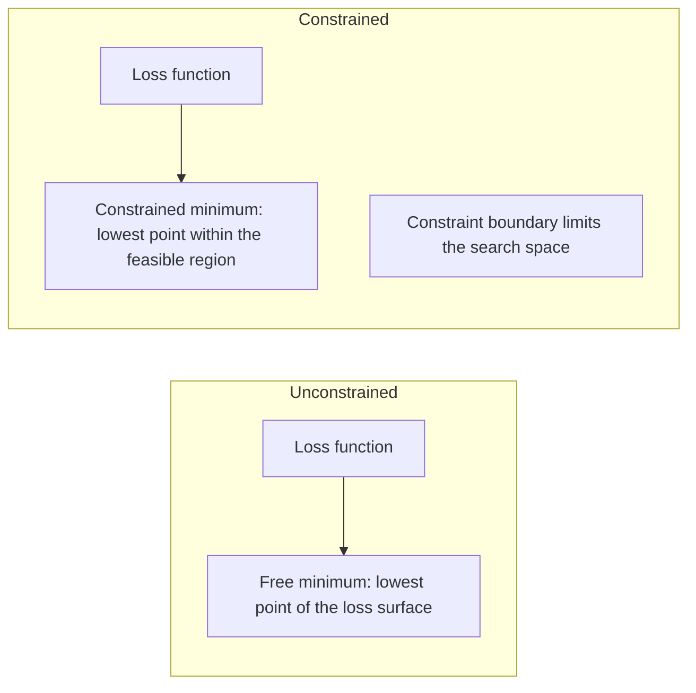
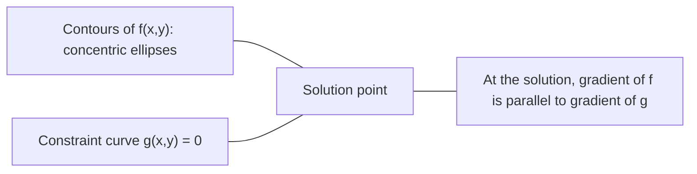

# 凸优化

> 凸问题 chỉ có một cục cốt lõi. 网络神经网络有数百万.

**类型：**构建
**语言：**Python
**前置要求：**Giai đoạn 1, Bài học 04 ((Làm toán cho ML) 、08 ((Tích cực)
**时间：**约90分钟

## Học mục tiêu

- Sử dụng định nghĩa、二阶导数和 Hessian 判据测试 một hàm có phải là hàm凸
- Thực hiện phương pháp của Newton,并将其二次收速度与渐进下降
- Sử dụng nhân nhân Lagrange  tìm giải pháp cho vấn đề tối ưu hóa của ràng buộc,并 giải thích các điều kiện KKT
- 解释 tại sao mạng thần kinh mất cảnh là không rõ ràng, nhưng SGD  vẫn có thể tìm ra một giải pháp tốt

## 问题

Bài học 08 dạy bạn Gradient Descent,momentum 和 Adam。 Những Optimizer này có thể di chuyển ở bất kỳ bề mặt trên và xuống── nhưng chúng không đảm bảo── Gradient Descent ở một cảnh quan không hình dạng lên có thể rơi vào giá trị tối thiểu địa phương tồi tệ,卡 ở điểm lăn, hoặc mãi mãi振荡── bạn vẫn sử dụng nó, bởi vì mạng thần kinh là không hình dạng, và không có giải pháp thay thế──

Nhưng nhiều vấn đề trong ML là凸的── tuyến tính hồi quy, hậu môn hồi quy, SVMs, LASSO, hồi quy quy. Đối với những vấn đề này, có những công cụ mạnh hơn:带有数学保证的优化──凸的问题 chỉ có một đáy.

Nhận thức về sự凸显 có ba điểm giá trị. Thứ nhất, nó cho bạn biết vấn đề khi nào là đơn giản, khi nào là khó khăn. Thứ hai, nó cung cấp các công cụ nhanh hơn cho vấn đề凸显, chẳng hạn như phương pháp Newton. Thứ ba, nó giải thích khái niệm xuất hiện lặp đi lặp lại trong ML: quy định hóa như một sự ràng buộc, sự hai chiều giữa các SVM, và tại sao Deep Learning vẫn có thể làm việc trong chất lượng tốt của mọi thứ mà phản ánh sự凸显.

## 概念

### 凸集

Nếu đối với tập hợp S trong bất kỳ hai điểm, các đường giữa chúng cũng hoàn toàn nằm trong S, thì tập hợp S là tập hợp凸.

| 凸集 | 非凸 |
|---|---|
| **矩形**：内部任意两点都可以用一条仍在内部的线段连接 | **星形/月牙形**：两个内部点之间的线段可能穿过集合外部 |
| **三角形**：对所有内部点都满足相同性质 | **甜甜圈/环形**：中间的孔意味着某些线段会离开集合 |
| 任意两点之间的线段都留在集合内 | 某些点对之间的线段会离开集合 |

形式化测试: Đối với S 中任意点 x、y, cũng như任意 t trong [0, 1],点 tx + (1-t) y 也在 S 中。

凸集 ví dụ:
- Một đường thẳng, một đường bằng, toàn bộ R^n
- Một quả bóng (圆、球体、超球)
- Một nửa không gian: {x: a^T x <= b}
- giao dịch của bất kỳ số lượng con số

Ví dụ không nổi:
- Một vòng tròn
- 2 tập hợp không giao tiếp
- Bất kỳ tập hợp nào có những bẫy hay lỗ hổng

### 凸函数

Nếu hàm f của định nghĩa miền là tập hợp, và đối với bất kỳ hai điểm x、y trong định nghĩa miền của nó, cũng như bất kỳ t trong [0, 1]:

```
f(tx + (1-t)y) <= t*f(x) + (1-t)*f(y)
```

几何上看: đường giữa hai điểm trên hình ảnh nằm trên hình ảnh hoặc trên hình ảnh.

| 属性 | 凸函数 | 非凸函数 |
|---|---|---|
| **线段测试** | 图像上任意两点之间的线段位于曲线**之上或之上** | 图像上某些点之间的线段会下探到曲线**之下** |
| **形状** | 单个向上弯曲的碗/谷底 | 多个峰和谷，曲率混合 |
| **局部最小值** | 每个局部最小值都是全局最小值 | 可能存在多个高度不同的局部最小值 |

常见凸函数:
- f(x) = x^2(抛物线)
- F(x) =) ✓x là giá trị tuyệt đối
- F(x) = e^x(指数)
- F(x) = max(0, x)(ReLU, mặc dù là phân đoạn线性)
- f(x) = -log(x) cho x > 0(负对数)
- 任意线性函数 f(x) = a^T x + b(既凸又)

### 测试凸性

Ba bài kiểm tra thực tế, từ dễ nhất đến nghiêm ngặt nhất.

**测试 1：二阶导数测试（1D）。**Nếu đối với tất cả các x đều có f'(x) >= 0, thì f là hàm凸──

- F(x) = x^2:f'(x) = 2 >= 0。凸。
- f(x) = x^3:f'(x) = 6x。x < 0 时为负──非凸──
- F(x) = e^x:f'(x) = e^x > 0。凸。

**测试 2：Hessian 测试（多变量）。**Nếu Hessian Matrix H(x) đối với tất cả x đều là một hàm bán xác định tích cực, thì f là hàm凸──Hessian là một matrix có cấu thành các hàm định vị thứ hai──

**测试 3：定义测试。**直接检查不等式 f(tx + (1-t) y) <= t*f(x) + (1-t) *f(y)。适用于导数难以计算的函数。

### Tại sao quan trọng

Các quy định cơ bản của việc làm tốt:

**对于凸函数，每个局部最小值都是全局最小值。**

Điều này có nghĩa là sự xuống cấp sẽ không bị mắc kẹt. Bất kỳ đường nào theo chiều dưới đều đi đến cùng một câu trả lời.



Kết quả:
- Không cần phải khởi động lại
- Không cần điều chỉnh tỷ lệ học tập phức tạp
- Có thể chứng minh tính năng (tỷ lệ phụ thuộc vào tính chất hàm)
- 解是唯一的 (除平坦区域外)

### Lượng phụ thuộc vào ML

| 问题 | 凸？ | 原因 |
|---------|---------|-----|
| Linear regression (MSE) | 是 | Loss 关于权重是二次的 |
| Logistic regression | 是 | Log-loss 关于权重是凸的 |
| SVM (hinge loss) | 是 | 线性函数的最大值 |
| LASSO (L1 regression) | 是 | 凸函数之和是凸的 |
| Ridge regression (L2) | 是 | 二次 + 二次 = 凸 |
| Neural Network（任意 Loss） | 否 | 非线性 activations 会产生非凸 landscape |
| k-means clustering | 否 | 离散分配步骤 |
| Matrix factorization | 否 | 未知量的乘积 |

Mô hình tuyến tính của Loss là凸的. Một khi tham gia với các hoạt động không tuyến tính ẩn,凸性 sẽ bị phá hủy.

### Matrix Hessian

函数 f: R^n -> R của Hessian H là bởi n x n Matrix của các thành phần của các thứ hai.

```
H[i][j] = d^2 f / (dx_i dx_j)
```

Đối với f ((x, y) = x^2 + 3xy + y^2:

```
df/dx = 2x + 3y       d^2f/dx^2 = 2      d^2f/dxdy = 3
df/dy = 3x + 2y       d^2f/dydx = 3      d^2f/dy^2 = 2

H = [ 2  3 ]
    [ 3  2 ]
```

Hessian 告诉你曲率信息:
- eigenvalues 全为正: hàm ở mỗi hướng trên tất cả phía trên 曲 (
- Giá trị riêng 全为负: 在每个方向上都向下曲(,局部最大值)
- 符号混合: điểm đạp ((một số hướng lên, một số hướng xuống)
- 零 eigenvalue:该方向上是平坦的(退化)

Đối với con số, Hessian phải ở tất cả các vị trí đều là một nửa xác định tích cực (tất cả các giá trị riêng >= 0), không chỉ ở một điểm nào đó.

### Phương pháp của Newton

Gradient Descent 使用一阶信息(Gradient) ―― phương pháp của Newton 使用二阶信息(Hessian) ・・・ nó ở điểm hiện tại phù hợp với một phương pháp tiếp cận thứ hai, sau đó nhảy thẳng vào giá trị tối thiểu của hàm thứ hai này。

```
Update rule:
  x_new = x - H^(-1) * gradient

Compare to gradient descent:
  x_new = x - lr * gradient
```

Phương pháp Newton sử dụng ngược lại Hessian 替代标量学习率── đây sẽ tùy thuộc vào tỷ lệ độ cong tự động điều chỉnh bước长 và hướng──



优点:
- 接近最小值时二次收(每步误差平方级下降)
- Không cần phải调 học
- 尺度不变 ((无论你如何参数化问题都能工作)

缺点:
- 计算 Hessian 需要 O(n^2) 内存,求逆需要 O(n^3)
- Với mạng thần kinh có trọng lượng 100.000, điều này có nghĩa là 10^12 mục và 10^18 lần hoạt động.
- Không thực tế đối với Deep Learning

### 约束优化

无约束优化: trong tất cả x 上 tối thiểu hóa f(x)。
约束优化: trong约束条件下最小化 f ((x))

现实问题有约束――你想最小化成本,但预算有限――你想最小化错误,但模型复杂度有限――



### Các nhân nhân hạch

Các nhân khẩu độ 方法把束问题转换为无束问题.

问题: trong g(x) = 0 của约束下最小化 f(x)。

解法:引入一个新变量 (Lagrange multiplier lambda),并求解无约束问题:

```
L(x, lambda) = f(x) + lambda * g(x)
```

Trong giải thích, L của Gradient 为零:

```
dL/dx = df/dx + lambda * dg/dx = 0
dL/dlambda = g(x) = 0
```

几何直觉: ở mức giá tối thiểu của khối, f của Gradient 必须与束 g của Gradient 平行. Nếu chúng không bình đẳng, bạn có thể di chuyển dọc theo khối,并进一步降低 f.



Ví dụ: trong x + y = 1 của约束下最小化 f(x,y) = x^2 + y^2。

```
L = x^2 + y^2 + lambda(x + y - 1)

dL/dx = 2x + lambda = 0  =>  x = -lambda/2
dL/dy = 2y + lambda = 0  =>  y = -lambda/2
dL/dlambda = x + y - 1 = 0

From first two: x = y
Substituting: 2x = 1, so x = y = 0.5, lambda = -1
```

Đường thẳng x + y = 1 trên khoảng cách từ điểm gốc gần nhất là (0,5, 0,5)。

### Điều kiện KKT

Các điều kiện Karush-Kuhn-Tucker sẽ mở rộng các nhân Lagrange thành không bằng nhau.

问题: trong g_i(x) <= 0,i = 1, ..., m 的约束下最小化 f(x) 』

Điều kiện KKT:

```
1. Stationarity:    df/dx + sum(lambda_i * dg_i/dx) = 0
2. Primal feasibility:  g_i(x) <= 0  for all i
3. Dual feasibility:    lambda_i >= 0  for all i
4. Complementary slackness:  lambda_i * g_i(x) = 0  for all i
```

Sự chậm chạp bổ sung là một quan trọng quan trọng.

Các điều kiện KKT là trung tâm của SVM. Các vector hỗ trợ là một tập hợp dữ liệu hoạt động.

### Chuẩn bị quy định 作为约束优化

L1 và L2 đều không phải là những kỹ thuật tự nhiên.

**L2 regularization (Ridge)：**

```
minimize  Loss(w)  subject to  ||w||^2 <= t

Equivalent unconstrained form:
minimize  Loss(w) + lambda * ||w||^2
```

约束 约束 约束 约束 约束 约束 约束 约束 约束 约束 约束 约束 约束 约束 约束 约束 约束 约束 约束 约束 约束 约束 约束 约束 约束 约束 约束 约束 约束 约束 约束 约束 约束 约束 约束 约束 约束 约束 约束 约束 约束 约束 约束 约束 约束 约束 约束 约束 约束 约束 约束 约束 约束 约束 约束 约束 约束 约束 约束 约束 约束 约束 约束 约束 约 约 约 约 约 约 约 约 约 约 约 约 约 约 约 约 约 约 约 约 约 约 约 约 约 约 约 约 约 约 约 约 约 约 约 约 约 约 约 约 约 约 约 约 约 约 约 约                                                                                                                                                                                                                              

**L1 regularization (LASSO)：**

```
minimize  Loss(w)  subject to  ||w||_1 <= t

Equivalent unconstrained form:
minimize  Loss(w) + lambda * ||w||_1
```

约束 束 束 束 束 束 束 束 束 束 束 束 束 束 束 束 束 束 束 束 束 束 束 束 束 束 束 束 束 束 束 束 束 束 束 束 束 束 束 束 束 束 束 束 束 束 束 束 束 束 束 束 束 束 束 束 束 束 束 束 束 束 束 束 束 束 束 束 束 束 束 束 束 束 束 束 束 束 束 束 束 束 束 束 束 束 束 束 束 束 束 束 束 束 束 束 束 束 束 束 束 束 束 束 束 束 束 束 束 束 束 束 束 束 束 束 束 束 束 束 束 束 束 束 束 束 束 束 束 束 束 束 束 束 束 束 束 束 束  束 束 束                                                                                                                                                                                                                                

| 属性 | L2 约束（圆） | L1 约束（菱形） |
|---|---|---|
| **约束形状** | 圆（更高维中是球面） | 菱形（2D 中旋转的正方形） |
| **Loss 等高线接触的位置** | 光滑边界：圆上的任意点 | 角点：与某个轴对齐 |
| **解的行为** | 权重较小但非零 | 某些权重恰好为零（稀疏） |
| **结果** | 权重收缩 | 特征选择 |

Điều này giải thích tại sao L1 sẽ tạo ra mô hình hiếm), trong khi L2 chỉ đơn giản là giảm trọng lượng.

### Sự hai chiều

Mỗi vấn đề ưu hóa quy mô (primal) có một vấn đề kèm theo (dual) ⋅ đối với vấn đề凸, prima 和 dual 具有相同的最佳优值──这是强的双性──

Hàm hàm Lagrangian:

```
Primal: minimize f(x) subject to g(x) <= 0
Lagrangian: L(x, lambda) = f(x) + lambda * g(x)
Dual function: d(lambda) = min_x L(x, lambda)
Dual problem: maximize d(lambda) subject to lambda >= 0
```

Tại sao sự hai chiều quan trọng:
- Vấn đề kép đôi khi dễ giải hơn so với nguyên thủy
- SVM bằng hình thức kép 求解, trong đó vấn đề phụ thuộc vào các sản phẩm điểm giữa các điểm dữ liệu (để kích hoạt thủ thuật hạt nhân)
- dual  cung cấp tối ưu nguyên tố của giới dưới, có thể được sử dụng để kiểm tra chất lượng

具体到SVMs:

```
Primal: find w, b that maximize the margin 2/||w|| subject to
        y_i(w^T x_i + b) >= 1 for all i

Dual:   maximize sum(alpha_i) - 0.5 * sum_ij(alpha_i * alpha_j * y_i * y_j * x_i^T x_j)
        subject to alpha_i >= 0 and sum(alpha_i * y_i) = 0

The dual only involves dot products x_i^T x_j.
Replace x_i^T x_j with K(x_i, x_j) to get the kernel trick.
```

### Tại sao Deep Learning vẫn có thể làm việc

Phương pháp mất mát mạng thần kinh 极其非凸. Theo từng tiêu chuẩn cổ điển, tối ưu hóa chúng đều nên thất bại. Tuy nhiên, sự giảm dần stochastic có thể tìm thấy một giải pháp tốt.

**大多数局部最小值已经足够好。**Trong không gian cao, các điểm quan trọng随机 (Gradient 为零的位置) là các điểm saddle, chứ không phải là giá trị tối thiểu địa phương.

**真正的障碍是 saddle points，而不是局部最小值。**Trong một hàm có n 个参数, điểm saddle đồng thời có tỷ lệ độ cong tích cực và tỷ lệ cong tích cực. Đối với các điểm quan trọng bất kỳ ở độ cao, tất cả các giá trị riêng đều có giá trị tối thiểu ở vị trí chính.

**Overparameterization 会平滑 landscape。**Số lượng các tham số nhiều hơn so với các mô hình đào tạo mạng có bề mặt mất mát dễ dàng hơn, kết nối hơn.

**Loss landscape 结构：**

| 属性 | 低维空间 | 高维空间 |
|---|---|---|
| **Landscape** | 许多孤立的峰和谷 | 平滑连通的谷 |
| **最小值** | 许多孤立局部最小值 | 很少有糟糕局部最小值；大多数接近最优 |
| **导航** | 难以找到全局最小值 | 许多路径通向好的解 |
| **Critical points** | 局部最小值和 saddle points 混合 | 压倒性地是 saddle points，而非局部最小值 |

**随机噪声充当隐式 regularization。**SGD mini-batch  giới thiệu tiếng ồn, ngăn chặn rơi vào mức tối thiểu sắc nét.

###  thực tế trong 2 giai đoạn

Phương pháp của Newton đối với mô hình lớn không thực tế.

**L-BFGS (Limited-memory BFGS)：**Sử dụng gần đây m 个 Gradient 差分近似 ngược lại Hessian。 cần O(mn) 内存, thay vì O(n^2)。 áp dụng cho tối đa khoảng 10.000 个参数 câu hỏi。 dùng cho ML cổ điển(logistic regression、CRFs), nhưng không được sử dụng cho Deep Learning。

**Natural gradient：**Sử dụng các thông tin Fisher matrix (đáng kiến về xác suất log Hessian) thay vì tiêu chuẩn Hessian.

**Hessian-free optimization：**Sử dụng gradient kết hợp 求解 Hx = g, không hình thành H. Chỉ cần các sản phẩm vector Hessian, điều này có thể thông qua phân biệt tự động trong O (n) 时间内计算.

**Diagonal approximations：**Khoảnh khắc thứ hai của Adam là Hessian đối với góc đường đối với góc gần. AdaHessian sử dụng các yếu tố đường vạch Hessian thực tế để mở rộng điểm này.

| 方法 | 内存 | 每步成本 | 何时使用 |
|--------|--------|--------------|-------------|
| Gradient Descent | O(n) | O(n) | Baseline，大模型 |
| Newton's method | O(n^2) | O(n^3) | 小型凸问题 |
| L-BFGS | O(mn) | O(mn) | 中型凸问题 |
| Adam | O(n) | O(n) | Deep Learning 默认选择 |
| K-FAC | O(n) | 每层 O(n) | 研究、大 batch training |


```figure
convex-vs-nonconvex
```

##  xây dựng nó

### 步骤 1: Cốp

Xây dựng một hàm, thông qua lấy điểm và kiểm tra định nghĩa để trải nghiệm

```python
import random
import math

def check_convexity(f, dim, bounds=(-5, 5), samples=1000):
    violations = 0
    for _ in range(samples):
        x = [random.uniform(*bounds) for _ in range(dim)]
        y = [random.uniform(*bounds) for _ in range(dim)]
        t = random.uniform(0, 1)
        mid = [t * xi + (1 - t) * yi for xi, yi in zip(x, y)]
        lhs = f(mid)
        rhs = t * f(x) + (1 - t) * f(y)
        if lhs > rhs + 1e-10:
            violations += 1
    return violations == 0, violations
```

### Bước 2: Sử dụng phương pháp 2D của Newton

Sử dụng Hessian hiển nhiên 实现 Newton phương pháp.

```python
def newtons_method(f, grad_f, hessian_f, x0, steps=50, tol=1e-12):
    x = list(x0)
    history = [x[:]]
    for _ in range(steps):
        g = grad_f(x)
        H = hessian_f(x)
        det = H[0][0] * H[1][1] - H[0][1] * H[1][0]
        if abs(det) < 1e-15:
            break
        H_inv = [
            [H[1][1] / det, -H[0][1] / det],
            [-H[1][0] / det, H[0][0] / det],
        ]
        dx = [
            H_inv[0][0] * g[0] + H_inv[0][1] * g[1],
            H_inv[1][0] * g[0] + H_inv[1][1] * g[1],
        ]
        x = [x[0] - dx[0], x[1] - dx[1]]
        history.append(x[:])
        if sum(gi ** 2 for gi in g) < tol:
            break
    return history
```

### 步骤 3:Lagrange nhân 求解器

通过在拉格兰吉上执行 Gradient Descent 来求解约束优化。

```python
def lagrange_solve(f_grad, g_val, g_grad, x0, lr=0.01,
                   lr_lambda=0.01, steps=5000):
    x = list(x0)
    lam = 0.0
    history = []
    for _ in range(steps):
        fg = f_grad(x)
        gv = g_val(x)
        gg = g_grad(x)
        x = [
            xi - lr * (fgi + lam * ggi)
            for xi, fgi, ggi in zip(x, fg, gg)
        ]
        lam = lam + lr_lambda * gv
        history.append((x[:], lam, gv))
    return history
```

### 步骤 4: So sánh giai đoạn 1 với giai đoạn 2

Trong cùng một hàm thứ hai, vận hành theo phương pháp Gradient Descent và Newton.

```python
def quadratic(x):
    return 5 * x[0] ** 2 + x[1] ** 2

def quadratic_grad(x):
    return [10 * x[0], 2 * x[1]]

def quadratic_hessian(x):
    return [[10, 0], [0, 2]]
```

Phương pháp của Newton sẽ được nhận trong 1 bước. Nó sẽ cần đến một trăm bước, vì giá trị riêng của Hessian tương đương 5 lần, tạo thành một thung lũng dài.

## Sử dụng nó

Trong khi chọn mô hình và giải pháp ML, phân tích hình ảnh có thể được áp dụng trực tiếp.

Đối với các vấn đề về hậu cần:
- 使用专用 resolver(liblinear、CVXPY、scipy.optimize.minimize với method='L-BFGS-B')
- 预期 nhận được giải pháp toàn cảnh duy nhất
- 2 giai đoạn phương pháp thực tế và nhanh chóng

对于非凸问题:
- Sử dụng một giai đoạn phương pháp (SGD、Adam)
-  chấp nhận giải thích phụ thuộc vào sự khởi đầu và tự nhiên
- Sử dụng quá trình phân định, âm thanh và tỷ lệ học tập điều chỉnh như là sự điều chỉnh ẩn
- Đừng lãng phí thời gian để tìm giá trị tối thiểu toàn bộ.

```python
from scipy.optimize import minimize

result = minimize(
    fun=lambda w: sum((y - X @ w) ** 2) + 0.1 * sum(w ** 2),
    x0=np.zeros(d),
    method='L-BFGS-B',
    jac=lambda w: -2 * X.T @ (y - X @ w) + 0.2 * w,
)
```

Đối với SVM, định dạng kép cho phép bạn sử dụng thủ thuật hạt nhân:

```python
from sklearn.svm import SVC

svm = SVC(kernel='rbf', C=1.0)
svm.fit(X_train, y_train)
print(f"Support vectors: {svm.n_support_}")
```

## 练习

1. **凸性画廊。**使用检查器测试这些函数的凸性:f(x) = x^4、f(x) = sin(x)、f(x,y) = x^2 + y^2、f(x,y) = x*y、f(x) = max(x, 0)。 giải thích tại sao mỗi kết quả là hợp lý。

2. **Newton vs Gradient Descent 竞赛。**Từ điểm khởi đầu (10, 10) xuất phát, trong f(x,y) = 50*x^2 + y^2 上运行两种方法──每种方法需要多少步才能达到损失 < 1e-10?

3. **Lagrange multiplier 几何。**Trong tập x + 2y = 4 下最小化 f(x,y) = (x-3)^2 + (y-3)^2──通过检查解处 f 的 Gradient 与 g 的 Gradient 平行来验证解──

4. **Regularization 约束。**实现 L1-được hạn chế tối ưu hóa: trong ∈ X ∈ + ∈ Y ∈ <= 1 ∈ R (x-3) ^ 2 + (y-2) ^ 2 ∈ R (x-3) ^ 2 + y-2) ^ 2 ∈ R (x-3) = 0) ∈ R (x-3) = 0) ∈ R (x-3) = 0) ∈ R (x3) = 0 (x2) = 0 (x2) = 0 (x3) = 0 (x2) = 0 (x3) = 0 (x2) = 0 (x) = 0 (x) = 0 (x) = 0 (x) = 0 (x) = 0 (x) = 0 (x) = 0 (x) = 0 (x) = 0 (x) = 0 (x) = 0 (x) = 0 (x) = 0 (x) = 0 (x) = 0 (x) = 0 (x) = 0) = 0 (x) = 0 (x) = 0) = 0 (x) = 0) = 0 (x) = 0) = 0 (x) = 0) = 0 (x) = 0) = 0 (x) = 0) = 0 (x) = 0) = 0 (x) = 0 = 0) = 0 (x) = 0 = 0 = 0 = 0 (x) = 0 = 0 = 0 = 0 = 0 = 0 = 0 = 0 = 0 = 0 = 0 = 0 = 0 = 0 = 0 = 0 = 0 = 0 = 0 = 0 = 0 = 0 = 0 = 0 = 0 = 0 = 0 = 0 = 0 = 0 = 0 = 0 = 0 = 0 = 0 = 0 = 0 = 0 = 0 = 0 = 0 = 0 = 0 = 0 = 0 = 0 = 0 = 0 = 0 = 0 = 0 = 0 = 0 = 0 = 0 = 0 = 0 = 0 = 0 = 0 = 0 = 0 = 0 = 0 = 0 = 0 = 0 = 0 = 0 = 0 = 0 = 0 = 0 = 0 = 0 = 0 = 0 = 0 = 0 = 0 = 0 = 0 = 0 = 0 = 0 = 0 = 0 = 0 = 0 = 0 = 0 = 0 = 0 = 0 = 0 = 0 = 0 = 0 = 0 = 0 = 0 = 0 = 0 = 0 = 0 = 0 = 0 = 0

5. **Hessian eigenvalue 分析。**计算 Rosenbrock hàm trong (1,1) 和 (-1,1) 处 Hessian。计算两个点处的自值──Eigenvalues 告诉你最小值附近与远离最小值处的曲率有什么区别?

## 关键术语

| 术语 | 含义 |
|------|---------------|
| 凸集 | 集合中任意两点之间的线段仍留在集合内部的集合 |
| 凸函数 | 图像上任意两点之间的线段位于图像之上或图像上的函数。等价地，Hessian 在所有位置都是 positive semidefinite |
| 局部最小值 | 比所有邻近点都低的点。对于凸函数，每个局部最小值都是全局最小值 |
| 全局最小值 | 函数在其整个定义域上的最低点 |
| Hessian Matrix | 所有二阶偏导数组成的 Matrix。编码曲率信息 |
| Positive semidefinite | Eigenvalues 全部非负的 Matrix。是“二阶导数 >= 0”的多维类比 |
| Condition number | Hessian 的最大 eigenvalue 与最小 eigenvalue 的比值。高 condition number 意味着拉长的谷和缓慢的 Gradient Descent |
| Newton's method | 使用逆 Hessian 确定步进方向和大小的二阶 Optimizer。接近最小值时二次收敛 |
| Lagrange multiplier | 为了将约束优化问题转换为无约束问题而引入的变量 |
| KKT conditions | 不等式约束下最优性的必要条件。推广了 Lagrange multipliers |
| Complementary slackness | 在解处，约束要么是 active 的，要么其 multiplier 为零。二者不会同时非零 |
| Duality | 每个约束问题都有一个伴随的 dual problem。对于凸问题，二者具有相同的最优值 |
| Strong duality | Primal 和 dual 的最优值相等。对满足 Slater's condition 的凸问题成立 |
| L-BFGS | 近似二阶方法，存储最近 m 个 Gradient 差分，而不是完整 Hessian |
| Saddle point | Gradient 为零，但在某些方向上是最小值、在另一些方向上是最大值的点 |
| Overparameterization | 使用比训练样本更多的参数。会平滑 Loss landscape 并减少糟糕局部最小值 |

## 延伸阅读

- [Boyd & Vandenberghe: Convex Optimization](https://web.stanford.edu/~boyd/cvxbook/)- 标准教材, trực tuyến miễn phí cung cấp
- [Bottou, Curtis, Nocedal: Optimization Methods for Large-Scale Machine Learning (2018)](https://arxiv.org/abs/1606.04838)- 连接凸优化理论与深度学习 实践
- [Choromanska et al.: The Loss Surfaces of Multilayer Networks (2015)](https://arxiv.org/abs/1412.0233)- Tại sao không có hình ảnh của mạng thần kinh không trông như vậy?
- [Nocedal & Wright: Numerical Optimization](https://link.springer.com/book/10.1007/978-0-387-40065-5)- Phương pháp của Newton L-BFGS và quy mô tối ưu hóa
