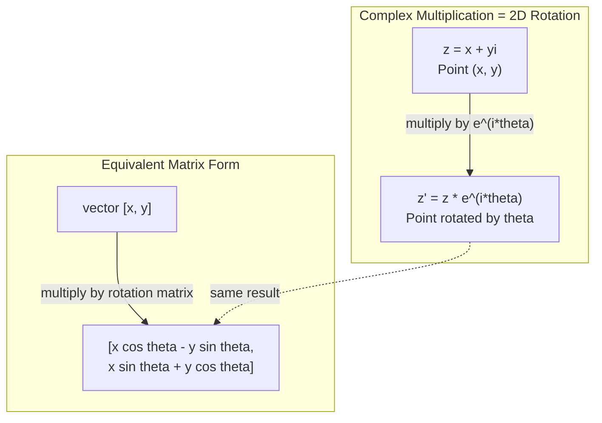
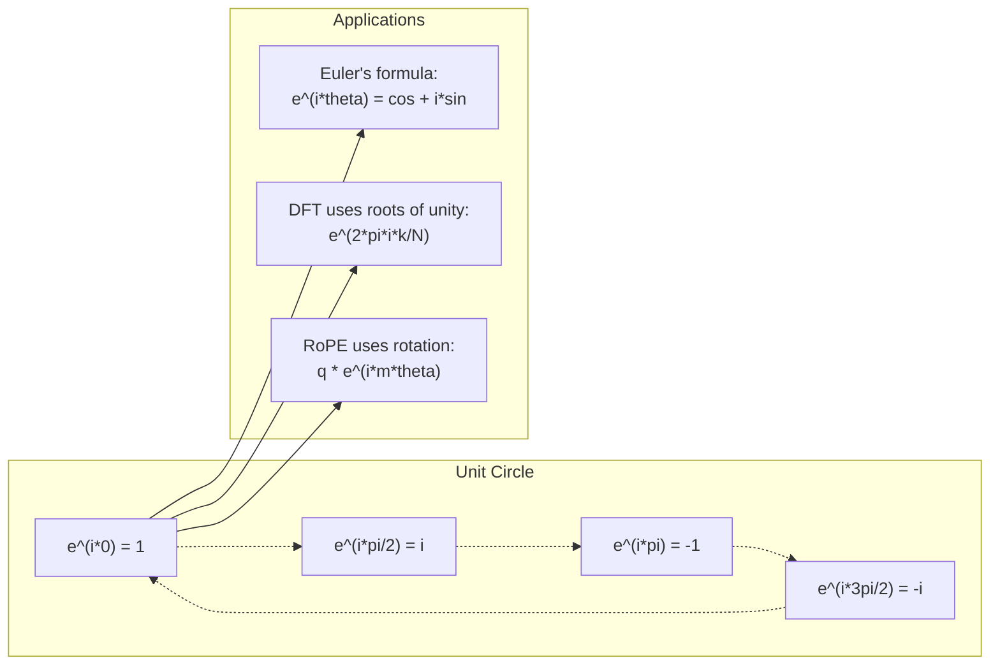

# AI 中的复数

> - 1 không phải là một con đường vuông. Nó là một trong những yếu tố quan trọng trong lĩnh vực xử lý tín hiệu.

**Type:** Learn
**Language:**Python
**Prerequisites:** Phase 1, Lessons 01-04（linear algebra, calculus）
**Time:** ~60 分钟

## Học mục tiêu
- Trong hình thức trực giác và hình thức cực坐标 thực hiện số lượng vận hành (加法,乘法,除法,共)
- 应用 Euler's formula 在复指数与三角函数之间转换
- Sử dụng nhiều đơn vị để thực hiện chuyển đổi Fourier
- 解释复数旋转 làm thế nào để cấu thành Transformer 中 RoPE 和正弦位置编码的基础

## 问题
Anh mở một bài báo về biến đổi Fourier, mọi nơi đều vậy.`i`✿You查看 Transformer 位置编码, xem khác nhau tần suất `sin`和 `cos` 也就是复指数的实部和虚部──你读量子计算,又发现一切都用复向 空间来表达──

复数 trông rất trừu tượng. Một hệ số dựa trên gốc vuông của -1 cảm thấy như một kỹ thuật toán học nào đó. Nhưng nó không phải là kỹ thuật. Nó là ngôn ngữ tự nhiên của xoay và xoay.

Nếu bạn không hiểu số, bạn cũng không thể hiểu được biến đổi Fourier phân biệt. Bạn không thể hiểu được FFT. Bạn không thể hiểu được RoPE trong mô hình ngôn ngữ hiện đại.

Bài học này sẽ bắt đầu từ việc xây dựng số lượng phức tạp, kết nối với hình học, và chính xác cho thấy vị trí của số lượng phức tạp trong Machine Learning.

## 概念
### - Quá số gì?

复数 có hai phần: thực phần và虚部.

```
z = a + bi

where:
  a is the real part
  b is the imaginary part
  i is the imaginary unit, defined by i^2 = -1
```

Chính vì vậy, bạn đã mở rộng các trục số thành một trục. Số thực nằm trên một trục, số không nằm trên trục khác. Mỗi trục số là một điểm trên trục này.

### 复数运算

**加法。**实部相加,虚部相加.

```
(a + bi) + (c + di) = (a + c) + (b + d)i

Example: (3 + 2i) + (1 + 4i) = 4 + 6i
```

**乘法。**Sử dụng quy tắc phân phối,并记住 i^2 = -1──

```
(a + bi)(c + di) = ac + adi + bci + bdi^2
                 = ac + adi + bci - bd
                 = (ac - bd) + (ad + bc)i

Example: (3 + 2i)(1 + 4i) = 3 + 12i + 2i + 8i^2
                            = 3 + 14i - 8
                            = -5 + 14i
```

**共轭。**翻转虚部的符号──

```
conjugate of (a + bi) = a - bi
```

Một số cộng với số cộng của nó là số thực:

```
(a + bi)(a - bi) = a^2 + b^2
```

**除法。**分子和分母同时乘以分母的共──

```
(a + bi) / (c + di) = (a + bi)(c - di) / (c^2 + d^2)
```

Nó sẽ biến mất phần vô số trong phân tử, nhận được một số lượng sạch.

### 复平面

复平面把每个复数映射到一个2D点――水平轴是实轴,垂直轴是虚轴――

```
z = 3 + 2i  corresponds to the point (3, 2)
z = -1 + 0i corresponds to the point (-1, 0) on the real axis
z = 0 + 4i  corresponds to the point (0, 4) on the imaginary axis
```

复数同时 là một điểm, cũng là một vector xuất phát từ điểm gốc.

### 极坐标形式

Bất kỳ điểm nào trong trơn đều có thể được sử dụng để mô tả khoảng cách của nó đến điểm gốc, cũng như góc của nó đối với trục thực.

```
z = r * (cos(theta) + i*sin(theta))

where:
  r = |z| = sqrt(a^2 + b^2)     (magnitude, or modulus)
  theta = atan2(b, a)             (phase, or argument)
```

直角形式(a + bi)适合加法。极坐标形式(r, theta)适合乘法。

**极坐标形式下的乘法。**模长相乘, góc cạnh相加.

```
z1 = r1 * e^(i*theta1)
z2 = r2 * e^(i*theta2)

z1 * z2 = (r1 * r2) * e^(i*(theta1 + theta2))
```

Đó là lý do số lặp rất thích hợp để biểu thị quay.

### Công thức của Euler

Cầu giữa 复指数 và 三角函数:

```
e^(i*theta) = cos(theta) + i*sin(theta)
```

Đây là công thức quan trọng nhất trong bài học.

```
e^(i*pi) = cos(pi) + i*sin(pi) = -1 + 0i = -1

Therefore: e^(i*pi) + 1 = 0
```

五个基本常数 ((e, i, pi, 1, 0) được kết nối với nhau bằng một phương trình.

### Tại sao công thức của Euler đối với ML  rất quan trọng

Công thức của Euler cho thấy,`e^(i*theta)`会随着太太变描绘单位圆――当太太 = 0 时,你在 (1, 0) ・当太太 = pi/2 时,你在 (0, 1) ・当太太 = pi 时,你在 (-1, 0) ・当太 = 3*pi/2 时,你在 (0, -1) ・完整一圈旋转是太太 = 2*pi。

Điều này có nghĩa là chỉ số quay là quay, và quay không có nơi nào trong xử lý tín hiệu và ML.

### Liên hệ với 2D  quay

将复数 (x + yi) 乘以 e^(i*theta),会把点 (x, y) 周围原点旋转 theta 角──

```
Rotation via complex multiplication:
  (x + yi) * (cos(theta) + i*sin(theta))
  = (x*cos(theta) - y*sin(theta)) + (x*sin(theta) + y*cos(theta))i

Rotation via matrix multiplication:
  [cos(theta)  -sin(theta)] [x]   [x*cos(theta) - y*sin(theta)]
  [sin(theta)   cos(theta)] [y] = [x*sin(theta) + y*cos(theta)]
```

Chúng tạo ra kết quả hoàn toàn giống nhau.



### Phasor và tín hiệu quay

复指数 e^(i*omega*t) là một điểm quay vòng quay với t 增加, điểm này sẽ được vẽ ra vòng.

Cái quay điểm của thực phần là cosmos.

```
e^(i*omega*t) = cos(omega*t) + i*sin(omega*t)

Real part:      cos(omega*t)    -- a cosine wave
Imaginary part: sin(omega*t)    -- a sine wave
```

Đây là cách biểu hiện phasor. Bạn không còn theo dõi một làn sóng âm của một cúi động, mà theo dõi một mũi tên của một vòng quay trơn.

### 单位根

N 次单位根 là N 个点 của đơn vị vòng trên cùng chia rẽ phân bố:

```
w_k = e^(2*pi*i*k/N)    for k = 0, 1, 2, ..., N-1
```

当 N = 4 时,根是:1, i, -1, -i(四个罗盘方向)
Khi N = 8 thì bạn sẽ có được 4 hướng, thêm vào 4 hướng đối góc.

单位根 là cơ sở của chuyển đổi Fourier phân biệt. DFT sẽ phân tích tín hiệu thành N 个等间隔频率分量.

### Liên hệ với DFT

信号 x[0], x[1], ..., x[N-1] của chuyển đổi Fourier riêng biệt là:

```
X[k] = sum_{n=0}^{N-1} x[n] * e^(-2*pi*i*k*n/N)
```

Mỗi X[k] đo tín hiệu có liên quan đến gốc của một đơn vị thứ hai, tức là liên quan đến tần số của một sóng k ∈ K.

### Tại sao tôi không giả

 tưởng tượng Từ này là ngẫu nhiên lịch sử.  Descartes 曾带着蔑视意义使用它. nhưng i并非比负数更虚. 负数 trả lời là:  từ 3 trừ được gì để có được 5? 虚数单位 trả lời là:  什么数平方后得到 -1?

Hơn nữa, hiểu được là:i là một số quay 90 độ. Đưa một số quay thực nhân bằng i một lần, bạn quay 90 độ đến một vòng quay giả.

Đó là lý do tại sao số phức ở trong công trình không tồn tại. Bất kỳ thứ gì được xoay chuyển đều phù hợp với mô tả số phức.

### 复指数 vs 三角函数

Trước công thức của Euler, các kỹ sư đã viết tín hiệu thành A*cos(omega*t + phi)  振幅 A、频率 omega、相位 phi。

Sử dụng chỉ số lặp lại, cùng một tín hiệu có thể được viết thành A*e^(i*(omega*t + phi))。相加两个信号只是相加两个复数。相乘(调制)只是模长相乘、角度相加。相位偏移变成角加法。频率偏移变成乘以phasor。

Cả lĩnh vực xử lý tín hiệu đều chuyển sang tính toán số lại, vì toán học làm sạch hơn.

### Liên hệ với Transformer

**正弦位置编码**(原始 Transformer 论文):

```
PE(pos, 2i) = sin(pos / 10000^(2i/d))
PE(pos, 2i+1) = cos(pos / 10000^(2i/d))
```

Sin 和 cos 成对出现, chúng là các phần thực và虚部 của chỉ số dưới tần suất khác nhau. Mỗi tần suất đều được lập trình để tạo ra một vị trí mã hóa khác nhau.

**RoPE（Rotary Position Embedding）**Hơn nữa. Nó rõ ràng sử dụng quay lại Matrix 乘以 query 和 key Vector. vị trí tương đối giữa hai token trở thành một góc quay.

| Operation | Algebraic Form | Geometric Meaning |
|-----------|---------------|-------------------|
| 加法 | (a+c) + (b+d)i | 平面中的 Vector 加法 |
| 乘法 | (ac-bd) + (ad+bc)i | 旋转并缩放 |
| 共轭 | a - bi | 关于实轴反射 |
| 模长 | sqrt(a^2 + b^2) | 到原点的距离 |
| 相位 | atan2(b, a) | 相对正实轴的角度 |
| 除法 | multiply by conjugate | 反向旋转并重新缩放 |
| 幂 | r^n * e^(i*n*theta) | 旋转 n 次，按 r^n 缩放 |




```figure
roots-of-unity
```

##  xây dựng nó
### 步骤 1: Khối thọ

Xây dựng một số loại phức tạp, hỗ trợ vận hành, hình dạng, và chuyển đổi giữa hình dạng trực giác và hình thức 极坐标.

```python
import math

class Complex:
    def __init__(self, real, imag=0.0):
        self.real = real
        self.imag = imag

    def __add__(self, other):
        return Complex(self.real + other.real, self.imag + other.imag)

    def __mul__(self, other):
        r = self.real * other.real - self.imag * other.imag
        i = self.real * other.imag + self.imag * other.real
        return Complex(r, i)

    def __truediv__(self, other):
        denom = other.real ** 2 + other.imag ** 2
        r = (self.real * other.real + self.imag * other.imag) / denom
        i = (self.imag * other.real - self.real * other.imag) / denom
        return Complex(r, i)

    def magnitude(self):
        return math.sqrt(self.real ** 2 + self.imag ** 2)

    def phase(self):
        return math.atan2(self.imag, self.real)

    def conjugate(self):
        return Complex(self.real, -self.imag)
```

### 步骤 2:极坐标转换 với công thức của Euler

```python
def to_polar(z):
    return z.magnitude(), z.phase()

def from_polar(r, theta):
    return Complex(r * math.cos(theta), r * math.sin(theta))

def euler(theta):
    return Complex(math.cos(theta), math.sin(theta))
```

验证:`euler(theta).magnitude()`应始终为 1.0。`euler(0)`应给出 (1, 0)`euler(pi)`应给出 (-1, 0)

### 步骤 3: quay

将点 (x, y) 旋转 theta 角, chỉ cần một lần lặp số乘法:

```python
point = Complex(3, 4)
rotated = point * euler(math.pi / 4)
```

模长保持不变──只有角度发生变化──

### Bước 4: DFT dựa trên số lượng nhiều vận hành

```python
def dft(signal):
    N = len(signal)
    result = []
    for k in range(N):
        total = Complex(0, 0)
        for n in range(N):
            angle = -2 * math.pi * k * n / N
            total = total + Complex(signal[n], 0) * euler(angle)
        result.append(total)
    return result
```

Đó là DFT của O(N^2) ⋅ mỗi đầu ra X[k] 都是信号样本乘以单位根后的总和──

### 步骤 5: DFT ngược

DFT ngược sẽ từ tần số tái cấu trúc tín hiệu nguyên thủy. So với DFT thẳng, sự thay đổi duy nhất là:

```python
def idft(spectrum):
    N = len(spectrum)
    result = []
    for n in range(N):
        total = Complex(0, 0)
        for k in range(N):
            angle = 2 * math.pi * k * n / N
            total = total + spectrum[k] * euler(angle)
        result.append(Complex(total.real / N, total.imag / N))
    return result
```

Điều này sẽ cung cấp một cấu trúc hoàn hảo. Trước khi áp dụng DFT, tái áp dụng IDFT, bạn sẽ nhận được tín hiệu ban đầu trong phạm vi độ chính xác của máy. Không có thông tin bị mất.

### 步骤 6: đơn vị

```python
def roots_of_unity(N):
    return [euler(2 * math.pi * k / N) for k in range(N)]
```

验证 hai tính chất:
- Mỗi con cái của nó đều nghiêm túc.
- 所有 N 个根的和为零 (nên chúng đối称性相互抵消)

Những chất này làm cho DFT có thể đảo ngược.

## Sử dụng nó
Python 内置支持复数──字面量 `j`Tự chỉ số đơn vị:

```python
z = 3 + 2j
w = 1 + 4j

print(z + w)
print(z * w)
print(abs(z))

import cmath
print(cmath.phase(z))
print(cmath.exp(1j * cmath.pi))
```

Đối với số,numpy 原生支持复数:

```python
import numpy as np

z = np.array([1+2j, 3+4j, 5+6j])
print(np.abs(z))
print(np.angle(z))
print(np.conj(z))
print(np.real(z))
print(np.imag(z))

signal = np.sin(2 * np.pi * 5 * np.linspace(0, 1, 128))
spectrum = np.fft.fft(signal)
freqs = np.fft.fftfreq(128, d=1/128)
```

## 交付 nó
运行 `code/complex_numbers.py`Để tạo ra`outputs/skill-complex-arithmetic.md`

## 练习
1. **手算复数运算。**計算 (2 + 3i) * (4 - i),并用代码验证──然后计算 (5 + 2i) / (1 - 3i)──把两个结果都画在复平面上,并检查乘法是否旋转并缩放第一数──

2. **旋转序列。**Từ điểm (1, 0) 开始──连续乘以 e^(i*pi/6) 十二次──验证 12次乘法后你会回到 (1, 0)──打印每一步的坐标,并确认它们描绘出一个正 12边形──

3. **已知信号的 DFT。**创建一个信号,它是在32个点上采样 sin(2*pi*3*t) 与 0.5*sin(2*pi*7*t) 之和──运行你的DFT──验证幅度频谱在频率 3 和 7 处有峰值,并且频率 7 处的峰值高度是频率 3 处的一半──

4. **单位根可视化。**計算 8 次单位根──验证它们的和为零──验证任意根乘以本原根 e^(2 *pi*i/8) 都会得到下根──

5. **旋转 Matrix 等价性。**Đối với 10 góc tự động và 10 điểm tự động, kết quả của các phương pháp kiểm tra số nhân được đưa ra giống với việc sử dụng 2x2 quay Matrix  thực hiện Matrix-Vector 乘法.

## 关键术语
| Term | What it means |
|------|---------------|
| 复数 | 形如 a + bi 的数，其中 a 是实部，b 是虚部，并且 i^2 = -1 |
| 虚数单位 | 数 i，定义为 i^2 = -1。它在哲学意义上并不“虚”——它是一个旋转算子 |
| 复平面 | x 轴为实轴、y 轴为虚轴的 2D 平面。也称为 Argand plane |
| 模长（模） | 到原点的距离：sqrt(a^2 + b^2)。写作 \|z\| |
| 相位（辐角） | 相对正实轴的角度：atan2(b, a)。写作 arg(z) |
| 共轭 | 关于实轴的镜像：a + bi 的共轭是 a - bi |
| 极坐标形式 | 将 z 表示为 r * e^(i*theta)，而不是 a + bi。让乘法变得容易 |
| Euler's formula | e^(i*theta) = cos(theta) + i*sin(theta)。连接指数函数与三角函数 |
| Phasor | 表示正弦信号的旋转复数 e^(i*omega*t) |
| 单位根 | k = 0 到 N-1 时的 N 个复数 e^(2*pi*i*k/N)。单位圆上等间隔的 N 个点 |
| DFT | Discrete Fourier Transform。使用单位根将信号分解为复正弦分量 |
| RoPE | Rotary Position Embedding。使用复数乘法在 Transformer Attention 中编码相对位置 |

## 延伸阅读
- [Visual Introduction to Euler's Formula](https://betterexplained.com/articles/intuitive-understanding-of-eulers-formula/)- xây dựng quan hệ trực tiếp trong trường hợp không sử dụng các công nghệ báo chí
- [Su et al.: RoFormer (2021)](https://arxiv.org/abs/2104.09864)-  đề xuất sử dụng nhiều quay Rotary Position Embedding
- [Vaswani et al.: Attention Is All You Need (2017)](https://arxiv.org/abs/1706.03762)-  đề xuất vị trí âm đạo 论文
- [3Blue1Brown: Euler's formula with introductory group theory](https://www.youtube.com/watch?v=mvmuCPvRoWQ)- đối với sao e^(i*pi) = -1 của có thể nhìn thấy giải thích
- [Needham: Visual Complex Analysis](https://global.oup.com/academic/product/visual-complex-analysis-9780198534464)-  về những bài thuyết trình có thể nhìn thấy tốt nhất về số lượng, đầy đủ những hiểu biết về
- [Strang: Introduction to Linear Algebra, Ch. 10](https://math.mit.edu/~gs/linearalgebra/)- Số lượng và tính chất của các nhân vật trong ngữ cảnh
