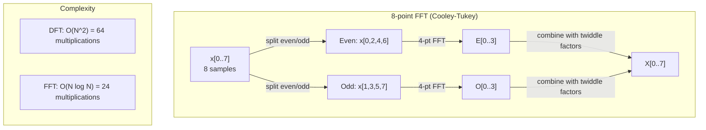
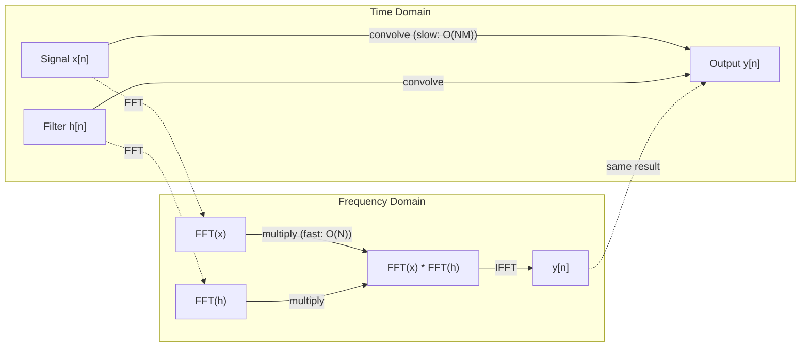

# Chuyển đổi Fourier

> Mỗi tín hiệu đều là sự lồng độ của sóng âm. Chuyển đổi Fourier sẽ cho bạn biết đó là gì.

**Type:** Build
**Language:**Python
**Prerequisites:** Phase 1, Lessons 01-04, 19 (complex numbers)
**Time:** ~90 分钟

## Học mục tiêu
- Từ零 thực hiện DFT,并 sử dụng O(N log N) của Cooley-Tukey FFT 验证它
- Nghĩ các tỷ lệ tần số: từ tín hiệu 中提取 amplitude、phase 和 power spectrum
- 应用 convolution theorem, thông qua nhân FFT  thực hiện convolution
- Để phân hủy tần số Fourier với các mã hóa vị trí biến đổi và các lớp convolution CNN  liên kết

## 问题
Một đoạn âm thanh ghi âm là một loạt các giá trị đo áp suất thay đổi theo thời gian. Giá cổ phiếu là một loạt các giá trị theo trật tự.

Nhưng nhiều mô hình trong phạm vi thời gian là không thể nhìn thấy. Các tín hiệu âm thanh này là âm thanh thanh tinh khiết hay hợp âm?

Chuyển đổi Fourier sẽ chuyển dữ liệu từ miền thời gian  chuyển đổi sang miền tần số── nó nhận được một tín hiệu,并 sẽ phân chia thành sóng âm của tần số khác nhau── mỗi sóng âm có một cường độ (强度) và một giai đoạn (起始位置)── Chuyển đổi Fourier sẽ đồng thời cho bạn biết hai điều này──

Đây là điều quan trọng đối với ML, bởi vì tư duy về quận tần số 随处可见。 Các mạng thần kinh biến động 执行 convolution, còn convolution trong quận tần số là nhân nhânềnềnềnềnềnềnềnềnềnềnềnềnềnềnềnềnềnềnềnềnềnềnềnềnềnềnềnềnềnềnềnềnềnềnềnềnềnềnềnềnềnềnềnềnềnềnềnềnềnềnềnềnềnềnềnềnềnềnềnềnềnềnềnềnềnềnềnềnềnềnềnềnềnềnềnềnềnềnềnềnềnềnềnềnềnềnềnềnềnềnềnềnềnềnềnềnềnềnềnềnềnềnềnềnềnềnềnềnềnềnềnềnềnềnềnềnềnềnềnềnềnềnềnềnềnềnềnềnềnềnềnềnềnềnềnềnềnềnềnềnềnềnềnềnềnềnềnềnềnềnềnềnềnềnềnềnềnềnềnềnềnềnềnềnềnềnềnềnềnềnềnềnềnềnềnềnềnềnềnềnềnềnềnềnềnềnềnềnềnềnềnềnềnềnềnềnềnềnềnềnềnềnềnềnềnềnềnềnềnềnềnềnềnềnềnềnềnềnềnềnềnềnềnềnềnềnềnềnềnềnềnềnềnềnềnềnềnềnềnềnềnềnềnềnềnềnềnềnềnềnềnềnềnềnềnềnềnềnềnềnềnềnềnềnềnềnềnềnềnềnềnềnềnềnềnềnềnềnềnềnềnềnềnềnềnềnềnềnềnềnềnềnềnềnềnềnềnềnềnềnềnềnềnềnềnềnềnềnềnềnềnềnềnềnềnềnềnềnềnềnềnềnềnềnềnềnềnềnềnềnềnềnềnềnềnềnềnềnềnềnềnềnềnềnềnềnềnềnềnềnềnềnềnềnềnềnềnềnềnềnềnềnềnềnềnềnềnềnềnềnềnềnềnềnềnềnềnềnềnềnềnềnềnềnềnềnềnềnềnềnềnềnềnềnềnềnềnềnềnềnềnềnềnềnềnềnềnềnềnềnềnềnềnềnềnềnềnềnềnềnềnềnềnềnềnềnềnềnềnềnềnềnềnềnềnềnềnềnềnềnềnềnềnềnềnềnềnềnềnềnềnềnềnềnềnềnềnềnềnềnềnền

## 概念
### Định nghĩa DFT

给定 N 个 mẫu x[0], x[1], ..., x[N-1],Discrete Fourier Transform 会生成 N 个 tần số hệ số X[0], X[1], ..., X[N-1]:

```
X[k] = sum_{n=0}^{N-1} x[n] * e^(-2*pi*i*k*n/N)

for k = 0, 1, ..., N-1
```

Mỗi X[k] đều là một số phức tạp. Kích thước của nó. X[k] cũng thể hiện tần số k của amplitude.

关键洞见:`e^(-2*pi*i*k*n/N)`là một phasor quay ở tần số k. DFT tính là mối tương quan của tín hiệu với N 个等间隔频率. Nếu tín hiệu trong tần số k có chứa năng lượng, mối tương quan là rất lớn. Nếu không, nó gần như không.

### Hóa học của mỗi hệ số

**X[0]: DC component。**Đây là tổng hợp của tất cả các mẫu, với tỷ lệ 成比例 trung bình. Nó biểu thị cho tín hiệu của liên tục (không tần số) của các định vị.

```
X[0] = sum_{n=0}^{N-1} x[n] * e^0 = sum of all samples
```

**X[k] for 1 <= k <= N/2: positive frequencies。**X[k] biểu hiện mỗi N 个 mẫu 中 k 个周期 的频率──k 越大,频率 越高(oscillation 越快)──

**X[N/2]: Nyquist frequency。**Đây là tần số cao nhất của các mẫu N 个 能 biểu hiện.

**X[k] for N/2 < k < N: negative frequencies。**Đối với các tín hiệu có giá trị thực, X[N-k] = conj(X[k])。 tần số âm là hình ảnh của tín hiệu tích cực。 đó là lý do tại sao thông tin hữu ích nằm trong các hệ số trước N/2 + 1 个.

### DFT ngược

DFT ngược sẽ được tính từ các hệ số tần số 重建原始信号:

```
x[n] = (1/N) * sum_{k=0}^{N-1} X[k] * e^(2*pi*i*k*n/N)

for n = 0, 1, ..., N-1
```

Sự khác biệt duy nhất giữa nó và forward DFT là: các biểu tượng trung gian được định nghĩa là正 (không phải âm), và có yếu tố bình thường hóa 1/N.

DFT ngược là một sự tái tạo hoàn hảo. Không mất bất kỳ thông tin nào. Bạn có thể từ miền thời gian đến miền tần số, quay lại lại, không tạo ra bất kỳ sai lầm nào.

### FFT: làm cho nó nhanh chóng

Như được định nghĩa trên DFT là O(N^2): đối với mỗi số nhân đầu ra trong số N, phải đối với các mẫu đầu vào N 求和── khi N = 1 triệu 时, đây là các hoạt động 10^12 lần──

Phản biến Fourier nhanh (FFT) sẽ được sử dụng với O  N log N 计算同样结果──当 N = 1 triệu 时, đây là khoảng 20000000 lần hoạt động, chứ không phải là một tỷ lần── điều này làm cho phân tích tần số trở nên khả thi──

Cooley-Tukey thuật toán ((最常见的 FFT) sử dụng chia và chinh phục:

1. sẽ phân chia tín hiệu thành các mẫu được lập chỉ số và các mẫu được lập chỉ số không.
2. 递归计算每一半的 DFT──
3. Sử dụng "tứ yếu tố đôi" e^(-2*pi*i*k/N) 合并两个半尺寸 DFTs。

```
X[k] = E[k] + e^(-2*pi*i*k/N) * O[k]          for k = 0, ..., N/2 - 1
X[k + N/2] = E[k] - e^(-2*pi*i*k/N) * O[k]    for k = 0, ..., N/2 - 1

where E = DFT of even-indexed samples
      O = DFT of odd-indexed samples
```

Sự đối xứng này có nghĩa là mỗi tầng của chuyển tiếp thực hiện công việc O  N, và có log2 N                                                                                                                                                                                                                                                  



FFT  yêu cầu chiều dài tín hiệu là 2 của ── Trong thực tế, tín hiệu thường sẽ không có pad đến 2 của ──

### Phân tích quang phổ

**power spectrum**Đó là X [k] là ^2, nghĩa là mỗi tần số số của kích thước vuông. Nó cho thấy mỗi tần số có một số lượng năng lượng.

**phase spectrum**là góc ((X[k]), cũng là sự bù đắp giai đoạn của mỗi tần số. Đối với hầu hết các nhiệm vụ phân tích, bạn quan tâm đến quang phổ điện,并会忽略 giai đoạn.

```
Power at frequency k:  P[k] = |X[k]|^2 = X[k].real^2 + X[k].imag^2
Phase at frequency k:  phi[k] = atan2(X[k].imag, X[k].real)
```

### Phân giải tần số

Độ phân giải tần số của DFT  phụ thuộc vào mẫu số lượng N và tỷ lệ lấy mẫu fs。

```
Frequency of bin k:      f_k = k * fs / N
Frequency resolution:    delta_f = fs / N
Maximum frequency:       f_max = fs / 2  (Nyquist)
```

Để phân biệt hai tần số rất gần, bạn cần nhiều mẫu hơn. Để bắt được tần số cao, bạn cần tỷ lệ lấy mẫu cao hơn.

### Tiến lý convolution

Đây là một trong những kết quả quan trọng nhất trong xử lý tín hiệu, và liên quan trực tiếp đến CNN.

**time domain 中的 convolution 等于 frequency domain 中的 pointwise multiplication。**

```
x * h = IFFT(FFT(x) . FFT(h))

where * is convolution and . is element-wise multiplication
```

Tại sao điều này quan trọng:

- 两个长度为 N 和 M của tín hiệu 直接卷曲 需要 O(N*M) hoạt động。
- 基于 FFT 的卷曲 需要 O(N log N): chuyển đổi 两者、乘、转回──
- Đối với các hạt nhân lớn, sự xoay quanh FFT sẽ nhanh hơn.
- Đây chính là những gì xảy ra trong các lớp convolutional có các lĩnh vực thụ hưởng lớn.

chú ý:DFT  tính là vòng xoắn vòng tròn (signal 会 wrap around) ・・・ đối với vòng xoắn tuyến tính (liner convolutions) 没有 wraparound (no wraparound) ), hãy trong tính toán trước sẽ có hai tín hiệu nét-pad đến độ dài N + M - 1―



### Đường cửa sổ

DFT giả định tín hiệu là định kỳ, nghĩa là đưa N mẫu như một chu kỳ của tín hiệu lặp lại vô hạn. Nếu điểm khởi điểm và điểm kết thúc của tín hiệu không phải là cùng một giá trị, sẽ có sự gián đoạn ở biên giới, và biểu hiện như giả mạo hàm lượng tần số cao.

Windows 会在计算 DFT 前将信号 两端 减到零,从而减少泄漏.

常见 cửa sổ:

| Window | Shape | Main lobe width | Side lobe level | Use case |
|--------|-------|----------------|-----------------|----------|
| Rectangular | 平坦（无 window） | 最窄 | 最高 (-13 dB) | 当 signal 在 N 个 samples 中正好 periodic 时 |
| Hann | Raised cosine | 中等 | 低 (-31 dB) | 通用 spectral analysis |
| Hamming | Modified cosine | 中等 | 更低 (-42 dB) | Audio processing、speech analysis |
| Blackman | Triple cosine | 宽 | 非常低 (-58 dB) | 当 side lobe suppression 至关重要时 |

```
Hann window:    w[n] = 0.5 * (1 - cos(2*pi*n / (N-1)))
Hamming window: w[n] = 0.54 - 0.46 * cos(2*pi*n / (N-1))
```

Trước khi DFT, sẽ mở cửa sổ với tín hiệu làm nhân tố thông minh để áp dụng cửa sổ:`X = DFT(x * w)`

### Các tính chất DFT

| Property | Time Domain | Frequency Domain |
|----------|-------------|-----------------|
| Linearity | a*x + b*y | a*X + b*Y |
| Time shift | x[n - k] | X[f] * e^(-2*pi*i*f*k/N) |
| Frequency shift | x[n] * e^(2*pi*i*f0*n/N) | X[f - f0] |
| Convolution | x * h | X * H (pointwise) |
| Multiplication | x * h (pointwise) | X * H (circular convolution, scaled by 1/N) |
| Parseval's theorem | sum \|x[n]\|^2 | (1/N) * sum \|X[k]\|^2 |
| Conjugate symmetry (real input) | x[n] real | X[k] = conj(X[N-k]) |

Lý thuyết Parseval cho thấy tổng năng lượng trong hai lĩnh vực là giống nhau.

### Liên hệ với mã hóa vị trí

原始 Transformer 使用 mã hóa vị trí chân lưng:

```
PE(pos, 2i)   = sin(pos / 10000^(2i/d_model))
PE(pos, 2i+1) = cos(pos / 10000^(2i/d_model))
```

Mỗi đối tượng kích thước (2i, 2i+1) đều có tẩy nến tần số khác nhau. Tần số từ cao ((dimension 0,1) đến thấp ((last dimensions) theo khoảng cách hình học 排列。 Điều này cho phép mỗi vị trí trên tất cả các băng tần số có mô hình duy nhất, giống như hệ số Fourier 如何唯一识别一个信号。

Nó cung cấp các tính chất quan trọng:

- **Uniqueness:**Bất kỳ hai vị trí nào sẽ có mã hóa tương tự.
- **Bounded values:**Sin 和 cos 始终在 [-1, 1] 内。
- **Relative position:**Mã hóa vị trí p+k có thể được biểu thị cho hàm tuyến tính của mã hóa vị trí p 处―― mô hình có thể học tập tập để quan tâm đến các vị trí tương đối――

### Kết nối với CNN

Cột biến chuyển  thông qua trong tín hiệu hoặc hình ảnh 上滑动一个学习过器 (tự nhiên được học tập) sẽ được áp dụng cho đầu vào.

Theo định lý convolution, đây là:
1. Đối với đầu vào  thực hiện FFT
2. Đối với hạt nhân  thực hiện FFT
3. Trong phạm vi tần số nhân
4. Đối với kết quả thực hiện IFFT

标准 CNN 实现使用直接卷积 () 对小型3x3 kernel 更快) . Nhưng đối với các kernel lớn hoặc卷积 toàn cầu, dựa trên FFT 方法会显著更快── một số kiến trúc (.

### Phân quang và chuyển đổi Fourier thời gian ngắn

单次 FFT sẽ cung cấp nội dung tần số của toàn bộ tín hiệu, nhưng không thể cho bạn biết các tần số này khi nào xuất hiện. p tần số 随着 thời gian tăng tín hiệu) và hợp âm (tất cả tần số cùng lúc tồn tại) có thể có cùng một quang phổ lớn.

Short-Time Fourier Transform (STFT) 通过在信号的重叠窗户上计算 FFT来解决这个问题──结果是谱谱: một hình thức đại diện 2D, trong đó một trục là thời gian, một trục khác là tần số── mỗi điểm biểu thị cường độ của thời gian trên tần số── năng lượng của tần số.

```
STFT procedure:
1. Choose a window size (e.g., 1024 samples)
2. Choose a hop size (e.g., 256 samples -- 75% overlap)
3. For each window position:
   a. Extract the windowed segment
   b. Apply a Hann/Hamming window
   c. Compute FFT
   d. Store the magnitude spectrum as one column of the spectrogram
```

Spectrogram là đại diện đầu vào tiêu chuẩn của các mô hình âm thanh ML.

### Tác giả

Nếu tín hiệu 包含高于 fs/2 (tần số Nyquist), theo tỷ lệ lấy mẫu fs sẽ tạo ra các bản sao nhị phân. Một tín hiệu 90 Hz của lấy mẫu 100 Hz trông giống với tín hiệu 10 Hz. Chỉ có các mẫu không thể phân biệt chúng.

```
Example:
  True signal: 90 Hz sine wave
  Sampling rate: 100 Hz
  Apparent frequency: 100 - 90 = 10 Hz

  The samples from the 90 Hz signal at 100 Hz sampling rate
  are identical to the samples from a 10 Hz signal.
  No amount of math can recover the original 90 Hz.
```

Đó là lý do tại sao các bộ chuyển đổi analog sang kỹ thuật số sẽ chứa các bộ lọc chống liên kết, trong việc lấy mẫu trước khi di chuyển cao hơn tần số của Nyquist. Trong ML, khi không có bộ lọc thấp thích hợp về các bản đồ tính năng giảm mẫu, sẽ xuất hiện các bộ lọc; một số kiến trúc sử dụng các lớp hợp nhất chống liên kết để xử lý vấn đề này.

### Null padding sẽ không nâng cao độ phân giải

Một hiểu lầm thường thấy là: trong FFT trước đối với tín hiệu  thực hiện việc đệm bằng không 会 nâng cao độ phân giải tần số. Nó sẽ không.

Độ phân giải tần số thực sự chỉ phụ thuộc vào thời gian quan sát T = N / fs。 để phân biệt sự khác biệt giữa hai tần số delta_f, bạn ít nhất cần dữ liệu T = 1 / delta_f 秒── bất kể làm gì bằng không, đều không thể thay đổi giới hạn cơ bản này──


```figure
fourier-synthesis
```

##  xây dựng nó
### 步骤 1: DFT từ đầu

O(N^2) DFT  trực tiếp từ định nghĩa

```python
import math

class Complex:
    ...

def dft(x):
    N = len(x)
    result = []
    for k in range(N):
        total = Complex(0, 0)
        for n in range(N):
            angle = -2 * math.pi * k * n / N
            w = Complex(math.cos(angle), math.sin(angle))
            xn = x[n] if isinstance(x[n], Complex) else Complex(x[n])
            total = total + xn * w
        result.append(total)
    return result
```

### 步骤 2: DFT ngược

结构 giống nhau, đối tượng 为正,并除以 N。

```python
def idft(X):
    N = len(X)
    result = []
    for n in range(N):
        total = Complex(0, 0)
        for k in range(N):
            angle = 2 * math.pi * k * n / N
            w = Complex(math.cos(angle), math.sin(angle))
            total = total + X[k] * w
        result.append(Complex(total.real / N, total.imag / N))
    return result
```

### 步骤 3: FFT (Cooley-Tukey)

FFT tái phát  yêu cầu độ dài为 2 的──拆分为 genap 和 偶,递归, sau đó sử dụng các yếu tố 合并──

```python
def fft(x):
    N = len(x)
    if N <= 1:
        return [x[0] if isinstance(x[0], Complex) else Complex(x[0])]
    if N % 2 != 0:
        return dft(x)

    even = fft([x[i] for i in range(0, N, 2)])
    odd = fft([x[i] for i in range(1, N, 2)])

    result = [Complex(0)] * N
    for k in range(N // 2):
        angle = -2 * math.pi * k / N
        twiddle = Complex(math.cos(angle), math.sin(angle))
        t = twiddle * odd[k]
        result[k] = even[k] + t
        result[k + N // 2] = even[k] - t
    return result
```

### 步骤 4: Phân tích quang phổ trợ giúp

```python
def power_spectrum(X):
    return [xk.real ** 2 + xk.imag ** 2 for xk in X]

def convolve_fft(x, h):
    N = len(x) + len(h) - 1
    padded_N = 1
    while padded_N < N:
        padded_N *= 2

    x_padded = x + [0.0] * (padded_N - len(x))
    h_padded = h + [0.0] * (padded_N - len(h))

    X = fft(x_padded)
    H = fft(h_padded)

    Y = [xk * hk for xk, hk in zip(X, H)]

    y = idft(Y)
    return [y[n].real for n in range(N)]
```

## Sử dụng nó
Trong thực tế, sử dụng Numpy của FFT, nó được hỗ trợ bởi các thư viện C tối ưu hóa cao.

```python
import numpy as np

signal = np.sin(2 * np.pi * 5 * np.arange(256) / 256)
spectrum = np.fft.fft(signal)
freqs = np.fft.fftfreq(256, d=1/256)

power = np.abs(spectrum) ** 2

positive_freqs = freqs[:len(freqs)//2]
positive_power = power[:len(power)//2]
```

Đối với phân tích quang phổ cửa sổ và cao hơn:

```python
from scipy.signal import windows, stft

window = windows.hann(256)
windowed = signal * window
spectrum = np.fft.fft(windowed)
```

 Đối với sự xoay quanh:

```python
from scipy.signal import fftconvolve

result = fftconvolve(signal, kernel, mode='full')
```

Đối với các quang phổ:

```python
from scipy.signal import stft

frequencies, times, Zxx = stft(signal, fs=sample_rate, nperseg=256)
spectrogram = np.abs(Zxx) ** 2
```

hình dạng của spectrogram Matrix là (n_frequencies, n_time_frames)。 mỗi hàng đều là một cửa sổ thời gian trên của quang phổ năng lượng。 đây là mô hình âm thanh ML 作为输入 消费的内容。

## 交付 nó
运行 `code/fourier.py`生成 `outputs/prompt-spectral-analyzer.md`

## 练习
1. **Pure tone identification。**创建一个信号,其中包含一个未知频率(1到50 Hz 之间) 的单个阴影波,以 128 Hz lấy mẫu 1秒――使用你的DFT 识别频率――验证答案是否匹配――现在加入标准偏差为0.5 的Gaussian noise,并重复――噪音 如何影响光谱?

2. **FFT vs DFT verification。**生成一个长度为64的随机信号――同时计算 DFT(O(N^2)) 和 FFT──验证所有系数在 1e-10 以内匹配──在长度为 256、512、1024 和 2048 的信号上分计时两个函数──绘制 DFT时间与 FFT时间的比例──

3. **Convolution theorem proof by example。**创建信号 x = [1, 2, 3, 4, 0, 0, 0, 0] 和过 h = [1, 1, 1, 0, 0, 0, 0, 0]──直接计算它们的圆形卷积 (圈圈)──然后通过FFT 计算(转换、乘、逆转转)──验证结果匹配──现在通过适当的零 执行线形卷积──

4. **Windowing effects。** tạo ra một tín hiệu, nó là 10 Hz và 12 Hz( rất gần) hai sóng âm của和──以 128 Hz lấy mẫu 1 giây──分别在无窗、汉窗 和汉明窗 下计算电源谱──哪个窗是最容易区分两个峰?为什么?

5. **Positional encoding analysis。**Đối với mỗi đối tượng vị trí (p1, p2), tính toán các sản phẩm điểm của các sản phẩm mã hóa đó.

## 关键术语
| Term | What it means |
|------|---------------|
| DFT (Discrete Fourier Transform) | 将 N 个 time-domain samples 转换为 N 个 frequency-domain coefficients。每个 coefficient 都是与该 frequency 上 complex sinusoid 的 correlation |
| FFT (Fast Fourier Transform) | 用于计算 DFT 的 O(N log N) algorithm。Cooley-Tukey algorithm 递归拆分 even/odd indices |
| Inverse DFT | 从 frequency coefficients 重建 time-domain signal。公式与 DFT 相同，但 exponent sign 相反，并带有 1/N scaling |
| Frequency bin | DFT output 中的每个 index k 表示 frequency k*fs/N Hz。"bin" 是离散的 frequency slot |
| DC component | X[0]，zero-frequency coefficient。与 signal mean 成比例 |
| Nyquist frequency | fs/2，在 sampling rate fs 下可表示的最大 frequency。高于它的 frequencies 会 alias |
| Power spectrum | \|X[k]\|^2，每个 frequency coefficient 的 squared magnitude。显示 energy 在 frequencies 上的分布 |
| Phase spectrum | angle(X[k])，每个 frequency component 的 phase offset。在 analysis 中通常会忽略 |
| Spectral leakage | 将 non-periodic signal 当作 periodic 处理导致的虚假 frequency content。可通过 windowing 减少 |
| Window function | 在 DFT 前应用的 tapering function（Hann、Hamming、Blackman），用于减少 spectral leakage |
| Twiddle factor | FFT butterfly computation 中用于合并 sub-DFTs 的 complex exponential e^(-2*pi*i*k/N) |
| Convolution theorem | time domain 中的 convolution 等于 frequency domain 中的 pointwise multiplication。它是 signal processing 和 CNNs 的基础 |
| Circular convolution | signal 会 wrap around 的 convolution。这是 DFT 自然计算的内容 |
| Linear convolution | 没有 wraparound 的标准 convolution。通过在 DFT 前 zero-padding 实现 |
| Parseval's theorem | 总 energy 在 Fourier transform 中保持不变。sum \|x[n]\|^2 = (1/N) sum \|X[k]\|^2 |
| Aliasing | 当 sampling rate 不足时，高于 Nyquist 的 frequencies 表现为较低 frequencies |

## 延伸阅读
- [Cooley & Tukey: An Algorithm for the Machine Calculation of Complex Fourier Series (1965)](https://www.ams.org/journals/mcom/1965-19-090/S0025-5718-1965-0178586-1/)- 改变计算 的原始 FFT 论文
- [3Blue1Brown: But what is the Fourier Transform?](https://www.youtube.com/watch?v=spUNpyF58BY)-  Về những biến đổi Fourier tốt nhất
- [Lee-Thorp et al.: FNet: Mixing Tokens with Fourier Transforms (2021)](https://arxiv.org/abs/2105.03824)- Trong các biến thể Trung sử dụng FFT thay thế sự chú ý tự
- [Smith: The Scientist and Engineer's Guide to Digital Signal Processing](http://www.dspguide.com/)- 免费在线教材, sâu vào bao gồm FFT, cửa sổ và phân tích quang phổ
- [Vaswani et al.: Attention Is All You Need (2017)](https://arxiv.org/abs/1706.03762)- Từ Fourier tần số phân hủy 派生出 sinusoidal vị trí mã hóa
- [Radford et al.: Whisper (2022)](https://arxiv.org/abs/2212.04356)- Sử dụng mel-spectrograms  như đại diện đầu vào của nhận dạng giọng nói
