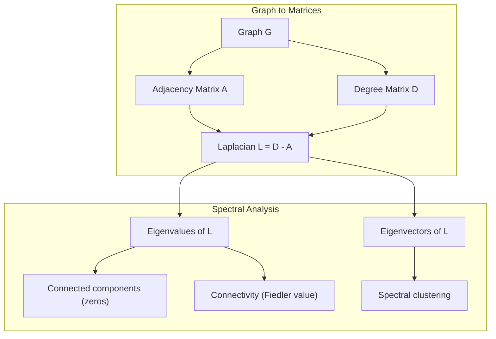
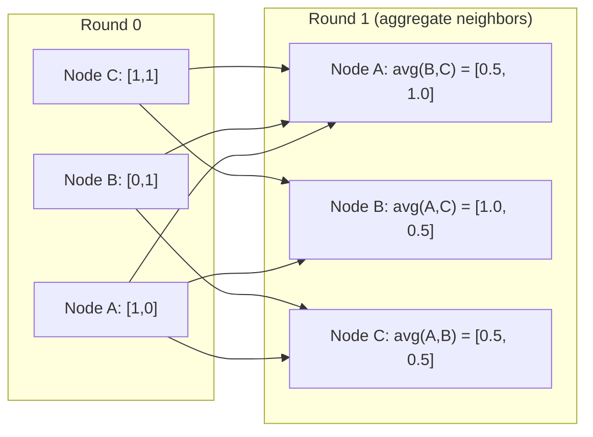

# 面向 Machine Learning của lý thuyết đồ họa

> Hình đồ là cấu trúc dữ liệu của mối quan hệ. Nếu dữ liệu của bạn chứa các liên kết, bạn cần lý thuyết đồ đồ đồ.

**Type:** Build
**Language:**Python
**Prerequisites:** Phase 1, Lessons 01-03（linear algebra, matrices）
**Time:** ~90 分钟

## Học mục tiêu
- 构建一个图类,包含邻接矩阵/luhlu表示,并实现 BFS 和 DFS 遍历
- 计算 đồ thị Laplacian,并 sử dụng các giá trị riêng của nó 检测 các thành phần kết nối 和对节点 聚类
- 将一轮 GNN 风格的消息传递 实现为正常化邻接矩阵乘法
- Sử dụng Fiedler vector  ứng dụng cluster quang phổ để phân chia biểu đồ

## 问题
Các mạng xã hội, phân tử, cơ sở kiến thức, mạng trích dẫn, bản đồ đường phố đều là đồ thị.

考虑一个社交网络――你想预测某用户会购买什么产品――他们的购买历史很重要――但他们朋友的购买历史更重要――连接本身承载信号――

Hoặc xem xét một phân tử. Bạn nghĩ rằng nó sẽ kết hợp với một loại protein.

Các mạng thần kinh đồ họa (GNN) là lĩnh vực phát triển nhanh nhất trong học tập sâu. Chúng thúc đẩy khám phá thuốc, khuyến nghị xã hội, phát hiện gian lận và lý luận đồ họa kiến thức.

Anh cần 4 thứ:
1. Một种将图表表示为矩阵的方式 (để bạn có thể làm乘法 cho chúng)
2. Sử dụng để khám phá cấu trúc đồ thị của thuật toán đi qua
3. Laplacian, đây là lý thuyết đồ thị quang phổ quan trọng nhất trong số các matrix
4. Thông điệp qua, đó là để GNN 工作的操作

## 概念
### Hình đồ: nút và cạnh

Một biểu đồ G = (V, E) bởi các đỉnh (đốt) V 和 cạnh E 组成──每条边 连接两个节点──

**Directed vs undirected。**Trong biểu đồ không hướng 中,edge (u, v) biểu thị u 连接到 v,并且 v 也连接到 u── trong biểu đồ không hướng 中,edge (u, v) biểu thị u 指向 v,但反向不一定成立──

**Weighted vs unweighted。**Trong biểu đồ không cân nặng, cạnh phải hoặc không phải có. Trong biểu đồ cân nặng, mỗi cạnh có một trọng lượng số, ví dụ như khoảng cách, chi phí hoặc sức mạnh.

| Graph type | Example |
|-----------|---------|
| Undirected, unweighted | Facebook friendship network |
| Directed, unweighted | Twitter follow network |
| Undirected, weighted | Road map（distances） |
| Directed, weighted | Web page links（PageRank scores） |

### Matrix gần nhau

Matrix lân cận A là biểu hiện lõi. Đối với một biểu đồ có chứa n 个 nút:

```
A[i][j] = 1    if there is an edge from node i to node j
A[i][j] = 0    otherwise
```

Đối với các biểu đồ không định hướng, A là đối xứng: A[i][j] = A[j][i]。 Đối với các biểu đồ có trọng lượng, A[i][j] = trọng lượng của cạnh (i, j)。

**示例：一个 triangle：**

```
Nodes: 0, 1, 2
Edges: (0,1), (1,2), (0,2)

A = [[0, 1, 1],
     [1, 0, 1],
     [1, 1, 0]]
```

Matrix lân cận là mỗi input của GNN.

### Bằng cấp

Độ độ của node là kết nối với các cạnh số lượng. Đối với các biểu đồ hướng, bạn có độ độ vào và độ ra.

Dấu số độ D là đường viền:

```
D[i][i] = degree of node i
D[i][j] = 0    for i != j
```

Đối với hình tam giác:D = diag(2,2,2), vì mỗi nút đều kết nối với hai nút khác.

Cấp độ 告诉你节点的重要性――Cấp độ cao = nút trung tâm―― phân bố cấp độ của một mạng lưới 揭示了它的结构――Mạng xã hội 遵循权力规律(少量枢纽,许多叶节)――Tình đồ ngẫu nhiên 具有Poisson-分布式级――

### BFS và DFS

Hai thuật toán chuyển giao đồ thị cơ bản.

**Breadth-First Search (BFS)：**先探索所有邻居,再探索邻居的邻居──使用队列 (FIFO)──

```
BFS from node 0:
  Visit 0
  Queue: [1, 2]        (neighbors of 0)
  Visit 1
  Queue: [2, 3]        (add neighbors of 1)
  Visit 2
  Queue: [3]           (neighbors of 2 already visited)
  Visit 3
  Queue: []            (done)
```

BFS trong các biểu đồ không cân nhắc tìm thấy các con đường ngắn nhất. Từ điểm khởi điểm đến khoảng cách của bất kỳ nút nào, tương tự như mức BFS của node lần đầu tiên được phát hiện khi nó ở đó.

**Depth-First Search (DFS)：**Trong quá trình tái tạo càng có thể sâu vào.

```
DFS from node 0:
  Visit 0
  Stack: [1, 2]        (neighbors of 0)
  Visit 2               (pop from stack)
  Stack: [1, 3]         (add neighbors of 2)
  Visit 3               (pop from stack)
  Stack: [1]
  Visit 1               (pop from stack)
  Stack: []             (done)
```

DFS có thể được sử dụng:
- 查找 kết nối các thành phần (从未访问的节点 运行 DFS)
- Khám phá chu kỳ ((DFS cây 中的后边)
- Định dạng topological ((反向 DFS hoàn thành thứ tự)

| Algorithm | Data structure | Finds | Use case |
|-----------|---------------|-------|----------|
| BFS | Queue | Shortest paths | Social network distance, knowledge graph traversal |
| DFS | Stack | Components, cycles | Connectivity, topological sort |

### Chữ đồ họa Laplacian

L = D - A。 lý thuyết đồ thị quang phổ 中最重要的矩阵──

Đối với tam giác:

```
D = [[2, 0, 0],    A = [[0, 1, 1],    L = [[2, -1, -1],
     [0, 2, 0],         [1, 0, 1],         [-1, 2, -1],
     [0, 0, 2]]         [1, 1, 0]]         [-1, -1,  2]]
```

Laplacian có tính chất rất quan trọng:

1. **L 是 positive semi-definite。**Tất cả các giá trị riêng đều >= 0

2. **zero eigenvalues 的数量等于 connected components 的数量。**Một biểu đồ kết nối 恰恰 có một giá trị riêng không. Một có 3 thành phần không kết nối.

3. **最小的 non-zero eigenvalue（Fiedler value）衡量 connectivity。**较大的Fiedler值表示图 连接良好──较小的Fiedler值表示图 有一个薄弱点,也就是瓶──

4. **Fiedler value 的 eigenvector（Fiedler vector）揭示最佳切分。**值为正的节点 进入一组,值为负的节点 进入另一组──这就是光谱集群──



### Các đặc tính quang phổ

Các giá trị riêng của matrix lân cận và Laplacian có thể được tiết lộ trong trường hợp không làm bất kỳ quá trình nào.

**Spectral clustering**:
1. 计算 Laplacian L
2. 找到 L của k 个最小 eigenvectors(跳过第一个; đối với các biểu đồ kết nối, nó là toàn 1)
3. Sử dụng các vector riêng này làm điểm mới của mỗi nút
4. Trong những điểm này vận hành k-means

Tại sao điều này hiệu quả?L của các vector tự động được mã hóa trên biểu đồ trên các hàm 平滑 ........................................................................................................................................................................................................

**Random walk connection。**Lần trôi qua của người Laplacian có thể được phân phối bằng cách ngẫu nhiên.

### Thông điệp qua

Đây là hoạt động cốt lõi của Graph Neural Networks. Mỗi nút từ hàng xóm của nó thu thập thông điệp, tập hợp chúng, và sau đó cập nhật trạng thái của nó.

```
h_v^(k+1) = UPDATE(h_v^(k), AGGREGATE({h_u^(k) : u in neighbors(v)}))
```

Trong hình thức đơn giản nhất, AGGREGATE = trung bình,UPDATE = chuyển đổi tuyến tính + kích hoạt:

```
h_v^(k+1) = sigma(W * mean({h_u^(k) : u in neighbors(v)}))
```

Đây thực sự là giả vờ thành một hình thức khác của nhân số ma trận. Nếu H là ma trận của tất cả các tính năng nút, A là ma trận lân cận:

```
H^(k+1) = sigma(A_norm * H^(k) * W)
```

Trong đó A_norm là một matrix lân cận bình thường (nói chung)

Một vòng thông điệp đi qua 让每个节点 看到它的邻居.



### 概念与 ML 应用

| Concept | ML Application |
|---------|---------------|
| Adjacency matrix | GNN input representation |
| Graph Laplacian | Spectral clustering, community detection |
| BFS/DFS | Knowledge graph traversal, path finding |
| Degree distribution | Node importance, feature engineering |
| Message passing | GNN layers (GCN, GAT, GraphSAGE) |
| Eigenvalues of L | Community detection, graph partitioning |
| Spectral clustering | Unsupervised node grouping |
| PageRank | Node importance, web search |


```figure
graph-degree-distribution
```

##  xây dựng nó
### 步骤 1: Từ zero thực hiện Chữ đồ

```python
class Graph:
    def __init__(self, n_nodes, directed=False):
        self.n = n_nodes
        self.directed = directed
        self.adj = {i: {} for i in range(n_nodes)}

    def add_edge(self, u, v, weight=1.0):
        self.adj[u][v] = weight
        if not self.directed:
            self.adj[v][u] = weight

    def neighbors(self, node):
        return list(self.adj[node].keys())

    def degree(self, node):
        return len(self.adj[node])

    def adjacency_matrix(self):
        import numpy as np
        A = np.zeros((self.n, self.n))
        for u in range(self.n):
            for v, w in self.adj[u].items():
                A[u][v] = w
        return A

    def degree_matrix(self):
        import numpy as np
        D = np.zeros((self.n, self.n))
        for i in range(self.n):
            D[i][i] = self.degree(i)
        return D

    def laplacian(self):
        return self.degree_matrix() - self.adjacency_matrix()
```

danh sách lân cận`self.adj`) có thể lưu trữ hiệu quả cao.

### 步骤 2: BFS và DFS

```python
from collections import deque

def bfs(graph, start):
    visited = set()
    order = []
    distances = {}
    queue = deque([(start, 0)])
    visited.add(start)
    while queue:
        node, dist = queue.popleft()
        order.append(node)
        distances[node] = dist
        for neighbor in graph.neighbors(node):
            if neighbor not in visited:
                visited.add(neighbor)
                queue.append((neighbor, dist + 1))
    return order, distances


def dfs(graph, start):
    visited = set()
    order = []
    stack = [start]
    while stack:
        node = stack.pop()
        if node in visited:
            continue
        visited.add(node)
        order.append(node)
        for neighbor in reversed(graph.neighbors(node)):
            if neighbor not in visited:
                stack.append(neighbor)
    return order
```

BFS 使用 deque(double-ending queue) để thực hiện O(1) popleft。DFS 使用 list 作为堆──两者都会恰好访问每个节点 一次,时间复杂度为 O(V + E)。

### 步骤 3: Các thành phần kết nối và giá trị riêng Laplacian

```python
def connected_components(graph):
    visited = set()
    components = []
    for node in range(graph.n):
        if node not in visited:
            order, _ = bfs(graph, node)
            visited.update(order)
            components.append(order)
    return components


def laplacian_eigenvalues(graph):
    import numpy as np
    L = graph.laplacian()
    eigenvalues = np.linalg.eigvalsh(L)
    return eigenvalues
```

`eigvalsh`Sử dụng đối xứng với các trật tự, trong khi Laplacian đối với các biểu đồ không định hướng luôn là đối xứng. Nó sẽ theo thứ tự tăng lên trả lại các giá trị riêng.

### 步骤 4: Nhóm phân tử quang phổ

```python
def spectral_clustering(graph, k=2):
    import numpy as np
    L = graph.laplacian()
    eigenvalues, eigenvectors = np.linalg.eigh(L)
    features = eigenvectors[:, 1:k+1]

    labels = np.zeros(graph.n, dtype=int)
    for i in range(graph.n):
        if features[i, 0] >= 0:
            labels[i] = 0
        else:
            labels[i] = 1
    return labels
```

Đối với k=2, các phương tiện của filedler sẽ chia ra thành hai cluster. Đối với k>2, bạn sẽ ở trước k 个 eigenvectors.

### 步骤 5: Thông điệp

```python
def message_passing(graph, features, weight_matrix):
    import numpy as np
    A = graph.adjacency_matrix()
    row_sums = A.sum(axis=1, keepdims=True)
    row_sums[row_sums == 0] = 1
    A_norm = A / row_sums
    aggregated = A_norm @ features
    output = aggregated @ weight_matrix
    return output
```

Đây là một vòng truyền thông tin GNN. Các tính năng mới của mỗi nút là trung bình trọng lượng của các tính năng của hàng xóm của nó, qua các khối lượng tử liệu chuyển đổi.

## Sử dụng nó
Sử dụng mạng x và numpy, cùng một hoạt động là một dòng:

```python
import networkx as nx
import numpy as np

G = nx.karate_club_graph()

A = nx.adjacency_matrix(G).toarray()
L = nx.laplacian_matrix(G).toarray()

eigenvalues = np.linalg.eigvalsh(L.astype(float))
print(f"Smallest eigenvalues: {eigenvalues[:5]}")
print(f"Connected components: {nx.number_connected_components(G)}")

communities = nx.community.greedy_modularity_communities(G)
print(f"Communities found: {len(communities)}")

pr = nx.pagerank(G)
top_nodes = sorted(pr.items(), key=lambda x: x[1], reverse=True)[:5]
print(f"Top 5 PageRank nodes: {top_nodes}")
```

networkx có thể sử dụng các backend C tối ưu hóa để xử lý các biểu đồ kích thước tùy chọn.

### Phân tích quang phổ numpy

```python
import numpy as np

A = np.array([
    [0, 1, 1, 0, 0],
    [1, 0, 1, 0, 0],
    [1, 1, 0, 1, 0],
    [0, 0, 1, 0, 1],
    [0, 0, 0, 1, 0]
])

D = np.diag(A.sum(axis=1))
L = D - A

eigenvalues, eigenvectors = np.linalg.eigh(L)
print(f"Eigenvalues: {np.round(eigenvalues, 4)}")
print(f"Fiedler value: {eigenvalues[1]:.4f}")
print(f"Fiedler vector: {np.round(eigenvectors[:, 1], 4)}")

fiedler = eigenvectors[:, 1]
group_a = np.where(fiedler >= 0)[0]
group_b = np.where(fiedler < 0)[0]
print(f"Cluster A: {group_a}")
print(f"Cluster B: {group_b}")
```

Fiedler vector 承担了主要工作──正值条目位于一个集群,负值条目位于另一个集群──不需要再进化优化,只需要一次自构──

## 交付 nó
本课产 出:
- `outputs/skill-graph-analysis.md`: được sử dụng để phân tích dữ liệu cấu trúc đồ thị

## Kết nối

| Concept | Where it shows up |
|---------|------------------|
| Adjacency matrix | GCN, GAT, GraphSAGE input |
| Laplacian | Spectral clustering, ChebNet filters |
| BFS | Knowledge graph traversal, shortest path queries |
| Message passing | Every GNN layer, neural message passing |
| Spectral gap | Graph connectivity, mixing time of random walks |
| Degree distribution | Power-law networks, node feature engineering |
| Connected components | Preprocessing, handling disconnected graphs |
| PageRank | Node importance ranking, attention initialization |

GNNs 值得特别说明──GCN(Kipf & Welling, 2017) trong hoạt động xoắn đồ họa 使用添加了自循环的邻接矩阵,A_hat = A + I:

```text
H^(l+1) = sigma(D_hat^(-1/2) * A_hat * D_hat^(-1/2) * H^(l) * W^(l))
```

Trong đó A_hat = A + I(adjacency加自环),D_hat là một dải dải dải dải dải dải dải dải dải dải dải dải dải dải dải dải dải dải dải dải dải dải dải dải dải dải dải dải dải dải dải dải dải dải dải dải dải dải dải dải dải dải dải dải dải dải dải dải dải dải dải dải dải dải dải dải dải dải dải dải dải dải dải dải dải dải dải dải dải dải dải dải dải dải dải dải dải dải dải dải dải dải dải dải dải dải dải dải dải dải dải dải dải dải dải dải dải dải dải dải dải dải dải dải dải dải dải dải dải dải dải dải dải dải dải dải dải dải dải dải dải dải dải dải dải dải dải dải dải dải dải dải dải dải dải dải dải dải dải dải dải dải dải dải dải dải dải dải dải dải dải dải dải dải dải dải dải dải dải dải dải dải dải dải dải dải dải dải dải dải dải dải dải dải dải dải dải dải dải dải dải dải dải dải dải dải dải dải dải d dải dải d d dải dải dải d d d dải dải d d dải d d d dải dải d d d d dải d d d d dải d d d d dải dải d d d d d dải d d d d d d d d d d dải d d d d d d d d dải d d d d d d d d d d d d d d d d d d d d d d d d d d d d d

## 练习
1. **从零实现 PageRank。**Từ điểm số đồng nhất 开始──每一步:score(v) = (1-d) /n + d * sum(score(u) /out_degree(u)), trong đó u là tất cả các nút hướng v──使用 d=0.85──运行直到收(变化 < 1e-6)──在一个小型网页图 上测试──

2. **使用 spectral clustering 查找 communities。**创建一个包含两个明显分离群的图表 (例如,两个点击通过一条边缘 连接) 运行光谱集群,并验证它能找到正确分──当你添加更多跨集群边缘时会发生什么?

3. **为 weighted graphs 中的 shortest paths 实现 Dijkstra's algorithm。**Trong cùng một biểu đồ có trọng lượng đồng nhất, sẽ kết quả so sánh với BFS.

4. **构建一个 2-layer message passing network。**Sử dụng các khối lượng khác nhau 应用两次消息传递──展示经过2轮后, mỗi nút đều có thông tin từ khu vực 2 hop của nó──

5. **分析一个真实世界 graph。**Sử dụng biểu đồ Câu lạc bộ Karate(34 nút, 78 cạnh)。 tính toán phân bố độ、Laplacian eigenvalues 和 quang phổ clustering。将 quang phổ clustering 结果与已知地面真理分比比──

## 关键术语
| Term | What people say | What it actually means |
|------|----------------|----------------------|
| Graph | “Nodes and edges” | 一种数学结构 G=(V,E)，用于编码 pairwise relationships |
| Adjacency matrix | “The connection table” | 一个 n x n matrix，其中如果 nodes i 和 j 相连，则 A[i][j] = 1 |
| Degree | “一个 node 有多 connected” | 接触某个 node 的 edges 数量 |
| Laplacian | “D minus A” | L = D - A，其 eigenvalues 会揭示 graph structure 的 matrix |
| Fiedler value | “The algebraic connectivity” | L 的最小 non-zero eigenvalue，用于衡量 graph 连接得有多好 |
| BFS | “Level-by-level search” | 在深入之前先访问所有 neighbors 的 traversal，可找到 shortest paths |
| DFS | “Go deep first” | 在回溯之前沿一条 path 走到末端的 traversal |
| Message passing | “Nodes talk to neighbors” | 每个 node 从其 neighbors 聚合信息，这是 GNNs 的核心 |
| Spectral clustering | “Cluster by eigenvectors” | 使用 graph 的 Laplacian 的 eigenvectors 来划分 graph |
| Connected component | “A separate piece” | 一个 maximal subgraph，其中每个 node 都能到达其他每个 node |

## 延伸阅读
- **Kipf & Welling (2017)**:Tân loại hóa bán giám sát với mạng lưới chuyển biến đồ họa──开启现代 GNNs 的论文──展示了光谱 đồ họa chuyển biến 如何简化为信息传递──
- **Spielman (2012)**: Lý thuyết đồ thị quang phổ ghi chú bài giảng── về Laplacians、 khoảng trống quang phổ 和 phân vùng đồ thị── quyền vào
- **Hamilton (2020)**:Graph Representation Learning──一本 từ cơ sở đến ứng dụng bao gồm GNNs 
- **Bronstein et al. (2021)**:Dân học hình học: lưới, nhóm, đồ thị, địa lý học và đo lường.
- **Veličković et al. (2018)**:Graph Attention Networks──用注意机制 扩展消息传递──
