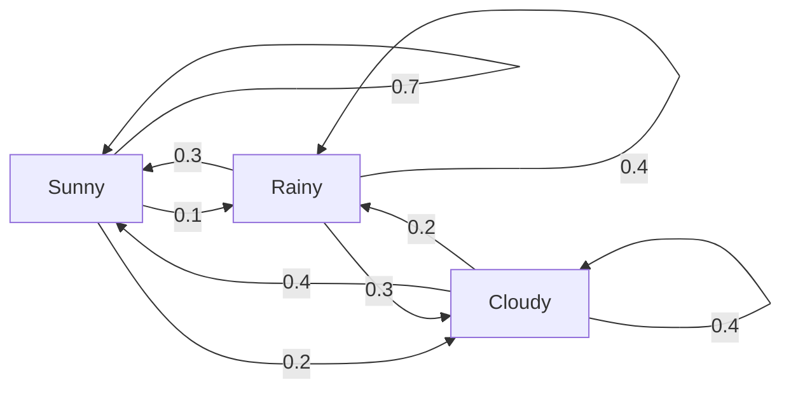
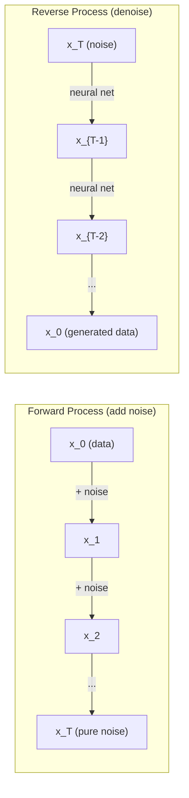

# Quá trình Stochastic

> 具有结构的随机性──随机走行、Markov链 和扩散模型 背后的数学──

**Type:** Learn
**Language:**Python
**Prerequisites:** Phase 1, Lessons 06-07（probability, Bayes）
**Time:** ~75 分钟

## Học mục tiêu
- 模拟 1D 和 2D random walks,并验证位移的平方(n) 缩放规律
- 构建 Markov chain 模拟器,并通过自己的组合 计算其静止分布
- 实现 Metropolis-Hastings MCMC và động lực Langevin, được sử dụng từ mục tiêu phân bố
- Để kết nối quá trình phân tán về phía trước với chuyển động Brownian, và giải thích quá trình ngược  làm thế nào để tạo dữ liệu

## 问题
Nhiều hệ thống AI liên quan đến sự ngẫu nhiên của sự phát triển theo thời gian. Không phải sự ngẫu nhiên tĩnh, mà là sự ngẫu nhiên cấu trúc, sắp xếp, mỗi bước đều phụ thuộc vào những gì đã xảy ra trước đó.

Các mô hình ngôn ngữ một lần tạo ra một token. Mỗi token đều phụ thuộc vào bối cảnh trước. mô hình xuất ra một phân phối xác suất, từ từ trong, rồi tiếp tục. Đây là một quá trình stochastic.

Các mô hình phân phối dần dần hướng tới hình ảnh thêm tiếng ồn, cho đến khi nó trở thành âm thanh tĩnh thanh đơn thuần. Sau đó chúng trở lại quá trình này, từ chối dần, cho đến khi xuất hiện một hình ảnh mới.

Các đại lý học tập tăng cường trong môi trường thực hiện các hành động. Mỗi hành động đều có khả năng dẫn đến một trạng thái mới.

MCMC lấy mẫu là trụ cột của suy luận Bayesian, nó cấu thành một chuỗi Markov, phân bố tĩnh của nó là bạn muốn lấy kiểu sau.

Tất cả đều dựa trên bốn ý tưởng cơ bản:
1. Đi bộ ngẫu nhiên  最简单的 stochastic process
2. Dòng dây chuyền Markov  带有过渡矩阵的结构化随机性
3. Động lực Langevin  带噪音的渐进下降
4. Metropolis-Hastings  Từ phân bố tùy ý采样

## 概念
### Đi bộ ngẫu nhiên

Từ vị trí 0 开始── từng bước,抛一枚公平硬币──正面:向右移动(+1)──反面:向左移动(-1)──

经过 n 步后, vị trí của bạn là n 个随机 +/-1 值的总和――期望位置是 0((((((((((((((((((((((((((((((((((((((((((((((((((((((((((((((((((((((((((((((((((((((((((((((((((((((((((((((((((((((((((((((((((((((((((((((((((((((((((((((((((((((((((((((((((((((((((((((((((((((((((((((((((((((((((((((((((((((((((((((((((((((((((((((((((((((((((((((((((((((((((((((((((((((((((((((((((((((((((((((((((((((((((((((((((((((((((((((((((((((((((((((((((((((((((((((((((((((((((((((((((((((((((((((((((((((((((((((((((((((((((((((((((((((((((((((((((((((((((((((

Đây là một bước đi không xa xôi, không có sự trôi dạt trong hai hướng. Nhưng theo thời gian, nó sẽ rời khỏi điểm khởi điểm và đi xa hơn.

```
Step 0:  Position = 0
Step 1:  Position = +1 or -1
Step 2:  Position = +2, 0, or -2
...
Step 100: Expected distance from origin ~ 10 (sqrt(100))
Step 10000: Expected distance from origin ~ 100 (sqrt(10000))
```

**在 2D 中**, đi với các hình như xác suất lên, xuống, về phía trái hoặc về phía phải di chuyển.

**为什么是 sqrt(n)？**Mỗi bước đều có tỷ lệ tương tự là +1 hoặc -1──n 步后, vị trí S_n = X_1 + X_2 + ... + X_n, trong đó mỗi X_i đều là +/-1──n mỗi bước khác nhau là 1, và mỗi bước là độc lập với nhau, vì vậy Var(S_n) = n── lệch chuẩn = sqrt(n)── theo định lý giới hạn trung tâm, S_n / sqrt(n) 收 đến phân bố bình thường tiêu chuẩn──

Đây là một số loại hình thức để tạo ra các hình thức để tạo ra các hình thức để tạo ra các hình thức để tạo ra các hình thức để tạo ra các hình thức để tạo ra các hình thức để tạo ra các hình thức để tạo ra các hình thức để tạo ra các hình thức để tạo ra các hình thức để tạo ra các hình thức để tạo ra các hình thức để tạo ra các hình thức để tạo ra các hình thức để tạo ra các hình thức để tạo ra các hình thức để tạo ra các hình thức để tạo ra các hình thức để tạo ra các hình thức để tạo ra các hình thức để tạo ra các hình thức để tạo ra các hình thức để tạo ra các hình thức để tạo ra các hình thức để tạo ra các hình thức để tạo ra các hình thức để tạo ra các hình thức để tạo ra các hình thức để tạo ra các hình thức để tạo ra các hình thức.

**与 Brownian motion 的联系。**取一个步骤尺为1/sqrt(n) 、每单位时间 n 步的随机走行──当 n 趋近无穷时,这个走行会收到布朗运动 B(t)  一个连续时间过程,其中 B(t) 服从平均值为 0、变量为 t 的正常分布──

Hành động Brownian là nền tảng toán học của sự phân tán. Nó mô tả sự biến động của các hạt trong cơ thể, cũng như các động thái âm thanh trong các mô hình phân tán.

**Gambler's ruin。**Một người đi bộ ngẫu nhiên từ vị trí k  bắt đầu, ở 0 和 N 处有吸收障碍──到达 N sớm đến 0 概率是多少? đối với một bước đi công bằng:P(reach N) = k/N──这非常简单而优雅──它连接到 martingales 理论  公平随机走是一个 martingale(期望未来值 = hiện tại值)。

### Dòng dây chuyền Markov

Dòng chuỗi Markov là một hệ thống, nó theo tỷ lệ cố định chuyển đổi giữa các tiểu bang.

```
P(X_{t+1} = j | X_t = i, X_{t-1} = ...) = P(X_{t+1} = j | X_t = i)
```

Đây là thuộc tính Markov. Nó có nghĩa là bạn có thể sử dụng một số liệu chuyển tiếp P để mô tả toàn bộ động lực:

```
P[i][j] = probability of going from state i to state j
```

Mỗi đường yêu cầu của P và là 1... bạn phải đi đến một nơi nào đó.

**示例 —— Weather：**

```
States: Sunny (0), Rainy (1), Cloudy (2)

P = [[0.7, 0.1, 0.2],    (if sunny: 70% sunny, 10% rainy, 20% cloudy)
     [0.3, 0.4, 0.3],    (if rainy: 30% sunny, 40% rainy, 30% cloudy)
     [0.4, 0.2, 0.4]]    (if cloudy: 40% sunny, 20% rainy, 40% cloudy)
```

Từ bất kỳ trạng thái nào 开始──经过多次过渡 之后, các trạng thái phân bố sẽ nhận được phân bố tĩnh pi, trong đó pi * P = pi── đây là giá trị riêng của P 为 1 của cánh tay trái của eigenvector──

Đối với chuỗi thời tiết, phân phối cố định có thể là [0.53, 0.18, 0.29]  长期来看, bất kể trạng thái khởi đầu là gì, 53% thời gian là nắng.



**计算 stationary distribution。**Có hai cách:

1. **Power method**: sẽ được phân bố ban đầu bất kỳ lần nào, lặp lại lần P.
2. **Eigenvalue method**: tìm được giá trị riêng của P 为 1 của cánh tay trái của eigenvector。

两种方法都要求链 满足收条件――

**收敛条件。**Nếu một chuỗi Markov  đáp ứng các điều kiện sau, nó sẽ nhận được phân phối tĩnh duy nhất:
- **Irreducible**Mỗi tiểu bang đều có thể đến từ bất kỳ tiểu bang nào khác
- **Aperiodic**: chuỗi không được định kỳ vòng lặp

Hầu hết các chuỗi mà bạn gặp trong ML đều đáp ứng cả hai điều kiện này.

**Absorbing states。**Nếu một khi vào một trạng thái nào đó, sẽ không bao giờ rời khỏi [1] P[i][i] = 1), trạng thái này là hấp thụ của── hấp thụ chuỗi Markov có thể được sử dụng để xây dựng với các trạng thái cuối cùng của quá trình  Một kết thúc của trò chơi、 một churn của khách hàng、 một chuỗi token của cuối văn bản của một cuộc đời──

**Mixing time。**需要多少步,chain才会接近stationary distribution?形式化地说,就是总变距离与静止的距离降至某个值以下的所需步数――快速混合 = 需要步数少――P的光谱差距(1 减去第二大自值) 控制混合时间――gap 越大,mixing 越快――

### Liên hệ với Các mô hình ngôn ngữ

Mô hình ngôn ngữ 中的代币生成 近似是一个马科夫过程――给定当前文本,模型输出下一个代币 上的分布――温度 控制敏度:

```
P(token_i) = exp(logit_i / temperature) / sum(exp(logit_j / temperature))
```

- Nhiệt độ = 1,0: Standard分布
- Nhiệt độ < 1,0:更尖(更 quyết định)
- Nhiệt độ > 1,0:更平坦(更随机)
- Nhiệt độ -> 0:argmax(mồi mồi)

Top-k lấy mẫu 截断至概率最高的 k 个代币――Top-p(nucleus) lấy mẫu 截断至累积概率 超过p 的最小代币 集合──两者都会修改马科夫过渡概率──

### Động thái Brown

Hạn chế thời gian liên tục của random walk.
1. B(0) = 0
2. B(t) - B(s) 服从平均值为 0、变量 为 t - s của phân bố bình thường(对 t > s)
3. Không chồng lên trong các khu vực 相互独立

Quá trình Brown là liên tục, nhưng ở đó là không thể phân biệt được. Nó ở mỗi thước đều đang hoạt động.

Trong phân tán, bạn có thể làm như vậy gần giống như chuyển động Brownian:

```
B(t + dt) = B(t) + sqrt(dt) * z,    where z ~ N(0, 1)
```

sqrt(dt) 缩放 rất quan trọng. Nó xuất phát từ lý thuyết giới hạn trung tâm của hành trình ngẫu nhiên.

### Langevin Dynamics

Gradient Descent 寻找函数的最小值──Langevin Dynamics 寻找与 exp(-U(x)/T) 成正比的概率分布, trong đó U là năng lượng hàm, T là nhiệt độ──

```
x_{t+1} = x_t - dt * gradient(U(x_t)) + sqrt(2 * T * dt) * z_t
```

Có hai tác dụng trên hạt:
1. **Gradient force**(-dt * gradient(U)): đẩy về năng lượng thấp(类似 Gradient Descent)
2. **Random force**(sqrt(2*T*dt) * z):推向随机方向(kỳnh

Khi nhiệt độ T = 0 时, đây là sự giảm độ tinh khiết. nhiệt độ cao.

**与 diffusion models 的联系。**Phương pháp tiến triển của mô hình phân tán là:

```
x_t = sqrt(alpha_t) * x_{t-1} + sqrt(1 - alpha_t) * noise
```

Đây là một chuỗi Markov liên kết dữ liệu và tiếng ồn.

Quá trình ngược từ tiếng  trở lại dữ liệu  cũng là một chuỗi Markov, nhưng khả năng chuyển đổi của nó được học bởi mạng Neural.



### MCMC: Markov Chain Monte Carlo

Có khi bạn cần từ một có thể tìm giá trị (để khác biệt một số thường) nhưng không thể trực tiếp lấy kiểu phân bố p (x) trong các mẫu.

**Metropolis-Hastings**构造一个静止分布 为 p(x) của chuỗi Markov:

1. Từ một vị trí x  bắt đầu
2. Từ phân phối đề xuất Q(x' không được x) 提议一个新位置 x'
3. 计算 chấp nhận tỷ lệ:a(x') * Q(x khiếu x') / (p(x) * Q(x khiếu x))
4. 以概率 min(1, a) 接受 x'──否则留在x──
5. Đổi lại

Nếu Q là đối xứng của (ví dụ: Q(x'x khi nào) = Q(x khi nào) = N(x, sigma^2)), tỷ lệ 可简化为 a = p(x') / p(x) ――你只需要概率的比例 正常化常态 会相互抵消──

Trong điều kiện nhiệt độ, chuỗi này bảo đảm nhận đến p(x) ・・・ nhưng nếu đề xuất quá nhỏ (random walk) hoặc quá lớn (high rejection), thì đề xuất nhận có thể chậm rãi.

**为什么它有效。**Tỷ lệ chấp nhận  đảm bảo sự cân bằng chi tiết: nằm ở x không di chuyển đến x' tỷ lệ xác suất, bằng với nằm ở x' không di chuyển đến x tỷ lệ xác suất.

**实践注意事项：**
- **Burn-in**: bỏ đi trước N 个 mẫu. chuỗi cần thời gian từ điểm khởi điểm đến phân phối cố định.
- **Thinning**Mỗi mẫu riêng biệt giữ một, để giảm sự tương quan tự động.
- **Multiple chains**Từ các điểm khác nhau vận hành nhiều chuỗi. Nếu chúng được phân phối giống nhau, có bằng chứng về việc được phân phối.
- **Acceptance rate**Đối với các đề xuất của Gaussian, tỷ lệ chấp nhận tốt nhất là khoảng 23% (Roberts & Rosenthal, 2001): quá cao có nghĩa là chuỗi gần như không di chuyển.

### Quá trình Stochastic trong AI

| Process | AI Application |
|---------|---------------|
| Random walk | RL 中的 exploration、Node2Vec embeddings |
| Markov chain | Text generation、MCMC sampling |
| Brownian motion | Diffusion models（forward process） |
| Langevin dynamics | Score-based generative models、SGLD |
| Markov decision process | Reinforcement learning |
| Metropolis-Hastings | Bayesian inference、posterior sampling |


```figure
random-walk-diffusion
```

##  xây dựng nó
### 步骤 1: Chế độ mô phỏng đi bộ ngẫu nhiên

```python
import numpy as np

def random_walk_1d(n_steps, seed=None):
    rng = np.random.RandomState(seed)
    steps = rng.choice([-1, 1], size=n_steps)
    positions = np.concatenate([[0], np.cumsum(steps)])
    return positions


def random_walk_2d(n_steps, seed=None):
    rng = np.random.RandomState(seed)
    directions = rng.choice(4, size=n_steps)
    dx = np.zeros(n_steps)
    dy = np.zeros(n_steps)
    dx[directions == 0] = 1   # right
    dx[directions == 1] = -1  # left
    dy[directions == 2] = 1   # up
    dy[directions == 3] = -1  # down
    x = np.concatenate([[0], np.cumsum(dx)])
    y = np.concatenate([[0], np.cumsum(dy)])
    return x, y
```

1D đi  lưu trữ tổng cộng số tiền. Mỗi bước là +1 hoặc -1── qua n bước, vị trí là tổng cộng.

### 步骤 2: chuỗi Markov

```python
class MarkovChain:
    def __init__(self, transition_matrix, state_names=None):
        self.P = np.array(transition_matrix, dtype=float)
        self.n_states = len(self.P)
        self.state_names = state_names or [str(i) for i in range(self.n_states)]

    def step(self, current_state, rng=None):
        if rng is None:
            rng = np.random.RandomState()
        probs = self.P[current_state]
        return rng.choice(self.n_states, p=probs)

    def simulate(self, start_state, n_steps, seed=None):
        rng = np.random.RandomState(seed)
        states = [start_state]
        current = start_state
        for _ in range(n_steps):
            current = self.step(current, rng)
            states.append(current)
        return states

    def stationary_distribution(self):
        eigenvalues, eigenvectors = np.linalg.eig(self.P.T)
        idx = np.argmin(np.abs(eigenvalues - 1.0))
        stationary = np.real(eigenvectors[:, idx])
        stationary = stationary / stationary.sum()
        return np.abs(stationary)
```

Phân bố cố định là giá trị riêng của P là đối tượng riêng tư trái của 1。 Chúng tôi thông qua tính toán các đối tượng riêng tư của P^T để tìm ra nó( chuyển đặt sẽ chuyển các đối tượng riêng tư trái thành đối tượng riêng tư phải)。

### 步骤 3: động lực Langevin

```python
def langevin_dynamics(grad_U, x0, dt, temperature, n_steps, seed=None):
    rng = np.random.RandomState(seed)
    x = np.array(x0, dtype=float)
    trajectory = [x.copy()]
    for _ in range(n_steps):
        noise = rng.randn(*x.shape)
        x = x - dt * grad_U(x) + np.sqrt(2 * temperature * dt) * noise
        trajectory.append(x.copy())
    return np.array(trajectory)
```

Gradient sẽ x  đẩy sang năng lượng thấp ồn  ngăn chặn nó rơi vào tình trạng đình trệ ⋅ trong trạng thái cân bằng ⋅ phân bố các mẫu với exp (U) ⋅x/ nhiệt độ) 成正比。

### 步骤 4: Metropolis-Hastings

```python
def metropolis_hastings(target_log_prob, proposal_std, x0, n_samples, seed=None):
    rng = np.random.RandomState(seed)
    x = np.array(x0, dtype=float)
    samples = [x.copy()]
    accepted = 0
    for _ in range(n_samples - 1):
        x_proposed = x + rng.randn(*x.shape) * proposal_std
        log_ratio = target_log_prob(x_proposed) - target_log_prob(x)
        if np.log(rng.rand()) < log_ratio:
            x = x_proposed
            accepted += 1
        samples.append(x.copy())
    acceptance_rate = accepted / (n_samples - 1)
    return np.array(samples), acceptance_rate
```

Các thuật toán đề xuất một điểm mới, kiểm tra xem nó có có khả năng cao hơn không, hoặc có tương ứng với tỷ lệ chấp nhận), sau đó lặp lại. Để có được sự trộn lẫn tốt, tỷ lệ chấp nhận nên khoảng 23-50% ∼.

## Sử dụng nó
Trong thực tế, bạn sẽ sử dụng các thư viện trưởng thành để thực hiện các thuật toán này. Nhưng hiểu cơ chế cho debugging và tuning rất quan trọng.

```python
import numpy as np

rng = np.random.RandomState(42)
walk = np.cumsum(rng.choice([-1, 1], size=10000))
print(f"Final position: {walk[-1]}")
print(f"Expected distance: {np.sqrt(10000):.1f}")
print(f"Actual distance: {abs(walk[-1])}")
```

### Sử dụng để chuyển đổi các matrix của numpy

```python
import numpy as np

P = np.array([[0.7, 0.1, 0.2],
              [0.3, 0.4, 0.3],
              [0.4, 0.2, 0.4]])

distribution = np.array([1.0, 0.0, 0.0])
for _ in range(100):
    distribution = distribution @ P

print(f"Stationary distribution: {np.round(distribution, 4)}")
```

Để phân bố ban đầu lặp lại với P. Sau quá nhiều lần lặp lại, nó sẽ nhận được phân bố cố định, bất kể bạn bắt đầu từ đâu.

### Liên kết với khung thực tế

- **PyTorch diffusion：**Nhìn khuôn mặt `diffusers`Trung `DDPMScheduler`实现了前进和反转马科夫链
- **NumPyro / PyMC：**Sử dụng MCMC(NUTS mẫu, nó là một cải tiến đối với Metropolis-Hastings) để thực hiện suy luận Bayesian
- **Gymnasium (RL)：**chức năng bước môi trường  định nghĩa một quá trình quyết định Markov

### 验证 Sự hội tụ chuỗi Markov

```python
import numpy as np

P = np.array([[0.9, 0.1], [0.3, 0.7]])

eigenvalues = np.linalg.eigvals(P)
spectral_gap = 1 - sorted(np.abs(eigenvalues))[-2]
print(f"Eigenvalues: {eigenvalues}")
print(f"Spectral gap: {spectral_gap:.4f}")
print(f"Approximate mixing time: {1/spectral_gap:.1f} steps")
```

khoảng cách quang phổ  nói với bạn chuỗi  quên tốc độ trạng thái ban đầu của nó. khoảng cách là 0.2 có nghĩa là khoảng 5 bước即可混合. khoảng cách là 0.01 có nghĩa là khoảng 100 bước.

## 交付 nó
本课产 出:
- `outputs/prompt-stochastic-process-advisor.md` Một lời nhắc, để giúp xác định các vấn đề nhất định phù hợp với khung quy trình stochastic nào

## Kết nối

| Concept | Where it shows up |
|---------|------------------|
| Random walk | Node2Vec graph embeddings、RL 中的 exploration |
| Markov chain | LLMs 中的 Token generation、MCMC sampling |
| Brownian motion | DDPM 中的 forward diffusion process、SDE-based models |
| Langevin dynamics | Score-based generative models、stochastic gradient Langevin dynamics (SGLD) |
| Stationary distribution | MCMC convergence target、PageRank |
| Metropolis-Hastings | Bayesian posterior sampling、simulated annealing |
| Temperature | LLM sampling、RL 中的 Boltzmann exploration、simulated annealing |
| Mixing time | MCMC 的 convergence speed、spectral gap analysis |
| Absorbing state | End-of-sequence token、RL 中的 terminal states |
| Detailed balance | MCMC samplers 的 correctness guarantee |

Các mô hình phân tán 值得特别关注──DDPM(Ho et al., 2020) đã định nghĩa một chuỗi Markov phía trước:

```
q(x_t | x_{t-1}) = N(x_t; sqrt(1-beta_t) * x_{t-1}, beta_t * I)
```

Trong đó beta_t là một lịch trình tiếng ồn.

```
p_theta(x_{t-1} | x_t) = N(x_{t-1}; mu_theta(x_t, t), sigma_t^2 * I)
```

Mỗi bước của thế hệ là một bước trong chuỗi Markov học.

SGLD(Stochastic Gradient Langevin Dynamics) sẽ kết hợp các tập hợp nhỏ của Gradient Descent với tiếng ồn Langevin 结起来──你不计算完整的 Gradient,而是使用 stochastic estimate并添加校准的噪音──随着学习率的衰退,SGLD 会从优化 过渡到样品  你几乎免费得到近似的贝叶斯后样品──这是从神经网络 获得不确定性估计的最简单方式之一──

穿穿这些联系的关键洞见是: các quy trình stochastic không chỉ là các công cụ lý thuyết. Chúng là cơ chế tính toán trong hệ thống AI hiện đại. Khi bạn điều chỉnh nhiệt độ của LLM, bạn đang điều chỉnh một chuỗi Markov. Khi bạn đào tạo mô hình phân phối, bạn đang học ngược chuyển một quá trình giống như chuyển động Brownian. Khi bạn vận hành suy luận Bayesian, bạn đang xây dựng một chuỗi tiếp nhận cho phía sau.

## 练习
1. **模拟 1000 条 10000 步的 random walks。**绘制 cuối cùng của vị trí phân bố. 验证它近似为平均 0 标准偏差平方rt ((10000) = 100 của Gaussian.

2. **使用 Markov chain 构建 text generator。**Trong một tập thể nhỏ 上训练: đối với mỗi từ,统计 đến từ sau của chuyển tiếp.

3. **使用 Metropolis-Hastings 实现 simulated annealing。**Từ nhiệt độ cao  bắt đầu (quá chấp nhận tất cả nội dung), sau đó dần dần降温 (chỉ chấp nhận cải tiến)  Sử dụng nó để tìm các hàm tối thiểu của nhiều tối thiểu địa phương 

4. **比较不同 temperatures 下的 Langevin dynamics。**Từ tiềm năng hố hai lần U(x) = (x^2 - 1)^2 中采样──low temperature 时,样本 聚集在一个井中──高温度 时,它们分布在两个井中──找到链 在井中混合的关键温度──

5. **实现 forward diffusion process。**Từ một tín hiệu 1D (ví dụ sóng âm đạo) bắt đầu, sử dụng lịch trình tiếng ồn tuyến tính, dần dần thêm tiếng ồn trong 100 bước.

## 关键术语
| Term | What people say | What it actually means |
|------|----------------|----------------------|
| Random walk | “抛硬币式移动” | 一个 position 在每一步按随机 increments 改变的过程 |
| Markov property | “无记忆性” | future 只依赖当前 state，而不依赖 history |
| Transition matrix | “概率表” | P[i][j] = 从 state i 移动到 state j 的概率 |
| Stationary distribution | “长期平均” | 满足 pi*P = pi 的分布 pi —— chain 的 equilibrium |
| Brownian motion | “随机抖动” | random walk 的 continuous-time limit，B(t) ~ N(0, t) |
| Langevin dynamics | “带噪声的 Gradient Descent” | 结合 deterministic Gradient 与 random perturbation 的 update rule |
| MCMC | “向目标行走” | 构造一个 stationary distribution 为你想要的分布的 Markov chain |
| Metropolis-Hastings | “提议并接受/拒绝” | 使用 acceptance ratios 来确保收敛的 MCMC algorithm |
| Temperature | “随机性旋钮” | 控制 exploration 与 exploitation 之间权衡的参数 |
| Diffusion process | “噪声进，噪声出” | Forward：逐渐添加 noise。Reverse：逐渐移除 noise。生成 data。 |

## 延伸阅读
- **Ho, Jain, Abbeel (2020)**  Tống chế các mô hình khả thi phân tán.   mở mô hình phân tán 革命的 DDPM 论文──清晰推导了前进和反转马科夫链──
- **Song & Ermon (2019)** Tình mẫu tổng thể bằng cách ước tính các gradient phân phối dữ liệu. Sử dụng động lực Langevin  tiến hành lấy mẫu 方法 dựa trên điểm số của 
- **Roberts & Rosenthal (2004)** General state space Markov chains and MCMC algorithms.                                                                                                                                                                                                                                                      
- **Norris (1997)** Markov Chains. 标准教材──涵盖 hội tụ, phân phối tĩnh và thời gian tấn công.
- **Welling & Teh (2011)**  Học Bayesian thông qua Stochastic Gradient Langevin Dynamics. 将 SGD với động lực Langevin 结结,用于可扩展 Bayesian inference。
