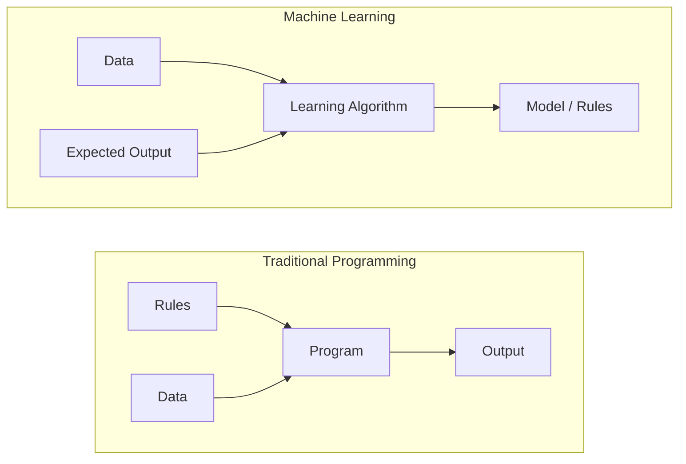
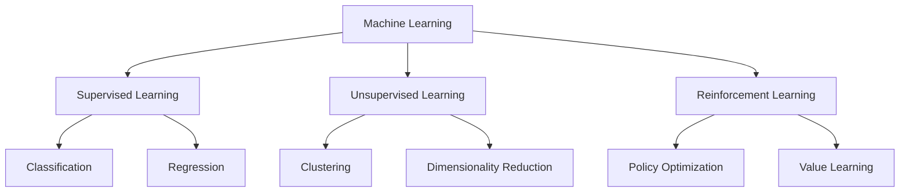
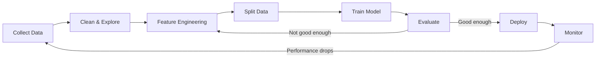
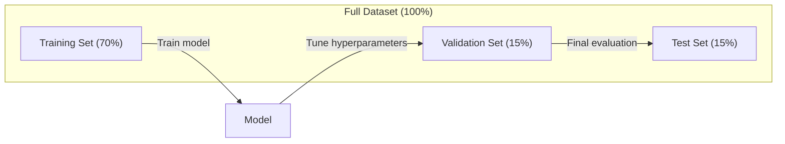
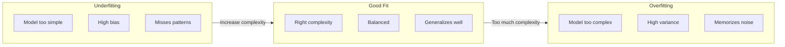
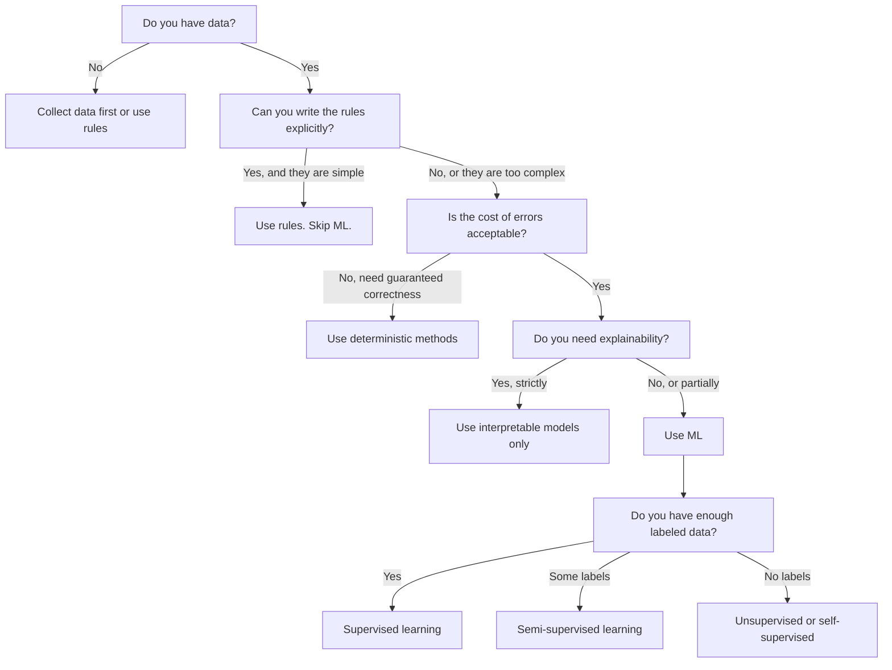

#                                                                                                                                                                                                                                                               

> Machine Learning là một cách máy tính tìm kiếm mô hình trong dữ liệu, chứ không phải là quy tắc viết tay.

**类型：**Học tập
**语言：**Python
**先修要求：**Giai đoạn 1 (Phương pháp toán học)
**时间：**45 phút

## Học mục tiêu

- 解释 sự khác biệt giữa việc học theo giám sát và không theo giám sát và tăng cường, và quyết định vấn đề phù hợp với loại nào
- Từ zero để đạt được phân loại trung tâm gần nhất, không sử dụng đường cơ sở ngẫu nhiên để đánh giá nó
- 区分 Classification 和 Regression 任务,并为每种任务选择合适的损失函数
-  đánh giá các vấn đề kinh doanh có phù hợp với việc sử dụng ML hay phù hợp hơn với các quy tắc xác định để giải quyết

## 问题

Bạn muốn xây dựng một bộ lọc thư rác. Phương pháp truyền thống là: ngồi xuống viết vài trăm quy tắc. Nếu thư có chứa 'TINHN PHÁN', đánh dấu nó là thư rác. Nếu nó có hơn 3 cảm叹号, đánh dấu nó là thư rác.

Machine Learning đã thay đổi cách này. Bạn không còn viết quy tắc, mà đưa cho máy tính hàng ngàn thư với nhãn hiệu: spam hoặc không spam, để nó tự tìm ra quy tắc. Cơ hội tính toán cho thấy bạn chưa bao giờ nghĩ đến một cách nào đó. Khi người gửi thư rác thay đổi chiến lược, bạn tập luyện lại với dữ liệu mới, thay vì viết lại mã.

Sự chuyển đổi từ quy tắc viết  đến chuyển đổi từ học tập từ dữ liệu, là cốt lõi của Machine Learning.

## 概念

### Học từ dữ liệu, thay vì học từ quy tắc

传统编程和机器学习 以相反的方向解决问题──



传统编程:你编写规则──程序把规则应用到数据上并产生输出──

Machine Learning: bạn cung cấp dữ liệu và kỳ vọng xuất khẩu.

 mô hình được đào tạo  本身就是规则,以数字形式编码(重量、参数) 

### Ba loại học máy



**Supervised Learning**Bạn có cặp đầu vào-phản xuất. mô hình học cách đưa vào, chiếu ra và ra.
-  Ở đây có 10.000 张 标签 cho những bức ảnh của mèo hoặc chó.
-  Ở đây có đặc điểm và giá nhà.

**Unsupervised Learning**Bạn chỉ có một cái tên. Không có nhãn.
-  Ở đây có 10.000 条客户购买历史──找出自然分组──
-  Ở đây có 1.000 维 của dữ liệu điểm.

**Reinforcement Learning**:agent trong môi trường thực hiện động tác,并 nhận phần thưởng hoặc hình phạt.
-  chơi trò chơi này. thắng +1, thua -1. tìm ra chiến lược.
-  kiểm soát tay máy này.  Nhấc vật lên.

Trong thực tế, phần lớn nội dung được xây dựng sẽ sử dụng Học tập được giám sát. Học tập không giám sát được sử dụng thường xuyên để xử lý và khám phá.

### 超越三大类型

Ba loại trên rất rõ ràng, nhưng trong thế giới thực ML thường gặp mờ giới hạn.

**Semi-supervised learning**Sử dụng một phần nhỏ dữ liệu được dán nhãn và một lượng lớn dữ liệu không dán nhãn. Bạn có thể có 100 张带标签的医学图像和 100,000 张未标签的图像.

- **Label propagation：**构建一个连接相似数据点的图――标签 通过图 从标签节点 传播到未标签邻居――
- **Pseudo-labeling：**Trong dữ liệu được dán nhãn 上训练模型, sử dụng nó dự đoán nhãn dữ liệu không dán nhãn, sau đó trong toàn bộ dữ liệu tái tập luyện.
- **Consistency regularization：**Đối với một đầu vào và phiên bản dễ bị nhiễu, mô hình nên đưa ra dự đoán tương tự.

**Self-supervised learning**Từ dữ liệu tự tạo giám sát. hoàn toàn không cần nhãn nhân tạo.

- **Masked language modeling (BERT)：**隐藏句中 15% 的词,训练模型 预测缺失的词──标签 来自原始文本──
- **Contrastive learning (SimCLR)：**取一张图像, tạo hai phiên bản tăng cường. 训练模型 识别它们来自同一张图像, đồng thời phân biệt chúng với các phiên bản tăng cường của các hình ảnh khác.
- **Next-token prediction (GPT)：**给定前面所有词,预测下一个词――每个文本文档都将成为一个训练样本――

Những thứ này không độc lập với các loại ngoài ba loại lớn. Chúng là kết hợp của các chiến lược của suy nghĩ giám sát và không giám sát. Học tự giám sát trong kỹ thuật thuộc về các mô hình giám sát, nhưng nhãn là tự tạo, không phải là đánh dấu của con người.

### Định dạng so với sự lùi

Đây là hai nhiệm vụ học tập giám sát chính.

| 方面 | Classification | Regression |
|--------|---------------|------------|
| 输出 | 离散类别 | 连续数值 |
| 示例 | “这封邮件是垃圾邮件吗？” | “房价会是多少？” |
| 输出空间 | {cat, dog, bird} | 任意实数 |
| Loss Function | Cross-entropy, accuracy | Mean squared error, MAE |
| 决策 | 类别之间的边界 | 拟合数据的曲线 |

Phân loại 回答 thuộc vào loại nào?

Một số vấn đề có thể được thể hiện bằng hai cách.

### ML 工作流

Mỗi dự án Machine Learning đều theo cùng một đường ống dẫn, bất kể sử dụng bất kỳ thuật toán nào.



**Collect Data**Thu thập dữ liệu nguyên thủy. Nhiều dữ liệu hơn hầu như luôn tốt hơn, nhưng chất lượng quan trọng hơn số lượng.

**Clean & Explore**: xử lý thiếu giá trị, xóa các dự án tái lập, phân bố hình ảnh, phát hiện bất thường.

**Feature Engineering**:把原始数据转换成模型可用功能──把日期转换为星期几──归结数值列──编码类别变量── tốt hơn các thuật toán quan trọng hơn──

**Split Data**: chia chia cho đào tạo, xác nhận và tập hợp thử nghiệm. mô hình trong dữ liệu đào tạo. 上训练, bạn trong dữ liệu xác nhận. 上调 siêu tham số.

**Train Model**:把 training data 输入算法──算法调整内部参数,以最小化 Loss Function──

**Evaluate**Trong dữ liệu xác thực/thử nghiệm, bạn có thể kiểm tra hiệu suất nếu hiệu suất không thể chấp nhận được.

**Deploy**: đưa mô hình vào môi trường sản xuất, để nó được dự đoán dữ liệu mới.

**Monitor**: tiếp tục theo dõi hiệu suất, phân phối dữ liệu thay đổi, mô hình bị giảm, khi hiệu suất giảm, tái tập.

### Việc đào tạo, xác nhận và kiểm tra

Đây là khái niệm quan trọng dễ dàng nhất cho người mới bắt đầu hiểu sai. Bạn phải đánh giá trên mô hình dữ liệu chưa từng thấy trong quá trình tập luyện. Nếu không, bạn sẽ đo lường là trí nhớ, chứ không phải học tập.



| 划分 | 目的 | 使用时机 | 典型大小 |
|-------|---------|-----------|-------------|
| Training | model 从这些数据中学习 | 训练期间 | 60-80% |
| Validation | 调整 hyperparameter、比较 model | 每次训练运行之后 | 10-20% |
| Test | 最终无偏 performance 估计 | 只在最后使用一次 | 10-20% |

Bộ thử nghiệm là thánh. Bạn chỉ có thể xem nó một lần. Nếu bạn liên tục theo kết quả thử nghiệm.

Đối với tập dữ liệu nhỏ, sử dụng xác thực chéo k-fold:把数据分成 k 份, trong k-1 份训练, trong còn lại 1 份验证,轮换,并对结果取平均――

### Overfitting vs Underfitting



**Underfitting**:model 太简单,无法捕捉中的模式――就像用一条直线去适应曲关系――训练错误 高――测试错误 也高――

**Overfitting**: mô hình quá phức tạp, ghi nhớ dữ liệu đào tạo, bao gồm cả tiếng ồn.

**Good fit**: mô hình 捕捉真实模式,而不记忆噪音──训练错误 和测试错误 都相对较低──

Các dấu hiệu của sự quá phù hợp:
- Độ chính xác đào tạo 远高于 độ chính xác xác thực hiện
- Mô hình trong dữ liệu đào tạo hoạt động tốt, nhưng trong dữ liệu mới hoạt động rất kém
- 增加更多训练数据 会提升性能(model 原本 là ghi nhớ, thay vì học)

修复 Overfit:
- 获取更多培训数据
- 降低模型复杂性 ((更少参数、更简单架构)
- Chuẩn bị quy định (trong trọng lượng lớn hơn)
- Trượt học (trenings)
- Đỗ dừng sớm ((当验证错误 开始上升时停止训练)

修复 không phù hợp:
- Sử dụng mô hình phức tạp hơn
- 添加更多 tính năng
- 降低 quy định
- 训练更久

### Sự phân biệt đối xử giữa các biến thể

Đó là khung toán học sau quá phù hợp và quá phù hợp.

**Bias**: từ mô hình 错假设的错误──当真相关系非线性时, mô hình tuyến tính sẽ có thiên vị cao── thiên vị cao sẽ dẫn đến sự thiếu phù hợp──

**Variance**: từ dữ liệu đào tạo 中微小波动敏感性的错误――高变化模型 在不同数据集上训练时, sẽ đưa ra rất khác biệt dự đoán――高变化会导致过――

| Model complexity | Bias | Variance | 结果 |
|-----------------|------|----------|--------|
| 过低（用 linear model 拟合弯曲数据） | High | Low | Underfitting |
| 刚好合适 | Medium | Medium | 良好的 generalization |
| 过高（用 degree-20 polynomial 拟合 10 个点） | Low | High | Overfitting |

总 error = Bias^2 + Variance + noise không thể tránh khỏi

Bạn không thể giảm tiếng ồn không thể giảm được. Nó là tự nhiên của dữ liệu. Bạn cần tìm ra để tạo ra sự thiên vị 2 + sự khác biệt.

### Không có lý thuyết bữa trưa miễn phí

Không có một thuật toán đơn nhất tốt nhất đối với tất cả các vấn đề. Trong một loại vấn đề, một thuật toán hoạt động tốt, trong một loại vấn đề khác có thể hoạt động kém.

实践中, chọn取决于:
- Bạn có bao nhiêu dữ liệu
- Có nhiều tính năng
- Quan hệ là tuyến tính hay không tuyến tính
- Có phải cần sự giải thích
- Bạn có thể chịu đựng bao nhiêu tài nguyên tính toán

### 什么时候不要使用机器学习

ML rất mạnh mẽ, nhưng không phải là một công cụ chính xác. Trước khi sử dụng mô hình, hãy tự hỏi mình liệu mình có thực sự cần nó hay không.

**不要在以下情况下使用 ML：**

- **规则简单且定义明确。**税费计算、排序算法、单位转换―― nếu bạn có thể sử dụng một số if-statement 写出逻辑, mô hình sẽ chỉ tăng độ phức tạp, mà không có lợi ích―
- **你没有数据或数据很少。**ML cần học từ mẫu. Chỉ có 10 điểm dữ liệu, không thể luyện tập để có ý nghĩa gì đó.
- **错误成本是灾难性的，并且你需要保证正确性。** tính liều  kiểm soát  phản ứng hạt nhân  mật mã học                                                                                                                                                                                                                                                      
- **lookup table 或 heuristic 可以解决问题。**Nếu một ngưỡng đơn giản hoặc bảng ấp ủ 99% tình huống, thêm ML sẽ tăng chi phí bảo trì, nhưng không có cải tiến có ý nghĩa.
- **你无法解释决策，而 explainability 又是必需的。**Được giám sát ngành công nghiệp (借贷,保险,刑事司法) đôi khi yêu cầu mỗi quyết định đều có thể được giải thích đầy đủ. Có một số mô hình ML là có thể giải thích.
- **问题变化得比你重新训练还快。**Nếu luật lệ thay đổi mỗi ngày, và luyện tập lại cần một tuần, mô hình sẽ luôn là quá khứ.

Sử dụng biểu đồ dòng chảy quyết định này:




```figure
f3-learning-boundary
```

##  xây dựng nó

`code/ml_intro.py`Mã trung tâm từ zero thực hiện một phân loại trung tâm gần nhất, đây là thuật toán ML đơn giản nhất. Nó cho thấy ý tưởng cốt lõi: học từ dữ liệu, sau đó dự đoán dữ liệu mới.

### 步骤 1: Từ zero thực hiện Classifier trung tâm gần nhất

Classifier trung tâm gần nhất 会计算训练数据 中每个类的中心 (中) △平均) △预测时, nó sẽ phân bổ từng điểm mới cho mỗi lớp thuộc về khoảng cách gần trung tâm △

```python
class NearestCentroid:
    def fit(self, X, y):
        self.classes = np.unique(y)
        self.centroids = np.array([
            X[y == c].mean(axis=0) for c in self.classes
        ])

    def predict(self, X):
        distances = np.array([
            np.sqrt(((X - c) ** 2).sum(axis=1))
            for c in self.centroids
        ])
        return self.classes[distances.argmin(axis=0)]
```

Đây là toàn bộ thuật toán. FIT 计算两个意思. 预测 计算距离.

### 步骤 2: trong dữ liệu tổng hợp 上训练

Chúng tôi tạo ra một bộ dữ liệu phân loại 2D, trong đó hai lớp có một lớp phân loại trung tâm sẽ vẽ một ranh giới quyết định tuyến tính giữa trung tâm lớp.

```python
rng = np.random.RandomState(42)
X_class0 = rng.randn(100, 2) + np.array([1.0, 1.0])
X_class1 = rng.randn(100, 2) + np.array([-1.0, -1.0])
X = np.vstack([X_class0, X_class1])
y = np.array([0] * 100 + [1] * 100)
```

### 步骤 3: So sánh với Baseline

Mỗi mô hình ML nên được so sánh với một cơ sở nhỏ bé.

```python
baseline_preds = rng.choice([0, 1], size=len(y_test))
baseline_acc = np.mean(baseline_preds == y_test)
```

Trong bộ dữ liệu này, phân loại trung tâm nên đạt được độ chính xác 90% +.

### Tại sao điều này quan trọng

Classifier trung tâm gần nhất 极其简单―― nó không có siêu tham số, không có lặp lại, không có Gradient Descent―― nhưng nó nắm bắt cơ bản ML 模式:

1. Từ dữ liệu đào tạo**学习**一种表示(trung tâm)
2. Sử dụng để biểu thị cho dữ liệu mới**预测**(cái cách gần nhất)
3. Với đường cơ sở**评估**(随机猜测)

Mỗi thuật toán ML, từ sự lùi hậu cần đến các biến thể, đều theo cùng một mô hình ba bước.

### 步骤 4: Centroid Classifier làm gì không đến gì

Cân loại trung tâm gần nhất  giả định mỗi lớp đều hình thành một khối đơn lẻ── nó vẽ ra là ranh giới quyết định tuyến tính── nó sẽ thất bại trong các trường hợp sau:

- lớp có nhiều cluster (ví dụ như số 1 có thể được sử dụng nhiều cách khác nhau để viết)
- Biên giới quyết định là không tuyến tính (ví dụ: một lớp  bao quanh một lớp khác)
- tính năng của quy mô 差异很大(距离 被最大规模的 tính năng 主导)

Những hạn chế này đưa ra tất cả các thuật toán khác bạn sẽ học. Các hàng xóm gần nhất của K có thể xử lý nhiều cluster. Cây quyết định có thể xử lý ranh giới không tuyến tính.

## Sử dụng nó

sklearn  cung cấp `NearestCentroid`Và máy phát dữ liệu tổng hợp:

```python
from sklearn.neighbors import NearestCentroid
from sklearn.datasets import make_classification
from sklearn.model_selection import train_test_split

X, y = make_classification(
    n_samples=500, n_features=2, n_redundant=0,
    n_clusters_per_class=1, random_state=42
)
X_train, X_test, y_train, y_test = train_test_split(X, y, test_size=0.3)

clf = NearestCentroid()
clf.fit(X_train, y_train)
print(f"Accuracy: {clf.score(X_test, y_test):.3f}")
```

## 交付 nó

本课会生成 `outputs/prompt-ml-problem-framer.md`, đây là một vấn đề kinh doanh nhanh chóng, có thể chuyển thành một nhiệm vụ ML cụ thể. Hãy cho nó một mô tả vấn đề. Chúng tôi muốn giảm churn  hoặc  dự đoán nhu cầu cho quý tiếp theo.

## 关键术语

| 术语 | 人们常说 | 实际含义 |
|------|----------------|----------------------|
| Model | “The AI” | 一个带有可学习 parameter 的数学函数，用于把输入映射到输出 |
| Training | “Teaching the AI” | 运行 optimization algorithm 来调整 model parameter，使预测匹配已知输出 |
| Feature | “An input column” | 数据中可测量的属性，model 用它进行预测 |
| Label | “The answer” | training example 的已知输出，用于计算 error signal |
| Hyperparameter | “A setting you tweak” | 训练前设置的 parameter，用于控制学习过程（learning rate、layer 数量） |
| Loss Function | “How wrong the model is” | 衡量预测输出与实际输出之间差距的函数，训练会尝试将其最小化 |
| Overfitting | “It memorized the test” | model 学到了 training-specific noise，而不是通用模式，因此在新数据上失败 |
| Underfitting | “It didn't learn anything” | model 太简单，无法捕捉数据中的真实模式 |
| Generalization | “It works on new data” | model 对未训练过的数据做出准确预测的能力 |
| Cross-validation | “Testing on different chunks” | 反复把数据拆分为 train/test fold 并对结果取平均，从而得到更稳健的 performance 估计 |
| Regularization | “Keeping weights small” | 向 Loss Function 添加 penalty term，以抑制过于复杂的 model |
| Data drift | “The world changed” | 传入数据的统计分布随时间发生变化，导致 model performance 下降 |

## 练习

1. 选择任意数据集 (例如 Iris、Titanic) ⋅按 70/15/15 拆分为火车/验证/测试──解释为什么不应该在测试集 上调超参数──
2. 列出三个真世界问题──对每个问题,判断它是分类,退缩还是集群,以及它是监督还是没有监督──
3. Một mô hình trong dữ liệu đào tạo đạt độ chính xác 99%, nhưng trong dữ liệu thử nghiệm chỉ có 60%  Các vấn đề chẩn đoán,并列出三种修复方法你会尝试──

## 延伸阅读

- [An Introduction to Statistical Learning](https://www.statlearning.com/)- 免费教材, bao gồm tất cả các phương pháp ML cổ điển,并配有实践示例
- [Google's Machine Learning Crash Course](https://developers.google.com/machine-learning/crash-course)- Khởi đầu về khái niệm ML
- [Scikit-learn User Guide](https://scikit-learn.org/stable/user_guide.html)- Khả năng thực tế của ML trong Python
