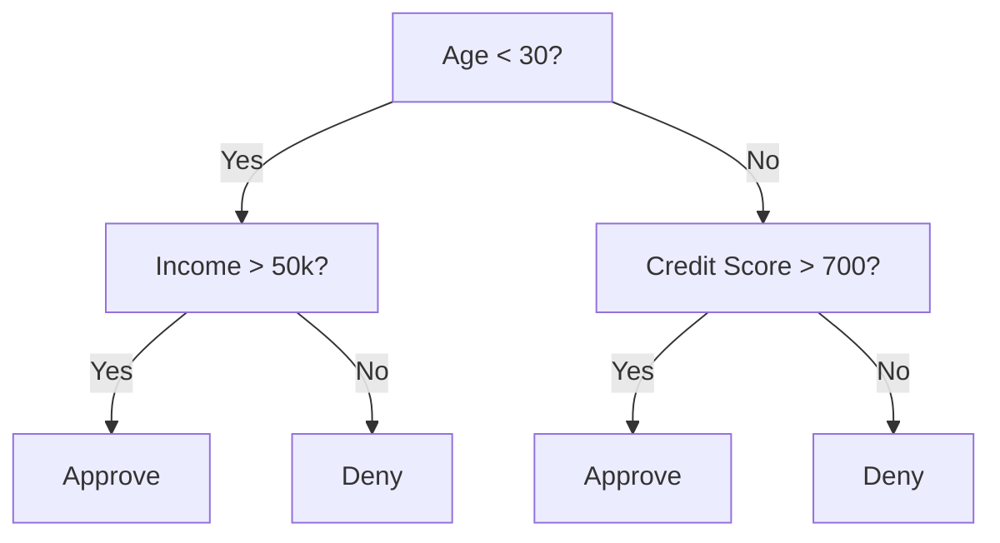
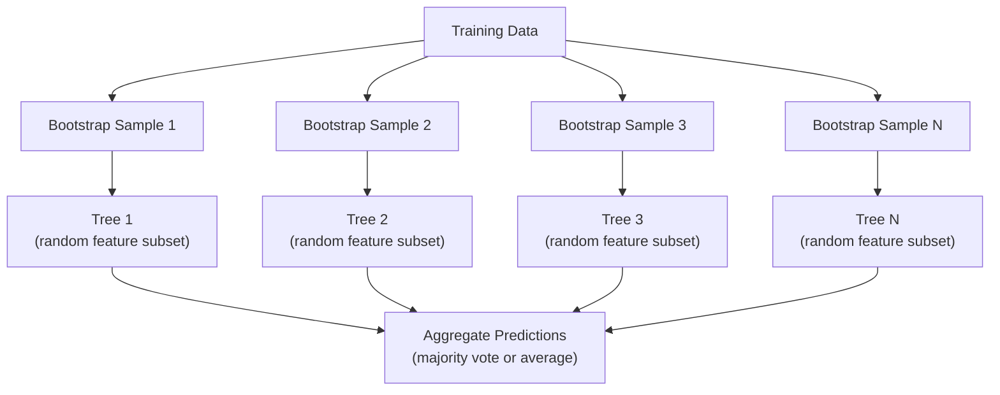

# Cây quyết định và rừng ngẫu nhiên

> Cây quyết định chỉ là một biểu đồ quy trình. Nhưng một khu rừng được tạo thành từ nhiều cây, là một trong những công cụ mạnh nhất trong ML.

**类型：**Xây dựng
**语言：**Python
**先修要求：**Giai đoạn 1 ((Dạy 09 Lý thuyết thông tin, 06 xác suất)
**时间：**约90分钟

## Học mục tiêu

- 实现 Gini impurity、entropy 和 information gain 计算, để tìm ra phân chia cây quyết định tốt nhất
- Từ零 cấu trúc một phân loại cây quyết định,并加入 tiền cắt 控制(max depth、min mẫu)
- Sử dụng bootstrap lấy mẫu và tính năng ngẫu nhiên  xây dựng rừng ngẫu nhiên,并 giải thích tại sao nó có thể giảm sự khác biệt
- So sánh tầm quan trọng của tính năng MDI với tầm quan trọng của permutation,并识别 MDI

## 问题

Bạn có dữ liệu bảng xếp hạng, đây là tính năng, còn có một cột mục tiêu bạn muốn dự đoán. Bạn có thể trực tiếp lên một mạng Neural. Nhưng đối với dữ liệu bảng xếp hạng, các mô hình dựa trên cây.

Tại sao?Cây  không cần quá trình xử lý trước 就能处理混合特征 类型(数和类)  Chúng không cần kỹ thuật tính năng 就能处理非线性关系── Chúng có khả năng giải thích: Bạn có thể xem cây, chính xác thấy một dự đoán nào đó là làm thế nào xảy ra── Trong khi rừng ngẫu nhiên 会 đối với nhiều cây 求平均, đối với một tập hợp dữ liệu quy mô trung bình trên của quá trình lắp ráp 具有很强的抗力──

Bài học này sẽ sử dụng phân chia lặp lại từ zero xây dựng cây quyết định, sau đó xây dựng rừng ngẫu nhiên trên đó. Bạn sẽ thực hiện các tiêu chí phân chia sau toán học.

## 核心概念

### Cây quyết định làm gì

Cây quyết định 通过提出一系列 yes/no 问题,把 feature space 划分为矩形区域──



Mỗi nút nội bộ sẽ sử dụng một ngưỡng 测试某个特征―― mỗi nút lá làm dự đoán―― để phân loại một điểm dữ liệu mới, bạn bắt đầu từ gốc, dọc theo các nhánh tiến tới, cho đến khi đạt đến một lá――

Cây 通过上下 方式构建: 在每个节点, chọn các tính năng và ngưỡng phân chia dữ liệu nhất.

### Các tiêu chí chia: đo lường tạp chất

Ở mỗi nút, chúng tôi có một nhóm mẫu. Chúng tôi muốn chúng được chia để tạo ra các nút trẻ 尽可能pure, đó là mỗi đứa trẻ chủ yếu bao gồm một lớp.

**Gini impurity**Đường là: Nếu theo phân phối lớp của nút này  đưa cho một nhãn 贴 mẫu tùy chọn, nó sẽ bị phân loại sai 👍

```
Gini(S) = 1 - sum(p_k^2)

where p_k is the proportion of class k in set S.
```

Đối với các node tinh khiết (tất cả thuộc cùng một lớp), Gini = 0。 đối với phân chia nhị phân của các lớp 50/50, Gini = 0.5。越低越好。

```
Example: 6 cats, 4 dogs

Gini = 1 - (0.6^2 + 0.4^2) = 1 - (0.36 + 0.16) = 0.48
```

**Entropy**衡节 中的信息量(混乱程度) ――Phase 1 Bài học 09 已覆盖──

```
Entropy(S) = -sum(p_k * log2(p_k))
```

Đối với nút tinh khiết, entropy = 0。 đối với phân chia nhị phân 50/50, entropy = 1.0。越低越好。

```
Example: 6 cats, 4 dogs

Entropy = -(0.6 * log2(0.6) + 0.4 * log2(0.4))
        = -(0.6 * -0.737 + 0.4 * -1.322)
        = 0.442 + 0.529
        = 0.971 bits
```

**Information gain**là chia  hậu tạp hóa (entropy hoặc Gini) giảm lượng.

```
IG(S, feature, threshold) = Impurity(S) - weighted_avg(Impurity(S_left), Impurity(S_right))

where the weights are the proportions of samples in each child.
```

Mỗi nút trên của tham lam thuật toán: cố gắng mỗi tính năng và mỗi có thể ngưỡng.`(feature, threshold)`组合──

### Chia 如何工作

Đối với hiện tại nút 上 chứa n 个 tính năng m 个 mẫu của bộ dữ liệu:

1. Đối với mỗi tính năng j ((j = 1 đến n):
   - 按 tính năng j đối với các mẫu 排序
   - sẽ tương ứng với mỗi điểm trung bình giữa các giá trị khác nhau như ngưỡng
   - 计算 mỗi ngưỡng thu nhập thông tin
2.  chọn thông tin thu nhập tính năng và ngưỡng cao nhất
3. 将数据 chia thành bên trái (tài năng <= ngưỡng) và bên phải (tài năng > ngưỡng)
4. Đối với mỗi trẻ em

Cách này không đảm bảo được toàn bộ cây tốt nhất. Tìm kiếm cây tốt nhất là NP-khó.

### 停止条件

Nếu không ngừng điều kiện, cây sẽ tiếp tục phát triển, cho đến khi mỗi lá đều sạch, mỗi lá một mẫu)

**Pre-pruning**会在树上 完全长成之前停止:
- Độ sâu tối đa:当 tree  đạt được độ sâu được thiết lập 时停止分裂
- Mức mẫu tối thiểu trên mỗi lá: Nếu một nút nhỏ hơn k, thì dừng lại
- Lợi ích thông tin tối thiểu: Nếu phân chia tốt nhất đối với sự cải thiện của sự sa thải nhỏ hơn một ngưỡng nào đó, thì dừng lại
- Số lượng nút lá tối đa: giới hạn tổng số lá

**Post-pruning**Trước tiên tạo ra cây hoàn chỉnh, sau đó quay lại và cắt:
- Cổ phần phức tạp chi phí: thêm một cây với lá số lượng thành tỷ lệ chính xác.
- Giảm lỗi cắt: Nếu di chuyển một cây phụ sẽ không tăng lỗi xác thực, hãy di chuyển nó

Pre-cutting 更简单也更快──Post-cutting thường có thể tạo ra cây tốt hơn, vì nó sẽ không dừng quá sớm những ránh sau đó có thể mang lại chia rẽ hữu ích.

### Sử dụng cây quyết định của sự lùi

Đối với sự lùi, dự đoán lá là trung bình của các giá trị mục tiêu trong lá này.

**Variance reduction**替代 thu nhập thông tin:

```
VR(S, feature, threshold) = Var(S) - weighted_avg(Var(S_left), Var(S_right))
```

选择使变化 降低最多的分化―― Tree 会把输入空间 划分为多个区域,并预测一个常数 (平均值) 在每个区域中预测一个常数 (平均值) ――

### Rừng ngẫu nhiên: lực lượng của tập thể

单树决策树 具有高变化──数据中的微小变化可能产生完全不同的树木──随机森林 通过许多树木 寻求平均来解决这个问题──



2 loại tình cờ làm cho cây có nhiều tính cách:

**Bagging（bootstrap aggregating）：**Mỗi cây đều có trong một mẫu bootstrap 上训练, tức là trong dữ liệu đào tạo có được có được được trả lại theo thời gian rút lấy mẫu.

**Feature randomization：**Trong mỗi lần phân chia, chỉ cần xem xét một bộ phụ thuộc tính năng tùy chọn. Đối với phân loại,默认是 sqrt(n_features)  Đối với sự trượt, là n_features/3── điều này sẽ ngăn chặn tất cả các cây đều ở trong cùng một tính năng thống trị trên phân chia.

关键洞见: đối với nhiều cây không liên kết 求平均, có thể giảm sự khác biệt trong trường hợp không tăng thiên vị ︎ ︎ ︎ ︎ ︎ ︎ ︎ ︎ ︎ ︎ ︎ ︎ ︎ ︎ ︎ ︎ ︎ ︎ ︎ ︎ ︎ ︎ ︎ ︎ ︎ ︎ ︎ ︎ ︎ ︎ ︎ ︎ ︎ ︎ ︎ ︎ ︎ ︎ ︎ ︎ ︎ ︎ ︎ ︎ ︎ ︎ ︎ ︎ ︎ ︎ ︎ ︎ ︎ ︎ ︎ ︎ ︎ ︎ ︎ ︎ ︎ ︎ ︎ ︎ ︎ ︎ ︎ ︎ ︎ ︎ ︎ ︎ ︎ ︎ ︎ ︎ ︎ ︎ ︎ ︎ ︎ ︎ ︎ ︎ ︎ ︎ ︎ ︎ ︎ ︎ ︎ ︎ ︎ ︎ ︎ ︎ ︎ ︎ ︎ ︎ ︎ ︎ ︎ ︎ ︎ ︎ ︎

### Tầm quan trọng của tính năng

Rừng ngẫu nhiên 天然 cung cấp tính năng điểm số tầm quan trọng.

**Mean Decrease in Impurity (MDI)：**Đối với mỗi tính năng, tất cả các cây trong tất cả các nút sử dụng tính năng này 带来的 sự giảm tạp hóa 总量── trong các phân chia sớm hơn 带来了更大的污染减少的特征更重要──

```
importance(feature_j) = sum over all nodes where feature_j is used:
    (n_samples_at_node / n_total_samples) * impurity_decrease
```

Phương pháp này rất nhanh (trong thời gian tập luyện có thể tính toán), nhưng sẽ hướng đến các tính năng có tính năng cardinality cao cũng như có nhiều tính năng có thể chia rẽ điểm.

**Permutation importance**là một cách khác:打乱某个特征的值,并衡量模型精度下降了多少――它更可靠,但更慢――

### Cây 何时胜过 Neural Network

Cây và rừng trong dữ liệu bảng xếp hạng trên thường vượt qua mạng thần kinh. Có một số lý do:

| Factor | Trees | Neural networks |
|--------|-------|----------------|
| Mixed types (numeric + categorical) | 原生支持 | 需要 encoding |
| Small datasets (< 10k rows) | 表现良好 | 容易 overfit |
| Feature interactions | 通过 splitting 找到 | 需要 architecture design |
| Interpretability | 完全透明 | Black box |
| Training time | 分钟级 | 小时级 |
| Hyperparameter sensitivity | 低 | 高 |

Khi dữ liệu có cấu trúc không gian hoặc theo trình tự ([[ hình ảnh]], văn bản、 âm thanh) 时, Neural Networks 更强── đối với các bảng tính năng bình thường, cây là một lựa chọn默认──


```figure
decision-tree-depth
```

##  xây dựng nó

### 步骤 1:Tế độ xơ và entropy

Từ zero cấu trúc hai tiêu chí phân chia này,并验证 chúng phù hợp với phân chia nào là đánh giá tốt về phân chia.

```python
import math

def gini_impurity(labels):
    n = len(labels)
    if n == 0:
        return 0.0
    counts = {}
    for label in labels:
        counts[label] = counts.get(label, 0) + 1
    return 1.0 - sum((c / n) ** 2 for c in counts.values())

def entropy(labels):
    n = len(labels)
    if n == 0:
        return 0.0
    counts = {}
    for label in labels:
        counts[label] = counts.get(label, 0) + 1
    return -sum(
        (c / n) * math.log2(c / n) for c in counts.values() if c > 0
    )
```

### 步骤 2: tìm ra chia tốt nhất

尝试每个功能 和每个门── trả lại thông tin thu nhập cao nhất.

```python
def information_gain(parent_labels, left_labels, right_labels, criterion="gini"):
    measure = gini_impurity if criterion == "gini" else entropy
    n = len(parent_labels)
    n_left = len(left_labels)
    n_right = len(right_labels)
    if n_left == 0 or n_right == 0:
        return 0.0
    parent_impurity = measure(parent_labels)
    child_impurity = (
        (n_left / n) * measure(left_labels) +
        (n_right / n) * measure(right_labels)
    )
    return parent_impurity - child_impurity
```

### 步骤 3: xây dựng DecisionThẻ

Sự phân chia tái phát, dự đoán và theo dõi tính năng quan trọng.

```python
class DecisionTree:
    def __init__(self, max_depth=None, min_samples_split=2,
                 min_samples_leaf=1, criterion="gini",
                 max_features=None):
        self.max_depth = max_depth
        self.min_samples_split = min_samples_split
        self.min_samples_leaf = min_samples_leaf
        self.criterion = criterion
        self.max_features = max_features
        self.tree = None
        self.feature_importances_ = None

    def fit(self, X, y):
        self.n_features = len(X[0])
        self.feature_importances_ = [0.0] * self.n_features
        self.n_samples = len(X)
        self.tree = self._build(X, y, depth=0)
        total = sum(self.feature_importances_)
        if total > 0:
            self.feature_importances_ = [
                fi / total for fi in self.feature_importances_
            ]

    def predict(self, X):
        return [self._predict_one(x, self.tree) for x in X]
```

### 步骤 4: xây dựng lớp RandomForest

Bootstrap lấy mẫu, tính năng ngẫu nhiên và bỏ phiếu đa số.

```python
class RandomForest:
    def __init__(self, n_trees=100, max_depth=None,
                 min_samples_split=2, max_features="sqrt",
                 criterion="gini"):
        self.n_trees = n_trees
        self.max_depth = max_depth
        self.min_samples_split = min_samples_split
        self.max_features = max_features
        self.criterion = criterion
        self.trees = []

    def fit(self, X, y):
        n = len(X)
        for _ in range(self.n_trees):
            indices = [random.randint(0, n - 1) for _ in range(n)]
            X_boot = [X[i] for i in indices]
            y_boot = [y[i] for i in indices]
            tree = DecisionTree(
                max_depth=self.max_depth,
                min_samples_split=self.min_samples_split,
                max_features=self.max_features,
                criterion=self.criterion,
            )
            tree.fit(X_boot, y_boot)
            self.trees.append(tree)

    def predict(self, X):
        all_preds = [tree.predict(X) for tree in self.trees]
        predictions = []
        for i in range(len(X)):
            votes = {}
            for preds in all_preds:
                v = preds[i]
                votes[v] = votes.get(v, 0) + 1
            predictions.append(max(votes, key=votes.get))
        return predictions
```

完整实现及所有助手方法 见 `code/trees.py`

## Sử dụng nó

Sử dụng scikit-làm bài học, tập rừng ngẫu nhiên chỉ cần ba行:

```python
from sklearn.ensemble import RandomForestClassifier
from sklearn.datasets import load_iris
from sklearn.model_selection import train_test_split

X, y = load_iris(return_X_y=True)
X_train, X_test, y_train, y_test = train_test_split(X, y, random_state=42)

rf = RandomForestClassifier(n_estimators=100, random_state=42)
rf.fit(X_train, y_train)
print(f"Accuracy: {rf.score(X_test, y_test):.4f}")
print(f"Feature importances: {rf.feature_importances_}")
```

Trong thực tế, cây tăng cường cấp độ thường mạnh hơn rừng ngẫu nhiên, vì chúng được xây dựng theo thứ tự, mỗi cây đều có lỗi trong sửa chữa trước mặt cây.

## 交付 nó

本课会产出 `outputs/prompt-tree-interpreter.md`, đây là một lời nhắc được sử dụng cho các bên liên quan đến doanh nghiệp để giải thích sự chia rẽ của cây quyết định. Để đưa vào nó cấu trúc của cây đã được đào tạo.

## 练习

1. Trong một tập dữ liệu 2D có chứa 3 lớp, trên tập trung một cây quyết định.

2. 为 hồi quy cây 实现变量减少分化――为 200 个点生成 y = sin(x) + noise,并拟合你的回归树――将树的碎片式-常数预测与真实曲线一起绘图――

3. 构建包含1、5、10、50 和 200 树的随机森林──绘制训练精度和测试精度 随着树木数量变化的曲线──观察测试精度 会达到平台期,但不会下降──森林 抵抗过)──

4. Trong 5 bộ dữ liệu khác nhau, các kết quả gần như giống nhau được tạo ra.

5. 实现 permutation importance──在一个数据集上将它与MDI重要性比较, một trong những tính năng đó là tiếng ồn ngẫu nhiên, nhưng có tính cardinality cao──MDI 会把噪音 tính năng 排得很高──Permutation importance 不会──

## 关键术语

| Term | 人们常说 | 实际含义 |
|------|----------------|----------------------|
| Decision tree | “用于 predictions 的流程图” | 一种通过学习一系列 if/else splits，将 feature space 划分为矩形区域的 model |
| Gini impurity | “node 有多混杂” | 在某个 node 上 misclassify 一个 random sample 的概率。0 = pure，0.5 = binary 情况下的最大 impurity |
| Entropy | “node 中的混乱程度” | node 上的信息量。0 = pure，1.0 = binary 情况下的最大 uncertainty。来自 information theory |
| Information gain | “split 有多好” | split 后 impurity 的降低量。用于选择 splits 的 greedy criterion |
| Pre-pruning | “提前停止 tree” | 通过设置 max depth、min samples 或 min gain thresholds，提前停止 tree growth |
| Post-pruning | “事后修剪 tree” | 先生成完整 tree，再移除不会提升 validation performance 的 subtrees |
| Bagging | “在随机 subsets 上训练” | Bootstrap aggregating。在不同的有放回 random sample 上训练每个 model |
| Random forest | “一堆 trees” | Decision trees 的 ensemble，每棵 tree 都在 bootstrap sample 上训练，并在每次 split 使用 random feature subsets |
| Feature importance (MDI) | “哪些 features 重要” | 每个 feature 贡献的总 impurity decrease，在所有 trees 和 nodes 上求和 |
| Permutation importance | “打乱后检查” | 随机打乱某个 feature 的 values 时 accuracy 的下降量。对于 noisy features，比 MDI 更可靠 |
| Variance reduction | “info gain 的 regression 版本” | Information gain 的 regression tree 对应形式。选择使 target variance 降低最多的 split |
| Bootstrap sample | “带重复的 random sample” | 从原始 dataset 中有放回抽取得到的 random sample。大小相同，但包含 duplicates |

## 延伸阅读

- [Breiman: Random Forests (2001)](https://link.springer.com/article/10.1023/A:1010933404324)- 原始随机森林 论文
- [Grinsztajn et al.: Why do tree-based models still outperform deep learning on tabular data? (2022)](https://arxiv.org/abs/2207.08815)- 关于树木 vs Neural Networks trong các nhiệm vụ bảng xếp hạng
- [scikit-learn Decision Trees documentation](https://scikit-learn.org/stable/modules/tree.html)- 带 hình ảnh dụng cụ của thực hành chỉ dẫn
- [XGBoost: A Scalable Tree Boosting System (Chen & Guestrin, 2016)](https://arxiv.org/abs/1603.02754)- 主导 Kaggle' s gradient boosting 论文
