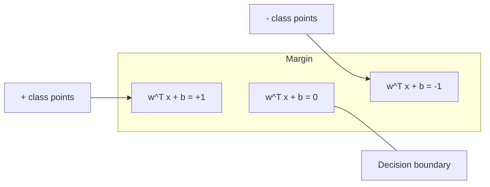
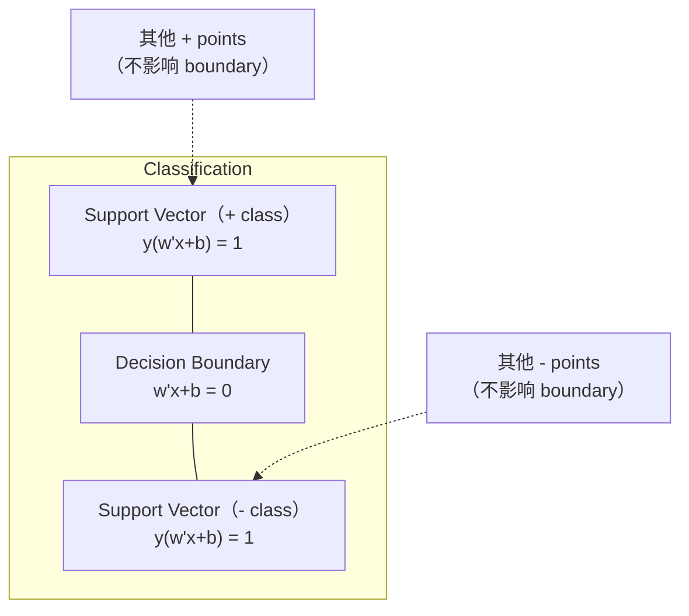
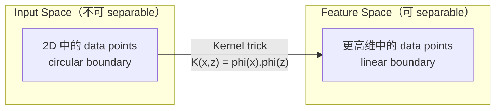

# Máy hỗ trợ vector

> Trong hai loại tìm thấy đường phố rộng nhất. Đó là toàn bộ ý tưởng.

**Type:** Build
**Language:**Python
**先修要求：**Giai đoạn 1 ((Dạy học 08 Tối ưu hóa, 14 tiêu chuẩn và khoảng cách, 18 Tối ưu hóa ngọc)
**Time:** ~90 分钟

## Học mục tiêu
- Sử dụng mất vòng xoắn và công thức nguyên tố trên của sự giảm gradient, từ không thực hiện một SVM tuyến tính
- 解释 nguyên tắc biên tối đa,并从训练好的模型中识别支持向量
- So sánh các hạt nhân tuyến tính, đa nôn và RBF, và giải thích thủ thuật hạt nhân  làm thế nào để tránh hiển nhiên của high维映射
-  đánh giá bởi tham số C  kiểm soát chiều rộng biên và lỗi phân loại  cân bằng

## 问题
Bạn có hai loại điểm dữ liệu, cần vẽ một đường thẳng (hoặc siêu phẳng) để phân chia chúng. Có thể có vô hạn nhiều đường dẫn để làm điều đó. Bạn nên chọn một đường nào?

选择边界 最大的那一条──margin là ranh giới quyết định với khoảng cách giữa hai bên gần nhất dữ liệu điểm──宽的边界意味着分类者更有信心,并且能更好地概括到未见数据──

Sự trực tiếp này đã đưa ra các Máy hỗ trợ vector, nó là một trong những thuật toán tốt nhất trong toán học trung học ML. SVM trước khi Deep Learning  đã là phương pháp phân loại chủ đạo, và trong các vấn đề về tập hợp dữ liệu nhỏ, dữ liệu cao, cũng như các mô hình cần có nguyên tắc, hiểu đầy đủ, có chứng minh lý thuyết, vẫn là lựa chọn tốt nhất.

SVM  trực tiếp kết nối đến giai đoạn 1: tối ưu hóa là cong cong của (Lớp 18) , biên sử dụng các tiêu chuẩn để đo lường (Lớp 14) , trong khi các thủ thuật hạt nhân sử dụng các sản phẩm chấm, trong trường hợp không thực sự tính toán không gian cao , xử lý ranh giới phi tuyến tính.

## 概念
### Cân loại chia cắt tối đa

给定 label y_i trong {-1, +1} và các vector tính x_i của dữ liệu phân tách tuyến tính, chúng tôi muốn tìm thấy một siêu phẳng w^T x + b = 0 来分离类别。

Điểm x_i đến hyperplane khoảng cách là:

```
distance = |w^T x_i + b| / ||w||
```

Đối với đúng phân loại điểm:y_i * (w^T x_i + b) > 0──về biên là từ siêu phẳng đến phía gần điểm cách nhau hai lần──



vấn đề tối ưu hóa:

```
maximize    2 / ||w||     (margin width)
subject to  y_i * (w^T x_i + b) >= 1  for all i
```

等地(minimizing 更价格的价格的价格的价格:

```
minimize    (1/2) ||w||^2
subject to  y_i * (w^T x_i + b) >= 1  for all i
```

Đây là một chương trình hình vuông ốc. Nó có giải pháp toàn cầu duy nhất. Nó nằm ở các ranh giới trên các điểm dữ liệu. Trong đó y_i * (w^T x_i + b) = 1) là các vector hỗ trợ. Chúng là điểm quyết định duy nhất của ranh giới quyết định.

### Các vector hỗ trợ:关键的少数点



Hầu hết các điểm đào tạo đều không liên quan gì. Chỉ có các vector hỗ trợ 重要. Đó là lý do tại sao SVM trong thời gian dự đoán có hiệu quả bộ nhớ: bạn chỉ cần lưu trữ các vector hỗ trợ, chứ không phải là toàn bộ bộ tập hợp đào tạo.

Số lượng các vector hỗ trợ cũng cho thấy lỗi tổng quát.

### Lượng nhượng: 使用 C tham số  xử lý tiếng ồn

Thực tế dữ liệu rất ít là hoàn toàn phân tách được. Có một số điểm có thể nằm ở bên sai của biên giới, hoặc nằm bên trong biên giới.

```
minimize    (1/2) ||w||^2 + C * sum(xi_i)
subject to  y_i * (w^T x_i + b) >= 1 - xi_i
            xi_i >= 0  for all i
```

thay đổi lỏng xi_i 衡量点 i 违反差距的程度──C 控制这种交易:

| C value | Behavior |
|---------|----------|
| Large C | 对 violations 施加重罚。margin 窄，misclassifications 更少。Overfits |
| Small C | 允许更多 violations。margin 宽，misclassifications 更多。Underfits |

C là sức mạnh của sự điều chỉnh.

### Loss Hinge:SVM của Loss Function

SVM margin mềm có thể được viết lại cho tối ưu hóa không hạn chế:

```
minimize    (1/2) ||w||^2 + C * sum(max(0, 1 - y_i * (w^T x_i + b)))
```

项 max(0, 1 - y_i * f(x_i)) là mất vòng xoắn。 khi điểm được chính xác phân loại và nằm bên ngoài biên 时, nó为零── khi điểm nằm bên trong biên 时, nó là tuyến tính──

```
单个点的 Hinge loss：

loss
  |
  | \
  |  \
  |   \
  |    \
  |     \_______________
  |
  +-----|-----|-------->  y * f(x)
       0     1

当 y*f(x) >= 1 时为 zero loss（正确分类，位于 margin 外）。
当 y*f(x) < 1 时为 linear penalty。
```

Comparison:

```
Hinge:     max(0, 1 - y*f(x))          在 margin 处 hard cutoff
Logistic:  log(1 + exp(-y*f(x)))        平滑，永远不会精确为零
```

Thiếu hinge  tạo ra các giải pháp hiếm có( chỉ có các vector hỗ trợ 有非零贡献) ―― Thiếu hư hỏng logic Sử dụng tất cả các điểm dữ liệu── điều này làm cho SVM trong thời gian dự đoán hiệu quả hơn trí nhớ──

### 用 gradient giảm 训练 đường thẳng SVM

Bạn có thể sử dụng mất sợi đệm cộng với L2 điều chỉnh giảm độ cao để đào tạo SVM tuyến tính, không cần phải tìm giải pháp QP bị hạn chế:

```
L(w, b) = (lambda/2) * ||w||^2 + (1/n) * sum(max(0, 1 - y_i * (w^T x_i + b)))

关于 w 的 Gradient：
  If y_i * (w^T x_i + b) >= 1:  dL/dw = lambda * w
  If y_i * (w^T x_i + b) < 1:   dL/dw = lambda * w - y_i * x_i

关于 b 的 Gradient：
  If y_i * (w^T x_i + b) >= 1:  dL/db = 0
  If y_i * (w^T x_i + b) < 1:   dL/db = -y_i
```

Đây được gọi là công thức ban đầu. Thời gian vận hành của mỗi thời đại là O(n * d), trong đó n là số lượng mẫu, d là số lượng các tính năng.

### Công thức kép và thủ thuật hạt nhân

Vấn đề SVM của Lagrangian dual (được học từ giai đoạn 1 Bài học 18, điều kiện KKT) là:

```
maximize    sum(alpha_i) - (1/2) * sum_ij(alpha_i * alpha_j * y_i * y_j * (x_i . x_j))
subject to  0 <= alpha_i <= C
            sum(alpha_i * y_i) = 0
```

dual chỉ liên quan đến các sản phẩm chấm giữa các điểm dữ liệu x_i. x_j。这是关键洞见──用内核函数 K(x_i, x_j) 替换每一个点产品,SVM 就能学习非线性界限,无需显式计算转化──

```
Linear kernel:      K(x, z) = x . z
Polynomial kernel:  K(x, z) = (x . z + c)^d
RBF (Gaussian):     K(x, z) = exp(-gamma * ||x - z||^2)
```

RBF hạt nhân sẽ hiển thị dữ liệu vào không gian không gian không giới hạn. Không gian đầu vào trung bình gần điểm, giá trị hạt nhân của nó gần 1.



Trick của hạt nhân Trong trường hợp không vào trong không gian cao, tính toán các điểm trong không gian cao. Đối với hạt nhân đa nguyên tố của D 维 trung độ d, không gian tính năng rõ ràng có O (D ^ d) 维;; nhưng K (x, z) có thể trong O (D) 时间内计算。

### SVM cho sự lùi (SVR)

Hỗ trợ Vector Regression 会围绕数据拟合一个宽度为 epsilon的管──tube 内的点具有零损失──tube 外的点会被线性惩罚──

```
minimize    (1/2) ||w||^2 + C * sum(xi_i + xi_i*)
subject to  y_i - (w^T x_i + b) <= epsilon + xi_i
            (w^T x_i + b) - y_i <= epsilon + xi_i*
            xi_i, xi_i* >= 0
```

tham số epsilon  kiểm soát chiều rộng ống  ống 越宽 = hỗ trợ vector 越少 = phù hợp 更平滑── ống 越窄 = hỗ trợ vector 越多 = phù hợp 更紧。

### Tại sao SVM 输给了深度学习 (Điều gì chúng vẫn đang làm)

SVM từ cuối thập niên 1990 đến đầu thập niên 2010 đã chủ yếu là ML. Học sâu vượt qua chúng vì một số lý do:

| Factor | SVMs | Deep learning |
|--------|------|---------------|
| Feature engineering | 需要它 | 学习 features |
| Scalability | kernel 为 O(n^2) 到 O(n^3) | 使用 SGD 时每个 epoch 为 O(n) |
| Image/text/audio | 需要 handcrafted features | 从 raw data 学习 |
| Large datasets (>100k) | 慢 | 扩展良好 |
| GPU acceleration | 收益有限 | 巨大加速 |

SVM trong những tình huống này vẫn thắng:
- Các bộ dữ liệu nhỏ ((100 đến thấp hàng ngàn mẫu)
- 高维 dữ liệu hiếm có (带 TF-IDF tính năng 的文本)
- 当你需要数学保证 (cần bảo đảm về số dư)
- 当 thời gian đào tạo 必须最小化(SVM tuyến tính 非常快)
- 具有清晰边际结构的二进制分类
- Khám phá bất thường (SVM một lớp)


```figure
svm-margin
```

##  xây dựng nó
### 步骤 1: mất và nghiêng

基础――计算一个批量的关损失及其梯度――

```python
def hinge_loss(X, y, w, b):
    n = len(X)
    total_loss = 0.0
    for i in range(n):
        margin = y[i] * (dot(w, X[i]) + b)
        total_loss += max(0.0, 1.0 - margin)
    return total_loss / n
```

### 步骤 2: SVM tuyến tính thông qua giảm gradient

通过最小化规律化关损 来训练──不需要QP solver──

```python
class LinearSVM:
    def __init__(self, lr=0.001, lambda_param=0.01, n_epochs=1000):
        self.lr = lr
        self.lambda_param = lambda_param
        self.n_epochs = n_epochs
        self.w = None
        self.b = 0.0

    def fit(self, X, y):
        n_features = len(X[0])
        self.w = [0.0] * n_features
        self.b = 0.0

        for epoch in range(self.n_epochs):
            for i in range(len(X)):
                margin = y[i] * (dot(self.w, X[i]) + self.b)
                if margin >= 1:
                    self.w = [wj - self.lr * self.lambda_param * wj
                              for wj in self.w]
                else:
                    self.w = [wj - self.lr * (self.lambda_param * wj - y[i] * X[i][j])
                              for j, wj in enumerate(self.w)]
                    self.b -= self.lr * (-y[i])

    def predict(self, X):
        return [1 if dot(self.w, x) + self.b >= 0 else -1 for x in X]
```

### 步骤 3: chức năng lõi

实现 tuyến tính, đa nôn và RBF hạt nhân.

```python
def linear_kernel(x, z):
    return dot(x, z)

def polynomial_kernel(x, z, degree=3, c=1.0):
    return (dot(x, z) + c) ** degree

def rbf_kernel(x, z, gamma=0.5):
    diff = [xi - zi for xi, zi in zip(x, z)]
    return math.exp(-gamma * dot(diff, diff))
```

### 步骤 4: Định dạng đường biên và vector hỗ trợ

训练后,识别哪些点是支持向量,并计算边缘宽度──

```python
def find_support_vectors(X, y, w, b, tol=1e-3):
    support_vectors = []
    for i in range(len(X)):
        margin = y[i] * (dot(w, X[i]) + b)
        if abs(margin - 1.0) < tol:
            support_vectors.append(i)
    return support_vectors
```

完整实现和所有 demos 见 `code/svm.py`

## Sử dụng nó
Sử dụng scikit-learn:

```python
from sklearn.svm import SVC, LinearSVC, SVR
from sklearn.preprocessing import StandardScaler
from sklearn.pipeline import Pipeline

clf = Pipeline([
    ("scaler", StandardScaler()),
    ("svm", SVC(kernel="rbf", C=1.0, gamma="scale")),
])
clf.fit(X_train, y_train)
print(f"Accuracy: {clf.score(X_test, y_test):.4f}")
print(f"Support vectors: {clf['svm'].n_support_}")
```

重要: training SVM 之前始终要规模你的特征──SVMs đối với tính năng magnitudes 敏感, vì biên giới 取决于其所需的,而未规模的特征将扭曲几何结构──

对于大数据集,使用 `LinearSVC`(pháp nguyên thủy, mỗi thời đại 为 O  n)) thay vì `SVC`(pháp kép,O(n^2) đến O(n^3)):

```python
from sklearn.svm import LinearSVC

clf = Pipeline([
    ("scaler", StandardScaler()),
    ("svm", LinearSVC(C=1.0, max_iter=10000)),
])
```

## 练习
1. 生成一个2D线性分离数据集──训练你的线性SVM,并识别支持向量──验证支持向量是最接近决策边界的点──

2. Trong một tập dữ liệu ồn ào 上将 C từ 0.001  biến đổi đến 1000。为每 C giá trị 绘制 quyết định giới hạn。观察从宽边缘(不适合) 到狭边缘(过适合) 的过渡。

3. 创建一个类界限 为圆形(非线性) 的数据集──展示线性SVM 会失败──计算RBF核矩阵,并展示类别在内核诱导功能空间 中变得可分离──

4. Trong cùng một tập dữ liệu 上比较                                                                                                                                                                                                                                                           

5. 实现 SVR(epsilon-insensitive loss) ――将它拟合到 y = sin(x) + noise──绘制预测 周围的epsilon tube,并突出显示支持向量(tube 外的点)──

## 关键术语
| Term | What it actually means |
|------|----------------------|
| Support vectors | 最接近 decision boundary 的 training points。唯一决定 hyperplane 的点 |
| Margin | decision boundary 与最近 support vectors 之间的距离。SVMs 会最大化它 |
| Hinge loss | max(0, 1 - y*f(x))。正确分类且位于 margin 外时为零。否则为 linear penalty |
| C parameter | margin width 与 classification errors 之间的 trade-off。Large C = narrow margin，small C = wide margin |
| Soft margin | 通过 slack variables 允许 margin violations 的 SVM formulation。处理 non-separable data |
| Kernel trick | 在不显式映射到高维 feature space 的情况下，计算该空间中的 dot products |
| Linear kernel | K(x, z) = x . z。等价于标准 dot product。用于 linearly separable data |
| RBF kernel | K(x, z) = exp(-gamma * \|\|x-z\|\|^2)。映射到 infinite dimensions。学习任意 smooth boundary |
| Polynomial kernel | K(x, z) = (x . z + c)^d。映射到 polynomial combinations 的 feature space |
| Dual formulation | SVM problem 的重写形式，只依赖数据点之间的 dot products。支持 kernels |
| SVR | Support Vector Regression。围绕数据拟合 epsilon-tube。tube 内的点具有 zero loss |
| Slack variables | xi_i：衡量一个点违反 margin 的程度。正确分类且位于 margin 外的点为零 |
| Maximum margin | 选择能够最大化到每个类别最近点距离的 hyperplane 的原则 |

## 延伸阅读
- [Vapnik: The Nature of Statistical Learning Theory (1995)](https://link.springer.com/book/10.1007/978-1-4757-3264-1)- 关于SVMs và học thống kê
- [Cortes & Vapnik: Support-vector networks (1995)](https://link.springer.com/article/10.1007/BF00994018)- giấy SVM nguyên thủy
- [Platt: Sequential Minimal Optimization (1998)](https://www.microsoft.com/en-us/research/publication/sequential-minimal-optimization-a-fast-algorithm-for-training-support-vector-machines/)- 让SVM training 变得实用 SMO algorithm
- [scikit-learn SVM documentation](https://scikit-learn.org/stable/modules/svm.html)- 包含详细实施的实践指南
- [LIBSVM: A Library for Support Vector Machines](https://www.csie.ntu.edu.tw/~cjlin/libsvm/)- 大多数 SVM thực hiện 背后 của thư viện C ++
