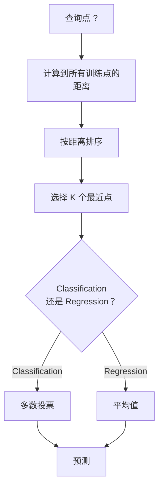
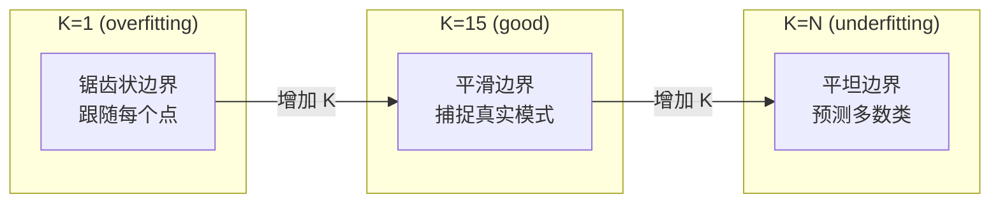
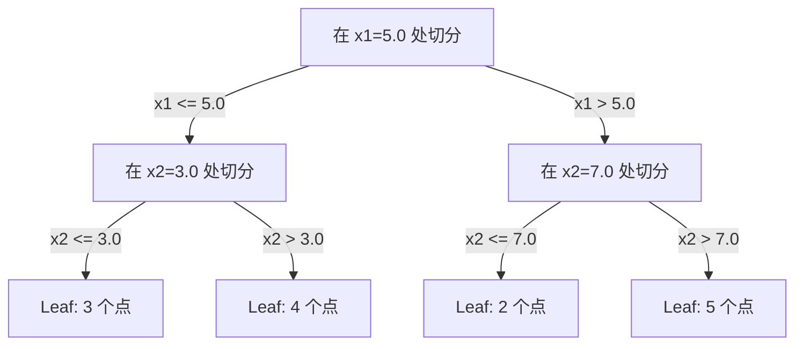

# K-Người hàng xóm gần nhất và xa

> 存储一切──通过查看你的邻居来预测──这是最简单而真正有效的算法──

**Type:** Build
**Language:**Python
**前置要求：**Giai đoạn 1 (Dạy học 14 Quy tắc và khoảng cách)
**Time:** ~90 分钟

## Học mục tiêu
- Từ zero thực hiện KNN phân loại và sự lùi, hỗ trợ có thể định vị của K và khoảng cách tăng quyền bỏ phiếu
- So sánh L1、L2、cosine 和 Minkowski  độ đo khoảng cách, và chọn đo phù hợp cho một loại dữ liệu nhất định
- 解释维度灾难,并演示为什么KNN 在高维空间中会退化
- Xây dựng cây KD để đạt hiệu quả cao tìm kiếm hàng xóm gần nhất,并 phân tích nó là gì tốt hơn lực lượng thô

## 问题
Bạn có một tập dữ liệu. Một điểm dữ liệu mới đến. Bạn cần phân loại hoặc dự đoán giá trị của nó. Với các yếu tố học tập trong dữ liệu như hồi quy tuyến tính hoặc SVM, bạn chỉ cần tìm cách các điểm đào tạo gần nhất của K từ điểm mới, và để chúng bỏ phiếu.

Đây là các hàng xóm gần nhất K. Không có giai đoạn đào tạo. Không cần phải học các tham số. Không cần phải tối thiểu hóa Loss Function.

Nó nghe có vẻ đơn giản đến không giống như làm việc. Nhưng KNN có khả năng cạnh tranh trong nhiều vấn đề, đặc biệt là trên các tập dữ liệu nhỏ và trung bình.

KNN cũng có tên khác nhau hiện tại trong các địa điểm của AI hiện đại. Các cơ sở dữ liệu vector sẽ được kết hợp trên các kết cấu để thực hiện tìm kiếm KNN.

## 概念
### Làm thế nào KNN hoạt động

Đặt một tập hợp dữ liệu với điểm đánh dấu và một điểm truy vấn mới:

1. 计算 truy vấn điểm đến tập trung dữ liệu khoảng cách của mỗi điểm
2. 按距离排序
3. 取最近的 K 个点
4. Đối với phân loại: trong K 个 hàng xóm, có đa số bỏ phiếu
5. Đối với sự lùi: đối với K 个 hàng xóm của giá trị lấy trung bình (hoặc tăng quyền trung bình)



Đây là một thuật toán hoàn chỉnh. Không có kế hoạch. Không có sự tiến bộ.

### Chọn K

K là siêu tham số duy nhất. Nó kiểm soát sự phân biệt sự thiên vị-variance trade-off:

| K | 行为 |
|---|----------|
| K = 1 | 决策边界跟随每一个点。训练误差为零。高方差。Overfits |
| Small K (3-5) | 对局部结构敏感。可以捕捉复杂边界 |
| Large K | 边界更平滑。对噪声更稳健。可能 underfit |
| K = N | 对每个点都预测多数类。最大 bias |

常见起点是对包含 N 个点的数据集使用 K = sqrt(N)。二分类时使用奇数 K,以避免平票。



### Điểm số khoảng cách

距离函数定义了什么叫近──不同度量会产生不同的邻居、不同的预测──

**L2 (Euclidean)**                                                                                                                                                                                                                                                              

```
d(a, b) = sqrt(sum((a_i - b_i)^2))
```

Đối với các đặc điểm kích thước nhạy cảm. Sử dụng L2 và KNN trước, luôn luôn cần tiêu chuẩn hóa các đặc điểm.

**L1 (Manhattan)**Đối với sự khác biệt tuyệt đối và hơn L2 có thể chống lại các giá trị ngoại lệ, vì nó sẽ không đối với sự khác biệt của giá trị vuông.

```
d(a, b) = sum(|a_i - b_i|)
```

**Cosine distance**衡量 向 之间的角度,忽略大小── đối với văn bản và Nhập dữ liệu rất quan trọng──

```
d(a, b) = 1 - (a . b) / (||a|| * ||b||)
```

**Minkowski**Sử dụng các tham số P 泛化 L1 和 L2。

```
d(a, b) = (sum(|a_i - b_i|^p))^(1/p)

p=1: Manhattan
p=2: Euclidean
p->inf: Chebyshev (max absolute difference)
```

Sử dụng loại đo phụ thuộc vào dữ liệu:

| 数据类型 | 最佳度量 | 原因 |
|-----------|------------|-----|
| 数值特征，尺度相近 | L2 (Euclidean) | 默认选择，适用于空间数据 |
| 数值特征，存在 outliers | L1 (Manhattan) | 稳健，不会放大大差异 |
| Text embeddings | Cosine | 大小是噪声，方向是含义 |
| 高维稀疏 | Cosine 或 L1 | L2 受维度灾难影响严重 |
| 混合类型 | Custom distance | 按特征类型组合度量 |

### KNN trọng lượng

标准 KNN cho tất cả các hàng xóm K 赋予 cùng một quyền lực. Nhưng khoảng cách từ 0.1 hàng xóm  nên quan trọng hơn so với khoảng cách từ 5.0 hàng xóm.

**Distance-weighted KNN**按距离的倒数为每个邻居加权:

```
weight_i = 1 / (distance_i + epsilon)

For classification: weighted vote
For regression:     weighted average = sum(w_i * y_i) / sum(w_i)
```

Khi điểm hỏi và điểm huấn luyện phù hợp hoàn toàn, epsilon có thể ngăn chặn phân chia thành không.

KNN trọng lượng đối với sự lựa chọn của K không quá nhạy cảm, vì những người hàng xóm xa xôi 无论如何贡献都很小.

### 维度灾难

KNN  hiệu suất sẽ giảm ở độ cao. Đây không phải là một mối quan tâm mờ, mà là một thực tế toán học.

**问题 1：距离会收敛。**Khi kích thước tăng lên, tỷ lệ khoảng cách tối đa và khoảng cách nhỏ nhất sẽ gần đến 1. Tất cả các điểm đều trở nên giống như các điểm truy vấn.

```
In d dimensions, for random uniform points:

d=2:    max_dist / min_dist = varies widely
d=100:  max_dist / min_dist ~ 1.01
d=1000: max_dist / min_dist ~ 1.001

When all distances are nearly equal, "nearest" is meaningless.
```

**问题 2：体积会爆炸。**Để nắm bắt K 个 hàng xóm trong tỷ lệ cố định của dữ liệu, bạn cần mở rộng bán kính tìm kiếm, để nó bao gồm phần lớn không gian đặc điểm.

**问题 3：角落占主导。**Trong d 维单位超立方体, phần lớn khối lượng tập trung ở gần góc, chứ không phải ở trung tâm.

Kết quả thực tế:KNN trong khoảng 20-50 đặc điểm biểu hiện tốt hơn. Sau khi vượt qua phạm vi này, bạn cần phải thực hiện việc giảm chiều kích trong việc áp dụng KNN trước (PCA, UMAP, t-SNE), hoặc sử dụng để sử dụng dữ liệu trong cấu trúc tìm kiếm dựa trên cây ở mức thấp.

### KD-trái:快速 hàng xóm gần nhất 搜索

KNN sẽ tính toán các điểm truy vấn từ khoảng cách của mỗi điểm đào tạo.

KD-tree 会沿特征轴递归划分空间. Ở mỗi tầng, nó sẽ được phân chia theo một chiều kích theo số trung bình.



Để tìm kiếm hàng xóm gần nhất, trước tiên đi qua cây để chứa lá của điểm tìm kiếm, sau đó quay lại, và chỉ có thể chứa các điểm gần hơn trong khu vực lân cận để kiểm tra chúng.

平均查询时间:低维时为 O(log n) ・・・ nhưng cây KD 在高维(d > 20) sẽ trở lại thành O(n), vì phân支 bị loại lại càng trở lại ít hơn。

### Cây bóng: 更适合中等维度

Cây bóng sẽ phân chia dữ liệu thành các siêu cầu được đặt trong các hộp, chứ không phải là các hộp có trục. Mỗi nút xác định một quả bóng, chứa tất cả các điểm trong cây.

相对 KD-trees 的优势:
- Trong trung bình, hiệu suất tốt hơn (~50)
- 能处理 không có trục đối với cấu trúc
- Khối diện biên giới gần hơn có nghĩa là khi tìm kiếm có thể cắt nhiều chi nhánh hơn

KD-trái và cây bóng đều là một thuật toán chính xác. Đối với tìm kiếm lớn thực sự, sẽ được sử dụng phương pháp gần nhất gần nhất của hàng xóm.

### Học lười biếng vs học đam mê

KNN là học viên lười biếng: tập luyện không làm việc, tất cả các công việc đều được hoàn thành trong dự đoán. Hầu hết các thuật toán khác (trong thời gian học tập, dự đoán nhanh chóng) là học viên nhiệt tình.

| 方面 | Lazy (KNN) | Eager (SVM, neural net) |
|--------|------------|------------------------|
| 训练时间 | O(1)，只存储数据 | O(n * epochs) |
| 预测时间 | 每次查询 O(n * d) | O(d) 或 O(parameters) |
| 预测时内存 | 存储整个训练集 | 只存储模型参数 |
| 适应新数据 | 立即添加点 | 重新训练模型 |
| 决策边界 | 隐式，在运行时计算 | 显式，训练后固定 |

Học lười 适合以下场景:
- 数据集频繁变化(无需重新训练即可添加/删除点)
- Chỉ cần rất ít câu hỏi dự đoán
- Bạn muốn luyện tập thời gian cho 0
- Số liệu đủ nhỏ, tìm kiếm lực lượng tàn bạo 快速

### KNN cho sự lùi

KNN Regression không làm đa số bỏ phiếu, mà đối với K 个 hàng xóm của mục tiêu giá trị lấy trung bình.

```
prediction = (1/K) * sum(y_i for i in K nearest neighbors)

Or with distance weighting:
prediction = sum(w_i * y_i) / sum(w_i)
where w_i = 1 / distance_i
```

KNN Regression 产生分段常数预测(使用加权时为分段平滑) ・・・ nó không thể được đưa ra ngoài phạm vi dữ liệu đào tạo。 Nếu mục tiêu đào tạo toàn đều nằm trong 0 đến 100, KNN 永远不会预测 200。


```figure
knn-smoothness
```

##  xây dựng nó
### 步骤 1: chức năng khoảng cách

Thực hiện L1、L2、cosine 和 Minkowski 距离──这些内容直接连接到阶段1课14──

```python
import math

def l2_distance(a, b):
    return math.sqrt(sum((ai - bi) ** 2 for ai, bi in zip(a, b)))

def l1_distance(a, b):
    return sum(abs(ai - bi) for ai, bi in zip(a, b))

def cosine_distance(a, b):
    dot_val = sum(ai * bi for ai, bi in zip(a, b))
    norm_a = math.sqrt(sum(ai ** 2 for ai in a))
    norm_b = math.sqrt(sum(bi ** 2 for bi in b))
    if norm_a == 0 or norm_b == 0:
        return 1.0
    return 1.0 - dot_val / (norm_a * norm_b)

def minkowski_distance(a, b, p=2):
    if p == float('inf'):
        return max(abs(ai - bi) for ai, bi in zip(a, b))
    return sum(abs(ai - bi) ** p for ai, bi in zip(a, b)) ** (1 / p)
```

### 步骤 2: KNN phân loại và regressor

Xây dựng KNN hoàn chỉnh, hỗ trợ K ≠ độ đo khoảng cách và quyền tăng khoảng cách có thể chọn

```python
class KNN:
    def __init__(self, k=5, distance_fn=l2_distance, weighted=False,
                 task="classification"):
        self.k = k
        self.distance_fn = distance_fn
        self.weighted = weighted
        self.task = task
        self.X_train = None
        self.y_train = None

    def fit(self, X, y):
        self.X_train = X
        self.y_train = y

    def predict(self, X):
        return [self._predict_one(x) for x in X]
```

### 步骤 3: KD-tree cho tìm kiếm hiệu quả

Từ zero cấu trúc cây KD, theo từng chiều kích của trung tâm số chuyển về chia.

```python
class KDTree:
    def __init__(self, X, indices=None, depth=0):
        # Recursively partition the data
        self.axis = depth % len(X[0])
        # Split on median of the current axis
        ...

    def query(self, point, k=1):
        # Traverse to leaf, then backtrack
        ...
```

完整实现见 `code/knn.py`, bao gồm tất cả các phương pháp hỗ trợ và demo.

### 步骤 4: Tích thước tính năng

KNN cần tính năng quy mô, vì khoảng cách đối với các đặc điểm rất nhạy cảm.

```python
def standardize(X):
    n = len(X)
    d = len(X[0])
    means = [sum(X[i][j] for i in range(n)) / n for j in range(d)]
    stds = [
        max(1e-10, (sum((X[i][j] - means[j]) ** 2 for i in range(n)) / n) ** 0.5)
        for j in range(d)
    ]
    return [[((X[i][j] - means[j]) / stds[j]) for j in range(d)] for i in range(n)], means, stds
```

## Sử dụng nó
Sử dụng scikit-learn:

```python
from sklearn.neighbors import KNeighborsClassifier
from sklearn.preprocessing import StandardScaler
from sklearn.pipeline import Pipeline

clf = Pipeline([
    ("scaler", StandardScaler()),
    ("knn", KNeighborsClassifier(n_neighbors=5, metric="euclidean")),
])
clf.fit(X_train, y_train)
print(f"Accuracy: {clf.score(X_test, y_test):.4f}")
```

Khi tập dữ liệu đủ lớn và kích thước đủ thấp, Scikit-learn sẽ tự động sử dụng cây KD hoặc cây bóng. Đối với dữ liệu có kích thước cao, nó sẽ quay trở lại lực lượng thô. Bạn có thể thông qua.`algorithm`参数 kiểm soát điểm này.

对于大规模近邻搜索数百万个向量), sử dụng FAISS、Annoy 或 Vector database:

```python
import faiss

index = faiss.IndexFlatL2(dimension)
index.add(embeddings)
distances, indices = index.search(query_vectors, k=5)
```

## 练习
1. Trong một tập hợp dữ liệu 2D bao gồm 3 loại để thực hiện phân loại KNN.

2. Trong 2、5、10、50、100 和 500 维中生成 1000 个随机点── đối với mỗi维度, tính toán tỷ lệ khoảng cách đôi lớn nhất và khoảng cách đôi nhỏ nhất── vẽ tỷ lệ này theo hình ảnh thay đổi chiều kích, để hình dung các thảm họa chiều kích──

3. Trong văn bản phân loại  vấn đề trên so sánh KNN của L1、L2 và cosine khoảng cách( sử dụng TF-IDF Dấu vectors)  loại đo nào cung cấp độ chính xác tốt nhất? Tại sao cosine 往往在文本上胜出?

4. Thực hiện cây KD, và trong 2D、10D và 50D, phân biệt đối với 1k、10k và 100k điểm tập hợp dữ liệu đo thời gian truy vấn và lực thô tương đối.

5. 为 y = sin(x) + tiếng ồn 构建一个重量KN regressor──将它与K=3、10、30的不重量KN比较──展示加权会产生更平滑的预测,特别是在K 较大时──

## 关键术语
| 术语 | 它实际意味着什么 |
|------|----------------------|
| K-nearest neighbors | 一种非参数算法，通过寻找距离查询点最近的 K 个训练点来预测 |
| Lazy learning | 训练时不进行计算。所有工作都发生在预测时。KNN 是典型例子 |
| Eager learning | 训练时进行大量计算以构建紧凑模型。大多数 ML 算法都是 eager |
| Curse of dimensionality | 在高维中，距离会收敛，neighborhoods 会扩展到覆盖空间的大部分，使 KNN 失效 |
| KD-tree | 沿特征轴递归划分空间的二叉树。在低维中查询为 O(log n) |
| Ball tree | 嵌套超球体构成的树。在中等维度（最高约 ~50）中比 KD-trees 表现更好 |
| Weighted KNN | neighbors 按距离倒数加权。更近的 neighbors 对预测影响更大 |
| Feature scaling | 将特征归一化到可比较范围。KNN 等基于距离的方法需要它 |
| Majority vote | 通过统计 K 个 neighbors 中哪个类别最常见来进行 Classification |
| Brute force search | 计算到每个训练点的距离。每次查询 O(n*d)。精确但在大 n 时很慢 |
| Approximate nearest neighbor | 能比精确搜索快得多地找到近似最近点的算法（HNSW、LSH、IVF） |
| Voronoi diagram | 一种空间划分，其中每个区域包含所有比任何其他训练点都更接近某个训练点的点。K=1 KNN 会产生 Voronoi 边界 |

## 延伸阅读
- [Cover & Hart: Nearest Neighbor Pattern Classification (1967)](https://ieeexplore.ieee.org/document/1053964)- 奠基性的 KNN 论文, chứng minh tỷ lệ lỗi của nó tối đa là hai lần của Bayes
- [Friedman, Bentley, Finkel: An Algorithm for Finding Best Matches in Logarithmic Expected Time (1977)](https://dl.acm.org/doi/10.1145/355744.355745)- 原始 KD-tree 论文
- [Beyer et al.: When Is "Nearest Neighbor" Meaningful? (1999)](https://link.springer.com/chapter/10.1007/3-540-49257-7_15)- nước láng giềng gần nhất 维度灾难的形式化分析
- [scikit-learn Nearest Neighbors documentation](https://scikit-learn.org/stable/modules/neighbors.html)- 包含算法选择的实践指南
- [FAISS: A Library for Efficient Similarity Search](https://github.com/facebookresearch/faiss)- Meta sử dụng hàng tỷ cấp gần nhất tìm kiếm hàng xóm của thư viện
