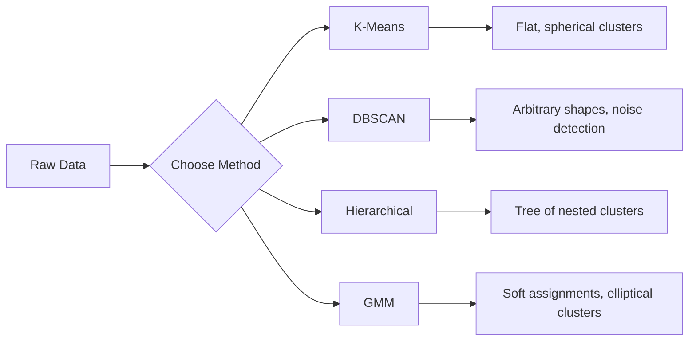

# Học hỏi không được giám sát

> Không có nhãn, không có giáo viên.

**类型:**构建
**语言:**Python
**前置条件:**Giai đoạn 1(Công thức & Khoảng cách、Khả năng & Phân phối)
**时间:**~ 90 phút

## Học mục tiêu

- Từ đầu thực hiện K-Means、DBSCAN và Gaussian Mix Models,并 so sánh chúng của Clustering  hành vi
- Sử dụng điểm bóng râm và phương pháp tay  đánh giá cụm 质量,并选择最优 K
- 解释 DBSCAN 何時優于 K-Means,并识别哪种算法能处理非球形群 和外形
- Sử dụng phương pháp cluster xây dựng đường ống phát hiện bất thường, để đánh dấu các điểm rời khỏi mô hình bình thường

## 问题

Cho đến nay, mỗi phần ML 课都假设数据带标签:这是输入,这是正确输出. Trong thế giới thực, chi phí标签 rất cao. 医院 có hàng triệu hồ sơ bệnh nhân, nhưng không có người tay tay để cho mỗi hồ sơ đánh dấu các loại bệnh.

Học tập không giám sát sẽ tìm thấy mô hình không được yêu cầu tìm kiếm gì. Nó sẽ phân nhóm các dữ liệu tương tự, phát hiện ra cấu trúc ẩn, và tiết lộ bất thường. Nếu học tập được giám sát như là có câu trả lời từ tài liệu giảng dạy, thì học tập không giám sát chỉ là nhìn vào dữ liệu nguyên thủy cho đến khi mô hình tự xuất hiện.

问题在于: không có nhãn, bạn không thể đo trực tiếp đúng hay sai. Bạn cần các công cụ khác nhau để đánh giá cấu trúc của thuật toán tìm thấy có ý nghĩa hay không.

## 核心概念

### Tập hợp:把相似的事物分到一起

Clustering sẽ phân bổ từng điểm dữ liệu vào một nhóm, làm cho các điểm trong cùng nhóm tương tự hơn so với các điểm trong nhóm khác.



### K-Means: thường dùng chủ lực phương pháp

K-Means sẽ phân chia dữ liệu thành đúng K 个 cluster── mỗi cluster đều có một trung tâm, mỗi điểm đều thuộc về trung tâm gần nhất──

Algoritm của Lloyd:

1. 随机选择 K 个点作为初始中心点
2. Đưa từng điểm dữ liệu cho trung tâm gần nhất
3. Đánh giá trung tâm mỗi trung tâm lại tính trung bình điểm phân phối của nó
4. 重复步骤 2-3, cho đến khi kết quả phân phối không thay đổi

目标函数 (inertia) đo khoảng cách tổng vuông của mỗi điểm đến trung tâm thuộc về nó. K-Means 会 tối thiểu hóa giá trị này, nhưng chỉ có thể tìm thấy giá trị tối thiểu ở địa phương.

### 选择 K

两种标准方法:

**Elbow method：**Đối với K = 1, 2, 3, ..., n 运行 K-Means── vẽ trôi động với K của quan hệ图── tìm kiếm elbow,也就是继续增加集群时 trôi động 不再显著下降的位置──

**Silhouette score：**Đối với mỗi điểm, đo mức độ tương tự của nó với cụm cụm riêng của mình (a) so với các cụm cụm khác gần đây (b) cách thức:

### DBSCAN: Cluster dựa trên mật độ

K-Thiết  giả định cluster là hình cầu,并 yêu cầu bạn chọn trước K。DBSCAN Không làm hai giả định này。 nó sẽ tìm ra cluster thành bởi vùng kín tách rời 密区域。

2 tham số:
- **eps**: 半域
- **min_samples**: Số điểm tối thiểu cần thiết để hình thành khu vực mật

3 điểm:
- **Core point**: trong eps  khoảng cách trong ít nhất có ít_con_con_con_
- **Border point**: nằm trong một điểm cốt lõi của eps  phạm vi, nhưng chính nó không phải là điểm cốt lõi
- **Noise point**Không phải điểm cốt lõi, cũng không phải điểm biên giới.

DBSCAN sẽ đặt nhau ở các điểm cốt lõi trong phạm vi eps  kết nối với một cụm.

优点:能发现任意形状的集群, tự xác định cụm số lượng,识别outlier。弱点:难以处理密度差较大的集群──

### Nhóm xếp hạng

构建嵌套 cluster 的树(dendrogram) 』

Agglomerative ((自底向上):
1. Từ mỗi điểm là cluster của riêng mình  bắt đầu
2. 合并两个最近的集群
3. 重复, cho đến khi chỉ còn một cluster
4. Trong kỳ vọng cấp độ phân chia dendrogram, nhận được K 个 cluster

Độ gần gũi giữa các cụm có thể được đo bằng cách sau:
- **Single linkage**: khoảng cách tối thiểu giữa hai cluster
- **Complete linkage**: khoảng cách tối đa giữa hai điểm tùy chọn
- **Average linkage**: khoảng cách trung bình giữa tất cả các điểm đối với
- **Ward's method**: dẫn đến cluster trong tổng tỷ lệ tăng tối thiểu của hợp đồng cách thức

### Mô hình hỗn hợp Gaussian (GMM)

K-Tức là 给出硬分配: mỗi điểm恰好属于一个集群.

GMM giả định dữ liệu được tạo ra bởi sự hỗn hợp của phân bố Gaussian, mỗi phân bố đều có giá trị trung bình và sự khác nhau riêng của mình.

- **E-step**: tính toán mỗi điểm thuộc về tỷ lệ xác suất của mỗi Gaussian
- **M-step**: cập nhật mỗi Gaussian's giá trị trung bình, sự khác biệt và trọng lượng trộn, để tối đa hóa khả năng dữ liệu

GMM có thể xây dựng các cụm hình hình tròn không chỉ là K-Means 那样球形), và có thể tự nhiên xử lý các cụm hình tròn.

### 何時使用何种方法

| Method | Best for | Avoid when |
|--------|----------|------------|
| K-Means | 大型数据集、球形 cluster、已知 K | 形状不规则、存在 outlier |
| DBSCAN | K 未知、任意形状、outlier detection | 密度差异大、维度非常高 |
| Hierarchical | 小型数据集、需要 dendrogram、K 未知 | 大型数据集（O(n^2) memory） |
| GMM | 重叠 cluster、需要软分配 | 非常大的数据集、维度过多 |

### Sử dụng Cluster Doanh số phát hiện bất thường

Nhóm thiên nhiên hỗ trợ phát hiện bất thường:
- **K-Means**Định hướng của tâm điểm là bất thường
- **DBSCAN**Theo định nghĩa, điểm tiếng ồn là bất thường.
- **GMM**Trong tất cả các Gaussian , tỷ lệ thấp là điểm bất thường .


```figure
kmeans-step
```

##  xây dựng nó

### Bước 1: Từ đầu thực hiện K-Mức

```python
import math
import random


def euclidean_distance(a, b):
    return math.sqrt(sum((ai - bi) ** 2 for ai, bi in zip(a, b)))


def kmeans(data, k, max_iterations=100, seed=42):
    random.seed(seed)
    n_features = len(data[0])

    centroids = random.sample(data, k)

    for iteration in range(max_iterations):
        clusters = [[] for _ in range(k)]
        assignments = []

        for point in data:
            distances = [euclidean_distance(point, c) for c in centroids]
            nearest = distances.index(min(distances))
            clusters[nearest].append(point)
            assignments.append(nearest)

        new_centroids = []
        for cluster in clusters:
            if len(cluster) == 0:
                new_centroids.append(random.choice(data))
                continue
            centroid = [
                sum(point[j] for point in cluster) / len(cluster)
                for j in range(n_features)
            ]
            new_centroids.append(centroid)

        if all(
            euclidean_distance(old, new) < 1e-6
            for old, new in zip(centroids, new_centroids)
        ):
            print(f"  Converged at iteration {iteration + 1}")
            break

        centroids = new_centroids

    return assignments, centroids
```

### 步骤 2:Phương pháp cằm và điểm bóng

```python
def compute_inertia(data, assignments, centroids):
    total = 0.0
    for point, cluster_id in zip(data, assignments):
        total += euclidean_distance(point, centroids[cluster_id]) ** 2
    return total


def silhouette_score(data, assignments):
    n = len(data)
    if n < 2:
        return 0.0

    clusters = {}
    for i, c in enumerate(assignments):
        clusters.setdefault(c, []).append(i)

    if len(clusters) < 2:
        return 0.0

    scores = []
    for i in range(n):
        own_cluster = assignments[i]
        own_members = [j for j in clusters[own_cluster] if j != i]

        if len(own_members) == 0:
            scores.append(0.0)
            continue

        a = sum(euclidean_distance(data[i], data[j]) for j in own_members) / len(own_members)

        b = float("inf")
        for cluster_id, members in clusters.items():
            if cluster_id == own_cluster:
                continue
            avg_dist = sum(euclidean_distance(data[i], data[j]) for j in members) / len(members)
            b = min(b, avg_dist)

        if max(a, b) == 0:
            scores.append(0.0)
        else:
            scores.append((b - a) / max(a, b))

    return sum(scores) / len(scores)


def find_best_k(data, max_k=10):
    print("Elbow method:")
    inertias = []
    for k in range(1, max_k + 1):
        assignments, centroids = kmeans(data, k)
        inertia = compute_inertia(data, assignments, centroids)
        inertias.append(inertia)
        print(f"  K={k}: inertia={inertia:.2f}")

    print("\nSilhouette scores:")
    for k in range(2, max_k + 1):
        assignments, centroids = kmeans(data, k)
        score = silhouette_score(data, assignments)
        print(f"  K={k}: silhouette={score:.4f}")

    return inertias
```

### Bước 3: Từ đầu thực hiện DBSCAN

```python
def dbscan(data, eps, min_samples):
    n = len(data)
    labels = [-1] * n
    cluster_id = 0

    def region_query(point_idx):
        neighbors = []
        for i in range(n):
            if euclidean_distance(data[point_idx], data[i]) <= eps:
                neighbors.append(i)
        return neighbors

    visited = [False] * n

    for i in range(n):
        if visited[i]:
            continue
        visited[i] = True

        neighbors = region_query(i)

        if len(neighbors) < min_samples:
            labels[i] = -1
            continue

        labels[i] = cluster_id
        seed_set = list(neighbors)
        seed_set.remove(i)

        j = 0
        while j < len(seed_set):
            q = seed_set[j]

            if not visited[q]:
                visited[q] = True
                q_neighbors = region_query(q)
                if len(q_neighbors) >= min_samples:
                    for nb in q_neighbors:
                        if nb not in seed_set:
                            seed_set.append(nb)

            if labels[q] == -1:
                labels[q] = cluster_id

            j += 1

        cluster_id += 1

    return labels
```

### 步骤 4:Gaussian Mix Model (định thuật EM)

```python
def gmm(data, k, max_iterations=100, seed=42):
    random.seed(seed)
    n = len(data)
    d = len(data[0])

    indices = random.sample(range(n), k)
    means = [list(data[i]) for i in indices]
    variances = [1.0] * k
    weights = [1.0 / k] * k

    def gaussian_pdf(x, mean, variance):
        d = len(x)
        coeff = 1.0 / ((2 * math.pi * variance) ** (d / 2))
        exponent = -sum((xi - mi) ** 2 for xi, mi in zip(x, mean)) / (2 * variance)
        return coeff * math.exp(max(exponent, -500))

    for iteration in range(max_iterations):
        responsibilities = []
        for i in range(n):
            probs = []
            for j in range(k):
                probs.append(weights[j] * gaussian_pdf(data[i], means[j], variances[j]))
            total = sum(probs)
            if total == 0:
                total = 1e-300
            responsibilities.append([p / total for p in probs])

        old_means = [list(m) for m in means]

        for j in range(k):
            r_sum = sum(responsibilities[i][j] for i in range(n))
            if r_sum < 1e-10:
                continue

            weights[j] = r_sum / n

            for dim in range(d):
                means[j][dim] = sum(
                    responsibilities[i][j] * data[i][dim] for i in range(n)
                ) / r_sum

            variances[j] = sum(
                responsibilities[i][j]
                * sum((data[i][dim] - means[j][dim]) ** 2 for dim in range(d))
                for i in range(n)
            ) / (r_sum * d)
            variances[j] = max(variances[j], 1e-6)

        shift = sum(
            euclidean_distance(old_means[j], means[j]) for j in range(k)
        )
        if shift < 1e-6:
            print(f"  GMM converged at iteration {iteration + 1}")
            break

    assignments = []
    for i in range(n):
        assignments.append(responsibilities[i].index(max(responsibilities[i])))

    return assignments, means, weights, responsibilities
```

### Bước 5: Tạo dữ liệu kiểm tra và vận hành tất cả nội dung

```python
def make_blobs(centers, n_per_cluster=50, spread=0.5, seed=42):
    random.seed(seed)
    data = []
    true_labels = []
    for label, (cx, cy) in enumerate(centers):
        for _ in range(n_per_cluster):
            x = cx + random.gauss(0, spread)
            y = cy + random.gauss(0, spread)
            data.append([x, y])
            true_labels.append(label)
    return data, true_labels


def make_moons(n_samples=200, noise=0.1, seed=42):
    random.seed(seed)
    data = []
    labels = []
    n_half = n_samples // 2
    for i in range(n_half):
        angle = math.pi * i / n_half
        x = math.cos(angle) + random.gauss(0, noise)
        y = math.sin(angle) + random.gauss(0, noise)
        data.append([x, y])
        labels.append(0)
    for i in range(n_half):
        angle = math.pi * i / n_half
        x = 1 - math.cos(angle) + random.gauss(0, noise)
        y = 1 - math.sin(angle) - 0.5 + random.gauss(0, noise)
        data.append([x, y])
        labels.append(1)
    return data, labels


if __name__ == "__main__":
    centers = [[2, 2], [8, 3], [5, 8]]
    data, true_labels = make_blobs(centers, n_per_cluster=50, spread=0.8)

    print("=== K-Means on 3 blobs ===")
    assignments, centroids = kmeans(data, k=3)
    print(f"  Centroids: {[[round(c, 2) for c in cent] for cent in centroids]}")
    sil = silhouette_score(data, assignments)
    print(f"  Silhouette score: {sil:.4f}")

    print("\n=== Elbow Method ===")
    find_best_k(data, max_k=6)

    print("\n=== DBSCAN on 3 blobs ===")
    db_labels = dbscan(data, eps=1.5, min_samples=5)
    n_clusters = len(set(db_labels) - {-1})
    n_noise = db_labels.count(-1)
    print(f"  Found {n_clusters} clusters, {n_noise} noise points")

    print("\n=== GMM on 3 blobs ===")
    gmm_assignments, gmm_means, gmm_weights, _ = gmm(data, k=3)
    print(f"  Means: {[[round(m, 2) for m in mean] for mean in gmm_means]}")
    print(f"  Weights: {[round(w, 3) for w in gmm_weights]}")
    gmm_sil = silhouette_score(data, gmm_assignments)
    print(f"  Silhouette score: {gmm_sil:.4f}")

    print("\n=== DBSCAN on moons (non-spherical clusters) ===")
    moon_data, moon_labels = make_moons(n_samples=200, noise=0.1)
    moon_db = dbscan(moon_data, eps=0.3, min_samples=5)
    n_moon_clusters = len(set(moon_db) - {-1})
    n_moon_noise = moon_db.count(-1)
    print(f"  Found {n_moon_clusters} clusters, {n_moon_noise} noise points")

    print("\n=== K-Means on moons (will fail to separate) ===")
    moon_km, moon_centroids = kmeans(moon_data, k=2)
    moon_sil = silhouette_score(moon_data, moon_km)
    print(f"  Silhouette score: {moon_sil:.4f}")
    print("  K-Means splits moons poorly because they are not spherical")

    print("\n=== Anomaly detection with DBSCAN ===")
    anomaly_data = list(data)
    anomaly_data.append([20.0, 20.0])
    anomaly_data.append([-5.0, -5.0])
    anomaly_data.append([15.0, 0.0])
    anomaly_labels = dbscan(anomaly_data, eps=1.5, min_samples=5)
    anomalies = [
        anomaly_data[i]
        for i in range(len(anomaly_labels))
        if anomaly_labels[i] == -1
    ]
    print(f"  Detected {len(anomalies)} anomalies")
    for a in anomalies[-3:]:
        print(f"    Point {[round(v, 2) for v in a]}")
```

## Sử dụng nó

Sử dụng các thuật toán học tập nhỏ, tương tự có thể được hoàn thành:

```python
from sklearn.cluster import KMeans, DBSCAN, AgglomerativeClustering
from sklearn.mixture import GaussianMixture
from sklearn.metrics import silhouette_score as sklearn_silhouette

km = KMeans(n_clusters=3, random_state=42).fit(data)
db = DBSCAN(eps=1.5, min_samples=5).fit(data)
agg = AgglomerativeClustering(n_clusters=3).fit(data)
gmm_model = GaussianMixture(n_components=3, random_state=42).fit(data)
```

Từ đầu thực hiện phiên bản sẽ chính xác hiển thị những bộ nhớ này trong tính toán gì. K-Means trong phân phối và tái tính toán giữa các thế hệ. DBSCAN từ 密种子  bắt đầu mở rộng cluster. GMM trong sự thay đổi giữa kỳ vọng và tối đa hóa.

## 交付 nó

本课会产出从头实现的 K-Means、DBSCAN 和 GMM── trong đó Clustering code có thể được sử dụng như là cơ sở cho các phương pháp không giám sát cao hơn──

## 练习

1. Thực hiện K-Means++ khởi tạo: không chọn trung tâm tự nhiên, mà chọn trung tâm tự nhiên đầu tiên, sau đó mỗi trung tâm được chọn để so sánh tỷ lệ tỷ lệ thành tích của khoảng cách vuông của trung tâm gần đây nhất đã có.
2. 向代码中加入等级聚合集群化――实现 Ward's linkage,并生成 dendrogram (如合并的嵌套列表)――在不同层级分分它,并与K-Means 结果比较――
3. Xây dựng một đường ống phát hiện bất thường đơn giản: trên cùng dữ liệu hoạt động trên DBSCAN và GMM, đánh dấu hai phương pháp đều được coi là điểm ngoại lệ:

## 关键术语

| Term | What people say | What it actually means |
|------|----------------|----------------------|
| Clustering | “把相似的事物分组” | 将数据划分为若干子集，使组内相似度高于组间相似度，并由特定距离度量来衡量 |
| Centroid | “cluster 的中心” | 分配给某个 cluster 的所有点的均值；K-Means 将其用作 cluster 的代表 |
| Inertia | “cluster 有多紧凑” | 每个点到其所属 centroid 的平方距离之和；越低表示越紧凑 |
| Silhouette score | “cluster 分离得有多好” | 对每个点计算 (b - a) / max(a, b)，其中 a 是平均 cluster 内距离，b 是最近 cluster 的平均距离 |
| Core point | “稠密区域中的点” | 在 DBSCAN 中，eps 距离内至少有 min_samples 个邻居的点 |
| EM algorithm | “软 K-Means” | Expectation-Maximization：迭代计算成员概率（E-step）并更新 distribution 参数（M-step） |
| Dendrogram | “cluster 的树” | 一种树状图，展示 hierarchical clustering 中 cluster 被合并的顺序以及合并时的距离 |
| Anomaly | “一个 outlier” | 不符合预期模式的数据点，在 DBSCAN 中被识别为 noise，或在 GMM 中被识别为低概率点 |

## 延伸阅读

- [Stanford CS229 - Unsupervised Learning](https://cs229.stanford.edu/notes2022fall/main_notes.pdf)- Andrew Ng  về Clustering và EM bài giảng ghi chú
- [scikit-learn Clustering Guide](https://scikit-learn.org/stable/modules/clustering.html)- Đối với tất cả các thuật toán cluster, có những ví dụ có thể nhìn thấy
- [DBSCAN original paper (Ester et al., 1996)](https://www.aaai.org/Papers/KDD/1996/KDD96-037.pdf)-  đề xuất tập hợp dựa trên mật độ
