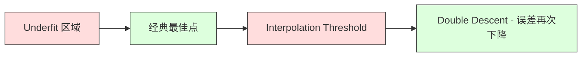
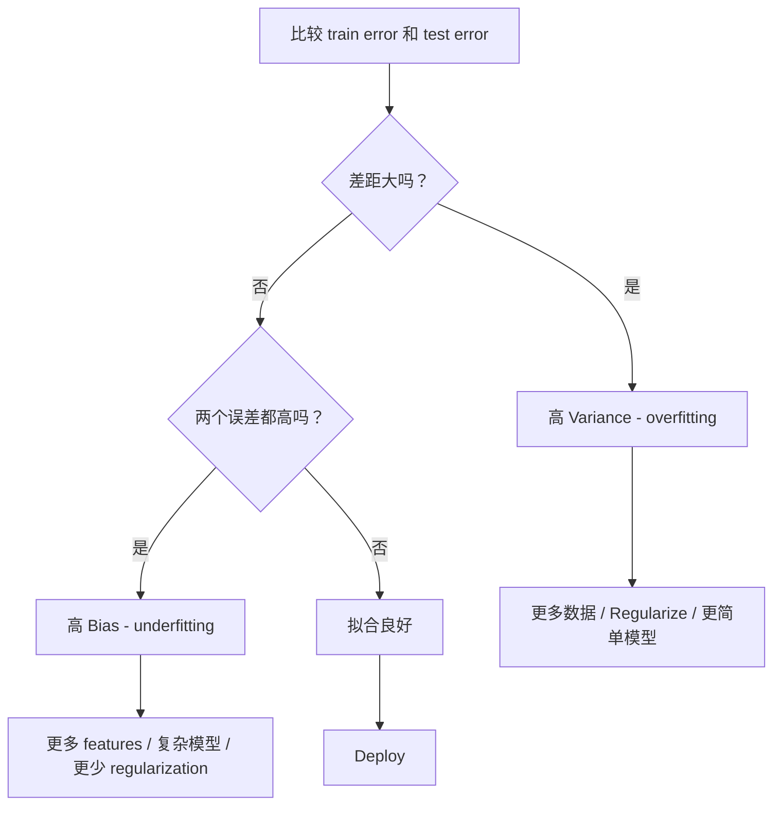
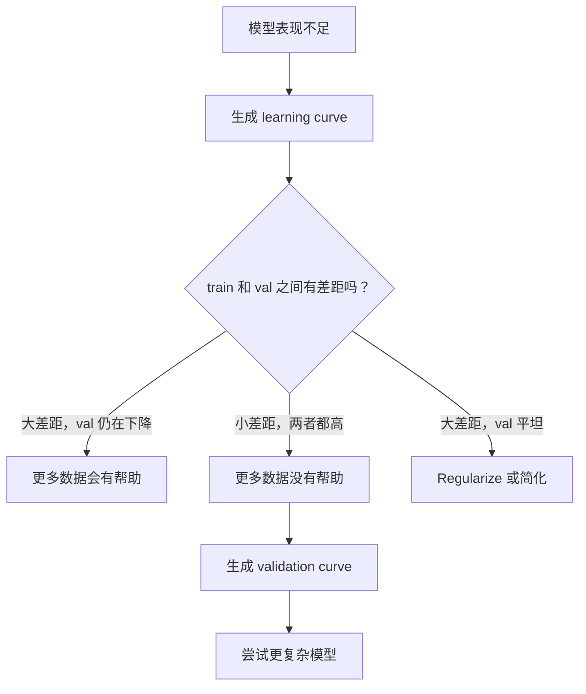

# Sự phân biệt đối xử giữa các biến thể

> Mỗi loại sai lầm mô hình đều đến từ một trong ba nguồn: Bias, Variance hoặc noise.

**Type:** Learn
**Language:**Python
**Prerequisites:** Phase 2, Lessons 01-09（ML 基础、Regression、Classification、评估）
**Time:** ~75 分钟

## Học mục tiêu
- 推导期望预测 sai lầm Bias-Variance 分解,并解释 tác động của tiếng ồn không thể tránh khỏi
- Sử dụng tập luyện sai lầm và thử nghiệm sai lầm mô hình chẩn đoán mô hình có sự thiên vị cao hay sự biến động cao
- 解释 Quy định hóa 技术(L1、L2、trừ bỏ、đừng sớm) làm thế nào để sử dụng Bias 换取 Variance
- 实现实验,可视化不同复杂度模型 Bias-Variance Tradeoff

## 问题
Bạn đã đào tạo một mô hình. Nó có một sai lầm trong dữ liệu thử nghiệm. Sai lầm này đến từ đâu?

Nếu mô hình của bạn quá đơn giản (ví dụ: sử dụng regression tuyến tính trên tập dữ liệu 曲), nó sẽ tiếp tục sai qua mô hình thực tế. Đây là Bias. Nếu mô hình của bạn quá phức tạp (ví dụ: sử dụng đa nguyên độ 20 trên 15 điểm dữ liệu), nó sẽ hoàn hảo phù hợp với dữ liệu đào tạo, nhưng trên dữ liệu mới sẽ cho phép dự đoán thay đổi mạnh mẽ. Đây là Variance.

Đối với dung lượng mô hình cố định, bạn không thể tối thiểu hóa hai thứ này. Giảm Bias, Variance 就会上升. Giảm Bias, Bias 就会上升.

## 概念
### Bias: 系统性错差

Bias đo là mức độ phân biệt giữa trung bình dự đoán và giá trị thực. Nếu bạn tập luyện trên nhiều tập hợp đào tạo khác nhau từ cùng một phân bố, và đối với trung bình dự đoán, Bias là sự khác biệt giữa giá trị trung bình và giá trị thực.

Cao Bias có nghĩa là mô hình quá cứng, không thể nắm bắt mô hình thực tế.

```
高 Bias（underfitting）：
  模型总是预测大致相同的错误结果。
  训练误差：高
  测试误差：高
  二者差距：小
```

### Sự biến thể: Tâm nhập dữ liệu đào tạo

Sự biến đổi đo lường là khi bạn tập trên các tập dữ liệu khác nhau, dự đoán sẽ thay đổi bao nhiêu. Nếu những thay đổi nhỏ trong tập dữ liệu dẫn đến thay đổi lớn trong mô hình, sự biến đổi sẽ rất cao.

High Variance có nghĩa là mô hình trong dữ liệu tập luyện phù hợp, chứ không phải là tín hiệu cấp dưới.

```
高 Variance（overfitting）：
  模型完美拟合训练数据，但在新数据上失败。
  训练误差：低
  测试误差：高
  二者差距：大
```

### Sự phân hủy

Đối với bất kỳ điểm x, dự đoán sai sót dưới dạng lỗ vuông có thể được phân giải chính xác thành:

```
Expected Error = Bias^2 + Variance + Irreducible Noise

where:
  Bias^2   = (E[f_hat(x)] - f(x))^2
  Variance = E[(f_hat(x) - E[f_hat(x)])^2]
  Noise    = E[(y - f(x))^2]             (sigma^2)
```

- `f(x)`是真实函数
- `f_hat(x)`是模型预测
- `E[...]`Đương nhiên là những mong đợi của các tập đoàn đào tạo khác nhau
- `y`是观测到的标签(真实函数加噪声)

噪音项 là không thể đối phó. Trong dữ liệu có tiếng ồn, không có mô hình nào có thể làm tốt hơn sigma^2. Nhiệm vụ của bạn là tìm sự cân bằng đúng đắn giữa sự thiên vị^2 và sự khác biệt.

### Mô hình phức tạp so với lỗi


经典的 U 形曲线:

| Complexity | Bias | Variance | Total Error |
|-----------|------|----------|-------------|
| 过低 | 高 | 低 | 高（underfitting） |
| 刚刚好 | 中等 | 中等 | 最低 |
| 过高 | 低 | 高 | 高（overfitting） |

### 作为偏差变化 控制的规范化

Quy định sẽ có ý định tăng Bias để giảm biến động. Nó buộc mô hình, khiến nó không thể theo đuổi tiếng ồn.

- **L2 (Ridge):**sẽ tái thu hẹp quyền sở hữu, giữ lại tất cả các tính năng, nhưng giảm tác động của chúng.
- **L1 (Lasso):**将某些权重精确推推到零──执行 tính năng lựa chọn──
- **Dropout:**Trong quá trình tập luyện, bất cứ khi nào bạn không sử dụng các tế bào thần kinh, bạn phải tạo ra các biểu hiện dư thừa.
- **Early stopping:**Trong mô hình hoàn toàn phù hợp tập dữ liệu trước khi ngừng tập.

Chuẩn bị 强度(lambda、drop rate、epoch 数) sẽ trực tiếp kiểm soát bạn trong vị trí trên đường cong  Bias-Variance .

### Hình ảnh: 现代视角

经典理论认为: vượt qua điểm tốt nhất, phức tạp hơn luôn là bất lợi. Nhưng nghiên cứu từ năm 2019 cho thấy hiện tượng bất ngờ. Nếu bạn tiếp tục tăng dung lượng mô hình lên ngưỡng phân cực vượt quá, mô hình có đủ tham số để hoàn hảo phù hợp với vị trí của dữ liệu đào tạo, sai lầm thử nghiệm có thể giảm lại.



Hiện tượng này giải thích tại sao mạng thần kinh có quy mô quá lớn (những số lượng tham số còn nhiều hơn so với mẫu đào tạo) vẫn có thể nói chung tốt.

关于 双下降 的关键观察:
- Nó xuất hiện trong các mô hình tuyến tính, cây quyết định và mạng thần kinh.
- Trong khu vực phân tích, nhiều dữ liệu thực tế có thể gây hại (từ khi phân tích bằng mẫu)
- 更多训练 epochs 也可能导致它(độ giảm gấp đôi theo thời đại)
- Sự điều chỉnh sẽ làm cho mức đỉnh bình thường, nhưng sẽ không loại bỏ nó.

Tại sao điều này xảy ra? Ở ngưỡng phân cực, mô hình chỉ có đủ dung lượng để phù hợp với tất cả các điểm đào tạo. Nó bị buộc phải bước vào một giải pháp rất cụ thể, giải pháp này vượt qua mỗi điểm, những sự nhiễu nhỏ trong dữ liệu sẽ dẫn đến sự thay đổi lớn trong độ phù hợp. Đây là sự biến động đạt đến vị trí đỉnh.

| Regime | Parameters vs Samples | Behavior |
|--------|----------------------|----------|
| Underparameterized | p << n | 经典 tradeoff 适用 |
| Interpolation threshold | p ~ n | Variance 达到峰值，测试误差激增 |
| Overparameterized | p >> n | Implicit regularization 开始起作用，测试误差下降 |

Từ góc độ thực tế: Nếu bạn sử dụng mạng thần kinh hoặc các tập hợp cây lớn, đừng dừng lại ở ngưỡng phân cực.

### Chẩn đoán mẫu hình của bạn



| Symptom | Diagnosis | Fix |
|---------|-----------|-----|
| 高 train error，高 test error | Bias | 更多 features、复杂模型、更少 regularization |
| 低 train error，高 test error | Variance | 更多数据、regularization、更简单模型、dropout |
| 低 train error，低 test error | 拟合良好 | Ship it |
| Train error 下降，test error 上升 | Overfitting 正在发生 | Early stopping |

### Các chiến lược hữu ích

**当 Bias 是问题时：**
- 添加 đa nôn hoặc tính năng tương tác
- Sử dụng mô hình dễ dàng hơn (ví dụ: sử dụng bộ sưu tập cây thay vì tuyến tính)
- 降低 cường độ quy định
- 训练更久 ((如果尚未收)

**当 Variance 是问题时：**
- 获取更多训练数据
- 使用 bagging(trừng ngẫu nhiên)
- 增加 regularisation ((更高 lambda、更多 dropup)
- Chọn tính năng ()
- Sử dụng xác thực chéo 尽早发现它

### Phương pháp tập hợp và tỷ lệ giảm

Các phương pháp tập hợp là công cụ thực tế nhất để chống lại sự biến đổi.

**Bagging (Bootstrap Aggregating)**Trong các mẫu bootstrap khác nhau của tập luyện dữ liệu, tập luyện nhiều mô hình, sau đó tập trung trung bình. Mỗi mô hình riêng biệt có sự biến động cao, nhưng giá trị trung bình của sự biến động phải thấp hơn nhiều.

Lý do nó có hiệu quả về mặt toán học là: nếu trung bình N 个独立预测, mỗi dự đoán khác biệt đều là sigma^2, thì sự khác biệt của giá trị trung bình là sigma^2 / N. Những mô hình này không thực sự độc lập (theo đó chúng đều thấy dữ liệu tương tự), do đó, giảm幅 nhỏ hơn 1/N, nhưng vẫn khá đáng nhìn thấy.

**Boosting**Thông qua các mô hình xây dựng theo thứ tự để giảm Bias, trong đó mỗi mô hình mới đều quan tâm đến sai lầm của tập thể hiện tại.

| Method | Primary Effect | Bias Change | Variance Change |
|--------|---------------|-------------|-----------------|
| Bagging | 降低 Variance | 不变 | 降低 |
| Boosting | 降低 Bias | 降低 | 可能增加 |
| Stacking | 同时降低两者 | 取决于 meta-learner | 取决于 base models |
| Dropout | Implicit bagging | 略微增加 | 降低 |

**实践规则：**Nếu mô hình cơ bản của bạn có sự biến động cao ((cây sâu、chống số cao), sử dụng túi nhỏ nhỏ. Nếu mô hình cơ bản của bạn có sự phân biệt cao ((cột nhỏ, mô hình tuyến tính đơn giản), sử dụng tăng cường.

### Lập trình học tập

Các đường cong học tập sẽ vẽ sai lầm và sai lầm kiểm tra để tạo ra các hàm tập hợp tập thể nhỏ. Chúng là công cụ chẩn đoán thực tế nhất mà bạn có. Không giống như so sánh đào tạo/thử nghiệm đơn, đường cong học tập sẽ hiển thị quỹ đạo mô hình, và cho bạn biết thêm dữ liệu có hữu ích hay không.


Làm thế nào để giải thích chúng:

| Scenario | Training Error | Validation Error | Gap | What It Means | What to Do |
|----------|---------------|-----------------|-----|---------------|------------|
| 高 Bias | 高 | 高 | 小 | 模型无法捕捉模式 | 更多 features、复杂模型、更少 regularization |
| 高 Variance | 低 | 高 | 大 | 模型记忆训练数据 | 更多数据、regularization、更简单模型 |
| 拟合良好 | 中等 | 中等 | 小 | 模型 generalizes well | Ship it |
| 高 Variance，正在改善 | 低 | 随更多数据下降 | 缩小 | 数据可以修复的 Variance 问题 | 收集更多数据 |
| 高 Bias，平坦 | 高 | 高且平坦 | 小且平坦 | 更多数据没有帮助 | 改变 model architecture |

关键洞察: Nếu hai đường cong đều đã trơn trơn, khoảng cách rất nhỏ nhưng hai sai lầm là cao, không cần thêm dữ liệu. Bạn cần mô hình tốt hơn. Nếu khoảng cách lớn và vẫn đang giảm, nhiều dữ liệu sẽ giúp ích.

### 如何生成学习曲线

Có hai cách:

**Approach 1: 改变训练集大小，固定模型。**保持模型和超参数不变──在越来越大的训练数据集上训练──测量每大小下训练误差和验证误差──这是标准学习曲线──

**Approach 2: 改变模型复杂度，固定数据。**保持数据不变──扫描一个复杂度参数(polynomial degree、tree depth、layers 数量)──测量每个复杂度下训练误差和验证误差──这是验证曲线,会直接显示 Bias-Variance Tradeoff──

Hai phương pháp này bổ sung lẫn nhau. Một cách cho bạn biết liệu dữ liệu có giúp ích hơn hay không.




```figure
bias-variance
```

##  xây dựng nó
`code/bias_variance.py`Trung 代码会运行完整的 Bias-Variance 分解实验── 下面是逐步方法──

### Bước 1: Tạo dữ liệu tổng hợp từ hàm đã biết

Chúng tôi sử dụng với tiếng ồn Gaussian của `f(x) = sin(1.5x) + 0.5x`◊ biết hàm thực để chúng ta có thể tính toán chính xác Bias và biến số.

```python
def true_function(x):
    return np.sin(1.5 * x) + 0.5 * x

def generate_data(n_samples=30, noise_std=0.5, x_range=(-3, 3), seed=None):
    rng = np.random.RandomState(seed)
    x = rng.uniform(x_range[0], x_range[1], n_samples)
    y = true_function(x) + rng.normal(0, noise_std, n_samples)
    return x, y
```

### 步骤 2: Bootstrap Sampling và Polynomial Fitting

Đối với mỗi bậc đa nguyên, chúng tôi rút ra nhiều bộ huấn luyện bootstrap, phù hợp với đa nguyên, và cố định lưới kiểm tra trên ghi dự đoán.

```python
def fit_polynomial(x_train, y_train, degree, lam=0.0):
    X = np.column_stack([x_train ** d for d in range(degree + 1)])
    if lam > 0:
        penalty = lam * np.eye(X.shape[1])
        penalty[0, 0] = 0
        w = np.linalg.solve(X.T @ X + penalty, X.T @ y_train)
    else:
        w = np.linalg.lstsq(X, y_train, rcond=None)[0]
    return w
```

Chúng tôi đã có 200 mẫu bootstrap khác nhau được tạo ra. Mỗi mẫu bootstrap được lấy từ cùng một phân bố tầng dưới cùng, nhưng chứa các điểm khác nhau.

### 步骤 3: tính toán Bias^2, biến thể phân hủy

Với 200 nhóm dự đoán trên mỗi điểm thử nghiệm, chúng ta có thể trực tiếp phân tích theo định nghĩa:

```python
mean_pred = predictions.mean(axis=0)
bias_sq = np.mean((mean_pred - y_true) ** 2)
variance = np.mean(predictions.var(axis=0))
total_error = np.mean(np.mean((predictions - y_true) ** 2, axis=1))
```

- `mean_pred`Ước tính xuất hiện từ các mẫu bootstrap
- `bias_sq`là khoảng cách giữa giá trị dự đoán trung bình và giá trị thực
- `variance`là xuyên bootstrap mẫu của dự đoán trung bình phân tán mức độ
- `total_error`应该近似等于偏差^2 + sự khác biệt + tiếng ồn

### 步骤 4: Lập học

Các đường cong học tập trong việc giữ độ phức tạp của mô hình được xác định đồng thời quét tập tập tập tập. Chúng cho thấy mô hình của bạn có giới hạn dữ liệu cũng như giới hạn năng lực.

```python
def demo_learning_curves():
    sizes = [10, 15, 20, 30, 50, 75, 100, 150, 200, 300]
    degree = 5

    for n in sizes:
        train_errors = []
        test_errors = []
        for seed in range(50):
            x_train, y_train = generate_data(n_samples=n, seed=seed * 100)
            w = fit_polynomial(x_train, y_train, degree)
            train_pred = predict_polynomial(x_train, w)
            train_mse = np.mean((train_pred - y_train) ** 2)
            test_pred = predict_polynomial(x_test, w)
            test_mse = np.mean((test_pred - y_test) ** 2)
            train_errors.append(train_mse)
            test_errors.append(test_mse)
        # 对多次运行取平均，得到 learning curve 上的点
```

Đối với 模型 模型 模型 模型 模型 模型 模型 模型 模型 模型 模型 模型 模型 模型 模型 模型 模型 模型 模型 模型 模型 模型 模型 模型 模型 模型 模型 模型 模型 模型 模型 模型 模型 模型 模型 模型 模型 模型 模型 模型 模型 模型 模型 模型 模型 模型 模型 模型 模型 模型 模型 模型 模型 模型 模型 模型 模型 模型 模型 模型 模型 模型 模型 模型 模型 模型 模型 模型 模型 模型 模型 模型 模型 模型 模型 模型 模型 模型 模型 模型 模型 模型 模型 模型 模型 模型 模型 模型 模型 模型 模型 模型 模型 模型 模型 模型 模型 模型 模型 模型 模型 模型 模型 模型 模型 模型 模型 模型 模型 模型 模型 模型 模型 模型 模型 模型 模型 模型 模型 模型 模型 模型 模型 模型 模型 模型 模型 模型 模型 模型 模型 模型 模型 模型 模型 模型 模型 模型 模型 模型 模型 模型 模型 模型 模型 模型 模型 模型 模型 模型 模型 模型 模型 模型 模型 模型 模型 模型 模型 模型 模型 模型 模型 模型 模型 模型 模型 模型 模型 模型 模型 模型 模型 模型 模型 模型 模型 模型 模型 模型 模型 模型 模型 模型 模型 模型 模型 模型 模型 模型 模型 模型 模型 模型 模型 模型 模型 模型 模型 模型 模型 模型 模型 模型 模型 模型 模型 模型 模型 模型 模型 模型 模型 模型 模型 模型 模型 模型 模型 模型 模型 模型 模型 模型 模型 模型 模型 模型 模型 模型 模型 模型 模型 模型 模型 模型 模型 模型 模型 模型 模型 模型 模型 模型 模型 模型 模型 模型 模型 模型 模型 模型 模型 模型
- Ưu điểm học tập bắt đầu rất thấp, với nhiều dữ liệu làm cho trí nhớ trở nên khó khăn và tăng lên
- 测试差差一开始很高,随着模型获得更多信号而下降
- Sự khác biệt giảm đi với dữ liệu nhiều hơn

Đối với các mô hình cao cấp 1, hai sai lầm sẽ nhanh chóng nhận được cùng một giá trị cao, nhiều dữ liệu không giúp ích.

### 第5 步:Tình thức kiểm soát

代码 cũng bao gồm `demo_regularization_sweep()`, nó cố định một đa số độ cao (đường độ 15),并将 Ridge strength regularization từ 0.001 扫描 đến 100。

```python
def demo_regularization_sweep():
    alphas = [0.001, 0.005, 0.01, 0.05, 0.1, 0.5, 1.0, 5.0, 10.0, 50.0, 100.0]
    for alpha in alphas:
        results = bias_variance_decomposition([15], lam=alpha)
        r = results[15]
        print(f"alpha={alpha:.3f}  bias={r['bias_sq']:.4f}  var={r['variance']:.4f}")
```

Trong độ thấp alpha, độ 15 đa nguyên tố  hầu như không bị ràng buộc. Variability  chiếm ưu thế, vì mô hình sẽ theo đuổi từng mẫu bootstrap trong tiếng ồn. Trong độ cao alpha, trừng phạt mạnh để làm cho mô hình thực sự trở thành gần với hàm thường.

Điều này với thay đổi độ đa nguyên được lấy là cùng một đường cong U, chỉ qua đây bằng cách sử dụng vòng lặp thay vì các lựa chọn phân tán để kiểm soát. Trong thực tế, quy định là cách đầu tiên để kiểm soát tradeoff, vì nó cho phép kiểm soát phân tử nhỏ, và không cần phải thay đổi bộ tính năng.

## Sử dụng nó
sklearn  cung cấp `learning_curve`和 `validation_curve`, có thể tự động hóa các chẩn đoán này, không cần phải viết các vòng khởi động.

### Lập xác thực:扫描 Mô hình phức tạp

```python
from sklearn.model_selection import validation_curve
from sklearn.pipeline import make_pipeline
from sklearn.preprocessing import PolynomialFeatures
from sklearn.linear_model import Ridge

degrees = list(range(1, 16))
train_scores_all = []
val_scores_all = []

for d in degrees:
    pipe = make_pipeline(PolynomialFeatures(d), Ridge(alpha=0.01))
    train_scores, val_scores = validation_curve(
        pipe, X, y, param_name="polynomialfeatures__degree",
        param_range=[d], cv=5, scoring="neg_mean_squared_error"
    )
    train_scores_all.append(-train_scores.mean())
    val_scores_all.append(-val_scores.mean())
```

Đây sẽ trực tiếp cho bạn Bias-Variance Tradeoff 曲线──当验证分相对火车分 最差时,Variance 占主导──当两者都差时,Bias 占主导──

### Khúc học:扫描 Cỡ tập tập

```python
from sklearn.model_selection import learning_curve

pipe = make_pipeline(PolynomialFeatures(5), Ridge(alpha=0.01))
train_sizes, train_scores, val_scores = learning_curve(
    pipe, X, y, train_sizes=np.linspace(0.1, 1.0, 10),
    cv=5, scoring="neg_mean_squared_error"
)
train_mse = -train_scores.mean(axis=1)
val_mse = -val_scores.mean(axis=1)
```

sẽ`train_mse`和 `val_mse`So với `train_sizes`绘出―― hình dạng đường cong sẽ nói với bạn về mô hình.

### Sử dụng Chuẩn đoán 扫描 của Thích hợp chéo

```python
from sklearn.model_selection import cross_val_score

alphas = [0.001, 0.01, 0.1, 1.0, 10.0, 100.0]
for alpha in alphas:
    pipe = make_pipeline(PolynomialFeatures(10), Ridge(alpha=alpha))
    scores = cross_val_score(pipe, X, y, cv=5, scoring="neg_mean_squared_error")
    print(f"alpha={alpha:>7.3f}  MSE={-scores.mean():.4f} +/- {scores.std():.4f}")
```

Đây sẽ là một sự cố về độ phức tạp của mô hình. Bạn sẽ thấy sự phân biệt phân biệt phân biệt phân biệt phân biệt phân biệt phân biệt phân biệt phân biệt phân biệt phân biệt phân biệt phân biệt phân biệt phân biệt phân biệt phân biệt phân biệt phân biệt phân biệt phân biệt phân biệt phân biệt phân biệt phân biệt phân biệt phân biệt phân biệt phân biệt phân biệt phân biệt phân biệt phân biệt phân biệt phân biệt phân biệt phân biệt phân biệt phân biệt phân biệt phân biệt phân biệt phân biệt phân biệt phân biệt phân biệt phân biệt phân biệt phân biệt phân biệt phân biệt phân biệt phân biệt phân biệt phân biệt phân biệt phân biệt phân biệt phân biệt phân biệt phân biệt phân biệt phân biệt phân biệt phân biệt phân biệt phân biệt phân biệt phân biệt phân biệt phân biệt phân biệt phân biệt phân biệt phân biệt phân biệt phân biệt phân biệt phân biệt phân biệt phân biệt phân biệt phân biệt phân biệt phân biệt phân biệt phân biệt phân biệt phân biệt phân biệt phân biệt phân biệt phân biệt phân biệt phân biệt phân biệt phân biệt phân biệt phân biệt phân biệt phân biệt phân biệt phân biệt phân biệt phân biệt phân biệt phân biệt phân biệt phân biệt phân biệt phân biệt phân biệt phân biệt phân biệt phân biệt phân biệt phân biệt phân biệt phân biệt phân biệt phân biệt phân biệt phân biệt phân biệt phân biệt phân biệt phân biệt phân biệt phân biệt phân biệt phân biệt phân biệt phân biệt phân biệt phân biệt phân biệt phân biệt phân biệt phân biệt phân biệt phân biệt phân biệt phân biệt phân biệt phân biệt phân biệt phân biệt phân biệt phân biệt phân biệt phân biệt phân biệt phân biệt phân biệt phân biệt phân biệt phân biệt phân biệt phân biệt phân biệt phân biệt phân biệt phân biệt phân biệt phân biệt phân biệt phân biệt phân biệt phân biệt phân biệt phân biệt phân biệt phân biệt phân biệt phân biệt phân biệt phân biệt phân biệt phân biệt phân biệt phân biệt phân biệt phân biệt phân biệt phân biệt phân biệt phân biệt phân biệt phân biệt phân biệt phân biệt phân biệt phân biệt phân biệt phân biệt phân biệt phân biệt phân biệt phân biệt phân biệt phân biệt phân biệt phân biệt phân biệt phân biệt phân biệt phân biệt phân biệt phân biệt phân biệt phân biệt phân biệt phân biệt phân biệt phân biệt phân biệt phân biệt phân biệt phân biệt phân biệt phân biệt phân biệt phân biệt phân biệt phân biệt phân biệt phân biệt phân biệt phân biệt phân biệt phân biệt phân biệt phân biệt phân biệt phân biệt phân biệt phân biệt phân biệt phân biệt phân biệt phân biệt phân biệt phân biệt phân biệt phân biệt phân biệt

### 整合起来: 完整诊断 Workflow

Trong thực tế, bạn sẽ theo trật tự thực hiện các chẩn đoán này:

1. 训练你的模型――计算列车 和测试错误――
2. Nếu hai đều cao: Bạn có Bias  vấn đề  跳到步骤 4
3. Nếu đào tạo 低但测试 高:你有变化 问题── tạo đường cong học tập, xem xem xem dữ liệu hơn có giúp ích không── nếu không, hãy thường xuyên hóa──
4. 生成验证曲线, quét các yếu tố phức tạp chính.
5. Ở điểm tốt nhất, tạo ra đường cong học tập. Nếu khoảng cách vẫn lớn, bạn cần thêm dữ liệu hoặc quy định.
6. Sử dụng `cross_val_score`尝试不同 alpha 值的 Ridge/Lasso── chọn lỗi xác minh chéo 最低的 alpha──

Đối với hầu hết các bộ dữ liệu bảng tính, nó cần 10-15 phút tính toán thời gian, nhưng có thể tiết kiệm một vài giờ đoán.

## 交付 nó
本课产 出:`outputs/prompt-model-diagnostics.md`

## 练习
1. Sử dụng `noise_std=0`(không tiếng ồn)运行分解.

2. sẽ tăng từ 30 lên 300... Điều này sẽ ảnh hưởng đến thành phần biến số như thế nào?

3. 向实验添加 L2 regularisation (Ridge regression) ―― đối với một polynomial độ cao cố định (grade 15)), sẽ làm lambda từ 0 扫描 đến 100― vẽ bias^2 和 biến thể (随 lambda 变化的函数图――).

4. 将真实函数 từ đa nôn 修为`sin(x)`❖ Sự phân biệt sự khác biệt phân giải sẽ thay đổi như thế nào?

5. 实现一个简单的bootstrap agregating(bagging) wrapper: trên các mẫu bootstrap 上训练 10 个模型并平均预测──展示这会降低变化,且几乎不增加 Bias──

## 关键术语
| Term | What people say | What it actually means |
|------|----------------|----------------------|
| Bias | “模型太简单” | 来自错误假设的系统性误差。平均模型预测与真实值之间的差距。 |
| Variance | “模型在 overfitting” | 来自对训练数据敏感性的误差。预测在不同训练集之间变化的程度。 |
| Irreducible error | “数据中的噪声” | 来自真实数据生成过程中的随机性的误差。没有模型能消除它。 |
| Underfitting | “学得不够” | 模型有高 Bias。即使在训练数据上也会错过真实模式。 |
| Overfitting | “记住了数据” | 模型有高 Variance。它拟合了训练数据中无法 generalize 的噪声。 |
| Regularization | “约束模型” | 添加惩罚来降低模型复杂度，用 Bias 换取更低 Variance。 |
| Double descent | “更多参数可能有帮助” | 当模型容量远超 interpolation threshold 时，测试误差会再次下降。 |
| Model complexity | “模型有多灵活” | 模型拟合任意模式的容量。由 architecture、features 或 regularization 控制。 |

## 延伸阅读
- [Hastie, Tibshirani, Friedman: Elements of Statistical Learning, Ch. 7](https://hastie.su.domains/ElemStatLearn/)-- Bias-Variance 分解的权威论述
- [Belkin et al., Reconciling modern machine learning practice and the bias-variance trade-off (2019)](https://arxiv.org/abs/1812.11118)-- xuất thân kép 论文
- [Nakkiran et al., Deep Double Descent (2019)](https://arxiv.org/abs/1912.02292)-- thời đại và mẫu thông minh giảm gấp đôi
- [Scott Fortmann-Roe: Understanding the Bias-Variance Tradeoff](http://scott.fortmann-roe.com/docs/BiasVariance.html)-- 清晰的可视化解释
