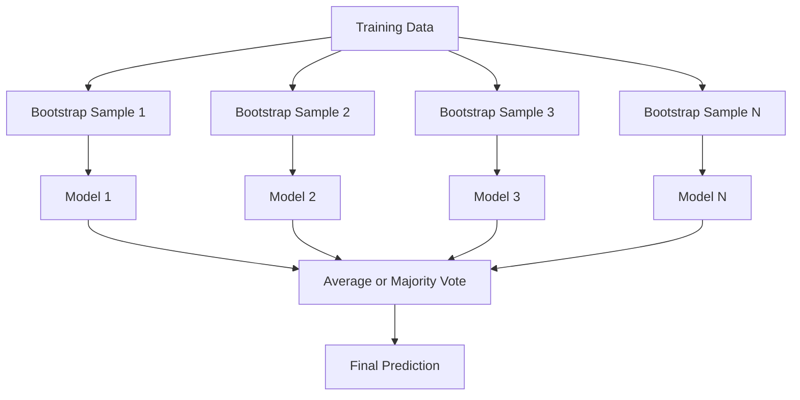
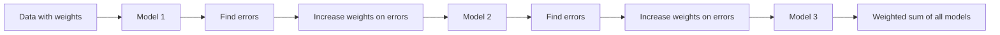
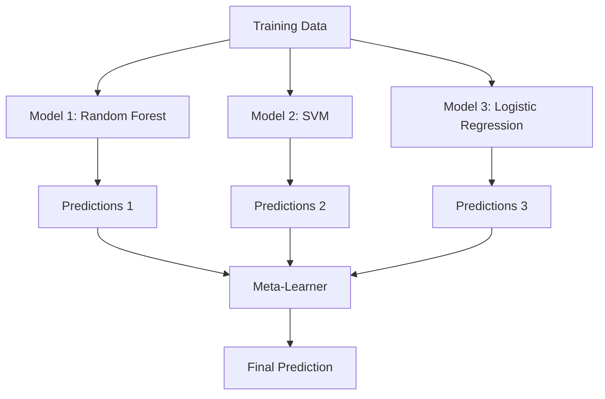

# Kết hợp các phương pháp

> Một nhóm học sinh yếu, nếu đúng đúng, sẽ trở thành một học sinh mạnh.

**Type:** Build
**Language:**Python
**Prerequisites:** Phase 2, Lesson 10 (Bias-Variance Tradeoff)
**Time:** ~120 分钟

## Học mục tiêu

- Từ zero thực hiện AdaBoost và tăng gradient,并 giải thích tăng  làm thế nào theo thứ tự giảm thiên vị
- Xây dựng một tập hợp đóng gói, và mô tả về mô hình liên quan tìm kiếm trung bình làm thế nào để giảm sự khác biệt trong trường hợp không tăng thiên vị
- Từ mỗi phương pháp đối với các thành phần lỗi  góc độ so sánh đệm, tăng cường và xếp chồng
- 评估 đa dạng tập thể,并 giải thích tại sao với sự gia nhập của nhiều học viên yếu độc lập hơn, độ chính xác bỏ phiếu đa số sẽ tăng lên

## 问题

单个决策树 训练速度快且易解释,但会过──单个线性模型 在复杂边界上会过──你可以花几天时间设计完美的模型架构──或者,你可以组合一批不完美的模型,得到一个比它们任何单个模型都更好的结果──

Các phương pháp tập hợp chính là cách này. Chúng được sử dụng trong dữ liệu bảng xếp hạng để giành chiến thắng trong sự cạnh tranh của Kaggle, hỗ trợ cho hầu hết các hệ thống ML sản xuất, và đã thực sự thể hiện tác dụng thực tế của sự giao dịch biến thái-vần số.

## 概念

### Tại sao các tập đoàn có hiệu quả

假设 bạn có N 个独立分类器, chính xác của mỗi đều là p > 0,5;; chính xác của đa số phiếu 为:

```
P(majority correct) = sum over k > N/2 of C(N,k) * p^k * (1-p)^(N-k)
```

Đối với 21 loại chính xác 平均为60% phân loại, số phiếu chính xác đại đa số là khoảng 74%── Nếu có 101 loại, sẽ tăng lên 84%──

关键要求是 **diversity**Nếu tất cả các mô hình đều mắc sai lầm tương tự, việc kết hợp chúng không giúp gì.

- 不同的训练子集(đặt túi)
- 不同的特色子集 (tự nhiên rừng)
- 顺序式 sửa lỗi( tăng cường)
- 不同的模型家族(lắp xếp)

### Tải túi (Tổ hợp cột cột)

Bagging 通过在训练数据的不同 bootstrap sample 上训练每个模型来创造多样性──



mẫu bootstrap là một mẫu được lấy lại từ dữ liệu nguyên thủy, có kích thước tương tự như dữ liệu nguyên thủy. Trong mỗi bootstrap, có 63,2% mẫu độc đáo xuất hiện.

Bagging trong trường hợp gần như không tăng thiên vị giảm sự khác biệt. Mỗi cây riêng biệt sẽ quá phù hợp với mẫu bootstrap của riêng mình, nhưng quá phù hợp của mỗi cây khác nhau, do đó đòi hỏi phải trung bình chống lại tiếng ồn.

**Random Forests**                                                                                                                                                                                                                                                              `sqrt(n_features)`, và sự lùi lại trong`n_features / 3`

### Tăng  (顺序式 Phản chỉnh lỗi)

Tăng cường 按顺序训练模型──每个新模型都关注之前模型预测错误的例子──



Tăng  giảm thiên vị. Mỗi mô hình mới đều sẽ được chỉnh sửa đúng trước các sai lầm hệ thống của tập hợp. Dự đoán cuối cùng là tổng cân của tất cả các mô hình, trong đó mô hình tốt hơn sẽ đạt được trọng lượng cao hơn.

权衡 nằm ở: nếu chạy quá nhiều vòng, tăng cường có thể sẽ quá phù hợp, vì nó sẽ liên tục phù hợp với các ví dụ khó hơn, trong đó có thể chỉ là tiếng ồn.

### AdaBoost

AdaBoost (Adaptive Boosting) là thuật toán tăng cường thực tế thứ nhất. Nó có thể được sử dụng với bất kỳ học viên cơ bản nào, thường sử dụng các cột quyết định (thiên độ-1).

算法:

```
1. Initialize sample weights: w_i = 1/N for all i

2. For t = 1 to T:
   a. Train weak learner h_t on weighted data
   b. Compute weighted error:
      err_t = sum(w_i * I(h_t(x_i) != y_i)) / sum(w_i)
   c. Compute model weight:
      alpha_t = 0.5 * ln((1 - err_t) / err_t)
   d. Update sample weights:
      w_i = w_i * exp(-alpha_t * y_i * h_t(x_i))
   e. Normalize weights to sum to 1

3. Final prediction: H(x) = sign(sum(alpha_t * h_t(x)))
```

Phản ứng có lỗi thấp hơn sẽ nhận được alpha cao hơn. Các mẫu được phân loại sai sẽ nhận được trọng lượng cao hơn, để mô hình tiếp theo tập trung vào chúng.

### Tăng dần

Tăng cường độ phân tử sẽ tăng 泛化 thành hàm mất tích tùy ý. Nó không phải là tái tạo các mẫu, mà là để mỗi mô hình mới phù hợp với các dư thừa của tập hợp hiện tại.

```
1. Initialize: F_0(x) = argmin_c sum(L(y_i, c))

2. For t = 1 to T:
   a. Compute pseudo-residuals:
      r_i = -dL(y_i, F_{t-1}(x_i)) / dF_{t-1}(x_i)
   b. Fit a tree h_t to the residuals r_i
   c. Find optimal step size:
      gamma_t = argmin_gamma sum(L(y_i, F_{t-1}(x_i) + gamma * h_t(x_i)))
   d. Update:
      F_t(x) = F_{t-1}(x) + learning_rate * gamma_t * h_t(x)

3. Final prediction: F_T(x)
```

Đối với lỗ lỗi vuông, dư giả là dư thực tế:`r_i = y_i - F_{t-1}(x_i)`❖ Mỗi cây thực tế đều có lỗi trong việc chuẩn bị cho một tập hợp trước.

Tốc độ học tập (shrinkage) kiểm soát mức độ đóng góp của mỗi cây.

### XGBoost: Tại sao nó chủ yếu là dữ liệu bảng tính

XGBoost (eXtreme Gradient Boosting) là một phần tăng gradient của công trình, làm cho nó nhanh chóng, chính xác, và không dễ dàng vượt quá:

- **Regularized objective:**Đánh nặng lá 施加 L1 和 L2 hình phạt, ngăn chặn cây 过度自信
- **Second-order approximation:**Đồng thời sử dụng các phái sinh giai đoạn 1 và 2 của Loss, do đó đưa ra các quyết định chia sẻ tốt hơn
- **Sparsity-aware splits:**Bằng cách học cách tốt nhất về các dữ liệu bị mất trong mỗi phân chia, nguyên sinh xử lý các giá trị bị mất
- **Column subsampling:**Như rừng ngẫu nhiên, trong mỗi lần chia rẽ 采样特征 để tăng sự đa dạng
- **Weighted quantile sketch:**Trong dữ liệu phân tán 上高效 tìm kiếm các tính năng liên tục của điểm chia
- **Cache-aware block structure:** Khối ưu hóa bố cục bộ nhớ đối với các dòng cache CPU

Đối với dữ liệu bảng tính, XGBoost và LightGBM tiếp tục tốt hơn mạng thần kinh. Điều này sẽ không thay đổi trong thời gian ngắn. Nếu dữ liệu của bạn có thể được đưa vào các hàng và cột trong bảng thành phần, hãy bắt đầu từ gradient boosting.

### Lắp xếp (Meta-Learning)

Lập các dự đoán của nhiều mô hình cơ bản như các tính năng của người học meta.



Meta-learner sẽ học về những đầu vào nên tin tưởng vào mô hình cơ bản nào. Nếu rừng ngẫu nhiên trong một số khu vực hoạt động tốt hơn, SVM trong các khu vực khác hoạt động tốt hơn, meta-learner sẽ học tương ứng để tiến hành các tuyến đường.

Để tránh rò rỉ dữ liệu, dự đoán mô hình cơ sở phải thông qua tập hợp đào tạo trên của việc xác nhận chéo 生成──绝不能在同一批数据上既训练基础模型,再生成meta-features──

### Tiếng bỏ phiếu

                                                                                                                                                                                                                                                              

- **Hard voting:**Đối với các nhãn lớp  bỏ phiếu đa số.
- **Soft voting:**Đối với xác suất dự đoán 求平均, chọn xác suất trung bình cao nhất lớp.


```figure
f3-ensemble-average
```

##  xây dựng nó

### 步骤 1: quyết định Stump(Base learner)

`code/ensembles.py`Từ zero đã thực hiện mọi thứ. Chúng ta bắt đầu từ cái cột quyết định.

```python
class DecisionStump:
    def __init__(self):
        self.feature_idx = None
        self.threshold = None
        self.polarity = 1
        self.alpha = None

    def fit(self, X, y, weights):
        n_samples, n_features = X.shape
        best_error = float("inf")

        for f in range(n_features):
            thresholds = np.unique(X[:, f])
            for thresh in thresholds:
                for polarity in [1, -1]:
                    pred = np.ones(n_samples)
                    pred[polarity * X[:, f] < polarity * thresh] = -1
                    error = np.sum(weights[pred != y])
                    if error < best_error:
                        best_error = error
                        self.feature_idx = f
                        self.threshold = thresh
                        self.polarity = polarity

    def predict(self, X):
        n = X.shape[0]
        pred = np.ones(n)
        idx = self.polarity * X[:, self.feature_idx] < self.polarity * self.threshold
        pred[idx] = -1
        return pred
```

### 步骤 2: Từ không thực hiện AdaBoost

```python
class AdaBoostScratch:
    def __init__(self, n_estimators=50):
        self.n_estimators = n_estimators
        self.stumps = []
        self.alphas = []

    def fit(self, X, y):
        n = X.shape[0]
        weights = np.full(n, 1 / n)

        for _ in range(self.n_estimators):
            stump = DecisionStump()
            stump.fit(X, y, weights)
            pred = stump.predict(X)

            err = np.sum(weights[pred != y])
            err = np.clip(err, 1e-10, 1 - 1e-10)

            alpha = 0.5 * np.log((1 - err) / err)
            weights *= np.exp(-alpha * y * pred)
            weights /= weights.sum()

            stump.alpha = alpha
            self.stumps.append(stump)
            self.alphas.append(alpha)

    def predict(self, X):
        total = sum(a * s.predict(X) for a, s in zip(self.alphas, self.stumps))
        return np.sign(total)
```

### 步骤 3: Từ zero thực hiện tăng cường theo cấp

```python
class GradientBoostingScratch:
    def __init__(self, n_estimators=100, learning_rate=0.1, max_depth=3):
        self.n_estimators = n_estimators
        self.lr = learning_rate
        self.max_depth = max_depth
        self.trees = []
        self.initial_pred = None

    def fit(self, X, y):
        self.initial_pred = np.mean(y)
        current_pred = np.full(len(y), self.initial_pred)

        for _ in range(self.n_estimators):
            residuals = y - current_pred
            tree = SimpleRegressionTree(max_depth=self.max_depth)
            tree.fit(X, residuals)
            update = tree.predict(X)
            current_pred += self.lr * update
            self.trees.append(tree)

    def predict(self, X):
        pred = np.full(X.shape[0], self.initial_pred)
        for tree in self.trees:
            pred += self.lr * tree.predict(X)
        return pred
```

### Bước 4: So sánh với Sloan

代码会验证 thực hiện từ đầu của chúng tôi là có thể tạo ra với sklearn của `AdaBoostClassifier`和 `GradientBoostingClassifier`Tương tự với độ chính xác gần,并将 tất cả các phương pháp并排比较.

## Sử dụng nó

### Làm gì để sử dụng mỗi phương pháp

| Method | Reduces | Best for | Watch out for |
|--------|---------|----------|---------------|
| Bagging / Random Forest | Variance | noisy data、features 很多 | 对 bias 没有帮助 |
| AdaBoost | Bias | clean data、简单 base learners | 对 outliers 和 noise 敏感 |
| Gradient Boosting | Bias | tabular data、比赛 | 训练慢，不调参容易 overfit |
| XGBoost / LightGBM | Both | 生产环境 tabular ML | hyperparameters 很多 |
| Stacking | Both | 争取最后 1-2% accuracy | 复杂，存在 meta-learner overfitting 风险 |
| Voting | Variance | 快速组合 diverse models | 只有在模型足够 diverse 时才有帮助 |

### Tablelar Data của sản xuất Stack

Đối với hầu hết các vấn đề dự đoán bảng tính, hãy thử theo quy trình sau:

1. 使用默认参数 của **LightGBM 或 XGBoost**
2. 调优 n_estimators、learning_rate、max_depth、min_child_weight
3. Nếu cần tăng 0.5% cuối cùng, xây dựng một tập hợp xếp chồng bao gồm 3-5 mô hình đa dạng
4. 全程使用 hợp lệ chéo

Mặc dù nghiên cứu vẫn đang diễn ra, Mạng thần kinh trên dữ liệu bảng xếp hạng trên hầu như luôn tăng gradient 差──TabNet、NODE và các cấu trúc tương tự đôi khi có thể gần gũi, nhưng rất ít có thể vượt qua điều chỉnh XGBoost tốt.

## 交付 nó

本课会产出 `outputs/prompt-ensemble-selector.md`-- một giúp bạn cho một tập dữ liệu nhất định  chọn phương pháp tập hợp phù hợp  mô tả dữ liệu của bạn  kích thước, kiểu tính năng, mức độ tiếng ồn, cân bằng lớp học) và các vấn đề bạn đang giải quyết                                                                                                                                                                                                                                    `outputs/skill-ensemble-builder.md`, trong đó bao gồm toàn bộ lựa chọn chỉ dẫn:.

## 练习

1. 修改 AdaBoost 实现, theo dõi độ chính xác đào tạo mỗi vòng sau đó.

2. 通过向归 regression tree 添加随机特性子样本,从零实现一个随机森林──使用 `max_features=sqrt(n_features)`训练 100 cây và đối với dự đoán 求平均――将变差减少与单树比较――

3. Trong tăng độ 实现中添加早期停止: mỗi vòng sau khi theo dõi mất hiệu quả, nếu liên tục 10 vòng không tăng thì dừng lại.

4. 构建一个包含三个基模型(logistics regression、decision tree、k-nearest neighbors) và một logistic regression meta-learner的堆积组──使用五倍交叉验证 生成 meta-特征──与每个基模型 单独使用时比较──

5. Trong cùng một bộ dữ liệu trên sử dụng các tham số mặc định để chạy XGBoost.

## 关键术语

| Term | 常见说法 | 实际含义 |
|------|----------------|----------------------|
| Bagging | “在 random subsets 上训练” | Bootstrap aggregating：在 bootstrap samples 上训练模型，对 predictions 求平均以降低 variance |
| Boosting | “关注 hard examples” | 按顺序训练模型，每个模型纠正当前 ensemble 的错误，以降低 bias |
| AdaBoost | “重新加权数据” | 通过 sample weight updates 实现 boosting；misclassified points 会在下一个 learner 中获得更高 weight |
| Gradient boosting | “拟合 residuals” | 通过让每个新模型拟合 Loss Function 的 negative Gradient 来实现 boosting |
| XGBoost | “Kaggle 武器” | 带有 regularization、second-order optimization 和系统级加速技巧的 gradient boosting |
| Stacking | “模型叠在模型上” | 将 base models 的 predictions 作为 meta-learner 的 input features |
| Random forest | “许多 randomized trees” | 使用 decision trees 的 bagging，并在每次 split 时加入 random feature subsampling 以增加 diversity |
| Ensemble diversity | “犯不同错误” | 模型的错误必须不相关，ensemble 才能优于单个模型 |
| Out-of-bag error | “免费 validation” | 不在某次 bootstrap draw 中的 samples（约 36.8%）可作为 validation set，无需单独 holdout |

## 延伸阅读

- [Schapire & Freund: Boosting: Foundations and Algorithms](https://mitpress.mit.edu/9780262526036/)-- AdaBoost 创建者所著的书
- [Friedman: Greedy Function Approximation: A Gradient Boosting Machine (2001)](https://statweb.stanford.edu/~jhf/ftp/trebst.pdf)-- 原始 gradient tăng cường 论文
- [Chen & Guestrin: XGBoost (2016)](https://arxiv.org/abs/1603.02754)-- XGBoost 论文
- [Wolpert: Stacked Generalization (1992)](https://www.sciencedirect.com/science/article/abs/pii/S0893608005800231)-- 原始 xếp chồng 论文
- [scikit-learn Ensemble Methods](https://scikit-learn.org/stable/modules/ensemble.html)-- 实用参考
