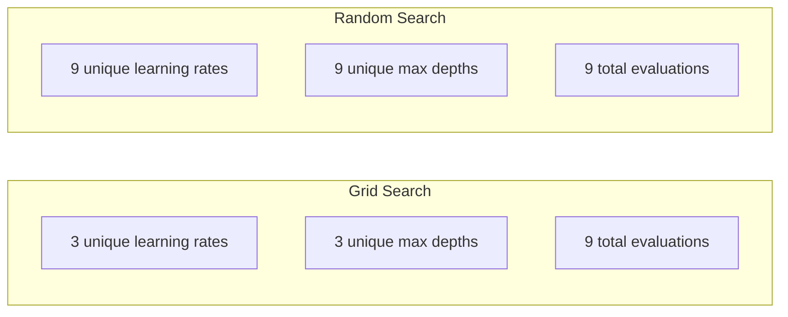
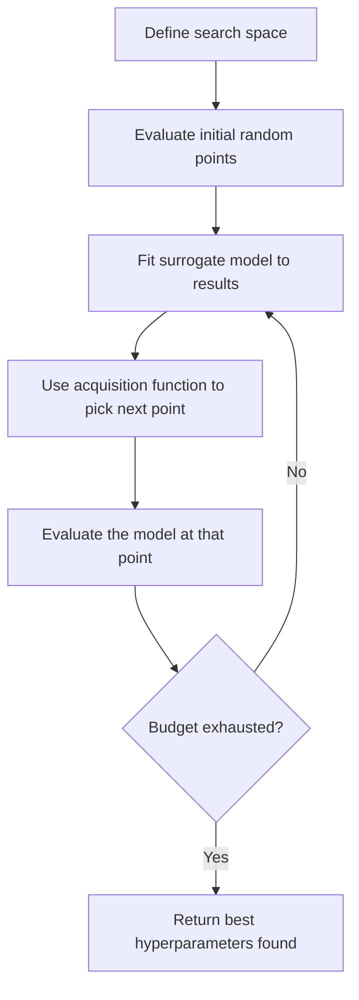
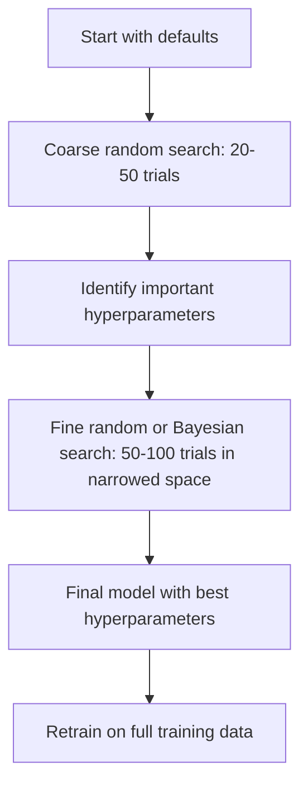
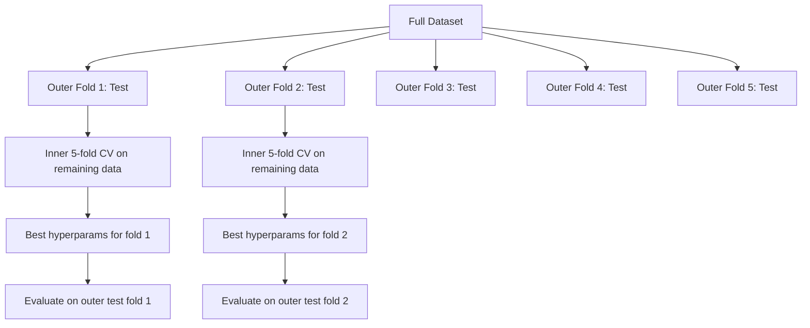

# Định hướng siêu tham số

> Các siêu tham số là việc tập luyện trước khi bạn điều chỉnh các vòng quay.

**Type:** Build
**Language:**Python
**Prerequisites:** Phase 2, Lesson 11 (Ensemble Methods)
**Time:** ~90 分钟

## Học mục tiêu
- Từ việc thực hiện tìm kiếm lưới không gian, tìm kiếm ngẫu nhiên và tối ưu hóa Bayesian, và so sánh hiệu quả lấy của chúng
- 解释 tại sao khi hầu hết các siêu tham số có hiệu lực thấp hơn, tìm kiếm ngẫu nhiên sẽ tốt hơn tìm kiếm lưới
- Sử dụng mô hình thay thế và hàm thu thập  xây dựng tối ưu hóa Bayesian  vòng để hướng dẫn tìm kiếm
-  thiết kế một kiểu điều chỉnh siêu tham số  chiến lược, thông qua hợp lý của validation chéo  tránh đối với validation set  quá hợp lý

## 问题
Bạn có tỷ lệ tăng gradient  mô hình có tốc độ học hỏi, số lượng cây, chiều sâu tối đa, mẫu trong mỗi lá, tỷ lệ mẫu và tỷ lệ mẫu cột.

Tìm kiếm lưới là phương pháp trực tiếp nhất, cũng là phương pháp lớn nhất sau khi thay đổi quy mô. Tìm kiếm ngẫu nhiên sử dụng ít lượng tính toán hơn có thể làm tốt hơn.

## 概念
### Các tham số so với các tham số siêu

Các tham số là trong quá trình đào tạo học được của các trọng lượng, thiên vị, ngưỡng chia) ――Hyperparameters là bắt đầu đào tạo trước thiết lập, để kiểm soát việc học cách xảy ra。

| Hyperparameter | 控制什么 | 典型范围 |
|---------------|-----------------|---------------|
| Learning rate | 每次更新的步长 | 0.001 到 1.0 |
| Number of trees/epochs | 训练时长 | 10 到 10,000 |
| Max depth | 模型复杂度 | 1 到 30 |
| Regularization (lambda) | 防止过拟合 | 0.0001 到 100 |
| Batch size | Gradient 估计噪声 | 16 到 512 |
| Dropout rate | 被丢弃的 neurons 比例 | 0.0 到 0.5 |

### Tìm kiếm lưới

Tìm kiếm lưới sẽ đánh giá mỗi loại kết hợp có giá trị được xác định. Nó là rất dễ hiểu, nhưng sẽ tăng lên theo các tham số siêu.

```
Grid for 2 hyperparameters:

  learning_rate: [0.01, 0.1, 1.0]
  max_depth:     [3, 5, 7]

  Evaluations: 3 x 3 = 9 combinations

  (0.01, 3)  (0.01, 5)  (0.01, 7)
  (0.1,  3)  (0.1,  5)  (0.1,  7)
  (1.0,  3)  (1.0,  5)  (1.0,  7)
```

Tìm kiếm lưới có một thiếu sót cơ bản: Nếu một siêu tham số  rất quan trọng, còn một khác không quan trọng, hầu hết các đánh giá đều bị lãng phí.

### Tìm kiếm ngẫu nhiên

Tìm kiếm ngẫu nhiên không phải là lấy giá trị từ lưới, mà từ phân bố lấy các siêu tham số.



Tại sao ngẫu nhiên 会胜过网(Bergstra & Bengio, 2012):

- Hầu hết các siêu tham số có hiệu lực rất thấp. Đối với một vấn đề cụ thể, chỉ có 1-2 siêu tham số trong số đó thường thực sự quan trọng.
- Tìm kiếm lưới sẽ đánh giá lãng phí ở không quan trọng.
- Trong cùng ngân sách, tìm kiếm ngẫu nhiên sẽ có nhiều hơn bao gồm các kích thước quan trọng.
- Trong 60 lần thử nghiệm ngẫu nhiên, nếu trong không gian tìm kiếm có điểm tối ưu nhất, bạn có 95% khả năng tìm thấy một điểm từ khoảng cách tối ưu nhất 5%

### Bayesian Optimization

Tìm kiếm ngẫu nhiên sẽ bỏ qua kết quả. Nó sẽ không học đến tỷ lệ học tập cao hơn sẽ dẫn đến sự khác biệt, cũng sẽ không học đến độ sâu 3 trực tiếp tốt hơn độ sâu 10.



2 thành phần quan trọng:

**Surrogate model:**Một mô hình đánh giá chi phí thấp (thường là quy trình Gaussian) được sử dụng cho chức năng khách quan gần như đắt tiền. Nó sẽ cung cấp giá trị dự đoán và ước tính không chắc chắn ở bất kỳ điểm nào trong không gian tìm kiếm.

**Acquisition function:**Thông qua cân bằng khai thác (trong tìm kiếm ở một điểm tốt được biết đến) và thăm dò (trong tìm kiếm ở một khu vực không chắc chắn), quyết định bước tiếp theo để đánh giá ở đâu.

- **Expected Improvement (EI):**Chúng ta dự đoán điểm này có thể tăng lên bao nhiêu so với giá trị tối ưu hiện tại?
- **Upper Confidence Bound (UCB):**预测值加上某倍数不确定性―― UCB cao hơn cho thấy điểm này có tiềm năng, hoặc chưa được khám phá đầy đủ――
- **Probability of Improvement (PI):**Khoảng trường hợp này có thể là gì?

Optimize Bayesian thường có thể sử dụng so với tìm kiếm ngẫu nhiên ít hơn 2-5 lần lần đánh giá để tìm ra các siêu tham số tốt hơn.

### Giữ sớm

Không phải mỗi buổi tập đều cần phải chạy hoàn thành. Nếu một số giao dịch trong 10 thời đại 显然 rất kém, hãy dừng nó và tiếp tục tiếp theo.

策略:
- **Patience-based:**Nếu mất hiệu lực 连续 N 个时代 没有提升,就停止
- **Median pruning:**Nếu kết quả trung bình của một thử nghiệm khác so với kết quả trung bình của các thử nghiệm đã hoàn thành, hãy dừng lại.
- **Hyperband:**Đưa cho nhiều tài khoản phân bổ với ngân sách nhỏ, sau đó dần dần tăng ngân sách phân bổ tối ưu

Hyperband 尤其有效──它先用 1 时代 启动 81 配置,保留前三分之一,给它们 3 时代,再保留前三分之一,根据此类推推──相比使用完整预算评估所有配置,这能快 10-50倍找到好的配置──

### Các lập trình học tập

Tốc độ học tập 几乎总是最重要的超参数――与其保持固定,不如使用安排器调整它在训练过程中――

| Scheduler | Formula | 何时使用 |
|-----------|---------|-------------|
| Step decay | 每 N 个 epochs 乘以 0.1 | 经典 CNN 训练 |
| Cosine annealing | lr * 0.5 * (1 + cos(pi * t / T)) | 现代默认选择 |
| Warmup + decay | 先线性增加，再 cosine decay | Transformers |
| One-cycle | 在一个 cycle 内先增加再减少 | 快速收敛 |
| Reduce on plateau | 指标停滞时按因子降低 | 稳妥默认选择 |

### Tầm quan trọng của các siêu tham số

Không phải tất cả các siêu tham số đều quan trọng như nhau. Nghiên cứu về rừng ngẫu nhiên (Probst et al., 2019) và tăng độ cho thấy một mô hình phù hợp:

**高重要性：**
- Tốc độ học tập (始终优先调)
- Số lượng ước tính / thời kỳ( sử dụng dừng sớm, thay vì调它)
- Độ mạnh của sự điều chỉnh

**中等重要性：**
- Độ sâu tối đa / số lớp
- Min mẫu mỗi lá / phân hủy trọng lượng
- Tỷ lệ mẫu phụ

**低重要性：**
- Max tính năng( Đối với rừng ngẫu nhiên)
- 具体激活函数 的选择
- Kích thước lô ((在合理范围内)

Trước tiên điều quan trọng, còn lại giữ nguyên giá trị được xác định.

### Chiến lược thực tế



具体工作流:

1. **从库的默认值开始。**Chúng được lựa chọn bởi những người thực hành giàu kinh nghiệm, thường đã đạt đến hiệu quả 80%.
2. **粗粒度 random search。**Sử dụng phạm vi rộng, 20-50 lần thử nghiệm.
3. **分析结果。** Những siêu tham số nào liên quan đến hiệu suất?
4. **精细搜索。**Trong không gian thu nhỏ sau sử dụng tối ưu hóa Bayesian hoặc tìm kiếm ngẫu nhiên tập trung ⋅ 50-100 lần thử nghiệm ⋅
5. **使用找到的最佳 hyperparameters 在全部训练数据上重新训练。**

### Sự xác minh chéo 集成

Trong phân chia xác thực đơn lẻ 上调 siêu tham số 有风险. . . . . . . . . . . . . . . . . . . . . . . . . . . . . . . . . . . . . . . . . . . . . . . . . . . . . . . . . . . . . . . . . . . . . . . . . . . . . . . . . . . . . . . . . . . . . . . . . . . . . . . . . . . . . . . . . . . . . . . . . . . . . . . . . . . . . . . . . . . . . . . . . . . . . . . . . . . . . . . . . . . . . . . . . . . . . . . . . . . . . . . . . . . . . . . . . . . . . . . . . . . . . . . . . . . . . . . . . . . . . . . . . . . . . . . . . . . . . . . . . . . . . . . . . . . . . . . . . . . . . . . . . . . . . . . . . . . . . . . . . . . . . . . . . . . . . . . . . . . . . . . . . . . . . . . . . . . . . . . . . . . . . . . . . . . . . . . . . . . . . . . . . . . . . . . . . . . . . . . . . . . . . . . . . . . . . . . . . . . . . . . . . . . . . . . . . . . . . . . . . . . . . . . . . . . . . . . . . . . . . . . . . . . . . . . . . . . . . . . . . . . . . . . . . . . . . . . . . . . . . . . . . . . . . . . . . . . . . . . . . . . . . . . . . . . . . . .

- **Outer loop**(评估): sẽ phân chia dữ liệu thành train+val và test.
- **Inner loop**(调优):将 train+val 拆分为 train 和 val── tìm ra các siêu tham số tốt nhất──



Mỗi lần gấp bên ngoài thành phố sẽ tự do tìm ra các siêu tham số tốt nhất của mình.

Sử dụng:

```python
from sklearn.model_selection import cross_val_score, GridSearchCV
from sklearn.ensemble import GradientBoostingRegressor

inner_cv = GridSearchCV(
    GradientBoostingRegressor(),
    param_grid={
        "learning_rate": [0.01, 0.05, 0.1],
        "max_depth": [2, 3, 5],
        "n_estimators": [50, 100, 200],
    },
    cv=5,
    scoring="neg_mean_squared_error",
)

outer_scores = cross_val_score(
    inner_cv, X, y, cv=5, scoring="neg_mean_squared_error"
)

print(f"Nested CV MSE: {-outer_scores.mean():.4f} +/- {outer_scores.std():.4f}")
```

Đây là rất đắt tiền ((5 gấp bên ngoài x 5 gấp bên trong x 27 điểm lưới = 675 lần mô hình phù hợp), nhưng nó có thể cung cấp ước tính hiệu suất đáng tin cậy;; khi bạn báo cáo kết quả cuối cùng trong bài viết, hoặc quyết định rủi ro cao hơn khi sử dụng nó;;

### Những lời khuyên hữu ích

**从 learning rate 开始。**Đối với phương pháp dựa trên gradient, nó luôn là siêu tham số quan trọng nhất. Tốc độ học tập tồi tệ sẽ làm cho tất cả các thiết lập khác mất ý nghĩa.

**对 learning rate 和 regularization 使用 log-uniform distributions。**Sự khác biệt giữa 0.001 và 0.01 cũng quan trọng như sự khác biệt giữa 0.1 và 1.0.

**使用 early stopping，而不是调 n_estimators。**Để tăng cường và mạng thần kinh để nói, hãy đặt n_estimators hoặc epochs 设得高, để dừng sớm quyết định khi nào dừng lại.

**预算分配。**Việc sử dụng 60% trong ngân sách điều chỉnh được dành cho hai siêu tham số quan trọng nhất trên.

**尺度很重要。**永远不要在日志尺度上搜索批量(16、32、64 就可以) ・・・始终在日志尺度上搜索学习率──让搜索分布匹配超参数 影响模型的方式──

| Model Type | Top Hyperparameters | Recommended Search | Budget |
|-----------|--------------------|--------------------|--------|
| Random Forest | n_estimators, max_depth, min_samples_leaf | Random search，50 次 trials | 低（训练快） |
| Gradient Boosting | learning_rate, n_estimators, max_depth | Bayesian，100 次 trials + early stopping | 中 |
| Neural Network | learning_rate, weight_decay, batch_size | Bayesian 或 random，100+ 次 trials | 高（训练慢） |
| SVM | C, gamma (RBF kernel) | 在 log scale 上 grid，25-50 次 trials | 低（2 个参数） |
| Lasso/Ridge | alpha | 在 log scale 上 1D search，20 次 trials | 很低 |
| XGBoost | learning_rate, max_depth, subsample, colsample | Bayesian，100-200 次 trials + early stopping | 中 |

**拿不准时：**Sử dụng tìm kiếm ngẫu nhiên, thử nghiệm số lượng ít nhất là 2 lần số lượng siêu tham số (ví dụ: 6 siêu tham số = ít nhất 12 lần thử nghiệm)  Bạn sẽ ngạc nhiên khi thấy, 50 lần thử nghiệm tìm kiếm ngẫu nhiên thường có thể đánh bại tìm kiếm lưới thiết kế chính xác 


```figure
k-fold-cv
```

##  xây dựng nó
### 步骤 1: Từ zero thực hiện Tìm kiếm lưới

`code/tuning.py`Mã trong từ không thực hiện tìm kiếm lưới, tìm kiếm ngẫu nhiên và một trình tối ưu hóa Bayesian đơn giản.

```python
def grid_search(model_fn, param_grid, X_train, y_train, X_val, y_val):
    keys = list(param_grid.keys())
    values = list(param_grid.values())
    best_score = -float("inf")
    best_params = None
    n_evals = 0

    for combo in itertools.product(*values):
        params = dict(zip(keys, combo))
        model = model_fn(**params)
        model.fit(X_train, y_train)
        score = evaluate(model, X_val, y_val)
        n_evals += 1

        if score > best_score:
            best_score = score
            best_params = params

    return best_params, best_score, n_evals
```

### 步骤 2: Từ zero thực hiện Tìm kiếm ngẫu nhiên

```python
def random_search(model_fn, param_distributions, X_train, y_train,
                  X_val, y_val, n_iter=50, seed=42):
    rng = np.random.RandomState(seed)
    best_score = -float("inf")
    best_params = None

    for _ in range(n_iter):
        params = {k: sample(v, rng) for k, v in param_distributions.items()}
        model = model_fn(**params)
        model.fit(X_train, y_train)
        score = evaluate(model, X_val, y_val)

        if score > best_score:
            best_score = score
            best_params = params

    return best_params, best_score, n_iter
```

### 步骤 3: Bayesian Optimization (Bài bản Optimization)

核心思想:将Gaussian process 拟合到已观测的(hyperparameter, score)配对上, sau đó sử dụng hàm thu thập quyết định bước tiếp theo xem ở đâu──

```python
class SimpleBayesianOptimizer:
    def __init__(self, search_space, n_initial=5):
        self.search_space = search_space
        self.n_initial = n_initial
        self.X_observed = []
        self.y_observed = []

    def _kernel(self, x1, x2, length_scale=1.0):
        dists = np.sum((x1[:, None, :] - x2[None, :, :]) ** 2, axis=2)
        return np.exp(-0.5 * dists / length_scale ** 2)

    def _fit_gp(self, X_new):
        X_obs = np.array(self.X_observed)
        y_obs = np.array(self.y_observed)
        y_mean = y_obs.mean()
        y_centered = y_obs - y_mean

        K = self._kernel(X_obs, X_obs) + 1e-4 * np.eye(len(X_obs))
        K_star = self._kernel(X_new, X_obs)

        L = np.linalg.cholesky(K)
        alpha = np.linalg.solve(L.T, np.linalg.solve(L, y_centered))
        mu = K_star @ alpha + y_mean

        v = np.linalg.solve(L, K_star.T)
        var = 1.0 - np.sum(v ** 2, axis=0)
        var = np.maximum(var, 1e-6)

        return mu, var

    def _expected_improvement(self, mu, var, best_y):
        sigma = np.sqrt(var)
        z = (mu - best_y) / (sigma + 1e-10)
        ei = sigma * (z * norm_cdf(z) + norm_pdf(z))
        return ei

    def suggest(self):
        if len(self.X_observed) < self.n_initial:
            return sample_random(self.search_space)

        candidates = [sample_random(self.search_space) for _ in range(500)]
        X_cand = np.array([to_vector(c) for c in candidates])
        mu, var = self._fit_gp(X_cand)
        ei = self._expected_improvement(mu, var, max(self.y_observed))
        return candidates[np.argmax(ei)]

    def observe(self, params, score):
        self.X_observed.append(to_vector(params))
        self.y_observed.append(score)
```

GP thay thế trong mỗi điểm ứng cử cho ra hai thứ: dự đoán số điểm (mu) và không chắc chắn (var)  Cải tiến dự kiến 会平衡二者:它偏好模型预测高分的点,或不确定性高的点──早期大多数点都有较高的不确定性,因此优化器会进行探索──后期则会集中到最有希望的区域──

### Bước 4: So sánh tất cả các phương pháp

Trong cùng một mục tiêu tổng hợp 上运行三种方法并比较.

```python
def synthetic_objective(params):
    lr = params["learning_rate"]
    depth = params["max_depth"]
    return -(np.log10(lr) + 2) ** 2 - (depth - 4) ** 2 + 10

param_grid = {
    "learning_rate": [0.001, 0.01, 0.1, 1.0],
    "max_depth": [2, 3, 4, 5, 6, 7, 8],
}

grid_best = None
grid_score = -float("inf")
grid_history = []
for combo in itertools.product(*param_grid.values()):
    params = dict(zip(param_grid.keys(), combo))
    score = synthetic_objective(params)
    grid_history.append((params, score))
    if score > grid_score:
        grid_score = score
        grid_best = params

param_dist = {
    "learning_rate": ("log_float", 0.001, 1.0),
    "max_depth": ("int", 2, 8),
}

rand_best = None
rand_score = -float("inf")
rand_history = []
rng = np.random.RandomState(42)
for _ in range(28):
    params = {k: sample(v, rng) for k, v in param_dist.items()}
    score = synthetic_objective(params)
    rand_history.append((params, score))
    if score > rand_score:
        rand_score = score
        rand_best = params

optimizer = SimpleBayesianOptimizer(param_dist, n_initial=5)
bayes_history = []
for _ in range(28):
    params = optimizer.suggest()
    score = synthetic_objective(params)
    optimizer.observe(params, score)
    bayes_history.append((params, score))
bayes_score = max(s for _, s in bayes_history)

print(f"{'Method':<20} {'Best Score':>12} {'Evaluations':>12}")
print("-" * 50)
print(f"{'Grid Search':<20} {grid_score:>12.4f} {len(grid_history):>12}")
print(f"{'Random Search':<20} {rand_score:>12.4f} {len(rand_history):>12}")
print(f"{'Bayesian Opt':<20} {bayes_score:>12.4f} {len(bayes_history):>12}")
```

Trong cùng một ngân sách, tối ưu hóa Bayesian thường có thể tìm thấy điểm tốt nhất nhanh nhất, vì nó sẽ không đánh giá lãng phí trong khu vực rõ ràng xấu.

## Sử dụng nó
### Optuna thực hành

Optuna là một hệ thống điều chỉnh siêu tham số nghiêm ngặt.

```python
import optuna

def objective(trial):
    lr = trial.suggest_float("learning_rate", 1e-4, 1e-1, log=True)
    n_est = trial.suggest_int("n_estimators", 50, 500)
    max_depth = trial.suggest_int("max_depth", 2, 10)

    model = GradientBoostingRegressor(
        learning_rate=lr,
        n_estimators=n_est,
        max_depth=max_depth,
    )
    model.fit(X_train, y_train)
    return mean_squared_error(y_val, model.predict(X_val))

study = optuna.create_study(direction="minimize")
study.optimize(objective, n_trials=100)

print(f"Best params: {study.best_params}")
print(f"Best MSE: {study.best_value:.4f}")
```

Các đặc điểm quan trọng của Optuna:
- `suggest_float(..., log=True)`Sử dụng phù hợp nhất trên thang log trên các tham số tìm kiếm (đường học  quy định)
- `suggest_int`Sử dụng cho các tham số nguyên
- `suggest_categorical`dùng để phân tán chọn
- 内置 MedianPruner, được sử dụng cho các thử nghiệm tồi tệ  thực hiện dừng sớm
- `study.trials_dataframe()`dùng để phân tích

### Optuna với cắt

Việc cắt giảm các thử nghiệm không có hy vọng, do đó tiết kiệm rất nhiều tính toán.

```python
import optuna
from sklearn.model_selection import cross_val_score

def objective(trial):
    params = {
        "learning_rate": trial.suggest_float("lr", 1e-4, 0.5, log=True),
        "max_depth": trial.suggest_int("max_depth", 2, 10),
        "n_estimators": trial.suggest_int("n_estimators", 50, 500),
        "subsample": trial.suggest_float("subsample", 0.5, 1.0),
    }

    model = GradientBoostingRegressor(**params)
    scores = cross_val_score(model, X_train, y_train, cv=3,
                             scoring="neg_mean_squared_error")
    mean_score = -scores.mean()

    trial.report(mean_score, step=0)
    if trial.should_prune():
        raise optuna.TrialPruned()

    return mean_score

pruner = optuna.pruners.MedianPruner(n_startup_trials=10, n_warmup_steps=5)
study = optuna.create_study(direction="minimize", pruner=pruner)
study.optimize(objective, n_trials=200)
```

`MedianPruner`Giá trị trung bình của một thử nghiệm so với cùng một bước số trung bình của tất cả các thử nghiệm đã hoàn thành thấp hơn khi dừng nó.`trial.report()`报告中间指标,并调用 `trial.should_prune()`Chuẩn bị xét xử này có nên dừng lại không?`n_startup_trials=10`确保 ít nhất có 10 thử nghiệm  hoàn toàn hoàn thành, cắt 才 sẽ bắt đầu.

### Sklern's Built-in Tuners

Để có được những thử nghiệm nhanh, học được.`GridSearchCV``RandomizedSearchCV`和 `HalvingRandomSearchCV`- Có thể là:

```python
from sklearn.model_selection import RandomizedSearchCV
from scipy.stats import loguniform, randint

param_dist = {
    "learning_rate": loguniform(1e-4, 0.5),
    "max_depth": randint(2, 10),
    "n_estimators": randint(50, 500),
}

search = RandomizedSearchCV(
    GradientBoostingRegressor(),
    param_dist,
    n_iter=100,
    cv=5,
    scoring="neg_mean_squared_error",
    random_state=42,
    n_jobs=-1,
)
search.fit(X_train, y_train)
print(f"Best params: {search.best_params_}")
print(f"Best CV MSE: {-search.best_score_:.4f}")
```

Đối với tốc độ học tập và quy định sử dụng học tập `loguniform`△ đối với toàn bộ số lượng siêu tham số `randint``n_jobs=-1`标志会在所有CPU核心上并行.

### Hyperparameter Tuning 中的常见错误

**通过 preprocessing 产生 data leakage。**Nếu bạn trong quá trình xác nhận chéo trước trong bộ dữ liệu hoàn chỉnh trên phù hợp với một bộ quy mô, thông tin của gấp xác nhận sẽ bị rò rỉ vào trong tập luyện.`Pipeline`, để nó chỉ được tập trung vào lớp gấp lên phù hợp.

**对 validation set 过拟合。**运行数千 lần thử nghiệm  thực tế giống như trên bộ xác thực trên đào tạo.

**搜索范围太窄。**Nếu giá trị tối ưu của bạn nằm ở biên giới không gian tìm kiếm, hãy cho biết phạm vi tìm kiếm không đủ rộng.

**忽略交互效应。**Trong thời gian tăng cường, tỷ lệ học tập và số lượng các ước tính có sự tương tác mạnh mẽ.

**没有对 iterative models 使用 early stopping。**Đối với tăng gradient và mạng thần kinh, sẽ n_estimators hoặc epochs  thiết lập cho giá trị cao hơn并 sử dụng dừng sớm.

## 练习
1. Sử dụng cùng tổng ngân sách chạy tìm kiếm lưới và tìm kiếm ngẫu nhiên (ví dụ: 50 lần đánh giá) ―― So sánh tìm thấy số lượng tốt nhất―― sử dụng hạt giống khác nhau 运行实验 10 lần―― Tìm kiếm ngẫu nhiên 赢得多少次?

2. Từ zero thực hiện Hyperband. Từ 81 giao dịch bắt đầu, mỗi tập 1 thời đại.

3. 给Dạy học 11 Trung tâm tăng gradient 实现添加一个学习率调度器 (tỷ lệ học tập)  与固定学习率相比, nó có hữu ích không?

4. Sử dụng Optuna trong tập dữ liệu thực tế (ví dụ như tập dữ liệu ung thư vú của sklearn)`optuna.visualization.plot_param_importances(study)`Xem những siêu tham số nào quan trọng nhất. Nó có phù hợp với thứ tự quan trọng trong bài học này không?

5. 实现一个简单的收购功能(Tạm dịch: 预期改进),并演示探索与利用――绘制代代代模型的平均值和不确定性,并演示 EI 选择下一步评估的位置――

## 关键术语
| Term | 人们通常说 | 实际含义 |
|------|----------------|----------------------|
| Hyperparameter | “你选择的一个设置” | 训练前设置的值，用来控制学习过程，不是从数据中学习得到的 |
| Grid search | “尝试每一种组合” | 在指定 parameter grid 上进行穷举搜索。成本呈指数级增长。 |
| Random search | “就是随机采样” | 从分布中采样 hyperparameters。比 grid search 更好地覆盖重要维度。 |
| Bayesian optimization | “智能搜索” | 使用 objective 的 surrogate model 来决定下一步评估哪里，平衡 exploration 和 exploitation |
| Surrogate model | “一个便宜的近似” | 一个模型（通常是 Gaussian process），根据已观测评估来近似昂贵的 objective function |
| Acquisition function | “下一步看哪里” | 通过平衡 expected improvement 和不确定性，为候选点打分。EI 和 UCB 是常见选择。 |
| Early stopping | “停止浪费时间” | 当 validation performance 停止提升时，提前终止训练 |
| Hyperband | “配置的锦标赛分组” | 自适应资源分配：用小预算启动许多 configs，保留最好的并增加它们的预算 |
| Learning rate scheduler | “训练期间改变 lr” | 一个函数，用于在训练过程中调整 learning rate，以获得更好的收敛 |

## 延伸阅读
- [Bergstra & Bengio: Random Search for Hyper-Parameter Optimization (2012)](https://jmlr.org/papers/v13/bergstra12a.html)-- 证明 胜过网 的论文
- [Snoek et al., Practical Bayesian Optimization of Machine Learning Algorithms (2012)](https://arxiv.org/abs/1206.2944)-- dùng để tối ưu hóa Bayesian của ML
- [Li et al., Hyperband: A Novel Bandit-Based Approach (2018)](https://jmlr.org/papers/v18/16-558.html)-- Hyperband 论文
- [Optuna: A Next-generation Hyperparameter Optimization Framework](https://arxiv.org/abs/1907.10902)-- Optuna 论文
- [Probst et al., Tunability: Importance of Hyperparameters (2019)](https://jmlr.org/papers/v20/18-444.html)-- 哪些 siêu tham số 重要
