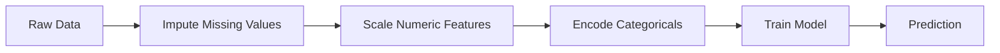
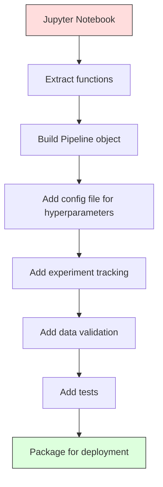

# ML đường ống dẫn

> 模型不是产品──Pipeline 才是──Pipeline 覆盖从原始数据到部署预测的全部过程,并且每一步都必须可复现──

**Type:** Build
**Language:**Python
**Prerequisites:** Phase 2, Lesson 12 (Hyperparameter Tuning)
**Time:** ~120 minutes

## Học mục tiêu
- Từ zero xây dựng một ML Pipeline, sẽ tính toán, quy mô, mã hóa và đào tạo mô hình 串联 thành một đối tượng đơn lẻ có thể thực hiện
- 识别数据泄漏 场景,并解释 Pipeline 如何通过仅在训练数据 上拟合变压器以防止泄漏
-  xây dựng một ColumnTransformer, đối với tính năng số và phân loại  áp dụng các tính năng xử lý trước khác nhau
- Thực hiện hệ thống hệ thống đường ống, và chứng minh kết quả phù hợp với một đường ống đã được thiết kế trong đào tạo và sản xuất

## 问题
Bạn có một sổ ghi chép: nó tải dữ liệu, sử dụng trung bình ấp đầy các giá trị thiếu, thu nhỏ các tính năng, mô hình tập luyện,并 in chính xác.

Một tháng sau, một người đã đào tạo lại mô hình, nhưng có kết quả khác nhau. trung bình là trong một tập dữ liệu đầy đủ chứa dữ liệu thử nghiệm trên tính toán.

Những điều này không phải là giả thuyết. Chúng là nguyên nhân phổ biến nhất của thất bại trong sản xuất của hệ thống ML.

## 概念
### Đường ống là gì

Đường ống là một bộ chuyển đổi dữ liệu có trật tự, tiếp theo một mô hình. Mỗi bước đều là bước đầu ra trước như là nhập vào.



Đường ống bảo đảm:
- Chuyển đổi chỉ trong dữ liệu đào tạo 上拟合(无泄漏)
- Thuyết định 时 áp dụng hoàn toàn giống nhau chuyển đổi
- Toàn bộ đối tượng có thể được phân phối theo chuỗi, được triển khai như một vật thể
- Việc xác thực chéo sẽ được áp dụng trong mỗi đường ống, ngăn chặn các rò rỉ nhỏ

### Data leak: sát thủ im lặng

Việc rò rỉ dữ liệu xảy ra trong bộ thử nghiệm hoặc trong các dữ liệu tương lai trong quá trình đào tạo về ô nhiễm thông tin.

**Leaky（错误）：**
```python
X = df.drop("target", axis=1)
y = df["target"]

scaler = StandardScaler()
X_scaled = scaler.fit_transform(X)

X_train, X_test = X_scaled[:800], X_scaled[800:]
y_train, y_test = y[:800], y[800:]
```

Scaler nhìn thấy dữ liệu thử nghiệm.

**Correct：**
```python
X_train, X_test = X[:800], X[800:]

scaler = StandardScaler()
X_train_scaled = scaler.fit_transform(X_train)
X_test_scaled = scaler.transform(X_test)
```

Sử dụng đường ống 时, bạn không cần phải đặc biệt suy nghĩ về vấn đề này.

### Schularn Pipeline

sklearn của `Pipeline`会串联变压器 和一个估计器.`.fit()``.predict()`和 `.score()`, theo trật tự áp dụng tất cả các bước:

```python
from sklearn.pipeline import Pipeline
from sklearn.preprocessing import StandardScaler
from sklearn.linear_model import LogisticRegression

pipe = Pipeline([
    ("scaler", StandardScaler()),
    ("model", LogisticRegression()),
])

pipe.fit(X_train, y_train)
predictions = pipe.predict(X_test)
```

Khi bạn调用`pipe.fit(X_train, y_train)`时:
1. Scaler trong X_train 上调用 `fit_transform`
2. Mô hình trong quy mô X_train 上调用 `fit`

Khi bạn调用`pipe.predict(X_test)`时:
1. Scaler trong X_test 上调 `transform`(不是 fit_transform)
2. Mô hình trong quy mô X_test 上调用 `predict`

Scaler trong quá trình lắp đặt sẽ không bao giờ thấy dữ liệu thử nghiệm. Đó là mục đích chính của nó.

### ColumnTransformer:不同列使用不同管道

Real dataset cũng chứa các cột số và danh mục, chúng cần xử lý trước khác nhau.`ColumnTransformer`负责处理这种情况――

```python
from sklearn.compose import ColumnTransformer
from sklearn.preprocessing import StandardScaler, OneHotEncoder
from sklearn.impute import SimpleImputer

numeric_pipe = Pipeline([
    ("impute", SimpleImputer(strategy="median")),
    ("scale", StandardScaler()),
])

categorical_pipe = Pipeline([
    ("impute", SimpleImputer(strategy="most_frequent")),
    ("encode", OneHotEncoder(handle_unknown="ignore")),
])

preprocessor = ColumnTransformer([
    ("num", numeric_pipe, ["age", "income", "score"]),
    ("cat", categorical_pipe, ["city", "gender", "plan"]),
])

full_pipeline = Pipeline([
    ("preprocess", preprocessor),
    ("model", GradientBoostingClassifier()),
])
```

OneHotEncoder 中的 `handle_unknown="ignore"`Đối với sản xuất 至关重要── Khi một loại mới xuất hiện (ví dụ như mô hình của một thành phố chưa từng thấy), nó sẽ tạo ra một vector toàn không, chứ không phải là sự sụp đổ trực tiếp.

### Theo dõi thí nghiệm

Pipeline 让训练可复现, nhưng bạn cũng cần theo dõi các thí nghiệm 之间发生了什么: sử dụng bất kỳ siêu tham số nào 哪个数据集版本、metrics 是什么、运行的是哪个代码──

**MLflow**là các giải pháp nguồn mở phổ biến nhất:

```python
import mlflow

with mlflow.start_run():
    mlflow.log_param("max_depth", 5)
    mlflow.log_param("n_estimators", 100)
    mlflow.log_param("learning_rate", 0.1)

    pipe.fit(X_train, y_train)
    accuracy = pipe.score(X_test, y_test)

    mlflow.log_metric("accuracy", accuracy)
    mlflow.sklearn.log_model(pipe, "model")
```

Mỗi lần chạy đều ghi lại các tham số, métrics, artefacts và mô hình hoàn chỉnh. Bạn có thể so sánh chạy, thực hiện thử nghiệm bất kỳ, và triển khai phiên bản mô hình bất kỳ.

**Weights & Biases (wandb)**提供相同功能,并带有主机仪表板:

```python
import wandb

wandb.init(project="my-pipeline")
wandb.config.update({"max_depth": 5, "n_estimators": 100})

pipe.fit(X_train, y_train)
accuracy = pipe.score(X_test, y_test)

wandb.log({"accuracy": accuracy})
```

### Phương pháp phiên bản mô hình

完成实验追踪 后, bạn cần quản lý phiên bản mô hình.

MLflow's Model Registry 提供:
- **Version tracking:**Mỗi mô hình được lưu lại sẽ nhận được một số phiên bản
- **Stage transitions:**"Stage" ̋"Sản xuất" ̋"Tài lưu"
- **Approval workflow:**Mô hình phải được xác định được thúc đẩy đến sản xuất
- **Rollback:**立即切回 trước phiên bản

### DLC

代码 dùng git làm phiên bản. DATA cũng nên được phiên bản, nhưng git không thể xử lý file lớn.

```
dvc init
dvc add data/training.csv
git add data/training.csv.dvc data/.gitignore
git commit -m "Track training data"
dvc push
```

DVC sẽ lưu trữ dữ liệu thực tế trong bộ nhớ từ xa (S3、GCS、Azure) và giữ một phần nhỏ trong git.`.dvc`文件来记录 hash──当你检查 某 git commit 时,`dvc checkout`Sẽ khôi phục dữ liệu chính xác được sử dụng lúc đó.

Điều này có nghĩa là mỗi git commit đều cố định mã và dữ liệu cùng lúc.

### Các thí nghiệm có thể tái tạo

Một thí nghiệm có thể thực hiện được cần bốn điều:

1. **Fixed random seeds:**为 numpy、random 和 framework(torch、sklearn) đặt hạt giống
2. **Pinned dependencies:**使用带精确版本的 requirements.txt hoặc poetry.lock
3. **Versioned data:**Sử dụng DVC hoặc các công cụ tương tự
4. **Config files:**Tất cả các siêu tham số đều được đặt trong cấu hình, chứ không phải mã hóa cứng

```python
import numpy as np
import random

def set_seed(seed=42):
    random.seed(seed)
    np.random.seed(seed)
    try:
        import torch
        torch.manual_seed(seed)
        torch.cuda.manual_seed_all(seed)
        torch.backends.cudnn.deterministic = True
    except ImportError:
        pass
```

### Từ sổ ghi chép đến đường ống sản xuất



典型演进过程:

1. **Notebook exploration:**快速 thí nghiệm, hình ảnh hóa, ý tưởng tính năng
2. **Extract functions:**sẽ chuyển vào các mô-đun
3. **Build Pipeline:**将 chuyển đổi 串联 thành Schuarn Pipeline hoặc lớp tùy chỉnh
4. **Config management:**将 tất cả các siêu tham số 移 into YAML/JSON config
5. **Experiment tracking:**添加 MLflow hoặc logging
6. **Data validation:**Trong đào tạo trước kiểm tra sơ đồ, phân phối và các mô hình giá trị thiếu
7. **Tests:**Đối với các biến đổi  biên soạn các thử nghiệm đơn vị, đối với toàn bộ đường ống  biên soạn các thử nghiệm tích hợp
8. **Deployment:**Serialize Pipeline, use API(FastAPI、Flask)封装,并 containerize

### Những sai lầm phổ biến về đường ống dẫn

| Mistake | Why it is bad | Fix |
|---------|-------------|-----|
| 在 splitting 前对完整数据 fitting | Data leakage | 使用带 cross_val_score 的 Pipeline |
| 在 Pipeline 外做 feature engineering | Train 与 serve 时 transforms 不一致 | 把所有 transforms 放入 Pipeline |
| 不处理 unknown categories | Production 中出现新值会崩溃 | OneHotEncoder(handle_unknown="ignore") |
| Hardcoded column names | schema 变化时会出错 | 从 config 使用 column name lists |
| 没有 data validation | bad data 会导致悄无声息的错误 predictions | 在 prediction 前添加 schema checks |
| Training/serving skew | 模型在 prod 中看到不同 features | training 和 serving 共用一个 Pipeline 对象 |


```figure
f3-pipeline-flow
```

##  xây dựng nó
`code/pipeline.py`Trung 代码 xây dựng một đường ống ML hoàn chỉnh từ 0:

### 步骤 1: Cải biến tùy chỉnh

```python
class CustomTransformer:
    def __init__(self):
        self.means = None
        self.stds = None

    def fit(self, X):
        self.means = np.mean(X, axis=0)
        self.stds = np.std(X, axis=0)
        self.stds[self.stds == 0] = 1.0
        return self

    def transform(self, X):
        return (X - self.means) / self.stds

    def fit_transform(self, X):
        return self.fit(X).transform(X)
```

### 步骤 2: Từ zero xây dựng đường ống

```python
class PipelineFromScratch:
    def __init__(self, steps):
        self.steps = steps

    def fit(self, X, y=None):
        X_current = X.copy()
        for name, step in self.steps[:-1]:
            X_current = step.fit_transform(X_current)
        name, model = self.steps[-1]
        model.fit(X_current, y)
        return self

    def predict(self, X):
        X_current = X.copy()
        for name, step in self.steps[:-1]:
            X_current = step.transform(X_current)
        name, model = self.steps[-1]
        return model.predict(X_current)
```

### 步骤 3: Sử dụng đường ống  thực hiện Thích hợp chéo

代码演示了使用管道的交叉验证 如何防止数据泄漏:scaler 会分别在每个折的训练数据上适应──

### 第4 步: sử dụng ống sản xuất hoàn chỉnh của sklearn

Một đường ống đầy đủ, bao gồm`ColumnTransformer`、多条 đường bộ xử lý trước 和一个模型,并 sử dụng xác thực chéo đúng đắn với ghi chép thí nghiệm  thực hiện đào tạo。

## 交付 nó
本课产 出:
- `outputs/prompt-ml-pipeline.md`-- Sử dụng kỹ năng xây dựng và điều chỉnh đường ống ML
- `code/pipeline.py`-- Một đường ống hoàn chỉnh, từ đầu  thực hiện đến sklearn  phiên bản

## 练习
1. Construction of a Pipeline, processing containing 3 个数列和 2 个分类列的数据集──使用`ColumnTransformer`Đối với số học  áp dụng tính toán trung bình + quy mô, đối với các phân loại  áp dụng tính toán thường xuyên nhất + mã hóa một lần nóng。 sử dụng xác thực chéo 5 lần  thực hiện đào tạo。

2. Vì vậy, việc đưa ra các rò rỉ dữ liệu: trong phân chia 前对完整数据集 fit scaler──比较 交 validation score(leaky) 和管道交 validation score(clean)──差异有多大?

3. Sử dụng `joblib.dump`serialize 你的管道──在单独脚本中加载它并运行预测──验证预测 完全一致──

4. Kỹ thuật đường ống  thêm một biến đổi tùy chỉnh, cho hai cột số quan trọng nhất  tạo ra các tính năng đa nôn (đường 2)  Nó nên được đặt ở vị trí nào của đường ống?

5. 为 đường ống 设置 theo dõi dòng chảy ML。 sử dụng các siêu tham số khác nhau 运行 5 lần thí nghiệm。 sử dụng UI dòng chảy ML(`mlflow ui`) So sánh chạy,并选择最佳模型──

## 关键术语
| Term | What people say | What it actually means |
|------|----------------|----------------------|
| Pipeline | "Chain of transforms + model" | 一组有序的已拟合 transformers 和一个模型，作为一个整体应用以防止泄漏 |
| Data leakage | "Test info leaked into training" | 使用 training set 之外的信息构建模型，从而夸大 performance estimates |
| ColumnTransformer | "Different preprocessing per column" | 对不同列子集应用不同 Pipelines，并合并结果 |
| Experiment tracking | "Logging your runs" | 为每次 training run 记录 parameters、metrics、artifacts 和 code versions |
| MLflow | "Track and deploy models" | 用于 experiment tracking、model registry 和 deployment 的 open-source platform |
| DVC | "Git for data" | 面向 large data files 的 version control system，在 git 中存储 hashes，在 remote storage 中存储数据 |
| Model registry | "Model version catalog" | 使用 stage labels（staging、production、archived）追踪 model versions 的系统 |
| Training/serving skew | "It worked in the notebook" | Training 与 inference 期间数据处理方式存在差异，导致 silent errors |
| Reproducibility | "Same code, same result" | 使用相同代码、数据和配置获得完全相同结果的能力 |

## 延伸阅读
- [scikit-learn Pipeline docs](https://scikit-learn.org/stable/modules/compose.html)-- 官方 Khóa dẫn đường
- [MLflow documentation](https://mlflow.org/docs/latest/index.html)-- theo dõi thí nghiệm và đăng ký mô hình
- [DVC documentation](https://dvc.org/doc)-- phiên bản dữ liệu
- [Sculley et al., Hidden Technical Debt in Machine Learning Systems (2015)](https://papers.nips.cc/paper/2015/hash/86df7dcfd896fcaf2674f757a2463eba-Abstract.html)--  Về sự phức tạp của hệ thống ML
- [Google ML Best Practices: Rules of ML](https://developers.google.com/machine-learning/guides/rules-of-ml)-- 实用生产 ML 建议
