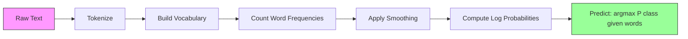

# Bayes ngây thơ

> naive 假设 là sai lầm, nhưng nó vẫn còn hiệu quả.

**Type:** Build
**Language:**Python
**先修要求：**Giai đoạn 2, Bài học 01-07 ((Thống kê, định lý Bayes)
**Time:** ~75 分钟

## Học mục tiêu
- Từ零实现带 Laplace smoothing 的 đa số đơn giản Bayes, được sử dụng để phân loại văn bản
- Giải thích tại sao giả định độc lập ngây thơ trong toán học là sai lầm, nhưng trong thực tế vẫn có thể tạo ra thứ tự đúng đắn
- So sánh đa nguyên, Bernouli và Gaussian Naive Bayes 变体,并为给定特征类型选择合适的版本
- Trong các dữ liệu rất hiếm sẽ đánh giá sự tương quan giữa Bayes và sự lùi hậu cần và giải thích sự thay đổi về sự thiên vị trong đó.

## 问题
Bạn cần phân loại văn bản. Bạn cần phân loại thư cho spam hoặc không spam. Bạn cần phân loại các bài viết cho các loại khác nhau. Bạn có hàng ngàn triệu đặc điểm (đồng tiếng), nhưng dữ liệu đào tạo là hạn chế.

Đại đa số phân loại ở đây sẽ ăn không tiêu thụ. Khản lý hậu quả cần đủ nhiều mẫu, để ước tính đáng tin cậy hàng ngàn triệu trọng lượng.

Bayes ngây thơ có thể xử lý tình huống này. Nó đã đưa ra một giả định sai lầm về toán học, mỗi đặc điểm đều độc lập với tất cả các đặc điểm khác), nhưng trong phân loại văn bản vẫn có thể vượt qua những mô hình thông minh hơn, đặc biệt là trong tập hợp đào tạo nhỏ hơn. Nó chỉ cần một lần trải qua dữ liệu để hoàn thành đào tạo. Nó có thể mở rộng đến hàng triệu đặc điểm. Nó sẽ tạo ra ước tính xác suất.

Hiểu tại sao giả định sai lầm có thể mang lại một dự đoán tốt, sẽ giúp bạn học được một thực tế cơ bản của việc học máy: mô hình tốt nhất không phải là mô hình chính xác nhất, mà là mô hình có sự giao dịch biến thái thiên vị tốt nhất đối với dữ liệu của bạn.

## 概念
### Thuyết Bayes (快速回顾)

Lý thuyết Bayes 会反转条件概率:

```
P(class | features) = P(features | class) * P(class) / P(features)
```

Chúng tôi muốn`P(class | features)`, đó là sau từ trong tài liệu nhất định, tài liệu này thuộc về một loại xác suất. Chúng ta có thể tính toán nó từ một vài điều sau:
- `P(features | class)`: khả năng nhìn thấy những từ này trong các tài liệu trong danh mục này
- `P(class)`:类别的前几率(总体上垃圾邮件 有多常见?)
- `P(features)`Bằng chứng, đối với tất cả các loại đều giống nhau, do đó so sánh các loại có thể bị bỏ qua

`P(class | features)`Cổ số nhất là thắng.

### Giả sử độc lập ngây thơ

精确计算 `P(features | class)`需要估估所有特征联合出现的共同概率──对于包含10,000个词的词汇, bạn cần ước tính2^10,000种可能组合上的分布──不可能──

Giả sử ngây thơ là: cho các loại, mỗi đặc điểm đều độc lập theo điều kiện.

```
P(w1, w2, ..., wn | class) = P(w1 | class) * P(w2 | class) * ... * P(wn | class)
```

Bạn không còn ước tính một phân bố chung không thể, mà ước tính n đơn giản phân bố từng đặc điểm.

Hiểu này rõ ràng là sai lầm. Trong bất kỳ tài liệu nào, "cỗ máy" và "làm học" không phải là độc lập. Nhưng phân loại không cần ước tính xác suất chính xác. Nó cần xếp hạng chính xác, đó là loại có xác suất cao nhất.

### Tại sao nó vẫn còn hiệu quả

Ba lý do:

1. **排序优先于校准。**Đánh phân chỉ cần xếp hạng cao nhất trong các loại chính xác. Ngay cả khi P(spam) = 0.99999, tỷ lệ xác suất thực là 0.7, người phân loại vẫn sẽ chọn spam chính xác. Chúng tôi không cần tỷ lệ xác suất chính xác. Chúng tôi cần loại chiến thắng chính xác.

2. **高 bias，低 variance。**Hiểu thuyết độc lập là một mô hình trước tiên. Nó có thể ngăn chặn sự quá phù hợp. Trong quá trình tập luyện, một mô hình nhỏ sai nhưng ổn định sẽ thắng một mô hình lý thuyết đúng nhưng không ổn định.

3. **特征冗余会相互抵消。**Các đặc điểm liên quan cung cấp bằng chứng dư thừa. Classifier sẽ tính lại các bằng chứng này, nhưng nó cũng sẽ tính lại các loại chính xác. Nếu "động cơ" và "làm học" luôn xuất hiện, chúng đều cung cấp bằng chứng cho loại "kỹ thuật". NB sẽ tính chúng hai lần, nhưng nó là tính toán hai lần cho loại chính xác.

第四个实践原因:Naive Bayes 极快――训练只是单次遍历数据并统计频率――预测是一次矩阵乘法――你可以在几秒内完成训练――这种速度意味着你可以更快代、尝试更多特征集,并运行比慢速模型更多实验――

### Các môn toán từng bước

让我们跟踪一个具体例―― giả sử chúng ta có hai loại: spam 和 không spam―― từ vựng của chúng ta có ba từ:"free""",money""",meetings"――

训练数据:
- Spam 邮件 đề cập đến "tự do" 80 lần"",tiền" 60 lần"",quá trình" 10 lần( tổng số 150 个词)
- Không spam 邮件 đề cập đến "tự do" 5 次、"tiền" 10 次、"làm cuộc họp" 100 次( tổng số 115 个词)
- 40% của thư là spam, 60% là không spam

使用 Laplace làm trơn ((alpha=1):

```
P(free | spam)    = (80 + 1) / (150 + 3) = 81/153 = 0.529
P(money | spam)   = (60 + 1) / (150 + 3) = 61/153 = 0.399
P(meeting | spam) = (10 + 1) / (150 + 3) = 11/153 = 0.072

P(free | not-spam)    = (5 + 1) / (115 + 3) = 6/118 = 0.051
P(money | not-spam)   = (10 + 1) / (115 + 3) = 11/118 = 0.093
P(meeting | not-spam) = (100 + 1) / (115 + 3) = 101/118 = 0.856
```

新邮件包含:" miễn phí"(2 次) 、"tiền"(1 次) 、"làm họp"(0 次) ✿

```
log P(spam | email) = log(0.4) + 2*log(0.529) + 1*log(0.399) + 0*log(0.072)
                    = -0.916 + 2*(-0.637) + (-0.919) + 0
                    = -3.109

log P(not-spam | email) = log(0.6) + 2*log(0.051) + 1*log(0.093) + 0*log(0.856)
                        = -0.511 + 2*(-2.976) + (-2.375) + 0
                        = -8.838
```

Spam 以很大优势胜出──" miễn phí" xuất hiện hai lần là hỗ trợ spam của bằng chứng mạnh mẽ── chú ý, "quá trình" khi chưa xuất hiện, đóng góp của hai log sum là零(0 * log(P)) Trong số các NB đa nguyên, thiếu sót từ không ảnh hưởng── rõ ràng xây dựng từ thiếu sót là Bernoulli NB──

### Ba biến thể

Bayes ngây thơ có ba hình thức. Mỗi hình thức đều được xây dựng theo cách khác nhau.`P(feature | class)`

#### Bayes đa số ngây thơ

Để tạo mỗi đặc điểm thành một số.

```
P(word_i | class) = (count of word_i in class + alpha) / (total words in class + alpha * vocab_size)
```

`alpha`là Laplace smoothing () 

#### Gaussian Naive Bayes

Để tạo mô hình cho phân phối đúng tình trạng.

```
P(x_i | class) = (1 / sqrt(2 * pi * var)) * exp(-(x_i - mean)^2 / (2 * var))
```

Mỗi loại sẽ có giá trị trung bình và khác biệt riêng cho mỗi đặc điểm. Khi các đặc điểm trong mỗi loại thực sự tuân theo đường cong hình, phương pháp này hiệu quả rất tốt.

#### Bernoulli ngây thơ Bayes

将每个特征建模为二值变量 (出现或未出现) ⋅适合短文本或二值特征向量⋅

```
P(word_i | class) = (docs in class containing word_i + alpha) / (total docs in class + 2 * alpha)
```

Không giống như Multinomial, Bernouli sẽ rõ ràng trừng phạt sự thiếu hụt của một từ. Nếu "tự do" thường xuất hiện trong spam, nhưng trong thư này không có, Bernouli sẽ coi nó là bằng chứng chống lại spam.

### Khi nào nên sử dụng mỗi biến thể

| Variant | Feature Type | Best For | Example |
|---------|-------------|----------|---------|
| Multinomial | 计数或频率 | 文本 classification、bag-of-words | Email spam、topic classification |
| Gaussian | 连续值 | 具有近似正态特征的表格数据 | Iris classification、传感器数据 |
| Bernoulli | 二值（0/1） | 短文本、二值特征 Vector | SMS spam、presence/absence features |

### Laplace Smoothing

Nếu một từ xuất hiện trong dữ liệu thử nghiệm, nhưng nó chưa bao giờ xuất hiện trong một loại dữ liệu đào tạo cụ thể, sẽ xảy ra gì?

Không có sự trơn tru:`P(word | class) = 0/N = 0`Một số lượng không, sau đó sẽ làm cho`P(class | features) = 0`Dù có bằng chứng nào khác thì có nhiều bằng chứng khác. Một lời chưa thấy sẽ phá hủy toàn bộ dự đoán, dù có nhiều bằng chứng khác để hỗ trợ nó.

Lượt độ của chỗ sẽ cho mỗi tính năng tính thêm một tính nhỏ`alpha`(thường là 1):

```
P(word_i | class) = (count(word_i, class) + alpha) / (total_words_in_class + alpha * vocab_size)
```

Khi alpha=1 时, mỗi từ ít nhất có một tỷ lệ rất nhỏ. Trong test mail xuất hiện "discombobulate" 不再会让垃圾邮件 概率归零.

Alpha cao hơn có nghĩa là làm trơn hơn mạnh hơn (distribution more average) ⋅ alpha thấp hơn có nghĩa là mô hình hơn tin tưởng dữ liệu⋅ Alpha là cần điều chỉnh các siêu tham số⋅

ảnh hưởng của alpha:

| Alpha | Effect | When to use |
|-------|--------|-------------|
| 0.001 | 几乎没有 smoothing，信任数据 | 非常大的训练集，预计不会有未见特征 |
| 0.1 | 轻度 smoothing | 大型训练集 |
| 1.0 | 标准 Laplace smoothing | 默认起点 |
| 10.0 | 重度 smoothing，会压平分布 | 非常小的训练集，预计有许多未见特征 |

### Lượng tính toán log-space

Cần số tỷ lệ xác suất gấp trăm lần (tất cả số nhỏ hơn 1) sẽ dẫn đến dòng chảy thấp của điểm nổi.

Giải pháp: Trong không gian log, không phải là tỷ lệ tỷ lệ, mà là tỷ lệ tỷ lệ của chúng:

```
log P(class | x1, x2, ..., xn) = log P(class) + sum_i log P(xi | class)
```

Điều này sẽ biến dự đoán thành sản phẩm điểm:

```
log_scores = X @ log_feature_probs.T + log_class_priors
prediction = argmax(log_scores)
```

Sự nhân số tử liệu. Đó là lý do của Bayes  dự đoán quá nhanh. Nó giống với mô hình đường thẳng đơn tầng.

### Bayes ngây thơ vs Lịch lý

Cả hai đều được sử dụng để phân loại tính chất văn bản.

| Aspect | Naive Bayes | Logistic Regression |
|--------|------------|-------------------|
| Type | Generative（建模 P(X\|Y)） | Discriminative（建模 P(Y\|X)） |
| Training | 统计频率 | 优化 Loss Function |
| Small data | 更好（强 prior 有帮助） | 更差（不足以估计权重） |
| Large data | 更差（错误假设会拖累） | 更好（更灵活的边界） |
| Features | 假设独立 | 能处理相关性 |
| Speed | 单次遍历，非常快 | 迭代优化 |
| Calibration | 概率较差 | 概率更好 |

经验法则: Từ Bayes 开始―― nếu bạn có đủ dữ liệu, và NB 进入平台期,就切换到物流回归――

### Đường ống phân loại



Trong thực tế, chúng tôi làm việc trong không gian log, để tránh dòng chảy dưới các điểm nổi. Chúng tôi không còn tăng nhiều tỷ lệ, mà tăng số lượng của chúng:

```
log P(class | features) = log P(class) + sum_i log P(feature_i | class)
```


```figure
naive-bayes
```

##  xây dựng nó
`code/naive_bayes.py`Trung 代码 từ zero thực hiện MultinomialNB 和 GaussianNB。

### MultinomialNB

Từ zero thực hiện:

1. **fit(X, y)**: đối với mỗi loại, thống kê mỗi đặc điểm của tần suất.

2. **predict_log_proba(X)**: đối với mỗi mẫu, tính toán tất cả các loại log P( lớp) + tổng của log P(chương vị_i ➡ lớp) ➡ Đây là một lần nhân số Matrix:X @ log_probs.T + log_priors‬

3. **predict(X)**: quay lại log xác suất tối đa của các loại.

```python
class MultinomialNB:
    def __init__(self, alpha=1.0):
        self.alpha = alpha

    def fit(self, X, y):
        classes = np.unique(y)
        n_classes = len(classes)
        n_features = X.shape[1]

        self.classes_ = classes
        self.class_log_prior_ = np.zeros(n_classes)
        self.feature_log_prob_ = np.zeros((n_classes, n_features))

        for i, c in enumerate(classes):
            X_c = X[y == c]
            self.class_log_prior_[i] = np.log(X_c.shape[0] / X.shape[0])
            counts = X_c.sum(axis=0) + self.alpha
            self.feature_log_prob_[i] = np.log(counts / counts.sum())

        return self
```

关键洞察:拟合后,预测 chỉ là nhân số Matrix cộng với thiên vị. Đó là lý do của Bayes ngây thơ.

### GaussianNB

Đối với các đặc điểm liên tục, chúng tôi ước tính giá trị trung bình và chênh lệch cho mỗi loại đặc điểm:

```python
class GaussianNB:
    def __init__(self):
        pass

    def fit(self, X, y):
        classes = np.unique(y)
        self.classes_ = classes
        self.means_ = np.zeros((len(classes), X.shape[1]))
        self.vars_ = np.zeros((len(classes), X.shape[1]))
        self.priors_ = np.zeros(len(classes))

        for i, c in enumerate(classes):
            X_c = X[y == c]
            self.means_[i] = X_c.mean(axis=0)
            self.vars_[i] = X_c.var(axis=0) + 1e-9
            self.priors_[i] = X_c.shape[0] / X.shape[0]

        return self
```

预测会对每个特征使用高西亚PDF,并跨特征相乘(在日志空间中相加)

### Demo: Định dạng văn bản

代码会生成合成包-of-words 数据,模拟两个类别(Technology articles和 sports articles) ⋅ mỗi类别 có phân bố từ ngữ khác nhau.

Cách làm việc của dữ liệu tổng hợp là như sau: 我们创建 200 个词(特征列) ―― Từ 0-39 trong các bài viết công nghệ 频率高、在体育 中频率低── Từ 80-119 trong thể thao 频率高、在技术 中频率低── Từ 40-79 trong hai trong số đó đều có tần suất trung bình── Điều này sẽ tạo ra một tình huống thực tế: một số từ là một loại chỉ dẫn mạnh, một số khác là tiếng ồn──

### Demo: Các tính năng liên tục

代码会生成类似于Iris的数据(3 个类别、4 个特征、Gaussian clusters) ――GaussianNB sử dụng từng类别的平均值和方差进行分类──每个类别都有不同的中心(中向量) 和不同的离散程度(变化),模拟现实数据中的各类别的测量值系统性不同的情况──

代码还演示了:
- **Smoothing comparison：**Sử dụng khác nhau Alpha 值训练 MultinomialNB, cho thấy tác động của độ lỏng 强度 đối với tỷ lệ xác thực.
- **Training size experiment：**Khi dữ liệu đào tạo tăng từ 20 mẫu lên 1600 mẫu, tỷ lệ độ chính xác của NB sẽ tăng lên như thế nào.
- **Confusion matrix：**Mỗi loại chính xác ôi ghi điểm F1, dùng để hiển thị NB 在哪里犯错.

### Tốc độ dự đoán

Bayes ngây thơ 预测 là một lần nhân số Matrix.
- MultinomialNB:一次 Matrix nhân (n x d) @ (d x k) = O(n * d * k)
- GaussianNB:n * k 次 Gaussian PDF 求值,每次覆盖 d 个特征 = O(n * d * k)

两者在每个维度都是线性的――将其与 KNN (需要计算到所有训练点的距离) 或带RBF kernel的 SVM (需要对所有支持向量进行内核评估) 相比,NB 在预测时快几数级――

## Sử dụng nó
Sử dụng cửa hàng, hai biến thể này đều là một cách sử dụng:

```python
from sklearn.naive_bayes import GaussianNB, MultinomialNB

gnb = GaussianNB()
gnb.fit(X_train, y_train)
print(f"GaussianNB accuracy: {gnb.score(X_test, y_test):.3f}")

mnb = MultinomialNB(alpha=1.0)
mnb.fit(X_train_counts, y_train)
print(f"MultinomialNB accuracy: {mnb.score(X_test_counts, y_test):.3f}")
```

Sử dụng để học làm văn bản phân loại:

```python
from sklearn.feature_extraction.text import CountVectorizer
from sklearn.naive_bayes import MultinomialNB
from sklearn.pipeline import Pipeline

text_clf = Pipeline([
    ("vectorizer", CountVectorizer()),
    ("classifier", MultinomialNB(alpha=1.0)),
])

text_clf.fit(train_texts, train_labels)
accuracy = text_clf.score(test_texts, test_labels)
```

`naive_bayes.py`Các mã hóa trung gian sẽ được so sánh từ không thực hiện với các máy tính trên cùng dữ liệu để xác minh tính chính xác.

### TF-IDF với Naive Bayes

Số lượng từ nguyên thủy sẽ khiến mỗi từ xuất hiện có cùng trọng lượng. Nhưng như "the" và "is" như vậy thường thấy từ ngữ thường xuyên xuất hiện trong mỗi loại.

```python
from sklearn.feature_extraction.text import TfidfVectorizer
from sklearn.naive_bayes import MultinomialNB
from sklearn.pipeline import Pipeline

text_clf = Pipeline([
    ("tfidf", TfidfVectorizer()),
    ("classifier", MultinomialNB(alpha=0.1)),
])
```

TF-IDF giá trị là không thể phủ nhận, do đó có thể được sử dụng cùng với MultinomialNB một lần.

### Sử dụng trong văn bản ngắn của BernoulliNB

Đối với các bài viết ngắn (tweet, SMS, chat), BernouliNB có thể tốt hơn MultinomialNB.

```python
from sklearn.naive_bayes import BernoulliNB
from sklearn.feature_extraction.text import CountVectorizer

text_clf = Pipeline([
    ("vectorizer", CountVectorizer(binary=True)),
    ("classifier", BernoulliNB(alpha=1.0)),
])
```

CountVectorizer 中的 `binary=True`标志会将所有计数转换为0/1──没有它,BernoulliNB 仍能运行,但它看到的是并非为其设计的计数──

### Định so sánh NB Khả năng

NB 概率校准很差. NB nói P(spam) = 0.95 时, thực sự xác suất có thể là 0.7 ⋅ Nếu bạn cần ước tính xác suất đáng tin cậy (ví dụ, để thiết lập giá trị hoặc kết hợp với các mô hình khác), hãy sử dụng Klassifier Calibrated của sklearn:

```python
from sklearn.calibration import CalibratedClassifierCV

calibrated_nb = CalibratedClassifierCV(MultinomialNB(), cv=5, method="sigmoid")
calibrated_nb.fit(X_train, y_train)
proba = calibrated_nb.predict_proba(X_test)
```

Điều này sẽ thông qua xác thực chéo, phù hợp với một sự lùi hậu cần trên số lượng nguyên thủy của NB.

### Gotcha thông thường

1. **负特征值。**Multi-nominalNB  yêu cầu tính năng không tiêu cực. Nếu bạn có giá trị tiêu cực (ví dụ như TF-IDF, hoặc các tính năng sau khi tiêu chuẩn hóa) hãy sử dụng GaussianNB, hoặc chuyển tính năng sang giá trị chính xác.

2. **零方差特征。**GaussianNB sẽ phân biệt so với so với khác biệt. Nếu một loại có một đặc điểm khác biệt là 0, tất cả các giá trị đều giống nhau, tỷ lệ tính toán sẽ xuất hiện.

3. **类别不平衡。**Nếu 99% của thư là không spam, trước P(không spam) = 0,99 会非常强, cho đến khi áp đặt bằng chứng xác suất. Bạn có thể đặt trước lớp, hoặc sử dụng sklearn 中的 class_prior 参数.

4. **特征缩放。**MultinomialNB không cần quy mô (để xử lý) GaussianNB cũng không cần quy mô (để ước tính từng đặc điểm)

## 交付 nó
本课会产出:
- `outputs/skill-naive-bayes-chooser.md`: một kỹ năng quyết định để chọn đúng NB 变体
- `code/naive_bayes.py`Từ zero thực hiện đa số NB và GaussianNB, không bao gồm các phân khúc đối với

### Khi Bayes ngây thơ thất bại

Khi giả định độc lập dẫn đến sự xếp hạng sai lầm (không chỉ là tỷ lệ tỷ lệ sai lầm) thì NB sẽ thất bại.

1. **强特征交互。**Nếu các loại phụ thuộc vào sự kết hợp của hai đặc điểm, chứ không phụ thuộc vào bất kỳ đặc điểm riêng lẻ nào giống như mô hình XOR), NB sẽ hoàn toàn sai lầm.

2. **高度相关且 evidence 相反的特征。**Nếu đặc điểm A hướng tới "spam", đặc điểm B hướng tới "không spam", nhưng A 和 B 完全相关 (trực tế chúng luôn đồng ý), NB sẽ thấy bằng chứng xung đột thực sự không tồn tại.

3. **非常大的训练集。**Khi dữ liệu đủ, các mô hình phân biệt đối xử như sự lùi hậu cần sẽ học đến ranh giới quyết định thực tế, và vượt qua NB.

Trong thực tế, đối với phân loại văn bản, những chế độ thất bại này không phổ biến. Số lượng các đặc điểm văn bản rất nhiều, các đặc điểm đơn lẻ yếu hơn, và sai lầm về giả định độc lập thường sẽ chống lại nhau. Đối với dữ liệu biểu đồ chỉ có một lượng nhỏ các đặc điểm liên quan, hãy ưu tiên về sự lùi hậu cần hoặc các mô hình dựa trên cây.

## 练习
1. **Smoothing experiment。**Trong dữ liệu văn bản sử dụng alpha  giá trị 0.01、0.1、1.0、10.0 和 100.0  luyện tập MultinomialNB── vẽ chính xác so với alpha── hiệu suất ở đâu đạt được đỉnh điểm?

2. **Feature independence test。**取一个真文本数据集. 选择两个明显相关词语 (("机器"和"学习") 计算 P(word1 类) * P(word2 类),并与 P(word1 AND word2 类) 比较――假设独立 错得多严重?

3. **Bernoulli implementation。**扩展代码, thêm một lớp BernoulliNB──将包-of-words 转换为二值(present/absent), và trên văn bản dữ liệu so sánh chính xác với MultinomialNB──什么时候 Bernoulli 会赢?

4. **NB vs Logistic Regression。**Trong văn bản dữ liệu đào tạo hai người. Từ 100 mẫu đào tạo bắt đầu, dần dần tăng lên 10.000.

5. **Spam filter。**构建一个完整的垃圾邮件分类器:tokenize 原始邮件文本、构建词汇、创建字包功能、训练 MultinomialNB,并使用精度和回忆 评估(不只是精度为什么?)

## 关键术语
| Term | What people say | What it actually means |
|------|----------------|----------------------|
| Naive Bayes | “简单的概率 classifier” | 一个使用 Bayes' theorem，并假设给定类别后特征 conditionally independent 的 classifier |
| Conditional independence | “特征彼此不影响” | P(A, B \| C) = P(A \| C) * P(B \| C)——一旦知道 C，知道 B 不会告诉你关于 A 的任何新信息 |
| Laplace smoothing | “Add-one smoothing” | 给每个特征添加一个小计数，防止零概率主导预测 |
| Prior | “看到数据之前你相信什么” | P(class)——观察任何特征之前，每个类别的概率 |
| Likelihood | “数据拟合得有多好” | P(features \| class)——如果类别已知，观察到这些特征的概率 |
| Posterior | “看到数据之后你相信什么” | P(class \| features)——观察到特征后，类别的更新概率 |
| Generative model | “建模数据如何生成” | 学习 P(X \| Y) 和 P(Y)，然后使用 Bayes' theorem 得到 P(Y \| X) 的模型 |
| Discriminative model | “建模 decision boundary” | 不建模 X 如何生成，而是直接学习 P(Y \| X) 的模型 |
| Log probability | “避免 underflow” | 使用 log P 而不是 P，防止许多小数相乘后在浮点数中变成零 |

## 延伸阅读
- [scikit-learn Naive Bayes docs](https://scikit-learn.org/stable/modules/naive_bayes.html) 三种变体及其数学细节
- [McCallum and Nigam, A Comparison of Event Models for Naive Bayes Text Classification (1998)](https://www.cs.cmu.edu/~knigam/papers/multinomial-aaaiws98.pdf) 文本中 đa ngữ so với Bernoulli's cổ điển so sánh
- [Rennie et al., Tackling the Poor Assumptions of Naive Bayes Text Classifiers (2003)](https://people.csail.mit.edu/jrennie/papers/icml03-nb.pdf) 针对文本 NB 的改进
- [Ng and Jordan, On Discriminative vs. Generative Classifiers (2001)](https://ai.stanford.edu/~ang/papers/nips01-discriminativegenerative.pdf)  chứng minh NB trong dữ liệu ít hơn thời gian hơn LR 收快
