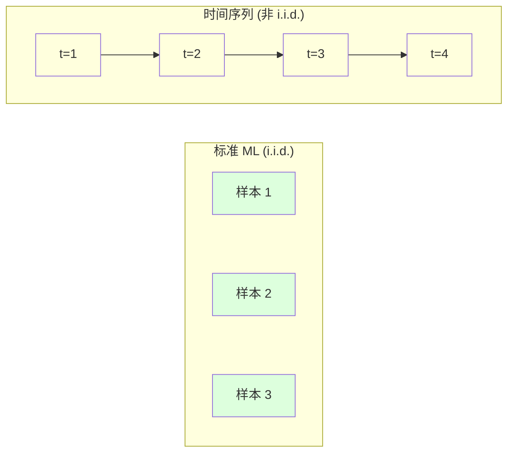
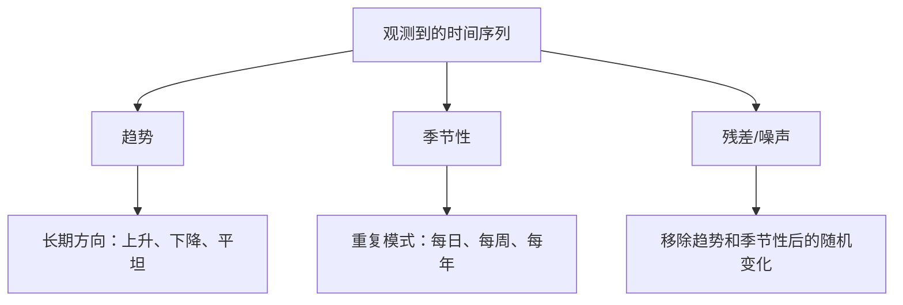
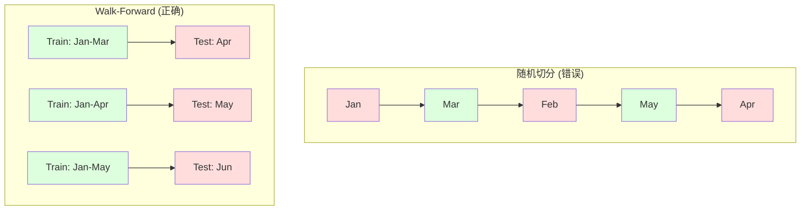

# 时间序列基础

>  Tự hiện thực trong quá khứ có thể dự đoán kết quả trong tương lai -  前提是你先检查平稳性──

**Type:** Build
**Language:**Python
**Prerequisites:** Phase 2, Lessons 01-09
**Time:** ~90 分钟

## Học mục tiêu

- Phân tích chuỗi thời gian thành các bộ phận xu hướng, mùa và chênh lệch, và kiểm tra sự ổn định.
- Thực hiện các đặc điểm trễ và thống kê xoay, chuyển đổi chuỗi thời gian thành vấn đề giám sát học tập
-  xây dựng hành trình xác thực tiến bộ  framework, ngăn chặn các vụ rò rỉ dữ liệu trong tương lai trong đào tạo
- Giải thích tại sao phân chia tàu/bản thử nghiệm bất hiệu quả đối với chuỗi thời gian, và cho thấy sự khác biệt hiệu suất giữa nó và phân chia thời gian thực

## 问题

Bạn có dữ liệu theo thời gian. Số lượng bán hàng hàng ngày, nhiệt độ hàng giờ, CPU mỗi phút, giá cổ phiếu hàng tuần. Bạn muốn dự đoán giá trị tiếp theo, tuần sau, quý tiếp theo.

Bạn拿出标准 ML 工具箱:随机火车/测试分断"",cross-validation"",输入特征矩阵"",输出预测"", mỗi bước đều là错的。

时间序列会打破标准 ML 基于的假设――样本不独立--温度 ngày nay phụ thuộc vào nhiệt độ ngày hôm qua――随机切分将未来信息泄漏到过去――看起来很好在后测试中,到了生产环境会失败,因为它们依赖于随时间漂移的模式――

Một mô hình sử dụng xác thực chéo tự nhiên  đạt được độ chính xác 95%, với đánh giá dựa trên thời gian chính xác chỉ có thể là 55% .

Bài viết này bao gồm các nội dung cơ bản: dữ liệu thời gian có gì khác nhau, cách đánh giá thực sự mô hình, và cách chuyển đổi chuỗi thời gian thành các đặc điểm có thể sử dụng mô hình ML tiêu chuẩn.

## 概念

### 时间序列有什么不同

标准 ML 假设 i.i.d. -- 独立同分布── mỗi mẫu được rút ra từ cùng một phân bố, và độc lập với các mẫu khác── chuỗi thời gian đồng thời vi phạm hai điểm này:

- **不独立。**Giá cổ phiếu ngày hôm nay phụ thuộc vào giá ngày hôm qua.
- **不同分布。**Cổ phiếu bán hàng trong tháng 12 có vẻ khác với tháng 3.

Những vi phạm này không dễ dàng. Chúng sẽ thay đổi cách bạn xây dựng các tính năng, cách đánh giá mô hình, cũng như những thuật toán có thể sử dụng.



Trong chuẩn ML, mô hình có thể được trao đổi. Nó sẽ không thay đổi bất cứ điều gì. Trong chuỗi thời gian, thứ tự là tất cả.

### 时间序列的组成部分

Mỗi chuỗi thời gian là một bộ phận của nội dung sau:



- **趋势**:长期方向── thu nhập tăng 10% mỗi năm── nhiệt độ toàn cầu tăng──
- **季节性**: định kỳ giữa khoảng thời gian trên mô hình lặp lại.
- **残差**: Trải đi xu hướng và phần còn lại sau mùa. Nếu phần còn lại trông giống như tiếng ồn trắng, hãy phân tích bắt tín hiệu.

### Bình ổn

Nếu tính toán của một chuỗi thời gian không thay đổi theo thời gian, nó là ổn định.

**为什么重要：**Trong mô hình được đào tạo trên dữ liệu tháng 1, giá trị trung bình được học sẽ khác với giá trị trung bình được trình bày trong tháng 2.

**如何检查：**Trong cửa sổ tính toán trung bình xoay và lệch chuẩn xoay. Nếu chúng di chuyển, chuỗi là không bình thường.

**如何修复：**差分── không xây dựng giá trị nguyên bản, mà xây dựng sự thay đổi giữa giá trị liên tục:

```
diff[t] = value[t] - value[t-1]
```

Nếu một lần khác biệt không thể làm cho chuỗi ổn định, hãy áp dụng một lần nữa.

**示例：**

序列 原始:[100, 102, 106, 112, 120]
Một giai đoạn khác nhau: [2, 4, 6, 8]( vẫn đang trên xu hướng)
二阶差分: [2, 2, 2](常数 -- 平稳)

Các chuỗi ban đầu có xu hướng hai. Một giai đoạn phân biệt biến nó thành xu hướng tuyến tính.

**形式化检验：**Thử nghiệm tăng Dickey-Fuller (ADF) là kiểm tra thống kê tiêu chuẩn ổn định. giả định gốc là  chuỗi không ổn định. . Giá trị p thấp hơn 0.05 cho thấy bạn có thể từ chối giả định gốc và đạt được kết luận ổn định.

### 自 liên quan

Từ liên quan đo lường thời gian t của giá trị với thời gian t-k(t 步) của giá trị trong quá khứ.

**ACF 告诉你：**
- 序列能记住多远──如果 ACF ở lag 5 后降至零,则 5 步前的值无关紧要──
- Có hay không có mùa. Nếu ACF trong trễ 12 tháng có một đỉnh cao, thì có mùa hàng năm.
- Để tạo ra nhiều đặc điểm chậm lại. Sử dụng cho đến khi ACF trở nên dễ bỏ qua cho đến khi chậm lại.

**PACF (Partial Autocorrelation Function)**Nếu ngày hôm nay liên quan đến 3 天前, chỉ vì hai đều liên quan đến ngày hôm qua, thì lag 3 của PACF sẽ là không, và lag 3 của ACF sẽ không là không.

### 滞后特征:把时间序列转换为监督学习

标准 ML 模型 cần tính năng matrix X và mục tiêu y. Time sequence chỉ cho bạn một hàng giá trị.

取序列 [10, 12, 14, 13, 15], tạo lag-1 和 lag-2 đặc điểm:

| lag_2 | lag_1 | target |
|-------|-------|--------|
| 10    | 12    | 14     |
| 12    | 14    | 13     |
| 14    | 13    | 15     |

Bây giờ bạn có một tiêu chuẩn Regression 问题── bất kỳ mô hình ML nào (trang về regression, rừng ngẫu nhiên, tăng gradient) có thể được sử dụng từ những mục tiêu dự đoán  dự đoán 

Các đặc điểm khác của công nghệ:
- **Rolling statistics:**gần đây k 个值的平均 ̊std、min、max
- **Calendar features:**Ngày lễ, cuối tuần.
- **Differenced values:**相比上一步的变化
- **Expanding statistics:**累累计平均 累累计 sum
- **Ratio features:**当前值 / rolling mean (đối đa giá trị xoay xoay gần)
- **Interaction features:**lag_1 * ngày_of_week(工作日对动量的影响)

**多少个 lag？**Sử dụng hàm tương quan tự động. Nếu ACF đến độ trễ 10 là đáng kể, hãy sử dụng ít nhất 10 độ trễ. Nếu có độ trễ 7 (có thể bao gồm 14) thì độ trễ nhiều hơn sẽ cung cấp cho mô hình thông tin lịch sử nhiều hơn, nhưng cũng sẽ tăng số lượng các tính năng phù hợp, do đó tăng nguy cơ quá phù hợp.

**target 对齐陷阱。**Khi tạo ra các đặc điểm trễ, mục tiêu phải là giá trị của thời gian t, và tất cả các đặc điểm đều phải sử dụng giá trị thời gian t-1 hoặc sớm hơn. Nếu bạn không muốn xem giá trị thời gian t như một đặc điểm bao gồm, bạn đã có một máy dự đoán hoàn hảo - và một mô hình hoàn toàn vô dụng. Đây là lỗi phổ biến nhất trong công trình trình tự thời gian.

### Đăng bằng tiến

Đây là khái niệm quan trọng nhất của bài học này. tiêu chuẩn xác nhận chéo k-fold sẽ được phân phối theo cách tự nhiên cho tàu và thử nghiệm.



Định đắc tiến:
1. Trong thời gian đến ngày t' dữ liệu trên đào tạo
2. 预测时间 t+1(或用于多步预测的 t+1 到 t+k)
3. 将 cửa sổ hướng trước
4. 重复

Mỗi lần thử chỉ chứa dữ liệu sau khi tập luyện. Không có tiết lộ trong tương lai. Điều này sẽ cho bạn một ước tính trung thực, chỉ ra mô hình sẽ hoạt động như thế nào sau khi triển khai.

**Expanding window**Sử dụng tất cả dữ liệu lịch sử để thực hiện đào tạo**Sliding window**Sử dụng cửa sổ tập luyện cố định lớn (Fixed Large Training Window)  Khi bạn tin rằng dữ liệu cũ vẫn còn liên quan, sử dụng mở rộng  Khi thế giới đang thay đổi và dữ liệu cũ có hại, sử dụng trượt 

### ARIMA 直觉

ARIMA là mô hình chuỗi thời gian cổ điển. Nó có ba thành phần:

- **AR (Autoregressive):**Từ giá trị quá khứ để thực hiện dự đoán.
- **I (Integrated):**通过差分实现平稳性──I(d) 应用 d 次差分──
- **MA (Moving Average):**Từ quá khứ dự đoán sai lầm để thực hiện dự đoán.

ARIMA(p, d, q) 组合了三者──你基于ACF/PACF 分析或自动搜索(auto-ARIMA) chọn p、d、q──

Chúng ta sẽ không thực hiện ARIMA từ không - nó cần tối ưu hóa số, vượt ra ngoài phạm vi của bài học này.

### 何時使用什么

| Approach | Best For | Handles Seasonality | Handles External Features |
|----------|---------|-------------------|------------------------|
| 滞后特征 + ML | 有很多外部特征的表格数据 | 通过 calendar features | 是 |
| ARIMA | 单个单变量序列、短期 | SARIMA 变体 | 否（ARIMAX 支持有限） |
| Exponential smoothing | 简单趋势 + 季节性 | 是（Holt-Winters） | 否 |
| Prophet | 业务预测、节假日 | 是（Fourier terms） | 有限 |
| Neural networks (LSTM, Transformer) | 长序列、多序列 | 学习得到 | 是 |

Đối với hầu hết các vấn đề thực tế, tăng độ trễ + tăng độ là điểm khởi điểm mạnh nhất. Nó tự nhiên hỗ trợ các đặc điểm bên ngoài, không yêu cầu tính ổn định, và dễ dàng gỡ lỗi.

### 预测 Khí vọng và chiến lược

单步预测会预测未来一个时间步――多步预测会预测多个时间步―― có ba chiến lược:

**Recursive (iterated):**预测 Next step, hãy xem kết quả dự đoán như là bước tiếp theo của các bước nhập. 简单, nhưng sai lầm sẽ tích lũy - mỗi dự đoán đều sử dụng một dự đoán trên, do đó sai lầm sẽ phức tạp.

**Direct:**Đối với mỗi đường chân trời  đào tạo mô hình riêng biệt. Mô hình 1  dự đoán t+1, Mô hình 5  dự đoán t+5── không có sự tích lũy sai lầm, nhưng mô hình đào tạo của mỗi mô hình ít hơn, và chúng không chia sẻ thông tin.

**Multi-output:**训练一个同时输出所有视界的模型――跨视界共享信息,但需要支持多输出模型(或自定义 Loss Function)。

Đối với hầu hết các vấn đề thực tế, đường chân trời ngắn (short horizon) từ đường chân trời lặp lại (recursive) 开始,较长的视界用直线――

### 时间序列中的常见错误

| Mistake | Why it happens | How to fix |
|---------|---------------|-----------|
| 随机 train/test split | 来自标准 ML 的习惯 | 使用 walk-forward 或 temporal split |
| 使用未来特征 | 误把时间 t 的特征包含进去 | 审计每个特征的时间对齐 |
| 对季节性 overfitting | 模型记住了日历模式 | 在 test set 中留出一个完整季节周期 |
| 忽略尺度变化 | 收入翻倍但模式保持 | 建模百分比变化而非绝对值 |
| 过多滞后特征 | “更多历史更好” | 使用 ACF 确定相关 lag |
| 不做差分 | “模型会自己搞定” | 树模型能处理趋势；线性模型需要平稳性 |


```figure
f3-series-decompose
```

##  xây dựng nó

`code/time_series.py`Mã trung tâm từ không thực hiện các khối xây dựng cốt lõi.

### 滞后特征创建器

```python
def make_lag_features(series, n_lags):
    n = len(series)
    X = np.full((n, n_lags), np.nan)
    for lag in range(1, n_lags + 1):
        X[lag:, lag - 1] = series[:-lag]
    valid = ~np.isnan(X).any(axis=1)
    return X[valid], series[valid]
```

Nó sẽ chuyển 1D chuỗi thành các tính năng matrix, mỗi dòng trong đó là gần đây.`n_lags`个值作为特征,并以当前值作为目标──

### Chứng minh chéo đi trước

```python
def walk_forward_split(n_samples, n_splits=5, min_train=50):
    assert min_train < n_samples, "min_train must be less than n_samples"
    step = max(1, (n_samples - min_train) // n_splits)
    for i in range(n_splits):
        train_end = min_train + i * step
        test_end = min(train_end + step, n_samples)
        if train_end >= n_samples:
            break
        yield slice(0, train_end), slice(train_end, test_end)
```

Mỗi lần phân đoạn đều đảm bảo dữ liệu đào tạo nghiêm ngặt trước dữ liệu thử nghiệm.

### 简单 Autoregressive 模型

纯AR 模型就是滞后特征上的线性回归:

```python
class SimpleAR:
    def __init__(self, n_lags=5):
        self.n_lags = n_lags
        self.weights = None
        self.bias = None

    def fit(self, series):
        X, y = make_lag_features(series, self.n_lags)
        # Solve via normal equations
        X_b = np.column_stack([np.ones(len(X)), X])
        theta = np.linalg.lstsq(X_b, y, rcond=None)[0]
        self.bias = theta[0]
        self.weights = theta[1:]
        return self
```

Trong khái niệm này, sự lùi ngược tuyến tính trong Bài học 02 hoàn toàn giống nhau, chỉ áp dụng trên phiên bản thời gian chậm lại của cùng một biến số.

### Phân tích ổn định

代码计算 滚动统计, dùng để đánh giá khả thi và số lượng ổn định:

```python
def check_stationarity(series, window=50):
    rolling_mean = np.array([
        series[max(0, i - window):i].mean()
        for i in range(1, len(series) + 1)
    ])
    rolling_std = np.array([
        series[max(0, i - window):i].std()
        for i in range(1, len(series) + 1)
    ])
    return rolling_mean, rolling_std
```

Nếu trung bình tròn tròn tròn tròn tròn tròn tròn tròn tròn tròn tròn tròn tròn tròn tròn tròn tròn tròn tròn tròn tròn tròn tròn tròn tròn tròn tròn tròn tròn tròn tròn tròn tròn tròn tròn tròn tròn tròn tròn tròn tròn tròn tròn tròn tròn tròn tròn tròn tròn tròn tròn tròn tròn tròn tròn tròn tròn tròn tròn tròn tròn tròn tròn tròn tròn tròn tròn tròn tròn tròn tròn tròn tròn tròn tròn tròn tròn tròn tròn tròn tròn tròn tròn tròn tròn tròn tròn tròn tròn tròn tròn tròn tròn tròn tròn tròn tròn tròn tròn tròn tròn tròn tròn tròn tròn tròn tròn tròn tròn tròn tròn tròn tròn tròn tròn tròn tròn tròn tròn tròn tròn tròn tròn tròn tròn tròn tròn tròn tròn tròn tròn tròn tròn tròn tròn tròn tròn tròn tròn tròn tròn tròn tròn tròn tròn tròn tròn tròn tròn tròn tròn tròn tròn tròn tròn tròn tròn tròn tròn tròn tròn tròn tròn tròn tròn tròn tròn tròn tròn tròn tròn tròn tròn tròn tròn tròn tròn tròn tròn tròn tròn tròn tròn tròn tròn tròn tròn tròn tròn tròn tròn tròn tròn tròn tròn tròn tròn tròn tròn tròn tròn tròn tròn tròn tròn tròn tròn tròn tròn tròn tròn tròn tròn tròn tròn tròn tròn tròn tròn tròn tròn tròn tròn tròn tròn tròn tròn tròn tròn tròn tròn tròn tròn tròn tròn tròn tròn tròn tròn tròn tròn tròn tròn tròn tròn tròn tròn tròn tròn tròn tròn tròn tròn tr

Các mã cũng sẽ thông qua phân đoạn so sánh của chuỗi trước và nửa sau để kiểm tra tính ổn định. Nếu sự khác biệt trung bình của giá trị vượt quá một nửa chênh lệch tiêu chuẩn, hoặc chênh lệch của đường hơn 2x, chuỗi sẽ được đánh dấu là không ổn định.

### 自 liên quan

```python
def autocorrelation(series, max_lag=20):
    n = len(series)
    mean = series.mean()
    var = series.var()
    acf = np.zeros(max_lag + 1)
    for k in range(max_lag + 1):
        cov = np.mean((series[:n-k] - mean) * (series[k:] - mean))
        acf[k] = cov / var if var > 0 else 0
    return acf
```

## Sử dụng nó

Sử dụng các loại thuốc, bạn có thể trực tiếp chuyển các đặc điểm chậm lại cho bất kỳ người quay trở:

```python
from sklearn.linear_model import Ridge
from sklearn.ensemble import GradientBoostingRegressor

X, y = make_lag_features(series, n_lags=10)

for train_idx, test_idx in walk_forward_split(len(X)):
    model = Ridge(alpha=1.0)
    model.fit(X[train_idx], y[train_idx])
    predictions = model.predict(X[test_idx])
```

 Đối với ARIMA, sử dụng các mô hình thống kê:

```python
from statsmodels.tsa.arima.model import ARIMA

model = ARIMA(train_series, order=(5, 1, 2))
fitted = model.fit()
forecast = fitted.forecast(steps=30)
```

`time_series.py`Trung trong mã đã trình bày hai phương pháp, và sử dụng xác thực tiến bộ  để so sánh.

### sklearn TimeSeriesSplit

sklearn đã cung cấp để thực hiện xác thực tiến bộ của`TimeSeriesSplit`- Có thể là:

```python
from sklearn.model_selection import TimeSeriesSplit

tscv = TimeSeriesSplit(n_splits=5)
for train_index, test_index in tscv.split(X):
    X_train, X_test = X[train_index], X[test_index]
    y_train, y_test = y[train_index], y[test_index]
    model.fit(X_train, y_train)
    score = model.score(X_test, y_test)
```

Đó là giá trị của việc chúng ta thực hiện từ không.`walk_forward_split`Nhưng chúng ta đã được tích hợp trong khuôn khổ xác thực chéo của sklearn.`cross_val_score`Một起使用:

```python
from sklearn.model_selection import cross_val_score

scores = cross_val_score(model, X, y, cv=TimeSeriesSplit(n_splits=5))
print(f"Mean score: {scores.mean():.4f} +/- {scores.std():.4f}")
```

###  đánh giá chỉ số

时间序列预测 sử dụng Regression 指标, nhưng带有时间感知的上下文:

- **MAE (Mean Absolute Error):**y_true - y_pred_time ơơơơơơơơơơơơơơơơơơơơơơơơơơơơơơơơơơơơơơơơơơơơơơơơơơơơơơơơơơơơơơơơơơơơơơơơơơơơơơơơơơơơơơơơơơơơơơơơơơơơơơơơơơơơơơơơơơơơơơơơơơơơơơơơơơơơơơơơơơơơơơơơơơơơơơơơơơơơơơơơơơơơơơơơơơơơơơơơơơơơơơơơơơơơơơơơơơơơơơơơơơơơơơơơơơơơơơơơơơơơơơơơơơơơơơơơơơơơơơơơơơơơơơơơơơơơơơơơơơơơơơơơơơơơơơơơơơơơơơơơơơơơơơơơơơơơơơơơơơơơơơơơơơơơơơơơơơơơơơơơơơơơơơơơơơơơơơơơơơơơơơơơơơơơơơơơơơơơơơơơơơơơơơơơơơơơơơơơơơơơơơơơơơơơơơơơơơơơơơơơơơơơơơơơơơơơơơơơơơơơơơơơơơơơơơơơơơơơơơơơơơơơơơơơơơơơơơơơơơơơơơơơơơơơơơơơơơơơơơơơơơơơơơơơơơơơơơơơơ
- **RMSE (Root Mean Squared Error):**Phạm vi vuông trung bình của đường vuông.
- **MAPE (Mean Absolute Percentage Error):**◎ lỗi / giá trị thực trong * 100 giá trị trung bình.
- **Naive baseline comparison:**始终与简单基线比较――季节性天真基线 会预测上一周期的价值(昨天、上周) ・・・ Nếu mô hình của bạn không thể đánh bại ngây thơ, hãy giải thích có vấn đề――

### Các tính năng trượt

Các mã chỉ ra các tính năng trễ thêm thống kê trộn trên cửa sổ 7 天 và 14 天.

Ví dụ, nếu trung bình xoay trong tăng lên, nó cho thấy có xu hướng tăng lên. Nếu xoay trong tăng lên, nó cho thấy động lực đang tăng lên.

## 交付 nó

本课产 出:
- `outputs/prompt-time-series-advisor.md`-- một câu hỏi được sử dụng để xác định dòng thời gian
- `code/time_series.py`-- 滞后特征、走向验证、AR 模型、平稳性检查

### Bạn phải đánh bại Baseline

Trong xây dựng bất kỳ mô hình trước, trước tiên xây dựng cơ sở:

1. **Last value (persistence).**预测 Ngày mai sẽ như ngày hôm nay. Đối với nhiều bộ phận, điều này rất khó đánh bại.
2. **Seasonal naive.**预测 hôm nay sẽ được tổ chức cùng ngày như tuần trước  hoặc cùng ngày năm ngoái  Nếu mô hình của bạn không thể đánh bại nó, hãy cho thấy nó không học được bất kỳ mô hình hữu ích nào ngoài mùa 
3. **Moving average.**预测 gần đây k 个值的平均值──能平滑噪音, nhưng không thể bắt được突变──

Nếu mô hình ML cao cấp của bạn đưa ra cơ sở ngây thơ theo mùa, bạn sẽ có lỗi.

### 实用建议

1. **从绘图开始。**Trước khi xây dựng bất kỳ mô hình nào, hãy vẽ chuỗi gốc trước tiên. Tìm kiếm xu hướng, mùa, ngoại hình, phá vỡ cấu trúc.

2. **先差分，再建模。**Nếu chuỗi có xu hướng rõ ràng, trước khi tạo ra các đặc điểm chậm lại, hãy làm phân biệt. Các mô hình dựa trên cây có thể xử lý xu hướng, nhưng mô hình tuyến tính không thể, và phân biệt thường không có bất lợi.

3. **至少留出一个完整季节周期。**Nếu có một tuần mùa, thiết lập thử nghiệm ít nhất cần một tuần hoàn toàn. Nếu là một tuần mùa, ít nhất cần một tháng hoàn toàn. Nếu không bạn không thể đánh giá mô hình có bắt được mô hình mùa không.

4. **在生产中监控。**Khi thế giới thay đổi, mô hình chuỗi thời gian sẽ trở nên bớt theo thời gian.

5. **警惕 regime changes。**Mô hình được đào tạo trên dữ liệu trước dịch bệnh không thể dự đoán hành vi sau dịch bệnh.

6. **对偏斜序列做 log-transform。**收入、价格和计数通常右偏──取 log 可以稳定方差,并把乘法模式变成加法模式,从而让线性模型能够处理──在 log 空间预测,再取指数回到原始单位──

## 练习

1. **平稳性实验。**生成一个带线性趋势的序列――使用滚动统计学――检查平稳性――应用一阶差分――再次检查――对于第二趋势,需要多少轮差分?

2. **Lag 选择。**Trong chuỗi mùa (period = 7) trên ACF.

3. **Walk-forward vs random split。**Trong quá trình tập luyện về sự lùi lại của đồi. Sử dụng sự phân chia 80/20 và xác thực tiến bộ.

4. **特征工程。**向滞后特征添加滚动平均 (window=7) 滚动 std (window=7) 和 ngày của tuần tính năng。 sử dụng đi-đến xác thực

5. **多步预测。**修改 AR 模型,让它预测未来 5 步而不是 1 步──比较两种策略:

## 关键术语

| Term | What people say | What it actually means |
|------|----------------|----------------------|
| Stationarity | “统计量不随时间变化” | 均值、方差和自相关结构随时间保持不变的序列 |
| Differencing | “连续值相减” | 计算 y[t] - y[t-1] 来移除趋势并实现平稳性 |
| Autocorrelation (ACF) | “一个序列与自身的相关程度” | 时间序列与自身滞后副本之间的相关性，作为 lag 的函数 |
| Partial autocorrelation (PACF) | “只有直接相关” | 移除所有更短 lag 的影响后，lag k 上的自相关 |
| Lag features | “把过去值作为输入” | 使用 y[t-1]、y[t-2]、...、y[t-k] 作为特征来预测 y[t] |
| Walk-forward validation | “尊重时间顺序的 cross-validation” | 训练数据在时间上始终先于测试数据的评估方式 |
| ARIMA | “经典时间序列模型” | AutoRegressive Integrated Moving Average：组合过去值（AR）、差分（I）和过去误差（MA） |
| Seasonality | “重复的日历模式” | 与日历周期（每日、每周、每年）相关的、规则且可预测的时间序列周期 |
| Trend | “长期方向” | 序列水平随时间持续上升或下降 |
| Expanding window | “使用所有历史” | 训练集随每个 fold 增长的 walk-forward validation |
| Sliding window | “固定大小的历史” | 训练集是向前滑动的固定长度窗口的 walk-forward validation |

## 延伸阅读

- [Hyndman and Athanasopoulos, Forecasting: Principles and Practice (3rd ed.)](https://otexts.com/fpp3/)-- 最好的免费时间序列预测教材
- [scikit-learn Time Series Split](https://scikit-learn.org/stable/modules/generated/sklearn.model_selection.TimeSeriesSplit.html)-- Sketchup của sklearn
- [statsmodels ARIMA docs](https://www.statsmodels.org/stable/generated/statsmodels.tsa.arima.model.ARIMA.html)-- 带诊断的ARIMA 实现
- [Makridakis et al., The M5 Competition (2022)](https://www.sciencedirect.com/science/article/pii/S0169207021001874)-- 展示 ML 方法与统计方法 大规模预测竞赛
