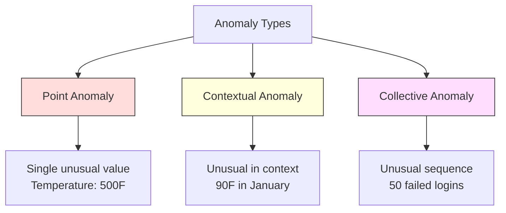
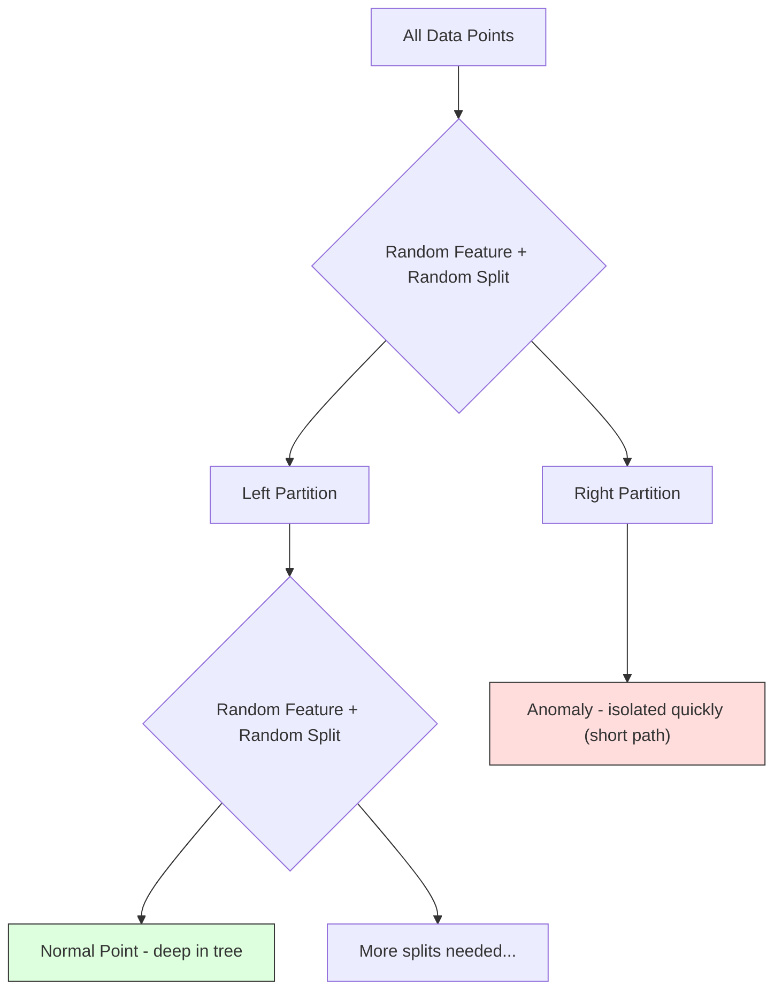
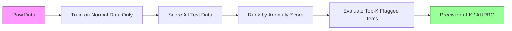

# Khám phá bất thường

> Thường thì dễ định nghĩa. Thường thì bất thường là bất cứ điều gì không phù hợp với nó.

**Type:** Build
**Language:**Python
**Prerequisites:** Phase 2, Lessons 01-09
**Time:** ~75 minutes

## Học mục tiêu

- Từ zero thực hiện điểm Z-IQR và cách ly rừng phát hiện bất thường
- 区分点、 ngữ cảnh và bất thường tập thể,并为每种选择合适的检测方法
- 解释 tại sao phát hiện bất thường được mô tả như là đối với dữ liệu bình thường 建模, chứ không phải đối với bất thường làm phân loại
- So sánh việc phát hiện bất thường không được giám sát với việc phân loại được giám sát,并 đánh giá sự bất thường mới  phạm vi bao phủ và độ chính xác 

## 问题

Một thẻ tín dụng vào 2 giờ chiều tại New York được sử dụng, sau đó vào 2 giờ chiều tại Tokyo được sử dụng. Một máy truyền cảm biến trong nhà máy đọc 150 độ, và phạm vi bình thường là 80-120 độ.

Những điều này là bất thường. Tìm chúng là rất quan trọng. Trách lừa đảo gây ra hàng tỷ USD thiệt hại. Thiết bị hỏng gây ra thời gian dừng lại.

挑战 là: bạn rất ít có bất thường với nhãn Ví dụ: 欺诈 chỉ chiếm 0,1% giao dịch. 设备故障一年只发生几次. Bạn không thể đào tạo phân loại tiêu chuẩn, vì trong " bất thường " 类 类 几乎没有可学习的内容.

Phác định bất thường Trở lại vấn đề. Đừng học được điều gì là bất thường, mà hãy học được điều gì là bình thường. Bất cứ điều gì xa xôi khỏi bình thường đều đáng ngờ.

## 概念

### Các loại bất thường

Không phải tất cả các bất thường đều giống nhau:

- **Point anomalies.**单个数据点无论上下文如何都很异常──500 度的温度读数──一个通常消费 $50 的账户发生 $50.000 giao dịch.
- **Contextual anomalies.**Một số điểm dữ liệu trên một số định nghĩa khác nhau. 90 độ trong mùa hè là bình thường, trong mùa đông là bất thường.
- **Collective anomalies.**Một nhóm dữ liệu như toàn bộ là bất thường, ngay cả khi mỗi dữ liệu riêng lẻ có thể là bình thường.

大多数方法检测点异常―― ngữ cảnh异常──需要时间或位置特征──集体异常──需要序列意识的方法──



### Không giám sát 表述

Trong Classification tiêu chuẩn, bạn có hai loại nhãn. Trong Anomaly Detection, thường gặp một trong ba tình huống sau:

1. **Fully unsupervised.**完全没有标签──你在所有数据上适合探测器,并希望异常 足够稀少,不会污染"正常"模型──
2. **Semi-supervised.**Bạn có một tập dữ liệu chỉ có dữ liệu bình thường. Bạn có thể phù hợp với tập dữ liệu này, sau đó đối với tất cả các dữ liệu khác. Nếu có thể, đó là thiết lập mạnh nhất.
3. **Weakly supervised.**Bạn có một số ít các bất thường của nhãn hiệu. Bạn sẽ sử dụng chúng để đánh giá, thay vì đào tạo.

关键洞见:Phát hiện bất đồng và phân loại có những khác biệt thực chất. Bạn đang xây dựng phân bố dữ liệu bình thường, chứ không phải học cách giới hạn quyết định giữa hai loại.

### Đánh giá đối với Không giám sát:权衡

Nếu thực sự có bất thường được đánh dấu, bạn nên sử dụng chúng để đào tạo (được giám sát) hoặc chỉ để đánh giá (được giám sát)?

**Supervised（当作 Classification 处理）：**
- 能捕捉你以前见过的确定的异常 类型
- Đối với các loại bất thường được biết đến có độ chính xác cao hơn
- 会完全漏掉 novel anomaly 类型
- Khi một loại bất thường mới xuất hiện cần phải đào tạo lại
- 需要足够多的异常示例(通常太少)

**Unsupervised（对 normal 建模，标记偏离项）：**
- 能 nắm bắt bất kỳ tình huống nào xa bình thường, bao gồm cả tiểu thuyết 类型
- Không cần có bất thường
- Tỷ lệ dương tính sai hơn cao hơn (并非所有不寻常 都是坏事)
- Đối với chuyển đổi phân phối mạnh hơn

Trong thực tế, hệ thống tốt nhất sẽ kết hợp hai: sử dụng phát hiện không giám sát được bao phủ rộng rãi, sử dụng mô hình giám sát được xử lý thông tin cao cấp ưu tiên bất thường  loại,并让人工审查模糊案例──

### Z-Score 方法

Cách đơn giản nhất:  tính toán trung bình và lệch chuẩn của mỗi tính năng  ghi bất kỳ khoảng cách nào từ trung bình vượt quá các điểm lệch chuẩn 

```text
z_score = (x - mean) / std
anomaly if |z_score| > threshold
```

默认 ngưỡng là 3.0( Đối với phân bố Gaussian, 99,7% dữ liệu bình thường 落在 3 个标准偏差范围内)

**优点：**简单――快速――可解释(" giá trị này cách bình thường có 4,5 lệch chuẩn")

**缺点：**假设 dữ liệu tuân theo phân phối bình thường.                                                                                                                                                                                                                                                         

**适用场景：**Các tính năng đơn của phân bố dữ liệu lớn  giám sát ⋅ máy chủ phản ứng thời gian ⋅ tạo công suất ⋅ có đường cơ sở ổn định ⋅ số lượng cảm biến

**失效场景：**Nhiều cluster số liệu (( hai vị trí văn phòng có mức độ cơ sở khác nhau 温度) ]], dữ liệu bị lệch định (( số lượng giao dịch trong số 1000 đô la  rất ít nhưng không bất thường) ✓ tập trung đào tạo chứa dữ liệu về các mức độ ngoại lệ.

### IQR 方法

比 Z-score hơn mạnh hơn. Sử dụng phạm vi liên quartal, thay vì trung bình và lệch chuẩn.

```
Q1 = 25th percentile
Q3 = 75th percentile
IQR = Q3 - Q1
lower_bound = Q1 - factor * IQR
upper_bound = Q3 + factor * IQR
anomaly if x < lower_bound or x > upper_bound
```

默认 factor là 1,5:

**优点：**Đối với các mức ngoại lệ mạnh mẽ (%) % không chịu ảnh hưởng bởi giá trị cực cực) ⋅适用于 phân phối bị lệch lạc ⋅ không có giả định bình thường ⋅

**缺点：**仅适用于单变化 (单独看可能是正常的,但在联合空间中是异常的) ⋅ không thể kiểm tra chỉ trong các tính năng

**实践说明：**IQR trong 1,5 yếu tố đối với các con nâu trong khung hình trong các con nâu.

### Rừng cách ly

关键洞见: các bất thường số lượng ít và với số lượng khác nhau. Khi phân vùng ngẫu nhiên trên dữ liệu, các bất thường dễ dàng hơn để được tách ra, chúng chỉ cần ít phân chia ngẫu nhiên hơn để có thể tách ra khỏi các dữ liệu còn lại.



**工作方式：**
1. 构建许多随机树木 (một khu rừng cách ly)
2. Trong mỗi nút, tùy chọn một tính năng, và trong tính năng đó của min và max  giữa tùy chọn một giá trị chia
3. 持续 chia rẽ, cho đến khi mỗi điểm đều được tách biệt  nằm trong lá của riêng mình)
4. Phác thường trên tất cả các cây trên có đường dài trung bình ngắn hơn

**为什么有效：**Các điểm bình thường nằm trong các vùng dày đặc. Nó cần nhiều phân chia ngẫu nhiên để tách ra một điểm từ những người lân cận.

Điểm số bất thường dựa trên chiều dài đường trung bình của tất cả các cây, và sử dụng cây tìm kiếm nhị phân ngẫu nhiên chiều dài đường dự kiến của cây để thực hiện bình thường hóa:

```
score(x) = 2^(-average_path_length(x) / c(n))
```

Trong số đó `c(n)`là n 个 mẫu của đường dài dự kiến──Score 接近 1 biểu hiện bất thường──Score 接近 0.5 biểu hiện bình thường──Score 接近 0 biểu hiện rất bình thường(位于密集集 cluster 深处)。

**优点：**Không có giả định phân phối.  Được sử dụng cho kích thước cao.                                                                                                                                                                                                                                                       

**缺点：**难以处理密集地区 中的异常 (phụ hiệu ẩn mặt) ⋅当许多特征无关 时,随机分断 效果较差──

**关键 hyperparameters：**
- `n_estimators`Cây số lượng: 100, thường đủ. Cây nhiều hơn sẽ mang lại điểm số ổn định hơn, nhưng tính toán chậm hơn.
- `max_samples`Các mẫu của mỗi cây số lượng. Giá trị mặc định là 256. Giá trị nhỏ hơn sẽ làm cho một cây không quá chính xác, nhưng sẽ tăng đa dạng.
- `contamination`: 预期异常 比例── chỉ được sử dụng để đặt ngưỡng── không ảnh hưởng đến điểm số 本身──

### Tỷ lệ giá trị ngoại lệ tại địa phương (LOF)

LOF sẽ so sánh mật độ địa phương xung quanh một điểm nào đó với mật độ xung quanh hàng xóm của nó. Một trong những khu vực nằm ở vùng hiếm, nhưng được bao quanh bởi các khu vực dày đặc.

**工作方式：**
1. Đối với mỗi điểm, tìm thấy các hàng xóm gần nhất của nó k
2. 计算 mật độ tiếp cận địa phương (đường gần có nhiều)
3. So sánh mật độ của mỗi điểm với mật độ của hàng xóm của nó
4. Nếu mật độ của một điểm nào đó rõ ràng thấp hơn các hàng xóm của nó, nó là ngoại lệ

**LOF score：**
- LOF  gần 1.0 biểu hiện mật độ với hàng xóm tương tự như bình thường)
- LOF lớn hơn 1.0 biểu hiện mật độ thấp hơn hàng xóm (có thể bất thường)
- LOF 远大于 1.0(ví dụ 2.0+) biểu thị mật độ 显著更低(很可能是异常)

"local" 部分至关重要――考虑一个有两个集群的数据集:一个包含1000个点的密集集,另一个包含50个点的稀疏集群――Sparse cluster 边缘的一个点并非全局不寻常,它有50个邻居――但如果它的直接邻居比它更密集,那么它在局部就是不寻常――LOF 捕捉到了全球方法会漏掉这种微小差异――

**优点：**检测 địa phương bất thường (nếu không phải là bất thường)  được áp dụng cho các cụm có mật độ khác nhau.

**缺点：**Trong tập dữ liệu lớn chậm hơn, việc thực hiện ngây thơ sẽ ảnh hưởng đến tính toán khoảng cách.

### Đối với

| Method | Assumptions | Speed | Handles High Dims | Detects Local Anomalies |
|--------|------------|-------|-------------------|------------------------|
| Z-score | Normal distribution | 非常快 | 是（逐 feature） | 否 |
| IQR | 无（逐 feature） | 非常快 | 是（逐 feature） | 否 |
| Isolation Forest | 无 | 快 | 是 | 部分 |
| LOF | Distance 有意义 | 慢 | 较差 | 是 |

###  đánh giá thách thức

 đánh giá các máy phát hiện bất thường hơn đánh giá các phân loại hơn:

- **Extreme class imbalance.**Nếu bất thường chiếm 0,1%, tất cả các dự đoán "tình thường" sẽ đạt được độ chính xác 99,9%.
- **AUROC 具有误导性。**Trong sự mất cân bằng nghiêm trọng, ngay cả khi mô hình trong ngưỡng thực tế, giảm thiểu hầu hết các bất thường, AUROC cũng có thể trông không đúng.
- **更好的 metrics：**Precision@k(top k 被标记项中有多少是真相异常) 、AUPRC(precision-recall curve 下面积),以及在固定假正率 下的回忆──



### Đường ống phát hiện bất thường

Thực tế, Phát hiện bất động sản  theo quy trình làm việc sau:

1. **收集 baseline data.**理想情况下, chọn một bạn biết không có (((hoặc hầu như không có) bất thường
2. **Feature engineering.**Các tính năng ban đầu cộng với các tính năng xuất phát ((điểm số xoay ư, tính năng thời gian, tỷ lệ) ⋅
3. **训练 detector.**Trong dữ liệu cơ bản 上拟合──Model học học " bình thường" kiểu.
4. **对新数据打分.**Mỗi lần quan sát mới đều có được điểm bất thường.
5. **Threshold selection.**选择 điểm số cắt giảm. Đó là quyết định kinh doanh:  ngưỡng cao hơn có nghĩa là báo động sai hơn, nhưng bỏ lỡ bất thường hơn.
6. **Alert and investigate.**Điểm được đánh dấu vào kiểm tra nhân tạo hoặc phản ứng tự động.
7. **Feedback collection.**记录被标记项是真实异常 还是虚假警报――使用这些数据评估探测器,并随时间调整门――

Đường ống không bao giờ "được thực hiện"――Chi tiết phân phối sẽ di chuyển, các loại bất thường mới sẽ xuất hiện, ngưỡng cũng cần được điều chỉnh――把Anomaly Detection được coi là một hệ thống hoạt động liên tục, chứ không phải là mô hình một lần――


```figure
f3-anomaly-fence
```

##  xây dựng nó

`code/anomaly_detection.py`Mã trung gian từ 0 đã thực hiện điểm Z-điểm, IQR và rừng cách ly.

### Đám tử điểm Z

```python
def zscore_detect(X, threshold=3.0):
    mean = X.mean(axis=0)
    std = X.std(axis=0)
    std[std == 0] = 1.0
    z = np.abs((X - mean) / std)
    return z.max(axis=1) > threshold
```

 đơn giản và vectorized. Nếu bất kỳ tính năng nào vượt quá ngưỡng,就标记该点.

### Bộ phát hiện IQR

```python
def iqr_detect(X, factor=1.5):
    q1 = np.percentile(X, 25, axis=0)
    q3 = np.percentile(X, 75, axis=0)
    iqr = q3 - q1
    iqr[iqr == 0] = 1.0
    lower = q1 - factor * iqr
    upper = q3 + factor * iqr
    outside = (X < lower) | (X > upper)
    return outside.any(axis=1)
```

### Từ zero thực hiện rừng cách ly

Từ zero thực hiện phiên bản sẽ xây dựng cây cách ly, thực hiện phân vùng ngẫu nhiên cho không gian tính năng:

```python
class IsolationTree:
    def __init__(self, max_depth):
        self.max_depth = max_depth

    def fit(self, X, depth=0):
        n, p = X.shape
        if depth >= self.max_depth or n <= 1:
            self.is_leaf = True
            self.size = n
            return self
        self.is_leaf = False
        self.feature = np.random.randint(p)
        x_min = X[:, self.feature].min()
        x_max = X[:, self.feature].max()
        if x_min == x_max:
            self.is_leaf = True
            self.size = n
            return self
        self.threshold = np.random.uniform(x_min, x_max)
        left_mask = X[:, self.feature] < self.threshold
        self.left = IsolationTree(self.max_depth).fit(X[left_mask], depth + 1)
        self.right = IsolationTree(self.max_depth).fit(X[~left_mask], depth + 1)
        return self
```

隔离某个点所需的路径长度决定它的异常分数――更短的路径表示更异常――

`IsolationForest`lớp 包装了多棵树:

```python
class IsolationForest:
    def __init__(self, n_estimators=100, max_samples=256, seed=42):
        self.n_estimators = n_estimators
        self.max_samples = max_samples

    def fit(self, X):
        sample_size = min(self.max_samples, X.shape[0])
        max_depth = int(np.ceil(np.log2(sample_size)))
        for _ in range(self.n_estimators):
            idx = rng.choice(X.shape[0], size=sample_size, replace=False)
            tree = IsolationTree(max_depth=max_depth)
            tree.fit(X[idx])
            self.trees.append(tree)

    def anomaly_score(self, X):
        avg_path = average path length across all trees
        scores = 2.0 ** (-avg_path / c(max_samples))
        return scores
```

Tỷ lệ bình thường hóa`c(n)`là trong chứa n 个元素 của cây tìm kiếm nhị phân trong một lần tìm kiếm không thành công của đường dài dự kiến. Nó tương đương với`2 * H(n-1) - 2*(n-1)/n`, trong số đó `H`Đây là số hợp nhất. Việc bình thường hóa này đảm bảo điểm số có thể so sánh giữa các tập dữ liệu lớn khác nhau.

### Demo 场景

代码生成多个测试场景:

1. **Single cluster with outliers.**Một cụm Gaussian 2D, và được đặt ở vị trí xa trung tâm, thấm vào bất thường. Tất cả các phương pháp ở đây đều nên hiệu quả.
2. **Multimodal data.**Ba cụm có kích thước và mật độ khác nhau. Điểm giữa các cụm là bất thường.
3. **High-dimensional data.**50 tính năng, nhưng bất thường chỉ trong 5 tính năng trên khác nhau.

Mỗi bản demo đều sử dụng độ chính xác, nhớ lại, F1 và Precision.

## Sử dụng nó

Sử dụng từ:

```python
from sklearn.ensemble import IsolationForest
from sklearn.neighbors import LocalOutlierFactor

iso = IsolationForest(n_estimators=100, contamination=0.05, random_state=42)
iso.fit(X_train)
predictions = iso.predict(X_test)

lof = LocalOutlierFactor(n_neighbors=20, contamination=0.05, novelty=True)
lof.fit(X_train)
predictions = lof.predict(X_test)
```

chú ý,`contamination`设置 dự kiến bất thường Ví dụ: 设置 đúng là rất quan trọng, quá thấp sẽ bỏ lỡ bất thường, quá cao sẽ tạo ra báo động sai.

`anomaly_detection.py`Các mã hóa trung gian được so sánh trên cùng một dữ liệu từ phiên bản thực hiện từ zero với sklearn.

### Skillarn Parameter ô nhiễm

sklearn 中的 `contamination`tham số quyết định làm thế nào để chuyển đổi điểm số bất thường liên tục thành ngưỡng dự đoán nhị phân. Nó sẽ không thay đổi điểm số dưới cùng.

```python
iso_5 = IsolationForest(contamination=0.05)
iso_10 = IsolationForest(contamination=0.10)
```

两者产生相同的异常分数. Nhưng`iso_5`标记 top 5%, còn `iso_10`标记 top 10%── Nếu bạn không biết tỷ lệ bất thường thực sự (通常不知道), sẽ gây ô nhiễm 设置为"auto",并直接使用原分── dựa trên điểm tích cực sai với điểm tiêu cực sai 设置 ngưỡng của riêng bạn──

### SVM một lớp

Một loại SVM sẽ được sử dụng trong không gian tính năng chiều cao xung quanh dữ liệu bình thường 拟合一个边界 (tạm dịch: "đường biên giới")

```python
from sklearn.svm import OneClassSVM

oc_svm = OneClassSVM(kernel="rbf", gamma="auto", nu=0.05)
oc_svm.fit(X_train)
predictions = oc_svm.predict(X_test)
```

`nu`Phân tích gần giống như biểu hiện các bất thường. Một lớp SVM trong tập dữ liệu nhỏ đến trung bình có hiệu quả tốt, nhưng không thể mở rộng đến dữ liệu rất lớn.

### Autoencoder Phương pháp ((预览)

Autoencoder là một mạng Neural học tập tập tập trung và tái cấu trúc dữ liệu. Trong dữ liệu bình thường, các bất thường sẽ có lỗi tái cấu trúc cao hơn, vì mạng chỉ học được tái cấu trúc các mô hình bình thường.

Đây sẽ là giai đoạn 3 trong quá trình học tập sâu, nhưng nguyên tắc là giống nhau: đối với mô hình bình thường, đánh dấu sự phân biệt.

### Tạo ra việc phát hiện bất thường

Như các phương pháp tập hợp 会改进分类 (Lớp 11)),组组合多个异常检测器也会改进检测效果──最简单的方法:

1. 运行多个探测器(Z-score、IQR、lần cách ly 森林、LOF)
2. Các điểm của mỗi máy dò sẽ bình thường hóa đến [0, 1]
3. Đối với điểm bình thường  trung bình
4. 标记 điểm trung bình cao hơn ngưỡng của điểm

Điều này sẽ giảm thiểu các điểm dương tính sai, bởi vì các phương pháp khác nhau có các chế độ thất bại khác nhau.

Các bộ phức tạp hơn sẽ được phép đo trọng lượng dựa trên ước tính độ tin cậy của mỗi bộ cảm biến (Nếu có bộ xác thực các bất thường được biết đến, thì có thể đo trên nó)

### 生产环境考虑

1. **Threshold drift.**随着 phân phối dữ liệu 漂移, ngưỡng cố định 会过时――监控异常分数的分布,并定期调整――
2. **Alert fatigue.**báo động sai 太多时, các nhà điều hành sẽ ngừng quan tâm. Trước tiên sử dụng ngưỡng cao hơn.
3. **Ensemble approach.**Trong môi trường sản xuất, tập hợp nhiều máy dò. Chỉ có một số phương pháp cho thấy một điểm bất thường khi đánh dấu nó. Điều này sẽ làm giảm đáng kể dương tính sai.
4. **Feature engineering.**Các tính năng ban đầu thường không đủ. Ước tính quay số, tỷ lệ thời gian kể từ sự kiện cuối cùng và tính năng cụ thể về miền.
5. **Feedback loop.**Khi các nhà điều hành xác nhận hoặc bác bỏ các điều tra được đánh dấu, sẽ sử dụng các hệ thống nhập dữ liệu này để đánh giá và cải tiến các bộ phát hiện.

## 交付 nó

本课产 出:
- `outputs/skill-anomaly-detector.md`-- một kỹ năng quyết định để chọn bộ dò phù hợp
- `code/anomaly_detection.py`-- Từ zero thực hiện điểm Z, IQR và rừng cách ly, và so với Sloan

### 选择 Tỉ lệ

Điểm số bất thường là giá trị liên tục. Bạn cần một ngưỡng để đưa ra quyết định nhị phân. Đây là quyết định kinh doanh, không phải quyết định kỹ thuật.

考虑两个场景:
- **Fraud detection.**漏掉欺诈代价很高(拒付、客户信任) ―― chi phí của báo động sai là 5 分钟―― sẽ đặt ngưỡng thấp để bắt được nhiều lừa đảo hơn,并 nhận được nhiều báo động sai hơn――
- **Equipment maintenance.**báo động sai nghĩa là một lần không cần phải dừng lại, chi phí là $50,000。missed failure 意味着 $500,000 sửa chữa  đặt ngưỡng để cân bằng những chi phí 

Trong hai trường hợp, ngưỡng tối ưu phụ thuộc vào tỷ lệ chi phí giữa dương tính sai và âm tính sai.

###  mở rộng đến môi trường sản xuất

对于生产环境中的实时异常检测:

1. **Batch training, online scoring.**定期(每天、每周) trong dữ liệu bình thường trong thời gian gần đây 上训练模型── mỗi quan sát mới đến khi ghi điểm──
2. **Feature computation must match.**Nếu bạn đã sử dụng thống kê xoay trong 30 天 cửa sổ khi tập luyện, thì bạn sẽ cần 30 天 lịch sử để có được các tính năng tính toán mới.
3. **Score distribution monitoring.**Theo dõi điểm bất thường 随着时间的分布―― Nếu điểm trung bình di chuyển lên, liệu dữ liệu đang thay đổi, liệu mô hình đã qua thời gian――
4. **Explainability.**Khi bạn đánh dấu một bất thường, giải thích nguyên nhân. Z-score:"Công tính X cao hơn bình thường cao hơn 4,2 个 tiêu chuẩn lệch. "

## 练习

1. **Threshold tuning.**Sử dụng ngưỡng từ 1.0 đến 5.0  bước dài là 0.5  chạy máy dò điểm Z  vẽ mỗi ngưỡng dưới đây chính xác và nhớ lại  Điểm cân bằng tốt nhất của dữ liệu của bạn ở đâu?

2. **Multivariate anomalies.**Tạo dữ liệu 2D, mỗi tính năng 单独看都像正常, nhưng kết hợp lên là bất thường (ví dụ, xa góc diagonal của cụm chính)  trình bày điểm Z của mỗi tính năng sẽ bỏ qua những điểm này, nhưng rừng cách ly 能 nắm bắt chúng 

3. **从零实现 LOF.**Sử dụng k-cô lân cận 实现 Local Outlier Factor── trên cùng dữ liệu với LocalOutlierFactor của sklearn

4. **Streaming Anomaly Detection.**修改 Z-score detector,使其在流媒体设置中工作:随着新点到达更新运行平均和变异(Welford's online algorithm) ⋅ 在同一数据上与批次 Z-score比较──

5. **Real-world evaluation.**选择一个带有已知异常的数据集 (例如 Kaggle's credit card fraud)  sử dụng precision@100、precision@500 和 AUPRC 评估全部四种方法──哪种方法效果最好?为什么?

## 关键术语

| Term | 人们通常怎么说 | 它实际意味着什么 |
|------|----------------|----------------------|
| Anomaly | "Outlier，异常点" | 一个明显偏离 normal data 预期模式的数据点 |
| Point anomaly | "单个奇怪的值" | 一个无论上下文如何都异常的单独 observation |
| Contextual anomaly | "normal 值，错误上下文" | 一个在给定上下文（时间、位置等）下异常、但在另一个上下文中可能 normal 的 observation |
| Isolation Forest | "用 random splits 找 outliers" | 一种 random trees 的 ensemble，它能用比 normal points 更少的 splits 隔离 anomalies |
| Local Outlier Factor | "把 density 和 neighbors 比较" | 一种标记 local density 明显低于其 neighbors density 的点的方法 |
| Z-score | "距离 mean 的 standard deviations 数" | (x - mean) / std，用 standard deviation 为单位衡量某个点距离中心有多远 |
| IQR | "Interquartile range" | Q3 - Q1，衡量数据中间 50% 的 spread，用于 robust outlier detection |
| Contamination | "预期 anomalies 比例" | 一个 hyperparameter，用于告诉 detector 应该将数据中多大比例标记为 anomalous |
| Precision@k | "top k flags 中有多少是真的" | 只在 k 个最可疑点上计算的 precision，适用于 imbalanced Anomaly Detection |
| AUPRC | "Precision-recall curve 下的面积" | 一个汇总所有 thresholds 下 precision-recall 表现的 metric，对 imbalanced data 比 AUROC 更好 |

## 延伸阅读

- [Liu et al., Isolation Forest (2008)](https://cs.nju.edu.cn/zhouzh/zhouzh.files/publication/icdm08b.pdf)-- 原始 Bốn rừng
- [Breunig et al., LOF: Identifying Density-Based Local Outliers (2000)](https://dl.acm.org/doi/10.1145/342009.335388)-- 原始 LOF 论文
- [scikit-learn Outlier Detection docs](https://scikit-learn.org/stable/modules/outlier_detection.html)-- Tất cả các máy dò bất thường của các nhà máy
- [Chandola et al., Anomaly Detection: A Survey (2009)](https://dl.acm.org/doi/10.1145/1541880.1541882)-- Anomaly Detection 方法的综合综述
- [Goldstein and Uchida, A Comparative Evaluation of Unsupervised Anomaly Detection Algorithms (2016)](https://journals.plos.org/plosone/article?id=10.1371/journal.pone.0152173)-- So sánh bằng chứng thực tế của 10 phương pháp trên tập dữ liệu thực tế
