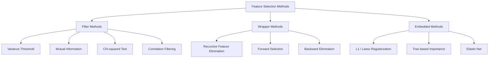
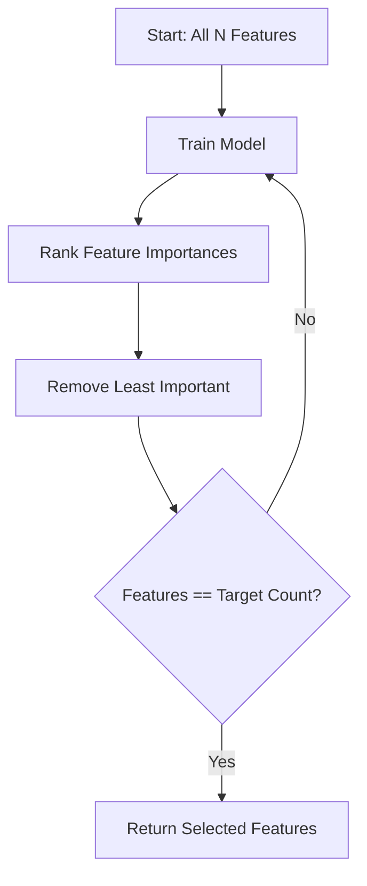
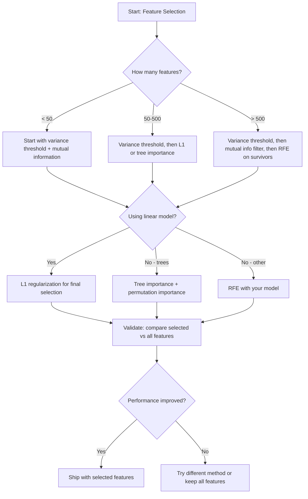

# Chọn tính năng

> 更多功能并不更好──trực sự các tính năng 才更好──

**Type:** Build
**Language:**Python
**先修要求：**Giai đoạn 2, Bài học 01-09, 08
**Time:** ~75 分钟

## Học mục tiêu
- Từ zero thực hiện các phương pháp lọc (RFE, chọn lựa phía trước)
- 解释 tại sao thông tin chung 能捕捉相关会漏掉的非线性特征-目标关系
- So sánh L1 quy định (đánh chọn tích hợp) với RFE (đánh chọn bao bì),并评估它们的计算权衡
- Xây dựng một đường ống lựa chọn tính năng kết hợp nhiều phương pháp, và hiển thị nó trong dữ liệu được giữ trên cải thiện hiệu quả của tổng quát

## 问题
Bạn có 500 tính năng. Mô hình của bạn tập luyện rất chậm, thường xuyên quá sức, và không ai có thể giải thích nó đã học được gì. Bạn liên tục thêm nhiều tính năng, mong muốn nâng cao hiệu suất. Kết quả trở nên tồi tệ hơn.

Đây là biểu hiện thực tế của sự nguyền rủa của chiều kích. Với các tính năng tăng số lượng, không gian tính năng của khối lượng tăng vọt.

Sự lựa chọn tính năng là giải thuốc, loại bỏ tiếng ồn, loại bỏ sự tháo dỡ, giữ lại những tính năng thực sự mang theo thông tin mục tiêu, kết quả là: tập luyện nhanh hơn, tổng quát hơn, và mô hình thực sự có thể giải thích.

Ưu điểm không phải là sử dụng tất cả thông tin có sẵn, mà sử dụng thông tin chính xác.

## 概念
### Chọn tính năng của 3 loại phương pháp

Mỗi loại lựa chọn tính năng đều thuộc một trong ba loại sau:



**Filter methods**Sử dụng thống kê đo tự do cho mỗi tính năng 打分──它们 không sử dụng mô hình──速度快, nhưng sẽ bỏ qua các tương tác tính năng──

**Wrapper methods**Mô hình đào tạo để đánh giá các bộ phụ thuộc tính năng. Chúng sử dụng hiệu suất mô hình như phần tử. Kết quả tốt hơn, nhưng chi phí cao hơn, vì cần nhiều lần tái đào tạo mô hình.

**Embedded methods**Trong quá trình đào tạo mô hình, chọn các tính năng. L1 thường xuyên hóa sẽ đưa trọng lượng  đẩy sang không. Cây quyết định sẽ dựa trên các tính năng hữu ích nhất.

### Tỉ lệ biến động

 Nếu một tính năng gần như không thay đổi giữa các mẫu, nó gần như không mang thông tin.

考虑一个特征, trong 1000 mẫu có 999 个都是0.0――它的变量接近零――没有模型能用它来区分类――移除它――

```
variance(x) = mean((x - mean(x))^2)
```

设置 một ngưỡng (ví dụ 0.01)  bỏ qua mỗi biến số thấp hơn ngưỡng này  Điều này sẽ xảy ra trong trường hợp hoàn toàn không xem xét biến mục tiêu  chuyển đổi các tính năng liên tục hoặc gần liên tục 

Sử dụng trường hợp: như các bước xử lý trước các phương pháp khác.

Ưu điểm: một tính năng có thể có sự khác biệt cao, nhưng vẫn là tiếng ồn.

### Thông tin lẫn nhau

Thông tin lẫn nhau  đo lường giá trị của tính năng X có thể giảm đáng kể về sự không chắc chắn của mục tiêu Y.

```
I(X; Y) = sum_x sum_y p(x, y) * log(p(x, y) / (p(x) * p(y)))
```

Nếu X 和 Y 独立,则 p(x, y) = p(x) * p(y), do đó log 项为零,I(X; Y) = 0。X 能告诉你越多关于Y的信息,互通信息就越高。

Đối với mối tương quan quan quan trọng: thông tin lẫn nhau có thể nắm bắt mối quan hệ không liên quan. Một tính năng có thể có mối tương quan với mục tiêu là không, nhưng thông tin lẫn nhau là rất cao, vì mối quan hệ có thể là hình vuông hoặc định kỳ.

Đối với các tính năng liên tục, hãy phân định trước 成 bins (được dựa trên ước tính histogram) ・ số lượng bins sẽ ảnh hưởng đến kết quả ước tính:bins (tất nhiều sẽ mất thông tin, quá ít sẽ tăng tiếng ồn).


### Phục tiêu tính năng tái phát (RFE)

RFE là một phương pháp bao bì. Nó sử dụng mô hình  Bản thân tính năng quan trọng  thực hiện 代式剪枝:

1. 使用所有 tính năng 训练 mô hình
2. 按重要性 đối với các tính năng 排名(mô hình tuyến tính Sử dụng hệ số, cây Sử dụng giảm tạp chất)
3. 移除最不重要 feature (trong phần này, phần này là phần lớn của phần mềm của phần mềm)
4. 重复, cho đến còn lại期望 số lượng các tính năng



RFE sẽ xem xét các tương tác tính năng, vì mô hình sẽ nhìn thấy tất cả các tính năng còn lại cùng một lúc.

成本:You need to train model N - target 次。 Đối với 500 tính năng 目標 为 10 tình huống,就是 490 lần đào tạo。 Đối với các mô hình đắt tiền, điều này sẽ rất chậm── có thể thông qua từng bước di chuyển nhiều tính năng để tăng tốc (ví dụ: mỗi vòng di chuyển phần dưới 10%)。

### L1 (Lasso) Chuẩn bị

L1 Regularisation 会把 weights 的绝对值加入 Loss Function:

```
loss = prediction_error + alpha * sum(|w_i|)
```

Alpha 参数 kiểm soát các tính năng 被剪枝的激进程度──alpha 越高,越多重会精确变成零──

Tại sao sẽ chính xác cho không? L1 hình phạt trong không gian trọng lượng tạo ra một vùng 形约束.

Đây là sự lựa chọn tính năng nhúng: mô hình trong quá trình tập luyện những tính năng nào nên bỏ qua.

优势: chỉ cần một lần tập luyện,能 xử lý các tính năng tương quan, chọn một trong số đó并把其他置零,内置于大多数线性模型实现中──

Ưu điểm: chỉ áp dụng cho các mô hình tuyến tính. Không thể nắm bắt được tầm quan trọng của các tính năng không tuyến tính.

### Sự quan trọng của tính năng cây

Cây quyết định  và các tập hợp của nó (quang rừng ngẫu nhiên, tăng cường theo cấp độ) sẽ tự nhiên đối với các tính năng 排名.

Đối với những cây cây                                                                                                                                                                                                                                                             

```
importance(feature_j) = (1/T) * sum over all trees of
    sum over all nodes splitting on feature_j of
        (n_samples * impurity_decrease)
```

Nó sẽ cho mỗi tính năng  chỉ số tầm quan trọng bình thường. Nó có thể tự động xử lý các mối quan hệ không tuyến tính và tương tác tính năng.

chú ý: triết học dựa trên cây 会偏向具有许多独特值的特征 (高 Cardinality) 随机 ID 列会显得重要,因为它能完美分割每样品──使用变量重要性 作为智能检查──

### Tầm quan trọng của sự chuyển đổi

Một loại phương pháp mô hình-nhận thức:

1. Mô hình đào tạo, và ghi lại dữ liệu xác thực
2. Đối với mỗi tính năng:随时 shuffle giá trị của nó, đo hiệu suất của giảm
3. 下降越大, tính năng này càng quan trọng

Nếu trộn một tính năng không làm hỏng hiệu suất, mô hình không phụ thuộc vào nó. Nếu hiệu suất bị hỏng, tính năng đó rất quan trọng.

Tầm quan trọng của sự biến đổi  tránh sự thiên vị về tính từ của sự quan trọng dựa trên cây cây. Nhưng nó rất chậm: mỗi tính năng đều cần một lần đánh giá đầy đủ, và phải lặp lại nhiều lần để đạt được sự ổn định.

### Bảng so sánh

| Method | Type | Speed | Nonlinear | Feature Interactions |
|--------|------|-------|-----------|---------------------|
| Variance threshold | Filter | 非常快 | 否 | 否 |
| Mutual information | Filter | 快 | 是 | 否 |
| Correlation filter | Filter | 快 | 否 | 否 |
| RFE | Wrapper | 慢 | 取决于 model | 是 |
| L1 / Lasso | Embedded | 快 | 否（linear） | 否 |
| Tree importance | Embedded | 中等 | 是 | 是 |
| Permutation importance | Model-agnostic | 慢 | 是 | 是 |

### Hình ảnh dòng chảy quyết định




```figure
f3-feature-prune
```

##  xây dựng nó
### 步骤 1: Tạo dữ liệu tổng hợp với cấu trúc tính năng được biết đến

```python
import numpy as np


def make_feature_selection_data(n_samples=500, seed=42):
    rng = np.random.RandomState(seed)

    x1 = rng.randn(n_samples)
    x2 = rng.randn(n_samples)
    x3 = rng.randn(n_samples)
    x4 = x1 + 0.1 * rng.randn(n_samples)
    x5 = x2 + 0.1 * rng.randn(n_samples)

    informative = np.column_stack([x1, x2, x3, x4, x5])

    correlated = np.column_stack([
        x1 * 0.9 + 0.1 * rng.randn(n_samples),
        x2 * 0.8 + 0.2 * rng.randn(n_samples),
        x3 * 0.7 + 0.3 * rng.randn(n_samples),
        x1 * 0.5 + x2 * 0.5 + 0.1 * rng.randn(n_samples),
        x2 * 0.6 + x3 * 0.4 + 0.1 * rng.randn(n_samples),
    ])

    noise = rng.randn(n_samples, 10) * 0.5

    X = np.hstack([informative, correlated, noise])
    y = (2 * x1 - 1.5 * x2 + x3 + 0.5 * rng.randn(n_samples) > 0).astype(int)

    feature_names = (
        [f"info_{i}" for i in range(5)]
        + [f"corr_{i}" for i in range(5)]
        + [f"noise_{i}" for i in range(10)]
    )

    return X, y, feature_names
```

Chúng ta biết sự thật cơ bản: các tính năng 0-4 là thông tin và 3 和 4 là 0 和 1 có liên quan), các tính năng 5-9 với các tính năng thông tin liên quan, các tính năng 10-19 là tiếng ồn đơn thuần.

### 步骤 2: Khoảng hạn biến động

```python
def variance_threshold(X, threshold=0.01):
    variances = np.var(X, axis=0)
    mask = variances > threshold
    return mask, variances
```

### 步骤 3: Thông tin lẫn nhau (tự riêng tư)

```python
def discretize(x, n_bins=10):
    min_val, max_val = x.min(), x.max()
    if max_val == min_val:
        return np.zeros_like(x, dtype=int)
    bin_edges = np.linspace(min_val, max_val, n_bins + 1)
    binned = np.digitize(x, bin_edges[1:-1])
    return binned


def mutual_information(X, y, n_bins=10):
    n_samples, n_features = X.shape
    mi_scores = np.zeros(n_features)

    y_vals, y_counts = np.unique(y, return_counts=True)
    p_y = y_counts / n_samples

    for f in range(n_features):
        x_binned = discretize(X[:, f], n_bins)
        x_vals, x_counts = np.unique(x_binned, return_counts=True)
        p_x = dict(zip(x_vals, x_counts / n_samples))

        mi = 0.0
        for xv in x_vals:
            for yi, yv in enumerate(y_vals):
                joint_mask = (x_binned == xv) & (y == yv)
                p_xy = np.sum(joint_mask) / n_samples
                if p_xy > 0:
                    mi += p_xy * np.log(p_xy / (p_x[xv] * p_y[yi]))
        mi_scores[f] = mi

    return mi_scores
```

### 步骤 4: Phục tiêu tính năng tái phát

```python
def simple_logistic_importance(X, y, lr=0.1, epochs=100):
    n_samples, n_features = X.shape
    w = np.zeros(n_features)
    b = 0.0

    for _ in range(epochs):
        z = X @ w + b
        pred = 1.0 / (1.0 + np.exp(-np.clip(z, -500, 500)))
        error = pred - y
        w -= lr * (X.T @ error) / n_samples
        b -= lr * np.mean(error)

    return w, b


def rfe(X, y, n_features_to_select=5, lr=0.1, epochs=100):
    n_total = X.shape[1]
    remaining = list(range(n_total))
    rankings = np.ones(n_total, dtype=int)
    rank = n_total

    while len(remaining) > n_features_to_select:
        X_subset = X[:, remaining]
        w, _ = simple_logistic_importance(X_subset, y, lr, epochs)
        importances = np.abs(w)

        least_idx = np.argmin(importances)
        original_idx = remaining[least_idx]
        rankings[original_idx] = rank
        rank -= 1
        remaining.pop(least_idx)

    for idx in remaining:
        rankings[idx] = 1

    selected_mask = rankings == 1
    return selected_mask, rankings
```

### 步骤 5: L1 lựa chọn tính năng

```python
def soft_threshold(w, alpha):
    return np.sign(w) * np.maximum(np.abs(w) - alpha, 0)


def l1_feature_selection(X, y, alpha=0.1, lr=0.01, epochs=500):
    n_samples, n_features = X.shape
    w = np.zeros(n_features)
    b = 0.0

    for _ in range(epochs):
        z = X @ w + b
        pred = 1.0 / (1.0 + np.exp(-np.clip(z, -500, 500)))
        error = pred - y

        gradient_w = (X.T @ error) / n_samples
        gradient_b = np.mean(error)

        w -= lr * gradient_w
        w = soft_threshold(w, lr * alpha)
        b -= lr * gradient_b

    selected_mask = np.abs(w) > 1e-6
    return selected_mask, w
```

### 步骤 6: Tầm quan trọng dựa trên cây (gây quyết định đơn giản)

```python
def gini_impurity(y):
    if len(y) == 0:
        return 0.0
    classes, counts = np.unique(y, return_counts=True)
    probs = counts / len(y)
    return 1.0 - np.sum(probs ** 2)


def best_split(X, y, feature_idx):
    values = np.unique(X[:, feature_idx])
    if len(values) <= 1:
        return None, -1.0

    best_threshold = None
    best_gain = -1.0
    parent_gini = gini_impurity(y)
    n = len(y)

    for i in range(len(values) - 1):
        threshold = (values[i] + values[i + 1]) / 2.0
        left_mask = X[:, feature_idx] <= threshold
        right_mask = ~left_mask

        n_left = np.sum(left_mask)
        n_right = np.sum(right_mask)

        if n_left == 0 or n_right == 0:
            continue

        gain = parent_gini - (n_left / n) * gini_impurity(y[left_mask]) - (n_right / n) * gini_impurity(y[right_mask])

        if gain > best_gain:
            best_gain = gain
            best_threshold = threshold

    return best_threshold, best_gain


def tree_importance(X, y, n_trees=50, max_depth=5, seed=42):
    rng = np.random.RandomState(seed)
    n_samples, n_features = X.shape
    importances = np.zeros(n_features)

    for _ in range(n_trees):
        sample_idx = rng.choice(n_samples, size=n_samples, replace=True)
        feature_subset = rng.choice(n_features, size=max(1, int(np.sqrt(n_features))), replace=False)

        X_boot = X[sample_idx]
        y_boot = y[sample_idx]

        tree_imp = _build_tree_importance(X_boot, y_boot, feature_subset, max_depth)
        importances += tree_imp

    total = importances.sum()
    if total > 0:
        importances /= total

    return importances


def _build_tree_importance(X, y, feature_subset, max_depth, depth=0):
    n_features = X.shape[1]
    importances = np.zeros(n_features)

    if depth >= max_depth or len(np.unique(y)) <= 1 or len(y) < 4:
        return importances

    best_feature = None
    best_threshold = None
    best_gain = -1.0

    for f in feature_subset:
        threshold, gain = best_split(X, y, f)
        if gain > best_gain:
            best_gain = gain
            best_feature = f
            best_threshold = threshold

    if best_feature is None or best_gain <= 0:
        return importances

    importances[best_feature] += best_gain * len(y)

    left_mask = X[:, best_feature] <= best_threshold
    right_mask = ~left_mask

    importances += _build_tree_importance(X[left_mask], y[left_mask], feature_subset, max_depth, depth + 1)
    importances += _build_tree_importance(X[right_mask], y[right_mask], feature_subset, max_depth, depth + 1)

    return importances
```

### 步骤 7: chạy tất cả các phương pháp và so sánh

代码文件会在同一合成数据集上运行全部五种方法,并打印一个比较表,显示每个方法选择了哪些功能──

## Sử dụng nó
Sử dụng scikit-learn 时, lựa chọn tính năng 已内置到管道 中:

```python
from sklearn.feature_selection import (
    VarianceThreshold,
    mutual_info_classif,
    RFE,
    SelectFromModel,
)
from sklearn.linear_model import Lasso, LogisticRegression
from sklearn.ensemble import RandomForestClassifier

vt = VarianceThreshold(threshold=0.01)
X_filtered = vt.fit_transform(X)

mi_scores = mutual_info_classif(X, y)
top_k = np.argsort(mi_scores)[-10:]

rfe_selector = RFE(LogisticRegression(), n_features_to_select=10)
rfe_selector.fit(X, y)
X_rfe = rfe_selector.transform(X)

lasso_selector = SelectFromModel(Lasso(alpha=0.01))
lasso_selector.fit(X, y)
X_lasso = lasso_selector.transform(X)

rf = RandomForestClassifier(n_estimators=100)
rf.fit(X, y)
importances = rf.feature_importances_
```

Những điều này từ đầu thực hiện chính xác cho thấy mọi thứ xảy ra trong mỗi phương pháp.`var(X, axis=0)`Không áp dụng mặt nạ. Thông tin lẫn nhau là trong bảng tình huống trong thống kê chung và tần số biên. RFE là một vòng tròn tập luyện, xếp hạng, cắt rào. L1 là mang theo các bước ốc mềm.

Kỹ thuật này được sử dụng để phân loại các loại máy tính và các loại máy tính khác nhau.

## 交付 nó
本课产 出:
- `outputs/skill-feature-selector.md`-- dùng để chọn đúng phương pháp lựa chọn tính năng của cây quyết định tài liệu nhanh

## 练习
1. **Forward selection**: thực hiện quá trình ngược chiều của RFE. Từ 0 tính năng  bắt đầu. Mỗi bước thêm tính năng có thể nâng cao hiệu suất mô hình. Khi thêm tính năng không còn có ích khi dừng lại.

2. **Stability selection**: vận hành L1 tính năng lựa chọn 50 lần, mỗi lần sử dụng dữ liệu tùy chọn 80% phụ mẫu,并 sử dụng một chút khác nhau các giá trị alpha.

3. **Multicollinearity detection**:计算所有特征的相关性矩阵――实现一个函数,给定相关性门――例如0.9), từ mỗi đối tượng có liên quan cao giữa các tính năng, di chuyển một tính năng, giữ lại thông tin lẫn nhau với mục tiêu, còn cao hơn)――在合成数据集上测试,并验证它移除了冗余相关性质――

4. **Feature selection pipeline**:把变化门、互通信息过 和 RFE 串成一个管道──先移除近零变化特性,然后按互通信息保留50%以上,再在幸存者上运行 RFE──将该管道与直接在所有功能上运行 RFE比较──管道更快吗?准确性是否相同?

5. **Permutation importance from scratch**: thực hiện tầm quan trọng của sự thay đổi. Đối với mỗi tính năng, trộn các giá trị của nó 10 lần, đo F1 điểm số của trung bình giảm.

## 关键术语
| Term | What people say | What it actually means |
|------|----------------|----------------------|
| Filter method | “独立为 features 打分” | 一种 feature selection 方法，不训练 model，而是使用统计度量对 features 排名，并孤立地评估每个 feature |
| Wrapper method | “用 model 挑 features” | 一种 feature selection 方法，通过训练 model 并使用其 performance 作为 selection criterion 来评估 feature subsets |
| Embedded method | “model 在训练期间选择 features” | 作为 model fitting 一部分发生的 feature selection，例如 L1 regularization 会把 weights 推向零 |
| Mutual information | “一个变量能告诉你关于另一个变量的多少信息” | 给定 X 的知识后，关于 Y 的不确定性减少量的度量，能够捕捉线性和非线性 dependencies |
| Recursive Feature Elimination | “训练、排名、剪枝、重复” | 一种迭代式 wrapper method，会训练 model、移除最不重要的 feature(s)，并重复直到达到 target count |
| L1 / Lasso regularization | “会消灭 features 的 penalty” | 将 weight 绝对值之和加入 Loss Function，这会把不重要 feature 的 weights 推到精确为零 |
| Variance threshold | “移除 constant features” | 丢弃在 samples 之间 variance 低于指定 threshold 的 features，过滤掉不携带信息的 features |
| Feature importance | “哪些 features 最重要” | 表示每个 feature 对 model predictions 贡献程度的分数，可由 split gains（trees）或 coefficient magnitudes（linear）计算 |
| Permutation importance | “shuffle 并测量损害” | 通过随机 shuffle 每个 feature 的 values，并测量由此导致的 model performance 下降来评估 feature importance |
| Curse of dimensionality | “features 太多，data 不够” | 添加 features 会使 feature space 的体积指数级增长，导致 data 稀疏且 distances 失去意义的现象 |

## 延伸阅读
- [An Introduction to Variable and Feature Selection (Guyon & Elisseeff, 2003)](https://jmlr.org/papers/v3/guyon03a.html)-- phương pháp lựa chọn tính năng của nền tảng, cho đến nay vẫn được trích dẫn rộng rãi
- [scikit-learn Feature Selection Guide](https://scikit-learn.org/stable/modules/feature_selection.html)-- 关于 lọc, gói và các phương pháp nhúng, bao gồm các ví dụ mã
- [Stability Selection (Meinshausen & Buhlmann, 2010)](https://arxiv.org/abs/0809.2932)-- kết hợp các mẫu phụ với sự lựa chọn tính năng, để có được kết quả mạnh mẽ và có thể tái tạo
- [Beware Default Random Forest Importances (Strobl et al., 2007)](https://bmcbioinformatics.biomedcentral.com/articles/10.1186/1471-2105-8-25)--  hiển thị tầm quan trọng dựa trên cây Trung của sự thiên vị về tính trọng điểm,并 đề xuất tầm quan trọng điều kiện  như là một giải pháp thay thế
