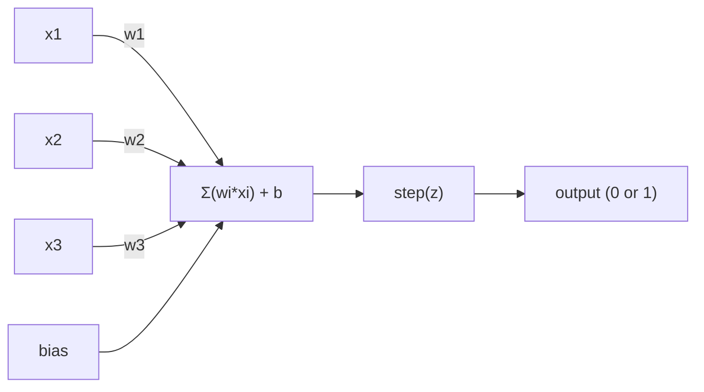
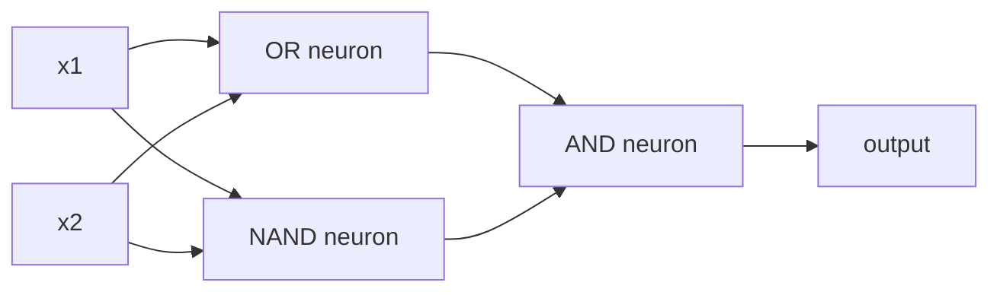

# Perceptron

> Perceptron là nguyên tử của mạng thần kinh. Khi bạn mở nó ra, bạn sẽ thấy trọng lượng, một sự thiên vị, và một quyết định.

**类型：**构建
**语言：**Python
**先修要求：**Giai đoạn 1 ((Linear Algebra 直觉)
**时间：**~ 60 phút

## Học mục tiêu
- Sử dụng Python từ zero thực hiện một Perceptron, bao gồm quy tắc cập nhật trọng lượng và chức năng kích hoạt bước
- 解释为什么单个 Perceptron chỉ có thể giải quyết được các vấn đề phân tách tuyến tính,并演示 XOR trường hợp thất bại
- Thông qua kết hợp OR、NAND 和 AND gate  xây dựng một perceptron đa tầng để giải quyết XOR
- Sử dụng kích hoạt sigmoid và backpropagation  luyện tập một mạng hai tầng, làm cho nó tự động học XOR

## 问题
Bạn đã hiểu được Vector và sản phẩm điểm. Bạn biết Matrix sẽ chuyển các đầu vào thành đầu ra. Nhưng máy thực sự làm thế nào để * học * nên sử dụng chuyển đổi nào?

Perceptron đã trả lời câu hỏi này. Nó là máy học đơn giản nhất: nhận một số đầu vào, nhân trọng lượng, thêm thiên vị, sau đó đưa ra một quyết định nhị phân.

Nghĩ Perceptron, nghĩa là hiểu lên học trong mã hóa  đến cuối là gì: liên tục điều chỉnh số, cho đến khi đầu ra  phù hợp với thực tế 

## 概念
### Một Neuron, một quyết định

Một Perceptron nhận n 个 đầu vào, sẽ mỗi đầu vào nhân bằng một trọng lượng, tìm và tăng thiên vị, sau đó đưa kết quả vào một chức năng kích hoạt.



hàm bước 非常直接: Nếu số lượng cân nặng 加 bias >= 0, thì đầu ra 为 1──否则, đầu ra 为 0──

```
step(z) = 1  if z >= 0
           0  if z < 0
```

Đây là một phân loại tuyến tính. Đánh nặng và thiên vị định nghĩa một đường.

### Biên giới quyết định

Đối với hai đầu vào, Perceptron sẽ được vẽ trong không gian 2D:

```
  x2
  ┤
  │  Class 1        /
  │    (0)          /
  │                /
  │               / w1·x1 + w2·x2 + b = 0
  │              /
  │             /     Class 2
  │            /        (1)
  ┼───────────/──────────── x1
```

线的一侧所有点输出为0――另一侧所有点输出为1―― quá trình đào tạo sẽ di chuyển dòng này, cho đến khi nó có thể chính xác phân chia các lớp này――

### Quy tắc học tập

Quy tắc học tập Perceptron rất đơn giản:

```
For each training example (x, y_true):
    y_pred = predict(x)
    error = y_true - y_pred

    For each weight:
        w_i = w_i + learning_rate * error * x_i
    bias = bias + learning_rate * error
```

Nếu dự đoán đúng, lỗi = 0, điều gì cũng không thay đổi. Nếu dự đoán là 0, nhưng nên là 1, trọng lượng sẽ tăng lên. Nếu dự đoán là 1, nhưng nên là 0, trọng lượng sẽ giảm.

### Vấn đề XOR

问题就出在这里. Xem những cổng logic này:

```
AND gate:           OR gate:            XOR gate:
x1  x2  out         x1  x2  out         x1  x2  out
0   0   0           0   0   0           0   0   0
0   1   0           0   1   1           0   1   1
1   0   0           1   0   1           1   0   1
1   1   1           1   1   1           1   1   0
```

Và 和 OR là phân tách tuyến tính của: bạn có thể vẽ ra một đường,把 0 和 1 分开;; XOR 则不是──没有任何一条直线能把 [0,1] 和 [1,0] 与 [0,0] 和 [1,1] 分开──

```
AND (separable):        XOR (not separable):

  x2                      x2
  1 ┤  0     1            1 ┤  1     0
    │     /                 │
  0 ┤  0 / 0              0 ┤  0     1
    ┼──/──────── x1         ┼──────────── x1
       line works!          no single line works!
```

Đây là một hạn chế cơ bản. Một Perceptron duy nhất có thể giải quyết được các vấn đề phân tách theo đường tuyến. Minsky và Papert đã chứng minh điều này vào năm 1969, và điều này hầu như khiến nghiên cứu về mạng thần kinh bị đình trệ trong một thập kỷ.

Giải pháp: 把 Perceptron 堆叠成层――multi-layer perceptron có thể thông qua hai quyết định tuyến tính 组合成 một quyết định không tuyến tính để giải quyết XOR――


```figure
perceptron-boundary
```

##  xây dựng nó
### 步骤 1:Hạng Perceptron

```python
class Perceptron:
    def __init__(self, n_inputs, learning_rate=0.1):
        self.weights = [0.0] * n_inputs
        self.bias = 0.0
        self.lr = learning_rate

    def predict(self, inputs):
        total = sum(w * x for w, x in zip(self.weights, inputs))
        total += self.bias
        return 1 if total >= 0 else 0

    def train(self, training_data, epochs=100):
        for epoch in range(epochs):
            errors = 0
            for inputs, target in training_data:
                prediction = self.predict(inputs)
                error = target - prediction
                if error != 0:
                    errors += 1
                    for i in range(len(self.weights)):
                        self.weights[i] += self.lr * error * inputs[i]
                    self.bias += self.lr * error
            if errors == 0:
                print(f"Converged at epoch {epoch + 1}")
                return
        print(f"Did not converge after {epochs} epochs")
```

### 步骤 2: Trong logic gate 上训练

```python
and_data = [
    ([0, 0], 0),
    ([0, 1], 0),
    ([1, 0], 0),
    ([1, 1], 1),
]

or_data = [
    ([0, 0], 0),
    ([0, 1], 1),
    ([1, 0], 1),
    ([1, 1], 1),
]

not_data = [
    ([0], 1),
    ([1], 0),
]

print("=== AND Gate ===")
p_and = Perceptron(2)
p_and.train(and_data)
for inputs, _ in and_data:
    print(f"  {inputs} -> {p_and.predict(inputs)}")

print("\n=== OR Gate ===")
p_or = Perceptron(2)
p_or.train(or_data)
for inputs, _ in or_data:
    print(f"  {inputs} -> {p_or.predict(inputs)}")

print("\n=== NOT Gate ===")
p_not = Perceptron(1)
p_not.train(not_data)
for inputs, _ in not_data:
    print(f"  {inputs} -> {p_not.predict(inputs)}")
```

### 步骤 3: quan sát XOR 失败

```python
xor_data = [
    ([0, 0], 0),
    ([0, 1], 1),
    ([1, 0], 1),
    ([1, 1], 0),
]

print("\n=== XOR Gate (single perceptron) ===")
p_xor = Perceptron(2)
p_xor.train(xor_data, epochs=1000)
for inputs, expected in xor_data:
    result = p_xor.predict(inputs)
    status = "OK" if result == expected else "WRONG"
    print(f"  {inputs} -> {result} (expected {expected}) {status}")
```

Nó sẽ không bao giờ hội tụ. Đó là một Perceptron không thể học được chứng cứ cứng của XOR.

### 步骤 4: Sử dụng hai lớp  giải quyết XOR

技巧是:XOR = (x1 OR x2) Và KHÔNG (x1 AND x2)



```python
def xor_network(x1, x2):
    or_neuron = Perceptron(2)
    or_neuron.weights = [1.0, 1.0]
    or_neuron.bias = -0.5

    nand_neuron = Perceptron(2)
    nand_neuron.weights = [-1.0, -1.0]
    nand_neuron.bias = 1.5

    and_neuron = Perceptron(2)
    and_neuron.weights = [1.0, 1.0]
    and_neuron.bias = -1.5

    hidden1 = or_neuron.predict([x1, x2])
    hidden2 = nand_neuron.predict([x1, x2])
    output = and_neuron.predict([hidden1, hidden2])
    return output


print("\n=== XOR Gate (multi-layer network) ===")
for inputs, expected in xor_data:
    result = xor_network(inputs[0], inputs[1])
    print(f"  {inputs} -> {result} (expected {expected})")
```

4 tình huống hoàn toàn đúng. Đặt Perceptron  xếp chồng lên các lớp, bạn có thể tạo ra một Perceptron  không thể tạo ra ranh giới quyết định.

### Bước 5: Tập luyện một mạng hai lớp

Bước 4 手动连接了重量── đây có hiệu quả đối với XOR, nhưng đối với bạn trước đây không biết đúng trọng lượng thực sự vấn đề là không phù hợp── giải pháp:把步函数 替换为 sigmoid,并通过后传自动学习重量──

```python
class TwoLayerNetwork:
    def __init__(self, learning_rate=0.5):
        import random
        random.seed(0)
        self.w_hidden = [[random.uniform(-1, 1), random.uniform(-1, 1)] for _ in range(2)]
        self.b_hidden = [random.uniform(-1, 1), random.uniform(-1, 1)]
        self.w_output = [random.uniform(-1, 1), random.uniform(-1, 1)]
        self.b_output = random.uniform(-1, 1)
        self.lr = learning_rate

    def sigmoid(self, x):
        import math
        x = max(-500, min(500, x))
        return 1.0 / (1.0 + math.exp(-x))

    def forward(self, inputs):
        self.inputs = inputs
        self.hidden_outputs = []
        for i in range(2):
            z = sum(w * x for w, x in zip(self.w_hidden[i], inputs)) + self.b_hidden[i]
            self.hidden_outputs.append(self.sigmoid(z))
        z_out = sum(w * h for w, h in zip(self.w_output, self.hidden_outputs)) + self.b_output
        self.output = self.sigmoid(z_out)
        return self.output

    def train(self, training_data, epochs=10000):
        for epoch in range(epochs):
            total_error = 0
            for inputs, target in training_data:
                output = self.forward(inputs)
                error = target - output
                total_error += error ** 2

                d_output = error * output * (1 - output)

                saved_w_output = self.w_output[:]
                hidden_deltas = []
                for i in range(2):
                    h = self.hidden_outputs[i]
                    hd = d_output * saved_w_output[i] * h * (1 - h)
                    hidden_deltas.append(hd)

                for i in range(2):
                    self.w_output[i] += self.lr * d_output * self.hidden_outputs[i]
                self.b_output += self.lr * d_output

                for i in range(2):
                    for j in range(len(inputs)):
                        self.w_hidden[i][j] += self.lr * hidden_deltas[i] * inputs[j]
                    self.b_hidden[i] += self.lr * hidden_deltas[i]
```

```python
net = TwoLayerNetwork(learning_rate=2.0)
net.train(xor_data, epochs=10000)
for inputs, expected in xor_data:
    result = net.forward(inputs)
    predicted = 1 if result >= 0.5 else 0
    print(f"  {inputs} -> {result:.4f} (rounded: {predicted}, expected {expected})")
```

Nó có hai điểm khác biệt quan trọng với bước 4. Thứ nhất, Sigmoid thay thế chức năng bước, vì nó là đơn giản, vì vậy Gradient tồn tại.`train`方法把错误从输出 Backpropagation到隐藏层,并按每个重量调整它们.

Đây là một đường dẫn của bài học 03`d_output`和 `hidden_deltas`Phương pháp toán học sau đó là quy tắc chuỗi áp dụng cho biểu đồ mạng trên. Chúng ta sẽ chính thức đưa ra nó.

## Sử dụng nó
Bạn chỉ mới xây dựng từ zero, tất cả đều tồn tại trong một nhập khẩu:

```python
from sklearn.linear_model import Perceptron as SkPerceptron
import numpy as np

X = np.array([[0,0],[0,1],[1,0],[1,1]])
y = np.array([0, 0, 0, 1])

clf = SkPerceptron(max_iter=100, tol=1e-3)
clf.fit(X, y)
print([clf.predict([x])[0] for x in X])
```

5行. 30行 của anh.`Perceptron`lớp làm cùng một điều. Sklearn  phiên bản tăng kiểm tra hội tụ, nhiều loại chức năng mất mát, cũng như hỗ trợ đầu vào ít, nhưng vòng tròn cốt lõi hoàn toàn giống nhau: trọng lượng tổng cộng, chức năng bước, trong lỗi lên nâng cấp trọng lượng.

Sự khác biệt thực sự sẽ xuất hiện trên quy mô.

- chức năng bước sẽ trở thành sigmoid ≠ ReLU hoặc hoạt động bình thường khác
- trọng lượng 会通过 backpropagation 自动学习(Dạy 03)
- Lớp sẽ trở nên sâu hơn: 3 ̊10 ̊100+ lớp
- Cùng một nguyên tắc vẫn còn tồn tại: mỗi tầng đều tạo ra các tính năng mới trong các sản phẩm của tầng trước

Chỉ có một Perceptron có thể vẽ thẳng.

## 交付 nó
本课会产出:
- `outputs/skill-perceptron.md`- Một kỹ năng, giải thích khi nào cần một tầng và đa tầng kiến trúc

## 练习
1. Trong cửa NAND, bất kỳ mạch logic nào đều có thể được xây dựng bởi NAND.
2. 修改 Perceptron class, make it in each epoch 跟踪 quyết định giới hạn(w1*x1 + w2*x2 + b = 0) 』印在 AND gate 训练期间这条线如何移动──
3. 构建一个3输入 Perceptron: chỉ có 3输入中至少2个为1时才输出 1(多数投票函数) ―― nó có thể tách ra theo tuyến tính?为什么?

## 关键术语
| Term | What people say | What it actually means |
|------|----------------|----------------------|
| Perceptron | “一个假的 neuron” | 一个 linear classifier：inputs 与 weights 的 dot product，加上 bias，再通过 step function |
| Weight | “一个 input 有多重要” | 一个 multiplier，用来缩放每个 input 对 decision 的贡献 |
| Bias | “threshold” | 一个 constant，用来平移 decision boundary，让 Perceptron 即使在 inputs 为零时也能触发 |
| Activation function | “压缩数值的东西” | 一个在 weighted sum 之后应用的 function：Perceptron 使用 step function，现代 networks 使用 sigmoid/ReLU |
| Linearly separable | “你能在它们之间画一条线” | 一个 dataset，其中单个 hyperplane 可以完美分离 classes |
| XOR problem | “Perceptron 做不到的那件事” | single-layer networks 无法学习 non-linearly-separable functions 的证明 |
| Decision boundary | “classifier 发生切换的位置” | 将 input space 分成两个 classes 的 hyperplane w*x + b = 0 |
| Multi-layer perceptron | “一个真正的 Neural Network” | 按 layers 堆叠的 Perceptron，其中每一层的 output 会输入到下一层 |

## 延伸阅读
- Frank Rosenblatt, The Perceptron: A Probabilistic Model for Information Storage and Organization in the Brain(1958) -- 开创这一切的原始论文
- Minsky & Papert, Perceptrons(1969) -- cuốn sách này chứng minh XOR không thể giải quyết được bởi mạng lưới đơn lớp, và khiến nghiên cứu Perceptron bị đình trệ trong một thập kỷ
- Michael Nielsen, Nền mạng thần kinh và học tập sâu, Chương 1http://neuralnetworksanddeeplearning.com/）--免费在线资源, là lời giải thích rõ ràng nhất về cách tạo ra mạng Perceptron
