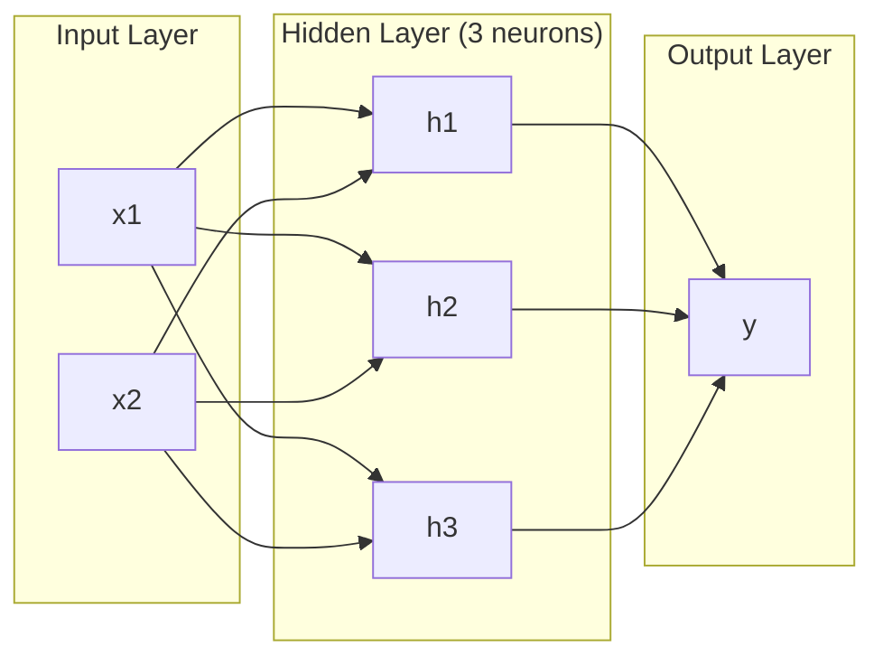
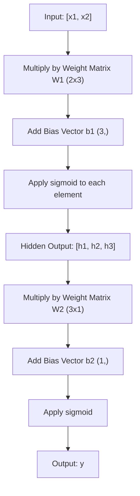
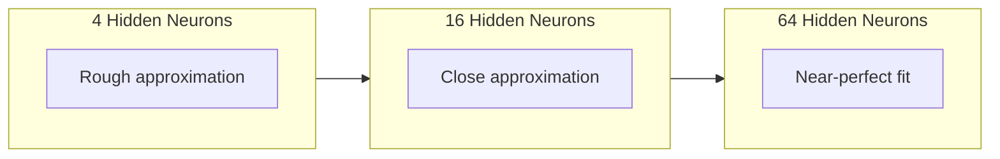

# Mạng đa tầng với Forward Pass

> Một thần kinh vẽ ra một đường... đặt chúng lên, bạn có thể vẽ ra bất cứ thứ gì.

**Type:** 构建
**Languages:** Python
**Prerequisites:** Phase 01（Math Foundations），Lesson 03.01（The Perceptron）
**Time:** 约 90 分钟

## Học mục tiêu

- Sử dụng lớp Layer 和 Network từ zero xây dựng một mạng đa tầng, hoàn thành hoàn chỉnh Forward pass
-  Tracking network Matrix trong mỗi tầng 维度,并识别 hình dạng không phù hợp
- 解释 堆叠非线性激活 如何让网络学习 曲的决策边界
- Sử dụng 2-2-1 架构和手工调好的 sigmoid 权重解决 XOR 问题

## 问题

单个神经就是一个画线器――仅此而已――它 chỉ có thể vẽ ra một đường thẳng trong dữ liệu của bạn―― AI trong mỗi vấn đề thực tế - 图像识别,语言理解,下围棋 - 都需要曲线――把神经堆叠成层,就是获得曲线的方法――

Năm 1969, Minsky và Papert chứng minh rằng giới hạn này là chết người: mạng đơn không thể học XOR。 không rất khó học − thay vì là toán học làm không đến。XOR thực chất định giá đặt [0,1] và [1,0] ở một bên, đặt [0,0] và [1,1] ở bên kia。 không có một đường thẳng có thể phân chia chúng。

Điều này khiến cho việc hỗ trợ mạng thần kinh bị đình trệ trong hơn 10 năm. Trong khi đó, phương pháp sửa chữa rất rõ ràng: không chỉ sử dụng một lớp.

Đây là một mạng đa tầng. Nó là nền tảng của mỗi mô hình học sâu trong môi trường sản xuất ngày nay.

## 概念

### 层:输入,隐藏,输出

Một mạng đa tầng có ba loại:

**输入层**-  nghiêm túc nói không phải là một tầng. Nó lưu trữ dữ liệu nguyên thủy.

**Hidden layer**- 工作发生的地方──每个神经元接收上层的每个输出,应用权重和一个偏差,然后把结果传入激活函数──称为隐藏, bởi vì bạn sẽ không nhìn thấy trực tiếp những giá trị này trong dữ liệu đào tạo──

**输出层**-- 最终答案──对于二分类,使用一个带 sigmoid 的神经元──对于可能类,每个类一个神经元──



Đây là một mạng 2-3-1. Hai đầu vào, ba tế bào thần kinh ẩn, một đầu ra. Mỗi kết nối đều mang một trọng lượng.

Mỗi tầng sẽ tạo ra một nhóm các vector có cấu thành số, được gọi là trạng thái ẩn. Đối với văn bản, trạng thái ẩn sẽ tăng kích thước.

### Tâm thần kinh với hoạt động

Mỗi bộ não làm ba điều:

1. Mỗi đầu vào sẽ được nhân hóa với trọng lượng đối tác
2. sẽ tất cả nhân số tìm kiếm và并 cộng với một thiên vị
3. 将这个和传入 kích hoạt hàm

Bây giờ, kích hoạt hàm là sigmoid:

```
sigmoid(z) = 1 / (1 + e^(-z))
```

Sigmoid sẽ làm cho bất kỳ số số nào bị nén xuống (0, 1) 范围内. n nhập chính lớn hơn sẽ đẩy vào 1 n nhập âm lớn hơn sẽ đẩy vào 0 n nhập vào 0,5 n.

### Forward Pass: dữ liệu làm thế nào để lưu động

Forward pass sẽ đưa dữ liệu nhập từng tầng qua mạng, cho đến khi đạt đến output.



Trong mỗi tầng, ba hoạt động sẽ xảy ra theo thứ tự:

```
z = W * input + b       (linear transformation)
a = sigmoid(z)           (activation)
```

Một tầng của sự nhập cảnh trở thành một tầng dưới. Đó là toàn bộ bước đi đi.

### Matrix 维度

追踪维度 là kỹ năng điều tra quan trọng nhất trong Deep Learning.

| Step | Operation | Dimensions | Result Shape |
|------|-----------|------------|-------------|
| 输入 | x | -- | (2,) |
| Hidden 线性部分 | W1 * x + b1 | W1: (3, 2), b1: (3,) | (3,) |
| Hidden 激活 | sigmoid(z1) | -- | (3,) |
| 输出线性部分 | W2 * h + b2 | W2: (1, 3), b2: (1,) | (1,) |
| 输出激活 | sigmoid(z2) | -- | (1,) |

Quy tắc: 第 k 层的权重矩阵 W 的形状是 (neurons_in_layer_k, neurons_in_layer_k_minus_1)。行对应应应应上一层。列对应应应上一层。如果形对不上,你就有bug。

### Định lý thuyết tiếp cận phổ quát

Năm 1989, George Cybenko chứng minh một điều phi thường: một mạng Neural có một lớp ẩn duy nhất và đủ các hệ thống thần kinh, có thể gần với bất kỳ hàm liên tục nào với độ chính xác mà bạn mong muốn.

Điều này không có nghĩa là một lớp ẩn 总是最佳选择―― nó có nghĩa là cấu trúc này có khả năng về mặt lý thuyết―― trong thực tế, mạng lưới sâu hơn (more layer, per layer, fewer neurons) có thể sử dụng ít hơn so với mạng lưới rộng và浅.

直觉是:mỗi dây thần kinh trong lớp ẩn học một 凸起或特征──只要有足够的凸起,并将它们放在正确位置,就能接近任意平曲线── mỗi dây thần kinh càng nhiều,凸起越多,接近越好──



### 可组合性

Mạng thần kinh là hợp nhất. Bạn có thể lắp ráp chúng, liên kết chúng, và vận hành chúng. Mô hình thì thầm sử dụng một mạng mã hóa xử lý âm thanh, và sử dụng một mạng mã hóa độc lập.


```figure
mlp-forward
```

##  xây dựng nó

纯Python──不使用numpy──每个矩阵操作都从零编写──

### 步骤 1: Sigmoid 激活

```python
import math

def sigmoid(x):
    x = max(-500.0, min(500.0, x))
    return 1.0 / (1.0 + math.exp(-x))
```

Đặt giá trị clamp lên đến [-500, 500] để ngăn chặn tràn.`math.exp(500)`n lớn nhưng vẫn hạn chế.`math.exp(1000)`Không có gì hết.

### 步骤 2: lớp lớp

Tất cả các hoạt động quan trọng nhất trong học sâu là Matrix 乘法──每一层、每次注意头──每次前进通过-- 底层都是matmul──一个线性层 接收一个输入向量,将它乘以权重矩阵,并加上偏差向量:y = Wx + b──这个单一程占据90%的计算量 在神经网络中──

Một lớp lưu một khối lượng trọng lượng Matrix và một phương thức bias Vector.

```python
class Layer:
    def __init__(self, n_inputs, n_neurons, weights=None, biases=None):
        if weights is not None:
            self.weights = weights
        else:
            import random
            self.weights = [
                [random.uniform(-1, 1) for _ in range(n_inputs)]
                for _ in range(n_neurons)
            ]
        if biases is not None:
            self.biases = biases
        else:
            self.biases = [0.0] * n_neurons

    def forward(self, inputs):
        self.last_input = inputs
        self.last_output = []
        for neuron_idx in range(len(self.weights)):
            z = sum(
                w * x for w, x in zip(self.weights[neuron_idx], inputs)
            )
            z += self.biases[neuron_idx]
            self.last_output.append(sigmoid(z))
        return self.last_output
```

Hình dạng của khối lượng tử liệu là (n_neurons, n_inputs) ―― mỗi đường là một thần kinh xuyên suốt tất cả các输入 của khối lượng―― phương pháp tiến 遍历神经,计算加权和加偏差,应用 sigmoid,并收集结果――

### 步骤 3: Tầng lớp mạng

Một mạng là danh sách các tầng. Một đường đi trước sẽ kết nối chúng: các tầng thứ nhất xuất nhập vào tầng thứ nhất k+1.

```python
class Network:
    def __init__(self, layers):
        self.layers = layers

    def forward(self, inputs):
        current = inputs
        for layer in self.layers:
            current = layer.forward(current)
        return current
```

Đó là toàn bộ bước đi tiến. Dữ liệu vào, chảy qua từng tầng, từ bên kia ra.

### 步骤 4: Sử dụng quyền lực xô XOR

Trong bài học 01 , chúng tôi thông qua kết hợp OR、NAND 和 AND perceptron  giải quyết XOR。 bây giờ sử dụng lớp Layer 和 Network của chúng tôi làm điều tương tự。2-2-1 架构: hai input、 hai hidden neuron、 một output。

```python
hidden = Layer(
    n_inputs=2,
    n_neurons=2,
    weights=[[20.0, 20.0], [-20.0, -20.0]],
    biases=[-10.0, 30.0],
)

output = Layer(
    n_inputs=2,
    n_neurons=1,
    weights=[[20.0, 20.0]],
    biases=[-30.0],
)

xor_net = Network([hidden, output])

xor_data = [
    ([0, 0], 0),
    ([0, 1], 1),
    ([1, 0], 1),
    ([1, 1], 0),
]

for inputs, expected in xor_data:
    result = xor_net.forward(inputs)
    predicted = 1 if result[0] >= 0.5 else 0
    print(f"  {inputs} -> {result[0]:.6f} (rounded: {predicted}, expected: {expected})")
```

较大的权重(20, -20) để biểu hiện sigmoid biểu hiện như hàm阶跃。 thứ nhất là một tế bào thần kinh ẩn gần giống OR。 thứ hai là gần giống NAND。输出神经元把它们组合成 AND,也就是 XOR。

### 步骤 5: 圆形分类

Một vấn đề khó hơn: phân loại điểm 2D được định hướng ở trung tâm điểm gốc, bán kính là 0,5 vòng trong hoặc bên ngoài vòng.

```python
import random
import math

random.seed(42)

data = []
for _ in range(200):
    x = random.uniform(-1, 1)
    y = random.uniform(-1, 1)
    label = 1 if (x * x + y * y) < 0.25 else 0
    data.append(([x, y], label))

circle_net = Network([
    Layer(n_inputs=2, n_neurons=8),
    Layer(n_inputs=8, n_neurons=1),
])
```

Sử dụng bất cứ khi nào, hiệu quả phân loại mạng sẽ không tốt đẹp. Nhưng chuyển tiếp  vẫn sẽ chạy. Đó là trọng điểm.

```python
correct = 0
for inputs, expected in data:
    result = circle_net.forward(inputs)
    predicted = 1 if result[0] >= 0.5 else 0
    if predicted == expected:
        correct += 1

print(f"Accuracy with random weights: {correct}/{len(data)} ({100*correct/len(data):.1f}%)")
```

Khi có nhiều trọng lượng hơn, nó sẽ có tỷ lệ xác định thấp hơn - thường thậm chí còn hơn so với dự đoán đa số các loại khác nhau.

## Sử dụng nó

PyTorch dùng 4 dòng mã để hoàn thành tất cả nội dung trên:

```python
import torch
import torch.nn as nn

model = nn.Sequential(
    nn.Linear(2, 8),
    nn.Sigmoid(),
    nn.Linear(8, 1),
    nn.Sigmoid(),
)

x = torch.tensor([[0.0, 0.0], [0.0, 1.0], [1.0, 0.0], [1.0, 1.0]])
output = model(x)
print(output)
```

`nn.Linear(2, 8)`Đó là lớp lớp của bạn: hình 为 (8, 2) của trọng lượng Matrix, hình 为 (8,) của phương hướng Vector.`nn.Sigmoid()`là hàm sigmoid của bạn, từng phần tử ứng dụng.`nn.Sequential`là lớp mạng của bạn: theo thứ tự串联各层──

Sự khác biệt nằm ở tốc độ và quy mô. PyTorch hoạt động trên GPU, xử lý hàng triệu mẫu, và tự động tính toán được sử dụng để Phân tích Phân tích.

## 交付 nó

Bài học này đã tạo ra một lời nhắc có thể lặp lại, được sử dụng để thiết kế cấu trúc mạng:

- `outputs/prompt-network-architect.md`

Khi bạn cần quyết định cho một vấn đề cụ thể sử dụng bao nhiêu tầng, bao nhiêu tầng thần kinh, và sử dụng các chức năng kích hoạt, bạn có thể sử dụng nó.

## 练习

1. 构建一个 2-4-2-1 网络(两个隐藏层), và sử dụng XOR 数据上随机权重运行 前进通行──打印中间隐藏层的输出,观察表示在每个层如何变变──

2. 将圆形分类器中的隐藏层 大小从8 改为2,再改为32──每次都使用随机权重运行 前进通过──隐藏的神经元的数量是否会改变输出范围或分布?为什么?

3. Trong lớp mạng 上 thực hiện một `count_parameters`Phương pháp, trả lại tổng số trọng lượng và thiên vị có thể đào tạo.

4. Để một 3-4-4-2 网络构建 Forward pass. 进入 RGB 颜值.

5. Sử dụng một hàm leaky step thay thế sigmoid: Nếu z < 0, thì trả lại 0.01 * z, nếu không trả lại 1.0。 sử dụng cùng một thủ công trong Step 4, trên XOR trên vận hành Forward pass。 nó vẫn còn hiệu quả?

## 关键术语

| Term | 人们会怎么说 | 它实际意味着什么 |
|------|----------------|----------------------|
| Forward pass | “运行模型” | 将输入推过每一层 -- 乘以权重、加上 bias、激活 -- 以产生输出 |
| Hidden layer | “中间部分” | 输入和输出之间的任意层，其值不会在数据中被直接观察到 |
| Multi-layer network | “一个深的 Neural Network” | 按顺序堆叠的神经元层，其中每一层的输出会输入到下一层 |
| Activation function | “非线性” | 在线性变换之后应用的函数，用来把曲线引入决策边界 |
| Sigmoid | “S 曲线” | sigma(z) = 1/(1+e^(-z))，将任意实数压缩到 (0,1)，平滑且处处可微 |
| Weight matrix | “参数” | 一个 shape 为 (current_layer_neurons, previous_layer_neurons) 的 Matrix W，包含可学习的连接强度 |
| Bias vector | “偏移量” | 在 Matrix 乘法之后添加的 Vector，使神经元即使在所有输入为零时也能激活 |
| Universal approximation | “Neural Network 可以学习任何东西” | 一个拥有足够多神经元的单 hidden layer 可以逼近任意连续函数 -- 但“足够多”可能意味着数十亿 |
| Linear transformation | “Matrix 乘法步骤” | z = W * x + b，激活前的计算，将输入映射到一个新空间 |
| Decision boundary | “分类器切换的地方” | 输入空间中的一个曲面，网络输出在这里跨过分类阈值 |

## 延伸阅读

- Michael Nielsen, "Nền mạng thần kinh và học tập sâu", Chương 1-2 (http://neuralnetworksanddeeplearning.com/) -- 关于 Forward pass 和网络结构最清晰的免费解释,包含交互式可视化
- Cybenko, "Thiến gần bằng các siêu định của một hàm Sigmoidal" (1989) -- ban đầu của thuyết gần gũi phổ quát 论文,出乎意料地易读
- 3Blue1Brown, "Nhưng mạng thần kinh là gì?"https://www.youtube.com/watch?v=aircAruvnKk) -- 20 phút khả quan giải thích tầng, trọng lượng và vượt qua, giúp xây dựng mô hình tâm trí chính xác
- Goodfellow, Bengio, Courville, "Dân học sâu sắc", Chương 6 (https://www.deeplearningbook.org/) -- nhiều tầng mạng của tiêu chuẩn tham khảo, miễn phí đọc trực tuyến
