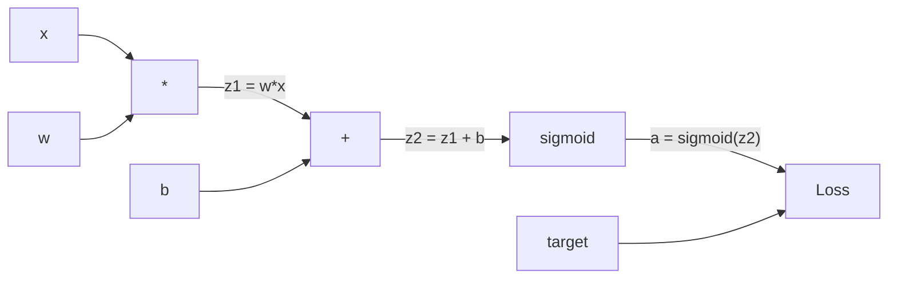
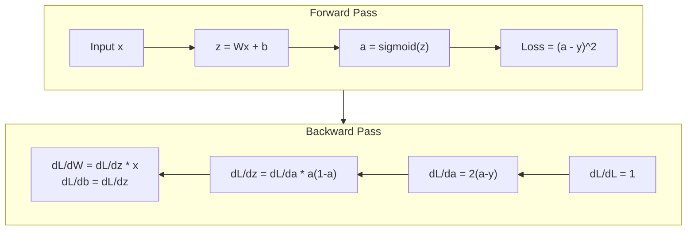
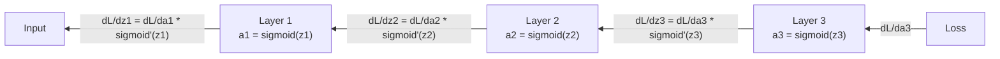

# Từ zero thực hiện Backpropagation

> Phân tích ngược là làm cho việc học trở thành một thuật toán có thể. Không có nó, mạng thần kinh chỉ là một máy tạo số tự động đắt tiền.

**Type:** Build
**Languages:** Python
**Prerequisites:** Lesson 03.02 (Multi-Layer Networks)
**Time:** ~120 minutes

## Học mục tiêu
- Thực hiện một động cơ tự cấp dựa trên giá trị, nó sẽ xây dựng đồ thị tính toán, và thông qua phân loại topological tính toán Gradient
- Sử dụng quy tắc chuỗi 推导 bổ sung, nhân và sigmoid của Backward Pass
- Chỉ sử dụng bạn từ không thực hiện động cơ Backpropagation, trong XOR và phân loại vòng tròn 上 tập một mạng đa tầng
- 识别深层sigmoid network 中的消失梯度 问题,并解释为什么 Gradient 会指数级缩小

## 问题
Bạn có một lớp ẩn trong mạng, chứa 768 đầu vào và 3072 đầu ra. Đó là 2.359.296 trọng lượng. Nó đã làm một dự đoán sai lầm.

Cách đơn giản là: lấy một trọng lượng, làm cho nó nhẹ nhàng một điểm, chạy lại một lần nữa Forward Pass, đo Loss là tăng hay giảm. Nó sẽ cung cấp cho trọng lượng này Gradient.

Backpropagation  đã giải quyết vấn đề này. Một lần Forward Pass, một lần Backward Pass, tất cả các Gradient đều được tính toán.

## 概念
### Quy tắc chuỗi, áp dụng cho mạng lên

Bạn đang trong giai đoạn 01, Bài học 05 中见过链条规则──快速回顾: Nếu y = f(g(x)), thì dy/dx = f'(g(x)) * g'(x)── Bạn đi dọc theo chuỗi条相乘 phái sinh──

Trong mạng thần kinh, 链条 là chuỗi hoạt động từ đầu vào đến Loss. Mỗi cấp độ áp dụng trọng lượng, tăng chuyển vị trí, tái thông qua kích hoạt.

### Hình đồ tính toán

Mỗi lần Forward Pass thành phố sẽ xây dựng một biểu đồ. Mỗi nút là một hoạt động.



Forward Pass: value From left to right流动──x 和 w 产生 z1 = w*x──加上 b 得到 z2──Sigmoid 给出激活 a──使用 Loss Function 将 a 与目标 y 比较──

Trở lại:Thời gian từ bên phải sang bên trái流动。 từ dL/da 开始。 Loss 如何随激活 改变)。乘以 da/dz2✔sigmoid derivative)。得到 dL/dz2。拆分成 dL/db(它等于 dL/dz2,因为 z2 = z1 + b) 和 dL/dz1。然后 dL/dw = dL/dz1 * x,dL/dx = dL/dz1 * w。

Trong suốt thời gian Trượt ngược, mỗi nút trong biểu đồ chỉ có một nhiệm vụ: nhận từ Gradient trên, nhân bằng dẫn xuất địa phương của nó, rồi chuyển tiếp xuống.

### Lên trước và ngược lại



Forward Pass 会存储 mỗi giá trị trung gian:z、a、 mỗi tầng đầu vào. Backward Pass 需要这些已存储的值 来计算 Gradient.

### Gradient trong mạng trong dòng chảy

Đối với một mạng lưới 3 tầng, Gradient sẽ được nối qua mỗi tầng:



Trong mỗi tầng, Gradient đã được nhân bằng phái sinh sigmoid.

### Các gradient biến mất

Đây là vấn đề về độ sụp đổ. Các lớp sigmoid sẽ làm giảm lượng sản xuất lên 0 và 1 之间. Các phái sinh của nó sẽ luôn nhỏ hơn 0.25 ⋅ đống đủ lớp sigmoid.

```
sigmoid(z):     Output range [0, 1]
sigmoid'(z):    Max value 0.25 (at z = 0)

After 5 layers:   gradient * 0.25^5 = 0.001x original
After 10 layers:  gradient * 0.25^10 = 0.000001x original
```

Đó là lý do tại sao mạng sigmoid sâu  hầu như không thể đào tạo  sửa chữa phương pháp - ReLU  và các biến thể của nó - là bài học 04  chủ đề.

### 推导 2 Layer Network 的 Gradient

Dưới đây là một ví dụ cụ thể về toán học: mạng có đầu vào x 带 sigmoid lớp ẩn 带 sigmoid lớp đầu ra, cũng như MSE Loss 👍

Nhận chuyển:
```
z1 = W1 * x + b1
a1 = sigmoid(z1)
z2 = W2 * a1 + b2
a2 = sigmoid(z2)
L = (a2 - y)^2
```

Backward Pass (trước từ):
```
dL/da2 = 2(a2 - y)
da2/dz2 = a2 * (1 - a2)
dL/dz2 = dL/da2 * da2/dz2 = 2(a2 - y) * a2 * (1 - a2)

dL/dW2 = dL/dz2 * a1
dL/db2 = dL/dz2

dL/da1 = dL/dz2 * W2
da1/dz1 = a1 * (1 - a1)
dL/dz1 = dL/da1 * da1/dz1

dL/dW1 = dL/dz1 * x
dL/db1 = dL/dz1
```

Mỗi gradient đều là các biến số địa phương được theo dõi từ Loss 往回 乘积. Đó là toàn bộ sự lây lan ngược.


```figure
backprop-vanishing
```

##  xây dựng nó
### 步骤 1: Value Node

Mỗi số trong tính toán của chúng ta sẽ trở thành một giá trị. Nó lưu trữ dữ liệu của riêng nó, Gradient, cũng như nó được tạo ra như thế nào.

```python
class Value:
    def __init__(self, data, children=(), op=''):
        self.data = data
        self.grad = 0.0
        self._backward = lambda: None
        self._children = set(children)
        self._op = op

    def __repr__(self):
        return f"Value(data={self.data:.4f}, grad={self.grad:.4f})"
```

Không còn Gradient ((0.0)。 Không còn chức năng ngược ((no-op)。`_children`会跟随产生这个值的其他值, sau đó chúng ta có thể làm cho biểu đồ loại topological.

### 步骤 2: 带 Hành động ngược

Mỗi hoạt động sẽ tạo ra một giá trị mới, và xác định mức độ 如何反向流经它.

```python
def __add__(self, other):
    other = other if isinstance(other, Value) else Value(other)
    out = Value(self.data + other.data, (self, other), '+')

    def _backward():
        self.grad += out.grad
        other.grad += out.grad

    out._backward = _backward
    return out

def __mul__(self, other):
    other = other if isinstance(other, Value) else Value(other)
    out = Value(self.data * other.data, (self, other), '*')

    def _backward():
        self.grad += other.data * out.grad
        other.grad += self.data * out.grad

    out._backward = _backward
    return out
```

Đối với việc bổ sung: d(a+b) /da = 1,d(a+b) /db = 1。 do đó hai đầu vào sẽ trực tiếp nhận được đầu ra của Gradient。

Đối với nhân: d(a*b) /da = b,d(a*b) /db = a。 mỗi đầu vào sẽ nhận được giá trị đầu vào khác 乘以 đầu ra Gradient。

`+=`Một giá trị có thể được nhiều hoạt động sử dụng.

### 步骤 3: Sigmoid và Loss

```python
import math

def sigmoid(self):
    x = self.data
    x = max(-500, min(500, x))
    s = 1.0 / (1.0 + math.exp(-x))
    out = Value(s, (self,), 'sigmoid')

    def _backward():
        self.grad += (s * (1 - s)) * out.grad

    out._backward = _backward
    return out
```

Tiến hóa Sigmoid:sigmoid(x) * (1 - sigmoid(x))。 我们在 Forward Pass 中已计算了 sigmoid(x) = s。复用它──不需要额外工作──

```python
def mse_loss(predicted, target):
    diff = predicted + Value(-target)
    return diff * diff
```

单个输出的 MSE:(预测 - target) ^2。 我们把减算表达为加上一个取负的值──

### 步骤 4: Hướng về phía sau

Loại topological  đảm bảo chúng ta theo đúng thứ tự xử lý node - 某 node của Gradient 会在通过它继续传播之前被完全累积──

```python
def backward(self):
    topo = []
    visited = set()

    def build_topo(v):
        if v not in visited:
            visited.add(v)
            for child in v._children:
                build_topo(child)
            topo.append(v)

    build_topo(self)
    self.grad = 1.0
    for v in reversed(topo):
        v._backward()
```

Từ Loss  bắt đầu(Gradient = 1.0, vì dL/dL = 1)。 dọc theo biểu đồ thứ tự hậu 反向遍历──每个节点的`_backward`Sẽ đưa Gradient cho con cái nó.

### 步骤 5: Lớp và mạng

```python
import random

class Neuron:
    def __init__(self, n_inputs):
        scale = (2.0 / n_inputs) ** 0.5
        self.weights = [Value(random.uniform(-scale, scale)) for _ in range(n_inputs)]
        self.bias = Value(0.0)

    def __call__(self, x):
        act = sum((wi * xi for wi, xi in zip(self.weights, x)), self.bias)
        return act.sigmoid()

    def parameters(self):
        return self.weights + [self.bias]


class Layer:
    def __init__(self, n_inputs, n_outputs):
        self.neurons = [Neuron(n_inputs) for _ in range(n_outputs)]

    def __call__(self, x):
        out = [n(x) for n in self.neurons]
        return out[0] if len(out) == 1 else out

    def parameters(self):
        params = []
        for n in self.neurons:
            params.extend(n.parameters())
        return params


class Network:
    def __init__(self, sizes):
        self.layers = []
        for i in range(len(sizes) - 1):
            self.layers.append(Layer(sizes[i], sizes[i + 1]))

    def __call__(self, x):
        for layer in self.layers:
            x = layer(x)
            if not isinstance(x, list):
                x = [x]
        return x[0] if len(x) == 1 else x

    def parameters(self):
        params = []
        for layer in self.layers:
            params.extend(layer.parameters())
        return params

    def zero_grad(self):
        for p in self.parameters():
            p.grad = 0.0
```

Một Neuron  nhận đầu vào, tính toán tổng số trọng lượng + thiên vị, sau đó áp dụng sigmoid。权重初始化按平方(2/n_inputs) 缩缩, để ngăn chặn sự bão hòa của sigmoid trong mạng sâu hơn。 một Layer là danh sách của Neuron。 một Network là danh sách của Layer。`parameters()`Phương pháp sẽ thu thập tất cả các giá trị có thể học được, để chúng ta có thể cập nhật chúng.

### Bước 6: Trong XOR 上 tập luyện

```python
random.seed(42)
net = Network([2, 4, 1])

xor_data = [
    ([0.0, 0.0], 0.0),
    ([0.0, 1.0], 1.0),
    ([1.0, 0.0], 1.0),
    ([1.0, 1.0], 0.0),
]

learning_rate = 1.0

for epoch in range(1000):
    total_loss = Value(0.0)
    for inputs, target in xor_data:
        x = [Value(i) for i in inputs]
        pred = net(x)
        loss = mse_loss(pred, target)
        total_loss = total_loss + loss

    net.zero_grad()
    total_loss.backward()

    for p in net.parameters():
        p.data -= learning_rate * p.grad

    if epoch % 100 == 0:
        print(f"Epoch {epoch:4d} | Loss: {total_loss.data:.6f}")

print("\nXOR Results:")
for inputs, target in xor_data:
    x = [Value(i) for i in inputs]
    pred = net(x)
    print(f"  {inputs} -> {pred.data:.4f} (expected {target})")
```

观察 Loss 下降── Từ dự đoán随机 đến đầu ra XOR chính xác, hoàn toàn do Backpropagation 计算 Gradient 并向正确方向微调权重来驱动──

### 步骤 7: Định dạng vòng tròn

Trong bài học 02 , bạn để phân loại vòng xoay 手动调过权重──现在让网络自学它们──

```python
random.seed(7)

def generate_circle_data(n=100):
    data = []
    for _ in range(n):
        x1 = random.uniform(-1.5, 1.5)
        x2 = random.uniform(-1.5, 1.5)
        label = 1.0 if x1 * x1 + x2 * x2 < 1.0 else 0.0
        data.append(([x1, x2], label))
    return data

circle_data = generate_circle_data(80)

circle_net = Network([2, 8, 1])
learning_rate = 0.5

for epoch in range(2000):
    random.shuffle(circle_data)
    total_loss_val = 0.0
    for inputs, target in circle_data:
        x = [Value(i) for i in inputs]
        pred = circle_net(x)
        loss = mse_loss(pred, target)
        circle_net.zero_grad()
        loss.backward()
        for p in circle_net.parameters():
            p.data -= learning_rate * p.grad
        total_loss_val += loss.data

    if epoch % 200 == 0:
        correct = 0
        for inputs, target in circle_data:
            x = [Value(i) for i in inputs]
            pred = circle_net(x)
            predicted_class = 1.0 if pred.data > 0.5 else 0.0
            if predicted_class == target:
                correct += 1
        accuracy = correct / len(circle_data) * 100
        print(f"Epoch {epoch:4d} | Loss: {total_loss_val:.4f} | Accuracy: {accuracy:.1f}%")
```

Ở đây chúng tôi sử dụng SGD trực tuyến - mỗi mẫu  sau đó chúng tôi cập nhật trọng lượng, thay vì tích lũy toàn bộ lô.

Không có động cơ điều chỉnh. Mạng sẽ tự tìm ra ranh giới quyết định hình tròn. Đó là sức mạnh của Backpropagation: bạn định nghĩa kiến trúc.

## Sử dụng nó
PyTorch sử dụng vài dòng mã để hoàn thành tất cả các công việc trên.

```python
import torch
import torch.nn as nn

model = nn.Sequential(
    nn.Linear(2, 4),
    nn.Sigmoid(),
    nn.Linear(4, 1),
    nn.Sigmoid(),
)
optimizer = torch.optim.SGD(model.parameters(), lr=1.0)
criterion = nn.MSELoss()

X = torch.tensor([[0,0],[0,1],[1,0],[1,1]], dtype=torch.float32)
y = torch.tensor([[0],[1],[1],[0]], dtype=torch.float32)

for epoch in range(1000):
    pred = model(X)
    loss = criterion(pred, y)
    optimizer.zero_grad()
    loss.backward()
    optimizer.step()

print("PyTorch XOR Results:")
with torch.no_grad():
    for i in range(4):
        pred = model(X[i])
        print(f"  {X[i].tolist()} -> {pred.item():.4f} (expected {y[i].item()})")
```

`loss.backward()`Đó là của anh.`total_loss.backward()``optimizer.step()`Đó là những gì anh viết tay.`p.data -= lr * p.grad``optimizer.zero_grad()`Đó là của anh.`net.zero_grad()` Cùng một thuật toán, cấp công nghiệp thực hiện. PyTorch chịu trách nhiệm về tăng tốc GPU, độ chính xác hỗn hợp, kiểm tra độ phân, cũng như hàng trăm loại lớp.

训练会运行 Forward Pass,然后运行 Backward Pass,再更新权重――Inference chỉ运行 Forward Pass──没有 Gradient,没有更新──这个区别很重要,因为推断才是生产环境发生的事情──当你调用Claude或GPT这样的API时,你运行的是推断――你的提示向前流经网络,Token从另一端输出──没有权重发生变──理解 Backpropagation 很重要,因为它塑造了网络中的每一个权重──

## 交付 nó
本课会产出:
- `outputs/prompt-gradient-debugger.md`-- một lời nhắc lặp lại, để chẩn đoán bất kỳ vấn đề cấp độ nào trong mạng thần kinh

## 练习
1. 给值类 添加一个 `__sub__`phương pháp(a - b = a + (-1 * b))。 rồi thực hiện một `__neg__`Phương pháp: Bằng cách so sánh với biểu hiện đơn giản như (a - b) ^ 2)

2. 给 giá trị 添加一个 `relu`phương pháp(output 为 max(0, x), dẫn xuất trong x > 0 时为 1,否则为 0) ・・・ trong lớp ẩn sử dụng relu 替换 sigmoid,并再次在 XOR 上训练──比较收速度──你应该会看到训练更快――这是课04的预告──

3. Trong giá trị trên để thực hiện một sử dụng các quyền nguyên số của `__pow__`Phương pháp... dùng nó.`mse_loss`替换 thành thực sự `(predicted - target) ** 2`√ √ √ √ √ √ √ √ √ √ √ √ √ √ √ √ √ √ √ √ √ √ √ √ √ √ √ √ √ √ √ √ √ √ √ √ √ √ √ √ √ √ √ √ √ √ √ √ √ √ √ √ √ √ √ √ √ √ √ √ √ √ √ √ √ √ √ √ √ √ √ √ √ √ √ √ √ √ √ √ √ √ √ √ √ √ √ √ √ √ √ √ √ √ √ √ √ √ √ √ √ √ √ √ √ √ √ √ √ √ √ √ √ √ √ √ √ √ √ √ √ √ √ √ √ √ √ √ √ √ √ √ √ √ √ √ √ √ √ √ √ √ √ √ √ √ √ √ √ √ √ √ √ √ √ √ √ √ √ √ √ √ √ √ √ √ √ √ √ √ √ √ √ √ √ √ √ √ √ √ √ √ √ √ √ √ √ √ √ √ √ √ √ √ √ √ √ √ √ √ √ √ √ √ √ √ √ √ √ √ √ √ √ √ √ √ √ √ √ √ √ √ √ √ √ √ √ √ √ √ √ √ √ √ √ √ √ √ √ √ √ √ √ √ √ √ √ √ √ √ √ √ √ √ √

4. 给训练循环 添加梯度剪切:调用 `backward()`Sau đó, hãy đưa tất cả các clip Gradient đến [-1, 1]── đào tạo một mạng lưới sâu hơn(4+ lớp với sigmoid),并比较有无剪的损失曲线──这是你对抗爆炸梯度的第一道防线──

5.  xây dựng một hình ảnh:                                                                                                                                                                                                                                                           

## 关键术语
| Term | What people say | What it actually means |
|------|----------------|----------------------|
| Backpropagation | “Network 学会了” | 一种算法，通过沿 Computational Graph 反向应用 chain rule，为每个权重计算 dL/dw |
| Computational graph | “Network 结构” | 一个有向无环 graph，其中 node 是 operation，edge 承载 value（forward）和 Gradient（backward） |
| Chain rule | “把 derivative 相乘” | 如果 y = f(g(x))，那么 dy/dx = f'(g(x)) * g'(x) -- Backpropagation 的数学基础 |
| Gradient | “最陡上升方向” | Loss 相对于某个 parameter 的 partial derivative -- 告诉你如何改变该 parameter 来降低 Loss |
| Vanishing gradient | “深层 network 学不会” | 当 Gradient 通过带有 sigmoid 这类 saturating activation 的 layer 传播时，会指数级缩小 |
| Forward pass | “运行 network” | 通过顺序应用每一层的 operation，从 input 计算 output，并存储 intermediate value |
| Backward pass | “计算 Gradient” | 反向遍历 Computational Graph，在每个 node 使用 chain rule 累积 Gradient |
| Learning rate | “学习速度” | 一个控制权重更新步长的 scalar：w_new = w_old - lr * gradient |
| Topological sort | “正确顺序” | 一种 graph node 排序方式，使每个 node 都出现在其依赖的所有 node 之后 -- 确保 Gradient 在传播前已完全累积 |
| Autograd | “自动微分” | 一个在 forward computation 期间构建 Computational Graph，并自动计算 Gradient 的系统 -- PyTorch 的 engine 做的就是这个 |

## 延伸阅读
- Rumelhart, Hinton & Williams, "Giáo dục đại diện bằng lỗi truyền tải trở lại" (1986) -- 这篇论文让 Backpropagation 成为主流,并解锁了多层网络培训
- 3Blue1Brown, loạt "Nền mạng thần kinh" (https://www.youtube.com/playlist?list=PLZHQObOWTQDNU6R1_67000Dx_ZCJB-3pi) --  về sự phát triển trở lại và cách giải thích tốt nhất về cách truyền thông mạng lưới
