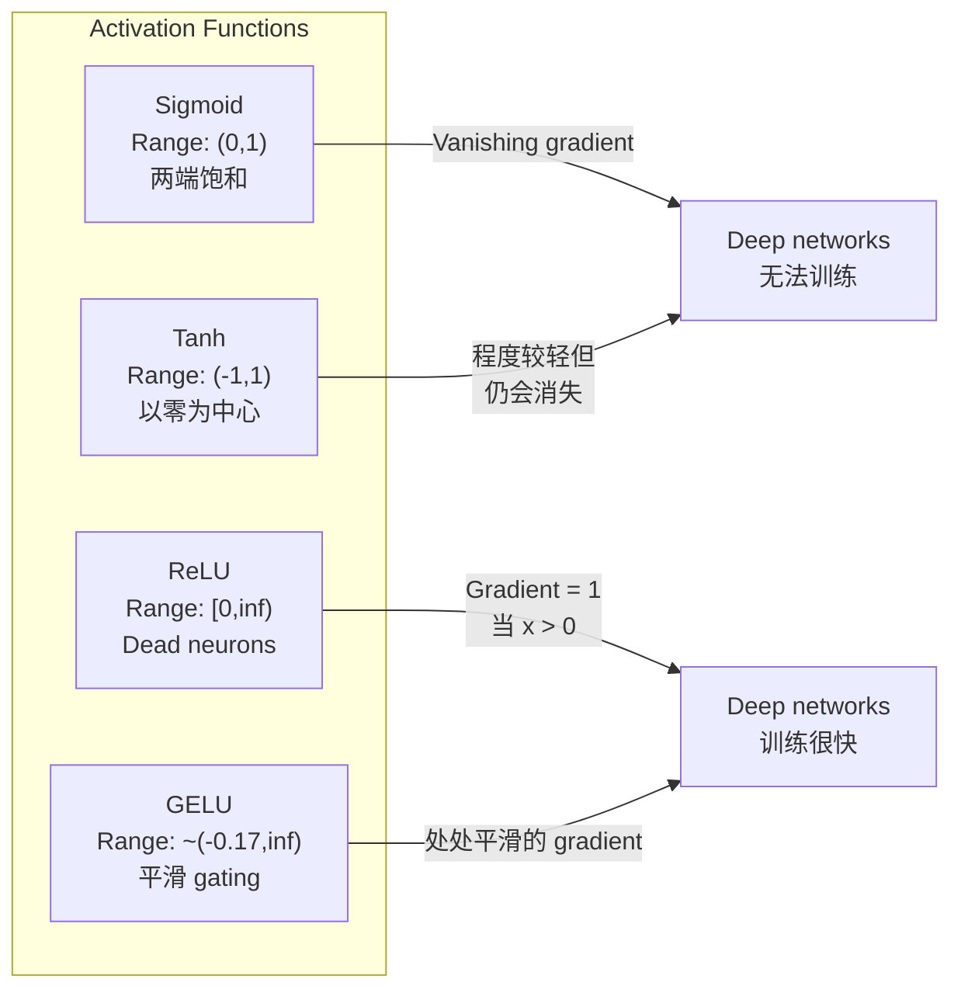
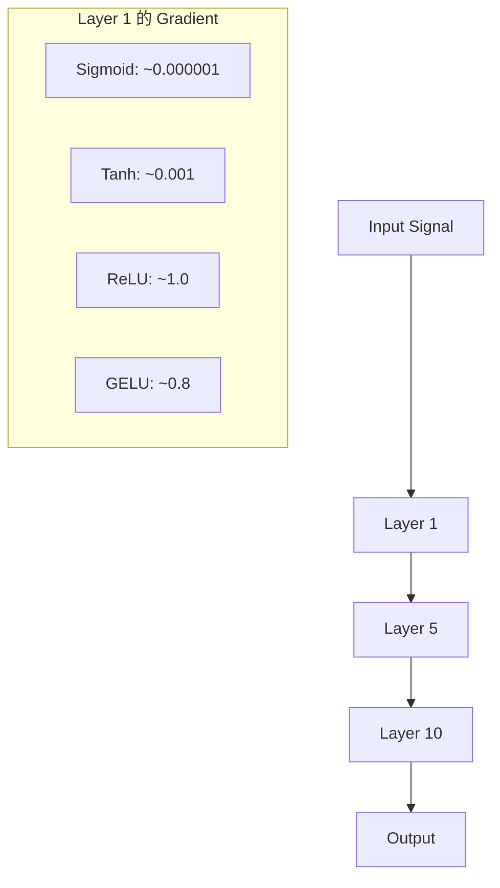
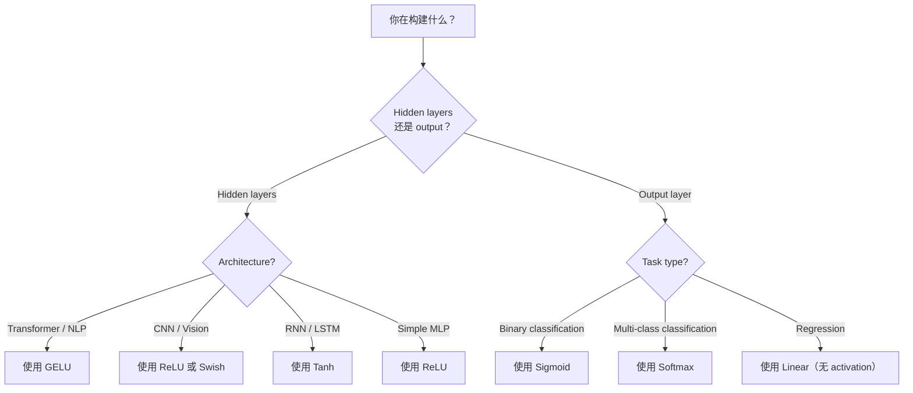

# 激活函数

> Không có tính không dây, mạng 100 tầng của bạn chỉ là một lần nhân tử hình tinh tế.

**Type:** Build
**Languages:** Python
**Prerequisites:** Lesson 03.03 (Backpropagation)
**Time:** ~75 分钟

## Học mục tiêu

- Từ zero thực hiện sigmoid、tanh、ReLU、Leaky ReLU、GELU、Swish 和 softmax  và các phái sinh của nó
- Thông qua đo lường các kích hoạt khác nhau trong 10 + 层 trong kích hoạt cường độ, chẩn đoán biến mất vấn đề gradient
- 检测 ReLU mạng trung tâm của các tế bào thần kinh chết,并 giải thích tại sao GELU 能避免这种失败模式
- Để xác định kiến trúc (transformer,CNN,RNN,output layer) chọn đúng chức năng kích hoạt

## 问题

堆叠两个线性变化:y = W2(W1x + b1) + b2。展开它:y = W2W1x + W2b1 + b2。这只是 y = Ax + c một sự biến đổi线性单一――无论你堆叠多少线性层,结果都会缩成一次矩阵乘倍――你的100层网络与单层具有相同表示能力──

Đây không phải là một trò chơi lý thuyết. Nó có nghĩa là mạng tuyến tính sâu 字面上无法学习XOR,无法分类螺旋数据集,无法识别人脸.

Các chức năng kích hoạt 打破线性── chúng thông qua chức năng không tuyến tính 扭曲每层的输出,让网络 能够曲决策界限、近似任意函数,并真正学习── nhưng nếu chọn lỗi kích hoạt, các gradient của bạn sẽ biến mất đến zero (sigmoid trong các mạng sâu) 爆炸到无穷大 (không có sự khởi động thận trọng)  không có kích hoạt không giới hạn), hoặc các tế bào thần kinh của bạn sẽ chết vĩnh viễn (带有较大的负面偏差)  Sự lựa chọn của chức năng kích hoạt trực tiếp quyết định mạng của bạn là có thể học──

## 概念

### Tại sao không dây là cần thiết

Sự nhân đếm của matrix là có thể được kết hợp. Trước tiên sử dụng Matrix A nhân một vector, sau đó sử dụng Matrix B nhân kết quả, bằng giá trực tiếp nhân AB. Điều này có nghĩa là tích tụ mười lớp tuyến tính, trong toán học, bằng giá trị của một lớp tuyến tính của một Matrix lớn. Tất cả các tham số này, tất cả những chiều sâu này đều bị lãng phí. Bạn cần một cái gì đó để phá vỡ chuỗi này. Đó là tác dụng của các hàm kích hoạt.

下面是证明── một lớp tuyến tính 计算 f(x) = Wx + b──堆叠两个:

```
Layer 1: h = W1 * x + b1
Layer 2: y = W2 * h + b2
```

代入:

```
y = W2 * (W1 * x + b1) + b2
y = (W2 * W1) * x + (W2 * b1 + b2)
y = A * x + c
```

Một层──在层之间插入 không tuyến tính kích hoạt g():

```
h = g(W1 * x + b1)
y = W2 * h + b2
```

现在代入被打破了──W2 * g(W1 * x + b1) + b2 不能再简化为单线性转换──网络可以表示非线性函数──每增加一层带激活的层,都会增加表示能力──

### Sigmoid

Tạng thần kinh hoạt động sớm nhất.

```
sigmoid(x) = 1 / (1 + e^(-x))
```

输出范围:(0, 1)。平滑、可微, sẽ được hiển thị bất kỳ số thực nào đến giá trị tương tự như xác suất.

dẫn xuất:

```
sigmoid'(x) = sigmoid(x) * (1 - sigmoid(x))
```

Giá trị tối đa của phái sinh này là 0.25, xuất hiện x = 0。 Trong sự lan rộng ngược, các gradient 会逐层相乘──十层 sigmoid có nghĩa là gradient 最多会被 0.25 连续乘十次:

```
0.25^10 = 0.000000953674
```

Không đến hàng triệu tín hiệu ban đầu. Đây là vấn đề độ tần dần. Các độ tần giữa các lớp ban đầu trở nên rất nhỏ, trọng lượng gần như không được cải thiện.

另一个问题:sigmoid 输出始终为正(0到 1), nghĩa là trọng lượng trên các gradient 总是同号―― điều này sẽ dẫn đến sự trượt xuống gradient trong quá trình xuất hiện của hình chữ rung.

### Tanh

sigmoid 的居中版本──

```
tanh(x) = (e^x - e^(-x)) / (e^x + e^(-x))
```

输出范围:(-1, 1)──以零为中心, có thể loại bỏ

dẫn xuất:

```
tanh'(x) = 1 - tanh(x)^2
```

Các dẫn xuất lớn nhất trong x = 0 时为 1.0比sigmoid 好四倍――但消失梯梯问题 仍然存在―― đối với rất lớn nhập正或负输, dẫn xuất 会趋近零――十层仍然会压碎梯梯,只是没有那么激烈――

### Đột phá

Phân tích Định hướng Đường thẳng. Nair 和 Hinton vào năm 2010 sẽ đưa nó vào học sâu.

```
relu(x) = max(0, x)
```

输出范围:[0, vô hạn) ・ dẫn xuất 非常简单:

```
relu'(x) = 1  if x > 0
            0  if x <= 0
```

Đối với chính input, không có gradient biến mất. gradient chính là 1, sẽ trực tiếp truyền qua. Đó là lý do vì sao các mạng sâu trở nên có thể đào tạo.

Nhưng nó có một chế độ thất bại: vấn đề thần kinh chết. Nếu một số thần kinh được tích lũy được 始终为负 (do sự thiên vị tiêu cực lớn hơn hoặc khởi đầu trọng lượng không may), đầu ra của nó sẽ mãi mãi là không, cấp độ sẽ mãi mãi là không, vì vậy sẽ không bao giờ được cập nhật.

### ReLU bị rò rỉ

Các tế bào thần kinh chết là cách đơn giản nhất để sửa chữa.

```
leaky_relu(x) = x        if x > 0
                alpha * x if x <= 0
```

Trong số đó alpha là một số thường nhỏ, thường là 0.01──nửa trục tiêu có một độ nghiêng nhỏ thay vì 0, do đó, các tế bào thần kinh chết vẫn có thể nhận được tín hiệu gradient,并 có cơ hội phục hồi──

### GELU:现代默认选择

Gaussian Error Linear Unit── do Hendrycks 和 Gimpel đưa ra vào năm 2016──是BERT、GPT以及大多数现代变压器中的默认激活──

```
gelu(x) = x * Phi(x)
```

Trong đó Phi(x) là chức năng phân phối tích lũy của phân bố bình thường tiêu chuẩn:

```
gelu(x) ~= 0.5 * x * (1 + tanh(sqrt(2/pi) * (x + 0.044715 * x^3)))
```

GELU ở vị trí thanh toán, cho phép giá trị âm thấp hơn (((không giống như ReLU 那样硬截断为零), và có một cách giải thích có thể xảy ra: nó dựa trên mỗi đầu vào trong phân bố Gaussian 下为正的可能性对其加权──

### Swish / SiLU

bởi Ramachandran et al. Trong năm 2017 thông qua tìm kiếm tự động phát hiện hoạt động tự khóa.

```
swish(x) = x * sigmoid(x)
```

Swish hình thức là x * sigmoid(x)。Google 通过在激活功能空间上进行自动搜索 发现它一个神经网络在设计神经网络的一部分──

Như GELU, nó平滑、非单调,并允许较小的负值──差异很微妙:Swish sử dụng sigmoid 作为门,而 GELU sử dụng Gaussian CDF──实践中,性能几乎相同──Swish sử dụng EfficientNet 和一些视觉模型──GELU则主导语言模型──

### Softmax:输出 Tích hoạt

Không được sử dụng cho các lớp ẩn. Softmax sẽ lấy điểm số thô (logits) của vector chuyển thành phân phối xác suất.

```
softmax(x_i) = e^(x_i) / sum(e^(x_j) for all j)
```

Mỗi đầu ra đều nằm giữa 0 đến 1 ∼ tất cả các đầu ra và là 1 ∼. Điều này làm cho nó trở thành kích hoạt cuối cùng tiêu chuẩn của phân loại đa lớp. Logit lớn nhất sẽ có được xác suất cao nhất, nhưng không giống với argmax, softmax là rất nhỏ, và giữ lại thông tin tương đối đáng tin cậy.

### hình dạng đối với



### Phòng chảy theo cấp đối với



### 什么时候使用什么类型激活



## 动手构建

### 步骤 1: thực hiện tất cả các chức năng kích hoạt  và các phái sinh

Mỗi hàm nhận một float rồi quay lại một float. Mỗi hàm phái sinh nhận cùng một输入并 quay lại gradient.

```python
import math

def sigmoid(x):
    x = max(-500, min(500, x))
    return 1.0 / (1.0 + math.exp(-x))

def sigmoid_derivative(x):
    s = sigmoid(x)
    return s * (1 - s)

def tanh_act(x):
    return math.tanh(x)

def tanh_derivative(x):
    t = math.tanh(x)
    return 1 - t * t

def relu(x):
    return max(0.0, x)

def relu_derivative(x):
    return 1.0 if x > 0 else 0.0

def leaky_relu(x, alpha=0.01):
    return x if x > 0 else alpha * x

def leaky_relu_derivative(x, alpha=0.01):
    return 1.0 if x > 0 else alpha

def gelu(x):
    return 0.5 * x * (1 + math.tanh(math.sqrt(2 / math.pi) * (x + 0.044715 * x ** 3)))

def gelu_derivative(x):
    phi = 0.5 * (1 + math.erf(x / math.sqrt(2)))
    pdf = math.exp(-0.5 * x * x) / math.sqrt(2 * math.pi)
    return phi + x * pdf

def swish(x):
    return x * sigmoid(x)

def swish_derivative(x):
    s = sigmoid(x)
    return s + x * s * (1 - s)

def softmax(xs):
    max_x = max(xs)
    exps = [math.exp(x - max_x) for x in xs]
    total = sum(exps)
    return [e / total for e in exps]
```

### Bước 2: Khả năng nhìn thấy các cấp độ ở đâu chết

Trong từ -5 đến 5 của 100 个 trung bình间隔点 trên tính toán gradient── in một histogram văn bản, hiển thị gradient của mỗi hoạt động ở đâu gần 0.──

```python
def gradient_scan(name, derivative_fn, start=-5, end=5, n=100):
    step = (end - start) / n
    near_zero = 0
    healthy = 0
    for i in range(n):
        x = start + i * step
        g = derivative_fn(x)
        if abs(g) < 0.01:
            near_zero += 1
        else:
            healthy += 1
    pct_dead = near_zero / n * 100
    print(f"{name:15s}: {healthy:3d} healthy, {near_zero:3d} near-zero ({pct_dead:.0f}% dead zone)")

gradient_scan("Sigmoid", sigmoid_derivative)
gradient_scan("Tanh", tanh_derivative)
gradient_scan("ReLU", relu_derivative)
gradient_scan("Leaky ReLU", leaky_relu_derivative)
gradient_scan("GELU", gelu_derivative)
gradient_scan("Swish", swish_derivative)
```

### 步骤 3: Trình độ biến mất 实验

Sử dụng sigmoid với ReLU, để một tín hiệu qua N 层 tiến-trước.

```python
import random

def vanishing_gradient_experiment(activation_fn, name, n_layers=10, n_inputs=5):
    random.seed(42)
    values = [random.gauss(0, 1) for _ in range(n_inputs)]

    print(f"\n{name} through {n_layers} layers:")
    for layer in range(n_layers):
        weights = [random.gauss(0, 1) for _ in range(n_inputs)]
        z = sum(w * v for w, v in zip(weights, values))
        activated = activation_fn(z)
        magnitude = abs(activated)
        bar = "#" * int(magnitude * 20)
        print(f"  Layer {layer+1:2d}: magnitude = {magnitude:.6f} {bar}")
        values = [activated] * n_inputs

vanishing_gradient_experiment(sigmoid, "Sigmoid")
vanishing_gradient_experiment(relu, "ReLU")
vanishing_gradient_experiment(gelu, "GELU")
```

### 步骤 4: Neuron chết 检测器

Tạo ra một mạng ReLU, truyền vào các đầu vào ngẫu nhiên, tính số lượng tế bào thần kinh chưa hoạt động.

```python
def dead_neuron_detector(n_inputs=5, hidden_size=20, n_samples=1000):
    random.seed(0)
    weights = [[random.gauss(0, 1) for _ in range(n_inputs)] for _ in range(hidden_size)]
    biases = [random.gauss(0, 1) for _ in range(hidden_size)]

    fire_counts = [0] * hidden_size

    for _ in range(n_samples):
        inputs = [random.gauss(0, 1) for _ in range(n_inputs)]
        for neuron_idx in range(hidden_size):
            z = sum(w * x for w, x in zip(weights[neuron_idx], inputs)) + biases[neuron_idx]
            if relu(z) > 0:
                fire_counts[neuron_idx] += 1

    dead = sum(1 for c in fire_counts if c == 0)
    rarely_fire = sum(1 for c in fire_counts if 0 < c < n_samples * 0.05)
    healthy = hidden_size - dead - rarely_fire

    print(f"\nDead Neuron Report ({hidden_size} neurons, {n_samples} samples):")
    print(f"  Dead (never fired):     {dead}")
    print(f"  Barely alive (<5%):     {rarely_fire}")
    print(f"  Healthy:                {healthy}")
    print(f"  Dead neuron rate:       {dead/hidden_size*100:.1f}%")

    for i, c in enumerate(fire_counts):
        status = "DEAD" if c == 0 else "WEAK" if c < n_samples * 0.05 else "OK"
        bar = "#" * (c * 40 // n_samples)
        print(f"  Neuron {i:2d}: {c:4d}/{n_samples} fires [{status:4s}] {bar}")

dead_neuron_detector()
```

### 步骤 5: tập luyện đối với Sigmoid vs ReLU vs GELU

Trong tập dữ liệu vòng tròn (圆内点 = lớp 1,圆外 = lớp 0) trên, sử dụng ba loại kích hoạt khác nhau 训练同一个双层网络──比较收速度──

```python
def make_circle_data(n=200, seed=42):
    random.seed(seed)
    data = []
    for _ in range(n):
        x = random.uniform(-2, 2)
        y = random.uniform(-2, 2)
        label = 1.0 if x * x + y * y < 1.5 else 0.0
        data.append(([x, y], label))
    return data


class ActivationNetwork:
    def __init__(self, activation_fn, activation_deriv, hidden_size=8, lr=0.1):
        random.seed(0)
        self.act = activation_fn
        self.act_d = activation_deriv
        self.lr = lr
        self.hidden_size = hidden_size

        self.w1 = [[random.gauss(0, 0.5) for _ in range(2)] for _ in range(hidden_size)]
        self.b1 = [0.0] * hidden_size
        self.w2 = [random.gauss(0, 0.5) for _ in range(hidden_size)]
        self.b2 = 0.0

    def forward(self, x):
        self.x = x
        self.z1 = []
        self.h = []
        for i in range(self.hidden_size):
            z = self.w1[i][0] * x[0] + self.w1[i][1] * x[1] + self.b1[i]
            self.z1.append(z)
            self.h.append(self.act(z))

        self.z2 = sum(self.w2[i] * self.h[i] for i in range(self.hidden_size)) + self.b2
        self.out = sigmoid(self.z2)
        return self.out

    def backward(self, target):
        error = self.out - target
        d_out = error * self.out * (1 - self.out)

        for i in range(self.hidden_size):
            d_h = d_out * self.w2[i] * self.act_d(self.z1[i])
            self.w2[i] -= self.lr * d_out * self.h[i]
            for j in range(2):
                self.w1[i][j] -= self.lr * d_h * self.x[j]
            self.b1[i] -= self.lr * d_h
        self.b2 -= self.lr * d_out

    def train(self, data, epochs=200):
        losses = []
        for epoch in range(epochs):
            total_loss = 0
            correct = 0
            for x, y in data:
                pred = self.forward(x)
                self.backward(y)
                total_loss += (pred - y) ** 2
                if (pred >= 0.5) == (y >= 0.5):
                    correct += 1
            avg_loss = total_loss / len(data)
            accuracy = correct / len(data) * 100
            losses.append(avg_loss)
            if epoch % 50 == 0 or epoch == epochs - 1:
                print(f"    Epoch {epoch:3d}: loss={avg_loss:.4f}, accuracy={accuracy:.1f}%")
        return losses


data = make_circle_data()

configs = [
    ("Sigmoid", sigmoid, sigmoid_derivative),
    ("ReLU", relu, relu_derivative),
    ("GELU", gelu, gelu_derivative),
]

results = {}
for name, act_fn, act_d_fn in configs:
    print(f"\n=== Training with {name} ===")
    net = ActivationNetwork(act_fn, act_d_fn, hidden_size=8, lr=0.1)
    losses = net.train(data, epochs=200)
    results[name] = losses

print("\n=== Final Loss Comparison ===")
for name, losses in results.items():
    print(f"  {name:10s}: start={losses[0]:.4f} -> end={losses[-1]:.4f} (improvement: {(1 - losses[-1]/losses[0])*100:.1f}%)")
```


```figure
softmax-temperature
```

## Sử dụng nó

PyTorch cùng lúc cung cấp tất cả các chức năng này dưới hai dạng:

```python
import torch
import torch.nn as nn
import torch.nn.functional as F

x = torch.randn(4, 10)

relu_out = F.relu(x)
gelu_out = F.gelu(x)
sigmoid_out = torch.sigmoid(x)
swish_out = F.silu(x)

logits = torch.randn(4, 5)
probs = F.softmax(logits, dim=1)

model = nn.Sequential(
    nn.Linear(10, 64),
    nn.GELU(),
    nn.Linear(64, 32),
    nn.GELU(),
    nn.Linear(32, 5),
)
```

Transformer Trung tâm các lớp ẩn:GELU。CNN Trung tâm các lớp ẩn:ReLU。 phân loại lớp đầu ra:softmax。regression output layer:无(linear)。概率 output layer:sigmoid。就是这样。先从这些默认值开始──只有你有证据时才改变它们──

RNNs và LSTMs đối với trạng thái ẩn sử dụng tanh, đối với cổng sử dụng sigmoid, nhưng nếu bạn ngày nay xây dựng từ không, bạn có thể sẽ không sử dụng RNNs. Nếu các tế bào thần kinh trong mạng ReLU của bạn đang chết, chuyển đổi sang GELU. Đừng chọn theo tay Leaky ReLU, trừ khi bạn có lý do rõ ràng.

## 交付成果

本课会产出:
- `outputs/prompt-activation-selector.md` Một lời nhắc lặp lại, giúp bạn cho bất kỳ kiến trúc nào  chọn đúng chức năng kích hoạt

## 练习

1. 实现 Parametric ReLU (PReLU), trong đó độ nghiêng âm alpha là một tham số có thể học được.

2. Chuyện biến mất từ 10 tầng biến thành 50 tầng vận hành. Chụp hình ảnh của sigmoid, tanh, ReLU và GELU ở mỗi tầng.

3. 实现 ELU (Exponential Linear Unit):elu(x) = x nếu x > 0, alpha * (e^x - 1) nếu x <= 0── trên cùng một mạng 上将其死神经元率与 ReLU对比──

4. Xây dựng một màn hình chăm sóc sức khỏe , trong thời gian tập luyện: mỗi thời đại  tính toán độ lớn độ tần trung bình của mỗi tầng , trong bất kỳ lớp nào  thấp hơn 0,001 hoặc vượt quá 100 , in cảnh báo 

5.  sửa đổi bài tập đối với, sử dụng tập dữ liệu XOR trong Bài học 01 thay vì vòng tròn.

## 关键术语

| Term | 人们怎么说 | 它实际是什么意思 |
|------|----------------|----------------------|
| Activation function | “非线性部分” | 应用于每个 neuron 输出的函数，用于打破线性，使 network 能够学习 nonlinear mappings |
| Vanishing gradient | “Gradients 在 deep networks 中消失” | 当 activation 的 derivative 小于 1 时，gradients 会通过 layers 指数级缩小，使早期 layers 无法训练 |
| Exploding gradient | “Gradients 爆炸” | 当有效乘数超过 1 时，gradients 会通过 layers 指数级增长，导致训练不稳定 |
| Dead neuron | “停止学习的 neuron” | 输入永久为负的 ReLU neuron，会产生零输出和零 gradient |
| Sigmoid | “把值压缩到 0-1” | logistic function 1/(1+e^-x)，历史上很重要，但会在 deep networks 中导致 vanishing gradients |
| ReLU | “把负数裁剪为零” | max(0, x)——通过保留 gradient magnitude 让 deep learning 变得实用的 activation |
| GELU | “transformer activation” | Gaussian Error Linear Unit，一种平滑 activation，会根据输入为正的概率对输入加权 |
| Swish/SiLU | “Self-gated ReLU” | x * sigmoid(x)，通过 automated search 发现，用于 EfficientNet |
| Softmax | “把分数变成概率” | 将 logits 的 Vector 归一化为 probability distribution，其中所有值都在 (0,1) 内且总和为 1 |
| Leaky ReLU | “不会死亡的 ReLU” | max(alpha*x, x)，其中 alpha 很小（0.01），通过允许较小的 negative gradients 来防止 dead neurons |
| Saturation | “sigmoid 的平坦部分” | activation 的 derivative 趋近于零的区域，会阻断 gradient flow |
| Logit | “softmax 之前的原始分数” | 应用 softmax 或 sigmoid 之前，final layer 的未归一化输出 |

## 延伸阅读

- Nair & Hinton, "Các đơn vị tuyến tính sửa chữa cải thiện các máy Boltzmann hạn chế" (2010) 介绍 ReLU 并促成深度网络 训练的论文
- Hendrycks & Gimpel, "Gaussian Error Linear Units (GELUs) " (2016)  đề xuất sau đó trở thành các biến thể 默认选择的激活函数
- Ramachandran et al., "Sẽ tìm các chức năng kích hoạt" (2017) sử dụng tìm kiếm tự động 发现 Swish,展示 kích hoạt 设计可以自动化
- Glorot & Bengio, "Hiểu được sự khó khăn của việc đào tạo các mạng lưới thần kinh cấp dữ liệu sâu" (2010)  Chẩn đoán biến mất/bùng nổ gradient 并提出 Xavier khởi tạo của bài luận
- Goodfellow, Bengio, Courville, "Dân học sâu" Chương 6.3 (https://www.deeplearningbook.org/) về các đơn vị ẩn và các chức năng kích hoạt
