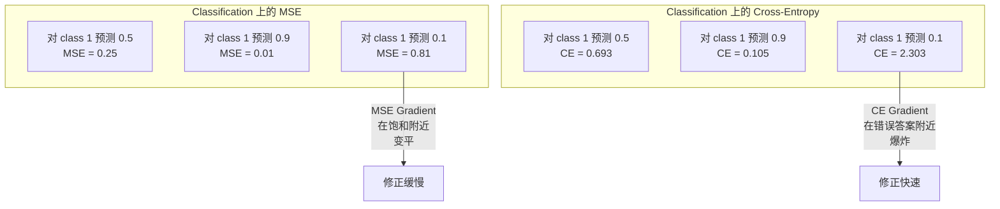
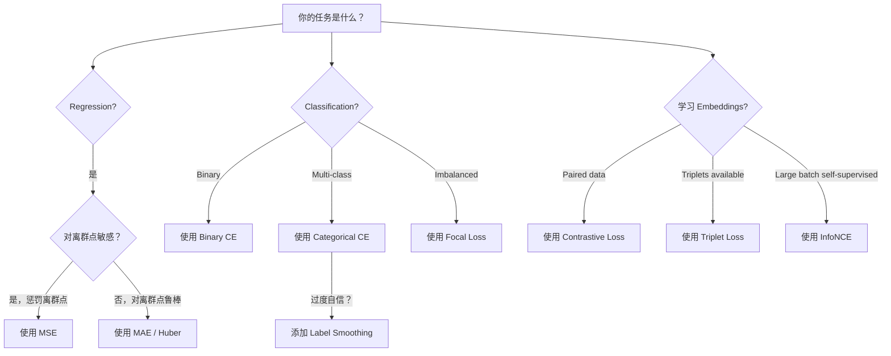
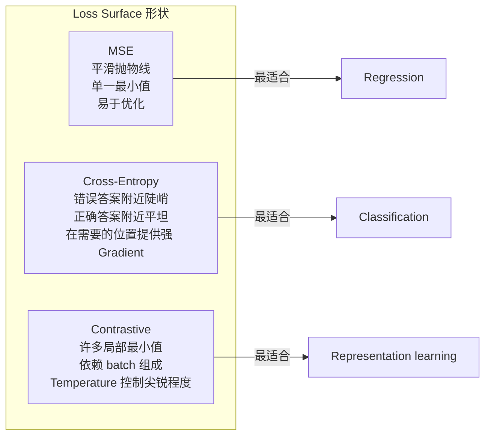

# Các chức năng mất mát

> Mạng thần kinh của bạn làm một dự đoán. Sự thật cơ bản cho ra một câu trả lời khác nhau.

**Type:** Build
**Languages:** Python
**Prerequisites:** Lesson 03.04 (Activation Functions)
**Time:** ~75 minutes

## Học mục tiêu

- Từ zero thực hiện MSE, phân tử chéo entropy, phân loại chéo entropy và mất mát tương phản (InfoNCE), cũng như các gradient của chúng
- Thông qua mô tả, MSE không phù hợp với phân loại
- sẽ nhãn làm mượt mà 应用于 chéo entropy,并 mô tả nó làm thế nào để ngăn ngừa quá tự tin dự đoán
- Để trở lại, phân loại nhị phân, phân loại đa lớp và tích hợp học tập nhiệm vụ chọn đúng hàm mất

## 问题

Trong vấn đề phân loại  mô hình MSE tối thiểu hóa, sẽ rất tự tin với tất cả mọi thứ dự đoán 0.5── nó thực sự tối thiểu hóa Loss── nhưng nó cũng hoàn toàn không sử dụng──

Loss Function là đối tượng duy nhất của mô hình thực sự tối ưu hóa. Không phải chính xác. Không phải điểm số F1. cũng không phải bất kỳ thước đo nào của quản lý. Optimizer sẽ lấy Gradient của Loss Function, và điều chỉnh quyền trọng lượng để làm cho con số này biến nhỏ. Nếu Loss Function không nắm bắt được điều bạn thực sự quan tâm, mô hình sẽ tìm ra cách ít nhất về toán học để đáp ứng nó, nhưng cách đó hầu như không bao giờ là bạn muốn.

Ở đây có một ví dụ cụ thể. Bạn có một phân loại nhị phân 任务. hai loại, 50/50 分布. Bạn sử dụng MSE  như một dự đoán thua lỗ. Mô hình cho mỗi đầu vào đều dự đoán thua lỗ 0.5. MSE trung bình là 0.25, đây là giá trị tối thiểu có thể đạt được trong trường hợp bất cứ điều gì bạn chưa học được. Mô hình này không có bất kỳ khả năng phân biệt nào, nhưng từ kỹ thuật nói rằng nó đã giảm thiểu hàm mất mát của bạn. Sau khi thay đổi thành entropy chéo, mô hình tương tự sẽ bị buộc phải đưa dự đoán về 0 hoặc 1, bởi vì - (log0.5) = 0.693 là một lỗ rất tồi, trong khi -log(0.99) = 0.01 sẽ giúp bạn tự tin và xác nhận đúng.

Trong việc học tự giám sát, bạn thậm chí không có nhãn hiệu. Khá lỗ tương phản hoàn toàn xác định được tín hiệu học tập: những gì tương tự, những gì khác nhau, và mô hình nên sử dụng nhiều để phân biệt chúng. Khá lỗ tương phản đã viết sai lầm, các nhúng của bạn sẽ bị thu hẹp xuống một điểm - mỗi đầu vào đều được chiếu vào cùng một vector.

## 概念

### Phản ứng thông tin thông tin thông tin thông tin

Sự chọn lọc ngẫu nhiên của sự lùi.

```
MSE = (1/n) * sum((y_pred - y_true)^2)
```

Tại sao hình vuông rất quan trọng: nó sẽ trừng phạt những sai lầm lớn theo cách thứ hai. Giá của một sai lầm 2 là 4 lần của 1 sai lầm. Giá của một sai lầm 10 là 100 lần. Điều này làm cho MSE nhạy cảm với các điểm phân lập.

Số thực: Nếu mô hình của bạn dự đoán giá nhà, thì đa số nhà khác biệt.$10,000，但对一栋豪宅偏差 $200.000,MSE sẽ cố gắng sửa chữa ngôi nhà đó, có thể làm hỏng hiệu suất của 99 căn nhà khác.

MSE 相对预测值 的 Gradient là:

```
dMSE/dy_pred = (2/n) * (y_pred - y_true)
```

Nó liên quan đến sai lầm tuyến tính. Sai lầm lớn hơn được cấp độ lớn hơn. Đây là một tính năng đối với Khác hoại lớn cần sửa chữa lớn.

### Thiệt hại qua trần gian

Hàm độ mất của phân loại. Nó xuất phát từ lý thuyết thông tin - đo lường sự khác biệt giữa phân bố tỷ lệ dự đoán và phân bố thực sự.

**Binary Cross-Entropy (BCE):**

```
BCE = -(y * log(p) + (1 - y) * log(1 - p))
```

Trong đó y là thực tế标签 ((0 hoặc 1),p là dự đoán概率。

Tại sao -log(p) có hiệu quả: khi thực tế là 1 且你预测 p = 0.99 时,Loss là -log(0.99) = 0.01。 khi bạn dự đoán p = 0.01 时,Loss là -log(0.01) = 4.6。 sự khác biệt này là 460 倍 là chéo entropy có hiệu quả vì── nó sẽ nghiêm khắc trừng phạt tự tin nhưng dự đoán sai lầm, gần như không trừng phạt tự tin và đúng dự đoán──

Gradient 讲述 là同一个故事:

```
dBCE/dp = -(y/p) + (1-y)/(1-p)
```

Khi y = 1 và p 接近零时,Gradient là -1/p, sẽ xu hướng负无穷―― mô hình sẽ nhận được một tín hiệu lớn để sửa lỗi―― Khi p 接近 1 时,Gradient 很小──已经正确,不需要修──

**Categorical Cross-Entropy:**

Sử dụng phân loại đa lớp của mục tiêu mã hóa nóng nhất.

```
CCE = -sum(y_i * log(p_i))
```

Nếu có 10 loại, tỷ lệ có thể đạt được là 0.1 (không có gì khác), nếu có thể đạt được là -log (không có gì khác), thì tỷ lệ có thể đạt được là 0.9 (không có gì khác) = 0.105 (không có gì khác).

### Tại sao MSE không phù hợp với phân loại



Khi dự đoán gần 0 hoặc 1 时, MSE Gradient 会变平 (由于 sigmoid 和) ・Cross-entropy Gradient 会补偿这一点 - -log 抵消了 sigmoid's flat region,在最需要的位置给出强 Gradient──

### Đẹp nhãn

标准 one-hot 标签会会说这是100%类 3,其他类别都是0%──这是一个很强的断言──标签滑滑会软化它:

```
smooth_label = (1 - alpha) * one_hot + alpha / num_classes
```

Khi alpha = 0.1 且有 10 个类别时: mục tiêu không còn là [0, 0, 1, 0, ...], mà là [0.01, 0.01, 0.91, 0.01,...]──

Tại sao điều này hiệu quả: một nỗ lực vượt qua mô hình softmax 输出精确 1.0 , cần phải đưa logits 推向无穷── điều này sẽ dẫn đến sự tự tin quá mức, làm tổn hại khả năng phổ biến hóa,并使 mô hình đối với phân bố chuyển biến trở nên yếu đuối──Làm đơn làm mềm sẽ đặt mục tiêu giới hạn ở 0,9 ((lúc alpha=0,1 时), để logits 保持在合理范围内──GPT 和大多数现代模型都使用标签 smoothing或其等价格形式──

### Khối lượng thua lỗ

Không có nhãn, không có loại, chỉ có nhập vào và một câu hỏi: chúng giống nhau hay khác nhau?

**SimCLR-style contrastive loss (NT-Xent / InfoNCE):**

取一张图像── tạo ra hai hình ảnh tăng cường của nó (crop, rotate, color jitter)── chúng là cặp tích cực - chúng nên có những nhúng tương tự── mỗi bức ảnh khác trong tập hợp sẽ tạo ra một cặp âm tính - chúng nên có những nhúng khác nhau──

```
L = -log(exp(sim(z_i, z_j) / tau) / sum(exp(sim(z_i, z_k) / tau)))
```

Trong số đó sim() là sự tương đồng cosine, z_i 和 z_j là cặp tích cực, tìm và bao gồm tất cả các tiêu cực,tau (già nhiệt)  kiểm soát phân bố cấp độ cột hơn―― thấp hơn nhiệt độ = 更难的负面 = 更激进的分离――

Số thực: kích thước lô 256 có nghĩa là mỗi cặp tích cực có 255 个 âm. Suối nhiệt tau = 0.07 ((SimCLR 默认值) ⋅ Loss này trông giống như là đối với sự tương đồng làm mềmmax - nó mong đợi sự tương đồng của cặp tích cực trong tất cả 256 个选项 cao nhất.

**Triplet Loss:**

接收三个输入:đóng ︎ ︎ ︎ ︎ ︎ ︎ ︎

```
L = max(0, d(anchor, positive) - d(anchor, negative) + margin)
```

margin(thường là 0.2-1.0) bắt buộc tích cực và âm  khoảng cách giữa  khoảng cách tối thiểu có. Nếu âm  đã đủ xa, Loss là 0 - không có Gradient, không có cập nhật.

### Thiệt tiêu

Sử dụng tập dữ liệu không cân bằng. Các tiêu chuẩn giao hợp sẽ đối xử bình đẳng với tất cả các mẫu phân loại chính xác.

```
FL = -alpha * (1 - p_t)^gamma * log(p_t)
```

Trong đó p_t là thực tế loại dự đoán tỷ lệ, gamma  kiểm soát độ tập trung.

- Ví dụ đơn giản (p_t = 0,9): trọng lượng = (0.1) ^ 2 = 0,01──基本被忽略──
- Ví dụ khó (p_t = 0.1): trọng lượng = (0.9) ^2 = 0.81──完整的 Gradient 信号──

Thiếu trọng tâm do Lin và các đồng nghiệp đề xuất, được sử dụng để phát hiện đối tượng, trong đó 99% khu vực ứng cử là nền (nếu tiêu cực dễ dàng)  Không có mất trọng tâm  Khi không có sự cố, mô hình sẽ bị ngập trong các ví dụ nền dễ dàng, luôn học không kiểm tra vật thể.

### Hỗn hỏng chức năng 决策树



### Vị cảnh mất mát




```figure
cross-entropy-loss
```

##  xây dựng nó

### 步骤 1: MSE  và Gradient

```python
def mse(predictions, targets):
    n = len(predictions)
    total = 0.0
    for p, t in zip(predictions, targets):
        total += (p - t) ** 2
    return total / n

def mse_gradient(predictions, targets):
    n = len(predictions)
    grads = []
    for p, t in zip(predictions, targets):
        grads.append(2.0 * (p - t) / n)
    return grads
```

### 步骤 2: Binary Cross-Entropy

log(0)  vấn đề là thực sự tồn tại của. Nếu mô hình đối với một ví dụ tích cực 精确预测 0,log(0) =负无穷.

```python
import math

def binary_cross_entropy(predictions, targets, eps=1e-15):
    n = len(predictions)
    total = 0.0
    for p, t in zip(predictions, targets):
        p_clipped = max(eps, min(1 - eps, p))
        total += -(t * math.log(p_clipped) + (1 - t) * math.log(1 - p_clipped))
    return total / n

def bce_gradient(predictions, targets, eps=1e-15):
    grads = []
    for p, t in zip(predictions, targets):
        p_clipped = max(eps, min(1 - eps, p))
        grads.append(-(t / p_clipped) + (1 - t) / (1 - p_clipped))
    return grads
```

### Bước 3: 带 Softmax của Category Cross-Entropy

Softmax sẽ chuyển logs nguyên thủy thành tỷ lệ... sau đó chúng tôi tính toán nhiệt độ chéo dựa trên mục tiêu nóng nhất.

```python
def softmax(logits):
    max_val = max(logits)
    exps = [math.exp(x - max_val) for x in logits]
    total = sum(exps)
    return [e / total for e in exps]

def categorical_cross_entropy(logits, target_index, eps=1e-15):
    probs = softmax(logits)
    p = max(eps, probs[target_index])
    return -math.log(p)

def cce_gradient(logits, target_index):
    probs = softmax(logits)
    grads = list(probs)
    grads[target_index] -= 1.0
    return grads
```

Softmax + cross-entropy của Gradient 会优雅地化简化: đối với các loại thực, nó chỉ là một dự đoán tỷ lệ - 1), đối với tất cả các loại khác, nó chỉ là một dự đoán tỷ lệ) ⋅

### 步骤 4: Đơn vị nhãn

```python
def label_smoothed_cce(logits, target_index, num_classes, alpha=0.1, eps=1e-15):
    probs = softmax(logits)
    loss = 0.0
    for i in range(num_classes):
        if i == target_index:
            smooth_target = 1.0 - alpha + alpha / num_classes
        else:
            smooth_target = alpha / num_classes
        p = max(eps, probs[i])
        loss += -smooth_target * math.log(p)
    return loss
```

### 步骤 5: Khối lượng Khối lượng

```python
def cosine_similarity(a, b):
    dot = sum(x * y for x, y in zip(a, b))
    norm_a = math.sqrt(sum(x * x for x in a))
    norm_b = math.sqrt(sum(x * x for x in b))
    if norm_a < 1e-10 or norm_b < 1e-10:
        return 0.0
    return dot / (norm_a * norm_b)

def contrastive_loss(anchor, positive, negatives, temperature=0.07):
    sim_pos = cosine_similarity(anchor, positive) / temperature
    sim_negs = [cosine_similarity(anchor, neg) / temperature for neg in negatives]

    max_sim = max(sim_pos, max(sim_negs)) if sim_negs else sim_pos
    exp_pos = math.exp(sim_pos - max_sim)
    exp_negs = [math.exp(s - max_sim) for s in sim_negs]
    total_exp = exp_pos + sum(exp_negs)

    return -math.log(max(1e-15, exp_pos / total_exp))
```

### Bước 6: Định dạng MSE trên vs Cross-Entropy

Sử dụng hai loại chức năng mất mát  bài tập tập 04 中的同一个神经网络(圆数据集) ――观察交叉 Entropy 收得更快──

```python
import random

def sigmoid(x):
    x = max(-500, min(500, x))
    return 1.0 / (1.0 + math.exp(-x))

def make_circle_data(n=200, seed=42):
    random.seed(seed)
    data = []
    for _ in range(n):
        x = random.uniform(-2, 2)
        y = random.uniform(-2, 2)
        label = 1.0 if x * x + y * y < 1.5 else 0.0
        data.append(([x, y], label))
    return data


class LossComparisonNetwork:
    def __init__(self, loss_type="bce", hidden_size=8, lr=0.1):
        random.seed(0)
        self.loss_type = loss_type
        self.lr = lr
        self.hidden_size = hidden_size

        self.w1 = [[random.gauss(0, 0.5) for _ in range(2)] for _ in range(hidden_size)]
        self.b1 = [0.0] * hidden_size
        self.w2 = [random.gauss(0, 0.5) for _ in range(hidden_size)]
        self.b2 = 0.0

    def forward(self, x):
        self.x = x
        self.z1 = []
        self.h = []
        for i in range(self.hidden_size):
            z = self.w1[i][0] * x[0] + self.w1[i][1] * x[1] + self.b1[i]
            self.z1.append(z)
            self.h.append(max(0.0, z))

        self.z2 = sum(self.w2[i] * self.h[i] for i in range(self.hidden_size)) + self.b2
        self.out = sigmoid(self.z2)
        return self.out

    def backward(self, target):
        if self.loss_type == "mse":
            d_loss = 2.0 * (self.out - target)
        else:
            eps = 1e-15
            p = max(eps, min(1 - eps, self.out))
            d_loss = -(target / p) + (1 - target) / (1 - p)

        d_sigmoid = self.out * (1 - self.out)
        d_out = d_loss * d_sigmoid

        for i in range(self.hidden_size):
            d_relu = 1.0 if self.z1[i] > 0 else 0.0
            d_h = d_out * self.w2[i] * d_relu
            self.w2[i] -= self.lr * d_out * self.h[i]
            for j in range(2):
                self.w1[i][j] -= self.lr * d_h * self.x[j]
            self.b1[i] -= self.lr * d_h
        self.b2 -= self.lr * d_out

    def compute_loss(self, pred, target):
        if self.loss_type == "mse":
            return (pred - target) ** 2
        else:
            eps = 1e-15
            p = max(eps, min(1 - eps, pred))
            return -(target * math.log(p) + (1 - target) * math.log(1 - p))

    def train(self, data, epochs=200):
        losses = []
        for epoch in range(epochs):
            total_loss = 0.0
            correct = 0
            for x, y in data:
                pred = self.forward(x)
                self.backward(y)
                total_loss += self.compute_loss(pred, y)
                if (pred >= 0.5) == (y >= 0.5):
                    correct += 1
            avg_loss = total_loss / len(data)
            accuracy = correct / len(data) * 100
            losses.append((avg_loss, accuracy))
            if epoch % 50 == 0 or epoch == epochs - 1:
                print(f"    Epoch {epoch:3d}: loss={avg_loss:.4f}, accuracy={accuracy:.1f}%")
        return losses
```

## Sử dụng nó

PyTorch cung cấp tất cả các chức năng Standard Loss, và đặt số giá trị ổn định:

```python
import torch
import torch.nn as nn
import torch.nn.functional as F

predictions = torch.tensor([0.9, 0.1, 0.7], requires_grad=True)
targets = torch.tensor([1.0, 0.0, 1.0])

mse_loss = F.mse_loss(predictions, targets)
bce_loss = F.binary_cross_entropy(predictions, targets)

logits = torch.randn(4, 10)
labels = torch.tensor([3, 7, 1, 9])
ce_loss = F.cross_entropy(logits, labels)
ce_smooth = F.cross_entropy(logits, labels, label_smoothing=0.1)
```

Sử dụng `F.cross_entropy`(trừ đó `F.nll_loss`加手动软max) ・ nó sẽ log-softmax 和负 log-choli khả năng 合并 thành một số lượng ổn định hoạt động。 trước đơn lẻ áp dụng softmax 再取 log 稳定性更差--- trong pha giảm của chỉ số lớn sẽ mất độ chính xác。

Đối với học tập tương phản, hầu hết các nhóm sẽ sử dụng tự xác định thực hiện, hoặc sử dụng`lightly``pytorch-metric-learning`Như vậy, vòng lặp cốt lõi luôn giống nhau: tính toán thành đối với sự tương tự, dựa trên tích cực và tiêu cực tạo ra softmax, sau đó Backpropagation.

## 交付 nó

本课会产出:
- `outputs/prompt-loss-function-selector.md`-- Một prompt có thể sử dụng, để chọn đúng hàm Loss
- `outputs/prompt-loss-debugger.md`-- Một lời khuyên chẩn đoán, để xử lý Loss 曲线 trông không phù hợp với tình huống

## 练习

1. 实现 Huber loss(smooth L1 loss), nó đối với một sự nhầm lẫn nhỏ sử dụng MSE, đối với một sự nhầm lẫn lớn sử dụng MAE。 đào tạo một mạng Neural Regression 来预测 y = sin(x), và 5% 训练目标被加入随机噪音(离群点) trong trường hợp so sánh MSE với Huber。

2. Để tăng sự mất tập trung  thêm vào phân loại nhị phân  tập trung vòng lặp  tạo ra một tập dữ liệu không cân bằng  90% lớp 0,10% lớp 1)  Bước đoan BCE với sự mất tập trung (gamma=2) trong 200 thời đại  sau đó đối với một số ít loại nhớ lại 

3. 实现带带半硬负矿的三重损失──为 5 个类别生成 2D Embedding 数据── đối với mỗi neo, tìm thấy vẫn còn tích cực hơn hơn hơn là khó khăn nhất âm tính(半硬)──将收情况与随机三重选择进行比较──

4. 运行 MSE vs cross-entropy đối với so sánh, nhưng trong quá trình đào tạo theo dõi từng tầng của Gradient magnitude── vẽ các chuẩn Gradient trung bình của mỗi thời đại──验证在模型最不确定早期 epochs,cross-entropy会产生更大的 Gradient──

5. 实现 KL divergence loss,并验证当真实分布是单热时,最小化 KL(true 气体预测) 会给与交叉化相等的 Gradient──然后尝试软目标──如知识蒸化), trong đó真实分布来自教师模型的软max 输出──

## 关键术语

| Term | 人们常说的说法 | 它实际意味着什么 |
|------|----------------|----------------------|
| Loss function | “模型错得有多离谱” | 一个可微函数，将预测和目标映射到 Optimizer 要最小化的标量 |
| MSE | “平均平方误差” | 预测和目标之间平方差的均值；以二次方式惩罚大误差 |
| Cross-entropy | “Classification 的 Loss” | 使用 -log(p) 衡量预测概率分布和真实分布之间的差异 |
| Binary cross-entropy | “BCE” | 两个类别的 cross-entropy：-(y*log(p) + (1-y)*log(1-p)) |
| Label smoothing | “软化目标” | 用软值（例如 0.1/0.9）替换硬 0/1 目标，以防止过度自信并提升泛化能力 |
| Contrastive loss | “拉近，推远” | 一种通过让相似对在 Embedding 空间中更近、非相似对更远来学习表示的 Loss |
| InfoNCE | “CLIP/SimCLR Loss” | 对相似度分数进行 normalized temperature-scaled cross-entropy；将 contrastive learning 视为 Classification |
| Focal loss | “不平衡数据修复方案” | 用 (1-p_t)^gamma 加权的 cross-entropy，用于降低 easy examples 的权重并聚焦 hard examples |
| Triplet loss | “Anchor-positive-negative” | 在 Embedding 空间中，使 anchor 比 negative 至少按一个 margin 更接近 positive |
| Temperature | “尖锐度旋钮” | 作用在 logits/相似度上的标量除数，用于控制结果分布的峰值程度；越低越尖锐 |

## 延伸阅读

- Lin et al., "Lạc trọng tâm cho phát hiện đối tượng dày đặc" (2017) -- 引入焦失,用于处理物体检测 中的极端类别不平衡(RetinaNet)
- Chen et al., "Một Quadro đơn giản cho học tập tương phản của đại diện thị giác" (SimCLR, 2020) -- 使用 NT-Xent mất mát 定义了现代反向学习流程
- Szegedy et al., "Rethinking the Inception Architecture" (2016) -- 引入标签 smoothing 作为正则化技术,如今已成为多数大模型的标准做法
- Hinton et al., "Distilling the Knowledge in a Neural Network" (2015) -- Sử dụng các mục tiêu mềm và sự phân biệt KL của việc chưng cất kiến thức, là nền tảng của mô hình
