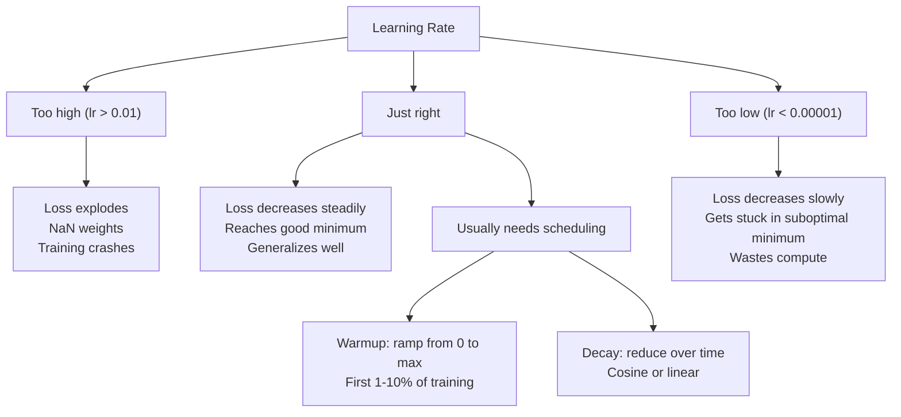
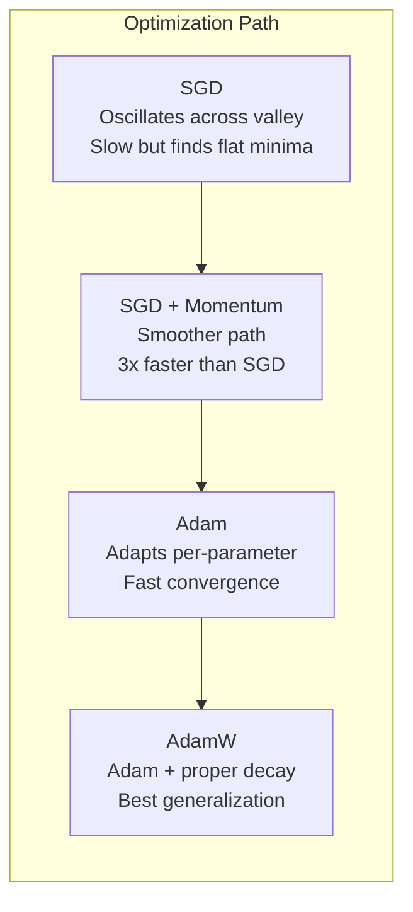
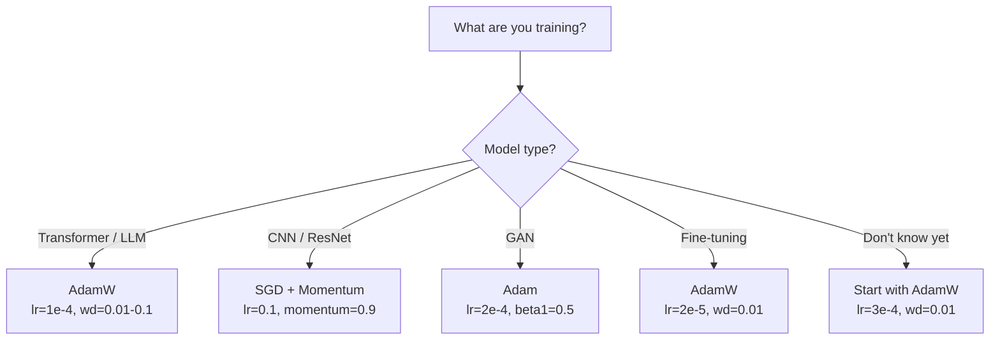

# Các chất tối ưu hóa

> Thấp độ giảm  nói cho bạn biết phải di chuyển theo hướng nào. Nó không chỉ ra phải đi xa, cũng không chỉ ra phải đi nhanh. SGD là chỉ dẫn.

**Type:** Build
**Languages:** Python
**Prerequisites:** Lesson 03.05 (Loss Functions)
**Time:** ~75 minutes

## Học mục tiêu

- Sử dụng Python từ không thực hiện SGD 带 động lực của SGD  Adam và AdamW Optimizers
- 解释 Adam's bias correction  làm thế nào để bù đắp bài tập giai đoạn đầu từ giai đoạn 0 đến giai đoạn 0
-  hiển thị tại sao trên cùng nhiệm vụ, AdamW có khả năng phổ biến tốt hơn với L2
- Đối với các biến đổi, CNN, GAN và điều chỉnh tinh tế  chọn phù hợp với Optimizer và các siêu tham số mặc định

## 问题

Bạn đã tính toán Gradient. Bạn biết # 4,721 trọng lượng nên giảm 0,003 để giảm Loss. Nhưng 0.003 đơn vị là gì? theo gì giảm? bước 1 và bước 1000 nên di chuyển cùng một lượng?

Vanilla Gradient Descent trong mỗi bước đối với mỗi tham số  áp dụng cùng tốc độ học tập: w = w - lr * gradient。 điều này sẽ tạo ra ba vấn đề, làm cho đào tạo mạng thần kinh trong thực tế trở nên rất đau đớn。

Thứ nhất,振荡──Loss landscape 很少像一个平滑的碗──它更像一条又长又窄的山谷──Gradient指向穿越山谷的方向──方向,而不是沿山谷的方向──平缓方向──Gradient Descent 会在狭维上跳跳跳跳跳跳跳跳跳跳跳跳,而在真正有用的方向上进步很小──你已经见过这种现象:Loss 先快速下降,然后进入平台期,不是因为模型已经收到了,而是因为它在振荡──

Thứ hai, đối với tất cả các tham số sử dụng cùng một tốc độ học là sai lầm. Một số trọng lượng cần phải được cải tiến đáng kể.

Thứ ba, các điểm lăn. Trong không gian cao, vùng đất mất mát có một khu vực bằng phẳng lớn, trong đó Gradient  gần zero. SGD Vanilla sẽ leo qua các khu vực này với tốc độ Gradient, và tốc độ này thực sự gần zero.

Adam giải quyết ba vấn đề này. Nó bảo trì hai trung bình chạy cho mỗi tham số - gradient trung bình (momentum, xử lý振荡) và gradient vuông trung bình (adaptive rate, xử lý các kích thước khác nhau)  tái kết hợp với vài bước trước của chỉnh sửa thiên vị, nó cung cấp một phương pháp tối ưu hóa đơn giản sử dụng các tham số siêu mặc định để xử lý 80% vấn đề.

## 概念

### Thâm nhập theo cấp stochastic (SGD)

 Optimizer                                                                                                                                                                                                                                                             

```
w = w - lr * gradient
```

stochastic cho thấy bạn sử dụng dữ liệu theo từng tập hợp nhỏ để ước tính độ phân, thay vì sử dụng bộ dữ liệu hoàn chỉnh.

Tỷ lệ học tập là duy nhất. Tỷ lệ mất mát rất cao. Tỷ lệ học tập sẽ mất rất nhiều thời gian. Tỷ lệ học tập tối ưu nhất phụ thuộc vào kiến trúc, dữ liệu, kích thước lô, và giai đoạn đào tạo hiện tại. Đối với các mạng hiện đại trên SGD vani, phạm vi học tập điển hình là 0.01 đến 0.1 .

### Tốc độ

Các loại hình của 小球滚下山坡 được sử dụng quá nhiều, nhưng nó là chính xác. Bạn không chỉ theo Gradient tiến, mà còn duy trì một tốc độ, để tích lũy Gradient quá khứ.

```
m_t = beta * m_{t-1} + gradient
w = w - lr * m_t
```

Beta(thường là 0,9) kiểm soát giữ lại nhiều thông tin lịch sử。 khi beta = 0,9 时,momentum 大致等于最近10 个 Gradients的平均值(1 / (1 - 0,9) = 10)。

Tại sao nó có thể sửa đổi振荡: hướng về cùng hướng Gradients sẽ tích lũy. hướng phản hồi xoay ngược Gradients sẽ đối kháng lẫn nhau. Trong thung lũng hẹp đó, 横穿 phân số sẽ thay đổi từng bước và bị suy yếu.

Real Digital: Trong tình huống rất xấu Loss Landscape trên, sử dụng đơn lẻ SGD có thể cần 10.000 bước.

### RMSProp

Một thực sự hiệu quả theo từng tham số tỷ lệ học tập thích nghi 方法──由 Hinton 在 Coursera 课程中提出 (从未正式发表)──

```
s_t = beta * s_{t-1} + (1 - beta) * gradient^2
w = w - lr * gradient / (sqrt(s_t) + epsilon)
```

S_t 跟踪 gradients vuông của trung bình chạy. tiếp tục có các tham số của gradients lớn hơn sẽ được phân chia với một số lớn hơn (<<<<<<<<<<<<<<<<<<<<<<<<<<<<<<<<<<<<<<<<<<<<<<<<<<<<<<<<<<<<<<<<<<<<<<<<<<<<<<<<<<<<<<<<<<<<<<<<<<<<<<<<<<<<<<<<<<<<<<<<<<<<<<<<<<<<<<<<<<<<<<<<<<<<<<<<<<<<<<<<<<<<<<<<<<<<<<<<<<<<<<<<<<<<<<<<<<<<<<<<<<<<<<<<<<<<<<<<<<<<<<<<<<<<<<<<<<<<<<<<<<<<<<<<<<<<<<<<<<<<<<<<<<<<<<<<<<<<<<<<<<<<<<<<<<<<<<<<<<<<<<<<<<<<<<<<<<<<<<<<<<<<<<<<<<<<<<<<<<<<<<<<<<<<<<<<<<<<<<<<<<<<<<<<<<<<<<<<<<<<<<<<<<<<<<<<<<<<<<<<<<<<<<<<<<<<<<<<<<<<<<<<<<<<<<<<<<<<<<<<<<<<<<<<<<<<<<<<<<<<<<<<<<<<<<<<<<<

Điều này giải quyết tất cả các tham số sử dụng cùng một tốc độ học vấn đề. Một người đã tiếp tục nhận được một lượng lớn cải tiến gần mục tiêu.

Epsilon thường là 1e-8) sẽ ở một tham số nào đó  chưa được cập nhật khi ngăn chặn phân trừ vào 0.

### Adam: Momentum + RMSProp

Adam kết hợp hai ý tưởng. Nó bảo vệ hai trung bình chuyển động thoáng qua cho mỗi tham số:

```
m_t = beta1 * m_{t-1} + (1 - beta1) * gradient        (first moment: mean)
v_t = beta2 * v_{t-1} + (1 - beta2) * gradient^2       (second moment: variance)
```

**Bias correction**Trong bước thứ nhất, m_1 = (1 - beta1) * gradient。 khi beta1 = 0.9 时, nó là 0,1 * gradient--- 小了十倍── chuyển động trung bình chưa có预热── Bias sửa chữa sẽ được hoàn trả:

```
m_hat = m_t / (1 - beta1^t)
v_hat = v_t / (1 - beta2^t)
```

第 1 步且beta1 = 0.9 时:m_hat = m_1 / (1 - 0.9) = m_1 / 0.1 = 实际 Gradient。第 100 步时:(1 - 0.9^100) 约等于 1.0, do đó sự sửa chữa 消失── Sự sửa đổi quan trọng đối với trước ~10 步 rất quan trọng, trong ~50 步后基本无关紧要──

更新公式:

```
w = w - lr * m_hat / (sqrt(v_hat) + epsilon)
```

Adam 默认值:lr = 0.001,beta1 = 0.9,beta2 = 0.999,epsilon = 1e-8。 Những 默认值 này áp dụng cho 80% các vấn đề──

### AdamW: 正确处理 Khối thâm trọng

L2 Regularisation 会向损失 中添加兰巴 * w^2──在瓦尼拉 SGD 中,这等于减肥的

Nhìn của Loshchilov & Hutter là: Khi bạn đưa L2 tăng vào Loss, sau đó để Adam xử lý Gradient 时, tỷ lệ học tập thích ứng cũng sẽ giảm theo thời gian điều chỉnh.

AdamW  thông qua Adam update  sau đó trực tiếp đối với trọng lượng  áp dụng giảm cân để sửa chữa vấn đề này:

```
w = w - lr * m_hat / (sqrt(v_hat) + epsilon) - lr * lambda * w
```

Khối thâm hụt trọng lượng không bị nhân tố thích ứng của Adam 缩放── mỗi tham số đều có được tỷ lệ giảm tương tự──

Đây trông giống như một chi tiết nhỏ. Không phải là. AdamW trong hầu hết các nhiệm vụ đều được thực hiện tốt hơn so với Adam + L2 thường xuyên hóa. Nó là PyTorch trong sử dụng để đào tạo các biến đổi, mô hình phân phối và hầu hết các kiến trúc hiện đại.

### Tốc độ học tập: siêu số quan trọng nhất



Nếu chỉ điều chỉnh một siêu tham số, thì đó là điều chỉnh tốc độ học tập.

- SGD: lr = 0,01 đến 0,1
- Adam/AdamW: lr = 1e-4 đến 3e-4
- Các mô hình được đào tạo trước khi điều chỉnh: lr = 1e-5 đến 5e-5
- Tăng tốc độ học tập: Trong giai đoạn 1-10%

### Optimizer đối với



### Mỗi loại Optimizer 何時胜出




```figure
optimizer-trajectory
```

##  xây dựng nó

### 步骤 1: Vanilla SGD

```python
class SGD:
    def __init__(self, lr=0.01):
        self.lr = lr

    def step(self, params, grads):
        for i in range(len(params)):
            params[i] -= self.lr * grads[i]
```

### 步骤 2: 带 Momentum của SGD

```python
class SGDMomentum:
    def __init__(self, lr=0.01, beta=0.9):
        self.lr = lr
        self.beta = beta
        self.velocities = None

    def step(self, params, grads):
        if self.velocities is None:
            self.velocities = [0.0] * len(params)
        for i in range(len(params)):
            self.velocities[i] = self.beta * self.velocities[i] + grads[i]
            params[i] -= self.lr * self.velocities[i]
```

### Bước 3: Adam

```python
import math

class Adam:
    def __init__(self, lr=0.001, beta1=0.9, beta2=0.999, epsilon=1e-8):
        self.lr = lr
        self.beta1 = beta1
        self.beta2 = beta2
        self.epsilon = epsilon
        self.m = None
        self.v = None
        self.t = 0

    def step(self, params, grads):
        if self.m is None:
            self.m = [0.0] * len(params)
            self.v = [0.0] * len(params)

        self.t += 1

        for i in range(len(params)):
            self.m[i] = self.beta1 * self.m[i] + (1 - self.beta1) * grads[i]
            self.v[i] = self.beta2 * self.v[i] + (1 - self.beta2) * grads[i] ** 2

            m_hat = self.m[i] / (1 - self.beta1 ** self.t)
            v_hat = self.v[i] / (1 - self.beta2 ** self.t)

            params[i] -= self.lr * m_hat / (math.sqrt(v_hat) + self.epsilon)
```

### 步骤 4: AdamW

```python
class AdamW:
    def __init__(self, lr=0.001, beta1=0.9, beta2=0.999, epsilon=1e-8, weight_decay=0.01):
        self.lr = lr
        self.beta1 = beta1
        self.beta2 = beta2
        self.epsilon = epsilon
        self.weight_decay = weight_decay
        self.m = None
        self.v = None
        self.t = 0

    def step(self, params, grads):
        if self.m is None:
            self.m = [0.0] * len(params)
            self.v = [0.0] * len(params)

        self.t += 1

        for i in range(len(params)):
            self.m[i] = self.beta1 * self.m[i] + (1 - self.beta1) * grads[i]
            self.v[i] = self.beta2 * self.v[i] + (1 - self.beta2) * grads[i] ** 2

            m_hat = self.m[i] / (1 - self.beta1 ** self.t)
            v_hat = self.v[i] / (1 - self.beta2 ** self.t)

            params[i] -= self.lr * m_hat / (math.sqrt(v_hat) + self.epsilon)
            params[i] -= self.lr * self.weight_decay * params[i]
```

### Bước 5:  tập đối với

Trong tập 05 của tập dữ liệu vòng tròn trên, sử dụng tất cả bốn Optimizers  đào tạo cùng một mạng hai tầng 

```python
import random

def sigmoid(x):
    x = max(-500, min(500, x))
    return 1.0 / (1.0 + math.exp(-x))

def make_circle_data(n=200, seed=42):
    random.seed(seed)
    data = []
    for _ in range(n):
        x = random.uniform(-2, 2)
        y = random.uniform(-2, 2)
        label = 1.0 if x * x + y * y < 1.5 else 0.0
        data.append(([x, y], label))
    return data


class OptimizerTestNetwork:
    def __init__(self, optimizer, hidden_size=8):
        random.seed(0)
        self.hidden_size = hidden_size
        self.optimizer = optimizer

        self.w1 = [[random.gauss(0, 0.5) for _ in range(2)] for _ in range(hidden_size)]
        self.b1 = [0.0] * hidden_size
        self.w2 = [random.gauss(0, 0.5) for _ in range(hidden_size)]
        self.b2 = 0.0

    def get_params(self):
        params = []
        for row in self.w1:
            params.extend(row)
        params.extend(self.b1)
        params.extend(self.w2)
        params.append(self.b2)
        return params

    def set_params(self, params):
        idx = 0
        for i in range(self.hidden_size):
            for j in range(2):
                self.w1[i][j] = params[idx]
                idx += 1
        for i in range(self.hidden_size):
            self.b1[i] = params[idx]
            idx += 1
        for i in range(self.hidden_size):
            self.w2[i] = params[idx]
            idx += 1
        self.b2 = params[idx]

    def forward(self, x):
        self.x = x
        self.z1 = []
        self.h = []
        for i in range(self.hidden_size):
            z = self.w1[i][0] * x[0] + self.w1[i][1] * x[1] + self.b1[i]
            self.z1.append(z)
            self.h.append(max(0.0, z))

        self.z2 = sum(self.w2[i] * self.h[i] for i in range(self.hidden_size)) + self.b2
        self.out = sigmoid(self.z2)
        return self.out

    def compute_grads(self, target):
        eps = 1e-15
        p = max(eps, min(1 - eps, self.out))
        d_loss = -(target / p) + (1 - target) / (1 - p)
        d_sigmoid = self.out * (1 - self.out)
        d_out = d_loss * d_sigmoid

        grads = [0.0] * (self.hidden_size * 2 + self.hidden_size + self.hidden_size + 1)
        idx = 0
        for i in range(self.hidden_size):
            d_relu = 1.0 if self.z1[i] > 0 else 0.0
            d_h = d_out * self.w2[i] * d_relu
            grads[idx] = d_h * self.x[0]
            grads[idx + 1] = d_h * self.x[1]
            idx += 2

        for i in range(self.hidden_size):
            d_relu = 1.0 if self.z1[i] > 0 else 0.0
            grads[idx] = d_out * self.w2[i] * d_relu
            idx += 1

        for i in range(self.hidden_size):
            grads[idx] = d_out * self.h[i]
            idx += 1

        grads[idx] = d_out
        return grads

    def train(self, data, epochs=300):
        losses = []
        for epoch in range(epochs):
            total_loss = 0.0
            correct = 0
            for x, y in data:
                pred = self.forward(x)
                grads = self.compute_grads(y)
                params = self.get_params()
                self.optimizer.step(params, grads)
                self.set_params(params)

                eps = 1e-15
                p = max(eps, min(1 - eps, pred))
                total_loss += -(y * math.log(p) + (1 - y) * math.log(1 - p))
                if (pred >= 0.5) == (y >= 0.5):
                    correct += 1
            avg_loss = total_loss / len(data)
            accuracy = correct / len(data) * 100
            losses.append((avg_loss, accuracy))
            if epoch % 75 == 0 or epoch == epochs - 1:
                print(f"    Epoch {epoch:3d}: loss={avg_loss:.4f}, accuracy={accuracy:.1f}%")
        return losses
```

## Sử dụng nó

PyTorch Optimizers 会 xử lý các nhóm tham số, cắt giảm gradient và lập trình tốc độ học tập:

```python
import torch
import torch.optim as optim

model = torch.nn.Sequential(
    torch.nn.Linear(784, 256),
    torch.nn.ReLU(),
    torch.nn.Linear(256, 10),
)

optimizer = optim.AdamW(model.parameters(), lr=3e-4, weight_decay=0.01)

scheduler = optim.lr_scheduler.CosineAnnealingLR(optimizer, T_max=100)

for epoch in range(100):
    optimizer.zero_grad()
    output = model(torch.randn(32, 784))
    loss = torch.nn.functional.cross_entropy(output, torch.randint(0, 10, (32,)))
    loss.backward()
    torch.nn.utils.clip_grad_norm_(model.parameters(), max_norm=1.0)
    optimizer.step()
    scheduler.step()
```

模式始终是:zero_grad、forward、loss、backward、(clip)、step、(schedule)。记住这个顺序──弄错它──例如在优化器.step() 之前调用 scheduler.step(((是细微 bug 的常见来源──

Đối với CNN, nhiều nhà thực hành vẫn thích sử dụng SGD带 động lực của SGD ((lr=0.1,momentum=0.9,weight_decay=1e-4),并搭配步骤或kosine schedule。SGD sẽ tìm thấy các tối thiểu hơn bình thường, và điều này thường có khả năng phổ biến tốt hơn。 Đối với các biến đổi và LLM,带热up +kosine decay AdamW là lựa chọn mặc định phổ biến。 trừ khi có lý do đo qua, nếu không thì không nên và đồng ý đối kháng。

## 交付 nó

本课产 出:
- `outputs/prompt-optimizer-selector.md`-- một ứng dụng cho kiến trúc tùy chọn  chọn đúng Optimizer và tốc độ học tập của quyết định nhanh chóng

## 练习

1. 实现 Nesterov động lực, trong đó bạn đang ở lookahead 位置(w - lr * beta * v) thay vì hiện tại vị trí tính toán Gradient。 trên bộ dữ liệu vòng tròn 上比较它 với chuẩn động lực 收情况。

2. Thực hiện một lịch trình học tập nhiệt độ: trong các bước trước 10% của tập trung từ 0 线性 ramp đến max_lr, sau đó sự phân rã của cosine đến 0 ⋅ so sánh Adam + warmup với Adam không ấm lên ⋅ đo lường trên bộ dữ liệu vòng tròn đạt đến 90% chính xác ⋅ cần bao nhiêu thời đại ⋅

3. Trong thời gian tập luyện của Adam, theo dõi từng tham số của tỷ lệ học hành hiệu quả.

4. 实现 gradient clipping(according to global norm clip) ――将max gradient norm 设置为 1.0──使用较高学习率(Adam 的 lr=0.01)分别在有剪辑和无剪辑的情况下训练──统计 10 种子中,有多少次运行 会发散(Loss 变为 NaN)──

5. Trong một mạng lưới có trọng lượng lớn trên so sánh Adam và AdamW── sẽ có tất cả trọng lượng được khởi tạo thành [-5, 5] giá trị tự nhiên giữa nó ([[:decay_decay_decay_decay_decay_decay_decay_decay_decay_decay_decay_decay_decay_decay_decay_decay_decay_decay_decay_decay_decay_decay_decay_decay_decay_decay_decay_decay_decay_decay_decay_decay_decay_decay_decay_decay_decay_decay_decay_decay_decay_decay_decay_decay_decay_decay_decay_decay_decay_decay_decay_decay_decay_decay_decay_decay_decay_decay_decay_decay_decay_decay_decay_decay_decay_decay_decay_decay_decay_decay_decay_decay_decay_delay_delay_delay_delay_delay_delay_delay_delay_delay_delay_delay_delay_delay_delay_delay_delay_delay_delay_delay_delay_delay_delay_delay_delay_delay_delay_delay_delay_delay_delay_delay_delay_delay_delay_delay_delay_delay_delay_delay_delay_delay_delay_delay_delay_delay_delay_delay_delay_delay_delay_delay_delay_delay_delay_delay_delay_delay_delay_delay_delay_delay_delay_delay_delay_delay_delay_delay_delay_delay_delay_delay_delay_delay_delay_delay_delay_delay_delay_delay_delay_delay_delay_delay_delay_

## 关键术语

| Term | 人们通常怎么说 | 它实际意味着什么 |
|------|----------------|----------------------|
| Learning rate | “Step size” | Gradient update 上的标量乘数；训练中影响最大的单个 hyperparameter |
| SGD | “Basic gradient descent” | Stochastic Gradient Descent：通过减去 lr * gradient 来更新 weights，Gradient 在 mini-batch 上计算 |
| Momentum | “Rolling ball analogy” | 过去 Gradients 的 exponential moving average；削弱振荡，并加速一致方向 |
| RMSProp | “Adaptive learning rate” | 用近期 Gradients 的 running RMS 除以每个 parameter 的 Gradient；均衡 learning rates |
| Adam | “The default optimizer” | 将 momentum（first moment）和 RMSProp（second moment）结合起来，并对初始 steps 进行 bias correction |
| AdamW | “Adam done right” | 带 decoupled weight decay 的 Adam；直接对 weights 应用 regularization，而不是通过 Gradient |
| Bias correction | “Warmup for running averages” | 除以 (1 - beta^t)，用于补偿 Adam 的 moment estimates 的零初始化 |
| Weight decay | “Shrink the weights” | 每一步减去 weight 值的一部分；一种惩罚大 weights 的 regularizer |
| Learning rate schedule | “Changing lr over time” | 在训练期间调整 learning rate 的函数；warmup + cosine decay 是现代默认方案 |
| Gradient clipping | “Capping the gradient norm” | 当 Gradient Vector 的 norm 超过阈值时对其进行缩放；防止 exploding gradient updates |

## 延伸阅读

- Kingma & Ba, Adam: Một phương pháp tối ưu hóa Stochastic (2014) -- 原始 Adam paper,包含融合分析和偏差纠正 推导
- Loshchilov & Hutter, Discoupled Weight Decay Regularization (2017) -- 证明在Adam 中 L2 regularization与体重减不等价,并提出 AdamW
- Smith, Tỷ lệ học tập chu kỳ cho đào tạo mạng thần kinh (2017) -- 引入 LR range test 和周期表, giảm调固定 learning rate 的需求
- Ruder, Một tổng quan về thuật toán tối ưu hóa giảm cấp  (2016) -- 关于所有优化器 变体的最佳单篇综述,比较清晰,直觉解释也明确
