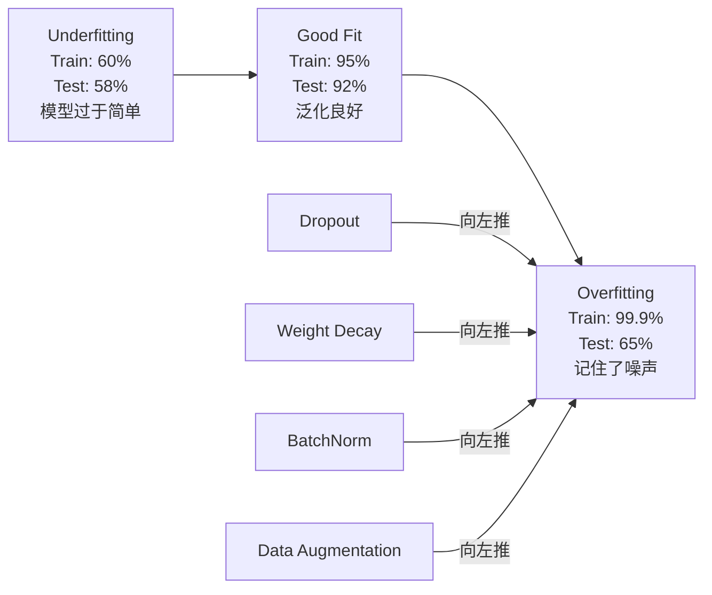
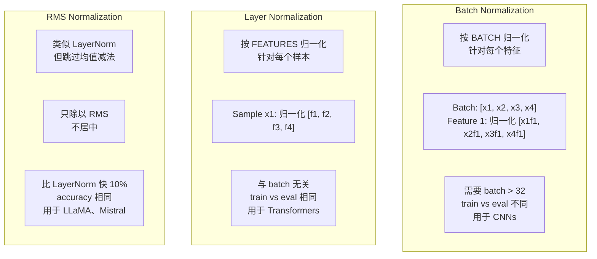
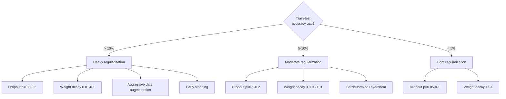

# Việc quy định

> Mô hình của bạn đạt đến 99% trên dữ liệu đào tạo, nhưng chỉ 60% trên dữ liệu thử nghiệm. Nó ghi nhớ dữ liệu, chứ không phải học luật.

**Type:** Build
**Languages:** Python
**Prerequisites:** Lesson 03.06 (Optimizers)
**Time:** ~75 minutes

## Học mục tiêu
- Từ zero thực hiện với quy mô đảo ngược của dropup, L2 giảm cân, batch bình thường hóa, lớp bình thường hóa và RMSNorm
-  đo lường khoảng cách độ chính xác của tàu-đun thử,并 thông qua quy định 实验诊断过
- 解释 tại sao Transformer sử dụng LayerNorm thay vì BatchNorm, cũng như tại sao các LLM hiện đại lại thích RMSNorm hơn
- Theo mức độ quá phù hợp, ứng dụng đúng sự điều chỉnh 技术组合

## 问题
Một mạng Neural có đủ số tham số có thể ghi nhớ bất kỳ tập hợp dữ liệu nào. Đây không phải là giả thuyết Zhang et al. (2017) 通过带随机标签的ImageNet 上训标准网络证明这一点.

Đây là vấn đề quá phù hợp, và mô hình càng lớn, vấn đề càng nghiêm trọng. GPT-3 có 175 tỷ tham số. Tập hợp đào tạo có khoảng 500 tỷ token. Có rất nhiều tham số, mô hình có đủ dung lượng, có thể từng chữ ghi nhớ rất nhiều đoạn trong dữ liệu đào tạo. Không có quy định, nó chỉ sẽ lặp lại mô hình đào tạo, thay vì học mô hình phổ biến.

Sự khác biệt giữa hiệu suất tập luyện và hiệu suất thử nghiệm là khoảng cách quá phù hợp. Mỗi công nghệ trong bài học này sẽ tấn công khoảng cách này từ góc độ khác nhau. Droput buộc mạng không phụ thuộc vào bất kỳ thần kinh nào. Thâm hụt trọng lượng ngăn chặn bất kỳ trọng lượng nào trở nên quá lớn.

## 概念
### Phạm vi quá phù hợp

Mỗi mô hình đều nằm ở một vị trí nào đó (từ quá đơn giản, không thể nắm bắt mô hình) đến quá phù hợp (từ quá phức tạp, đến mức nắm bắt tiếng ồn).



### Thất vả

Các công nghệ điều chỉnh đơn giản nhất, nhưng có một giải thích tốt nhất. Trong thời gian tập luyện, có khả năng mỗi đầu ra của mỗi thần kinh sẽ được đặt thành 0.

```
output = activation(z) * mask    where mask[i] ~ Bernoulli(1 - p)
```

Khi p = 0,5 , mỗi lần tiến qua sẽ đặt một nửa thần kinh vào không.

Ensemble 解释: một có N 个神经并使用脱落的网络会创建2^N个可能的子网络 (n) ]] 所有神经开关或关的组合) ⋅ sử dụng脱落 训练近似于同时训练所有2^N个子网络,每个都在不同的小批上训练――测试时,你使用所有神经元 (n) ̇无脱落),并将输出按 (1 - p)缩小,缩小,以匹配训练期间的期望值――这等于预测对2^N个子网络的预测平均单个模型得到一个巨大的集合――

实践中,缩放会在训练期间应用,而不是测试期间应用(reversed dropout):

```
During training:  output = activation(z) * mask / (1 - p)
During testing:   output = activation(z)   (no change needed)
```

Như vậy thì tốt hơn, bởi vì test code hoàn toàn không cần biết bỏ qua.

默认比例:Transformer 使用 p = 0.1,MLPs 使用 p = 0.5,CNNs 使用 p = 0.2-0.3──更高的 dropup = 更强的规范化 = 更高的不适应风险──

### Sự suy giảm cân (L2 Regularisation)

Nâng tư nhân của Quảng lớn gia nhập Loss:

```
total_loss = task_loss + (lambda / 2) * sum(w_i^2)
```

Các điều kiện về quy định là lambda * w. Điều này có nghĩa là trong mỗi bước, mỗi trọng lượng sẽ được giảm theo tỷ lệ lớn của nó.

Tại sao điều này giúp phổ biến hóa: mô hình quá sức  thường có trọng lượng lớn hơn, sẽ làm tăng tiếng ồn trong dữ liệu tập luyện.

Lambda siêu tham số 控制强度── điển hình giá trị:

- Transformer 上的 AdamW Sử dụng 0.01
- CNNs trên SGD sử dụng 1e-4
- 严重 overfit 的模型使用 0.1

如课06 所讨论: giảm cân 和 L2 quy định trong SGD 中等价,但在Adam 中不等价.

### Tự bình hóa hàng loạt

Trong khi sẽ chuyển giao đầu ra của mỗi lớp sang tầng sau, trước tiên là ở mini-batch  kích thước đối với việc phân phối nó.

Đối với một nhóm kích hoạt:

```
mu = (1/B) * sum(x_i)           (batch mean)
sigma^2 = (1/B) * sum((x_i - mu)^2)   (batch variance)
x_hat = (x_i - mu) / sqrt(sigma^2 + eps)   (normalize)
y = gamma * x_hat + beta        (scale and shift)
```

Gamma và beta là các tham số có thể học được, để mạng trong tình huống tốt nhất có thể hủy bỏ sự bình thường hóa này. Nếu không có chúng, bạn sẽ buộc mỗi lớp đầu ra đều trở thành giá trị trung bình, tỷ lệ đơn vị khác nhau, và điều này không nhất thiết là mạng muốn.

**Training vs inference split:**Trong thời gian tập luyện, mu 和 sigma từ mini-batch trước đây. Trong thời gian tập luyện, bạn sử dụng trung bình chạy tích lũy trong thời gian tập luyện.

BatchNorm vì sao có hiệu quả vẫn còn tranh cãi. Bài viết ban đầu tuyên bố nó đã giảm "sự thay đổi biến đổi nội bộ" (with early layer update, layer input distribution occurs change) Saturkar et al. (2018) cho thấy giải thích này là sai lầm. Lý do thực sự là: BatchNorm 让 Loss landscape 更平滑. Gradients 更具预测性,Lipschitz constants 更小,Optimizer security có thể thực hiện bước tiến lớn hơn.

BatchNorm có một hạn chế cơ bản: nó phụ thuộc vào số liệu thống kê hàng loạt. Khi kích thước hàng loạt 为 1 时, trung bình và tỷ lệ差没有意义. Khi hàng loạt 很小(< 32) 时,统计量噪音很大,会损害性能.

### Tỷ lệ bình thường hóa lớp

Trong đặc tính kích thước, thay vì trong số lượng  batch  kích thước. Đối với một mẫu đơn:

```
mu = (1/D) * sum(x_j)           (feature mean)
sigma^2 = (1/D) * sum((x_j - mu)^2)   (feature variance)
x_hat = (x_j - mu) / sqrt(sigma^2 + eps)
y = gamma * x_hat + beta
```

D là tính năng kích thước. Mỗi mẫu tự do được phân tích không phụ thuộc vào kích thước lô. Đó là lý do tại sao Transformer sử dụng LayerNorm thay vì BatchNorm.

LayerNorm sẽ được áp dụng trong mỗi khối tự chú ý và mỗi khối chuyển tiếp 之后 (Post-LN), hoặc được áp dụng trước chúng (Pre-LN, training time more stable) 。

### RMSNorm

Không làm giảm giá bình quân của LayerNorm.

```
rms = sqrt((1/D) * sum(x_j^2))
y = gamma * x / rms
```

Về mặt này, không có giá trị trung bình tính, không có các tham số beta. Kết quả quan sát là: LayerNorm trong sự tái sinh của nó (trong khi giảm giá trị trung bình) đóng góp cho hiệu suất mô hình rất nhỏ, nhưng có chi phí tính toán.

LLaMA、LLaMA 2、LLaMA 3、Mistral và hầu hết các LLM hiện đại sử dụng RMSNorm thay vì LayerNorm── trong tỷ số tham số và tỷ số token, 10% này tiết kiệm rất đáng kể.

### So sánh bình thường hóa



### 作为规范化的数据增强

Đây không phải là thay đổi mô hình, mà là thay đổi dữ liệu.

- Hình ảnh: thu hoạch ngẫu nhiên, vặn, xoay, màu sắc, cắt
- Văn bản: thay thế đồng nghĩa, dịch lại, xóa ngẫu nhiên
- Âm thanh: thời gian kéo dài, thay đổi độ cao, bổ sung tiếng ồn

 hiệu quả và quy định tương tự: nó làm tăng kích thước hiệu quả của tập hợp tập luyện, làm cho mô hình khó nhớ hơn một mẫu cụ thể. Một người chỉ nhìn thấy mỗi hình ảnh trong hình thức ban đầu một lần mô hình có thể nhớ nó. Một người nhìn thấy mỗi hình ảnh 50 phiên bản tăng cường sẽ bị buộc phải học không thay đổi cấu trúc.

### Giữ sớm

Trong thực tế, bạn mỗi thời đại theo dõi sự mất mát của sự xác nhận, lưu trữ mô hình tốt nhất,并 tiếp tục đào tạo một cửa sổ "tình trạng kiên nhẫn" (thường là 5-20 thời đại) ◊ Nếu sự mất mát của sự xác nhận trong cửa sổ kiên nhẫn trong không cải thiện,就停止并加载保存的最佳模型──

### Khi nào nên áp dụng điều gì




```figure
l2-regularization
```

##  xây dựng nó
### 步骤 1: Trượt (Train và Eval Mode)

```python
import random
import math


class Dropout:
    def __init__(self, p=0.5):
        self.p = p
        self.training = True
        self.mask = None

    def forward(self, x):
        if not self.training:
            return list(x)
        self.mask = []
        output = []
        for val in x:
            if random.random() < self.p:
                self.mask.append(0)
                output.append(0.0)
            else:
                self.mask.append(1)
                output.append(val / (1 - self.p))
        return output

    def backward(self, grad_output):
        grads = []
        for g, m in zip(grad_output, self.mask):
            if m == 0:
                grads.append(0.0)
            else:
                grads.append(g / (1 - self.p))
        return grads
```

### 步骤 2: L2 Thảm trọng lượng

```python
def l2_regularization(weights, lambda_reg):
    penalty = 0.0
    for w in weights:
        penalty += w * w
    return lambda_reg * 0.5 * penalty

def l2_gradient(weights, lambda_reg):
    return [lambda_reg * w for w in weights]
```

### 步骤 3: Tiêu chuẩn hóa lô

```python
class BatchNorm:
    def __init__(self, num_features, momentum=0.1, eps=1e-5):
        self.gamma = [1.0] * num_features
        self.beta = [0.0] * num_features
        self.eps = eps
        self.momentum = momentum
        self.running_mean = [0.0] * num_features
        self.running_var = [1.0] * num_features
        self.training = True
        self.num_features = num_features

    def forward(self, batch):
        batch_size = len(batch)
        if self.training:
            mean = [0.0] * self.num_features
            for sample in batch:
                for j in range(self.num_features):
                    mean[j] += sample[j]
            mean = [m / batch_size for m in mean]

            var = [0.0] * self.num_features
            for sample in batch:
                for j in range(self.num_features):
                    var[j] += (sample[j] - mean[j]) ** 2
            var = [v / batch_size for v in var]

            for j in range(self.num_features):
                self.running_mean[j] = (1 - self.momentum) * self.running_mean[j] + self.momentum * mean[j]
                self.running_var[j] = (1 - self.momentum) * self.running_var[j] + self.momentum * var[j]
        else:
            mean = list(self.running_mean)
            var = list(self.running_var)

        self.x_hat = []
        output = []
        for sample in batch:
            normalized = []
            out_sample = []
            for j in range(self.num_features):
                x_h = (sample[j] - mean[j]) / math.sqrt(var[j] + self.eps)
                normalized.append(x_h)
                out_sample.append(self.gamma[j] * x_h + self.beta[j])
            self.x_hat.append(normalized)
            output.append(out_sample)
        return output
```

### 步骤 4: Lớp bình thường hóa

```python
class LayerNorm:
    def __init__(self, num_features, eps=1e-5):
        self.gamma = [1.0] * num_features
        self.beta = [0.0] * num_features
        self.eps = eps
        self.num_features = num_features

    def forward(self, x):
        mean = sum(x) / len(x)
        var = sum((xi - mean) ** 2 for xi in x) / len(x)

        self.x_hat = []
        output = []
        for j in range(self.num_features):
            x_h = (x[j] - mean) / math.sqrt(var + self.eps)
            self.x_hat.append(x_h)
            output.append(self.gamma[j] * x_h + self.beta[j])
        return output
```

### 步骤 5: RMSNorm

```python
class RMSNorm:
    def __init__(self, num_features, eps=1e-6):
        self.gamma = [1.0] * num_features
        self.eps = eps
        self.num_features = num_features

    def forward(self, x):
        rms = math.sqrt(sum(xi * xi for xi in x) / len(x) + self.eps)
        output = []
        for j in range(self.num_features):
            output.append(self.gamma[j] * x[j] / rms)
        return output
```

### Bước 6: Căn luyện với và không có quy định

```python
def sigmoid(x):
    x = max(-500, min(500, x))
    return 1.0 / (1.0 + math.exp(-x))


def make_circle_data(n=200, seed=42):
    random.seed(seed)
    data = []
    for _ in range(n):
        x = random.uniform(-2, 2)
        y = random.uniform(-2, 2)
        label = 1.0 if x * x + y * y < 1.5 else 0.0
        data.append(([x, y], label))
    return data


class RegularizedNetwork:
    def __init__(self, hidden_size=16, lr=0.05, dropout_p=0.0, weight_decay=0.0):
        random.seed(0)
        self.hidden_size = hidden_size
        self.lr = lr
        self.dropout_p = dropout_p
        self.weight_decay = weight_decay
        self.dropout = Dropout(p=dropout_p) if dropout_p > 0 else None

        self.w1 = [[random.gauss(0, 0.5) for _ in range(2)] for _ in range(hidden_size)]
        self.b1 = [0.0] * hidden_size
        self.w2 = [random.gauss(0, 0.5) for _ in range(hidden_size)]
        self.b2 = 0.0

    def forward(self, x, training=True):
        self.x = x
        self.z1 = []
        self.h = []
        for i in range(self.hidden_size):
            z = self.w1[i][0] * x[0] + self.w1[i][1] * x[1] + self.b1[i]
            self.z1.append(z)
            self.h.append(max(0.0, z))

        if self.dropout and training:
            self.dropout.training = True
            self.h = self.dropout.forward(self.h)
        elif self.dropout:
            self.dropout.training = False
            self.h = self.dropout.forward(self.h)

        self.z2 = sum(self.w2[i] * self.h[i] for i in range(self.hidden_size)) + self.b2
        self.out = sigmoid(self.z2)
        return self.out

    def backward(self, target):
        eps = 1e-15
        p = max(eps, min(1 - eps, self.out))
        d_loss = -(target / p) + (1 - target) / (1 - p)
        d_sigmoid = self.out * (1 - self.out)
        d_out = d_loss * d_sigmoid

        for i in range(self.hidden_size):
            d_relu = 1.0 if self.z1[i] > 0 else 0.0
            d_h = d_out * self.w2[i] * d_relu
            self.w2[i] -= self.lr * (d_out * self.h[i] + self.weight_decay * self.w2[i])
            for j in range(2):
                self.w1[i][j] -= self.lr * (d_h * self.x[j] + self.weight_decay * self.w1[i][j])
            self.b1[i] -= self.lr * d_h
        self.b2 -= self.lr * d_out

    def evaluate(self, data):
        correct = 0
        total_loss = 0.0
        for x, y in data:
            pred = self.forward(x, training=False)
            eps = 1e-15
            p = max(eps, min(1 - eps, pred))
            total_loss += -(y * math.log(p) + (1 - y) * math.log(1 - p))
            if (pred >= 0.5) == (y >= 0.5):
                correct += 1
        return total_loss / len(data), correct / len(data) * 100

    def train_model(self, train_data, test_data, epochs=300):
        history = []
        for epoch in range(epochs):
            total_loss = 0.0
            correct = 0
            for x, y in train_data:
                pred = self.forward(x, training=True)
                self.backward(y)
                eps = 1e-15
                p = max(eps, min(1 - eps, pred))
                total_loss += -(y * math.log(p) + (1 - y) * math.log(1 - p))
                if (pred >= 0.5) == (y >= 0.5):
                    correct += 1
            train_loss = total_loss / len(train_data)
            train_acc = correct / len(train_data) * 100
            test_loss, test_acc = self.evaluate(test_data)
            history.append((train_loss, train_acc, test_loss, test_acc))
            if epoch % 75 == 0 or epoch == epochs - 1:
                gap = train_acc - test_acc
                print(f"    Epoch {epoch:3d}: train_acc={train_acc:.1f}%, test_acc={test_acc:.1f}%, gap={gap:.1f}%")
        return history
```

## Sử dụng nó
PyTorch 以模块形式 cung cấp tất cả các chuẩn hóa và quy định:

```python
import torch
import torch.nn as nn

model = nn.Sequential(
    nn.Linear(784, 256),
    nn.BatchNorm1d(256),
    nn.ReLU(),
    nn.Dropout(0.3),
    nn.Linear(256, 128),
    nn.BatchNorm1d(128),
    nn.ReLU(),
    nn.Dropout(0.3),
    nn.Linear(128, 10),
)

model.train()
out_train = model(torch.randn(32, 784))

model.eval()
out_test = model(torch.randn(1, 784))
```

`model.train()`- `model.eval()`切换非常关键──它会开/关闭 dropout,并告诉BatchNorm Sử dụng thống kê lô còn đang chạy thống kê──推理前忘调`model.eval()`là một trong những lỗi phổ biến nhất trong Deep Learning. Độ chính xác của bài kiểm tra của bạn sẽ thay đổi theo thời gian, bởi vì sự bỏ qua vẫn đang trong trạng thái hoạt động, trong khi BatchNorm vẫn đang sử dụng thống kê mini-batch.

Đối với Transformer, Mode khác nhau:

```python
class TransformerBlock(nn.Module):
    def __init__(self, d_model=512, nhead=8, dropout=0.1):
        super().__init__()
        self.attention = nn.MultiheadAttention(d_model, nhead, dropout=dropout)
        self.norm1 = nn.LayerNorm(d_model)
        self.ff = nn.Sequential(
            nn.Linear(d_model, d_model * 4),
            nn.GELU(),
            nn.Linear(d_model * 4, d_model),
            nn.Dropout(dropout),
        )
        self.norm2 = nn.LayerNorm(d_model)
        self.dropout = nn.Dropout(dropout)

    def forward(self, x):
        attended, _ = self.attention(x, x, x)
        x = self.norm1(x + self.dropout(attended))
        x = self.norm2(x + self.ff(x))
        return x
```

LayerNorm, chứ không phải BatchNorm.

## 交付 nó
本课会产出:
- `outputs/prompt-regularization-advisor.md`-- Một lời khuyên nhanh chóng, để chẩn đoán quá phù hợp và đề xuất một chiến lược quy định đúng đắn

## 练习
1. Để thực hiện sự giảm không gian dữ liệu 2D: đừng bỏ rơi một bộ thần kinh duy nhất, mà bỏ đi toàn bộ các kênh tính năng.

2. 将课05 中的标签 smoothing 与本课的落结合实现――使用四种配置训练:两者都不用、仅落、仅标签 smoothing、两者都用――衡量每种配置最终的火车测试精度差距――哪种组合得到的差距 最小?

3. Trong mạng lưới tập hợp dữ liệu của bạn, trong lớp ẩn và kích hoạt  giữa thêm một lớp BatchNorm. Trong tỷ lệ học 0.01、0.05 和 0.1 下,分别使用和不使用 BatchNorm 训练。BatchNorm 应该能在 vanila网络 发散的较高学习率 下实现稳定训练。

4. 实现早期停止: mỗi thời đại 跟踪 test loss,保存最佳权重,如果 test loss 连续 20 个时代 没有改善则停止――运行规范化网络 1000 个时代――报告哪个时代 拥有最佳测试精度,以及你节省了多少时代的计算――

5. Trong một mạng lưới 4 tầng (không chỉ là 2 tầng) trên so sánh LayerNorm và RMSNorm.

## 关键术语
| Term | What people say | What it actually means |
|------|----------------|----------------------|
| Overfitting | "模型记住了数据" | 当模型的训练表现显著高于测试表现时，表示它学到了噪声而不是信号 |
| Regularization | "防止 overfitting" | 任何约束模型复杂度以改善泛化的技术：dropout、weight decay、normalization、augmentation |
| Dropout | "随机删除神经元" | 训练期间以概率 p 将随机神经元置零，迫使模型学习冗余表示；等价于训练一个 ensemble |
| Weight decay | "L2 penalty" | 每一步通过减去 lambda * w 将所有权重向零收缩；通过权重大小惩罚复杂度 |
| Batch normalization | "按 batch 归一化" | 训练期间使用 batch statistics、推理期间使用 running averages，在 batch 维度上对层输出进行归一化 |
| Layer normalization | "按样本归一化" | 在每个样本内部跨特征归一化；与 batch 无关，用于 batch size 可变的 Transformer |
| RMSNorm | "没有均值的 LayerNorm" | Root mean square normalization；从 LayerNorm 中去掉均值减法，以相同 accuracy 获得 10% 加速 |
| Early stopping | "在 overfit 前停止" | 当 validation loss 不再改善时停止训练；最简单的 regularizer，通常与其他方法一起使用 |
| Data augmentation | "用更少数据生成更多数据" | 变换训练输入（flip、crop、noise）以增加有效数据集大小，并迫使模型学习不变性 |
| Generalization gap | "Train-test split" | 训练表现与测试表现之间的差异；regularization 的目标是最小化这个 gap |

## 延伸阅读
- Srivastava et al., "Dropout: Một cách đơn giản để ngăn chặn mạng thần kinh khỏi quá phù hợp" (2014) -- 原始 dropup 论文,包含组合 解释和大量实验
- Ioffe & Szegedy, "Battery Normalization: Accelerating Deep Network Training by Reducing Internal Covariate Shift" (2015) --  giới thiệu BatchNorm  và quy trình đào tạo của nó, là một trong những bài luận được trích dẫn nhiều nhất về Deep Learning
- Zhang & Sennrich, "Root Mean Square Layer Normalization" (2019) --  chỉ ra RMSNorm 能以更少计算匹配 LayerNorm chính xác; được LLaMA 和 Mistral 采用
- Zhang et al., "Giả sử học sâu đòi hỏi phải suy nghĩ lại về tổng quát" (2017) -- 里程碑论文, hiển thị mạng thần kinh có thể nhớ theo thời gian, thách thức quan điểm phổ biến truyền thống
