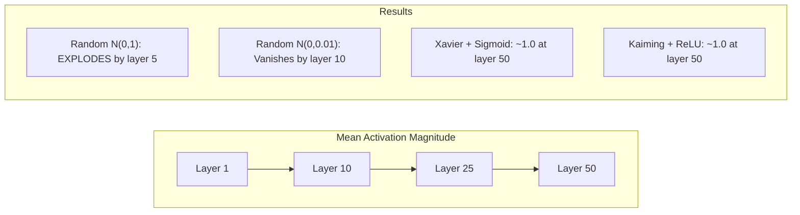
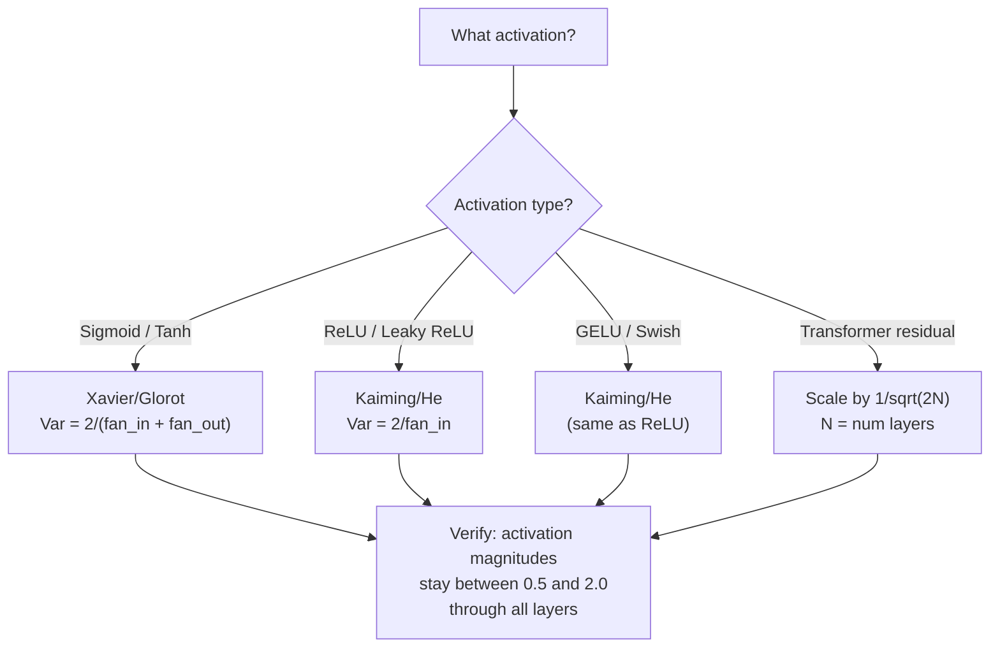

# Đánh nặng khởi động và tập luyện ổn định

> Đội đầu đã sai, tập luyện không thể bắt đầu. Đội đầu đã làm 50 lớp cũng có thể làm 3 lớp như tập luyện bình thường.

**Type:** Build
**Languages:** Python
**Prerequisites:** Lesson 03.04 (Activation Functions), Lesson 03.07 (Regularization)
**Time:** ~90 minutes

## Học mục tiêu
- 实现零、随机、Xavier/Glorot 和 Kaiming/He khởi tạo 策略,并测量它们对50层中激活幅度的影响
- 推导为什么 Xavier init 使用 Var(w) = 2/(fan_in + fan_out), còn Kaiming 使用 Var(w) = 2/fan_in
- 演示零初始化的对称性 问题,并解释为什么仅靠随机尺度还不够
- 将正确的初始化 策略匹配到激活函数:sigmoid/tanh 使用 Xavier,ReLU/GELU 使用 Kaiming

## 问题
Đặt tất cả các trọng lượng đều khởi nghiệp thành không. Mỗi tế bào thần kinh đều tính toán cùng một hàm, nhận cùng một cấp độ, và được cập nhật theo cùng một cách. Sau 10.000 thời đại, lớp ẩn 512 tế bào thần kinh của bạn vẫn chỉ là 512 bản sao của cùng một tế bào thần kinh. Bạn đã trả giá cho 512 tham số, nhưng chỉ nhận được 1 .

Đặt chúng khởi động quá lớn. Các hoạt động sẽ nổ ra trên toàn mạng. Đến lớp 10, số lượng đạt đến 1e15. Đến lớp 20, chúng tràn vào vô tận.

Từ phân bố bình thường tiêu chuẩn, sự khởi đầu ngẫu nhiên trên 3 tầng có hiệu quả. Đến 50 tầng, tín hiệu sẽ giảm xuống 0, hoặc phát nổ đến vô tận, tùy thuộc vào quy mô ngẫu nhiên là nhỏ hoặc nhỏ.

Việc khởi tạo trọng lượng là quyết định bị đánh giá thấp nhất trong Deep Learning. Architcture sẽ có bài viết. Optimizers sẽ có blog.

## 概念
### Vấn đề đối xứng

Mỗi tế bào thần kinh trong một lớp đều có cấu trúc giống nhau: sử dụng trọng lượng nhân vào, tăng thiên vị, kích hoạt ứng dụng. Nếu tất cả trọng lượng đều bắt đầu từ cùng một giá trị.

Bạn bị mắc kẹt. Mạng có hàng trăm tham số, nhưng chúng đều cùng nhau di chuyển. Điều này được gọi là đối xứng, và khởi tạo ngẫu nhiên là cách phá vỡ nó. Mỗi tế bào thần kinh bắt đầu từ vị trí khác nhau trong không gian trọng lượng, vì vậy mỗi tế bào thần kinh sẽ học các tính năng khác nhau.

Nhưng tình cờ cũng không đủ.

### Sự pha trộn lây lan qua các lớp

考虑一个具有风扇_in 个输入的单层:

```
z = w1*x1 + w2*x2 + ... + w_n*x_n
```

Nếu mỗi trọng lượng wi đều từ sự phân phối của sự biến động vì Var(w), và mỗi sự biến động của đầu vào xi là Var(x), thì sự biến động đầu ra là:

```
Var(z) = fan_in * Var(w) * Var(x)
```

Nếu Var(w) = 1 且 fan_in = 512, thì sự biến động đầu ra là sự biến động đầu vào của 512 倍──经过 10 层:512^10 = 1.2e27── tín hiệu của bạn đã nổ──

Nếu Var(w) = 0.001, thì sự biến động đầu ra Mỗi tầng theo 0.001 * 512 = 0.512 缩小──经过 10层:0.512^10 = 0.00013── tín hiệu của bạn đã biến mất──

目标: chọn Var(w), làm cho Var(z) = Var(x)。Tầm tín hiệu ở các tầng khác nhau giữ vững.

### Xavier/Glorot khởi tạo

Glorot and Bengio (2010) 推导适用于 sigmoid 和 tanh kích hoạt của giải pháp.

```
Var(w) = 2 / (fan_in + fan_out)
```

Trong thực tế, trọng lượng từ phân phối dưới đây 中采样:

```
w ~ Uniform(-limit, limit)  where limit = sqrt(6 / (fan_in + fan_out))
```

hoặc:

```
w ~ Normal(0, sqrt(2 / (fan_in + fan_out)))
```

Điều này là có hiệu quả, bởi vì sigmoid và tanh ở gần không 接近线性, và các hoạt động ngay sau khi khởi động chính xác nằm trong khu vực này.

### Kaiming/He khởi tạo

ReLU sẽ giết chết một nửa đầu ra (tất cả các tiêu cực đều trở thành không) ⋅有效 fan_in 减半, vì trung bình nhìn thấy một nửa đầu ra được đặt vào không. Xavier init không cân nhắc điều này - nó đánh giá thấp sự khác biệt cần thiết.

He et al. (2015) 调整了公式:

```
Var(w) = 2 / fan_in
```

Đánh nặng từ phân bố dưới đây 中采样:

```
w ~ Normal(0, sqrt(2 / fan_in))
```

Số 2 dùng để bù đắp ReLU sẽ một nửa kích hoạt 置零 ảnh hưởng. Không có nó, tín hiệu Mỗi tầng sẽ giảm khoảng 0,5 lần.

### Tạo ra Transformer

GPT-2 đã đưa ra một mô hình khác. Các kết nối dư sẽ đưa ra mỗi lớp phụ thêm vào đầu vào của nó:

```
x = x + sublayer(x)
```

Mỗi lần tăng sẽ tăng sự khác biệt. Đối với N 个 dư lớp, sự khác biệt sẽ tăng theo N 成比例. GPT-2 会将 dư lớp trọng lượng theo 1/sqrt.

Llama 3 ((405B tham số,126 lớp) sử dụng một phương pháp tương tự. Nếu không có sự thu hẹp này, dòng dư sẽ ở 126 tầng.

```mermaid
flowchart TD
    subgraph "Zero Init"
        Z1["Layer 1<br/>All weights = 0"] --> Z2["Layer 2<br/>All neurons identical"]
        Z2 --> Z3["Layer 3<br/>Still identical"]
        Z3 --> ZR["Result: 1 effective neuron<br/>regardless of width"]
    end

    subgraph "Xavier Init"
        X1["Layer 1<br/>Var = 2/(fan_in+fan_out)"] --> X2["Layer 2<br/>Signal stable"]
        X2 --> X3["Layer 50<br/>Signal stable"]
        X3 --> XR["Result: Trains with<br/>sigmoid/tanh"]
    end

    subgraph "Kaiming Init"
        K1["Layer 1<br/>Var = 2/fan_in"] --> K2["Layer 2<br/>Signal stable"]
        K2 --> K3["Layer 50<br/>Signal stable"]
        K3 --> KR["Result: Trains with<br/>ReLU/GELU"]
    end
```



### 穿越50层时的激活大小



### Chọn tâm trí đúng đắn




```figure
weight-init-variance
```

##  xây dựng nó
### 步骤 1: Chiến lược khởi động

Đầu tiên tạo các hình thức của các khối lượng tử hình. Mỗi hình thức đều quay lại một danh sách các danh sách. Một hình thức tử hình 2D, trong đó có fan_in 列 và fan_out 行。

```python
import math
import random


def zero_init(fan_in, fan_out):
    return [[0.0 for _ in range(fan_in)] for _ in range(fan_out)]


def random_init(fan_in, fan_out, scale=1.0):
    return [[random.gauss(0, scale) for _ in range(fan_in)] for _ in range(fan_out)]


def xavier_init(fan_in, fan_out):
    std = math.sqrt(2.0 / (fan_in + fan_out))
    return [[random.gauss(0, std) for _ in range(fan_in)] for _ in range(fan_out)]


def kaiming_init(fan_in, fan_out):
    std = math.sqrt(2.0 / fan_in)
    return [[random.gauss(0, std) for _ in range(fan_in)] for _ in range(fan_out)]
```

### 步骤 2: Các chức năng kích hoạt

Chúng tôi cần sigmoid, tanh và ReLU, để sử dụng mỗi chiến lược khởi động và kích hoạt dự kiến của nó để tiến hành thử nghiệm.

```python
def sigmoid(x):
    x = max(-500, min(500, x))
    return 1.0 / (1.0 + math.exp(-x))


def tanh_act(x):
    return math.tanh(x)


def relu(x):
    return max(0.0, x)
```

### 步骤 3: Tiến về phía trước qua 50 lớp

让随机数据 通过一个深度网络,并测量每层的平均激活大小──

```python
def forward_deep(init_fn, activation_fn, n_layers=50, width=64, n_samples=100):
    random.seed(42)
    layer_magnitudes = []

    inputs = [[random.gauss(0, 1) for _ in range(width)] for _ in range(n_samples)]

    for layer_idx in range(n_layers):
        weights = init_fn(width, width)
        biases = [0.0] * width

        new_inputs = []
        for sample in inputs:
            output = []
            for neuron_idx in range(width):
                z = sum(weights[neuron_idx][j] * sample[j] for j in range(width)) + biases[neuron_idx]
                output.append(activation_fn(z))
            new_inputs.append(output)
        inputs = new_inputs

        magnitudes = []
        for sample in inputs:
            magnitudes.append(sum(abs(v) for v in sample) / width)
        mean_mag = sum(magnitudes) / len(magnitudes)
        layer_magnitudes.append(mean_mag)

    return layer_magnitudes
```

### 步骤 4: Phiên nghiệm

运行所有组合:zero init、random N(0,1)、random N(0,0.01)、Xavier với sigmoid、Xavier với tanh、Kaiming với ReLU──打印关键层的大小──

```python
def run_experiment():
    configs = [
        ("Zero init + Sigmoid", lambda fi, fo: zero_init(fi, fo), sigmoid),
        ("Random N(0,1) + ReLU", lambda fi, fo: random_init(fi, fo, 1.0), relu),
        ("Random N(0,0.01) + ReLU", lambda fi, fo: random_init(fi, fo, 0.01), relu),
        ("Xavier + Sigmoid", xavier_init, sigmoid),
        ("Xavier + Tanh", xavier_init, tanh_act),
        ("Kaiming + ReLU", kaiming_init, relu),
    ]

    print(f"{'Strategy':<30} {'L1':>10} {'L5':>10} {'L10':>10} {'L25':>10} {'L50':>10}")
    print("-" * 80)

    for name, init_fn, act_fn in configs:
        mags = forward_deep(init_fn, act_fn)
        row = f"{name:<30}"
        for idx in [0, 4, 9, 24, 49]:
            val = mags[idx]
            if val > 1e6:
                row += f" {'EXPLODED':>10}"
            elif val < 1e-6:
                row += f" {'VANISHED':>10}"
            else:
                row += f" {val:>10.4f}"
        print(row)
```

### 步骤 5: Phương pháp biểu hiện

 hiển thị không init sẽ tạo ra hoàn toàn giống nhau các tế bào thần kinh.

```python
def symmetry_demo():
    random.seed(42)
    weights = zero_init(2, 4)
    biases = [0.0] * 4

    inputs = [0.5, -0.3]
    outputs = []
    for neuron_idx in range(4):
        z = sum(weights[neuron_idx][j] * inputs[j] for j in range(2)) + biases[neuron_idx]
        outputs.append(sigmoid(z))

    print("\nSymmetry Demo (4 neurons, zero init):")
    for i, out in enumerate(outputs):
        print(f"  Neuron {i}: output = {out:.6f}")
    all_same = all(abs(outputs[i] - outputs[0]) < 1e-10 for i in range(len(outputs)))
    print(f"  All identical: {all_same}")
    print(f"  Effective parameters: 1 (not {len(weights) * len(weights[0])})")
```

### 步骤 6: Báo cáo độ lớn từng lớp

印 kích hoạt quy mô trong 50 tầng trong hình dạng hình ảnh 条形图.

```python
def magnitude_report(name, magnitudes):
    print(f"\n{name}:")
    for i, mag in enumerate(magnitudes):
        if i % 5 == 0 or i == len(magnitudes) - 1:
            if mag > 1e6:
                bar = "X" * 50 + " EXPLODED"
            elif mag < 1e-6:
                bar = "." + " VANISHED"
            else:
                bar_len = min(50, max(1, int(mag * 10)))
                bar = "#" * bar_len
            print(f"  Layer {i+1:3d}: {bar} ({mag:.6f})")
```

## Sử dụng nó
PyTorch sẽ cung cấp các chức năng này như:

```python
import torch
import torch.nn as nn

layer = nn.Linear(512, 256)

nn.init.xavier_uniform_(layer.weight)
nn.init.xavier_normal_(layer.weight)

nn.init.kaiming_uniform_(layer.weight, nonlinearity='relu')
nn.init.kaiming_normal_(layer.weight, nonlinearity='relu')

nn.init.zeros_(layer.bias)
```

Khi bạn调用`nn.Linear(512, 256)`Khi, PyTorch 默认 sử dụng Kaiming bắt đầu đồng nhất. Đó là lý do tại sao hầu hết các mạng đơn giản chỉ hoạt động. PyTorch đã thực hiện một lựa chọn chính xác. Nhưng khi bạn xây dựng kiến trúc tùy chỉnh, hoặc đi sâu hơn 20 tầng, bạn cần phải hiểu những gì đang xảy ra, và có thể cần phải bao gồm các thiết lập默认.

Đối với các biến thể, các mô hình HuggingFace thường được sử dụng trong chúng.`_init_weights`方法中处理初始化──GPT-2的实现会按1/sqrt(N) 缩放剩余投射──如果你从零开始构建变压器,需要自己添加这个点──

## 交付 nó
本课会产出:
- `outputs/prompt-init-strategy.md`-- một để dùng để chẩn đoán trọng lượng khởi tạo  vấn đề并推 chính xác chiến lược

## 练习
1. 添加 LeCun khởi tạo(Var = 1/fan_in,为 SELU kích hoạt 设计) ・运行 50 lớp thí nghiệm, sử dụng LeCun init + tanh,并与Xavier + tanh đối比。

2. Thực hiện quy mô dư thừa GPT-2: trước khi gia nhập dòng dư thừa, sẽ có kết quả của mỗi tầng nhân bằng 1/sqrt(2*N) ―― phân biệt trong tình huống có quy mô và không có quy mô hoạt động 50 tầng, đo quy mô dư thừa  tăng lên có nhiều hơn nhanh chóng。

3. Tạo một hàm "điểm sức khỏe init" , kích thước lớp và loại kích hoạt của mạng nhận, sau đó đề xuất khởi tạo chính xác, và trong hiện tại init sẽ dẫn đến vấn đề khi đưa ra cảnh báo.

4. Sử dụng fan_in = 16 与 fan_in = 1024 运行实验──Xavier 和 Kaiming 会适配 fan_in, nhưng ngẫu nhiên init 不会──展示随着层变大,works和break之间的差距如何扩大──

5. 实现 orthogonal initialization( tạo ra một matrix ngẫu nhiên, tính toán SVD của nó, sử dụng matrix orthogonal U) ―― với 50 tầng mạng ReLU 中的 Kaiming 进行比较。

## 关键术语
| Term | What people say | What it actually means |
|------|----------------|----------------------|
| Weight initialization | “随机设置 starting weights” | 选择 initial weight values 的策略，它决定一个 network 是否有可能训练 |
| Symmetry breaking | “让 neurons 变得不同” | 使用 random initialization 确保 neurons 学习不同 features，而不是计算完全相同的函数 |
| Fan-in | “一个 neuron 的 inputs 数量” | incoming connections 的数量，它决定 input variance 如何在 weighted sum 中累积 |
| Fan-out | “一个 neuron 的 outputs 数量” | outgoing connections 的数量，与在 Backpropagation 期间维持 Gradient variance 有关 |
| Xavier/Glorot init | “sigmoid initialization” | Var(w) = 2/(fan_in + fan_out)，旨在通过 sigmoid 和 tanh activations 保持 variance |
| Kaiming/He init | “ReLU initialization” | Var(w) = 2/fan_in，考虑了 ReLU 会将一半 activations 置零 |
| Variance propagation | “signals 如何在 layers 中增长或缩小” | 基于 weight scale，逐层分析 activation variance 如何变化的数学分析 |
| Residual scaling | “GPT-2 的 init trick” | 将 residual connection weights 按 1/sqrt(2N) 缩放，以防止 variance 在 N 个 transformer layers 中增长 |
| Dead network | “什么都训练不了” | 一个因 initialization 不佳而导致所有 Gradients 为 zero 或所有 activations 饱和的 network |
| Exploding activations | “数值走向 infinity” | 当 weight variance 过高时，activation magnitudes 会在 layers 中指数级增长 |

## 延伸阅读
- Glorot & Bengio, "Hiểu được sự khó khăn của việc đào tạo các mạng lưới thần kinh cấp dữ liệu sâu" (2010) -- 原始 Xavier initialization 论文,包含变化分析
- He et al., "Thắm sâu vào các bộ sửa chữa" (2015) -- 引入用于 ReLU mạng lưới của Kaiming khởi tạo
- Radford et al., "Các mô hình ngôn ngữ là người học đa nhiệm không được giám sát" (2019) -- GPT-2 论文, trong đó có chứa khởi tạo quy mô dư thừa
- Mishkin & Matas, "All You Need is a Good Init" (2016) - Layer-sequential unit-variance initialization, một cách để thay đổi các phương pháp phân tích
