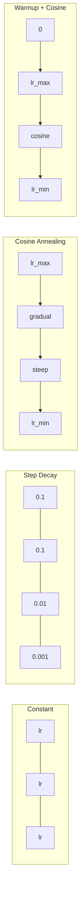
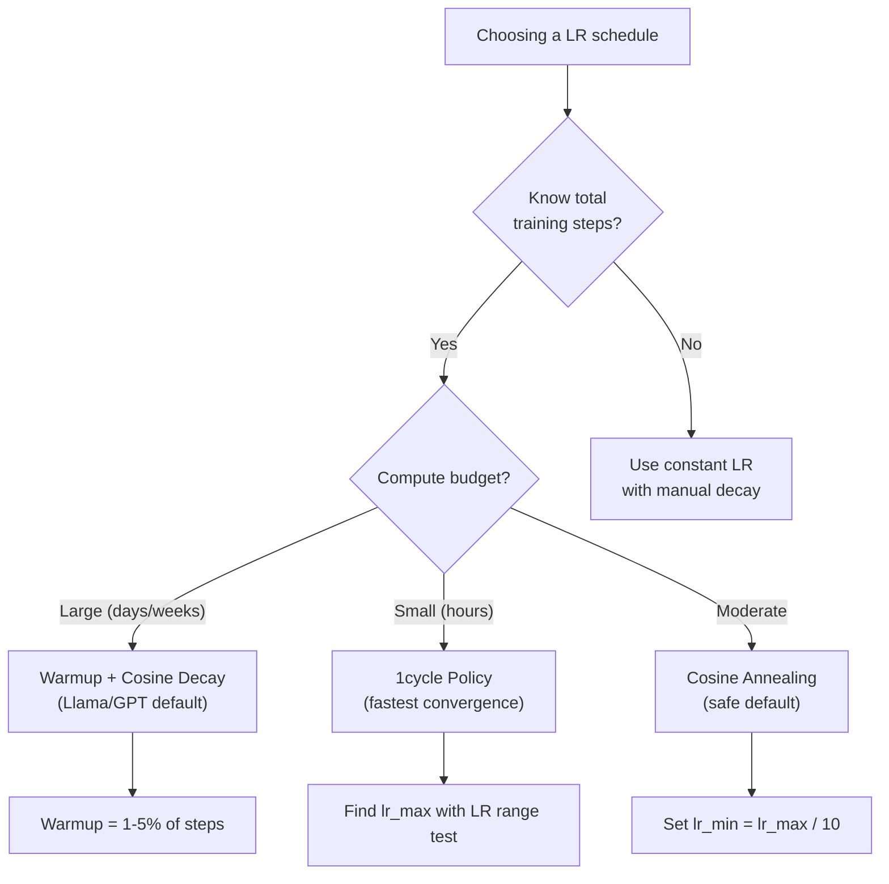
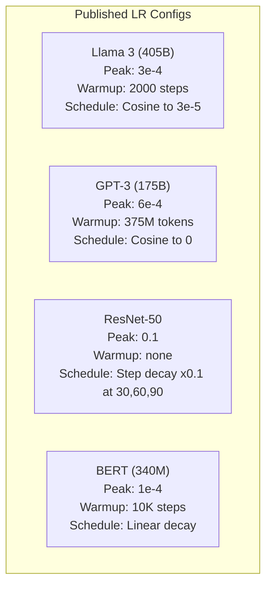

# Lịch trình học tập và sự ấm áp

> Tốc độ học là một siêu tham số quan trọng nhất không phải là kiến trúc không phải là kích thước tập dữ liệu không phải là chức năng kích hoạt

**类型：**构建
**语言：**Python
**先修：**Bài học 03.06 (Tối ưu hóa), Bài học 03.08 (Tạo ra trọng lượng)
**时间：**约90分钟

## Học mục tiêu

- Từ zero thực hiện liên tục, giai đoạn phân rã, cousin annealing, warmup + coisin và 1 chu kỳ học tập tốc độ lịch trình
- 演示 học tập 选择的三种失败模式: phân biệt (over high) 停滞 (over low) 振荡 (over low) 没有衰退 (không suy giảm)
- Giải thích tại sao Optimizer dựa trên Adam cần được nóng lên, cũng như làm thế nào để ổn định các bài tập sớm
- Trong cùng một nhiệm vụ so sánh tốc độ hội tụ của tất cả năm chương trình, và cho một ngân sách đào tạo nhất định  chọn lịch trình phù hợp

## 问题

Đặt tốc độ học tập 设为0.1── luyện tập sẽ khác nhau -- Loss trong 3 bước nhảy đến vô hạn 设为0.0001── luyện tập sẽ chậm trễ trượt -- sau 100 kỷ nguyên 模型 几乎 vẫn còn ở trạng thái tự nhiên 设为0.01── luyện tập trong 50 kỷ nguyên trước có hiệu quả, sau đó Loss 会 ở mức tối thiểu mãi mãi  dao động gần, vì các bước quá lớn──

Tỷ lệ học tập tối ưu không phải là con số thường xuyên. Nó sẽ thay đổi trong quá trình đào tạo.

Trong suốt 3 năm qua, mỗi mô hình chính thức đã sử dụng lịch trình tốc độ học tập. Llama 3 sử dụng đỉnh lr=3e-4,2000 个升温步骤,并通过宇宙衰退 衰减到3e-5―GPT-3 sử dụng lr=6e-4, và 375 triệu mã thông báo lên để làm nóng lên.

Bạn cần hiểu lịch trình, vì giá trị mặc định không nhất thiết phù hợp với vấn đề của bạn. Khi bạn điều chỉnh tốt một mô hình được đào tạo trước, lịch trình chính xác không giống như từ 0 đào tạo. Khi bạn tăng kích thước lô, thời gian nóng lên cũng cần thay đổi. Khi đào tạo ở bước 10.000 崩, bạn cần biết đó là lịch trình.

## 概念

### Tốc độ học tập liên tục

Cách đơn giản nhất là chọn một số, mỗi bước đều dùng nó.

```
lr(t) = lr_0
```

很少是最优的──它要么对训练末期来说太高 (((在最小 附近振荡),要么对训练初步来说太低 ((在小步上浪费计算) ⋅对小模型和调试来说也可以──对任何需要训练超过一小时的任务都是糟糕的选择──

### Bước phân rã

Từ ResNet 时代的老派方法──在固定 epochs 处按某个因素通常是10x) giảm tốc độ học hỏi──

```
lr(t) = lr_0 * gamma^(floor(epoch / step_size))
```

Trong đó gamma = 0.1 và step_size = 30 biểu hiện: lr Mỗi 30 thời đại  giảm 10x。ResNet-50 đã sử dụng này -- lr=0.1, trong thời đại 30、60 和 90 时 giảm 10x。

问题是: Optimal decay 点 phụ thuộc vào bộ dữ liệu và kiến trúc. 换到另一个问题,就需要重新调调什么时候降低. 转变也很突然.

### Cosine Annealing

Theo đường cong cosine, từ tỷ lệ học tập tối đa xuống mức tối thiểu:

```
lr(t) = lr_min + 0.5 * (lr_max - lr_min) * (1 + cos(pi * t / T))
```

Trong đó, t là bước trước, T là tất cả các bước số.

Khi t=0 时,cosine 项为1,所以 lr = lr_max──当 t=T 时,cosine 项为 -1,所以 lr = lr_min──decay 一开始很平缓,中间加速,接近末尾时再次变得平缓──

Đây là lựa chọn mặc định của hầu hết các bài tập hiện đại. Ngoài lr_max và lr_min 之外 không cần điều chỉnh các siêu tham số.

### Tại sao lại bắt đầu từ nhỏ?

Adam 和其他适应优化器 会维护 Gradient mean 和变量运行估计――在步骤 0,这些估计被初始化为零――最初几次 Gradient updates 基于很差的统计量――如果你的学习率在此段时间很大,模型会迈出巨大且方向不佳的步子――

Nhiệt độ có thể sửa chữa vấn đề này. Trước tiên từ một tốc độ học tập rất nhỏ  bắt đầu (thường là lr_max / warmup_steps, thậm chí là cho không), và sau đó tăng thẳng thắn trong các bước N trước đến lr_max.

```
lr(t) = lr_max * (t / warmup_steps)     for t < warmup_steps
```

Tiêu chuẩn nóng lên: tổng tập luyện bước 1-5%。Llama 3 训练 khoảng 1,8 nghìn tỷ token,并 nóng lên 已 2000 bước。GPT-3 在 375 triệu token 上进行了热升──

### Sự nóng lên tuyến tính + sự phân rã của cosine

现代默认方案──先线性升级, sau đó sử dụng sự phân rã của cosine:

```
if t < warmup_steps:
    lr(t) = lr_max * (t / warmup_steps)
else:
    progress = (t - warmup_steps) / (total_steps - warmup_steps)
    lr(t) = lr_min + 0.5 * (lr_max - lr_min) * (1 + cos(pi * progress))
```

Đây là Llama, GPT, PaLM và hầu hết các nhà biến đổi hiện đại sử dụng các phương pháp.

### Chính sách chu kỳ 1

Phát hiện của Leslie Smith: Trong nửa đầu tập luyện tăng tốc độ học tập từ mức giá thấp lên mức cao, và trong nửa cuối giảm dần.

理论是: Tốc độ học tập cao 会通过向优化轨迹中加入噪音来起起规范作用――模型 在升级阶段会探索更多损失景观,从而找到更好的盆地――然后在升级阶段在找到最佳盆地进行精炼――

```
Phase 1 (0 to T/2):    lr ramps from lr_max/25 to lr_max
Phase 2 (T/2 to T):    lr ramps from lr_max to lr_max/10000
```

Trong ngân sách tính toán cố định, vòng 1 thường tập nhanh hơn so với việc xoay xích cosine.

### Bảng hình



### 决策流程图



### 已发表的模型 中的真实数值




```figure
lr-schedule
```

##  xây dựng nó

### 步骤 1:Công việc lịch trình

Mỗi hàm 接收当前步骤,并返回该步骤的学习率──

```python
import math


def constant_schedule(step, lr=0.01, **kwargs):
    return lr


def step_decay_schedule(step, lr=0.1, step_size=100, gamma=0.1, **kwargs):
    return lr * (gamma ** (step // step_size))


def cosine_schedule(step, lr=0.01, total_steps=1000, lr_min=1e-5, **kwargs):
    if step >= total_steps:
        return lr_min
    return lr_min + 0.5 * (lr - lr_min) * (1 + math.cos(math.pi * step / total_steps))


def warmup_cosine_schedule(step, lr=0.01, total_steps=1000, warmup_steps=100, lr_min=1e-5, **kwargs):
    if total_steps <= warmup_steps:
        return lr * (step / max(warmup_steps, 1))
    if step < warmup_steps:
        return lr * step / warmup_steps
    progress = (step - warmup_steps) / (total_steps - warmup_steps)
    return lr_min + 0.5 * (lr - lr_min) * (1 + math.cos(math.pi * progress))


def one_cycle_schedule(step, lr=0.01, total_steps=1000, **kwargs):
    mid = max(total_steps // 2, 1)
    if step < mid:
        return (lr / 25) + (lr - lr / 25) * step / mid
    else:
        progress = (step - mid) / max(total_steps - mid, 1)
        return lr * (1 - progress) + (lr / 10000) * progress
```

### 步骤 2:可视化 tất cả các lịch trình

印出一个基于文本的图案,展示每个时间表在训练过程中的变化――

```python
def visualize_schedule(name, schedule_fn, total_steps=500, **kwargs):
    steps = list(range(0, total_steps, total_steps // 20))
    if total_steps - 1 not in steps:
        steps.append(total_steps - 1)

    lrs = [schedule_fn(s, total_steps=total_steps, **kwargs) for s in steps]
    max_lr = max(lrs) if max(lrs) > 0 else 1.0

    print(f"\n{name}:")
    for s, lr_val in zip(steps, lrs):
        bar_len = int(lr_val / max_lr * 40)
        bar = "#" * bar_len
        print(f"  Step {s:4d}: lr={lr_val:.6f} {bar}")
```

### 步骤 3: Training Network

Trong tập dữ liệu vòng tròn trên sử dụng một mạng hai tầng đơn giản, giống như vài lớp trước, nhưng lần này chúng tôi thay đổi lịch trình.

```python
import random


def sigmoid(x):
    x = max(-500, min(500, x))
    return 1.0 / (1.0 + math.exp(-x))


def relu(x):
    return max(0.0, x)


def relu_deriv(x):
    return 1.0 if x > 0 else 0.0


def make_circle_data(n=200, seed=42):
    random.seed(seed)
    data = []
    for _ in range(n):
        x = random.uniform(-2, 2)
        y = random.uniform(-2, 2)
        label = 1.0 if x * x + y * y < 1.5 else 0.0
        data.append(([x, y], label))
    return data


def train_with_schedule(schedule_fn, schedule_name, data, epochs=300, base_lr=0.05, **kwargs):
    random.seed(0)
    hidden_size = 8
    total_steps = epochs * len(data)

    std = math.sqrt(2.0 / 2)
    w1 = [[random.gauss(0, std) for _ in range(2)] for _ in range(hidden_size)]
    b1 = [0.0] * hidden_size
    w2 = [random.gauss(0, std) for _ in range(hidden_size)]
    b2 = 0.0

    step = 0
    epoch_losses = []

    for epoch in range(epochs):
        total_loss = 0
        correct = 0

        for x, target in data:
            lr = schedule_fn(step, lr=base_lr, total_steps=total_steps, **kwargs)

            z1 = []
            h = []
            for i in range(hidden_size):
                z = w1[i][0] * x[0] + w1[i][1] * x[1] + b1[i]
                z1.append(z)
                h.append(relu(z))

            z2 = sum(w2[i] * h[i] for i in range(hidden_size)) + b2
            out = sigmoid(z2)

            error = out - target
            d_out = error * out * (1 - out)

            for i in range(hidden_size):
                d_h = d_out * w2[i] * relu_deriv(z1[i])
                w2[i] -= lr * d_out * h[i]
                for j in range(2):
                    w1[i][j] -= lr * d_h * x[j]
                b1[i] -= lr * d_h
            b2 -= lr * d_out

            total_loss += (out - target) ** 2
            if (out >= 0.5) == (target >= 0.5):
                correct += 1
            step += 1

        avg_loss = total_loss / len(data)
        accuracy = correct / len(data) * 100
        epoch_losses.append(avg_loss)

    return epoch_losses
```

### 步骤 4: So sánh tất cả các lịch trình

Sử dụng mỗi lịch trình  luyện tập cùng một mạng,并 so sánh Loss và hội tụ cuối cùng  hành vi.

```python
def compare_schedules(data):
    configs = [
        ("Constant", constant_schedule, {}),
        ("Step Decay", step_decay_schedule, {"step_size": 15000, "gamma": 0.1}),
        ("Cosine", cosine_schedule, {"lr_min": 1e-5}),
        ("Warmup+Cosine", warmup_cosine_schedule, {"warmup_steps": 3000, "lr_min": 1e-5}),
        ("1cycle", one_cycle_schedule, {}),
    ]

    print(f"\n{'Schedule':<20} {'Start Loss':>12} {'Mid Loss':>12} {'End Loss':>12} {'Best Loss':>12}")
    print("-" * 70)

    for name, schedule_fn, extra_kwargs in configs:
        losses = train_with_schedule(schedule_fn, name, data, epochs=300, base_lr=0.05, **extra_kwargs)
        mid_idx = len(losses) // 2
        best = min(losses)
        print(f"{name:<20} {losses[0]:>12.6f} {losses[mid_idx]:>12.6f} {losses[-1]:>12.6f} {best:>12.6f}")
```

### 步骤 5:LR 过高 vs 过低

演示三种失败模式: quá cao (过高) 

```python
def lr_sensitivity(data):
    learning_rates = [1.0, 0.1, 0.01, 0.001, 0.0001]

    print("\nLR Sensitivity (constant schedule, 100 epochs):")
    print(f"  {'LR':>10} {'Start Loss':>12} {'End Loss':>12} {'Status':>15}")
    print("  " + "-" * 52)

    for lr in learning_rates:
        losses = train_with_schedule(constant_schedule, f"lr={lr}", data, epochs=100, base_lr=lr)
        start = losses[0]
        end = losses[-1]

        if end > start or math.isnan(end) or end > 1.0:
            status = "DIVERGED"
        elif end > start * 0.9:
            status = "BARELY MOVED"
        elif end < 0.15:
            status = "CONVERGED"
        else:
            status = "LEARNING"

        end_str = f"{end:.6f}" if not math.isnan(end) else "NaN"
        print(f"  {lr:>10.4f} {start:>12.6f} {end_str:>12} {status:>15}")
```

## Sử dụng nó

PyTorch ở `torch.optim.lr_scheduler`Trong cung cấp lịch trình:

```python
import torch
import torch.optim as optim
from torch.optim.lr_scheduler import CosineAnnealingLR, OneCycleLR, StepLR

model = nn.Sequential(nn.Linear(10, 64), nn.ReLU(), nn.Linear(64, 1))
optimizer = optim.Adam(model.parameters(), lr=3e-4)

scheduler = CosineAnnealingLR(optimizer, T_max=1000, eta_min=1e-5)

for step in range(1000):
    loss = train_step(model, optimizer)
    scheduler.step()
```

Đối với warmup + cosine, sử dụng lambda scheduler, hoặc sử dụng HuggingFace của `get_cosine_schedule_with_warmup`- Có thể là:

```python
from transformers import get_cosine_schedule_with_warmup

scheduler = get_cosine_schedule_with_warmup(
    optimizer,
    num_warmup_steps=2000,
    num_training_steps=100000,
)
```

HuggingFace là hầu hết các kịch bản chỉnh sửa tinh tế Llama và GPT 使用方案──拿不准时, sử dụng warmup + cosine,并将暖化 设为总步骤的 3-5%── nó hầu như phù hợp với tất cả các tình huống──

## 交付 nó

本课会产出:
- `outputs/prompt-lr-schedule-advisor.md`-- Một lời nhắc, để sử dụng theo thiết lập tập luyện của bạn đề xuất phù hợp với thời gian học và các tham số siêu

## 练习

1. 实现 tăng trưởng phân rã:lr(t) = lr_0 * gamma^t, trong đó gamma = 0,999── trên bộ dữ liệu vòng tròn 上与 cosine annealing 比较──

2. 实现学习率范围测试(Leslie Smith):训练几百步,同时将 LR từ 1e-7指数增加到1──绘制 Loss vs LR──最优最大 LR 位于 Loss 开始增加之前──

3. Sử dụng ấm lên + cosine  luyện tập, nhưng thay đổi ấm lên 长度:总步骤的 0%、1%、5%、10%、20%── tìm được điểm ngọt nhất của luyện tập.

4. 实现带热启动的共体缩 (Cosine annealing) (SGDR): mỗi bước T sẽ tăng tốc độ học tập lên lr_max, sau đó giảm lại.

5. Xây dựng một bác sĩ phẫu thuật lịch trình, giám sát đào tạo Loss, và Loss 稳定时自动 từ nóng lên 转换到阴; nếu Loss cao nguyên 太久,则降低 lr。

## 关键术语

| Term | 人们通常怎么说 | 它真正的含义 |
|------|----------------|----------------------|
| Learning rate | “model 学得有多快” | 用来乘以 Gradient、决定参数更新大小的标量 |
| Schedule | “随时间改变 LR” | 将 training step 映射到 learning rate 的 function，旨在优化 convergence |
| Warmup | “从小 LR 开始” | 在最初 N steps 中，将 LR 从接近零 linearly ramp 到目标值，以稳定 Optimizer 统计量 |
| Cosine annealing | “平滑 LR decay” | 在训练过程中，让 LR 按 cosine 曲线从 lr_max 降低到 lr_min |
| Step decay | “在 milestones 降低 LR” | 在固定 epoch intervals，将 LR 乘以一个因子（通常是 0.1） |
| 1cycle policy | “先上后下” | Leslie Smith 的方法：在单个 cycle 中将 LR 先 ramp up 再 ramp down，以获得更快 convergence |
| LR range test | “找到最佳 learning rate” | 在短时间训练中逐步增加 LR，以找到 Loss 开始 diverge 的数值 |
| Cosine with warm restarts | “重置并重复” | 周期性地将 LR 重置为 lr_max，并再次 decay（SGDR） |
| Eta min | “LR 的下限” | schedule 最终 decay 到的最小 learning rate |
| Peak learning rate | “最大 LR” | 训练过程中达到的最高 LR，通常出现在 warmup 之后 |

## 延伸阅读

- Loshchilov & Hutter, "SGDR: Stochastic Gradient Descent with Warm Restarts" (2017) -- 引入了 cosine annealing 和 warm restarts
- Smith, "Super-Convergence: Trình đào tạo rất nhanh của mạng thần kinh sử dụng tỷ lệ học tập lớn" (2018) -- 1cycle policy 论文
- Touvron et al., "Llama 2: Open Foundation and Fine-Tuned Chat Models" (2023) -- 记录了大规模使用的热升+côsinet
- Goyal et al., "Sự chính xác, Sản lượng nhỏ lớn SGD: Training ImageNet trong 1 giờ" (2017) -- training of large batch 的 linear scaling rule 和 warmup
