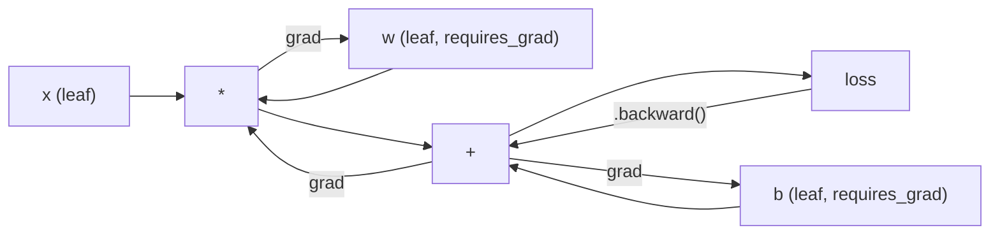
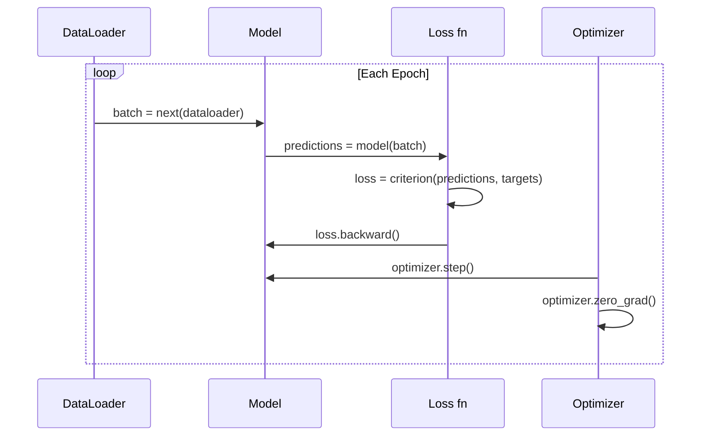

# PyTorch vào

> Anh đã tạo ra một động cơ với cỡ xích và cỡ xích. Bây giờ hãy học cách để tìm ra một chiếc máy mà mọi người sẽ thực sự mở.

**Type:** Build
**Languages:** Python
**Prerequisites:** Lesson 03.10 (Build Your Own Mini Framework)
**Time:** ~75 minutes

## Học mục tiêu
- Sử dụng PyTorch của nn.Module、nn.Sequential 和 autograd 构建并训练 Neural Network
- Sử dụng PyTorch Tensor、GPU 加速,以及标准训练循环(zero_grad、forward、loss、backward、step)
- Chuyển đổi các bộ phận cấu trúc nhỏ của bạn từ không thực hiện thành đối ứng PyTorch và các giá như thực hiện
- Trong cùng nhiệm vụ hồ sơ và so sánh khuôn khổ Python tinh khiết của bạn với tốc độ đào tạo của PyTorch

## 问题
Bạn đã có một framework mini có thể làm việc. Lớp đường thẳng, ReLU, drop-out, batch standard, Adam, DataLoader, một vòng tròn tập luyện. Nó có thể sử dụng Python trong việc phân loại hình tròn để tập luyện một mạng lưới 4 tầng.

Nhưng trên cùng một vấn đề, nó cũng chậm hơn PyTorch 500 lần.

Bạn sử dụng các framework nhỏ sử dụng các bản nắp Python 循环 một lần xử lý một mẫu. PyTorch sẽ phân phối cùng một hoạt động cho các lõi C++/CUDA được tối ưu hóa, và chạy trên GPU.

速度不是唯一差距──你的框架 没有 GPU 支持──没有自动区分你为每个模块写回来了()──没有序列化──没有分布式训练──没有混合精度──除了打印 语句,没有办法调试 Gradient flow──

PyTorch đã hoàn thành tất cả những thiếu sót này. Nó còn giữ lại mô hình tâm trí hoàn toàn giống như bạn đã xây dựng: mô-đun, tiến lên, tham số, trở lại, tối ưu hóa. bước đi.

## 概念
### Tại sao PyTorch thắng

Năm 2015, TensorFlow  yêu cầu bạn đang chạy bất kỳ nội dung nào trước tiên xác định một biểu đồ tính toán tĩnh. Bạn xây dựng biểu đồ, biên dịch nó, sau đó đưa dữ liệu vào đó.

PyTorch được phát hành vào năm 2017, đã áp dụng các ý tưởng khác nhau: thực hiện nhiệt tình.`y = model(x)`会真的立刻计算 y, thay vì 给稍后才会计算 y 的图表 添加一个节点──这意味着标准 Python debugging 工具都能工作──打印() 能工作──pdb 能工作──前进通过 里 if/else 能工作──

Đến năm 2020, thị trường đã đưa ra câu trả lời. Phân tích của PyTorch trong các bài nghiên cứu ML tăng từ 7% (được tăng từ năm 2017) lên hơn 75% (được tăng từ năm 2022): Meta, Google DeepMind, OpenAI, Anthropic và Hugging Face đều coi PyTorch là một framework chính.

Điều quan trọng của bài học: kinh nghiệm phát triển sẽ tăng lợi nhuận. Một chậm 10% nhưng debug 快 50% của khung, mỗi lần đều sẽ thắng.

### Các tensor

Năng lực là một số đa chiều, có ba thuộc tính quan trọng: hình dạng, dtype và thiết bị.

```python
import torch

x = torch.zeros(3, 4)           # shape: (3, 4), dtype: float32, device: cpu
x = torch.randn(2, 3, 224, 224) # batch of 2 RGB images, 224x224
x = torch.tensor([1, 2, 3])     # from a Python list
```

**Shape**biểu tượng của hình dạng là (), Dấu vector là (n,), Matrix là (m, n), một loạt hình ảnh là (chất, kênh, chiều cao, chiều rộng)

**Dtype**控制精度和内存──

| dtype | Bits | Range | Use case |
|-------|------|-------|----------|
| float32 | 32 | ~7 位十进制数字 | 默认训练 |
| float16 | 16 | ~3.3 位十进制数字 | Mixed precision |
| bfloat16 | 16 | 与 float32 相同的范围，精度更低 | LLM 训练 |
| int8 | 8 | -128 到 127 | Quantized inference |

**Device**quyết định tính toán xảy ra ở đâu.

```python
device = torch.device("cuda" if torch.cuda.is_available() else "cpu")
x = torch.randn(3, 4, device=device)
x = x.to("cuda")
x = x.cpu()
```

Mỗi hoạt động đều yêu cầu tất cả các Tensor nằm trên cùng một thiết bị trên. Đây là lỗi PyTorch thường gặp nhất của học sinh mới:`RuntimeError: Expected all tensors to be on the same device`❖ Phương pháp sửa chữa là tính trước khi di chuyển tất cả nội dung vào cùng một thiết bị.

**Reshaping**Đó là một số lượng thời gian thường xuyên mà nó thay đổi là metadata, chứ không phải dữ liệu.

```python
x = torch.randn(2, 3, 4)
x.view(2, 12)      # reshape to (2, 12) -- must be contiguous
x.reshape(6, 4)    # reshape to (6, 4) -- works always
x.permute(2, 0, 1) # reorder dimensions
x.unsqueeze(0)     # add dimension: (1, 2, 3, 4)
x.squeeze()        # remove size-1 dimensions
```

### Autograd

Bạn của mini framework  yêu cầu bạn cho mỗi mô-đun  thực hiện ngược lại() ――PyTorch không cần── nó sẽ đặt Tensor trên mỗi hoạt động ghi lại vào một biểu đồ trục trặc hướng dẫn (acyclic graph) trong, sau đó ngược hướng xuyên qua biểu đồ này, tự động tính toán Gradient。



Với khung của bạn: PyTorch sử dụng tự động hóa dựa trên băng. Mỗi hoạt động đều được thêm vào một bài trong quá trình chuyển tiếp.`.backward()`Tôi sẽ quay lại để xem lại đoạn băng này.

```python
x = torch.randn(3, requires_grad=True)
y = x ** 2 + 3 * x
z = y.sum()
z.backward()
print(x.grad)  # dz/dx = 2x + 3
```

Autograd 的三条规则:

1. Chỉ có một cái gì đó`requires_grad=True`của lá Tensor 会累积 Gradient
2. Gradient 默认会累积 mỗi lần ngược đi 前调用 `optimizer.zero_grad()`
3. `torch.no_grad()`会禁用 Trình theo dõi cấp độ (在评估期间使用)

### nn.Mô-đun

`nn.Module`Đây là một phần của các mô hình của các mạng Neural trong PyTorch. Bạn đã xây dựng được mô hình này trong Bài học 10. Phiên bản của PyTorch đã tăng thêm đăng ký tham số tự động, phát hiện mô-đun tái phát, quản lý thiết bị và định kỳ định kỳ trạng thái.

```python
import torch.nn as nn

class MLP(nn.Module):
    def __init__(self, input_dim, hidden_dim, output_dim):
        super().__init__()
        self.layer1 = nn.Linear(input_dim, hidden_dim)
        self.relu = nn.ReLU()
        self.layer2 = nn.Linear(hidden_dim, output_dim)

    def forward(self, x):
        x = self.layer1(x)
        x = self.relu(x)
        x = self.layer2(x)
        return x
```

Khi em ở đây`__init__`Trong một cái`nn.Module`Hoặc`nn.Parameter`Khi tính năng được gán, PyTorch sẽ tự động đăng ký nó.`model.parameters()`Sẽ quay lại thu thập từng tham số đã đăng ký. Đó là lý do tại sao bạn không cần phải thu thập trọng lượng như trong khung mini.

Các khối xây dựng:

| Module | What it does | Parameters |
|--------|-------------|------------|
| nn.Linear(in, out) | Wx + b | in*out + out |
| nn.Conv2d(in_ch, out_ch, k) | 2D convolution | in_ch*out_ch*k*k + out_ch |
| nn.BatchNorm1d(features) | Normalize activations | 2 * features |
| nn.Dropout(p) | Random zeroing | 0 |
| nn.ReLU() | max(0, x) | 0 |
| nn.GELU() | Gaussian error linear | 0 |
| nn.Embedding(vocab, dim) | Lookup table | vocab * dim |
| nn.LayerNorm(dim) | Per-sample normalization | 2 * dim |

### Các chức năng mất mát và Optimizers

PyTorch tự mang lại phiên bản sẵn sàng sản xuất của tất cả nội dung bạn đã xây dựng.

**Loss functions**(từ `torch.nn`):

| Loss | Task | Input |
|------|------|-------|
| nn.MSELoss() | Regression | 任意 shape |
| nn.CrossEntropyLoss() | Multi-class classification | Logits（不是 softmax） |
| nn.BCEWithLogitsLoss() | Binary classification | Logits（不是 sigmoid） |
| nn.L1Loss() | Regression（robust） | 任意 shape |
| nn.CTCLoss() | Sequence alignment | Log probabilities |

chú ý:`CrossEntropyLoss`内部组合了 `LogSoftmax`+ `NLLLoss`                                                                                                                                                                                                                                                              

**Optimizers**(từ `torch.optim`):

| Optimizer | When to use | Typical LR |
|-----------|-------------|-----------|
| SGD(params, lr, momentum) | CNNs、调优良好的 pipelines | 0.01--0.1 |
| Adam(params, lr) | 默认起点 | 1e-3 |
| AdamW(params, lr, weight_decay) | Transformers、fine-tuning | 1e-4--1e-3 |
| LBFGS(params) | Small-scale、second-order | 1.0 |

### Lòng huấn luyện

Mỗi vòng đào tạo PyTorch đều theo cùng một mô hình 5 bước.



规范模式:

```python
for epoch in range(num_epochs):
    model.train()
    for inputs, targets in train_loader:
        inputs, targets = inputs.to(device), targets.to(device)
        optimizer.zero_grad()
        outputs = model(inputs)
        loss = criterion(outputs, targets)
        loss.backward()
        optimizer.step()
```

vòng hàng 内部五行──训练出 GPT-4、Stable Diffusion 和 LLaMA 的也是这五行──架构 会变──数据 会变──这五行不会变──

### Dataset và DataLoader

PyTorch của `Dataset`là một lớp trừu tượng có hai phương pháp:`__len__`和 `__getitem__``DataLoader`Trong đó bao gồm việc đợt đợt đợt đợt đợt đợt đợt đợt đợt đợt đợt đợt đợt đợt đợt đợt đợt đợt đợt đợt đợt đợt đợt đợt đợt đợt đợt đợt đợt đợt đợt đợt đợt đợt đợt đợt đợt đợt đợt đợt đợt đợt đợt đợt đợt đợt đợt đợt đợt đợt đợt đợt đợt đợt đợt đợt đợt đợt đợt đợt đợt đợt đợt đợt đợt đợt đợt đợt đợt đợt đợt đợt đợt đợt đợt đợt đợt đợt đợt đợt đợt đợt đợt đợt đợt đợt đợt đợt đợt đợt đợt đợt đợt đợt đợt đợt đợt đợt đợt đợt đợt đợt đợt đợt đợt đợt đợt đợt đợt đợt đợt đợt đợt đợt đợt đợt đợt đợt đợt đợt đợt đợt đợt đợt đợt đợt đợt đợt đợt đợt đợt đợt đợt đợt đợt đợt đợt đợt đợt đợt đợt đợt đợt đợt đợt đợt đợt đợt đợt đợt đợt đợt đợt đợt đợt đợt đợt đợt đợt đợt đợt đợt đợt đợt đợt đợt đợt đợt đợt đợt đợt đợt đợt đợt đợt đợt đợt đợt đợt đợt đợt đợt đợt đợt đợt đợt đợt đợt đợt đợt đợt đợt đợt đợt đợt đợt đợt đợt đợt đợt đợt đợt đợt đợt đợt đợt đợt đợt đợt đợt đợt đợt đợt đợt đợt đợt đợt đợt đợt đợt đợt đợt đợt đợt đợt đợt đợt đợt đợt đợt đợt đợt đợt đợt đợt đợt đợt đợt đợt đợt đợt đợt đợt đợt đợt đợt đợt đợt đợt đợt đợt đợt đ

```python
from torch.utils.data import Dataset, DataLoader

class MNISTDataset(Dataset):
    def __init__(self, images, labels):
        self.images = images
        self.labels = labels

    def __len__(self):
        return len(self.labels)

    def __getitem__(self, idx):
        return self.images[idx], self.labels[idx]

loader = DataLoader(dataset, batch_size=64, shuffle=True, num_workers=4)
```

`num_workers=4`会 khởi động 4 quá trình và tải dữ liệu, đồng thời GPU 训练当前批量── trên khối lượng công việc gắn với đĩa, chỉ có một phần này có thể làm cho tốc độ đào tạo tăng gấp đôi──

### Đào tạo GPU

Để chuyển mô hình  chuyển đến GPU:

```python
device = torch.device("cuda" if torch.cuda.is_available() else "cpu")
model = model.to(device)
```

Nó sẽ chuyển lại để chuyển từng tham số và bộ đệm đến GPU. Sau đó trong quá trình tập luyện chuyển từng lô:

```python
inputs, targets = inputs.to(device), targets.to(device)
```

**Mixed precision**会在现代 GPU(A100、H100、RTX 4090) trên把内存使用减半、吞吐量翻倍:前后使用浮16 运行,同时重量保持在浮32:

```python
from torch.amp import autocast, GradScaler

scaler = GradScaler()
for inputs, targets in loader:
    with autocast(device_type="cuda"):
        outputs = model(inputs)
        loss = criterion(outputs, targets)
    scaler.scale(loss).backward()
    scaler.step(optimizer)
    scaler.update()
    optimizer.zero_grad()
```

### Đối với: Mini Framework vs PyTorch vs JAX

| Feature | Mini Framework (L10) | PyTorch | JAX |
|---------|---------------------|---------|-----|
| Autodiff | Manual backward() | Tape-based autograd | Functional transforms |
| Execution | Eager（Python loops） | Eager（C++ kernels） | Traced + JIT compiled |
| GPU support | 无 | 有（CUDA、ROCm、MPS） | 有（CUDA、TPU） |
| Speed (MNIST MLP) | ~300s/epoch | ~0.5s/epoch | ~0.3s/epoch |
| Module system | Custom Module class | nn.Module | Stateless functions（Flax/Equinox） |
| Debugging | print() | print()、pdb、breakpoint() | 更难（JIT tracing 会破坏 print） |
| Ecosystem | 无 | Hugging Face、Lightning、timm | Flax、Optax、Orbax |
| Learning curve | 你已经构建过它 | 中等 | 陡峭（functional paradigm） |
| Production use | Toy problems | Meta、OpenAI、Anthropic、HF | Google DeepMind、Midjourney |


```figure
dropout-mask
```

##  xây dựng nó
Một chỉ sử dụng PyTorch nguyên thủy trong MNIST trên đào tạo của 3 lớp MLP. Không có bao cao cấp. Không có.`torchvision.datasets`◊ 我们自己下载并解析 raw data──

### 步骤 1: Từ file gốc tải MNIST

MNIST 以 4 个 gziped file 发布: training images(60,000 x 28 x 28)  training labels、test images(10,000 x 28 x 28)  test labels──我们下载它们并解析二进制形式──

```python
import torch
import torch.nn as nn
import struct
import gzip
import urllib.request
import os

def download_mnist(path="./mnist_data"):
    base_url = "https://storage.googleapis.com/cvdf-datasets/mnist/"
    files = [
        "train-images-idx3-ubyte.gz",
        "train-labels-idx1-ubyte.gz",
        "t10k-images-idx3-ubyte.gz",
        "t10k-labels-idx1-ubyte.gz",
    ]
    os.makedirs(path, exist_ok=True)
    for f in files:
        filepath = os.path.join(path, f)
        if not os.path.exists(filepath):
            urllib.request.urlretrieve(base_url + f, filepath)

def load_images(filepath):
    with gzip.open(filepath, "rb") as f:
        magic, num, rows, cols = struct.unpack(">IIII", f.read(16))
        data = f.read()
        images = torch.frombuffer(bytearray(data), dtype=torch.uint8)
        images = images.reshape(num, rows * cols).float() / 255.0
    return images

def load_labels(filepath):
    with gzip.open(filepath, "rb") as f:
        magic, num = struct.unpack(">II", f.read(8))
        data = f.read()
        labels = torch.frombuffer(bytearray(data), dtype=torch.uint8).long()
    return labels
```

### 步骤 2: Định nghĩa mô hình

Một MLP 3 tầng:784 -> 256 -> 128 -> 10。 ReLU kích hoạt。 dùng Droput làm quy định。 Để giữ đơn giản, không sử dụng batch chuẩn。

```python
class MNISTModel(nn.Module):
    def __init__(self):
        super().__init__()
        self.net = nn.Sequential(
            nn.Linear(784, 256),
            nn.ReLU(),
            nn.Dropout(0.2),
            nn.Linear(256, 128),
            nn.ReLU(),
            nn.Dropout(0.2),
            nn.Linear(128, 10),
        )

    def forward(self, x):
        return self.net(x)
```

lớp đầu ra tạo ra 10 logit nguyên liệu ((mỗi chữ số một) ―― không sử dụng softmax`CrossEntropyLoss`Sẽ được xử lý bên trong.

Số lượng tham số:784*256 + 256 + 256*128 + 128 + 128*10 + 10 = 235.146。 theo tiêu chuẩn hiện đại nhìn rất nhỏ。 GPT-2 nhỏ có 124M。 mô hình này chỉ trong vài giây mới hoàn thành bài tập。

### 步骤 3: Loop đào tạo

规范的前进损失后退步模式

```python
def train_one_epoch(model, loader, criterion, optimizer, device):
    model.train()
    total_loss = 0
    correct = 0
    total = 0
    for images, labels in loader:
        images, labels = images.to(device), labels.to(device)
        optimizer.zero_grad()
        outputs = model(images)
        loss = criterion(outputs, labels)
        loss.backward()
        optimizer.step()
        total_loss += loss.item() * images.size(0)
        _, predicted = outputs.max(1)
        correct += predicted.eq(labels).sum().item()
        total += labels.size(0)
    return total_loss / total, correct / total


def evaluate(model, loader, criterion, device):
    model.eval()
    total_loss = 0
    correct = 0
    total = 0
    with torch.no_grad():
        for images, labels in loader:
            images, labels = images.to(device), labels.to(device)
            outputs = model(images)
            loss = criterion(outputs, labels)
            total_loss += loss.item() * images.size(0)
            _, predicted = outputs.max(1)
            correct += predicted.eq(labels).sum().item()
            total += labels.size(0)
    return total_loss / total, correct / total
```

注意 đánh giá 期间 `torch.no_grad()`Nó sẽ tắt tự cấp, giảm sử dụng bộ nhớ và tăng tốc suy luận. Không có nó, PyTorch sẽ xây dựng một biểu đồ tính toán mà bạn không sử dụng.

### Bước 4: Đưa tất cả các phần kết nối lên

```python
def main():
    device = torch.device("cuda" if torch.cuda.is_available() else "cpu")

    download_mnist()
    train_images = load_images("./mnist_data/train-images-idx3-ubyte.gz")
    train_labels = load_labels("./mnist_data/train-labels-idx1-ubyte.gz")
    test_images = load_images("./mnist_data/t10k-images-idx3-ubyte.gz")
    test_labels = load_labels("./mnist_data/t10k-labels-idx1-ubyte.gz")

    train_dataset = torch.utils.data.TensorDataset(train_images, train_labels)
    test_dataset = torch.utils.data.TensorDataset(test_images, test_labels)
    train_loader = torch.utils.data.DataLoader(
        train_dataset, batch_size=64, shuffle=True
    )
    test_loader = torch.utils.data.DataLoader(
        test_dataset, batch_size=256, shuffle=False
    )

    model = MNISTModel().to(device)
    criterion = nn.CrossEntropyLoss()
    optimizer = torch.optim.Adam(model.parameters(), lr=1e-3)

    num_params = sum(p.numel() for p in model.parameters())
    print(f"Device: {device}")
    print(f"Parameters: {num_params:,}")
    print(f"Train samples: {len(train_dataset):,}")
    print(f"Test samples: {len(test_dataset):,}")
    print()

    for epoch in range(10):
        train_loss, train_acc = train_one_epoch(
            model, train_loader, criterion, optimizer, device
        )
        test_loss, test_acc = evaluate(
            model, test_loader, criterion, device
        )
        print(
            f"Epoch {epoch+1:2d} | "
            f"Train Loss: {train_loss:.4f} | Train Acc: {train_acc:.4f} | "
            f"Test Loss: {test_loss:.4f} | Test Acc: {test_acc:.4f}"
        )

    torch.save(model.state_dict(), "mnist_mlp.pt")
    print(f"\nModel saved to mnist_mlp.pt")
    print(f"Final test accuracy: {test_acc:.4f}")
```

10 个时代 后的预期输出:~97.8% test accuracy──CPU 上训练时间:~30秒──GPU 上:~5秒──使用相同的架构你的迷你框架:~45 分钟──

## Sử dụng nó
### 快速对比: Mini Framework vs PyTorch

| Mini Framework (Lesson 10) | PyTorch |
|---------------------------|---------|
| `model = Sequential(Linear(784, 256), ReLU(), ...)` | `model = nn.Sequential(nn.Linear(784, 256), nn.ReLU(), ...)` |
| `pred = model.forward(x)` | `pred = model(x)` |
| `optimizer.zero_grad()` | `optimizer.zero_grad()` |
| `grad = criterion.backward()` then `model.backward(grad)` | `loss.backward()` |
| `optimizer.step()` | `optimizer.step()` |
| 无 GPU | `model.to("cuda")` |
| 每个 module 都要手写 backward | Autograd 处理所有内容 |

giao diện gần như hoàn toàn giống nhau.

### Tiết kiệm và tải mô hình

```python
torch.save(model.state_dict(), "model.pt")

model = MNISTModel()
model.load_state_dict(torch.load("model.pt", weights_only=True))
model.eval()
```

始终保存 `state_dict()`(Parameter Dictionary), thay vì đối tượng mô hình.

### Lập trình học tập

```python
scheduler = torch.optim.lr_scheduler.CosineAnnealingLR(
    optimizer, T_max=10
)
for epoch in range(10):
    train_one_epoch(model, train_loader, criterion, optimizer, device)
    scheduler.step()
```

PyTorch tự mang 15+ lịch trình:StepLR、ExponentialLR、CosineAnnealingLR、OneCycleLR、ReduceLROnPlateau── chúng đều có thể kết nối với một giao diện tối ưu hóa──

## 交付 nó
本课会产 xuất hiện từ hai hiện vật:

- `outputs/prompt-pytorch-debugger.md` Được sử dụng để chẩn đoán thường thấy PyTorch  đào tạo thất bại nhanh chóng
- `outputs/skill-pytorch-patterns.md`PyTorch 训练模式的技能参考

## 练习
1. **添加 batch normalization。**Trong mỗi lớp đường thẳng sau khi kích hoạt trước khi`nn.BatchNorm1d`❖ So sánh độ chính xác thử nghiệm và tốc độ đào tạo, với phiên bản sử dụng chỉ để bỏ đi đối chiếu.

2. **实现 learning rate finder。**Sử dụng chỉ số tăng tốc độ học tập( từ 1e-7 đến 1.0) đào tạo một thời đại.

3. **迁移到 GPU 并使用 mixed precision。**Trong vòng đào tạo 中加入 `torch.amp.autocast`和 `GradScaler`△ trên GPU 上测量使用和不使用混合精度 时的吞吐量(样本/秒) ・ trên A100 上, dự đoán khoảng 2x tốc độ。

4. **构建 custom Dataset。**Ưu điểm của bạn là:`__getitem__`和 `__len__`của `FashionMNISTDataset(Dataset)`lớp── đào tạo MLP không tương đương chính xác── thời trang-MNIST 更难预期约88%,而不是~98%──

5. **用 SGD + momentum 替换 Adam。**Sử dụng `SGD(params, lr=0.01, momentum=0.9)`训练――比较 hội tụ cong¬¬ rồi加入 `CosineAnnealingLR`- Đưa ra một thời gian để bắt Adam.

## 关键术语
| Term | What people say | What it actually means |
|------|----------------|----------------------|
| Tensor | “一个多维数组” | 一个有类型、device-aware 的数组，每个操作都内置 automatic differentiation 支持 |
| Autograd | “Automatic backprop” | 一个 tape-based 系统，在 forward pass 期间记录操作，然后反向重放它们以计算精确 Gradient |
| nn.Module | “一个 layer” | 任意 differentiable computation block 的基类——注册 parameters、支持 nesting、处理 train/eval modes |
| state_dict | “model weights” | 一个把 parameter names 映射到 Tensor 的 OrderedDict——trained model 的可移植、可序列化表示 |
| .backward() | “计算 Gradient” | 反向遍历 computational graph，为每个带有 requires_grad=True 的 leaf Tensor 计算并累积 Gradient |
| .to(device) | “移动到 GPU” | 递归地把所有 parameters 和 buffers 转移到指定 device（CPU、CUDA、MPS） |
| DataLoader | “data pipeline” | 一个 iterator，会对来自 Dataset 的数据执行 batching、shuffling，并可选地并行化 data loading |
| Mixed precision | “使用 float16” | 使用 float16 forward/backward 提升速度，同时保留 float32 master weights 以保证 numerical stability |
| Eager execution | “立即运行” | 操作在被调用时立即执行，而不是推迟到之后的 compilation step——这是区分 PyTorch 与 TF 1.x 的核心设计选择 |
| zero_grad | “重置 Gradient” | 在下一次 backward pass 前把所有 parameter gradients 置零，因为 PyTorch 默认会累积 Gradient |

## 延伸阅读
- Paszke et al., PyTorch: Một phong cách bắt buộc, High-Performance Deep Learning Library (2019) 解释 PyTorch 设计权衡的原始论文
- Các hướng dẫn PyTorch:  Học PyTorch với ví dụ (https://pytorch.org/tutorials/beginner/pytorch_with_examples.html) Từ Tensor đến nn.Module
- PyTorch Performance Tuning Guide (https://pytorch.org/tutorials/recipes/recipes/tuning_guide.html)đích xác trộn  DataLoader nhân viên  Pined memory và các tối ưu hóa sản xuất khác
- Horace He, Tạo học sâu đi Brrrr (https://horace.io/brrr_intro.html Tại sao đào tạo GPU 快速, cũng như chiến lược tối ưu hóa cụ thể của PyTorch
