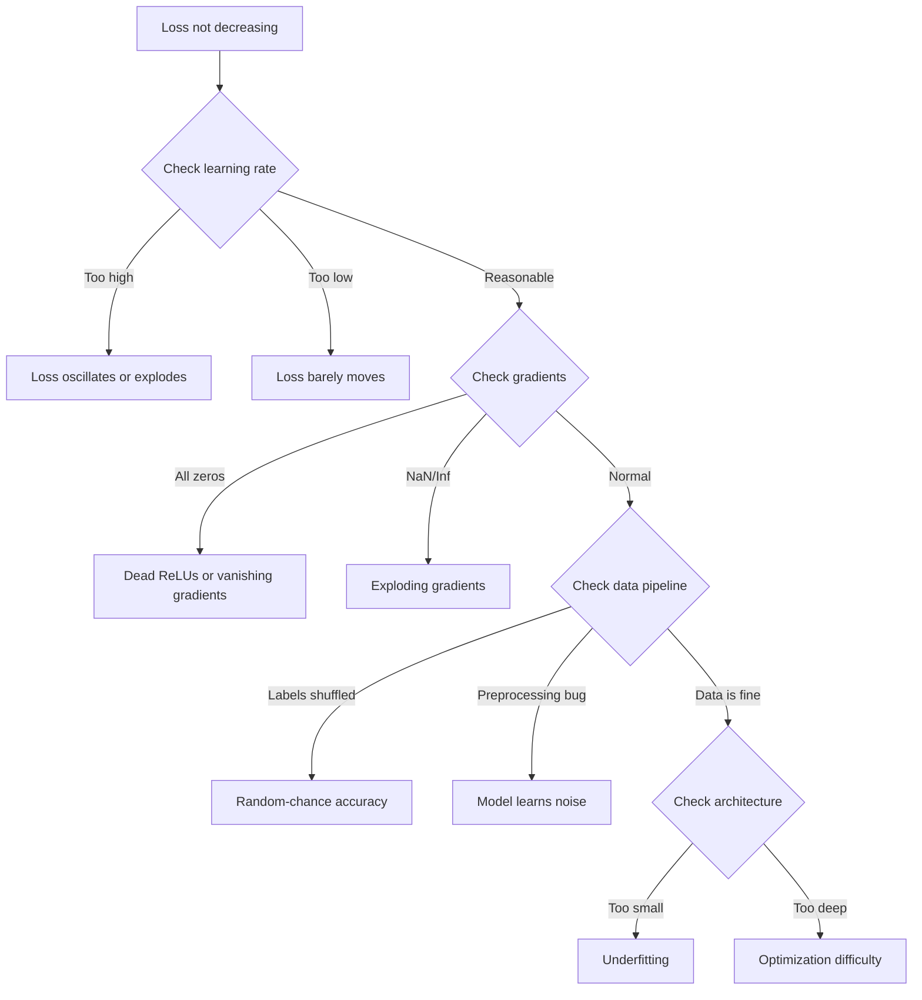
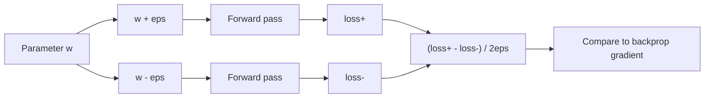
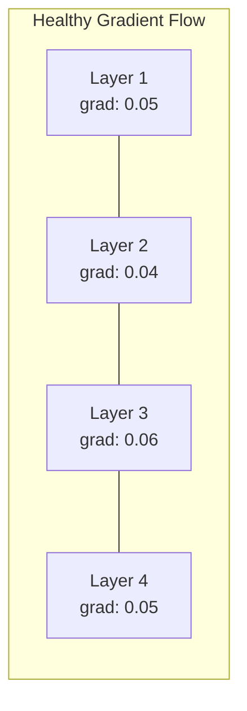
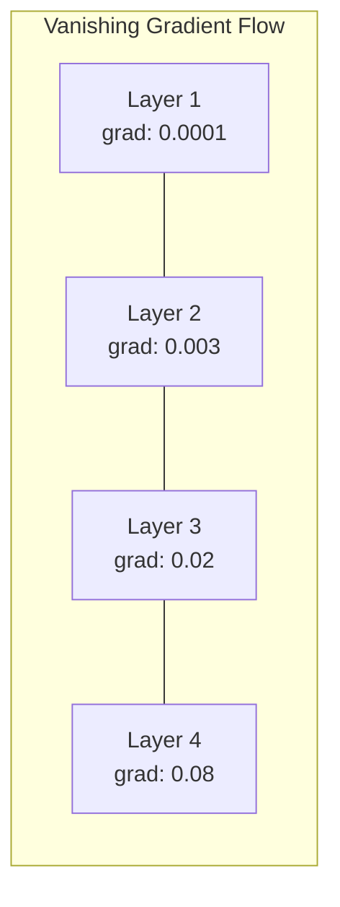
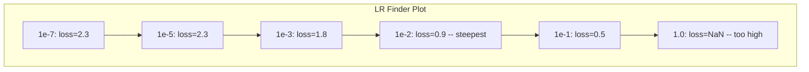

# 调试 Các mạng thần kinh

> Bạn mạng 编译 thành công. Nó đã hoạt động. Nó tạo ra một số. Số này là sai, và không có gì bị phá vỡ.

**类型：**Xây dựng
**语言：**Python, PyTorch
**前置要求：**Giai đoạn 03 Bài học 01-10 (đặc biệt là phát triển ngược, hàm mất mát, tối ưu hóa)
**时间：**~ 90 phút

## Học mục tiêu

- Sử dụng hệ thống hóa debugging 策略诊断常见 Neural Network故障(NaN mất 平坦的损失曲线、overfitting、oscillation)
- 应用 "overfit one batch" 技术,验证模型架构 和培训循环 是否正确
- 检查 Gradient magnitude、Activation distribution 和 weight norm, để xác định biến mất/bùng nổ Gradient  vấn đề
- Construct a debugging checklist, cover data pipeline、model architecture、Loss Function、Optimizer 和 learning rate 问题

## 问题

传统软件坏掉时会崩──零指针会抛出例外──类型不匹配 会在编译时间 失败──off-by-one lỗi 会产生明显错误的输出──

Mạng thần kinh sẽ không cho bạn sự tiện lợi như thế.

Một mạng thần kinh bị hỏng sẽ hoạt động hoàn toàn, in một giá trị mất mát, và đưa ra dự đoán. Khá lỗ có thể sẽ giảm.

Một mô hình có thể làm việc và một mô hình bị hỏng  thường chỉ khác nhau một dòng mã đặt sai vị trí: thiếu `zero_grad()`、转置的尺寸、偏差 10x 的学习率──经典的"Recipe for Training Neural Networks" (Phác thảo về đào tạo mạng thần kinh) ]]2019)开篇就说:"Những lỗi mạng thần kinh phổ biến nhất là lỗi không bị hỏng".

Bài học này sẽ dạy cho bạn tìm ra những con bọ này.

## 核心概念

### Làm sai lầm về tư duy

忘记打印和喷涂 式调试.                                                                                                                                                                                                                                                         

黄金法则:**从简单开始，一次只增加一个复杂度，并独立验证每一部分。**



### Bệnh 1: Loss 不下降

Đó là những lời phàn nàn phổ biến nhất. Chuyện tập luyện trong quá trình vận hành, thời đại không ngừng tiến lên, và mất mát vẫn giữ bình thường hoặc dao động mạnh mẽ.

**错误的 learning rate。**太高: mất dao động hoặc nhảy lên NaN。太低: mất giảm rất chậm, trông giống như là bình thường。 đối với Adam, từ 1e-3 开始。 đối với SGD, từ 1e-1 hoặc 1e-2 开始。 trước khi quyết định có vấn đề ở những nơi khác,始终尝试 3 个相差 10x của tỷ lệ học tập(ví dụ như 1e-2、1e-3、1e-4)。

**Dead ReLUs。**Nếu một tế bào thần kinh ReLU  nhận được một lượng lớn đầu vào tiêu cực, nó sẽ phát ra 0, và Gradient của nó là 0── nó sẽ không hoạt động nữa── nếu đủ nhiều tế bào thần kinh chết, mạng sẽ không thể học── kiểm tra phương pháp: in mỗi lớp ReLU  sau khi hoạt động 精确等于0比例── nếu >50% đã chết, chuyển sang LeakyReLU hoặc giảm tỷ lệ học──

**Vanishing gradients。**Trong các mạng lưới sâu của hoạt động sigmoid hoặc tanh, Gradients trong ngược 传播时会指数级缩小── khi chúng đạt đến tầng một, gần như là ~0──前几层停止学习──修复方法: sử dụng ReLU/GELU, thêm kết nối dư thừa, hoặc sử dụng batch normalization──

**Exploding gradients。**相反问题:Gradients 指数级增长──常见于RNNs 和非常深的网络──Loss 跳到NaN──修复方法:gradient clipping(`torch.nn.utils.clip_grad_norm_`)、 giảm tốc độ học tập, hoặc tăng bình thường hóa.

### Bệnh 2: Loss giảm nhưng mô hình rất kém

Loss 下降了──đơn độ chính xác đào tạo đạt 99%── nhưng độ chính xác thử nghiệm là 55%── hoặc mô hình trên dữ liệu thực tạo ra không có ý nghĩa của đầu ra──

**Overfitting。**mô hình 记住了训练数据,而不是学习模式―― training loss和验证损失 之间的差距 会随时间变大――修复方法:更多数据、降落、减肥、早期停止、数据增长――

**Data leakage。**Dữ liệu thử nghiệm 泄漏进了训练――精度 高得可疑──常见原因:split 之前 shuffle、使用完整数据集的统计做预处理、不同分分 之间存在重复样品──修复方法:先分,再预处理,检查重复──

**Label errors。**大多数真实数据集中有 5-10%的标签是错的(Northcutt et al., 2021 -- "Tầm lẫn 标签 phổ biến trong các tập hợp thử nghiệm") ――model 学到了 noise──修复方法: sử dụng học tập tự tin 找出并修复标签 sai, hoặc sử dụng cắt giảm lỗ 忽略 các mẫu mất mát cao──

### Bệnh 3: Sự xuất hiện của NaN hoặc Inf trong mất mát

giá trị mất mát  biến thành `nan`Hoặc`inf`❖ Tập luyện đã thất bại

**Learning rate 太高。**Các cập nhật cấp độ 跨得太远, dẫn đến trọng lượng nổ──修复方法:降低10x──

**log(0) 或 log(negative)。**Sự mất mát trần gian của entropy 会计算 `log(p)`Nếu mô hình của bạn 输出 xác định 0 hoặc âm xác suất, log sẽ nổ.`[eps, 1-eps]`, trong số đó `eps=1e-7`

**除以零。**Phân hợp chuẩn hóa Nhóm được phân loại với lệch chuẩn. Nhóm các giá trị liên tục có std=0──修复方法:在分母中添加epsilon.

**Numerical overflow。**输入 `exp()`会产生 Inf――Softmax 尤其容易出现这种问题──修复方法: 在指数化之前减去 max(log-sum-exp trick)──

### Kỹ thuật 1: Kiểm tra độ

Để so sánh gradient phân tích của bạn (được so sánh từ backprop) với gradient số (được so sánh từ sự khác biệt hữu hạn). Nếu chúng không phù hợp, hãy cho biết ngược đi có lỗi.

参数 `w`của gradient số:

```
grad_numerical = (loss(w + eps) - loss(w - eps)) / (2 * eps)
```

Một致性指标 (trái độ tương đối):

```
rel_diff = |grad_analytical - grad_numerical| / max(|grad_analytical|, |grad_numerical|, 1e-8)
```

Nếu `rel_diff < 1e-5`Đúng vậy.`rel_diff > 1e-3`Có một con bọ.



### Kỹ thuật 2:Tương kê hoạt động

Trong thời gian đào tạo  Monitoring mỗi tầng sau kích hoạt trung bình và lệch tiêu chuẩn  Các mạng khỏe mạnh sẽ giữ trung bình 接近 0 std 接近 1 在正常化 后), hoặc ít nhất giữ có giới hạn 

| Health indicator | Mean | Std | Diagnosis |
|-----------------|------|-----|-----------|
| Healthy | ~0 | ~1 | Network 正常学习 |
| Saturated | >>0 or <<0 | ~0 | Activations 卡在极端值 |
| Dead | 0 | 0 | Neurons 已经 dead（全为零） |
| Exploding | >>10 | >>10 | Activations 无界增长 |

### Kỹ thuật 3:Tình hình hóa cấp độ

绘制 mỗi tầng của mức độ độ trung bình Gradient magnitudes. Trong mạng lưới của sức khỏe, các tầng của các tầng độ độ độ độ độ độ độ độ độ độ độ độ độ độ độ độ độ độ độ độ độ độ độ độ độ độ độ độ độ độ độ độ độ độ độ độ độ độ độ độ độ độ độ độ độ độ độ độ độ độ độ độ độ độ độ độ độ độ độ độ độ độ độ độ độ độ độ độ độ độ độ độ độ độ độ độ độ độ độ độ độ độ độ độ độ độ độ độ độ độ độ độ độ độ độ độ độ độ độ độ độ độ độ độ độ độ độ độ độ độ độ độ độ độ độ độ độ độ độ độ độ độ độ độ độ độ độ độ độ độ độ độ độ độ độ độ độ độ độ độ độ độ độ độ độ độ độ độ độ độ độ độ độ độ độ độ độ độ độ độ độ độ độ độ độ độ độ độ độ độ độ độ độ độ độ độ độ độ độ độ độ độ độ độ độ độ độ độ độ độ độ độ độ độ độ độ độ độ độ độ độ độ độ độ độ độ độ độ độ độ độ độ độ độ độ độ độ độ độ độ độ độ độ độ độ độ độ độ độ độ độ độ độ độ độ độ độ độ độ độ độ độ độ độ độ độ độ độ độ độ độ độ độ độ độ độ độ độ độ độ độ độ độ độ độ độ độ độ độ độ độ độ độ độ độ độ độ độ độ độ độ độ độ độ độ độ độ độ độ độ độ độ độ độ độ độ độ độ độ độ độ độ độ độ độ độ độ độ độ độ độ độ độ độ độ độ độ độ độ độ độ độ độ độ độ độ độ độ độ độ độ độ độ độ độ độ độ độ độ độ độ độ độ độ độ độ độ độ độ độ độ độ độ độ độ độ độ độ độ độ độ độ độ độ độ độ độ độ độ độ độ độ độ độ độ độ độ độ độ độ độ độ độ độ độ độ độ độ độ độ độ độ độ độ độ độ độ độ độ độ độ độ độ độ độ độ độ độ độ độ độ độ độ độ độ độ độ độ độ độ độ độ độ độ độ độ độ độ độ độ độ độ độ độ độ độ độ độ độ độ độ độ độ độ độ độ độ độ độ độ độ độ độ độ độ độ độ độ độ độ độ độ độ độ độ độ độ độ độ độ độ độ độ độ độ độ độ độ độ độ độ





### Kỹ thuật 4: Kiểm tra Overfit-One-Batch

Đây là một trong những kỹ thuật đào tạo sâu quan trọng nhất.

取一个小批(8-32个样本) ―― 在它上训练100+ lặp lại──损失 应该接近零,训练精度 应该达到100%──如果没有,说明你的模型或训练循环有根本性 bug,不要继续进行完整训练──

Cái này có thể bắt được:
- 损坏 của Loss Functions
- 损坏 của ngược đi
- Kiến trúc 太小,无法表示数据
- Optimizer  không kết nối đến các tham số mô hình
- Dữ liệu và nhãn chưa được đối diện

Nó chỉ mất 30 giây để chạy, nhưng có thể tiết kiệm được vài giờ để sửa lỗi của các chuyến tập luyện hoàn chỉnh.

### Kỹ thuật 5:Tình tìm tỷ lệ học tập

Leslie Smith(2017) đưa ra, trong một thời đại 内将学习率从很小(1e-7)sweep到很大(10), đồng thời ghi lại mất mát──绘制 mất mát so với học tập率──最佳学习率 大约是损失 开始最快下降处再小 10x 的率──



Trong số đó là LR tốt nhất: ~ 1e-3 ((đỉnh nhất 之前一个数级) 。

### 常见 Côn trùng PyTorch

Đây là những lỗi của cộng đồng PyTorch trong thời gian lãng phí nhất:

| Bug | Symptom | Fix |
|-----|---------|-----|
| 忘记 `optimizer.zero_grad()` | Gradients 在 batches 之间累积，loss oscillates | 在 `loss.backward()` 之前添加 `optimizer.zero_grad()` |
| test time 忘记 `model.eval()` | Dropout 和 batch norm 行为不同，test accuracy 在不同 runs 之间变化 | 添加 `model.eval()` 和 `torch.no_grad()` |
| 错误的 tensor shapes | Silent broadcasting 产生错误结果，没有报错 | debugging 期间在每个 operation 后打印 shapes |
| CPU/GPU mismatch | `RuntimeError: expected CUDA tensor` | 对 model 和 data 都使用 `.to(device)` |
| 没有 detach tensors | Computation graph 不断增长，OOM | 使用 `.detach()` 或 `with torch.no_grad()` |
| In-place operations 破坏 autograd | `RuntimeError: modified by in-place operation` | 将 `x += 1` 替换为 `x = x + 1` |
| Data 未 normalized | Loss 卡在 random-chance 水平 | 将 inputs normalize 到 mean=0, std=1 |
| Labels dtype 错误 | Cross-entropy 期望 `Long`，却得到 `Float` | 转换 labels：`labels.long()` |

### Bảng giải lỗi chủ

| Symptom | Likely cause | First thing to try |
|---------|-------------|-------------------|
| Loss 卡在 -log(1/num_classes) | Model 正在预测 uniform distribution | 检查 data pipeline，验证 labels 匹配 inputs |
| 几步后 Loss NaN | Learning rate 太高 | 将 LR 降低 10x |
| Loss 立即 NaN | log(0) 或除以零 | 在 log/division operations 中添加 epsilon |
| Loss 剧烈 oscillating | LR 太高或 batch size 太小 | 降低 LR，增大 batch size |
| Loss 下降后 plateau | LR 对 fine-tuning phase 来说太高 | 添加 LR schedule（cosine 或 step decay） |
| Training acc 高，test acc 低 | Overfitting | 添加 dropout、weight decay、更多数据 |
| Training acc = test acc = chance | Model 没有学到任何东西 | 运行 overfit-one-batch test |
| Training acc = test acc 但都很低 | Underfitting | 更大的 model、更多 layers、更多 features |
| Gradients 全为零 | Dead ReLUs 或 detached computation graph | 切换到 LeakyReLU，检查 `.requires_grad` |
| Training 期间 out of memory | Batch 太大或 graph 未释放 | 降低 batch size，在 eval 使用 `torch.no_grad()` |


```figure
learning-curves
```

##  xây dựng nó

Một bộ dụng cụ chẩn đoán, được sử dụng để giám sát kích hoạt, gradient và đường cong mất mát. Bạn sẽ cố tình phá hủy một mạng lưới, và sử dụng bộ dụng cụ này để chẩn đoán mọi vấn đề.

### 步骤 1: Tầng lớp NetworkDebugger

Hook đến mô hình PyTorch Trong, ghi lại kích hoạt và số liệu thống kê gradient của mỗi tầng.

```python
import torch
import torch.nn as nn
import math


class NetworkDebugger:
    def __init__(self, model):
        self.model = model
        self.activation_stats = {}
        self.gradient_stats = {}
        self.loss_history = []
        self.lr_losses = []
        self.hooks = []
        self._register_hooks()

    def _register_hooks(self):
        for name, module in self.model.named_modules():
            if isinstance(module, (nn.Linear, nn.Conv2d, nn.ReLU, nn.LeakyReLU)):
                hook = module.register_forward_hook(self._make_activation_hook(name))
                self.hooks.append(hook)
                hook = module.register_full_backward_hook(self._make_gradient_hook(name))
                self.hooks.append(hook)

    def _make_activation_hook(self, name):
        def hook(module, input, output):
            with torch.no_grad():
                out = output.detach().float()
                self.activation_stats[name] = {
                    "mean": out.mean().item(),
                    "std": out.std().item(),
                    "fraction_zero": (out == 0).float().mean().item(),
                    "min": out.min().item(),
                    "max": out.max().item(),
                }
        return hook

    def _make_gradient_hook(self, name):
        def hook(module, grad_input, grad_output):
            if grad_output[0] is not None:
                with torch.no_grad():
                    grad = grad_output[0].detach().float()
                    self.gradient_stats[name] = {
                        "mean": grad.mean().item(),
                        "std": grad.std().item(),
                        "abs_mean": grad.abs().mean().item(),
                        "max": grad.abs().max().item(),
                    }
        return hook

    def record_loss(self, loss_value):
        self.loss_history.append(loss_value)

    def check_loss_health(self):
        if len(self.loss_history) < 2:
            return "NOT_ENOUGH_DATA"
        recent = self.loss_history[-10:]
        if any(math.isnan(v) or math.isinf(v) for v in recent):
            return "NAN_OR_INF"
        if len(self.loss_history) >= 20:
            first_half = sum(self.loss_history[:10]) / 10
            second_half = sum(self.loss_history[-10:]) / 10
            if second_half >= first_half * 0.99:
                return "NOT_DECREASING"
        if len(recent) >= 5:
            diffs = [recent[i+1] - recent[i] for i in range(len(recent)-1)]
            if max(diffs) - min(diffs) > 2 * abs(sum(diffs) / len(diffs)):
                return "OSCILLATING"
        return "HEALTHY"

    def check_activations(self):
        issues = []
        for name, stats in self.activation_stats.items():
            if stats["fraction_zero"] > 0.5:
                issues.append(f"DEAD_NEURONS: {name} has {stats['fraction_zero']:.0%} zero activations")
            if abs(stats["mean"]) > 10:
                issues.append(f"EXPLODING_ACTIVATIONS: {name} mean={stats['mean']:.2f}")
            if stats["std"] < 1e-6:
                issues.append(f"COLLAPSED_ACTIVATIONS: {name} std={stats['std']:.2e}")
        return issues if issues else ["HEALTHY"]

    def check_gradients(self):
        issues = []
        grad_magnitudes = []
        for name, stats in self.gradient_stats.items():
            grad_magnitudes.append((name, stats["abs_mean"]))
            if stats["abs_mean"] < 1e-7:
                issues.append(f"VANISHING_GRADIENT: {name} abs_mean={stats['abs_mean']:.2e}")
            if stats["abs_mean"] > 100:
                issues.append(f"EXPLODING_GRADIENT: {name} abs_mean={stats['abs_mean']:.2e}")
        if len(grad_magnitudes) >= 2:
            first_mag = grad_magnitudes[0][1]
            last_mag = grad_magnitudes[-1][1]
            if last_mag > 0 and first_mag / last_mag > 100:
                issues.append(f"GRADIENT_RATIO: first/last = {first_mag/last_mag:.0f}x (vanishing)")
        return issues if issues else ["HEALTHY"]

    def print_report(self):
        print("\n=== NETWORK DEBUGGER REPORT ===")
        print(f"\nLoss health: {self.check_loss_health()}")
        if self.loss_history:
            print(f"  Last 5 losses: {[f'{v:.4f}' for v in self.loss_history[-5:]]}")
        print("\nActivation diagnostics:")
        for item in self.check_activations():
            print(f"  {item}")
        print("\nGradient diagnostics:")
        for item in self.check_gradients():
            print(f"  {item}")
        print("\nPer-layer activation stats:")
        for name, stats in self.activation_stats.items():
            print(f"  {name}: mean={stats['mean']:.4f} std={stats['std']:.4f} zero={stats['fraction_zero']:.1%}")
        print("\nPer-layer gradient stats:")
        for name, stats in self.gradient_stats.items():
            print(f"  {name}: abs_mean={stats['abs_mean']:.2e} max={stats['max']:.2e}")

    def remove_hooks(self):
        for hook in self.hooks:
            hook.remove()
        self.hooks.clear()
```

### 步骤 2: Thử nghiệm Overfit-One-Batch

```python
def overfit_one_batch(model, x_batch, y_batch, criterion, lr=0.01, steps=200):
    optimizer = torch.optim.Adam(model.parameters(), lr=lr)
    model.train()
    print("\n=== OVERFIT ONE BATCH TEST ===")
    print(f"Batch size: {x_batch.shape[0]}, Steps: {steps}")

    for step in range(steps):
        optimizer.zero_grad()
        output = model(x_batch)
        loss = criterion(output, y_batch)
        loss.backward()
        optimizer.step()

        if step % 50 == 0 or step == steps - 1:
            with torch.no_grad():
                preds = (output > 0).float() if output.shape[-1] == 1 else output.argmax(dim=1)
                targets = y_batch if y_batch.dim() == 1 else y_batch.squeeze()
                acc = (preds.squeeze() == targets).float().mean().item()
            print(f"  Step {step:3d} | Loss: {loss.item():.6f} | Accuracy: {acc:.1%}")

    final_loss = loss.item()
    if final_loss > 0.1:
        print(f"\n  FAIL: Loss did not converge ({final_loss:.4f}). Model or training loop is broken.")
        return False
    print(f"\n  PASS: Loss converged to {final_loss:.6f}")
    return True
```

### 步骤 3:Tình tìm tỷ lệ học tập

```python
def find_learning_rate(model, x_data, y_data, criterion, start_lr=1e-7, end_lr=10, steps=100):
    import copy
    original_state = copy.deepcopy(model.state_dict())
    optimizer = torch.optim.SGD(model.parameters(), lr=start_lr)
    lr_mult = (end_lr / start_lr) ** (1 / steps)

    model.train()
    results = []
    best_loss = float("inf")
    current_lr = start_lr

    print("\n=== LEARNING RATE FINDER ===")

    for step in range(steps):
        optimizer.zero_grad()
        output = model(x_data)
        loss = criterion(output, y_data)

        if math.isnan(loss.item()) or loss.item() > best_loss * 10:
            break

        best_loss = min(best_loss, loss.item())
        results.append((current_lr, loss.item()))

        loss.backward()
        optimizer.step()

        current_lr *= lr_mult
        for param_group in optimizer.param_groups:
            param_group["lr"] = current_lr

    model.load_state_dict(original_state)

    if len(results) < 10:
        print("  Could not complete LR sweep -- loss diverged too quickly")
        return results

    min_loss_idx = min(range(len(results)), key=lambda i: results[i][1])
    suggested_lr = results[max(0, min_loss_idx - 10)][0]

    print(f"  Swept {len(results)} steps from {start_lr:.0e} to {results[-1][0]:.0e}")
    print(f"  Minimum loss {results[min_loss_idx][1]:.4f} at lr={results[min_loss_idx][0]:.2e}")
    print(f"  Suggested learning rate: {suggested_lr:.2e}")

    return results
```

### 步骤 4:Gradient Checker

```python
def _flat_to_multi_index(flat_idx, shape):
    multi_idx = []
    remaining = flat_idx
    for dim in reversed(shape):
        multi_idx.insert(0, remaining % dim)
        remaining //= dim
    return tuple(multi_idx)


def gradient_check(model, x, y, criterion, eps=1e-4):
    model.train()
    x_double = x.double()
    y_double = y.double()
    model_double = model.double()

    print("\n=== GRADIENT CHECK ===")
    overall_max_diff = 0
    checked = 0

    for name, param in model_double.named_parameters():
        if not param.requires_grad:
            continue

        layer_max_diff = 0

        model_double.zero_grad()
        output = model_double(x_double)
        loss = criterion(output, y_double)
        loss.backward()
        analytical_grad = param.grad.clone()

        num_checks = min(5, param.numel())
        for i in range(num_checks):
            idx = _flat_to_multi_index(i, param.shape)
            original = param.data[idx].item()

            param.data[idx] = original + eps
            with torch.no_grad():
                loss_plus = criterion(model_double(x_double), y_double).item()

            param.data[idx] = original - eps
            with torch.no_grad():
                loss_minus = criterion(model_double(x_double), y_double).item()

            param.data[idx] = original

            numerical = (loss_plus - loss_minus) / (2 * eps)
            analytical = analytical_grad[idx].item()

            denom = max(abs(numerical), abs(analytical), 1e-8)
            rel_diff = abs(numerical - analytical) / denom

            layer_max_diff = max(layer_max_diff, rel_diff)
            checked += 1

        overall_max_diff = max(overall_max_diff, layer_max_diff)
        status = "OK" if layer_max_diff < 1e-5 else "MISMATCH"
        print(f"  {name}: max_rel_diff={layer_max_diff:.2e} [{status}]")

    model.float()

    print(f"\n  Checked {checked} parameters")
    if overall_max_diff < 1e-5:
        print("  PASS: Gradients match (rel_diff < 1e-5)")
    elif overall_max_diff < 1e-3:
        print("  WARN: Small differences (1e-5 < rel_diff < 1e-3)")
    else:
        print("  FAIL: Gradient mismatch detected (rel_diff > 1e-3)")
    return overall_max_diff
```

### Bước 5: Tầm phá mạng

Bây giờ sẽ áp dụng các công cụ trên mạng bị hỏng, và chẩn đoán từng vấn đề.

```python
def demo_broken_networks():
    torch.manual_seed(42)
    x = torch.randn(64, 10)
    y = (x[:, 0] > 0).long()

    print("\n" + "=" * 60)
    print("BUG 1: Learning rate too high (lr=10)")
    print("=" * 60)
    model1 = nn.Sequential(nn.Linear(10, 32), nn.ReLU(), nn.Linear(32, 2))
    debugger1 = NetworkDebugger(model1)
    optimizer1 = torch.optim.SGD(model1.parameters(), lr=10.0)
    criterion = nn.CrossEntropyLoss()
    for step in range(20):
        optimizer1.zero_grad()
        out = model1(x)
        loss = criterion(out, y)
        debugger1.record_loss(loss.item())
        loss.backward()
        optimizer1.step()
    debugger1.print_report()
    debugger1.remove_hooks()

    print("\n" + "=" * 60)
    print("BUG 2: Dead ReLUs from bad initialization")
    print("=" * 60)
    model2 = nn.Sequential(nn.Linear(10, 32), nn.ReLU(), nn.Linear(32, 32), nn.ReLU(), nn.Linear(32, 2))
    with torch.no_grad():
        for m in model2.modules():
            if isinstance(m, nn.Linear):
                m.weight.fill_(-1.0)
                m.bias.fill_(-5.0)
    debugger2 = NetworkDebugger(model2)
    optimizer2 = torch.optim.Adam(model2.parameters(), lr=1e-3)
    for step in range(50):
        optimizer2.zero_grad()
        out = model2(x)
        loss = criterion(out, y)
        debugger2.record_loss(loss.item())
        loss.backward()
        optimizer2.step()
    debugger2.print_report()
    debugger2.remove_hooks()

    print("\n" + "=" * 60)
    print("BUG 3: Missing zero_grad (gradients accumulate)")
    print("=" * 60)
    model3 = nn.Sequential(nn.Linear(10, 32), nn.ReLU(), nn.Linear(32, 2))
    debugger3 = NetworkDebugger(model3)
    optimizer3 = torch.optim.SGD(model3.parameters(), lr=0.01)
    for step in range(50):
        out = model3(x)
        loss = criterion(out, y)
        debugger3.record_loss(loss.item())
        loss.backward()
        optimizer3.step()
    debugger3.print_report()
    debugger3.remove_hooks()

    print("\n" + "=" * 60)
    print("HEALTHY NETWORK: Correct setup for comparison")
    print("=" * 60)
    model_good = nn.Sequential(nn.Linear(10, 32), nn.ReLU(), nn.Linear(32, 2))
    debugger_good = NetworkDebugger(model_good)
    optimizer_good = torch.optim.Adam(model_good.parameters(), lr=1e-3)
    for step in range(50):
        optimizer_good.zero_grad()
        out = model_good(x)
        loss = criterion(out, y)
        debugger_good.record_loss(loss.item())
        loss.backward()
        optimizer_good.step()
    debugger_good.print_report()
    debugger_good.remove_hooks()

    print("\n" + "=" * 60)
    print("OVERFIT-ONE-BATCH TEST (healthy model)")
    print("=" * 60)
    model_test = nn.Sequential(nn.Linear(10, 32), nn.ReLU(), nn.Linear(32, 2))
    overfit_one_batch(model_test, x[:8], y[:8], criterion)

    print("\n" + "=" * 60)
    print("LEARNING RATE FINDER")
    print("=" * 60)
    model_lr = nn.Sequential(nn.Linear(10, 32), nn.ReLU(), nn.Linear(32, 2))
    find_learning_rate(model_lr, x, y, criterion)

    print("\n" + "=" * 60)
    print("GRADIENT CHECK")
    print("=" * 60)
    model_grad = nn.Sequential(nn.Linear(10, 8), nn.ReLU(), nn.Linear(8, 2))
    gradient_check(model_grad, x[:4], y[:4], criterion)
```

## Sử dụng nó

### PyTorch Built-in Tools

```python
import torch
import torch.nn as nn

model = nn.Sequential(
    nn.Linear(768, 256),
    nn.ReLU(),
    nn.Linear(256, 10),
)

with torch.autograd.detect_anomaly():
    output = model(input_tensor)
    loss = criterion(output, target)
    loss.backward()

for name, param in model.named_parameters():
    if param.grad is not None:
        print(f"{name}: grad_mean={param.grad.abs().mean():.2e}")
```

### Đánh nặng & Bias 集成

```python
import wandb

wandb.init(project="debug-training")

for epoch in range(100):
    loss = train_one_epoch()
    wandb.log({
        "loss": loss,
        "lr": optimizer.param_groups[0]["lr"],
        "grad_norm": torch.nn.utils.clip_grad_norm_(model.parameters(), float("inf")),
    })

    for name, param in model.named_parameters():
        if param.grad is not None:
            wandb.log({f"grad/{name}": wandb.Histogram(param.grad.cpu().numpy())})
```

### TensorBoard

```python
from torch.utils.tensorboard import SummaryWriter

writer = SummaryWriter("runs/debug_experiment")

for epoch in range(100):
    loss = train_one_epoch()
    writer.add_scalar("Loss/train", loss, epoch)

    for name, param in model.named_parameters():
        writer.add_histogram(f"weights/{name}", param, epoch)
        if param.grad is not None:
            writer.add_histogram(f"gradients/{name}", param.grad, epoch)
```

### Debug Checklist (đơn vị kiểm tra kỹ thuật)

1. 运行 Overfit-one-batch test. Nếu thất bại, dừng lại.
2. 打印 mô hình tổng kết, xác nhận số parameter 合理。
3. Sử dụng dữ liệu ngẫu nhiên 运行 một lần đi trước, kiểm tra hình thức đầu ra.
4. Tren 5 thời đại, chứng minh mất đi.
5. 检查 kích hoạt thống kê: không có lớp chết, không có vụ nổ.
6. Chuyển độ lưu lượng: không biến mất, không nổ.
7. 验证 data pipeline:打印 5 mẫu ngẫu nhiên 及其标签。

## 交付 nó

本课会产出:
- `outputs/prompt-nn-debugger.md`-- dùng để chẩn đoán sự thất bại trong đào tạo mạng thần kinh
- `outputs/skill-debug-checklist.md`-- dùng để chỉnh sửa các vấn đề đào tạo của danh sách kiểm tra cây quyết định

debugging của các mô hình triển khai quan trọng:
- Kỹ thuật đào tạo sản xuất 添加 giám sát
- Mỗi N bước sẽ kích hoạt và thống kê gradient  ghi đến W&B hoặc TensorBoard
- Để mất các tế bào thần kinh chết (> 80% không) hoặc nổ gradient
- Mỗi lần sửa đổi kiến trúc hoặc đường ống dữ liệu 时,始终运行 Overfit-one-batch test

## 练习

1. **添加 exploding gradient detector。**修改 `NetworkDebugger`, để nó kiểm tra gradient bất cứ khi nào vượt qua ngưỡng, và tự động đề xuất giá trị cắt gradient.

2. **构建 dead neuron resurrector。**编写 một hàm, nhận dạng các tế bào thần kinh ReLU chết ((始终输出 0),并 sử dụng khởi đầu Kaiming 重新初始化它们的输入重量──展示这能恢复一个>70% các tế bào thần kinh đã chết mạng──

3. **实现带 plotting 的 learning rate finder。**扩展 `find_learning_rate`, sẽ lưu kết quả cho CSV, và biên tập một bản viết độc lập đọc CSV, sử dụng matplotlib  hiển thị đường cong LR vs mất mát, nhận ra CIFAR-10 trên ResNet-18 của tối ưu LR.

4. **创建 data pipeline validator。**编写一个函数,检查:train/test split 之间复制样本、标签分布不平衡(>10:1 tỷ lệ)、输入正常化(mean 接近 0,std 接近 1),以及数据中的 NaN/Inf值──在一个故意腐败的数据集 上运行它──

5. **Debug 一个真实 failure。**Sử dụng Lesson 10 中的 mini-framework,引入一个微妙 bug(例如,在后向中转置权力矩阵),并使用梯度检查 精确定位哪个参数的梯度 不正确――记录调试过程──

## 关键术语

| Term | What people say | What it actually means |
|------|----------------|----------------------|
| Silent bug | "它能运行，但结果很差" | 不产生错误但降低 model quality 的 bug，是 ML 中占主导的 failure mode |
| Dead ReLU | "neurons 死了" | 输入始终为负的 ReLU neuron，因此它输出 0，并永久接收 0 Gradient |
| Vanishing gradients | "Early layers 停止学习" | Gradients 在 layers 中指数级缩小，使 early layers 的 weights 实际上被冻结 |
| Exploding gradients | "Loss 变成了 NaN" | Gradients 在 layers 中指数级增长，导致 weight updates 大到 overflow |
| Gradient checking | "验证 backprop 是否正确" | 将 backprop 得到的 analytical gradients 与 finite differences 得到的 numerical gradients 比较 |
| Overfit-one-batch | "最重要的 debug test" | 在单个小 batch 上训练，以验证 model 是否能学习；如果不能，说明存在根本性问题 |
| LR finder | "Sweep 以找到正确的 learning rate" | 在一个 epoch 内指数级增大 learning rate，并选择 loss diverge 前的 rate |
| Data leakage | "Test data 泄漏进 training" | test set 的信息污染了 training，产生人为偏高的 accuracy |
| Activation statistics | "监控 layer health" | 跟踪每层 output 的 mean、std 和 zero-fraction，以检测 dead、saturated 或 exploding neurons |
| Gradient clipping | "限制 Gradient magnitude" | 当 Gradients 的 norm 超过 threshold 时将其缩小，防止 exploding gradient updates |

## 延伸阅读

- Smith, "Tỷ lệ học tập chu kỳ cho đào tạo mạng thần kinh" (2017) -- 提出 learning rate range test (được đề xuất là kiểm tra phạm vi học tập)
- Northcutt et al., "Thầm lẫn nhãn phổ biến trong các bộ thử nghiệm làm mất ổn định các tiêu chuẩn học máy" (2021) -- chứng minh ImageNet、CIFAR-10 và các tiêu chuẩn chính khác trong số đó có 3-6% các nhãn là sai lầm
- Zhang et al., "Giả sử học sâu đòi hỏi phải suy nghĩ lại về tổng quát" (2017) -- This article paper show Neural Networks can remember random labels, this is also overfit-one-batch test 有效的原因
- Tài liệu PyTorch 中关于 `torch.autograd.detect_anomaly`和 `torch.autograd.set_detect_anomaly`của tích hợp phát hiện NaN/Inf
