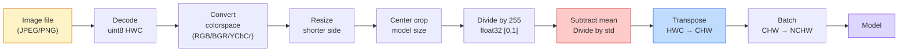
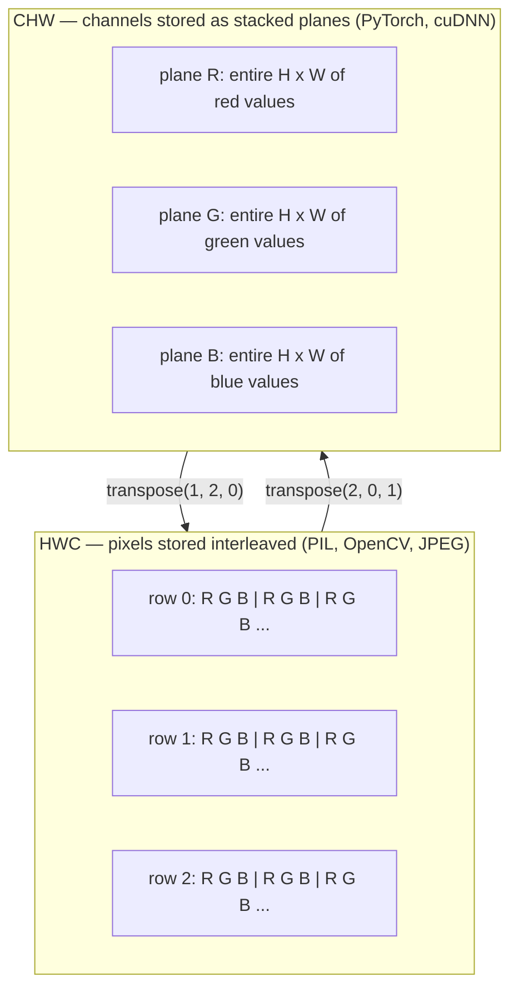

# 图像基础  Pixel、Channel、Color Spaces

> Hình ảnh là một hình ảnh quang học. Mỗi mô hình hình ảnh mà bạn sẽ sử dụng sau đó, đều bắt đầu từ thực tế này.

**类型：**Xây dựng
**语言：**Python
**前置要求：**Giai đoạn 1 Bài học 12 (Hành động áp lực), Giai đoạn 3 Bài học 11 (Tâm nhập vào PyTorch)
**时间：**45 phút

## Học mục tiêu

- Giải thích các cảnh tiếp theo được phân tán thành Pixel, cũng như lý do tại sao việc lựa chọn và định lượng quyết định sẽ quyết định giới hạn trên của mỗi mô hình dưới
- Để xem hình ảnh như một số lượng số hình ảnh, đọc, cắt và kiểm tra, và làm quen với việc chuyển đổi giữa HWC và bố cục CHW
- Trong chuyển đổi giữa RGB, thang độ xám, HSV và YCbCr, và giải thích lý do tại sao mỗi không gian màu tồn tại
- 严格按照火视的预期应用 Pixel 级预处理(tự chuẩn hóa, tiêu chuẩn hóa, quy mô, kênh đầu tiên)

## 问题

Bạn sẽ đọc mỗi bài báo  tải xuống mỗi trọng lượng đã được đào tạo 调用 mỗi API tầm nhìn, tất cả giả định nhập có mã hóa cụ thể `uint8`图像传给期望 `float32`Mô hình của nó vẫn sẽ hoạt động, và nó sẽ tạo ra kết quả vô nghĩa. Đưa BGR lên mạng được đào tạo trên RGB, độ chính xác sẽ giảm mười phần trăm điểm. Khi mô hình mong đợi các kênh-đầu tiên, và bạn cho nó các kênh-khởi đầu cuối cùng, lớp conv thứ nhất sẽ coi độ cao như một kênh tính năng.

Một khi bạn biết sự xoay quanh trên những gì trượt, nó tự nó không phức tạp. Điểm khó là, một hình ảnh  đối với máy ảnh, JPEG decoder, PIL, OpenCV, torchvision và hạt nhân CUDA có ý nghĩa khác nhau. Mỗi ngăn xếp có trục tựa của riêng nó, phạm vibyte và kênh. Không thể đưa ra những ý tưởng này.

Bài học này sẽ sửa đổi cơ sở này, để nội dung tiếp theo của giai đoạn này được xây dựng trên nó. Cuối cùng, bạn sẽ biết được Pixel là gì, tại sao mỗi Pixel có ba con số thay vì một, để bình thường hóa với các thống kê của ImageNet.

## 概念

### 完整预处理 đường ống dẫn

Mỗi hệ thống tầm nhìn cấp sản xuất đều là một chuỗi biến đổi ngược. Bất cứ bước nào đi sai, đầu vào của mô hình sẽ khác với đầu vào trong thời gian tập luyện.



2 khung màu đỏ và màu xanh là nơi 80% sự yên tĩnh thất bại xảy ra: thiếu tiêu chuẩn hóa, cũng như bố cục 错误──

### Pixel là mẫu, không phải hình chữ số

Cảm biến máy ảnh sẽ được phân tích trong một số nhỏ photon trên lưới. Mỗi cảm biến trong một thời gian nhỏ sẽ tạo ra một điện áp tương ứng với số lượng photon chạm vào nó. Sau đó cảm biến sẽ phân tán điện áp đó thành một số nguyên.

```
Continuous scene                 Sensor grid                     Digital image
(infinite detail)                (H x W detectors)               (H x W integers)

    ~~~~~                        +--+--+--+--+--+                 210 198 180 155 120
   ♪ ♪ Tôi đã làm gì ♪ ♪ ♪ Tôi đã làm gì ♪
  - - - - - - - - - - - - - - - - - - - - - - - - - - - - - - - - - - - - - - - - - - - - - - - - - - - - - - - - - - - - - - - - - - - - - - - - - - - - - - - - - - - - - - - - - - - - - - - - - - - - - - - - - - - - - - - - - - - - - - - - - - - - - - - - - - - - - - - - - - - - - - - - - - - - - - - - - - - - - - - - - - - - - - - - - - - - - - - - - - - - - - - - - - - - - - - - - - - - - - - - - - - - - - - - - - - - - - - - - - - - - - - - - - - - - - - - - - - - - - - - - - - - - - - - - - - - - - - - - - - - - - - - - - - - - - - - - - - - - - - - - - - - - - - - - - - - - - - - - - - - - - - - - - - - - - - - - - - - - - - - - - - - - - - - - - - - - - - - - - - - - - - - - - - - - - - - - - - - - - - - - - - - - - - - - - - - - - - - - - - - - - - - - - - - - - - - - - - - - - - - - - - - - - - - - - - - - - - - - - - - - - - - - - - - - - - - - - - - - - - - - - - - - - - - - - - - - - - - - - - - - - - - - - - - - - - - - - - - - - - - - - - - - - - - - - - - - - - - - - - - - - - - - - - - - -
   ~~~~~                         |  |  |  |  |  |                 195 185 170 148 112
                                 +--+--+--+--+--+                 188 180 165 145 108
```

Bước này sẽ xảy ra hai lựa chọn, chúng quyết định giới hạn trên tất cả các nhiệm vụ dưới đây:

- **Spatial sampling**Quyết định từng lần trong trường hợp đối phó với bao nhiêu máy dò.
- **Intensity quantization**quyết định điện áp được phân tích nhiều hơn nhỏ hơn: 8 bit cung cấp 256 cấp độ, là tiêu chuẩn hiển thị: 10、12、16 bit cung cấp một gradient dễ dàng hơn, rất quan trọng đối với hình ảnh y tế、HDR và ống dẫn cảm biến nguyên liệu

Pixel không phải là một khối màu nhỏ, khối hình. Nó là một phép đo đơn lẻ.

### Tại sao có ba kênh?

Một bộ cảm biến sẽ kiểm tra toàn bộ quang phổ có thể nhìn thấy, đó là thang xám. Để có được màu sắc, bộ cảm biến sẽ sử dụng màu đỏ, màu xanh, màu xanh dương, màu sắc màu sắc màu sắc màu sắc màu sắc màu sắc màu sắc màu sắc màu sắc màu sắc màu sắc màu sắc màu sắc màu sắc màu sắc màu sắc màu sắc màu sắc màu sắc màu sắc màu sắc màu sắc màu sắc màu sắc màu sắc màu sắc màu sắc màu sắc màu sắc màu sắc màu sắc màu sắc màu sắc màu sắc màu sắc màu sắc màu sắc màu sắc màu sắc màu sắc màu sắc màu sắc màu sắc màu sắc màu sắc màu sắc màu sắc màu sắc màu sắc màu sắc màu sắc màu sắc màu sắc màu sắc màu sắc màu sắc màu sắc màu sắc màu sắc màu sắc màu sắc màu sắc màu sắc màu sắc màu sắc màu sắc màu sắc màu sắc màu sắc màu sắc màu sắc màu sắc màu sắc màu sắc màu sắc màu sắc màu sắc màu sắc màu sắc màu sắc màu sắc màu sắc màu sắc màu sắc màu sắc màu sắc màu sắc màu sắc màu sắc màu sắc màu sắc màu sắc màu sắc màu sắc màu sắc màu sắc màu sắc màu sắc màu sắc màu sắc màu sắc màu sắc màu sắc màu sắc màu sắc màu sắc màu sắc màu sắc màu sắc màu sắc màu sắc màu sắc màu sắc màu sắc màu sắc màu sắc màu sắc màu sắc màu sắc màu sắc màu sắc màu sắc màu sắc màu sắc màu sắc màu sắc màu sắc màu sắc màu sắc màu sắc màu sắc màu sắc màu sắc màu sắc màu sắc màu sắc màu sắc màu sắc màu sắc màu sắc màu sắc màu sắc màu sắc màu sắc màu sắc màu sắc màu sắc màu sắc màu sắc màu sắc màu sắc màu sắc màu sắc màu sắc màu sắc màu sắc màu sắc màu sắc màu sắc màu sắc màu sắc màu sắc màu sắc màu sắc màu sắc màu sắc màu sắc màu sắc màu sắc màu sắc màu sắc màu sắc màu sắc màu sắc màu sắc màu sắc màu sắc màu sắc màu sắc màu sắc màu sắc màu sắc màu sắc màu sắc màu sắc màu sắc màu sắc màu sắc màu sắc màu sắc màu sắc màu sắc màu sắc màu sắc màu sắc màu sắc màu sắc màu sắc màu sắc màu sắc màu sắc màu sắc màu sắc màu sắc màu sắc màu sắc màu sắc màu sắc màu sắc màu sắc màu sắc màu sắc màu sắc màu sắc màu sắc màu sắc màu sắc màu sắc màu sắc màu sắc màu sắc màu sắc màu sắc màu sắc màu sắc màu sắc màu.

```
One pixel in memory:

    (R, G, B) = (210, 140, 30)   <- reddish-orange

An H x W RGB image:

    shape (H, W, 3)     stored as   H rows of W pixels of 3 values
                                    each in [0, 255] for uint8
```

三并不奇奇怪──thường ảnh sâu sẽ thêm kênh Z──thế vệ tinh sẽ thêm băng hồng ngoại và cực tím──thường là có một kênh(X-ray、CT) hoặc nhiều kênh(hyperspectral)──Trong số kênh là trục cuối cùng;conv layer 会学习跨频道 混合──

### 两种布局公约: HWC 和 CHW

Cùng một Tensor, hai thứ tự. Mỗi người sẽ chọn một trong số đó.

```
HWC (height, width, channels)           CHW (channels, height, width)

   W ->                                    H ->
  +-----+-----+-----+                     +-----+-----+
H |R G B|R G B|R G B|                   C |R R R R R R|
| +-----+-----+-----+                   | +-----+-----+
v |R G B|R G B|R G B|                   v |G G G G G G|
  +-----+-----+-----+                     +-----+-----+
                                          |B B B B B B|
                                          +-----+-----+

   PIL, OpenCV, matplotlib,              PyTorch, most deep learning
   almost every image file on disk       frameworks, cuDNN kernels
```

CHW tồn tại vì hạt nhân convolution 会沿 H 和 W 滑动──把 kênh trục  đặt trước, có nghĩa là mỗi hạt nhân đều có thể nhìn thấy mỗi kênh trên liên tục 2D máy bay, để làm sạch đất Vector 化── giữ định dạng đĩa HWC, vì cảm biến này phù hợp 输出 scanline 方式──

Bạn sẽ nhập vào 1000 lần chuyển đổi:

```
img_chw = img_hwc.transpose(2, 0, 1)      # NumPy
img_chw = img_hwc.permute(2, 0, 1)        # PyTorch tensor
```

Layout bộ nhớ 可视化:



### Phạm vi byte và dtype

三种公约 最常见:

| Convention | dtype | Range | 你会在哪里见到它 |
|------------|-------|-------|------------------|
| Raw | `uint8` | [0, 255] | Disk 上的文件、PIL、OpenCV output |
| Normalized | `float32` | [0.0, 1.0] | `img.astype('float32') / 255` 之后 |
| Standardized | `float32` | 大约 [-2, +2] | 减去 mean 并除以 std 之后 |

Mạng lưới liên kết là trong đầu vào tiêu chuẩn hóa trên đào tạo của.`mean=[0.485, 0.456, 0.406]``std=[0.229, 0.224, 0.225]`là trong bộ đào tạo ImageNet hoàn chỉnh 上, đối với [0, 1] bình thường hóa Pixel 计算得到的三个频道的算法平均和标准偏差──把原`uint8`输入给期望的标准化浮游模型, là một trong những quan điểm ứng dụng thường gặp nhất trong sự thất bại lặng lẽ.

### Không gian màu sắc và tại sao chúng tồn tại

RGB là định dạng chụp, nhưng nó không phải luôn luôn là biểu hiện hữu ích nhất cho mô hình.

```
 RGB               HSV                       YCbCr / YUV

 R red             H hue (angle 0-360)       Y luminance (brightness)
 G green           S saturation (0-1)        Cb chroma blue-yellow
 B blue            V value/brightness (0-1)  Cr chroma red-green

 Linear to         Separates color from      Separates brightness from
 sensor output     brightness. Useful for    color. JPEG and most video
                   color thresholding, UI    codecs compress the chroma
                   sliders, simple filters   channels harder because the
                                             human eye is less sensitive
                                             to chroma detail than to Y.
```

Đối với hầu hết các đài CNN hiện đại, bạn sẽ tham gia RGB. Bạn sẽ gặp gỡ các không gian khác trong những cảnh này:

- **HSV** mã CV cổ điển  phân đoạn dựa trên màu sắc  cân bằng trắng 
- **YCbCr** 读取 JPEG 内部、视频管线、 chỉ dựa trên mô hình siêu độ phân giải của Y trên hoạt động.
- **Grayscale** OCR  Mô hình tài liệu, cũng như bất kỳ màu sắc nào là biến gây phiền nhiễu chứ không phải là tình huống của tín hiệu.

Từ RGB 转灰度 là tăng权和, không phải là trung bình, vì mắt người nhạy cảm hơn với màu xanh lá cây so với màu đỏ hoặc xanh dương:

```
Y = 0.299 R + 0.587 G + 0.114 B       (ITU-R BT.601, the classic weights)
```

### Tỷ lệ hình ảnh, kích thước và phân cực

Mỗi mô hình có kích thước đầu vào cố định. Hầu hết các phân loại ImageNet là 224x224, bộ dò hiện đại thường sử dụng 384x384 hoặc 512x512.

- **Resize shorter side, then center crop** 标准 ImageNet recipe── giữ tỷ lệ hình ảnh, bỏ rơi một条边缘 Pixel──
- **Resize and pad** Bảo trì tỷ lệ hình ảnh và mỗi phím, thêm bên đen.
- **Resize directly to target** 拉伸图像──便宜, sẽ xoắn hình học, nhưng đối với nhiều nhiệm vụ phân loại 足够好──

Khi các mạng mới không phù hợp với các mạng cũ, phương pháp phân cực quyết định giữa các pixel làm thế nào để tính toán:

```
Nearest neighbour     fastest, blocky, only choice for masks/labels
Bilinear              fast, smooth, default for most image resizing
Bicubic               slower, sharper on upscaling
Lanczos               slowest, best quality, used for final display
```

经验法则:tren với tỷ tuyến, bạn sẽ nhìn gần tài sản với bicubic hoặc lanczos, bất cứ thứ gì có chứa số ID lớp toàn bộ với gần nhất.


```figure
conv-output-size
```

##  xây dựng nó

### 步骤 1: tải hình ảnh và kiểm tra hình dạng

Sử dụng Pillow tải bất kỳ JPEG hoặc PNG, chuyển đổi thành NumPy, và in ấn nội dung bạn nhận được. Để cung cấp một ví dụ xác định của hoạt động có thể được phát hành qua mạng, đây là một tập hợp hình ảnh.

```python
import numpy as np
from PIL import Image

def synthetic_rgb(h=128, w=192, seed=0):
    rng = np.random.default_rng(seed)
    yy, xx = np.meshgrid(np.linspace(0, 1, h), np.linspace(0, 1, w), indexing="ij")
    r = (np.sin(xx * 6) * 0.5 + 0.5) * 255
    g = yy * 255
    b = (1 - yy) * xx * 255
    rgb = np.stack([r, g, b], axis=-1) + rng.normal(0, 6, (h, w, 3))
    return np.clip(rgb, 0, 255).astype(np.uint8)

arr = synthetic_rgb()
# 或从 disk 加载：
# arr = np.asarray(Image.open("your_image.jpg").convert("RGB"))

print(f"type:   {type(arr).__name__}")
print(f"dtype:  {arr.dtype}")
print(f"shape:  {arr.shape}     # (H, W, C)")
print(f"min:    {arr.min()}")
print(f"max:    {arr.max()}")
print(f"pixel at (0, 0): {arr[0, 0]}")
```

预期 sản lượng:`shape: (H, W, 3)``dtype: uint8`、 phạm vi `[0, 255]`❖ Dù là bộ chuyển từ máy ảnh ◦ JPEG decoder hoặc máy phát điện tổng hợp, đây là đại diện trên đĩa.

### 步骤 2: tách kênh và sắp xếp lại

分別取出 R、G、B, sau đó chuyển từ HWC 转换 thành PyTorch sử dụng CHW。

```python
R = arr[:, :, 0]
G = arr[:, :, 1]
B = arr[:, :, 2]
print(f"R shape: {R.shape}, mean: {R.mean():.1f}")
print(f"G shape: {G.shape}, mean: {G.mean():.1f}")
print(f"B shape: {B.shape}, mean: {B.mean():.1f}")

arr_chw = arr.transpose(2, 0, 1)
print(f"\nHWC shape: {arr.shape}")
print(f"CHW shape: {arr_chw.shape}")
```

Ba phẳng thang xám, mỗi kênh một.CHW chỉ là trục xếp hạng; khi bố cục bộ nhớ được phép, nghiêm túc nói không cần sao chép dữ liệu.

### 步骤 3:Tuyền số xám và chuyển đổi HSV

+ quyền và thang xám, rồi chuyển từ RGB sang HSV.

```python
def rgb_to_grayscale(rgb):
    weights = np.array([0.299, 0.587, 0.114], dtype=np.float32)
    return (rgb.astype(np.float32) @ weights).astype(np.uint8)

def rgb_to_hsv(rgb):
    rgb_f = rgb.astype(np.float32) / 255.0
    r, g, b = rgb_f[..., 0], rgb_f[..., 1], rgb_f[..., 2]
    cmax = np.max(rgb_f, axis=-1)
    cmin = np.min(rgb_f, axis=-1)
    delta = cmax - cmin

    h = np.zeros_like(cmax)
    mask = delta > 0
    rmax = mask & (cmax == r)
    gmax = mask & (cmax == g)
    bmax = mask & (cmax == b)
    h[rmax] = ((g[rmax] - b[rmax]) / delta[rmax]) % 6
    h[gmax] = ((b[gmax] - r[gmax]) / delta[gmax]) + 2
    h[bmax] = ((r[bmax] - g[bmax]) / delta[bmax]) + 4
    h = h * 60.0

    s = np.where(cmax > 0, delta / cmax, 0)
    v = cmax
    return np.stack([h, s, v], axis=-1)

gray = rgb_to_grayscale(arr)
hsv = rgb_to_hsv(arr)
print(f"gray shape: {gray.shape}, range: [{gray.min()}, {gray.max()}]")
print(f"hsv   shape: {hsv.shape}")
print(f"hue range: [{hsv[..., 0].min():.1f}, {hsv[..., 0].max():.1f}] degrees")
print(f"sat range: [{hsv[..., 1].min():.2f}, {hsv[..., 1].max():.2f}]")
print(f"val range: [{hsv[..., 2].min():.2f}, {hsv[..., 2].max():.2f}]")
```

Hue của output đơn vị là độ, bão hòa và giá trị ở [0, 1] 中──这与 OpenCV `hsv_full`Công ước 匹配

### 步骤 4:Tình thường hóa, tiêu chuẩn hóa và ngược lại

Từ byte thô chuyển sang mô hình ImageNet được đào tạo trước 期望的精确 Tensor, sau đó chuyển lại.

```python
mean = np.array([0.485, 0.456, 0.406], dtype=np.float32)
std = np.array([0.229, 0.224, 0.225], dtype=np.float32)

def preprocess_imagenet(rgb_uint8):
    x = rgb_uint8.astype(np.float32) / 255.0
    x = (x - mean) / std
    x = x.transpose(2, 0, 1)
    return x

def deprocess_imagenet(chw_float32):
    x = chw_float32.transpose(1, 2, 0)
    x = x * std + mean
    x = np.clip(x * 255.0, 0, 255).astype(np.uint8)
    return x

x = preprocess_imagenet(arr)
print(f"preprocessed shape: {x.shape}     # (C, H, W)")
print(f"preprocessed dtype: {x.dtype}")
print(f"preprocessed mean per channel:  {x.mean(axis=(1, 2)).round(3)}")
print(f"preprocessed std  per channel:  {x.std(axis=(1, 2)).round(3)}")

roundtrip = deprocess_imagenet(x)
max_diff = np.abs(roundtrip.astype(int) - arr.astype(int)).max()
print(f"roundtrip max pixel diff: {max_diff}    # 应该是 0 或 1")
```

Trung bình mỗi kênh 应接近 0,std 接近 1──这个 preprocess/deprocess pair 正是每个 torchvision `transforms.Normalize`gọi là "nhiều gì phải làm ở tầng dưới".

### 步骤 5: Sử dụng phương pháp phân cực 3 kích thước

Trong cấp cao trên so sánh gần nhất, tỷ tuyến và hình hai, sự khác biệt sẽ rõ ràng hơn.

```python
target = (arr.shape[0] * 3, arr.shape[1] * 3)

nearest = np.asarray(Image.fromarray(arr).resize(target[::-1], Image.NEAREST))
bilinear = np.asarray(Image.fromarray(arr).resize(target[::-1], Image.BILINEAR))
bicubic = np.asarray(Image.fromarray(arr).resize(target[::-1], Image.BICUBIC))

def local_roughness(x):
    gy = np.diff(x.astype(float), axis=0)
    gx = np.diff(x.astype(float), axis=1)
    return float(np.abs(gy).mean() + np.abs(gx).mean())

for name, out in [("nearest", nearest), ("bilinear", bilinear), ("bicubic", bicubic)]:
    print(f"{name:>8}  shape={out.shape}  roughness={local_roughness(out):6.2f}")
```

Độ thô của gần nhất phân số cao nhất, vì nó giữ được cạnh cứng. Bi-linear 最平滑──Bicubic 介于两者之间, trong trường hợp không có vật tạo ra bậc thang, giữ được độ sắc giác.

## Sử dụng nó

`torchvision.transforms`Tôi sẽ đưa tất cả nội dung trên trong một đường ống hợp nhất.`preprocess_imagenet`Làm gì,并额外加入 resize 和 crop。

```python
import torch
from torchvision import transforms
from PIL import Image

img = Image.fromarray(synthetic_rgb(256, 256))

pipeline = transforms.Compose([
    transforms.Resize(256),
    transforms.CenterCrop(224),
    transforms.ToTensor(),
    transforms.Normalize(mean=[0.485, 0.456, 0.406], std=[0.229, 0.224, 0.225]),
])

x = pipeline(img)
print(f"tensor type:  {type(x).__name__}")
print(f"tensor dtype: {x.dtype}")
print(f"tensor shape: {tuple(x.shape)}      # (C, H, W)")
print(f"per-channel mean: {x.mean(dim=(1, 2)).tolist()}")
print(f"per-channel std:  {x.std(dim=(1, 2)).tolist()}")

batch = x.unsqueeze(0)
print(f"\nbatched shape: {tuple(batch.shape)}   # (N, C, H, W) — ready for a model")
```

4 bước, thứ tự phải như thế:`Resize(256)`Đặt bên ngắn hơn 缩放 đến 256;`CenterCrop(224)`Từ giữa lấy một tấm vá 224x224;`ToTensor()`Ngoài 255 và thay thế HWC thành CHW;`Normalize`减去 ImageNet nghĩa là并除以 std。颠倒这个顺序会改变到达模型的内容。

## 交付 nó

本课会产出:

- `outputs/prompt-vision-preprocessing-audit.md` Một prompt, có thể đưa bất kỳ mô hình thẻ hoặc bộ dữ liệu thẻ 转换 thành một清单,列出团队 phải tuân thủ xác định trước khi xử lý không biến.
- `outputs/skill-image-tensor-inspector.md` Một kỹ năng, cho bất kỳ hình ảnh hình Tensor hoặc mảng, báo cáo dtype, bố cục, phạm vi, cũng như nó trông là nguyên liệu, bình thường hoặc tiêu chuẩn hóa.

## 练习

1. **(Easy)**分別使用 OpenCV (`cv2.imread`(Từ 1 tháng trước đến 1 tháng trước)`(0, 0)`处的Pixel──解释 kênh-trật tự 差异, sau đó viết ra một dòng chuyển đổi, để mởCV array với Pillow array 完全一致──
2. **(Medium)**编写 `standardize(img, mean, std)` và ngược lại, make二者能在任意 uint8 image 上通过 `roundtrip_max_diff <= 1`测试── hàm của bạn phải có thể sử dụng cùng một cuộc gọi cùng lúc xử lý HWC trong một bức ảnh và NCHW trong một lô──
3. **(Hard)** lấy một Tensor tiêu chuẩn ImageNet 3 kênh, để nó thông qua một 1x1 conv, để conv học RGB đến một kênh màu xám đơn lẻ của thêm quyền hỗn hợp sẽ trọng lượng khởi động`[0.299, 0.587, 0.114]`, kết thúc chúng, và xác minh sản xuất với tay của bạn `rgb_to_grayscale`Trong phạm vi lỗi điểm nổi 匹配. Có những biến đổi không gian màu cổ điển nào có thể được viết thành 1x1 convolution?

## 关键术语

| Term | 人们的说法 | 它实际的意思 |
|------|----------------|----------------------|
| Pixel | “一个彩色方块” | 一个 grid location 上的一次光强采样；color 用三个数字，grayscale 用一个数字 |
| Channel | “颜色” | 堆叠成 image Tensor 的并行 spatial grid 之一；在 HWC 中是最后一个 axis，在 CHW 中是第一个 |
| HWC / CHW | “shape” | image Tensor 的 axis ordering；disk 和 PIL 使用 HWC，PyTorch 和 cuDNN 使用 CHW |
| Normalize | “缩放图像” | 除以 255，让 Pixel 落在 [0, 1] 中；这是必要的，但还不充分 |
| Standardize | “零中心化” | 按 channel 减去 mean 并除以 std，使 input distribution 匹配模型训练时看到的分布 |
| Grayscale conversion | “对 channel 求平均” | 使用系数 0.299/0.587/0.114 的加权和，匹配人类 luminance perception |
| Interpolation | “resize 如何选 Pixel” | 当新 grid 与旧 grid 不对齐时决定 output value 的规则；label 用 nearest，training 用 bilinear，display 用 bicubic |
| Aspect ratio | “宽高比” | 区分“resize and pad”和“resize and stretch”的 ratio |

## 延伸阅读

- [Charles Poynton — A Guided Tour of Color Space](https://poynton.ca/PDFs/Guided_tour.pdf)  Về lý do tại sao có nhiều không gian màu sắc và mỗi câu trả lời kỹ thuật quan trọng nhất và rõ ràng nhất trong thời gian
- [PyTorch Vision Transforms Docs](https://pytorch.org/vision/stable/transforms.html) Bạn đang trong sản xuất thực tế sẽ tạo ra toàn bộ chuyển đổi đường ống
- [How JPEG Works (Colt McAnlis)](https://www.youtube.com/watch?v=F1kYBnY6mwg) Đối với mẫu phụ chroma, DCT và tại sao JPEG 编码 YCbCr thay vì RGB
- [ImageNet Preprocessing Conventions (torchvision models)](https://pytorch.org/vision/stable/models.html) `mean=[0.485, 0.456, 0.406]`Nguồn quyền lực, cũng như mô hình thú trong mỗi mô hình vì sao mong đợi nó
